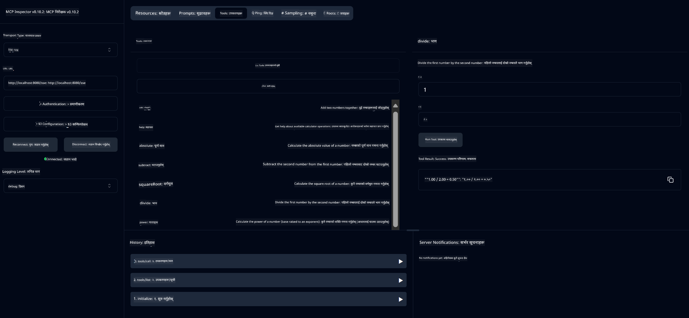

<!--
CO_OP_TRANSLATOR_METADATA:
{
  "original_hash": "13231e9951b68efd9df8c56bd5cdb27e",
  "translation_date": "2025-07-13T22:24:45+00:00",
  "source_file": "03-GettingStarted/samples/java/calculator/README.md",
  "language_code": "ne"
}
-->
# Basic Calculator MCP सेवा

यो सेवा Model Context Protocol (MCP) मार्फत Spring Boot र WebFlux ट्रान्सपोर्ट प्रयोग गरी आधारभूत क्याल्कुलेटर अपरेसनहरू प्रदान गर्छ। यो MCP कार्यान्वयनहरू सिक्न चाहने शुरुवातीहरूका लागि सरल उदाहरणको रूपमा डिजाइन गरिएको हो।

थप जानकारीका लागि [MCP Server Boot Starter](https://docs.spring.io/spring-ai/reference/api/mcp/mcp-server-boot-starter-docs.html) सन्दर्भ दस्तावेज हेर्नुहोस्।

## अवलोकन

यस सेवाले निम्न कुराहरू देखाउँछ:
- SSE (Server-Sent Events) को समर्थन
- Spring AI को `@Tool` एनोटेशन प्रयोग गरी स्वचालित उपकरण दर्ता
- आधारभूत क्याल्कुलेटर कार्यहरू:
  - जोड, घटाउ, गुणा, भाग
  - घातांक गणना र वर्गमूल
  - मोडुलस (अवशेष) र पूर्णांक मान
  - अपरेसन विवरणका लागि सहायता कार्य

## विशेषताहरू

यस क्याल्कुलेटर सेवाले निम्न क्षमताहरू प्रदान गर्छ:

1. **आधारभूत अंकगणितीय अपरेसनहरू**:
   - दुई संख्याको जोड
   - एउटा संख्या अर्कोबाट घटाउने
   - दुई संख्याको गुणा
   - एउटा संख्या अर्कोले भाग गर्ने (शून्य भाग जाँचसहित)

2. **उन्नत अपरेसनहरू**:
   - घातांक गणना (आधारलाई घातांकमा उठाउने)
   - वर्गमूल गणना (ऋणात्मक संख्या जाँचसहित)
   - मोडुलस (अवशेष) गणना
   - पूर्णांक मान गणना

3. **सहायता प्रणाली**:
   - उपलब्ध सबै अपरेसनहरूको व्याख्या गर्ने इन-बिल्ट सहायता कार्य

## सेवा प्रयोग गर्ने तरिका

सेवाले MCP प्रोटोकल मार्फत निम्न API अन्तबिन्दुहरू प्रदान गर्छ:

- `add(a, b)`: दुई संख्या जोड्ने
- `subtract(a, b)`: दोस्रो संख्या पहिलोबाट घटाउने
- `multiply(a, b)`: दुई संख्या गुणा गर्ने
- `divide(a, b)`: पहिलो संख्या दोस्रोले भाग गर्ने (शून्य जाँचसहित)
- `power(base, exponent)`: कुनै संख्याको घातांक गणना गर्ने
- `squareRoot(number)`: वर्गमूल निकाल्ने (ऋणात्मक संख्या जाँचसहित)
- `modulus(a, b)`: भाग गर्दा बाँकी रहेको अवशेष निकाल्ने
- `absolute(number)`: पूर्णांक मान निकाल्ने
- `help()`: उपलब्ध अपरेसनहरूको जानकारी प्राप्त गर्ने

## परीक्षण क्लाइन्ट

`com.microsoft.mcp.sample.client` प्याकेजमा एउटा सरल परीक्षण क्लाइन्ट समावेश छ। `SampleCalculatorClient` क्लासले क्याल्कुलेटर सेवाका उपलब्ध अपरेसनहरू प्रदर्शन गर्छ।

## LangChain4j क्लाइन्ट प्रयोग गर्ने तरिका

यो प्रोजेक्टमा `com.microsoft.mcp.sample.client.LangChain4jClient` मा LangChain4j उदाहरण क्लाइन्ट समावेश छ जसले क्याल्कुलेटर सेवा LangChain4j र GitHub मोडेलहरूसँग कसरी एकीकृत गर्ने देखाउँछ:

### पूर्वआवश्यकताहरू

1. **GitHub टोकन सेटअप**:
   
   GitHub का AI मोडेलहरू (जस्तै phi-4) प्रयोग गर्न तपाईंलाई GitHub व्यक्तिगत पहुँच टोकन चाहिन्छ:

   a. आफ्नो GitHub खाता सेटिङमा जानुहोस्: https://github.com/settings/tokens
   
   b. "Generate new token" → "Generate new token (classic)" मा क्लिक गर्नुहोस्
   
   c. टोकनलाई उपयुक्त नाम दिनुहोस्
   
   d. तलका स्कोपहरू चयन गर्नुहोस्:
      - `repo` (निजी रिपोजिटोरीहरूको पूर्ण नियन्त्रण)
      - `read:org` (संगठन र टिम सदस्यता पढ्ने, संगठन परियोजनाहरू पढ्ने)
      - `gist` (गिस्टहरू सिर्जना गर्ने)
      - `user:email` (प्रयोगकर्ताको इमेल ठेगाना पहुँच (पढ्न मात्र))
   
   e. "Generate token" मा क्लिक गरी नयाँ टोकन कपी गर्नुहोस्
   
   f. यसलाई वातावरण चर (environment variable) को रूपमा सेट गर्नुहोस्:
      
      Windows मा:
      ```
      set GITHUB_TOKEN=your-github-token
      ```
      
      macOS/Linux मा:
      ```bash
      export GITHUB_TOKEN=your-github-token
      ```

   g. स्थायी सेटअपका लागि, यसलाई सिस्टम सेटिङमार्फत वातावरण चरमा थप्नुहोस्

2. LangChain4j GitHub निर्भरता आफ्नो प्रोजेक्टमा थप्नुहोस् (pom.xml मा पहिले नै समावेश छ):
   ```xml
   <dependency>
       <groupId>dev.langchain4j</groupId>
       <artifactId>langchain4j-github</artifactId>
       <version>${langchain4j.version}</version>
   </dependency>
   ```

3. क्याल्कुलेटर सर्भर `localhost:8080` मा चलिरहेको छ भनी सुनिश्चित गर्नुहोस्

### LangChain4j क्लाइन्ट चलाउने तरिका

यस उदाहरणले देखाउँछ:
- SSE ट्रान्सपोर्ट मार्फत क्याल्कुलेटर MCP सर्भरसँग जडान गर्ने
- LangChain4j प्रयोग गरी क्याल्कुलेटर अपरेसनहरू प्रयोग गर्ने च्याट बोट बनाउने
- GitHub AI मोडेलहरूसँग एकीकृत गर्ने (हाल phi-4 मोडेल प्रयोग गर्दै)

क्लाइन्टले निम्न नमूना सोधपुछहरू पठाउँछ:
1. दुई संख्याको योग गणना गर्ने
2. कुनै संख्याको वर्गमूल निकाल्ने
3. उपलब्ध क्याल्कुलेटर अपरेसनहरूको बारेमा सहायता जानकारी प्राप्त गर्ने

उदाहरण चलाएर कन्सोल आउटपुटमा हेर्नुहोस् कि AI मोडेलले क्याल्कुलेटर उपकरणहरू कसरी प्रयोग गरी प्रश्नहरूको जवाफ दिन्छ।

### GitHub मोडेल कन्फिगरेसन

LangChain4j क्लाइन्ट GitHub को phi-4 मोडेल प्रयोग गर्न निम्न सेटिङहरूसँग कन्फिगर गरिएको छ:

```java
ChatLanguageModel model = GitHubChatModel.builder()
    .apiKey(System.getenv("GITHUB_TOKEN"))
    .timeout(Duration.ofSeconds(60))
    .modelName("phi-4")
    .logRequests(true)
    .logResponses(true)
    .build();
```

विभिन्न GitHub मोडेलहरू प्रयोग गर्न, `modelName` प्यारामिटरलाई अन्य समर्थित मोडेलमा परिवर्तन गर्नुहोस् (जस्तै "claude-3-haiku-20240307", "llama-3-70b-8192", आदि)।

## निर्भरता

प्रोजेक्टले निम्न मुख्य निर्भरता आवश्यक पर्छ:

```xml
<!-- For MCP Server -->
<dependency>
    <groupId>org.springframework.ai</groupId>
    <artifactId>spring-ai-starter-mcp-server-webflux</artifactId>
</dependency>

<!-- For LangChain4j integration -->
<dependency>
    <groupId>dev.langchain4j</groupId>
    <artifactId>langchain4j-mcp</artifactId>
    <version>${langchain4j.version}</version>
</dependency>

<!-- For GitHub models support -->
<dependency>
    <groupId>dev.langchain4j</groupId>
    <artifactId>langchain4j-github</artifactId>
    <version>${langchain4j.version}</version>
</dependency>
```

## प्रोजेक्ट निर्माण गर्ने तरिका

Maven प्रयोग गरी प्रोजेक्ट निर्माण गर्नुहोस्:
```bash
./mvnw clean install -DskipTests
```

## सर्भर चलाउने तरिका

### Java प्रयोग गरेर

```bash
java -jar target/calculator-server-0.0.1-SNAPSHOT.jar
```

### MCP Inspector प्रयोग गरेर

MCP Inspector MCP सेवाहरूसँग अन्तरक्रिया गर्न उपयोगी उपकरण हो। यस क्याल्कुलेटर सेवासँग प्रयोग गर्न:

1. नयाँ टर्मिनल विन्डोमा MCP Inspector इन्स्टल गरी चलाउनुहोस्:
   ```bash
   npx @modelcontextprotocol/inspector
   ```

2. एपले देखाएको URL मा क्लिक गरी वेब UI पहुँच गर्नुहोस् (सामान्यतया http://localhost:6274)

3. जडान कन्फिगर गर्नुहोस्:
   - ट्रान्सपोर्ट प्रकार "SSE" सेट गर्नुहोस्
   - URL मा चलिरहेको सर्भरको SSE अन्तबिन्दु राख्नुहोस्: `http://localhost:8080/sse`
   - "Connect" मा क्लिक गर्नुहोस्

4. उपकरणहरू प्रयोग गर्नुहोस्:
   - "List Tools" मा क्लिक गरी उपलब्ध क्याल्कुलेटर अपरेसनहरू हेर्नुहोस्
   - कुनै उपकरण चयन गरी "Run Tool" मा क्लिक गरी अपरेसन चलाउनुहोस्



### Docker प्रयोग गरेर

प्रोजेक्टमा कन्टेनराइज्ड डिप्लोयमेन्टका लागि Dockerfile समावेश छ:

1. Docker इमेज निर्माण गर्नुहोस्:
   ```bash
   docker build -t calculator-mcp-service .
   ```

2. Docker कन्टेनर चलाउनुहोस्:
   ```bash
   docker run -p 8080:8080 calculator-mcp-service
   ```

यसले:
- Maven 3.9.9 र Eclipse Temurin 24 JDK सहित मल्टि-स्टेज Docker इमेज बनाउने
- अनुकूलित कन्टेनर इमेज सिर्जना गर्ने
- सेवा पोर्ट 8080 मा एक्स्पोज गर्ने
- कन्टेनर भित्र MCP क्याल्कुलेटर सेवा सुरु गर्नेछ

कन्टेनर चलिरहेको अवस्थामा तपाईंले `http://localhost:8080` बाट सेवा पहुँच गर्न सक्नुहुन्छ।

## समस्या समाधान

### GitHub टोकनसँग सम्बन्धित सामान्य समस्या

1. **टोकन अनुमति समस्या**: यदि 403 Forbidden त्रुटि आउँछ भने, सुनिश्चित गर्नुहोस् कि टोकनमा पूर्वआवश्यकताहरूमा उल्लिखित सही अनुमति छन्।

2. **टोकन फेला नपरेको**: "No API key found" त्रुटि आएमा, GITHUB_TOKEN वातावरण चर ठीकसँग सेट गरिएको छ कि छैन जाँच गर्नुहोस्।

3. **रेट लिमिटिङ**: GitHub API मा रेट लिमिट हुन्छ। यदि 429 स्थिति कोडको त्रुटि आयो भने, केही मिनेट पर्खनुहोस् र पुन: प्रयास गर्नुहोस्।

4. **टोकन म्याद सकिएको**: GitHub टोकनहरू म्याद सक्न सक्छन्। केही समयपछि प्रमाणीकरण त्रुटि आएमा नयाँ टोकन बनाएर वातावरण चर अपडेट गर्नुहोस्।

थप सहयोगका लागि [LangChain4j दस्तावेज](https://github.com/langchain4j/langchain4j) वा [GitHub API दस्तावेज](https://docs.github.com/en/rest) हेर्नुहोस्।

**अस्वीकरण**:  
यो दस्तावेज AI अनुवाद सेवा [Co-op Translator](https://github.com/Azure/co-op-translator) प्रयोग गरी अनुवाद गरिएको हो। हामी शुद्धताका लागि प्रयासरत छौं, तर कृपया ध्यान दिनुहोस् कि स्वचालित अनुवादमा त्रुटि वा अशुद्धता हुनसक्छ। मूल दस्तावेज यसको मूल भाषामा नै आधिकारिक स्रोत मानिनुपर्छ। महत्वपूर्ण जानकारीका लागि व्यावसायिक मानव अनुवाद सिफारिस गरिन्छ। यस अनुवादको प्रयोगबाट उत्पन्न कुनै पनि गलतफहमी वा गलत व्याख्याका लागि हामी जिम्मेवार छैनौं।