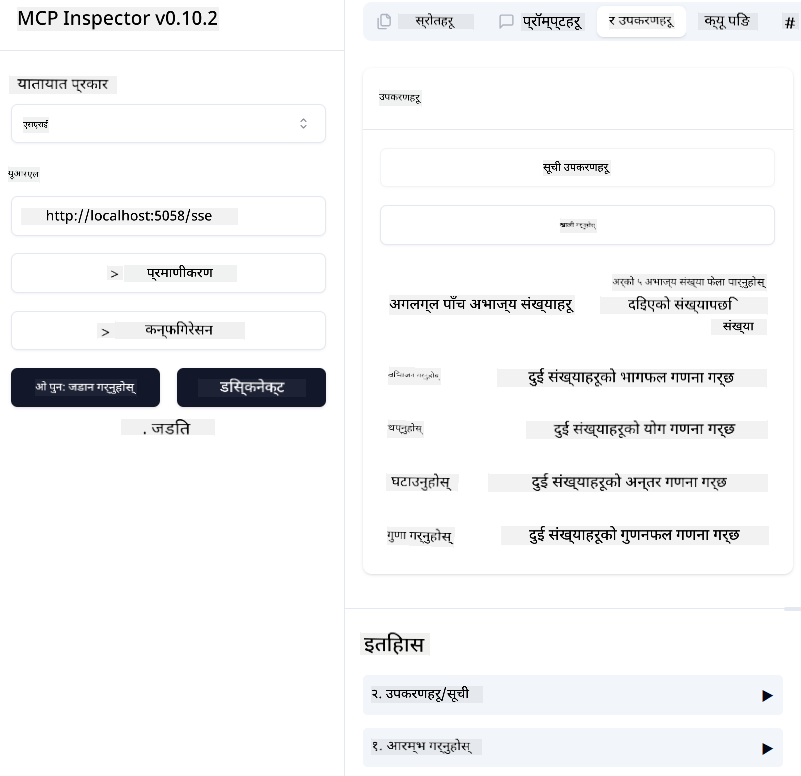
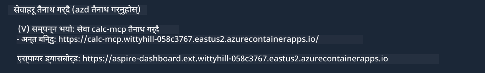

<!--
CO_OP_TRANSLATOR_METADATA:
{
  "original_hash": "5020a3e1a1c7f30c00f9e37f1fa208e3",
  "translation_date": "2025-05-17T14:07:12+00:00",
  "source_file": "04-PracticalImplementation/samples/csharp/README.md",
  "language_code": "ne"
}
-->
# नमूना

अघिल्लो उदाहरणले स्थानीय .NET प्रोजेक्टलाई `sdio` प्रकारसँग कसरी प्रयोग गर्ने भनेर देखाउँछ। र कसरी सर्भरलाई कन्टेनरमा स्थानीय रूपमा चलाउने भनेर पनि। यो धेरै अवस्थामा राम्रो समाधान हो। तथापि, सर्भरलाई टाढाबाट, जस्तै क्लाउड वातावरणमा चलाउनु उपयोगी हुन सक्छ। यहीँ नै `http` प्रकारको आवश्यकता पर्छ।

`04-PracticalImplementation` फोल्डरमा समाधानलाई हेर्दा, यो अघिल्लो भन्दा धेरै जटिल देखिन सक्छ। तर वास्तवमा, यो होइन। यदि तपाईंले प्रोजेक्ट `src/mcpserver/mcpserver.csproj` लाई ध्यानपूर्वक हेर्नुभयो भने, तपाईंले देख्नुहुनेछ कि यो अधिकांशत: अघिल्लो उदाहरणकै कोड हो। फरक यति मात्र छ कि हामीले HTTP अनुरोधहरूलाई व्यवस्थापन गर्न फरक पुस्तकालय `ModelContextProtocol.AspNetCore` प्रयोग गरेका छौं। र हामीले विधि `IsPrime` लाई निजी बनाउन परिवर्तन गरेका छौं, ताकि तपाईंको कोडमा निजी विधिहरू पनि हुन सक्छन् भनेर देखाउन। बाँकी कोड अघिल्लो जस्तै छ।

अरू प्रोजेक्टहरू [.NET Aspire](https://learn.microsoft.com/dotnet/aspire/get-started/aspire-overview) बाट हुन्। समाधानमा .NET Aspire हुनुले विकासकर्ताको अनुभवलाई सुधार गर्नेछ विकास र परीक्षणको क्रममा र अवलोकनमा मद्दत गर्नेछ। सर्भर चलाउन यो आवश्यक छैन, तर समाधानमा यसलाई राख्नु राम्रो अभ्यास हो।

## सर्भरलाई स्थानीय रूपमा सुरु गर्नुहोस्

1. VS Code बाट (C# DevKit एक्सटेन्सन सहित), समाधान `04-PracticalImplementation\samples\csharp\src\Calculator-chap4.sln` खोल्नुहोस्।
2. सर्भर सुरु गर्नका लागि `F5` थिच्नुहोस्। यसले .NET Aspire ड्यासबोर्डसहित वेब ब्राउजर सुरु गर्नुपर्छ।

वा

1. टर्मिनलबाट, फोल्डर `04-PracticalImplementation\samples\csharp\src` मा जानुहोस्।
2. सर्भर सुरु गर्न निम्न आदेश कार्यान्वयन गर्नुहोस्:
   ```bash
    dotnet run --project .\AppHost
   ```

3. ड्यासबोर्डबाट, `http` URL नोट गर्नुहोस्। यो `http://localhost:5058/`.

## Test `SSE` जस्तै केही हुनुपर्छ ModelContext Protocol Inspector सहित।

यदि तपाईंसँग Node.js 22.7.5 र उच्च संस्करण छ भने, तपाईं ModelContext Protocol Inspector प्रयोग गरेर आफ्नो सर्भर परीक्षण गर्न सक्नुहुन्छ।

सर्भर सुरु गर्नुहोस् र टर्मिनलमा निम्न आदेश चलाउनुहोस्:

```bash
npx @modelcontextprotocol/inspector@latest
```



- `SSE` as the Transport type. SSE stand for Server-Sent Events. 
- In the Url field, enter the URL of the server noted earlier,and append `/sse` चयन गर्नुहोस्। यो `http` हुनुपर्छ (पहिले बनाइएको `https`) something like `http://localhost:5058/sse`.
- select the Connect button.

A nice thing about the Inspector is that it provide a nice visibility on what is happening.

- Try listing the availables tools
- Try some of them, it should works just like before.


## Test `SSE` with Github Copilot Chat in VS Code

To use the `SSE` transport with Github Copilot Chat, change the configuration of the `mcp-calc` सर्भर यस्तो देखिनु पर्छ:

```json
"mcp-calc": {
    "type": "sse",
    "url": "http://localhost:5058/sse"
}
```

केही परीक्षणहरू गर्नुहोस्:
- 6780 पछि 3 प्राइम नम्बरहरूको माग गर्नुहोस्। ध्यान दिनुहोस् कि Copilot ले नयाँ उपकरण `NextFivePrimeNumbers` प्रयोग गर्नेछ र मात्र पहिलो 3 प्राइम नम्बरहरू फिर्ता गर्नेछ।
- 111 पछि 7 प्राइम नम्बरहरूको माग गर्नुहोस्, के हुन्छ हेर्नको लागि।

# सर्भरलाई Azure मा तैनाथ गर्नुहोस्

सर्भरलाई Azure मा तैनाथ गरौं ताकि धेरै मानिसहरूले यसलाई प्रयोग गर्न सकून्।

टर्मिनलबाट, फोल्डर `04-PracticalImplementation\samples\csharp\src` मा जानुहोस् र निम्न आदेश चलाउनुहोस्:

```bash
azd init
```

यसले Azure स्रोतहरूको कन्फिगरेसन र तपाईंको Infrastructure as code (IaC) को रूपमा केही फाइलहरू स्थानीय रूपमा सिर्जना गर्नेछ।

त्यसपछि, सर्भरलाई Azure मा तैनाथ गर्न निम्न आदेश चलाउनुहोस्:

```bash
azd up
```

तैनाथी समाप्त भएपछि, तपाईंले यस्तो सन्देश देख्नुपर्छ:



Aspire ड्यासबोर्डमा जानुहोस् र `HTTP` URL नोट गर्नुहोस् MCP Inspector र Github Copilot Chat मा प्रयोग गर्नको लागि।

## अब के गर्ने?

हामीले विभिन्न ट्रान्सपोर्ट प्रकारहरू, परीक्षण उपकरणहरू प्रयास गर्यौं र हाम्रो MCP सर्भरलाई Azure मा तैनाथ गर्यौं। तर यदि हाम्रो सर्भरलाई निजी स्रोतहरूमा पहुँच गर्न आवश्यक परे के गर्ने? उदाहरणका लागि, डाटाबेस वा निजी API? अर्को अध्यायमा, हामी हाम्रो सर्भरको सुरक्षा कसरी सुधार गर्न सकिन्छ भनेर हेर्नेछौं।

**अस्वीकरण**:  
यो दस्तावेज AI अनुवाद सेवा [Co-op Translator](https://github.com/Azure/co-op-translator) प्रयोग गरेर अनुवाद गरिएको छ। हामी शुद्धताको लागि प्रयास गर्छौं, तर कृपया जानकार हुनुहोस् कि स्वचालित अनुवादहरूमा त्रुटिहरू वा अशुद्धताहरू हुन सक्छन्। यसको मूल भाषामा रहेको दस्तावेजलाई आधिकारिक स्रोत मानिनुपर्छ। महत्वपूर्ण जानकारीको लागि, व्यावसायिक मानव अनुवाद सिफारिस गरिन्छ। यस अनुवादको प्रयोगबाट उत्पन्न हुने कुनै पनि गलतफहमी वा गलत व्याख्याका लागि हामी जिम्मेवार छैनौं।