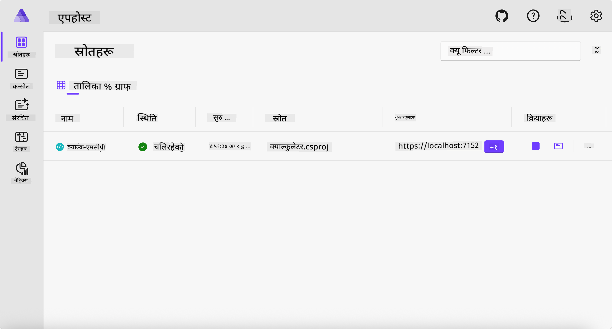
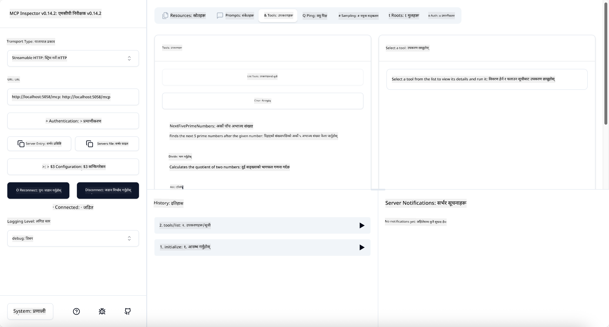
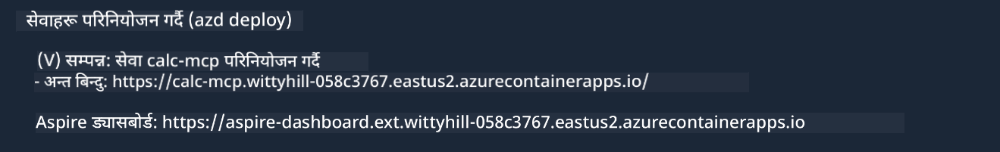

<!--
CO_OP_TRANSLATOR_METADATA:
{
  "original_hash": "0bc7bd48f55f1565f1d95ccb2c16f728",
  "translation_date": "2025-07-13T23:05:45+00:00",
  "source_file": "04-PracticalImplementation/samples/csharp/README.md",
  "language_code": "ne"
}
-->
# नमूना

अघिल्लो उदाहरणले कसरी स्थानीय .NET प्रोजेक्ट `stdio` प्रकारसँग प्रयोग गर्ने देखाउँछ। र कसरी कन्टेनरमा सर्भर स्थानीय रूपमा चलाउने। धेरै अवस्थामा यो राम्रो समाधान हो। तर, सर्भरलाई क्लाउड वातावरण जस्तै टाढाबाट चलाउनु उपयोगी हुन सक्छ। त्यहीँ `http` प्रकारको भूमिका आउँछ।

`04-PracticalImplementation` फोल्डरमा रहेको समाधान हेर्दा यो अघिल्लो भन्दा धेरै जटिल देखिन सक्छ। तर वास्तवमा त्यस्तो छैन। प्रोजेक्ट `src/Calculator` नजिकबाट हेर्दा, यो प्रायः अघिल्लो उदाहरण जस्तै कोड हो। फरक केवल यो हो कि हामी HTTP अनुरोधहरू ह्यान्डल गर्न `ModelContextProtocol.AspNetCore` नामक फरक लाइब्रेरी प्रयोग गर्दैछौं। र `IsPrime` मेथडलाई निजी बनाउन परिवर्तन गरेका छौं, जसले देखाउँछ कि तपाईंको कोडमा निजी मेथडहरू पनि हुन सक्छन्। बाँकी कोड पहिले जस्तै नै छ।

अन्य प्रोजेक्टहरू [.NET Aspire](https://learn.microsoft.com/dotnet/aspire/get-started/aspire-overview) बाट आएका हुन्। समाधानमा .NET Aspire राख्दा विकासकर्ता अनुभव सुधार हुन्छ, विकास र परीक्षणमा मद्दत पुग्छ र अवलोकनयोग्यता बढ्छ। सर्भर चलाउन आवश्यक छैन, तर समाधानमा राख्नु राम्रो अभ्यास हो।

## सर्भर स्थानीय रूपमा सुरु गर्ने

1. VS Code (C# DevKit एक्सटेन्सन सहित) बाट `04-PracticalImplementation/samples/csharp` डाइरेक्टरीमा जानुहोस्।
1. सर्भर सुरु गर्न तलको कमाण्ड चलाउनुहोस्:

   ```bash
    dotnet watch run --project ./src/AppHost
   ```

1. जब वेब ब्राउजरले .NET Aspire ड्यासबोर्ड खोल्छ, `http` URL नोट गर्नुहोस्। यो केही यसरी देखिनुपर्छ: `http://localhost:5058/`।

   

## MCP Inspector सँग Streamable HTTP परीक्षण गर्ने

यदि तपाईंसँग Node.js 22.7.5 वा माथि छ भने, MCP Inspector प्रयोग गरेर सर्भर परीक्षण गर्न सक्नुहुन्छ।

सर्भर सुरु गरेर टर्मिनलमा तलको कमाण्ड चलाउनुहोस्:

```bash
npx @modelcontextprotocol/inspector http://localhost:5058
```



- Transport प्रकारको रूपमा `Streamable HTTP` चयन गर्नुहोस्।
- Url फिल्डमा पहिले नोट गरेको सर्भरको URL लेख्नुहोस् र `/mcp` थप्नुहोस्। यो `http` (https होइन) हुनुपर्छ, जस्तै `http://localhost:5058/mcp`।
- Connect बटन थिच्नुहोस्।

Inspector को राम्रो कुरा के हो भने यसले के भइरहेको छ भन्ने राम्रो दृश्यता दिन्छ।

- उपलब्ध उपकरणहरूको सूची हेर्न प्रयास गर्नुहोस्
- केही उपकरणहरू चलाएर हेर्नुहोस्, पहिले जस्तै काम गर्नेछ।

## VS Code मा GitHub Copilot Chat सँग MCP सर्भर परीक्षण गर्ने

Streamable HTTP ट्रान्सपोर्ट GitHub Copilot Chat सँग प्रयोग गर्न, पहिले बनाएको `calc-mcp` सर्भरको कन्फिगरेसन यसरी परिवर्तन गर्नुहोस्:

```jsonc
// .vscode/mcp.json
{
  "servers": {
    "calc-mcp": {
      "type": "http",
      "url": "http://localhost:5058/mcp"
    }
  }
}
```

केही परीक्षणहरू गर्नुहोस्:

- "6780 पछि 3 वटा अभाज्य संख्या" सोध्नुहोस्। Copilot ले नयाँ उपकरण `NextFivePrimeNumbers` प्रयोग गरेर पहिलो 3 अभाज्य संख्या मात्र फर्काउनेछ।
- "111 पछि 7 वटा अभाज्य संख्या" सोध्नुहोस् र के हुन्छ हेर्नुहोस्।
- "जोनसँग २४ लली छन् र उनी आफ्ना ३ बच्चालाई बाँड्न चाहन्छन्। प्रत्येक बच्चाले कति लली पाउँछन्?" सोध्नुहोस् र के हुन्छ हेर्नुहोस्।

## सर्भर Azure मा डिप्लोय गर्ने

सर्भर Azure मा डिप्लोय गरौं ताकि धेरैले प्रयोग गर्न सकून्।

टर्मिनलबाट `04-PracticalImplementation/samples/csharp` फोल्डरमा जानुहोस् र तलको कमाण्ड चलाउनुहोस्:

```bash
azd up
```

डिप्लोयमेन्ट सकिएपछि यस्तो सन्देश देखिनुपर्छ:



URL कपी गरेर MCP Inspector र GitHub Copilot Chat मा प्रयोग गर्नुहोस्।

```jsonc
// .vscode/mcp.json
{
  "servers": {
    "calc-mcp": {
      "type": "http",
      "url": "https://calc-mcp.gentleriver-3977fbcf.australiaeast.azurecontainerapps.io/mcp"
    }
  }
}
```

## अब के?

हामीले विभिन्न ट्रान्सपोर्ट प्रकार र परीक्षण उपकरणहरू प्रयास गर्यौं। हामीले MCP सर्भर Azure मा डिप्लोय पनि गर्यौं। तर यदि हाम्रो सर्भरले निजी स्रोतहरू पहुँच गर्नुपर्ने भए? जस्तै, डेटाबेस वा निजी API? अर्को अध्यायमा हामी सर्भरको सुरक्षा कसरी सुधार गर्ने भनेर हेर्नेछौं।

**अस्वीकरण**:  
यो दस्तावेज AI अनुवाद सेवा [Co-op Translator](https://github.com/Azure/co-op-translator) प्रयोग गरी अनुवाद गरिएको हो। हामी शुद्धताका लागि प्रयासरत छौं, तर कृपया ध्यान दिनुहोस् कि स्वचालित अनुवादमा त्रुटि वा अशुद्धता हुन सक्छ। मूल दस्तावेज यसको मूल भाषामा नै अधिकारिक स्रोत मानिनुपर्छ। महत्वपूर्ण जानकारीका लागि व्यावसायिक मानव अनुवाद सिफारिस गरिन्छ। यस अनुवादको प्रयोगबाट उत्पन्न कुनै पनि गलतफहमी वा गलत व्याख्याका लागि हामी जिम्मेवार छैनौं।