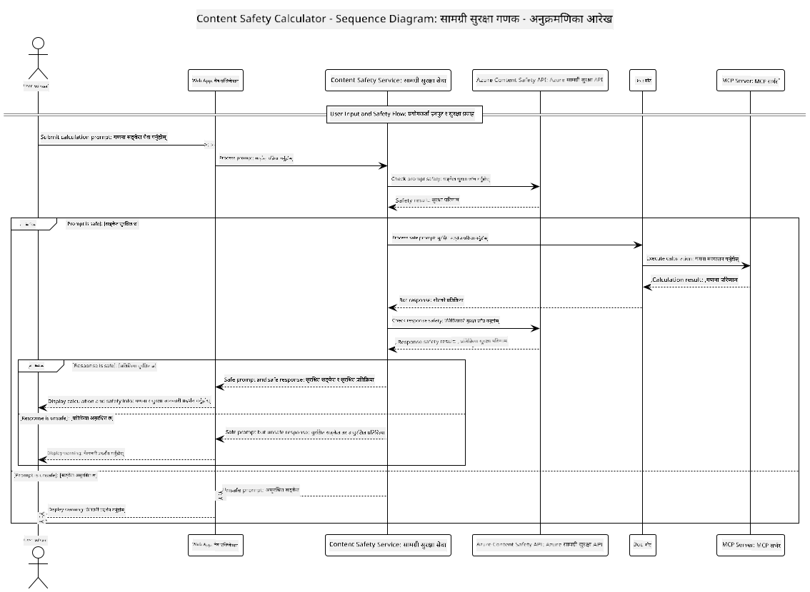

<!--
CO_OP_TRANSLATOR_METADATA:
{
  "original_hash": "e5ea5e7582f70008ea9bec3b3820f20a",
  "translation_date": "2025-07-13T23:14:41+00:00",
  "source_file": "04-PracticalImplementation/samples/java/containerapp/README.md",
  "language_code": "ne"
}
-->
## सिस्टम आर्किटेक्चर

यो प्रोजेक्टले वेब एप्लिकेशन देखाउँछ जसले प्रयोगकर्ताको प्रॉम्प्टलाई क्याल्कुलेटर सेवामा पठाउनु अघि सामग्री सुरक्षा जाँच गर्छ, जुन Model Context Protocol (MCP) मार्फत सञ्चालित हुन्छ।



### यो कसरी काम गर्छ

1. **प्रयोगकर्ता इनपुट**: प्रयोगकर्ताले वेब इन्टरफेसमा गणना सम्बन्धी प्रॉम्प्ट प्रविष्ट गर्छ
2. **सामग्री सुरक्षा स्क्रिनिङ (इनपुट)**: प्रॉम्प्टलाई Azure Content Safety API द्वारा विश्लेषण गरिन्छ
3. **सुरक्षा निर्णय (इनपुट)**:
   - यदि सामग्री सुरक्षित छ (सबै वर्गहरूमा severity < 2), तब क्याल्कुलेटरमा अगाडि बढ्छ
   - यदि सामग्री सम्भावित हानिकारक भनेर चिन्हित छ भने प्रक्रिया रोकिन्छ र चेतावनी फर्काइन्छ
4. **क्याल्कुलेटर एकीकरण**: सुरक्षित सामग्री LangChain4j द्वारा प्रशोधन गरिन्छ, जसले MCP क्याल्कुलेटर सर्भरसँग संवाद गर्छ
5. **सामग्री सुरक्षा स्क्रिनिङ (आउटपुट)**: बोटको प्रतिक्रिया Azure Content Safety API द्वारा विश्लेषण गरिन्छ
6. **सुरक्षा निर्णय (आउटपुट)**:
   - यदि बोटको प्रतिक्रिया सुरक्षित छ भने, प्रयोगकर्तालाई देखाइन्छ
   - यदि बोटको प्रतिक्रिया सम्भावित हानिकारक छ भने, चेतावनीले प्रतिस्थापन गरिन्छ
7. **प्रतिक्रिया**: नतिजाहरू (यदि सुरक्षित भए) प्रयोगकर्तालाई दुबै सुरक्षा विश्लेषणसहित देखाइन्छ

## Model Context Protocol (MCP) सँग क्याल्कुलेटर सेवाहरूको प्रयोग

यो प्रोजेक्टले LangChain4j बाट क्याल्कुलेटर MCP सेवाहरू कल गर्न Model Context Protocol (MCP) कसरी प्रयोग गर्ने देखाउँछ। कार्यान्वयनले पोर्ट 8080 मा चलिरहेको स्थानीय MCP सर्भर प्रयोग गरेर क्याल्कुलेटर अपरेसनहरू प्रदान गर्छ।

### Azure Content Safety सेवा सेटअप गर्ने तरिका

सामग्री सुरक्षा सुविधाहरू प्रयोग गर्नु अघि, तपाईंले Azure Content Safety सेवा स्रोत सिर्जना गर्न आवश्यक छ:

1. [Azure Portal](https://portal.azure.com) मा साइन इन गर्नुहोस्
2. "Create a resource" मा क्लिक गरी "Content Safety" खोज्नुहोस्
3. "Content Safety" चयन गरी "Create" मा क्लिक गर्नुहोस्
4. तपाईंको स्रोतको लागि अनौठो नाम प्रविष्ट गर्नुहोस्
5. तपाईंको सदस्यता र स्रोत समूह चयन गर्नुहोस् (वा नयाँ सिर्जना गर्नुहोस्)
6. समर्थित क्षेत्र चयन गर्नुहोस् ([Region availability](https://azure.microsoft.com/en-us/global-infrastructure/services/?products=cognitive-services) हेर्नुहोस्)
7. उपयुक्त मूल्य निर्धारण स्तर चयन गर्नुहोस्
8. स्रोत तैनाथ गर्न "Create" मा क्लिक गर्नुहोस्
9. तैनाथी पूरा भएपछि "Go to resource" मा क्लिक गर्नुहोस्
10. बाँया प्यानमा "Resource Management" अन्तर्गत "Keys and Endpoint" चयन गर्नुहोस्
11. अर्को चरणमा प्रयोग गर्न कुञ्जीहरू र endpoint URL प्रतिलिपि गर्नुहोस्

### वातावरण चरहरू कन्फिगर गर्ने

GitHub मोडेल प्रमाणीकरणका लागि `GITHUB_TOKEN` वातावरण चर सेट गर्नुहोस्:
```sh
export GITHUB_TOKEN=<your_github_token>
```

सामग्री सुरक्षा सुविधाहरूका लागि सेट गर्नुहोस्:
```sh
export CONTENT_SAFETY_ENDPOINT=<your_content_safety_endpoint>
export CONTENT_SAFETY_KEY=<your_content_safety_key>
```

यी वातावरण चरहरू एप्लिकेशनले Azure Content Safety सेवासँग प्रमाणीकरण गर्न प्रयोग गर्छ। यदि यी सेट नभए, एप्लिकेशनले प्रदर्शनका लागि प्लेसहोल्डर मानहरू प्रयोग गर्नेछ, तर सामग्री सुरक्षा सुविधाहरू ठीकसँग काम गर्ने छैनन्।

### क्याल्कुलेटर MCP सर्भर सुरु गर्ने

क्लाइन्ट चलाउनु अघि, तपाईंले localhost:8080 मा SSE मोडमा क्याल्कुलेटर MCP सर्भर सुरु गर्न आवश्यक छ।

## प्रोजेक्ट विवरण

यो प्रोजेक्टले Model Context Protocol (MCP) लाई LangChain4j सँग एकीकृत गरेर क्याल्कुलेटर सेवाहरू कल गर्ने तरिका देखाउँछ। मुख्य विशेषताहरू:

- आधारभूत गणितीय अपरेसनहरूका लागि MCP मार्फत क्याल्कुलेटर सेवासँग जडान
- प्रयोगकर्ता प्रॉम्प्ट र बोट प्रतिक्रियामा दोहोरो स्तरको सामग्री सुरक्षा जाँच
- LangChain4j मार्फत GitHub को gpt-4.1-nano मोडेलसँग एकीकरण
- MCP ट्रान्सपोर्टका लागि Server-Sent Events (SSE) को प्रयोग

## सामग्री सुरक्षा एकीकरण

प्रोजेक्टले व्यापक सामग्री सुरक्षा सुविधाहरू समावेश गर्दछ जसले प्रयोगकर्ता इनपुट र प्रणाली प्रतिक्रियाहरू दुवै हानिकारक सामग्रीबाट मुक्त रहुन सुनिश्चित गर्छ:

1. **इनपुट स्क्रिनिङ**: सबै प्रयोगकर्ता प्रॉम्प्टहरूलाई घृणा भाषण, हिंसा, आत्म-हानि, र यौन सामग्री जस्ता हानिकारक सामग्री वर्गहरूका लागि विश्लेषण गरिन्छ।

2. **आउटपुट स्क्रिनिङ**: सम्भावित अनसेंसर गरिएको मोडेलहरू प्रयोग गर्दा पनि, प्रणालीले सबै उत्पन्न प्रतिक्रियाहरूलाई समान सामग्री सुरक्षा फिल्टरमार्फत जाँच गर्छ र त्यसपछि मात्र प्रयोगकर्तालाई देखाउँछ।

यो दोहोरो स्तरको दृष्टिकोणले प्रणालीलाई जुनसुकै AI मोडेल प्रयोग भए पनि सुरक्षित राख्छ, प्रयोगकर्तालाई हानिकारक इनपुट र सम्भावित समस्याग्रस्त AI-उत्पन्न प्रतिक्रियाबाट जोगाउँछ।

## वेब क्लाइन्ट

एप्लिकेशनले प्रयोगकर्तालाई सामग्री सुरक्षा क्याल्कुलेटर प्रणालीसँग अन्तरक्रिया गर्न सजिलो वेब इन्टरफेस प्रदान गर्छ:

### वेब इन्टरफेस सुविधाहरू

- गणना प्रॉम्प्ट प्रविष्ट गर्न सरल र सहज फारम
- दोहोरो स्तरको सामग्री सुरक्षा प्रमाणीकरण (इनपुट र आउटपुट)
- प्रॉम्प्ट र प्रतिक्रियाको सुरक्षा सम्बन्धी वास्तविक-समय प्रतिक्रिया
- सजिलै बुझ्न सकिने रंग-कोड गरिएको सुरक्षा संकेतकहरू
- विभिन्न उपकरणहरूमा काम गर्ने सफा र प्रतिक्रियाशील डिजाइन
- प्रयोगकर्तालाई मार्गदर्शन गर्न सुरक्षित प्रॉम्प्टका उदाहरणहरू

### वेब क्लाइन्ट प्रयोग गर्ने तरिका

1. एप्लिकेशन सुरु गर्नुहोस्:
   ```sh
   mvn spring-boot:run
   ```

2. आफ्नो ब्राउजर खोल्नुहोस् र `http://localhost:8087` मा जानुहोस्

3. उपलब्ध टेक्स्ट क्षेत्रमा गणना प्रॉम्प्ट प्रविष्ट गर्नुहोस् (जस्तै, "Calculate the sum of 24.5 and 17.3")

4. "Submit" मा क्लिक गरी आफ्नो अनुरोध प्रक्रिया गर्नुहोस्

5. नतिजाहरू हेर्नुहोस्, जसमा समावेश हुनेछ:
   - तपाईंको प्रॉम्प्टको सामग्री सुरक्षा विश्लेषण
   - गणना गरिएको परिणाम (यदि प्रॉम्प्ट सुरक्षित थियो भने)
   - बोटको प्रतिक्रियाको सामग्री सुरक्षा विश्लेषण
   - इनपुट वा आउटपुटमा कुनै पनि सुरक्षा चेतावनीहरू यदि चिन्हित भए

वेब क्लाइन्टले स्वचालित रूपमा दुवै सामग्री सुरक्षा प्रमाणीकरण प्रक्रियाहरू सम्हाल्छ, जसले सबै अन्तरक्रियाहरू सुरक्षित र उपयुक्त रहुन सुनिश्चित गर्छ, जुनसुकै AI मोडेल प्रयोग भए पनि।

**अस्वीकरण**:  
यो दस्तावेज AI अनुवाद सेवा [Co-op Translator](https://github.com/Azure/co-op-translator) प्रयोग गरी अनुवाद गरिएको हो। हामी शुद्धताका लागि प्रयासरत छौं, तर कृपया ध्यान दिनुहोस् कि स्वचालित अनुवादमा त्रुटि वा अशुद्धता हुन सक्छ। मूल दस्तावेज यसको मूल भाषामा नै अधिकारिक स्रोत मानिनु पर्छ। महत्वपूर्ण जानकारीका लागि व्यावसायिक मानव अनुवाद सिफारिस गरिन्छ। यस अनुवादको प्रयोगबाट उत्पन्न कुनै पनि गलतफहमी वा गलत व्याख्याका लागि हामी जिम्मेवार छैनौं।