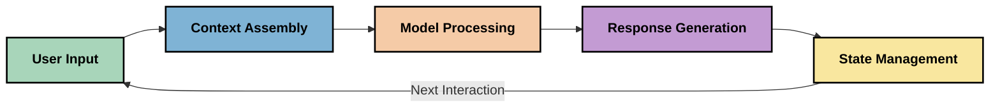
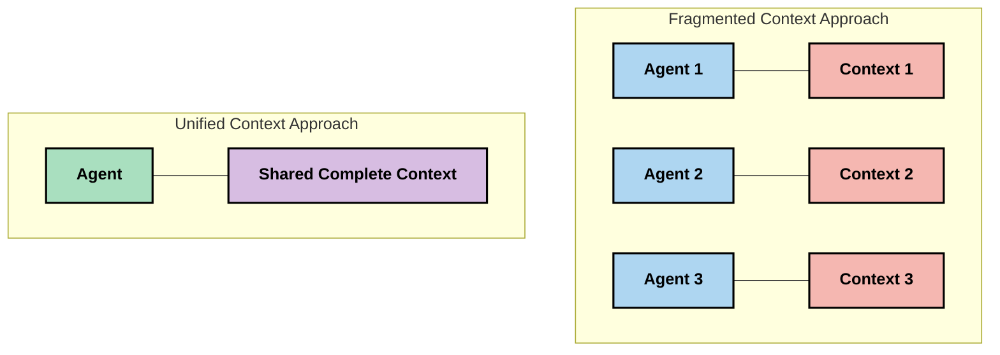
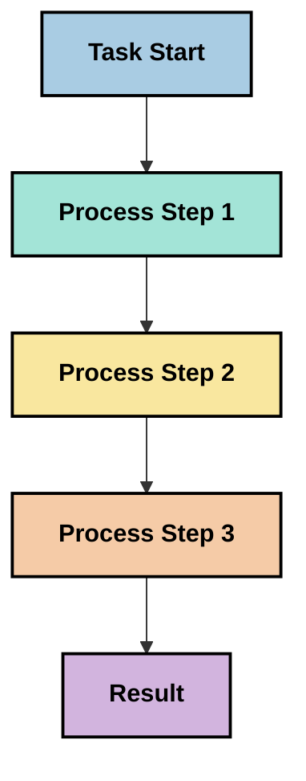
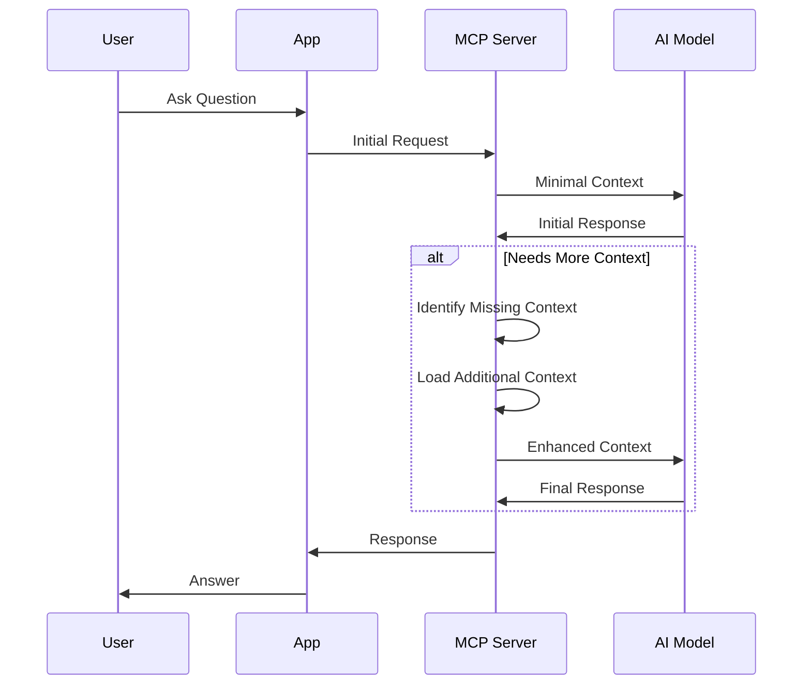
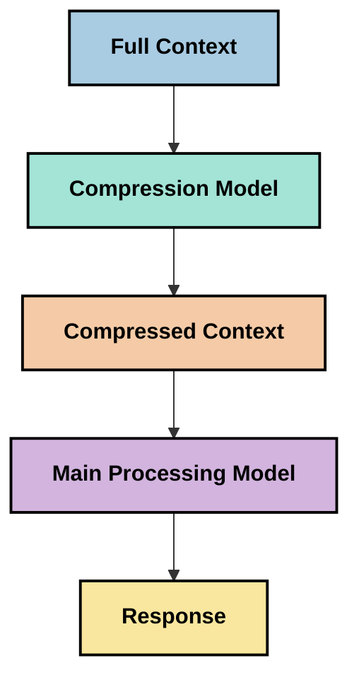

<!--
CO_OP_TRANSLATOR_METADATA:
{
  "original_hash": "5762e8e74dd99d8b7dbb31e69a82561e",
  "translation_date": "2025-07-17T01:42:53+00:00",
  "source_file": "05-AdvancedTopics/mcp-contextengineering/README.md",
  "language_code": "ne"
}
-->
# सन्दर्भ इन्जिनियरिङ: MCP इकोसिस्टममा उदाउँदै गरेको अवधारणा

## अवलोकन

सन्दर्भ इन्जिनियरिङ AI क्षेत्रमा एक उदाउँदै गरेको अवधारणा हो जसले ग्राहक र AI सेवाहरूबीचको अन्तरक्रियामा जानकारी कसरी संरचित, प्रदान र व्यवस्थापन गरिन्छ भन्ने कुरा अन्वेषण गर्छ। Model Context Protocol (MCP) इकोसिस्टम विकास हुँदै जाँदा, सन्दर्भलाई प्रभावकारी रूपमा व्यवस्थापन गर्ने तरिका बुझ्नु अझ महत्वपूर्ण हुँदै गएको छ। यस मोड्युलले सन्दर्भ इन्जिनियरिङको अवधारणा परिचय गराउँछ र MCP कार्यान्वयनहरूमा यसको सम्भावित प्रयोगहरू अन्वेषण गर्छ।

## सिकाइ उद्देश्यहरू

यस मोड्युलको अन्त्यसम्म, तपाईं सक्षम हुनुहुनेछ:

- सन्दर्भ इन्जिनियरिङको उदाउँदै गरेको अवधारणा र यसको MCP अनुप्रयोगहरूमा सम्भावित भूमिकालाई बुझ्न
- सन्दर्भ व्यवस्थापनमा MCP प्रोटोकल डिजाइनले सम्बोधन गर्ने मुख्य चुनौतीहरू पहिचान गर्न
- राम्रो सन्दर्भ व्यवस्थापनमार्फत मोडेल प्रदर्शन सुधार गर्ने प्रविधिहरू अन्वेषण गर्न
- सन्दर्भको प्रभावकारिता मापन र मूल्याङ्कन गर्ने दृष्टिकोणहरू विचार गर्न
- यी उदाउँदै गरेका अवधारणाहरूलाई MCP फ्रेमवर्क मार्फत AI अनुभव सुधार गर्न लागू गर्न

## सन्दर्भ इन्जिनियरिङ परिचय

सन्दर्भ इन्जिनियरिङ एक उदाउँदै गरेको अवधारणा हो जुन प्रयोगकर्ता, अनुप्रयोगहरू, र AI मोडेलहरूबीच जानकारी प्रवाहको जानाजानी डिजाइन र व्यवस्थापनमा केन्द्रित छ। प्रॉम्प्ट इन्जिनियरिङ जस्ता स्थापित क्षेत्रहरू भन्दा फरक, सन्दर्भ इन्जिनियरिङ अझै व्यावसायिकहरूले परिभाषित गर्दैछन् जसले AI मोडेलहरूलाई सही समयमा सही जानकारी प्रदान गर्ने अनौठो चुनौतीहरू समाधान गर्न काम गरिरहेका छन्।

ठूला भाषा मोडेलहरू (LLMs) विकास हुँदै जाँदा, सन्दर्भको महत्त्व बढ्दै गएको छ। हामीले प्रदान गर्ने सन्दर्भको गुणस्तर, सान्दर्भिकता, र संरचनाले मोडेलको नतिजामा प्रत्यक्ष प्रभाव पार्छ। सन्दर्भ इन्जिनियरिङले यस सम्बन्धलाई अन्वेषण गर्छ र प्रभावकारी सन्दर्भ व्यवस्थापनका सिद्धान्तहरू विकास गर्ने प्रयास गर्छ।

> "२०२५ मा, त्यहाँका मोडेलहरू अत्यन्त बुद्धिमान छन्। तर सबैभन्दा बुद्धिमान मानिस पनि उनीहरूलाई के गर्न भनिएको छ भन्ने सन्दर्भ बिना आफ्नो काम प्रभावकारी रूपमा गर्न सक्दैन... 'सन्दर्भ इन्जिनियरिङ' प्रॉम्प्ट इन्जिनियरिङको अर्को स्तर हो। यो गतिशील प्रणालीमा स्वचालित रूपमा गर्ने कुरा हो।" — Walden Yan, Cognition AI

सन्दर्भ इन्जिनियरिङले समेट्न सक्छ:

1. **सन्दर्भ चयन**: कुनै कार्यका लागि कुन जानकारी सान्दर्भिक छ निर्धारण गर्ने
2. **सन्दर्भ संरचना**: मोडेलको बुझाइ अधिकतम गर्न जानकारीलाई व्यवस्थित गर्ने
3. **सन्दर्भ वितरण**: जानकारी मोडेलहरूलाई कसरी र कहिले पठाउने अनुकूलन गर्ने
4. **सन्दर्भ मर्मत**: समयसँगै सन्दर्भको अवस्था र विकास व्यवस्थापन गर्ने
5. **सन्दर्भ मूल्याङ्कन**: सन्दर्भको प्रभावकारिता मापन र सुधार गर्ने

यी फोकस क्षेत्रहरू MCP इकोसिस्टमसँग विशेष रूपमा सम्बन्धित छन्, जसले अनुप्रयोगहरूलाई LLMs लाई सन्दर्भ प्रदान गर्ने मानकीकृत तरिका उपलब्ध गराउँछ।

## सन्दर्भ यात्राको दृष्टिकोण

सन्दर्भ इन्जिनियरिङलाई बुझ्नको लागि एउटा तरिका भनेको MCP प्रणालीमा जानकारीले यात्रा गर्ने मार्गलाई ट्रेस गर्नु हो:



### सन्दर्भ यात्राका मुख्य चरणहरू:

1. **प्रयोगकर्ता इनपुट**: प्रयोगकर्ताबाट प्राप्त कच्चा जानकारी (पाठ, छवि, कागजातहरू)
2. **सन्दर्भ संयोजन**: प्रयोगकर्ता इनपुटलाई प्रणाली सन्दर्भ, संवाद इतिहास, र अन्य प्राप्त जानकारीसँग जोड्ने
3. **मोडेल प्रशोधन**: AI मोडेलले संयोजित सन्दर्भ प्रशोधन गर्ने
4. **प्रतिक्रिया उत्पादन**: मोडेलले प्रदान गरिएको सन्दर्भको आधारमा नतिजा उत्पादन गर्ने
5. **अवस्था व्यवस्थापन**: अन्तरक्रियाको आधारमा प्रणालीले आन्तरिक अवस्थालाई अपडेट गर्ने

यो दृष्टिकोणले AI प्रणालीहरूमा सन्दर्भको गतिशील प्रकृतिलाई उजागर गर्छ र प्रत्येक चरणमा जानकारी कसरी प्रभावकारी रूपमा व्यवस्थापन गर्ने भन्ने महत्वपूर्ण प्रश्नहरू उठाउँछ।

## सन्दर्भ इन्जिनियरिङका उदाउँदै गरेका सिद्धान्तहरू

सन्दर्भ इन्जिनियरिङ क्षेत्र आकार लिन थालेको छ, केही प्रारम्भिक सिद्धान्तहरू व्यावसायिकहरूबाट उदाउँदैछन्। यी सिद्धान्तहरूले MCP कार्यान्वयन विकल्पहरूलाई मार्गदर्शन गर्न सक्छन्:

### सिद्धान्त १: सन्दर्भ पूर्ण रूपमा साझा गर्नुहोस्

सन्दर्भ प्रणालीका सबै कम्पोनेन्टहरूबीच पूर्ण रूपमा साझा हुनुपर्छ, न कि विभिन्न एजेन्ट वा प्रक्रियाहरूमा टुक्र्याएर। जब सन्दर्भ वितरण हुन्छ, प्रणालीको एक भागमा गरिएका निर्णयहरू अन्य भागसँग विरोधाभासी हुन सक्छन्।



MCP अनुप्रयोगहरूमा, यसले यस्तो प्रणाली डिजाइन गर्न सुझाव दिन्छ जहाँ सन्दर्भ सम्पूर्ण पाइपलाइनमा सहज रूपमा प्रवाह हुन्छ, न कि अलग-अलग खण्डहरूमा विभाजित।

### सिद्धान्त २: क्रियाकलापहरूले निहित निर्णयहरू बोकेको हुन्छन् भनेर बुझ्नुहोस्

मोडेलले गर्ने प्रत्येक क्रियाले सन्दर्भलाई कसरी व्याख्या गर्ने भन्ने निहित निर्णयहरू समावेश गर्छ। जब विभिन्न कम्पोनेन्टहरूले फरक सन्दर्भमा काम गर्छन्, यी निहित निर्णयहरू विरोधाभासी हुन सक्छन् जसले असंगत नतिजा ल्याउँछ।

यस सिद्धान्तका MCP अनुप्रयोगहरूका लागि महत्त्वपूर्ण प्रभावहरू छन्:
- जटिल कार्यहरूको लागि समानान्तर कार्यान्वयनभन्दा रेखीय प्रशोधन प्राथमिकता दिनुहोस्
- सबै निर्णय बिन्दुहरूले एउटै सन्दर्भ जानकारी पहुँच गर्न पाउनुपर्छ
- प्रणाली डिजाइन गर्दा पछिल्ला चरणहरूले पहिलेका निर्णयहरूको पूर्ण सन्दर्भ देख्न सकून्

### सिद्धान्त ३: सन्दर्भ गहिराइ र विन्डो सीमाहरूको सन्तुलन गर्नुहोस्

संवाद र प्रक्रियाहरू लामो हुँदै जाँदा, सन्दर्भ विन्डोहरू अन्ततः ओभरफ्लो हुन्छन्। प्रभावकारी सन्दर्भ इन्जिनियरिङले व्यापक सन्दर्भ र प्राविधिक सीमाहरू बीचको तनाव व्यवस्थापन गर्ने तरिकाहरू अन्वेषण गर्छ।

अन्वेषण गरिएका सम्भावित तरिकाहरूमा समावेश छन्:
- आवश्यक जानकारी कायम राख्दै टोकन प्रयोग घटाउने सन्दर्भ संकुचन
- वर्तमान आवश्यकताका आधारमा सन्दर्भ क्रमिक रूपमा लोड गर्ने
- अघिल्लो अन्तरक्रियाहरूको सारांश बनाउने, मुख्य निर्णय र तथ्यहरू सुरक्षित राख्दै

## सन्दर्भ चुनौतीहरू र MCP प्रोटोकल डिजाइन

Model Context Protocol (MCP) सन्दर्भ व्यवस्थापनका अनौठा चुनौतीहरूलाई ध्यानमा राखेर डिजाइन गरिएको हो। यी चुनौतीहरू बुझ्दा MCP प्रोटोकल डिजाइनका मुख्य पक्षहरू स्पष्ट हुन्छन्:

### चुनौती १: सन्दर्भ विन्डो सीमाहरू  
धेरै AI मोडेलहरूको सन्दर्भ विन्डो आकार निश्चित हुन्छ, जसले एकैपटक प्रशोधन गर्न सकिने जानकारी सीमित गर्छ।

**MCP डिजाइन प्रतिक्रिया:**  
- प्रोटोकलले संरचित, स्रोत-आधारित सन्दर्भलाई समर्थन गर्छ जुन प्रभावकारी रूपमा सन्दर्भित गर्न सकिन्छ  
- स्रोतहरू पृष्ठबद्ध र क्रमिक रूपमा लोड गर्न सकिन्छ

### चुनौती २: सान्दर्भिकता निर्धारण  
कुन जानकारी सन्दर्भमा समावेश गर्ने भन्ने निर्धारण गर्न गाह्रो हुन्छ।

**MCP डिजाइन प्रतिक्रिया:**  
- आवश्यकताअनुसार जानकारी गतिशील रूपमा प्राप्त गर्न लचिलो उपकरणहरू उपलब्ध छन्  
- संरचित प्रॉम्प्टहरूले सन्दर्भ संगठनलाई निरन्तरता दिन्छ

### चुनौती ३: सन्दर्भ स्थायित्व  
अन्तरक्रियाहरूमा अवस्थालाई व्यवस्थापन गर्न सन्दर्भको ट्र्याकिङ आवश्यक हुन्छ।

**MCP डिजाइन प्रतिक्रिया:**  
- मानकीकृत सत्र व्यवस्थापन  
- सन्दर्भ विकासका लागि स्पष्ट अन्तरक्रिया ढाँचाहरू

### चुनौती ४: बहु-मोडल सन्दर्भ  
विभिन्न प्रकारका डाटा (पाठ, छवि, संरचित डाटा) फरक तरिकाले व्यवस्थापन गर्नुपर्छ।

**MCP डिजाइन प्रतिक्रिया:**  
- प्रोटोकलले विभिन्न सामग्री प्रकारहरूलाई समायोजन गर्छ  
- बहु-मोडल जानकारीको मानकीकृत प्रतिनिधित्व

### चुनौती ५: सुरक्षा र गोपनीयता  
सन्दर्भमा संवेदनशील जानकारी हुन सक्छ जुन सुरक्षित गर्नुपर्छ।

**MCP डिजाइन प्रतिक्रिया:**  
- ग्राहक र सर्भर जिम्मेवारीबीच स्पष्ट सीमाना  
- डाटा जोखिम कम गर्न स्थानीय प्रशोधन विकल्पहरू

यी चुनौतीहरू बुझेर र MCP ले कसरी सम्बोधन गर्छ भन्ने थाहा पाउँदा उन्नत सन्दर्भ इन्जिनियरिङ प्रविधिहरू अन्वेषण गर्न आधार तयार हुन्छ।

## उदाउँदै गरेका सन्दर्भ इन्जिनियरिङ दृष्टिकोणहरू

सन्दर्भ इन्जिनियरिङ क्षेत्र विकास हुँदै जाँदा, केही आशाजनक दृष्टिकोणहरू उदाउँदैछन्। यी वर्तमान सोचलाई प्रतिनिधित्व गर्छन्, स्थिर अभ्यासहरू होइनन्, र MCP कार्यान्वयनसँग अनुभव बढ्दै जाँदा विकसित हुनेछन्।

### १. एकल-थ्रेडेड रेखीय प्रशोधन

सन्दर्भ वितरण गर्ने बहु-एजेन्ट संरचनाको विपरीत, केही व्यावसायिकहरूले एकल-थ्रेडेड रेखीय प्रशोधनले बढी सुसंगत नतिजा दिने पत्ता लगाएका छन्। यो एकीकृत सन्दर्भ कायम राख्ने सिद्धान्तसँग मेल खान्छ।



यो दृष्टिकोण समानान्तर प्रशोधनभन्दा कम प्रभावकारी देखिए पनि, प्रायः प्रत्येक चरणले पहिलेका निर्णयहरूको पूर्ण बुझाइमा आधारित भएर बढी सुसंगत र भरपर्दो नतिजा दिन्छ।

### २. सन्दर्भ टुक्र्याउने र प्राथमिकता दिने

ठूला सन्दर्भहरूलाई व्यवस्थापनयोग्य भागहरूमा विभाजन गरी सबैभन्दा महत्वपूर्ण भागहरूलाई प्राथमिकता दिने।

```python
# Conceptual Example: Context Chunking and Prioritization
def process_with_chunked_context(documents, query):
    # 1. Break documents into smaller chunks
    chunks = chunk_documents(documents)
    
    # 2. Calculate relevance scores for each chunk
    scored_chunks = [(chunk, calculate_relevance(chunk, query)) for chunk in chunks]
    
    # 3. Sort chunks by relevance score
    sorted_chunks = sorted(scored_chunks, key=lambda x: x[1], reverse=True)
    
    # 4. Use the most relevant chunks as context
    context = create_context_from_chunks([chunk for chunk, score in sorted_chunks[:5]])
    
    # 5. Process with the prioritized context
    return generate_response(context, query)
```

माथिको अवधारणाले देखाउँछ कि कसरी ठूलो कागजातलाई साना भागहरूमा विभाजन गरी सन्दर्भका लागि सबैभन्दा सान्दर्भिक भागहरू मात्र चयन गर्न सकिन्छ। यसले सन्दर्भ विन्डो सीमाभित्र काम गर्न मद्दत गर्छ र ठूलो ज्ञान आधारहरू उपयोग गर्न सक्षम बनाउँछ।

### ३. क्रमिक सन्दर्भ लोडिङ

सन्दर्भलाई एकैपटक होइन, आवश्यक अनुसार क्रमिक रूपमा लोड गर्ने।



क्रमिक सन्दर्भ लोडिङ न्यूनतम सन्दर्भबाट सुरु हुन्छ र आवश्यक पर्दा मात्र विस्तार हुन्छ। यसले सरल प्रश्नहरूको लागि टोकन प्रयोगलाई उल्लेखनीय रूपमा घटाउन सक्छ र जटिल प्रश्नहरूलाई सम्हाल्न सक्षम बनाउँछ।

### ४. सन्दर्भ संकुचन र सारांश

आवश्यक जानकारी सुरक्षित राख्दै सन्दर्भ आकार घटाउने।



सन्दर्भ संकुचनले केन्द्रित हुन्छ:  
- दोहोरिएको जानकारी हटाउने  
- लामो सामग्रीलाई सारांश गर्ने  
- मुख्य तथ्य र विवरण निकाल्ने  
- महत्वपूर्ण सन्दर्भ तत्वहरू सुरक्षित राख्ने  
- टोकन दक्षताका लागि अनुकूलन गर्ने

यो दृष्टिकोण लामो संवादहरू सन्दर्भ विन्डोभित्र राख्न वा ठूलो कागजातहरू प्रभावकारी रूपमा प्रशोधन गर्न विशेष गरी उपयोगी हुन सक्छ। केही व्यावसायिकहरूले संवाद इतिहासको सन्दर्भ संकुचन र सारांशका लागि विशेष मोडेलहरू प्रयोग गरिरहेका छन्।

## अन्वेषणात्मक सन्दर्भ इन्जिनियरिङ विचारहरू

सन्दर्भ इन्जिनियरिङको उदाउँदै गरेको क्षेत्र अन्वेषण गर्दा, MCP कार्यान्वयनसँग काम गर्दा ध्यान दिनुपर्ने केही विचारहरू छन्। यी अनिवार्य अभ्यासहरू होइनन्, तर तपाईंको विशेष प्रयोग केसमा सुधार ल्याउन सक्ने अन्वेषण क्षेत्रहरू हुन्।

### तपाईंको सन्दर्भ लक्ष्यहरू विचार गर्नुहोस्

जटिल सन्दर्भ व्यवस्थापन समाधान लागू गर्नु अघि, तपाईं के हासिल गर्न खोज्दै हुनुहुन्छ स्पष्ट पार्नुहोस्:  
- मोडेल सफल हुनका लागि कुन विशेष जानकारी आवश्यक छ?  
- कुन जानकारी अनिवार्य छ र कुन पूरक?  
- तपाईंका प्रदर्शन सीमाहरू के हुन् (ढिलाइ, टोकन सीमा, लागत)?

### तहगत सन्दर्भ दृष्टिकोणहरू अन्वेषण गर्नुहोस्

केही व्यावसायिकहरूले अवधारणात्मक तहहरूमा सन्दर्भ व्यवस्थापनमा सफलता पाएका छन्:  
- **मूल तह**: मोडेलले सधैं आवश्यक पर्ने अनिवार्य जानकारी  
- **परिस्थितिजन्य तह**: वर्तमान अन्तरक्रियासँग सम्बन्धित सन्दर्भ  
- **समर्थन तह**: थप जानकारी जुन उपयोगी हुन सक्छ  
- **फलब्याक तह**: आवश्यक पर्दा मात्र पहुँच हुने जानकारी

### पुनःप्राप्ति रणनीतिहरू अनुसन्धान गर्नुहोस्

तपाईंको सन्दर्भको प्रभावकारिता प्रायः तपाईंले जानकारी कसरी पुनःप्राप्त गर्नुहुन्छ भन्नेमा निर्भर गर्दछ:  
- अवधारणात्मक रूपमा सान्दर्भिक जानकारी खोज्न सेम्यान्टिक खोज र एम्बेडिङ  
- विशिष्ट तथ्यगत विवरणका लागि कुञ्जीशब्द आधारित खोज  
- बहु पुनःप्राप्ति विधिहरू संयोजन गर्ने हाइब्रिड दृष्टिकोण  
- वर्गीकरण, मिति, वा स्रोतका आधारमा दायरा सीमित गर्न मेटाडाटा फिल्टरिङ

### सन्दर्भ सुसंगतता परीक्षण गर्नुहोस्

तपाईंको सन्दर्भको संरचना र प्रवाहले मोडेलको बुझाइमा प्रभाव पार्न सक्छ:  
- सम्बन्धित जानकारीलाई सँगै समूहबद्ध गर्ने  
- निरन्तर ढाँचा र संगठन प्रयोग गर्ने  
- उपयुक्त ठाउँमा तार्किक वा कालानुक्रमिक क्रम कायम राख्ने  
- विरोधाभासी जानकारीबाट बच्ने

### बहु-एजेन्ट संरचनाका व्यापारिक पक्षहरू तौल्नुहोस्

धेरै AI फ्रेमवर्कहरूमा बहु-एजेन्ट संरचनाहरू लोकप्रिय भए पनि, तिनीहरू सन्दर्भ व्यवस्थापनका लागि महत्वपूर्ण चुनौतीहरू ल्याउँछन्:  
- सन्दर्भ टुक्र्याइले एजेन्टहरूबीच असंगत निर्णयहरू निम्त्याउन सक्छ  
- समानान्तर प्रशोधनले मिलाउन गाह्रो विरोधाभासहरू ल्याउन सक्छ  
- एजेन्टहरूबीच सञ्चार ओभरहेडले प्रदर्शन लाभलाई कम गर्न सक्छ  
- सुसंगतता कायम राख्न जटिल अवस्था व्यवस्थापन आवश्यक हुन्छ

धेरै अवस्थामा, एकल-एजेन्ट दृष्टिकोण जसले व्यापक सन्दर्भ व्यवस्थापन गर्छ, टुक्रिएको सन्दर्भ भएका धेरै विशेषज्ञ एजेन्टहरूभन्दा बढी भरपर्दो नतिजा दिन सक्छ।

### मूल्याङ्कन विधिहरू विकास गर्नुहोस्

समयसँगै सन्दर्भ इन्जिनियरिङ सुधार गर्न, तपाईंले सफलता कसरी मापन गर्ने भन्ने विचार गर्नुहोस्:  
- विभिन्न सन्दर्भ संरचनाहरूको A/B परीक्षण  
- टोकन प्रयोग र प्रतिक्रिया समयको अनुगमन  
- प्रयोगकर्ता सन्तुष्टि र कार्य सम्पन्नता दर ट्र्याकिङ  
- सन्दर्भ रणनीतिहरू असफल हुने कारण र समय विश्लेषण

यी विचारहरू सन्दर्भ इन्जिनियरिङ क्षेत्रमा सक्रिय अन्वेषण क्षेत्रहरू हुन्। क्षेत्र परिपक्व हुँदै जाँदा थप निश्चित ढाँचा र अभ्यासहरू उदाउँछन्।

## सन्दर्भ प्रभावकारिता मापन: विकासशील फ्रेमवर्क

सन्दर्भ इन्जिनियरिङ अवधारणा रूपमा उदाउँदै गर्दा, व्यावसायिकहरूले यसको प्रभावकारिता कसरी मापन गर्ने भन्ने अन्वेषण गर्न थालेका छन्। अहिलेसम्म कुनै स्थापित फ्रेमवर्क छैन, तर विभिन्न मेट्रिक्स विचार गरिँदैछन् जसले भविष्यको कामलाई मार्गदर्शन गर्न सक्छ।

### सम्भावित मापन आयामहरू

#### १. इनपुट दक्षता विचारहरू

- **सन्दर्भ-देखि-प्रतिक्रिया अनुपात**: प्रतिक्रिया आकारको सापेक्ष कति सन्दर्भ आवश्यक छ?  
- **टोकन उपयोग**: प्रदान गरिएको सन्दर्भ टोकनमध्ये कति प्रतिशतले प्रतिक्रियामा प्रभाव पार्छ?  
- **सन्दर्भ कमी**: कच्चा जानकारीलाई कत्तिको प्रभावकारी रूपमा संकुचन गर्न सकिन्छ?

#### २. प्रदर्शन विचारहरू

- **ढिलाइ प्रभाव**: सन्दर्भ व्यवस्थापनले प्रतिक्रिया समयमा कस्तो प्रभाव पार्छ?  
- **टोकन अर्थव्यवस्था**: टोकन प्रयोगलाई कत्तिको प्रभावकारी रूपमा अनुकूलन गरिन्छ?  
- **पुनःप्राप्ति सटीकता**: प्राप्त जानकारी कत्तिको सान्दर्भिक छ?  
- **स्रोत उपयोग**: कति कम्प्युटेशनल स्रोत आवश्यक पर्छ?

#### ३. गुणस्तर विचारहरू

- **प्रतिक्रिया सान्दर्भिकता**: प्रतिक्रिया प्रश्नलाई कत्तिको राम्रो सम्बोधन गर्छ?  
- **तथ्यगत शुद्धता**: सन्दर्भ व्यवस्थापनले तथ्यगत शुद्धता सुधार गर्छ?  
- **संगतता**: समान प्रश्नहरूमा प्रतिक्रियाहरू कत्तिको निरन्तर छन्?  
- **हल्युसिनेसन दर**: राम्रो सन्दर्भले मोडेलको भ्रम घटाउँछ?

#### ४. प्रयोगकर्ता अनुभव विचारहरू

- **पछिल्लो प्रश्न दर**: प्रयोगकर्ताले कति पटक स्पष्टिकरण माग्छ?  
- **कार्य सम्पन्नता**: प्रयोगकर्ताले आफ्नो लक्ष्य सफलतापूर्वक पूरा गर्छ?  
- **सन्तुष्टि सूचकहरू**: प्रयोगकर्ताले आफ्नो अनुभवलाई कस्तो मूल्याङ्कन गर्छ?

### मापनका अन्वेषणात्मक दृष्टिकोण
- [Model Context Protocol वेबसाइट](https://modelcontextprotocol.io/)
- [Model Context Protocol विशिष्टता](https://github.com/modelcontextprotocol/modelcontextprotocol)
- [MCP कागजात](https://modelcontextprotocol.io/docs)
- [MCP C# SDK](https://github.com/modelcontextprotocol/csharp-sdk)
- [MCP Python SDK](https://github.com/modelcontextprotocol/python-sdk)
- [MCP TypeScript SDK](https://github.com/modelcontextprotocol/typescript-sdk)
- [MCP Inspector](https://github.com/modelcontextprotocol/inspector) - MCP सर्भरहरूको लागि भिजुअल परीक्षण उपकरण

### सन्दर्भ इन्जिनियरिङ लेखहरू
- [मल्टि-एजेन्टहरू नबनाउनुहोस्: सन्दर्भ इन्जिनियरिङका सिद्धान्तहरू](https://cognition.ai/blog/dont-build-multi-agents) - वाल्डेन यानका सन्दर्भ इन्जिनियरिङ सिद्धान्तहरूमा अन्तर्दृष्टिहरू
- [एजेन्टहरू निर्माण गर्ने व्यावहारिक मार्गदर्शन](https://cdn.openai.com/business-guides-and-resources/a-practical-guide-to-building-agents.pdf) - OpenAI को प्रभावकारी एजेन्ट डिजाइन सम्बन्धी मार्गदर्शन
- [प्रभावकारी एजेन्टहरू निर्माण गर्दै](https://www.anthropic.com/engineering/building-effective-agents) - Anthropic को एजेन्ट विकास दृष्टिकोण

### सम्बन्धित अनुसन्धान
- [ठूला भाषा मोडेलहरूको लागि गतिशील पुनःप्राप्ति वृद्धि](https://arxiv.org/abs/2310.01487) - गतिशील पुनःप्राप्ति विधिहरूमा अनुसन्धान
- [बीचमा हराएको: भाषा मोडेलहरूले लामो सन्दर्भहरू कसरी प्रयोग गर्छन्](https://arxiv.org/abs/2307.03172) - सन्दर्भ प्रशोधन ढाँचाहरूमा महत्वपूर्ण अनुसन्धान
- [CLIP Latents सँगको पदानुक्रमित पाठ-आधारित छवि सिर्जना](https://arxiv.org/abs/2204.06125) - DALL-E 2 कागज जसले सन्दर्भ संरचनामा अन्तर्दृष्टि दिन्छ
- [ठूला भाषा मोडेल संरचनाहरूमा सन्दर्भको भूमिका अन्वेषण गर्दै](https://aclanthology.org/2023.findings-emnlp.124/) - सन्दर्भ व्यवस्थापनमा हालैको अनुसन्धान
- [मल्टि-एजेन्ट सहकार्य: एक सर्वेक्षण](https://arxiv.org/abs/2304.03442) - मल्टि-एजेन्ट प्रणालीहरू र तिनीहरूको चुनौतीहरूमा अनुसन्धान

### थप स्रोतहरू
- [सन्दर्भ विन्डो अनुकूलन प्रविधिहरू](https://learn.microsoft.com/en-us/azure/ai-services/openai/concepts/context-window)
- [उन्नत RAG प्रविधिहरू](https://www.microsoft.com/en-us/research/blog/retrieval-augmented-generation-rag-and-frontier-models/)
- [Semantic Kernel कागजात](https://github.com/microsoft/semantic-kernel)
- [सन्दर्भ व्यवस्थापनका लागि AI उपकरण](https://github.com/microsoft/aitoolkit)

## के छ अर्को
- [6. समुदाय योगदानहरू](../../06-CommunityContributions/README.md)

**अस्वीकरण**:  
यो दस्तावेज AI अनुवाद सेवा [Co-op Translator](https://github.com/Azure/co-op-translator) प्रयोग गरी अनुवाद गरिएको हो। हामी शुद्धताका लागि प्रयासरत छौं, तर कृपया ध्यान दिनुहोस् कि स्वचालित अनुवादमा त्रुटि वा अशुद्धता हुन सक्छ। मूल दस्तावेज यसको मूल भाषामा नै अधिकारिक स्रोत मानिनु पर्छ। महत्वपूर्ण जानकारीका लागि व्यावसायिक मानव अनुवाद सिफारिस गरिन्छ। यस अनुवादको प्रयोगबाट उत्पन्न कुनै पनि गलतफहमी वा गलत व्याख्याका लागि हामी जिम्मेवार छैनौं।