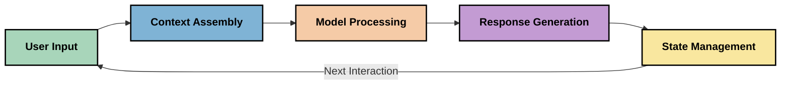
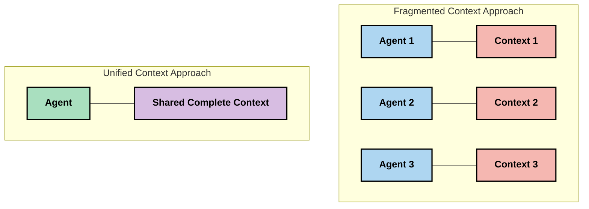

<!--
CO_OP_TRANSLATOR_METADATA:
{
  "original_hash": "fd169ca3071b81b5ee282e194bc823df",
  "translation_date": "2025-09-15T20:11:56+00:00",
  "source_file": "05-AdvancedTopics/mcp-contextengineering/README.md",
  "language_code": "ne"
}
-->
# सन्दर्भ इन्जिनियरिङ: MCP पारिस्थितिकी तन्त्रमा एक उदाउँदो अवधारणा

## अवलोकन

सन्दर्भ इन्जिनियरिङ कृत्रिम बुद्धिमत्ता (AI) क्षेत्रमा एक नयाँ अवधारणा हो, जसले ग्राहक र AI सेवाहरू बीचको अन्तरक्रियामा जानकारी कसरी संरचित, प्रदान, र व्यवस्थापन गरिन्छ भन्ने कुरा अध्ययन गर्छ। जस्तै-जस्तै Model Context Protocol (MCP) पारिस्थितिकी तन्त्र विकसित हुँदै जान्छ, सन्दर्भलाई प्रभावकारी रूपमा व्यवस्थापन गर्ने तरिकालाई बुझ्नु झन् महत्त्वपूर्ण बन्दै गएको छ। यो मोड्युलले सन्दर्भ इन्जिनियरिङको अवधारणालाई परिचय गराउँछ र MCP कार्यान्वयनमा यसको सम्भावित प्रयोगहरूको अन्वेषण गर्दछ।

## सिकाइका उद्देश्यहरू

यो मोड्युलको अन्त्यसम्ममा, तपाईंले निम्न कुरा गर्न सक्नुहुनेछ:

- सन्दर्भ इन्जिनियरिङको नयाँ अवधारणालाई बुझ्ने र MCP अनुप्रयोगहरूमा यसको सम्भावित भूमिकाको पहिचान गर्ने
- MCP प्रोटोकल डिजाइनले सम्बोधन गर्ने सन्दर्भ व्यवस्थापनका प्रमुख चुनौतीहरूको पहिचान गर्ने
- राम्रो सन्दर्भ व्यवस्थापनद्वारा मोडेलको प्रदर्शन सुधार गर्ने प्रविधिहरूको अन्वेषण गर्ने
- सन्दर्भ प्रभावकारिता मापन र मूल्याङ्कन गर्ने दृष्टिकोणहरू विचार गर्ने
- यी नयाँ अवधारणाहरूलाई MCP फ्रेमवर्कमार्फत AI अनुभव सुधार गर्न प्रयोग गर्ने

## सन्दर्भ इन्जिनियरिङमा परिचय

सन्दर्भ इन्जिनियरिङ प्रयोगकर्ता, अनुप्रयोग, र AI मोडेलहरू बीच जानकारी प्रवाहको जानाजानी डिजाइन र व्यवस्थापनमा केन्द्रित नयाँ अवधारणा हो। प्रम्प्ट इन्जिनियरिङ जस्ता स्थापित क्षेत्रहरूभन्दा फरक, सन्दर्भ इन्जिनियरिङ अझै अभ्यासकर्ताहरूद्वारा परिभाषित भइरहेको छ, जसले AI मोडेलहरूलाई सही समयमा सही जानकारी उपलब्ध गराउने अनौठो चुनौतीहरूको समाधान गर्न काम गरिरहेका छन्।

जसरी ठूला भाषा मोडेलहरू (LLMs) विकसित भएका छन्, सन्दर्भको महत्त्व झन् स्पष्ट हुँदै गएको छ। हामीले प्रदान गर्ने सन्दर्भको गुणस्तर, सान्दर्भिकता, र संरचनाले मोडेलको नतिजामा प्रत्यक्ष प्रभाव पार्छ। सन्दर्भ इन्जिनियरिङले यस सम्बन्धको अन्वेषण गर्छ र प्रभावकारी सन्दर्भ व्यवस्थापनका लागि सिद्धान्तहरू विकास गर्न खोज्छ।

> "सन् २०२५ मा, उपलब्ध मोडेलहरू अत्यन्तै बौद्धिक छन्। तर, सबैभन्दा स्मार्ट मानिसले पनि आफूलाई सोधिएको कामको सन्दर्भ बिना प्रभावकारी रूपमा काम गर्न सक्दैन... 'सन्दर्भ इन्जिनियरिङ' प्रम्प्ट इन्जिनियरिङको अर्को स्तर हो। यो गतिशील प्रणालीमा स्वचालित रूपमा यो गर्ने बारे हो।" — वाल्डेन यान, Cognition AI

सन्दर्भ इन्जिनियरिङले निम्न कुरा समेट्न सक्छ:

1. **सन्दर्भ चयन**: कुनै कार्यका लागि कुन जानकारी सान्दर्भिक छ भन्ने निर्धारण गर्ने
2. **सन्दर्भ संरचना**: मोडेलको बुझाइलाई अधिकतम बनाउन जानकारीलाई व्यवस्थित गर्ने
3. **सन्दर्भ वितरण**: जानकारीलाई मोडेलहरूमा पठाउने तरिका र समयलाई अनुकूल बनाउने
4. **सन्दर्भ मर्मत**: समयसँगै सन्दर्भको अवस्था र विकासलाई व्यवस्थापन गर्ने
5. **सन्दर्भ मूल्याङ्कन**: सन्दर्भको प्रभावकारिता मापन र सुधार गर्ने

यी ध्यान केन्द्रित क्षेत्रहरू MCP पारिस्थितिकी तन्त्रसँग विशेष रूपमा सम्बन्धित छन्, जसले LLMs लाई सन्दर्भ प्रदान गर्नका लागि एक मानकीकृत तरिका प्रदान गर्दछ।

## सन्दर्भ यात्राको दृष्टिकोण

सन्दर्भ इन्जिनियरिङलाई कल्पना गर्ने एउटा तरिका भनेको MCP प्रणालीमार्फत जानकारीले लिने यात्रालाई ट्रेस गर्नु हो:

### सन्दर्भ यात्राका प्रमुख चरणहरू:

1. **प्रयोगकर्ता इनपुट**: प्रयोगकर्ताबाट प्राप्त कच्चा जानकारी (पाठ, छविहरू, कागजातहरू)
2. **सन्दर्भ संयोजन**: प्रयोगकर्ता इनपुटलाई प्रणाली सन्दर्भ, वार्तालाप इतिहास, र अन्य पुनःप्राप्त जानकारीसँग मिलाउने
3. **मोडेल प्रशोधन**: AI मोडेलले संयोजित सन्दर्भलाई प्रशोधन गर्ने
4. **प्रतिक्रिया उत्पादन**: मोडेलले प्रदान गरिएको सन्दर्भको आधारमा नतिजा उत्पादन गर्ने
5. **अवस्था व्यवस्थापन**: प्रणालीले अन्तरक्रियाको आधारमा आफ्नो आन्तरिक अवस्थालाई अद्यावधिक गर्ने

यो दृष्टिकोणले AI प्रणालीहरूमा सन्दर्भको गतिशील प्रकृतिलाई उजागर गर्छ र प्रत्येक चरणमा जानकारीलाई कसरी राम्रोसँग व्यवस्थापन गर्ने भन्ने महत्त्वपूर्ण प्रश्नहरू उठाउँछ।

## सन्दर्भ इन्जिनियरिङमा उदाउँदा सिद्धान्तहरू

जसरी सन्दर्भ इन्जिनियरिङको क्षेत्र आकार लिँदैछ, केही प्रारम्भिक सिद्धान्तहरू अभ्यासकर्ताहरूबाट देखा पर्दैछन्। यी सिद्धान्तहरूले MCP कार्यान्वयन विकल्पहरूलाई जानकारी दिन मद्दत गर्न सक्छन्:

### सिद्धान्त १: सन्दर्भ पूर्ण रूपमा साझा गर्नुहोस्

सिस्टमका सबै कम्पोनेन्टहरू बीच सन्दर्भ पूर्ण रूपमा साझा गरिनुपर्छ, धेरै एजेन्टहरू वा प्रक्रियाहरूमा टुक्रा-टुक्रा पार्नुको सट्टा। जब सन्दर्भ वितरण गरिन्छ, प्रणालीको एक भागमा गरिएका निर्णयहरू अन्यत्र गरिएका निर्णयहरूसँग बाझिन सक्छन्।

MCP अनुप्रयोगहरूमा, यसले सन्दर्भलाई सम्पूर्ण पाइपलाइनभरि सहज रूपमा प्रवाह हुने गरी डिजाइन गर्ने सुझाव दिन्छ, टुक्रा-टुक्रा पार्ने होइन।

### सिद्धान्त २: कार्यहरूले निहित निर्णयहरू समेट्छन् भन्ने कुरा बुझ्नुहोस्

मोडेलले लिने प्रत्येक कार्यले सन्दर्भलाई कसरी व्याख्या गर्ने भन्ने बारे निहित निर्णयहरू समेट्छ। जब विभिन्न सन्दर्भहरूमा धेरै कम्पोनेन्टहरूले कार्य गर्छन्, यी निहित निर्णयहरू बाझिन सक्छन्, जसले असंगत नतिजाहरू निम्त्याउँछ।

यस सिद्धान्तले MCP अनुप्रयोगहरूका लागि महत्त्वपूर्ण निहितार्थहरू राख्छ:
- जटिल कार्यहरूको रेखीय प्रशोधनलाई टुक्रा-टुक्रा सन्दर्भसहित समानान्तर कार्यान्वयनभन्दा प्राथमिकता दिनुहोस्
- सबै निर्णय बिन्दुहरूले समान सन्दर्भ जानकारीमा पहुँच पाउने सुनिश्चित गर्नुहोस्
- पछिल्ला चरणहरूले अघिल्ला निर्णयहरूको पूर्ण सन्दर्भ देख्न सक्ने गरी प्रणालीहरू डिजाइन गर्नुहोस्

### सिद्धान्त ३: सन्दर्भको गहिराइ र विन्डो सीमाहरूको सन्तुलन राख्नुहोस्

जसरी वार्तालाप र प्रक्रियाहरू लामो बन्छन्, सन्दर्भ विन्डोहरू अन्ततः भरिन्छन्। प्रभावकारी सन्दर्भ इन्जिनियरिङले व्यापक सन्दर्भ र प्राविधिक सीमाहरू बीचको यो तनाव व्यवस्थापन गर्ने दृष्टिकोणहरूको अन्वेषण गर्छ।

अन्वेषण गरिएका सम्भावित दृष्टिकोणहरूमा समावेश छन्:
- टोकन प्रयोग घटाउँदै आवश्यक जानकारी कायम राख्ने सन्दर्भ सङ्कुचन
- हालको आवश्यकतासँग सान्दर्भिकताको आधारमा सन्दर्भको प्रगतिशील लोडिङ
- अघिल्ला अन्तरक्रियाहरूको मुख्य निर्णय र तथ्यहरू सुरक्षित राख्दै सारांश बनाउने

## सन्दर्भ चुनौतीहरू र MCP प्रोटोकल डिजाइन

Model Context Protocol (MCP) सन्दर्भ व्यवस्थापनका अनौठा चुनौतीहरूको सचेततासहित डिजाइन गरिएको हो। यी चुनौतीहरू बुझ्दा MCP प्रोटोकल डिजाइनका प्रमुख पक्षहरूको व्याख्या गर्न मद्दत हुन्छ:

### चुनौती १: सन्दर्भ विन्डो सीमाहरू
धेरै AI मोडेलहरूको निश्चित सन्दर्भ विन्डो आकार हुन्छ, जसले एक पटकमा कति जानकारी प्रशोधन गर्न सकिन्छ भन्ने सीमित गर्दछ।

**MCP डिजाइनको प्रतिक्रिया:**
- प्रोटोकलले संरचित, स्रोत-आधारित सन्दर्भलाई समर्थन गर्दछ, जसलाई प्रभावकारी रूपमा सन्दर्भित गर्न सकिन्छ
- स्रोतहरूलाई पृष्ठाङ्कन गर्न र प्रगतिशील रूपमा लोड गर्न सकिन्छ

### चुनौती २: सान्दर्भिकता निर्धारण
सन्दर्भमा समावेश गर्न सबैभन्दा सान्दर्भिक जानकारी निर्धारण गर्नु गाह्रो छ।

**MCP डिजाइनको प्रतिक्रिया:**
- लचिलो उपकरणहरूले आवश्यकताका आधारमा गतिशील रूपमा जानकारी पुनःप्राप्त गर्न अनुमति दिन्छ
- संरचित प्रम्प्टहरूले सन्दर्भ संगठनलाई निरन्तर बनाउँछ

### चुनौती ३: सन्दर्भ स्थायित्व
अन्तरक्रियाहरूमा अवस्था व्यवस्थापनले सन्दर्भको सावधानीपूर्वक ट्र्याकिङ आवश्यक पर्छ।

**MCP डिजाइनको प्रतिक्रिया:**
- मानकीकृत सत्र व्यवस्थापन
- सन्दर्भ विकासका लागि स्पष्ट रूपमा परिभाषित अन्तरक्रिया ढाँचाहरू

### चुनौती ४: बहु-मोडल सन्दर्भ
विभिन्न प्रकारका डाटा (पाठ, छविहरू, संरचित डाटा) ले फरक ह्यान्डलिङ आवश्यक पर्छ।

**MCP डिजाइनको प्रतिक्रिया:**
- प्रोटोकल डिजाइनले विभिन्न सामग्री प्रकारहरूलाई समायोजन गर्दछ
- बहु-मोडल जानकारीको मानकीकृत प्रतिनिधित्व

### चुनौती ५: सुरक्षा र गोपनीयता
सन्दर्भले प्रायः संवेदनशील जानकारी समावेश गर्दछ, जसलाई सुरक्षित राख्नुपर्छ।

**MCP डिजाइनको प्रतिक्रिया:**
- ग्राहक र सर्भर जिम्मेवारीहरू बीच स्पष्ट सीमाहरू
- डाटा एक्सपोजरलाई न्यूनतम बनाउन स्थानीय प्रशोधन विकल्पहरू

यी चुनौतीहरू र MCP ले तिनीहरूलाई कसरी सम्बोधन गर्छ भन्ने कुरा बुझ्दा उन्नत सन्दर्भ इन्जिनियरिङ प्रविधिहरूको अन्वेषणका लागि आधार प्रदान गर्दछ।
- [मोडेल कन्टेक्स्ट प्रोटोकल वेबसाइट](https://modelcontextprotocol.io/)
- [मोडेल कन्टेक्स्ट प्रोटोकल स्पेसिफिकेशन](https://github.com/modelcontextprotocol/modelcontextprotocol)
- [MCP डकुमेन्टेसन](https://modelcontextprotocol.io/docs)
- [MCP C# SDK](https://github.com/modelcontextprotocol/csharp-sdk)
- [MCP Python SDK](https://github.com/modelcontextprotocol/python-sdk)
- [MCP TypeScript SDK](https://github.com/modelcontextprotocol/typescript-sdk)
- [MCP इन्स्पेक्टर](https://github.com/modelcontextprotocol/inspector) - MCP सर्भरहरूको लागि भिजुअल परीक्षण उपकरण

### कन्टेक्स्ट इन्जिनियरिङ लेखहरू
- [मल्टि-एजेन्ट नबनाउनुहोस्: कन्टेक्स्ट इन्जिनियरिङका सिद्धान्तहरू](https://cognition.ai/blog/dont-build-multi-agents) - वाल्डेन यानको कन्टेक्स्ट इन्जिनियरिङ सिद्धान्तहरूमा विचारहरू
- [एजेन्ट निर्माणको व्यावहारिक मार्गदर्शन](https://cdn.openai.com/business-guides-and-resources/a-practical-guide-to-building-agents.pdf) - प्रभावकारी एजेन्ट डिजाइनको लागि OpenAI को मार्गदर्शन
- [प्रभावकारी एजेन्ट निर्माण](https://www.anthropic.com/engineering/building-effective-agents) - एजेन्ट विकासमा Anthropic को दृष्टिकोण

### सम्बन्धित अनुसन्धान
- [ठूला भाषा मोडेलहरूको लागि डायनामिक रिट्रिभल अग्मेन्टेसन](https://arxiv.org/abs/2310.01487) - डायनामिक रिट्रिभल विधिहरूमा अनुसन्धान
- [बीचमा हराउनु: भाषा मोडेलहरूले लामो कन्टेक्स्ट कसरी प्रयोग गर्छन्](https://arxiv.org/abs/2307.03172) - कन्टेक्स्ट प्रोसेसिङ ढाँचाहरूमा महत्त्वपूर्ण अनुसन्धान
- [CLIP लेटेन्ट्सको साथ हाइरार्किकल टेक्स्ट-कन्डिसन्ड इमेज जेनेरेसन](https://arxiv.org/abs/2204.06125) - DALL-E 2 पेपरमा कन्टेक्स्ट संरचनाबारे जानकारी
- [ठूला भाषा मोडेल आर्किटेक्चरहरूमा कन्टेक्स्टको भूमिका अन्वेषण गर्दै](https://aclanthology.org/2023.findings-emnlp.124/) - कन्टेक्स्ट ह्यान्डलिङमा हालको अनुसन्धान
- [मल्टि-एजेन्ट सहकार्य: एक सर्वेक्षण](https://arxiv.org/abs/2304.03442) - मल्टि-एजेन्ट प्रणालीहरू र तिनका चुनौतीहरूमा अनुसन्धान

### थप स्रोतहरू
- [कन्टेक्स्ट विन्डो अप्टिमाइजेसन प्रविधिहरू](https://learn.microsoft.com/en-us/azure/ai-services/openai/concepts/context-window)
- [उन्नत RAG प्रविधिहरू](https://www.microsoft.com/en-us/research/blog/retrieval-augmented-generation-rag-and-frontier-models/)
- [सेम्यान्टिक कर्नेल डकुमेन्टेसन](https://github.com/microsoft/semantic-kernel)
- [कन्टेक्स्ट व्यवस्थापनको लागि AI टूलकिट](https://github.com/microsoft/aitoolkit)

## अब के गर्ने 

- [5.15 MCP कस्टम ट्रान्सपोर्ट](../mcp-transport/README.md)

---

**अस्वीकरण**:  
यो दस्तावेज़ AI अनुवाद सेवा [Co-op Translator](https://github.com/Azure/co-op-translator) प्रयोग गरेर अनुवाद गरिएको हो। हामी शुद्धताको लागि प्रयास गर्छौं, तर कृपया ध्यान दिनुहोस् कि स्वचालित अनुवादमा त्रुटिहरू वा अशुद्धताहरू हुन सक्छ। यसको मूल भाषा मा रहेको मूल दस्तावेज़लाई आधिकारिक स्रोत मानिनुपर्छ। महत्वपूर्ण जानकारीको लागि, व्यावसायिक मानव अनुवाद सिफारिस गरिन्छ। यस अनुवादको प्रयोगबाट उत्पन्न हुने कुनै पनि गलतफहमी वा गलत व्याख्याको लागि हामी जिम्मेवार हुने छैनौं।