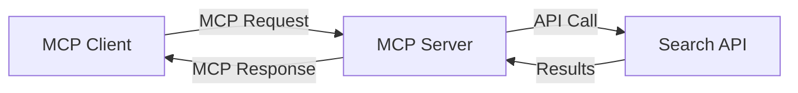
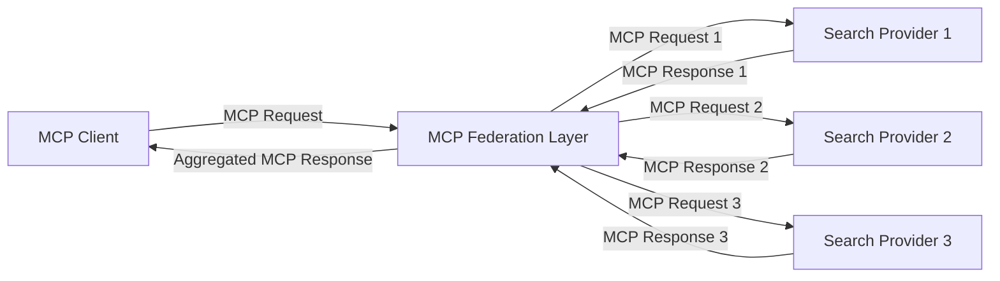
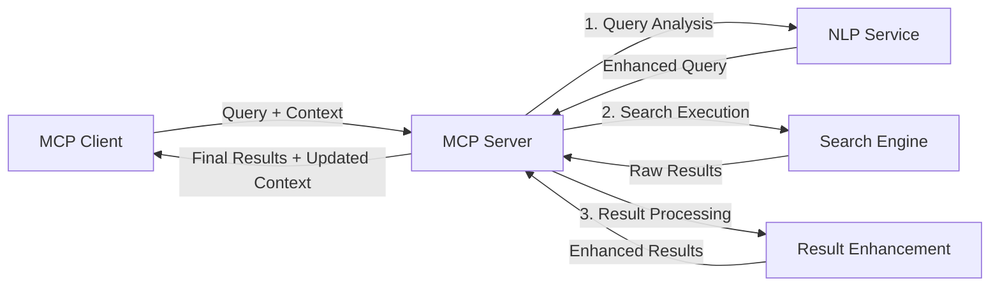

<!--
CO_OP_TRANSLATOR_METADATA:
{
  "original_hash": "333a03e51f90bdf3e6f1ba1694c73f36",
  "translation_date": "2025-07-17T00:36:37+00:00",
  "source_file": "05-AdvancedTopics/mcp-realtimesearch/README.md",
  "language_code": "ne"
}
-->
## कोड उदाहरणहरू अस्वीकरण

> **महत्त्वपूर्ण नोट**: तलका कोड उदाहरणहरूले Model Context Protocol (MCP) लाई वेब सर्च कार्यक्षमतासँग कसरी एकीकृत गर्ने देखाउँछन्। यिनीहरू आधिकारिक MCP SDK हरूका ढाँचा र संरचनाहरूलाई पछ्याउँछन्, तर शैक्षिक उद्देश्यका लागि सरल बनाइएको छ।
> 
> यी उदाहरणहरूले देखाउँछन्:
> 
> 1. **Python कार्यान्वयन**: FastMCP सर्भर कार्यान्वयन जसले वेब सर्च उपकरण प्रदान गर्दछ र बाह्य सर्च API सँग जडान हुन्छ। यो उदाहरणले उचित lifespan व्यवस्थापन, सन्दर्भ ह्यान्डलिङ, र उपकरण कार्यान्वयन देखाउँछ जुन [आधिकारिक MCP Python SDK](https://github.com/modelcontextprotocol/python-sdk) का ढाँचाहरूलाई अनुसरण गर्दछ। सर्भरले सिफारिस गरिएको Streamable HTTP ट्रान्सपोर्ट प्रयोग गर्दछ जुन उत्पादनमा पुरानो SSE ट्रान्सपोर्टलाई प्रतिस्थापन गरेको छ।
> 
> 2. **JavaScript कार्यान्वयन**: TypeScript/JavaScript कार्यान्वयन जसले FastMCP ढाँचालाई [आधिकारिक MCP TypeScript SDK](https://github.com/modelcontextprotocol/typescript-sdk) बाट प्रयोग गरी सर्च सर्भर बनाउँछ, जसमा उचित उपकरण परिभाषा र क्लाइन्ट जडानहरू छन्। यसले सत्र व्यवस्थापन र सन्दर्भ संरक्षणका लागि नवीनतम सिफारिस गरिएका ढाँचाहरू अनुसरण गर्दछ।
> 
> यी उदाहरणहरू उत्पादन प्रयोगका लागि थप त्रुटि ह्यान्डलिङ, प्रमाणीकरण, र विशिष्ट API एकीकरण कोड आवश्यक पर्न सक्छ। देखाइएको सर्च API अन्तबिन्दुहरू (`https://api.search-service.example/search`) प्लेसहोल्डर हुन् र वास्तविक सर्च सेवा अन्तबिन्दुहरूसँग प्रतिस्थापन गर्नुपर्ने हुन्छ।
> 
> पूर्ण कार्यान्वयन विवरण र सबैभन्दा नयाँ तरिकाहरूका लागि कृपया [आधिकारिक MCP विनिर्देशन](https://spec.modelcontextprotocol.io/) र SDK कागजातहरू हेर्नुहोस्।

## मुख्य अवधारणाहरू

### Model Context Protocol (MCP) फ्रेमवर्क

आधारभूत रूपमा, Model Context Protocol ले AI मोडेलहरू, अनुप्रयोगहरू, र सेवाहरूबीच सन्दर्भ आदानप्रदान गर्न मानकीकृत तरिका प्रदान गर्दछ। रियल-टाइम वेब सर्चमा, यो फ्रेमवर्कले सुसंगत, बहु-चरणीय सर्च अनुभवहरू सिर्जना गर्न आवश्यक छ। मुख्य कम्पोनेन्टहरूमा समावेश छन्:

1. **क्लाइन्ट-सर्भर वास्तुकला**: MCP ले सर्च क्लाइन्टहरू (अनुरोधकर्ताहरू) र सर्च सर्भरहरू (प्रदायकहरू) बीच स्पष्ट विभाजन स्थापना गर्दछ, जसले लचिलो परिनियोजन मोडेलहरूलाई अनुमति दिन्छ।

2. **JSON-RPC सञ्चार**: यो प्रोटोकलले सन्देश आदानप्रदानका लागि JSON-RPC प्रयोग गर्दछ, जसले वेब प्रविधिहरूसँग अनुकूलता र विभिन्न प्लेटफर्महरूमा सजिलै कार्यान्वयन गर्न सकिन्छ।

3. **सन्दर्भ व्यवस्थापन**: MCP ले बहु अन्तरक्रियाहरूमा सर्च सन्दर्भ कायम राख्न, अपडेट गर्न, र उपयोग गर्न संरचित विधिहरू परिभाषित गर्दछ।

4. **उपकरण परिभाषाहरू**: सर्च क्षमताहरूलाई मानकीकृत उपकरणहरूका रूपमा खुलासा गरिन्छ जसमा राम्ररी परिभाषित प्यारामिटरहरू र फिर्ता मानहरू हुन्छन्।

5. **स्ट्रीमिङ समर्थन**: प्रोटोकलले परिणामहरू स्ट्रीम गर्न समर्थन गर्दछ, जुन रियल-टाइम सर्चका लागि आवश्यक हुन्छ जहाँ परिणामहरू क्रमिक रूपमा आउन सक्छन्।

### वेब सर्च एकीकरण ढाँचाहरू

MCP लाई वेब सर्चसँग एकीकृत गर्दा, केही ढाँचाहरू देखा पर्छन्:

#### १. प्रत्यक्ष सर्च प्रदायक एकीकरण

यस ढाँचामा, MCP सर्भरले सिधै एक वा बढी सर्च API हरूसँग अन्तरक्रिया गर्छ, MCP अनुरोधहरूलाई API-विशिष्ट कलहरूमा अनुवाद गरी परिणामहरू MCP प्रतिक्रियाका रूपमा ढाल्छ।

#### २. सन्दर्भ संरक्षणसहित संघीय सर्च

यस ढाँचाले सर्च क्वेरीहरूलाई धेरै MCP-अनुकूल सर्च प्रदायकहरूमा वितरण गर्छ, जसले फरक प्रकारका सामग्री वा सर्च क्षमताहरूमा विशेषज्ञता राख्न सक्छन्, र एकीकृत सन्दर्भ कायम राख्छ।

#### ३. सन्दर्भ-संवर्धित सर्च चेन

यस ढाँचामा, सर्च प्रक्रिया धेरै चरणहरूमा विभाजित हुन्छ, प्रत्येक चरणमा सन्दर्भ समृद्ध हुँदै जान्छ, जसले क्रमिक रूपमा बढी सान्दर्भिक परिणामहरू दिन्छ।

### सर्च सन्दर्भ कम्पोनेन्टहरू

MCP-आधारित वेब सर्चमा, सन्दर्भ सामान्यतया समावेश गर्दछ:

- **क्वेरी इतिहास**: सत्रमा भएका अघिल्ला सर्च क्वेरीहरू
- **प्रयोगकर्ता प्राथमिकताहरू**: भाषा, क्षेत्र, सुरक्षित सर्च सेटिङहरू
- **अन्तरक्रिया इतिहास**: कुन परिणामहरू क्लिक गरियो, परिणामहरूमा बिताएको समय
- **सर्च प्यारामिटरहरू**: फिल्टरहरू, क्रमबद्धता, र अन्य सर्च संशोधकहरू
- **डोमेन ज्ञान**: सर्चसँग सम्बन्धित विषय-विशेष सन्दर्भ
- **कालिक सन्दर्भ**: समय-आधारित सान्दर्भिकता कारकहरू
- **स्रोत प्राथमिकताहरू**: विश्वासयोग्य वा प्राथमिक सूचना स्रोतहरू

## प्रयोग केसहरू र अनुप्रयोगहरू

### अनुसन्धान र सूचना सङ्कलन

MCP ले अनुसन्धान कार्यप्रवाहहरूलाई सुधार गर्दछ:

- सर्च सत्रहरूमा अनुसन्धान सन्दर्भ कायम राखेर
- थप परिष्कृत र सान्दर्भिक क्वेरीहरू सक्षम पारेर
- बहु-स्रोत सर्च संघीयता समर्थन गरेर
- सर्च परिणामहरूबाट ज्ञान निष्कर्षण सजिलो बनाउँदै

### रियल-टाइम समाचार र ट्रेन्ड अनुगमन

MCP-संचालित सर्चले समाचार अनुगमनमा फाइदा दिन्छ:

- उदाउँदो समाचार कथाहरूको लगभग रियल-टाइम पत्ता लगाउने
- सान्दर्भिक जानकारीको सन्दर्भगत फिल्टरिङ
- धेरै स्रोतहरूमा विषय र इकाई ट्र्याकिङ
- प्रयोगकर्ता सन्दर्भमा आधारित व्यक्तिगत समाचार सूचनाहरू

### AI-संवर्धित ब्राउजिङ र अनुसन्धान

MCP ले AI-संवर्धित ब्राउजिङका लागि नयाँ सम्भावनाहरू सिर्जना गर्दछ:

- हालको ब्राउजर गतिविधिमा आधारित सान्दर्भिक सर्च सुझावहरू
- वेब सर्चलाई LLM-संचालित सहायकहरूसँग सहज एकीकरण
- बहु-चरणीय सर्च सुधार जसले सन्दर्भ कायम राख्छ
- तथ्य-जाँच र सूचना प्रमाणीकरणमा सुधार

## भविष्यका प्रवृत्ति र नवप्रवर्तनहरू

### वेब सर्चमा MCP को विकास

आगामीमा, हामी MCP ले निम्न कुराहरू सम्बोधन गर्ने अपेक्षा गर्छौं:

- **बहु-मोडल सर्च**: पाठ, छवि, अडियो, र भिडियो सर्चलाई सन्दर्भ संरक्षणसहित एकीकृत गर्ने
- **केन्द्रविहीन सर्च**: वितरण र संघीय सर्च पारिस्थितिकी तन्त्रहरूलाई समर्थन गर्ने
- **खोज गोपनीयता**: सन्दर्भ-सम्झने गोपनीयता संरक्षण गर्ने खोजी प्रणालीहरू  
- **प्रश्न बुझाइ**: प्राकृतिक भाषाका खोजी प्रश्नहरूको गहिरो अर्थपूर्ण विश्लेषण  

### प्रविधिमा सम्भावित प्रगतिहरू  

भविष्यको MCP खोजीलाई आकार दिने उदाउँदो प्रविधिहरू:  

1. **न्यूरल खोजी संरचनाहरू**: MCP का लागि अनुकूलित एम्बेडिङ-आधारित खोजी प्रणालीहरू  
2. **व्यक्तिगत खोजी सन्दर्भ**: समयसँगै व्यक्तिगत प्रयोगकर्ताको खोजी बानी सिक्ने  
3. **ज्ञान ग्राफ एकीकरण**: डोमेन-विशेष ज्ञान ग्राफहरूले सन्दर्भयुक्त खोजीलाई सुदृढ पार्ने  
4. **क्रस-मोडल सन्दर्भ**: विभिन्न खोजी मोडालिटीहरूमा सन्दर्भ कायम राख्ने  

## व्यावहारिक अभ्यासहरू  

### अभ्यास १: आधारभूत MCP खोजी पाइपलाइन सेटअप गर्ने  

यस अभ्यासमा, तपाईं सिक्नुहुनेछ:  
- आधारभूत MCP खोजी वातावरण कन्फिगर गर्ने  
- वेब खोजीका लागि सन्दर्भ ह्यान्डलरहरू कार्यान्वयन गर्ने  
- खोजी पुनरावृत्तिहरूमा सन्दर्भ संरक्षण परीक्षण र मान्य गर्ने  

### अभ्यास २: MCP खोजीसँग अनुसन्धान सहायक बनाउने  

पूर्ण एप्लिकेशन बनाउनुहोस् जसले:  
- प्राकृतिक भाषाका अनुसन्धान प्रश्नहरू प्रशोधन गर्छ  
- सन्दर्भ-सम्झने वेब खोजीहरू सञ्चालन गर्छ  
- विभिन्न स्रोतहरूबाट जानकारी संश्लेषण गर्छ  
- व्यवस्थित अनुसन्धान निष्कर्षहरू प्रस्तुत गर्छ  

### अभ्यास ३: MCP सँग बहु-स्रोत खोजी संघ कार्यान्वयन गर्ने  

उन्नत अभ्यास जसले समेट्छ:  
- बहु खोजी इन्जिनहरूमा सन्दर्भ-सम्झने प्रश्न प्रेषण  
- परिणामहरूको रैंकिङ र समेकन  
- खोजी परिणामहरूको सन्दर्भगत दोहोर्याइ हटाउने  
- स्रोत-विशेष मेटाडाटा व्यवस्थापन  

## थप स्रोतहरू  

- [Model Context Protocol Specification](https://spec.modelcontextprotocol.io/) - आधिकारिक MCP विशिष्टता र विस्तृत प्रोटोकल कागजात  
- [Model Context Protocol Documentation](https://modelcontextprotocol.io/) - विस्तृत ट्युटोरियल र कार्यान्वयन मार्गदर्शन  
- [MCP Python SDK](https://github.com/modelcontextprotocol/python-sdk) - MCP प्रोटोकलको आधिकारिक Python कार्यान्वयन  
- [MCP TypeScript SDK](https://github.com/modelcontextprotocol/typescript-sdk) - MCP प्रोटोकलको आधिकारिक TypeScript कार्यान्वयन  
- [MCP Reference Servers](https://github.com/modelcontextprotocol/servers) - MCP सर्भरहरूको सन्दर्भ कार्यान्वयनहरू  
- [Bing Web Search API Documentation](https://learn.microsoft.com/en-us/bing/search-apis/bing-web-search/overview) - Microsoft को वेब खोजी API  
- [Google Custom Search JSON API](https://developers.google.com/custom-search/v1/overview) - Google को प्रोग्रामेबल खोजी इन्जिन  
- [SerpAPI Documentation](https://serpapi.com/search-api) - खोजी इन्जिन परिणाम पृष्ठ API  
- [Meilisearch Documentation](https://www.meilisearch.com/docs) - खुला स्रोत खोजी इन्जिन  
- [Elasticsearch Documentation](https://www.elastic.co/guide/index.html) - वितरित खोजी र विश्लेषण इन्जिन  
- [LangChain Documentation](https://python.langchain.com/docs/get_started/introduction) - LLMs सँग एप्लिकेशन निर्माण  

## सिकाइ नतिजाहरू  

यस मोड्युल पूरा गरेपछि, तपाईं सक्षम हुनुहुनेछ:  

- वास्तविक-समय वेब खोजीका आधारभूत सिद्धान्तहरू र चुनौतीहरू बुझ्न  
- Model Context Protocol (MCP) ले कसरी वास्तविक-समय वेब खोजी क्षमताहरू सुधार गर्छ व्याख्या गर्न  
- लोकप्रिय फ्रेमवर्क र API हरू प्रयोग गरी MCP-आधारित खोजी समाधानहरू कार्यान्वयन गर्न  
- MCP सँग स्केलेबल, उच्च प्रदर्शन खोजी संरचनाहरू डिजाइन र तैनाथ गर्न  
- MCP अवधारणाहरूलाई सेम्यान्टिक खोजी, अनुसन्धान सहायता, र AI-सहायता ब्राउजिङ जस्ता विभिन्न प्रयोग केसहरूमा लागू गर्न  
- MCP-आधारित खोजी प्रविधिहरूमा उदाउँदो प्रवृत्ति र भविष्यका नवप्रवर्तनहरू मूल्याङ्कन गर्न  

### विश्वास र सुरक्षा सम्बन्धी विचारहरू  

MCP-आधारित वेब खोजी समाधानहरू कार्यान्वयन गर्दा, MCP विशिष्टताबाट यी महत्वपूर्ण सिद्धान्तहरू सम्झनुहोस्:  

1. **प्रयोगकर्ता सहमति र नियन्त्रण**: प्रयोगकर्ताले सबै डाटा पहुँच र अपरेसनहरूमा स्पष्ट सहमति दिनु र बुझ्नु आवश्यक छ। यो विशेष गरी बाह्य डाटा स्रोतहरू पहुँच गर्ने वेब खोजी कार्यान्वयनहरूका लागि महत्वपूर्ण छ।  

2. **डाटा गोपनीयता**: खोजी प्रश्न र परिणामहरू उचित रूपमा व्यवस्थापन गर्नुहोस्, विशेष गरी संवेदनशील जानकारी समावेश हुँदा। प्रयोगकर्ता डाटाको सुरक्षा गर्न उपयुक्त पहुँच नियन्त्रण लागू गर्नुहोस्।  

3. **उपकरण सुरक्षा**: खोजी उपकरणहरूको लागि उचित प्राधिकरण र प्रमाणीकरण कार्यान्वयन गर्नुहोस्, किनभने तिनीहरूले मनमानी कोड कार्यान्वयन मार्फत सुरक्षा जोखिम उत्पन्न गर्न सक्छन्। उपकरण व्यवहारका विवरणहरू विश्वसनीय सर्भरबाट प्राप्त नभएसम्म अविश्वसनीय मान्नुपर्छ।  

4. **स्पष्ट कागजातहरू**: तपाईंको MCP-आधारित खोजी कार्यान्वयनका क्षमता, सीमाहरू, र सुरक्षा विचारहरू स्पष्ट रूपमा कागजात गर्नुहोस्, MCP विशिष्टताका कार्यान्वयन मार्गदर्शनहरू पालना गर्दै।  

5. **दृढ सहमति प्रक्रिया**: प्रत्येक उपकरणले के गर्छ स्पष्ट रूपमा व्याख्या गर्ने र प्रयोगको अनुमति दिनुअघि सहमति र प्राधिकरण प्रक्रियाहरू मजबुत बनाउनुहोस्, विशेष गरी ती उपकरणहरूका लागि जुन बाह्य वेब स्रोतहरूसँग अन्तरक्रिया गर्छन्।  

MCP सुरक्षा र विश्वास सम्बन्धी पूर्ण विवरणका लागि, [आधिकारिक कागजात](https://modelcontextprotocol.io/specification/2025-03-26#security-and-trust-%26-safety) हेर्नुहोस्।  

## अब के गर्ने  

- [5.12 Entra ID Authentication for Model Context Protocol Servers](../mcp-security-entra/README.md)

**अस्वीकरण**:  
यो दस्तावेज AI अनुवाद सेवा [Co-op Translator](https://github.com/Azure/co-op-translator) प्रयोग गरी अनुवाद गरिएको हो। हामी शुद्धताका लागि प्रयासरत छौं, तर कृपया ध्यान दिनुहोस् कि स्वचालित अनुवादमा त्रुटि वा अशुद्धता हुन सक्छ। मूल दस्तावेज यसको मूल भाषामा आधिकारिक स्रोत मानिनु पर्छ। महत्वपूर्ण जानकारीका लागि व्यावसायिक मानव अनुवाद सिफारिस गरिन्छ। यस अनुवादको प्रयोगबाट उत्पन्न कुनै पनि गलतफहमी वा गलत व्याख्याका लागि हामी जिम्मेवार छैनौं।