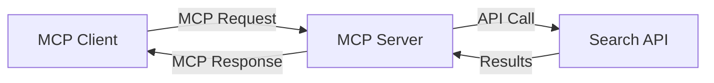
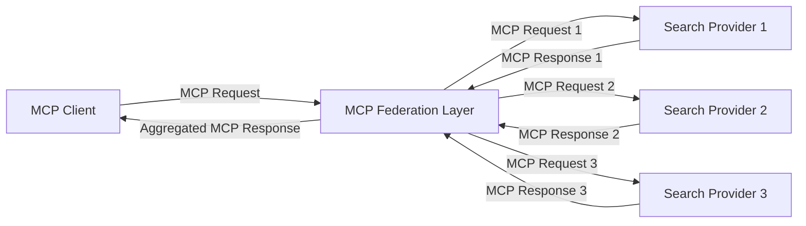
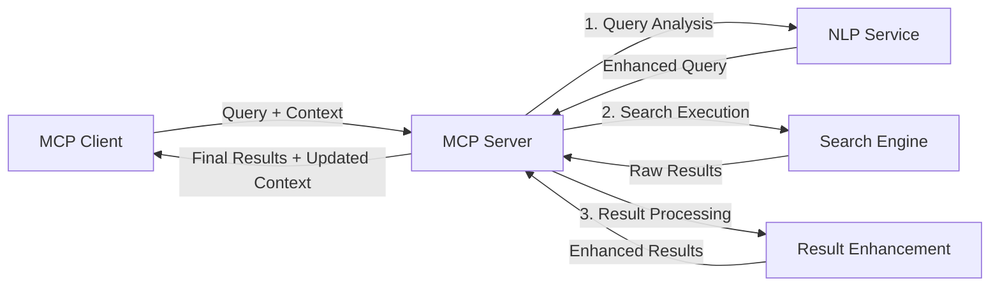

<!--
CO_OP_TRANSLATOR_METADATA:
{
  "original_hash": "eb12652eb7bd17f2193b835a344425c6",
  "translation_date": "2025-06-26T13:52:47+00:00",
  "source_file": "05-AdvancedTopics/mcp-realtimesearch/README.md",
  "language_code": "ne"
}
-->
## कोड उदाहरणहरूको अस्वीकरण

> **महत्वपूर्ण नोट**: तलका कोड उदाहरणहरूले Model Context Protocol (MCP) लाई वेब सर्च कार्यक्षमतासँग कसरी एकीकृत गर्ने देखाउँछन्। यी आधिकारिक MCP SDK हरूको ढाँचा र संरचनालाई अनुसरण गर्छन्, तर शैक्षिक प्रयोजनका लागि सरल बनाइएको छ।
> 
> यी उदाहरणहरूले देखाउँछन्:
> 
> 1. **Python कार्यान्वयन**: FastMCP सर्भर कार्यान्वयन जसले वेब सर्च उपकरण प्रदान गर्दछ र बाह्य सर्च API सँग जडान हुन्छ। यो उदाहरणले उचित जीवनचक्र व्यवस्थापन, सन्दर्भ ह्यान्डलिङ, र उपकरण कार्यान्वयन देखाउँछ जुन [आधिकारिक MCP Python SDK](https://github.com/modelcontextprotocol/python-sdk) का ढाँचाहरू अनुसरण गर्छ। सर्भरले सिफारिस गरिएको Streamable HTTP ट्रान्सपोर्ट प्रयोग गर्छ जुन उत्पादनमा पुरानो SSE ट्रान्सपोर्टलाई प्रतिस्थापन गरेको छ।
> 
> 2. **JavaScript कार्यान्वयन**: TypeScript/JavaScript कार्यान्वयन जसले FastMCP ढाँचालाई [आधिकारिक MCP TypeScript SDK](https://github.com/modelcontextprotocol/typescript-sdk) बाट प्रयोग गरी सर्च सर्भर बनाउँछ, उचित उपकरण परिभाषा र क्लाइन्ट कनेक्शनहरूसहित। यसले सत्र व्यवस्थापन र सन्दर्भ संरक्षणका लागि नवीनतम सिफारिस गरिएका ढाँचाहरू अनुसरण गर्छ।
> 
> यी उदाहरणहरू उत्पादन उपयोगका लागि थप त्रुटि ह्यान्डलिङ, प्रमाणीकरण, र विशिष्ट API एकीकरण कोड आवश्यक पर्न सक्छ। देखाइएको सर्च API अन्तबिन्दुहरू (`https://api.search-service.example/search`) प्लेसहोल्डर हुन् र वास्तविक सर्च सेवा अन्तबिन्दुहरूले प्रतिस्थापन हुनुपर्नेछ।
> 
> पूर्ण कार्यान्वयन विवरण र सबैभन्दा नयाँ दृष्टिकोणहरूको लागि, कृपया [आधिकारिक MCP विनिर्देशन](https://spec.modelcontextprotocol.io/) र SDK कागजातहरू हेर्नुहोस्।

## मुख्य अवधारणाहरू

### Model Context Protocol (MCP) फ्रेमवर्क

आधारमा, Model Context Protocol AI मोडेलहरू, अनुप्रयोगहरू, र सेवाहरूबीच सन्दर्भ आदानप्रदान गर्ने एक मानकीकृत तरिका प्रदान गर्छ। रियल-टाइम वेब सर्चमा, यो फ्रेमवर्कले सुसंगत, बहु-चरणीय सर्च अनुभवहरू सिर्जना गर्न आवश्यक हुन्छ। मुख्य कम्पोनेन्टहरू समावेश छन्:

1. **क्लाइन्ट-सर्भर वास्तुकला**: MCP ले सर्च क्लाइन्टहरू (अनुरोधकर्ताहरू) र सर्च सर्भरहरू (प्रदायकहरू) बीच स्पष्ट विभाजन स्थापना गर्छ, जसले लचिलो तैनाती मोडेलहरूलाई अनुमति दिन्छ।

2. **JSON-RPC सञ्चार**: यो प्रोटोकलले सन्देश आदानप्रदानका लागि JSON-RPC प्रयोग गर्छ, जसले वेब प्रविधिहरूसँग अनुकूलता र विभिन्न प्लेटफर्महरूमा सजिलो कार्यान्वयन सुनिश्चित गर्छ।

3. **सन्दर्भ व्यवस्थापन**: MCP ले बहु अन्तरक्रियाहरूमा सर्च सन्दर्भ कायम राख्ने, अपडेट गर्ने, र प्रयोग गर्ने संरचित विधिहरू परिभाषित गर्छ।

4. **उपकरण परिभाषाहरू**: सर्च क्षमताहरू मानकीकृत उपकरणहरूका रूपमा खुला गरिन्छ जसमा राम्ररी परिभाषित प्यारामिटरहरू र परिणाम मानहरू हुन्छन्।

5. **स्ट्रिमिङ समर्थन**: यो प्रोटोकलले परिणामहरूको स्ट्रिमिङ समर्थन गर्छ, जुन रियल-टाइम सर्चका लागि आवश्यक हुन्छ जहाँ परिणामहरू क्रमिक रूपमा आउन सक्छन्।

### वेब सर्च एकीकरण ढाँचाहरू

MCP लाई वेब सर्चसँग एकीकृत गर्दा, केही ढाँचाहरू देखा पर्छन्:

#### १. प्रत्यक्ष सर्च प्रदायक एकीकरण

यस ढाँचामा, MCP सर्भरले एक वा बढी सर्च API हरूसँग सिधा अन्तरक्रिया गर्छ, MCP अनुरोधहरूलाई API-विशिष्ट कलहरूमा अनुवाद गर्दै र परिणामहरूलाई MCP प्रतिक्रिया स्वरूप ढाल्दै।

#### २. सन्दर्भ संरक्षणसहित संघीय सर्च

यो ढाँचाले सर्च क्वेरीहरूलाई बहु MCP-अनुकूल सर्च प्रदायकहरूमा वितरण गर्छ, जसमा प्रत्येकले फरक प्रकारको सामग्री वा सर्च क्षमतामा विशेषज्ञता राख्न सक्छ, र एकीकृत सन्दर्भ कायम राख्छ।

#### ३. सन्दर्भ-वृद्ध सर्च चेन

यस ढाँचामा, सर्च प्रक्रिया बहु चरणहरूमा विभाजित हुन्छ, प्रत्येक चरणमा सन्दर्भ समृद्ध पार्दै, जसले क्रमिक रूपमा बढी सान्दर्भिक परिणामहरू ल्याउँछ।

### सर्च सन्दर्भका कम्पोनेन्टहरू

MCP आधारित वेब सर्चमा, सन्दर्भ सामान्यतया समावेश हुन्छ:

- **क्वेरी इतिहास**: सत्रमा पहिलेका सर्च क्वेरीहरू
- **प्रयोगकर्ता प्राथमिकताहरू**: भाषा, क्षेत्र, सुरक्षित सर्च सेटिङहरू
- **अन्तरक्रिया इतिहास**: कुन परिणामहरू क्लिक गरियो, परिणामहरूमा बिताएको समय
- **सर्च प्यारामिटरहरू**: फिल्टरहरू, क्रमबद्ध आदेशहरू, र अन्य सर्च संशोधकहरू
- **डोमेन ज्ञान**: खोजसँग सम्बन्धित विषय-विशिष्ट सन्दर्भ
- **कालिक सन्दर्भ**: समय-आधारित सान्दर्भिकता कारकहरू
- **स्रोत प्राथमिकताहरू**: विश्वासयोग्य वा प्राथमिकता दिइएका सूचना स्रोतहरू

## प्रयोग केसहरू र अनुप्रयोगहरू

### अनुसन्धान र सूचना सङ्कलन

MCP ले अनुसन्धान कार्यप्रवाहहरूलाई सुधार गर्छ:

- अनुसन्धान सन्दर्भलाई सर्च सत्रहरूमा कायम राख्दै
- थप परिष्कृत र सान्दर्भिक क्वेरीहरू सक्षम पार्दै
- बहु-स्रोत सर्च संघीकरण समर्थन गर्दै
- सर्च परिणामहरूबाट ज्ञान निष्कर्षण सजिलो पार्दै

### रियल-टाइम समाचार र ट्रेन्ड अनुगमन

MCP-सञ्चालित सर्चले समाचार अनुगमनमा फाइदा दिन्छ:

- उदाउँदै गरेका समाचार कथाहरूको लगभग रियल-टाइम पत्ता लगाउने
- सान्दर्भिक जानकारीको सन्दर्भगत फिल्टरिङ
- बहु स्रोतहरूमा विषय र इकाई ट्र्याकिङ
- प्रयोगकर्ता सन्दर्भमा आधारित व्यक्तिगत समाचार सूचनाहरू

### AI-सम्पूर्ण ब्राउजिङ र अनुसन्धान

MCP ले AI-सम्पूर्ण ब्राउजिङका लागि नयाँ सम्भावनाहरू सिर्जना गर्छ:

- वर्तमान ब्राउजर गतिविधिमा आधारित सान्दर्भिक सर्च सुझावहरू
- वेब सर्च र LLM-शक्तिशाली सहायकहरूको सहज एकीकरण
- बहु-चरणीय सर्च सुधार जसले सन्दर्भ कायम राख्छ
- तथ्य जाँच र सूचना प्रमाणीकरणमा सुधार

## भविष्यका प्रवृत्ति र नवप्रवर्तनहरू

### वेब सर्चमा MCP को विकास

आगामीमा, हामी अपेक्षा गर्छौं MCP ले निम्न विषयहरूलाई सम्बोधन गर्नेछ:

- **बहु-मोडल सर्च**: पाठ, छवि, अडियो, र भिडियो सर्चलाई सन्दर्भ सहित एकीकृत गर्ने
- **केन्द्रविहीन सर्च**: वितरण गरिएको र संघीय सर्च पारिस्थितिकी तन्त्रहरूलाई समर्थन गर्ने
- **सर्च गोपनीयता**: सन्दर्भ-सचेत गोपनीयता संरक्षण गर्ने सर्च मेकानिज्महरू
- **क्वेरी बुझाइ**: प्राकृतिक भाषा सर्च क्वेरीहरूको गहिरो साङ्गीतिक विश्लेषण

### प्रविधिमा सम्भावित प्रगति

भविष्यको MCP सर्चलाई आकार दिने नयाँ प्रविधिहरू:

1. **न्यूरल सर्च वास्तुकला**: MCP का लागि अनुकूलित एम्बेडिङ-आधारित सर्च प्रणालीहरू
2. **व्यक्तिगत सर्च सन्दर्भ**: व्यक्तिगत प्रयोगकर्ता सर्च ढाँचाहरू समयसँग सिक्ने
3. **ज्ञान ग्राफ एकीकरण**: विषय-विशेष ज्ञान ग्राफहरूले सान्दर्भिक सर्चलाई वृद्धि गर्ने
4. **क्रस-मोडल सन्दर्भ**: फरक सर्च मोडलहरूमा सन्दर्भ कायम राख्ने

## व्यावहारिक अभ्यासहरू

### अभ्यास १: आधारभूत MCP सर्च पाइपलाइन सेटअप

यस अभ्यासमा, तपाईं सिक्नुहुनेछ:
- आधारभूत MCP सर्च वातावरण कसरी कन्फिगर गर्ने
- वेब सर्चका लागि सन्दर्भ ह्यान्डलरहरू कार्यान्वयन गर्ने
- सर्च पुनरावृत्तिहरूमा सन्दर्भ संरक्षण परीक्षण र मान्यकरण गर्ने

### अभ्यास २: MCP सर्चको साथ अनुसन्धान सहायक निर्माण

पूर्ण अनुप्रयोग सिर्जना गर्नुहोस् जसले:
- प्राकृतिक भाषा अनुसन्धान प्रश्नहरू प्रशोधन गर्छ
- सन्दर्भ-सचेत वेब सर्चहरू प्रदर्शन गर्छ
- बहु स्रोतबाट सूचना संश्लेषण गर्छ
- व्यवस्थित अनुसन्धान नतिजाहरू प्रस्तुत गर्छ

### अभ्यास ३: MCP सँग बहु-स्रोत सर्च संघीकरण कार्यान्वयन

उन्नत अभ्यास जसमा समावेश छन्:
- बहु सर्च इन्जिनहरूमा सन्दर्भ-सचेत क्वेरी प्रेषण
- परिणामहरूको क्रमबद्धता र सङ्ग्रह
- सन्दर्भगत दोहोर्याइएका सर्च परिणामहरूको व्यवस्थापन
- स्रोत-विशिष्ट मेटाडेटा ह्यान्डलिङ

## अतिरिक्त स्रोतहरू

- [Model Context Protocol Specification](https://spec.modelcontextprotocol.io/) - आधिकारिक MCP विनिर्देशन र विस्तृत प्रोटोकल कागजातहरू
- [Model Context Protocol Documentation](https://modelcontextprotocol.io/) - विस्तृत ट्युटोरियल र कार्यान्वयन मार्गनिर्देशनहरू
- [MCP Python SDK](https://github.com/modelcontextprotocol/python-sdk) - MCP प्रोटोकलको आधिकारिक Python कार्यान्वयन
- [MCP TypeScript SDK](https://github.com/modelcontextprotocol/typescript-sdk) - MCP प्रोटोकलको आधिकारिक TypeScript कार्यान्वयन
- [MCP Reference Servers](https://github.com/modelcontextprotocol/servers) - MCP सर्भरहरूको संदर्भ कार्यान्वयनहरू
- [Bing Web Search API Documentation](https://learn.microsoft.com/en-us/bing/search-apis/bing-web-search/overview) - माइक्रोसफ्टको वेब सर्च API
- [Google Custom Search JSON API](https://developers.google.com/custom-search/v1/overview) - गुगलको प्रोग्रामेबल सर्च इन्जिन
- [SerpAPI Documentation](https://serpapi.com/search-api) - सर्च इन्जिन रिजल्ट पृष्ठ API
- [Meilisearch Documentation](https://www.meilisearch.com/docs) - खुला स्रोत सर्च इन्जिन
- [Elasticsearch Documentation](https://www.elastic.co/guide/index.html) - वितरण गरिएको सर्च र विश्लेषण इन्जिन
- [LangChain Documentation](https://python.langchain.com/docs/get_started/introduction) - LLM हरूका साथ अनुप्रयोगहरू निर्माण

## सिकाइ नतिजाहरू

यस मोड्युल पूरा गरेपछि, तपाईं सक्षम हुनुहुनेछ:

- रियल-टाइम वेब सर्चका आधारभूत कुरा र चुनौतीहरू बुझ्न
- Model Context Protocol (MCP) ले कसरी रियल-टाइम वेब सर्च क्षमताहरू सुधार गर्छ व्याख्या गर्न
- लोकप्रिय फ्रेमवर्क र API हरू प्रयोग गरी MCP आधारित सर्च समाधानहरू कार्यान्वयन गर्न
- MCP सँग स्केलेबल, उच्च प्रदर्शन सर्च वास्तुकला डिजाइन र तैनाथ गर्न
- MCP अवधारणाहरूलाई सेम्यान्टिक सर्च, अनुसन्धान सहायता, र AI-संवर्धित ब्राउजिङ जस्ता विभिन्न प्रयोग केसहरूमा लागू गर्न
- MCP आधारित सर्च प्रविधिहरूमा उदाउँदो प्रवृत्ति र भविष्यका नवप्रवर्तनहरू मूल्याङ्कन गर्न

### विश्वास र सुरक्षा विचारहरू

MCP आधारित वेब सर्च समाधानहरू कार्यान्वयन गर्दा, MCP विनिर्देशनबाट यी महत्वपूर्ण सिद्धान्तहरू सम्झनुहोस्:

1. **प्रयोगकर्ता सहमति र नियन्त्रण**: प्रयोगकर्ताहरूले सबै डेटा पहुँच र अपरेसनहरूमा स्पष्ट सहमति दिनु आवश्यक छ र बुझ्नुपर्छ। यो वेब सर्च कार्यान्वयनहरूका लागि विशेष गरी महत्वपूर्ण छ जसले बाह्य डेटा स्रोतहरू पहुँच गर्न सक्छ।

2. **डेटा गोपनीयता**: सर्च क्वेरीहरू र परिणामहरूको उचित ह्यान्डलिङ सुनिश्चित गर्नुहोस्, विशेष गरी जब तिनीहरू संवेदनशील जानकारी समावेश गर्न सक्छन्। प्रयोगकर्ता डेटा संरक्षणका लागि उपयुक्त पहुँच नियन्त्रणहरू लागू गर्नुहोस्।

3. **उपकरण सुरक्षा**: सर्च उपकरणहरूको लागि उचित प्रमाणीकरण र मान्यकरण कार्यान्वयन गर्नुहोस्, किनकि तिनीहरूले मनमानी कोड कार्यान्वयनमार्फत सम्भावित सुरक्षा जोखिमहरू प्रतिनिधित्व गर्न सक्छन्। उपकरण व्यवहारको विवरणहरू विश्वासयोग्य सर्भरबाट प्राप्त नभएसम्म अविश्वसनीय मानिनुपर्छ।

4. **स्पष्ट कागजातिकरण**: तपाईंको MCP आधारित सर्च कार्यान्वयनका क्षमताहरू, सीमाहरू, र सुरक्षा विचारहरूबारे स्पष्ट कागजात प्रदान गर्नुहोस्, MCP विनिर्देशनका कार्यान्वयन मार्गनिर्देशनहरू अनुसरण गर्दै।

5. **दृढ सहमति प्रवाहहरू**: प्रत्येक उपकरणले के गर्छ भनेर स्पष्ट रूपमा व्याख्या गर्ने दृढ सहमति र प्रमाणीकरण प्रवाहहरू निर्माण गर्नुहोस्, विशेष गरी ती उपकरणहरूका लागि जुन बाह्य वेब स्रोतहरूसँग अन्तरक्रिया गर्छन्।

MCP सुरक्षा र विश्वास विचारहरूको पूर्ण विवरणका लागि, कृपया [आधिकारिक कागजात](https://modelcontextprotocol.io/specification/2025-03-26#security-and-trust-%26-safety) हेर्नुहोस्।

## अब के गर्ने

- [5.11 Entra ID Authentication for Model Context Protocol Servers](../mcp-security-entra/README.md)

**अस्वीकरण**:  
यो दस्तावेज AI अनुवाद सेवा [Co-op Translator](https://github.com/Azure/co-op-translator) प्रयोग गरेर अनुवाद गरिएको हो। हामी सटीकता प्रयास गर्छौं भने पनि, कृपया ध्यान दिनुहोस् कि स्वचालित अनुवादमा त्रुटि वा अशुद्धि हुन सक्छ। मूल दस्तावेज यसको मूल भाषामा नै अधिकारिक स्रोत मानिनु पर्छ। महत्वपूर्ण जानकारीको लागि व्यावसायिक मानव अनुवाद सिफारिस गरिन्छ। यस अनुवादको प्रयोगबाट हुने कुनै पनि गलतफहमी वा गलत व्याख्याको लागि हामी जिम्मेवार छैनौं।