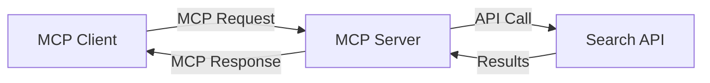
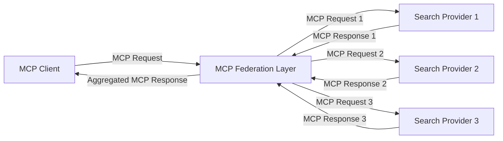
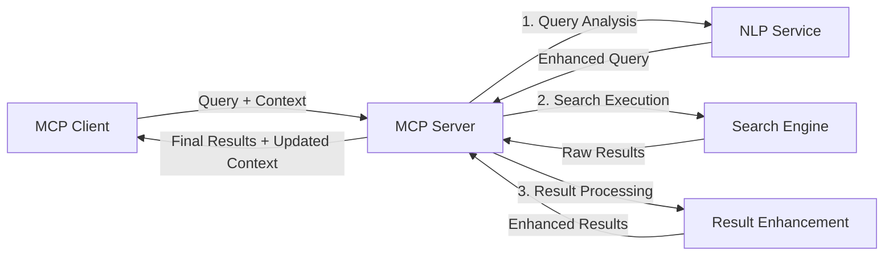

<!--
CO_OP_TRANSLATOR_METADATA:
{
  "original_hash": "16bef2c93c6a86d4ca6a8ce9e120e384",
  "translation_date": "2025-06-13T02:40:56+00:00",
  "source_file": "05-AdvancedTopics/mcp-realtimesearch/README.md",
  "language_code": "ne"
}
-->
## कोड उदाहरणहरू अस्वीकरण

> **महत्त्वपूर्ण नोट**: तलका कोड उदाहरणहरूले Model Context Protocol (MCP) लाई वेब खोज कार्यक्षमतासँग कसरी एकीकृत गर्ने देखाउँछन्। यद्यपि यी आधिकारिक MCP SDK हरूको ढाँचा र संरचनाहरूलाई अनुसरण गर्छन्, शैक्षिक उद्देश्यका लागि यी सरल बनाइएको छन्।
> 
> यी उदाहरणहरूले देखाउँछन्:
> 
> 1. **Python कार्यान्वयन**: FastMCP सर्भर कार्यान्वयन जसले वेब खोज उपकरण प्रदान गर्छ र बाह्य खोज API सँग जडान गर्छ। यसले जीवनचक्र व्यवस्थापन, सन्दर्भ ह्यान्डलिङ, र उपकरण कार्यान्वयनलाई [आधिकारिक MCP Python SDK](https://github.com/modelcontextprotocol/python-sdk) का ढाँचाहरू अनुसार देखाउँछ। सर्भरले सिफारिस गरिएको Streamable HTTP ट्रान्सपोर्ट प्रयोग गर्छ जुन उत्पादनमा SSE ट्रान्सपोर्टलाई प्रतिस्थापन गरिसकेको छ।
> 
> 2. **JavaScript कार्यान्वयन**: TypeScript/JavaScript कार्यान्वयन जसले [आधिकारिक MCP TypeScript SDK](https://github.com/modelcontextprotocol/typescript-sdk) बाट FastMCP ढाँचा प्रयोग गरी खोज सर्भर बनाउँछ, उपयुक्त उपकरण परिभाषा र क्लाइन्ट जडानहरूसहित। यसले सत्र व्यवस्थापन र सन्दर्भ संरक्षणका लागि नवीनतम सिफारिस गरिएका ढाँचाहरू अनुसरण गर्छ।
> 
> यी उदाहरणहरूमा उत्पादन प्रयोगका लागि थप त्रुटि ह्यान्डलिङ, प्रमाणीकरण, र विशिष्ट API एकीकरण कोड आवश्यक पर्छ। देखाइएको खोज API अन्तबिन्दुहरू (`https://api.search-service.example/search`) प्लेसहोल्डर हुन् र वास्तविक खोज सेवा अन्तबिन्दुहरूसँग प्रतिस्थापन गर्नुपर्ने हुन्छ।
> 
> पूर्ण कार्यान्वयन विवरण र सबैभन्दा अद्यावधिक विधिहरूका लागि कृपया [आधिकारिक MCP विशिष्टता](https://spec.modelcontextprotocol.io/) र SDK कागजातहरू हेर्नुहोस्।

## मुख्य अवधारणाहरू

### Model Context Protocol (MCP) फ्रेमवर्क

आधारमा, Model Context Protocol AI मोडेलहरू, अनुप्रयोगहरू, र सेवाहरूबीच सन्दर्भ आदानप्रदान गर्न एक मानकीकृत तरिका प्रदान गर्छ। वास्तविक-समय वेब खोजमा, यो फ्रेमवर्क सुसंगत, बहु-पटक खोज अनुभवहरू सिर्जना गर्न अत्यावश्यक छ। मुख्य कम्पोनेन्टहरूमा समावेश छन्:

1. **क्लाइन्ट-सर्भर वास्तुकला**: MCP ले खोज क्लाइन्टहरू (अनुरोधकर्ताहरू) र खोज सर्भरहरू (प्रदायकहरू) बीच स्पष्ट विभाजन स्थापना गर्छ, जसले लचिलो परिनियोजन मोडेलहरूलाई अनुमति दिन्छ।

2. **JSON-RPC सञ्चार**: यो प्रोटोकलले सन्देश आदानप्रदानका लागि JSON-RPC प्रयोग गर्छ, जसले वेब प्रविधिहरूसँग अनुकूलता र विभिन्न प्लेटफर्महरूमा सजिलै कार्यान्वयन सम्भव बनाउँछ।

3. **सन्दर्भ व्यवस्थापन**: MCP ले बहु अन्तरक्रियाहरूमा खोज सन्दर्भ कायम राख्न, अपडेट गर्न, र उपयोग गर्न संरचित विधिहरू परिभाषित गर्छ।

4. **उपकरण परिभाषाहरू**: खोज क्षमताहरूलाई मानकीकृत उपकरणको रूपमा खुला गरिन्छ जसका स्पष्ट परिमाण र फिर्ता मानहरू हुन्छन्।

5. **स्ट्रिमिङ समर्थन**: प्रोटोकलले परिणाम स्ट्रिमिङलाई समर्थन गर्छ, जुन वास्तविक-समय खोजका लागि आवश्यक हुन्छ जहाँ परिणामहरू क्रमशः आउन सक्छन्।

### वेब खोज एकीकरण ढाँचाहरू

MCP लाई वेब खोजसँग एकीकृत गर्दा केही ढाँचाहरू देखा पर्छन्:

#### 1. प्रत्यक्ष खोज प्रदायक एकीकरण

यस ढाँचामा, MCP सर्भरले एक वा बढी खोज API हरूसँग सिधै अन्तरक्रिया गर्छ, MCP अनुरोधहरूलाई API-विशिष्ट कलहरूमा अनुवाद गर्दै र परिणामहरूलाई MCP प्रतिक्रिया रूपमा ढाँचा बदलेर।

#### 2. सन्दर्भ संरक्षणसहित संघीय खोज

यस ढाँचाले खोज प्रश्नहरूलाई धेरै MCP-अनुकूल खोज प्रदायकहरूमा वितरण गर्छ, प्रत्येक सम्भावित रूपमा विभिन्न प्रकारका सामग्री वा खोज क्षमताहरूमा विशेषज्ञता राख्छ, जबकि एकीकृत सन्दर्भ कायम राख्दै।

#### 3. सन्दर्भ-संवर्धित खोज श्रृंखला

यस ढाँचामा, खोज प्रक्रिया धेरै चरणहरूमा विभाजित हुन्छ, जहाँ प्रत्येक चरणमा सन्दर्भ समृद्ध हुन्छ, जसले क्रमशः बढी सान्दर्भिक परिणामहरू दिन्छ।

### खोज सन्दर्भ कम्पोनेन्टहरू

MCP-आधारित वेब खोजमा, सन्दर्भ सामान्यतया समावेश गर्दछ:

- **प्रश्न इतिहास**: सत्रमा अघिल्ला खोज प्रश्नहरू
- **प्रयोगकर्ता प्राथमिकताहरू**: भाषा, क्षेत्र, सुरक्षित खोज सेटिङहरू
- **अन्तरक्रिया इतिहास**: कुन परिणामहरू क्लिक गरियो, परिणामहरूमा बिताइएको समय
- **खोज प्यारामिटरहरू**: फिल्टरहरू, क्रमबद्धता, र अन्य खोज संशोधकहरू
- **डोमेन ज्ञान**: खोजसँग सम्बन्धित विषय-विशेष सन्दर्भ
- **कालिक सन्दर्भ**: समय आधारित सान्दर्भिकता कारकहरू
- **स्रोत प्राथमिकताहरू**: विश्वासयोग्य वा मनपर्ने सूचना स्रोतहरू

## प्रयोगका केसहरू र अनुप्रयोगहरू

### अनुसन्धान र सूचना सङ्कलन

MCP ले अनुसन्धान कार्यप्रवाहहरूलाई बढावा दिन्छ:

- खोज सत्रहरूमा अनुसन्धान सन्दर्भ कायम राख्दै
- बढी परिष्कृत र सान्दर्भिक प्रश्नहरू सक्षम गर्दै
- बहु-स्रोत खोज संघीकरण समर्थन गर्दै
- खोज परिणामहरूबाट ज्ञान निष्कर्षण सजिलो पार्दै

### वास्तविक-समय समाचार र प्रवृत्ति अनुगमन

MCP-शक्ति प्राप्त खोजले समाचार अनुगमनमा फाइदा दिन्छ:

- उदीयमान समाचार कथाहरूको छिटो पत्ता लगाउने
- सान्दर्भिक सूचनाको सन्दर्भगत फिल्टरिङ
- बहु स्रोतहरूमा विषय र इकाई ट्र्याकिङ
- प्रयोगकर्ता सन्दर्भमा आधारित व्यक्तिगत समाचार सूचनाहरू

### AI-संवर्धित ब्राउजिङ र अनुसन्धान

MCP ले AI-संवर्धित ब्राउजिङका लागि नयाँ सम्भावनाहरू सिर्जना गर्छ:

- हालको ब्राउजर गतिविधिमा आधारित सान्दर्भिक खोज सुझावहरू
- वेब खोज र LLM-संचालित सहायकहरूको सहज एकीकरण
- बहु-पटक खोज सुधार जसले सन्दर्भ कायम राख्छ
- तथ्य-जाँच र सूचना प्रमाणीकरणमा सुधार

## भविष्यका प्रवृत्तिहरू र नवप्रवर्तनहरू

### वेब खोजमा MCP को विकास

अगाडि हेर्दा, हामी MCP लाई यसरी विकास हुँदै गएको देख्छौं:

- **बहुमाध्यमीय खोज**: टेक्स्ट, छवि, अडियो, र भिडियो खोजलाई सन्दर्भसँग जोड्ने
- **केन्द्रीयकृत नभएको खोज**: वितरण र संघीय खोज पारिस्थितिकी तन्त्रलाई समर्थन गर्ने
- **खोज गोपनीयता**: सन्दर्भ-सचेत गोपनीयता-रक्षा गर्ने खोज संयन्त्रहरू
- **प्रश्न बुझाइ**: प्राकृतिक भाषा खोज प्रश्नहरूको गहिरो सेम्यान्टिक पार्सिङ

### प्रविधिमा सम्भावित प्रगति

भविष्यको MCP खोजलाई आकार दिने उदाउँदो प्रविधिहरू:

1. **न्यूरल खोज वास्तुकला**: MCP का लागि अनुकूलित एम्बेडिङ-आधारित खोज प्रणालीहरू
2. **व्यक्तिगत खोज सन्दर्भ**: समयसँगै व्यक्तिगत प्रयोगकर्ता खोज ढाँचाहरू सिक्ने
3. **ज्ञान ग्राफ एकीकरण**: डोमेन-विशेष ज्ञान ग्राफहरूले संवर्धित सान्दर्भिक खोज
4. **क्रस-मोडल सन्दर्भ**: विभिन्न खोज माध्यमहरूमा सन्दर्भ कायम राख्ने

## व्यावहारिक अभ्यासहरू

### अभ्यास १: आधारभूत MCP खोज पाइपलाइन सेटअप

यस अभ्यासमा, तपाईं सिक्नुहुनेछ:

- आधारभूत MCP खोज वातावरण कन्फिगर गर्ने
- वेब खोजका लागि सन्दर्भ ह्यान्डलरहरू कार्यान्वयन गर्ने
- खोज पुनरावृत्तिहरूमा सन्दर्भ संरक्षण परीक्षण र प्रमाणित गर्ने

### अभ्यास २: MCP खोजसहित अनुसन्धान सहायक निर्माण

पूर्ण अनुप्रयोग सिर्जना गर्नुहोस् जसले:

- प्राकृतिक भाषा अनुसन्धान प्रश्नहरू प्रक्रिया गर्छ
- सन्दर्भ-सचेत वेब खोजहरू गर्छ
- बहु स्रोतबाट जानकारी संश्लेषण गर्छ
- व्यवस्थित अनुसन्धान नतिजाहरू प्रस्तुत गर्छ

### अभ्यास ३: MCP सँग बहु-स्रोत खोज संघीकरण कार्यान्वयन

उन्नत अभ्यास जसले समेट्छ:

- बहु खोज इन्जिनहरूमा सन्दर्भ-सचेत प्रश्न प्रेषण
- परिणाम क्रमबद्धता र समेकन
- खोज परिणामहरूको सन्दर्भगत दोहोर्याउने हटाउने
- स्रोत-विशेष मेटाडाटा व्यवस्थापन

## थप स्रोतहरू

- [Model Context Protocol Specification](https://spec.modelcontextprotocol.io/) - आधिकारिक MCP विशिष्टता र विस्तृत प्रोटोकल कागजात
- [Model Context Protocol Documentation](https://modelcontextprotocol.io/) - विस्तृत ट्यूटोरियल र कार्यान्वयन मार्गनिर्देशन
- [MCP Python SDK](https://github.com/modelcontextprotocol/python-sdk) - MCP प्रोटोकलको आधिकारिक Python कार्यान्वयन
- [MCP TypeScript SDK](https://github.com/modelcontextprotocol/typescript-sdk) - MCP प्रोटोकलको आधिकारिक TypeScript कार्यान्वयन
- [MCP Reference Servers](https://github.com/modelcontextprotocol/servers) - MCP सर्भरहरूको संदर्भ कार्यान्वयनहरू
- [Bing Web Search API Documentation](https://learn.microsoft.com/en-us/bing/search-apis/bing-web-search/overview) - Microsoft को वेब खोज API
- [Google Custom Search JSON API](https://developers.google.com/custom-search/v1/overview) - Google को प्रोग्रामेबल खोज इन्जिन
- [SerpAPI Documentation](https://serpapi.com/search-api) - खोज इन्जिन परिणाम पृष्ठ API
- [Meilisearch Documentation](https://www.meilisearch.com/docs) - खुला स्रोत खोज इन्जिन
- [Elasticsearch Documentation](https://www.elastic.co/guide/index.html) - वितरण गरिएको खोज र विश्लेषण इन्जिन
- [LangChain Documentation](https://python.langchain.com/docs/get_started/introduction) - LLM हरूसँग अनुप्रयोग निर्माण

## सिकाइ परिणामहरू

यस मोड्युल पूरा गरेपछि, तपाईं सक्षम हुनुहुनेछ:

- वास्तविक-समय वेब खोजका आधारभूत कुरा र यसको चुनौतीहरू बुझ्न
- Model Context Protocol (MCP) ले कसरी वास्तविक-समय वेब खोज क्षमताहरू बढाउँछ व्याख्या गर्न
- लोकप्रिय फ्रेमवर्क र API हरू प्रयोग गरी MCP-आधारित खोज समाधानहरू कार्यान्वयन गर्न
- MCP सँग स्केलेबल, उच्च-प्रदर्शन खोज वास्तुकला डिजाइन र परिनियोजन गर्न
- MCP अवधारणाहरूलाई सेम्यान्टिक खोज, अनुसन्धान सहायता, र AI-संवर्धित ब्राउजिङ लगायत विभिन्न प्रयोग केसहरूमा लागू गर्न
- MCP-आधारित खोज प्रविधिहरूमा उदाउँदो प्रवृत्ति र भविष्यका नवप्रवर्तनहरू मूल्याङ्कन गर्न

### विश्वास र सुरक्षा विचारहरू

MCP-आधारित वेब खोज समाधानहरू कार्यान्वयन गर्दा, MCP विशिष्टताबाट यी महत्वपूर्ण सिद्धान्तहरू सम्झनुहोस्:

1. **प्रयोगकर्ता सहमति र नियन्त्रण**: प्रयोगकर्ताले सबै डेटा पहुँच र सञ्चालनहरू स्पष्ट रूपमा सहमति जनाउन र बुझ्नुपर्छ। यो विशेष गरी बाह्य डेटा स्रोतहरू पहुँच गर्ने वेब खोज कार्यान्वयनहरूमा महत्त्वपूर्ण छ।

2. **डेटा गोपनीयता**: खोज प्रश्न र परिणामहरूको उपयुक्त ह्यान्डलिङ सुनिश्चित गर्नुहोस्, विशेष गरी जब तिनीहरूमा संवेदनशील जानकारी हुन सक्छ। प्रयोगकर्ता डेटा संरक्षणका लागि उपयुक्त पहुँच नियन्त्रणहरू कार्यान्वयन गर्नुहोस्।

3. **उपकरण सुरक्षा**: खोज उपकरणहरूको लागि उपयुक्त प्राधिकरण र प्रमाणीकरण कार्यान्वयन गर्नुहोस्, किनभने तिनीहरूले मनमानी कोड कार्यान्वयनमार्फत सुरक्षा जोखिमहरू प्रतिनिधित्व गर्न सक्छन्। उपकरण व्यवहारका वर्णनहरूलाई विश्वसनीय सर्भरबाट प्राप्त नभएसम्म अविश्वसनीय मान्नुहोस्।

4. **स्पष्ट कागजातहरू**: तपाईंको MCP-आधारित खोज कार्यान्वयनका क्षमता, सीमाहरू, र सुरक्षा विचारहरूबारे स्पष्ट कागजातहरू प्रदान गर्नुहोस्, MCP विशिष्टताका कार्यान्वयन दिशानिर्देशनहरू अनुसरण गर्दै।

5. **दृढ सहमति प्रवाहहरू**: प्रत्येक उपकरण के गर्छ भनेर स्पष्ट व्याख्या गर्ने सहमति र प्राधिकरण प्रवाहहरू निर्माण गर्नुहोस्, विशेष गरी बाह्य वेब स्रोतहरूसँग अन्तरक्रिया गर्ने उपकरणहरूको लागि।

MCP सुरक्षा र विश्वास विचारहरूको पूर्ण विवरणका लागि, कृपया [आधिकारिक कागजात](https://modelcontextprotocol.io/specification/2025-03-26#security-and-trust-%26-safety) हेर्नुहोस्।

## के गर्ने

- [6. समुदाय योगदानहरू](../../06-CommunityContributions/README.md)

**अस्वीकरण**:  
यो दस्तावेज़ AI अनुवाद सेवा [Co-op Translator](https://github.com/Azure/co-op-translator) को प्रयोग गरी अनुवाद गरिएको हो। हामी शुद्धताका लागि प्रयास गर्छौं, तर कृपया ध्यान दिनुहोस् कि स्वचालित अनुवादमा त्रुटिहरू वा अशुद्धता हुन सक्छ। मूल दस्तावेज़लाई यसको मूल भाषामा आधिकारिक स्रोतको रूपमा मान्नुपर्छ। महत्वपूर्ण जानकारीका लागि पेशेवर मानव अनुवाद सिफारिस गरिन्छ। यस अनुवादको प्रयोगबाट उत्पन्न कुनै पनि गलतफहमी वा गलत व्याख्याको लागि हामी जिम्मेवार छैनौं।