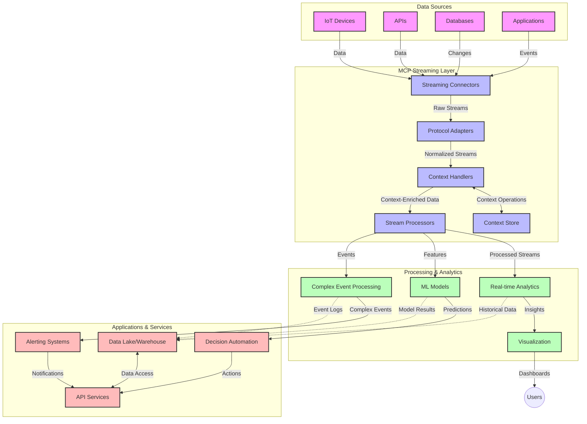

<!--
CO_OP_TRANSLATOR_METADATA:
{
  "original_hash": "195f7287638b77a549acadd96c8f981c",
  "translation_date": "2025-07-14T01:36:02+00:00",
  "source_file": "05-AdvancedTopics/mcp-realtimestreaming/README.md",
  "language_code": "ne"
}
-->
# वास्तविक-समय डाटा स्ट्रिमिङका लागि मोडेल सन्दर्भ प्रोटोकल

## अवलोकन

आजको डाटा-आधारित संसारमा, जहाँ व्यवसाय र अनुप्रयोगहरूले तत्काल जानकारीको पहुँच आवश्यक पर्छ निर्णय लिनका लागि, वास्तविक-समय डाटा स्ट्रिमिङ अत्यावश्यक भइसकेको छ। मोडेल सन्दर्भ प्रोटोकल (MCP) ले यी वास्तविक-समय स्ट्रिमिङ प्रक्रियाहरूलाई अधिकतम बनाउन महत्वपूर्ण प्रगति गरेको छ, जसले डाटा प्रशोधनको दक्षता बढाउँछ, सन्दर्भीय अखण्डता कायम राख्छ, र समग्र प्रणाली प्रदर्शन सुधार गर्दछ।

यो मोड्युलले कसरी MCP ले AI मोडेलहरू, स्ट्रिमिङ प्लेटफर्महरू, र अनुप्रयोगहरूमा सन्दर्भ व्यवस्थापनको मानकीकृत दृष्टिकोण प्रदान गरेर वास्तविक-समय डाटा स्ट्रिमिङलाई रूपान्तरण गर्छ भन्ने कुरा अन्वेषण गर्छ।

## वास्तविक-समय डाटा स्ट्रिमिङ परिचय

वास्तविक-समय डाटा स्ट्रिमिङ भनेको यस्तो प्रविधि हो जसले डाटा उत्पन्न हुँदै गर्दा निरन्तर स्थानान्तरण, प्रशोधन, र विश्लेषण गर्न सक्षम बनाउँछ, जसले प्रणालीहरूलाई नयाँ जानकारीमा तुरुन्त प्रतिक्रिया दिन अनुमति दिन्छ। परम्परागत ब्याच प्रशोधन जसले स्थिर डाटासेटहरूमा काम गर्छ भन्दा फरक, स्ट्रिमिङले गतिशील डाटालाई प्रशोधन गर्छ र न्यूनतम विलम्बमा अन्तर्दृष्टि र कार्यहरू प्रदान गर्छ।

### वास्तविक-समय डाटा स्ट्रिमिङका मुख्य अवधारणाहरू:

- **निरन्तर डाटा प्रवाह**: डाटा घटनाहरू वा रेकर्डहरूको निरन्तर, कहिल्यै नटुंगिने स्ट्रिमको रूपमा प्रशोधन हुन्छ।
- **कम विलम्ब प्रशोधन**: डाटा उत्पन्न र प्रशोधन बीचको समय न्यूनतम बनाउन प्रणालीहरू डिजाइन गरिन्छन्।
- **स्केलेबिलिटी**: स्ट्रिमिङ संरचनाहरूले भिन्न डाटा मात्रा र गतिलाई सम्हाल्न सक्नुपर्छ।
- **त्रुटि सहिष्णुता**: प्रणालीहरूलाई विफलताबाट बचाउन र डाटा प्रवाह अवरुद्ध नहोस् भनेर सक्षम हुनुपर्छ।
- **राज्यपूर्ण प्रशोधन**: घटनाहरू बीच सन्दर्भ कायम राख्नु अर्थपूर्ण विश्लेषणका लागि अत्यावश्यक हुन्छ।

### मोडेल सन्दर्भ प्रोटोकल र वास्तविक-समय स्ट्रिमिङ

मोडेल सन्दर्भ प्रोटोकल (MCP) ले वास्तविक-समय स्ट्रिमिङ वातावरणमा केही महत्वपूर्ण चुनौतीहरूलाई सम्बोधन गर्छ:

1. **सन्दर्भीय निरन्तरता**: MCP ले वितरण गरिएको स्ट्रिमिङ कम्पोनेन्टहरूमा सन्दर्भ कसरी कायम राख्ने भन्ने मानकीकरण गर्छ, जसले AI मोडेलहरू र प्रशोधन नोडहरूलाई सम्बन्धित ऐतिहासिक र वातावरणीय सन्दर्भमा पहुँच दिन्छ।

2. **दक्ष राज्य व्यवस्थापन**: सन्दर्भ प्रसारणका लागि संरचित मेकानिजमहरू प्रदान गरेर, MCP ले स्ट्रिमिङ पाइपलाइनमा राज्य व्यवस्थापनको ओभरहेड घटाउँछ।

3. **अन्तरक्रियाशीलता**: MCP ले विभिन्न स्ट्रिमिङ प्रविधिहरू र AI मोडेलहरूबीच सन्दर्भ साझेदारीका लागि साझा भाषा सिर्जना गर्छ, जसले लचिलो र विस्तारयोग्य संरचनाहरू सक्षम बनाउँछ।

4. **स्ट्रिमिङ-अनुकूलित सन्दर्भ**: MCP कार्यान्वयनहरूले कुन सन्दर्भ तत्वहरू वास्तविक-समय निर्णयका लागि सबैभन्दा सान्दर्भिक छन् भनेर प्राथमिकता दिन सक्छन्, प्रदर्शन र शुद्धता दुवैका लागि अनुकूलन गर्दै।

5. **अनुकूली प्रशोधन**: MCP मार्फत उचित सन्दर्भ व्यवस्थापनले स्ट्रिमिङ प्रणालीहरूलाई डाटामा विकास भइरहेका अवस्था र ढाँचाहरूको आधारमा गतिशील रूपमा प्रशोधन समायोजन गर्न सक्षम बनाउँछ।

आधुनिक अनुप्रयोगहरूमा, IoT सेन्सर नेटवर्कदेखि वित्तीय ट्रेडिङ प्लेटफर्मसम्म, MCP को स्ट्रिमिङ प्रविधिहरूसँग एकीकरणले अधिक बुद्धिमान, सन्दर्भ-सचेत प्रशोधन सक्षम बनाउँछ जसले जटिल, विकासशील अवस्थाहरूमा वास्तविक-समयमा उपयुक्त प्रतिक्रिया दिन सक्छ।

## सिकाइ उद्देश्यहरू

यस पाठको अन्त्यसम्म, तपाईं सक्षम हुनुहुनेछ:

- वास्तविक-समय डाटा स्ट्रिमिङका आधारभूत कुरा र चुनौतीहरू बुझ्न
- मोडेल सन्दर्भ प्रोटोकल (MCP) ले कसरी वास्तविक-समय डाटा स्ट्रिमिङलाई सुधार गर्छ व्याख्या गर्न
- Kafka र Pulsar जस्ता लोकप्रिय फ्रेमवर्कहरू प्रयोग गरी MCP-आधारित स्ट्रिमिङ समाधानहरू कार्यान्वयन गर्न
- MCP सँग त्रुटि सहिष्णु, उच्च प्रदर्शन स्ट्रिमिङ संरचनाहरू डिजाइन र तैनाथ गर्न
- MCP अवधारणाहरूलाई IoT, वित्तीय ट्रेडिङ, र AI-चालित विश्लेषणका प्रयोगहरूमा लागू गर्न
- MCP-आधारित स्ट्रिमिङ प्रविधिहरूमा उदाउँदो प्रवृत्ति र भविष्यका नवप्रवर्तनहरू मूल्याङ्कन गर्न

### परिभाषा र महत्त्व

वास्तविक-समय डाटा स्ट्रिमिङ भनेको न्यूनतम विलम्बमा डाटा निरन्तर उत्पन्न, प्रशोधन, र वितरण गर्ने प्रक्रिया हो। ब्याच प्रशोधन जहाँ डाटा समूहमा सङ्कलन र प्रशोधन हुन्छ, त्यस्को विपरीत स्ट्रिमिङ डाटा आइरहेको बित्तिकै क्रमिक रूपमा प्रशोधन हुन्छ, जसले तत्काल अन्तर्दृष्टि र कार्यहरू सम्भव बनाउँछ।

वास्तविक-समय डाटा स्ट्रिमिङका मुख्य विशेषताहरू:

- **कम विलम्ब**: डाटालाई मिलिसेकेन्डदेखि सेकेन्डसम्मको अवधिमा प्रशोधन र विश्लेषण गर्ने
- **निरन्तर प्रवाह**: विभिन्न स्रोतहरूबाट अवरुद्ध नभएको डाटा स्ट्रिमहरू
- **तत्काल प्रशोधन**: डाटा आइरहेको बित्तिकै विश्लेषण गर्ने, ब्याचमा होइन
- **घटना-चालित संरचना**: घटनाहरू घट्दा तुरुन्त प्रतिक्रिया दिने

### परम्परागत डाटा स्ट्रिमिङका चुनौतीहरू

परम्परागत डाटा स्ट्रिमिङ विधिहरूले केही सीमाहरू भोग्छन्:

1. **सन्दर्भ हराउने समस्या**: वितरण गरिएको प्रणालीहरूमा सन्दर्भ कायम राख्न कठिनाई
2. **स्केलेबिलिटी समस्या**: उच्च मात्रा र उच्च गतिका डाटालाई सम्हाल्न चुनौती
3. **एकीकरण जटिलता**: विभिन्न प्रणालीहरूबीच अन्तरक्रियाशीलतामा समस्या
4. **विलम्ब व्यवस्थापन**: थ्रुपुट र प्रशोधन समयको सन्तुलन
5. **डाटा स्थिरता**: स्ट्रिमभरि डाटाको शुद्धता र पूर्णता सुनिश्चित गर्नु

## मोडेल सन्दर्भ प्रोटोकल (MCP) बुझ्न

### MCP के हो?

मोडेल सन्दर्भ प्रोटोकल (MCP) एक मानकीकृत सञ्चार प्रोटोकल हो जसले AI मोडेलहरू र अनुप्रयोगहरूबीच दक्ष अन्तरक्रिया सहज बनाउँछ। वास्तविक-समय डाटा स्ट्रिमिङको सन्दर्भमा, MCP ले निम्न कुराहरूको लागि फ्रेमवर्क प्रदान गर्छ:

- डाटा पाइपलाइनभरि सन्दर्भ संरक्षण
- डाटा विनिमय ढाँचाहरूको मानकीकरण
- ठूलो डाटासेटहरूको प्रसारण अनुकूलन
- मोडेल-देखि-मोडेल र मोडेल-देखि-अनुप्रयोग सञ्चार सुधार

### मुख्य कम्पोनेन्टहरू र वास्तुकला

वास्तविक-समय स्ट्रिमिङका लागि MCP वास्तुकलामा केही मुख्य कम्पोनेन्टहरू हुन्छन्:

1. **सन्दर्भ ह्यान्डलरहरू**: स्ट्रिमिङ पाइपलाइनभरि सन्दर्भीय जानकारी व्यवस्थापन र संरक्षण गर्छन्
2. **स्ट्रिम प्रोसेसरहरू**: सन्दर्भ-सचेत प्रविधिहरू प्रयोग गरी आउने डाटा स्ट्रिमहरू प्रशोधन गर्छन्
3. **प्रोटोकल एडाप्टरहरू**: विभिन्न स्ट्रिमिङ प्रोटोकलहरू बीच रूपान्तरण गर्छन् र सन्दर्भ संरक्षण गर्छन्
4. **सन्दर्भ स्टोर**: सन्दर्भीय जानकारी कुशलतापूर्वक भण्डारण र पुनःप्राप्ति गर्छ
5. **स्ट्रिमिङ कनेक्टरहरू**: विभिन्न स्ट्रिमिङ प्लेटफर्महरू (Kafka, Pulsar, Kinesis, आदि) सँग जडान गर्छन्



### MCP ले वास्तविक-समय डाटा ह्यान्डलिङ कसरी सुधार गर्छ

MCP ले परम्परागत स्ट्रिमिङ चुनौतीहरूलाई यसरी सम्बोधन गर्छ:

- **सन्दर्भीय अखण्डता**: सम्पूर्ण पाइपलाइनभरि डाटा बिन्दुहरूबीच सम्बन्ध कायम राख्ने
- **अनुकूलित प्रसारण**: बुद्धिमानी सन्दर्भ व्यवस्थापनमार्फत डाटा विनिमयमा पुनरावृत्ति घटाउने
- **मानकीकृत इन्टरफेसहरू**: स्ट्रिमिङ कम्पोनेन्टहरूका लागि सुसंगत API प्रदान गर्ने
- **विलम्ब घटाउने**: दक्ष सन्दर्भ ह्यान्डलिङमार्फत प्रशोधन ओभरहेड कम गर्ने
- **वृद्धि गरिएको स्केलेबिलिटी**: सन्दर्भ संरक्षण गर्दै तेर्सो स्केलिङ समर्थन गर्ने

## एकीकरण र कार्यान्वयन

वास्तविक-समय डाटा स्ट्रिमिङ प्रणालीहरूले प्रदर्शन र सन्दर्भीय अखण्डता दुवै कायम राख्न सावधानीपूर्वक वास्तुकला डिजाइन र कार्यान्वयन आवश्यक पर्छ। मोडेल सन्दर्भ प्रोटोकलले AI मोडेलहरू र स्ट्रिमिङ प्रविधिहरूलाई एकीकृत गर्न मानकीकृत दृष्टिकोण प्रदान गर्छ, जसले अधिक परिष्कृत, सन्दर्भ-सचेत प्रशोधन पाइपलाइनहरू सक्षम बनाउँछ।

### स्ट्रिमिङ वास्तुकलामा MCP एकीकरणको अवलोकन

वास्तविक-समय स्ट्रिमिङ वातावरणमा MCP कार्यान्वयन गर्दा केही मुख्य विचारहरू छन्:

1. **सन्दर्भ सिरियलाइजेशन र ट्रान्सपोर्ट**: MCP ले स्ट्रिमिङ डाटा प्याकेटहरूमा सन्दर्भीय जानकारी कूटलेखनका लागि दक्ष मेकानिजमहरू प्रदान गर्छ, जसले आवश्यक सन्दर्भ डाटासँगै प्रशोधन पाइपलाइनभरि जान सुनिश्चित गर्छ। यसमा स्ट्रिमिङ ट्रान्सपोर्टका लागि अनुकूलित मानकीकृत सिरियलाइजेशन ढाँचाहरू समावेश छन्।

2. **राज्यपूर्ण स्ट्रिम प्रशोधन**: MCP ले प्रशोधन नोडहरूमा सुसंगत सन्दर्भ प्रतिनिधित्व कायम राखेर अधिक बुद्धिमान राज्यपूर्ण प्रशोधन सक्षम बनाउँछ। यो विशेष गरी वितरण गरिएको स्ट्रिमिङ वास्तुकलामा जहाँ राज्य व्यवस्थापन चुनौतीपूर्ण हुन्छ, उपयोगी हुन्छ।

3. **घटना-समय बनाम प्रशोधन-समय**: MCP कार्यान्वयनहरूले घटनाहरू कहिले घटे र कहिले प्रशोधन भए भनी फरक पार्ने सामान्य चुनौतीलाई सम्बोधन गर्नुपर्छ। प्रोटोकलले घटना समय सिमान्टिक्स संरक्षण गर्ने कालिक सन्दर्भ समावेश गर्न सक्छ।

4. **ब्याकप्रेशर व्यवस्थापन**: सन्दर्भ ह्यान्डलिङ मानकीकरण गरेर, MCP ले स्ट्रिमिङ प्रणालीहरूमा ब्याकप्रेशर व्यवस्थापनमा मद्दत गर्छ, जसले कम्पोनेन्टहरूलाई आफ्नो प्रशोधन क्षमता सञ्चार गर्न र प्रवाह समायोजन गर्न अनुमति दिन्छ।

5. **सन्दर्भ विन्डोइङ र समेकन**: MCP ले कालिक र सम्बन्धित सन्दर्भहरूको संरचित प्रतिनिधित्व प्रदान गरेर थप परिष्कृत विन्डोइङ अपरेसनहरूलाई सहज बनाउँछ, जसले घटना स्ट्रिमहरूमा अर्थपूर्ण समेकनहरू सक्षम बनाउँछ।

6. **ठ्याक्कै-एक पटक प्रशोधन**: ठ्याक्कै-एक पटक सिमान्टिक्स आवश्यक पर्ने स्ट्रिमिङ प्रणालीहरूमा, MCP ले प्रशोधन मेटाडाटा समावेश गर्न सक्छ जसले वितरण गरिएको कम्पोनेन्टहरूमा प्रशोधन स्थिति ट्र्याक र प्रमाणित गर्न मद्दत गर्छ।

विभिन्न स्ट्रिमिङ प्रविधिहरूमा MCP को कार्यान्वयनले सन्दर्भ व्यवस्थापनमा एकीकृत दृष्टिकोण सिर्जना गर्छ, जसले अनुकूलन एकीकरण कोडको आवश्यकता घटाउँछ र डाटा पाइपलाइनमा सन्दर्भ अर्थपूर्ण रूपमा कायम राख्ने प्रणालीको क्षमता बढाउँछ।

### विभिन्न डाटा स्ट्रिमिङ फ्रेमवर्कहरूमा MCP

यी उदाहरणहरूले हालको MCP विनिर्देशन अनुसरण गर्छन् जुन JSON-RPC आधारित प्रोटोकलमा केन्द्रित छ र फरक ट्रान्सपोर्ट मेकानिजमहरू छन्। कोडले कसरी कस्टम ट्रान्सपोर्टहरू कार्यान्वयन गर्ने देखाउँछ जसले Kafka र Pulsar जस्ता स्ट्रिमिङ प्लेटफर्महरूलाई MCP प्रोटोकलसँग पूर्ण अनुकूलता राख्दै एकीकृत गर्छ।

यी उदाहरणहरूले देखाउँछन् कसरी स्ट्रिमिङ प्लेटफर्महरू MCP सँग एकीकृत गरेर वास्तविक-समय डाटा प्रशोधन प्रदान गर्न सक्छन् र सन्दर्भीय सचेतना कायम राख्न सक्छन् जुन MCP को केन्द्रमा छ। यसले कोड नमूनाहरूलाई जून २०२५ सम्मको MCP विनिर्देशनको वर्तमान अवस्थालाई सही रूपमा प्रतिबिम्बित गर्न सुनिश्चित गर्छ।

MCP लोकप्रिय स्ट्रिमिङ फ्रेमवर्कहरूसँग एकीकृत गर्न सकिन्छ, जस्तै:

#### Apache Kafka एकीकरण

```python
import asyncio
import json
from typing import Dict, Any, Optional
from confluent_kafka import Consumer, Producer, KafkaError
from mcp.client import Client, ClientCapabilities
from mcp.core.message import JsonRpcMessage
from mcp.core.transports import Transport

# Custom transport class to bridge MCP with Kafka
class KafkaMCPTransport(Transport):
    def __init__(self, bootstrap_servers: str, input_topic: str, output_topic: str):
        self.bootstrap_servers = bootstrap_servers
        self.input_topic = input_topic
        self.output_topic = output_topic
        self.producer = Producer({'bootstrap.servers': bootstrap_servers})
        self.consumer = Consumer({
            'bootstrap.servers': bootstrap_servers,
            'group.id': 'mcp-client-group',
            'auto.offset.reset': 'earliest'
        })
        self.message_queue = asyncio.Queue()
        self.running = False
        self.consumer_task = None
        
    async def connect(self):
        """Connect to Kafka and start consuming messages"""
        self.consumer.subscribe([self.input_topic])
        self.running = True
        self.consumer_task = asyncio.create_task(self._consume_messages())
        return self
        
    async def _consume_messages(self):
        """Background task to consume messages from Kafka and queue them for processing"""
        while self.running:
            try:
                msg = self.consumer.poll(1.0)
                if msg is None:
                    await asyncio.sleep(0.1)
                    continue
                
                if msg.error():
                    if msg.error().code() == KafkaError._PARTITION_EOF:
                        continue
                    print(f"Consumer error: {msg.error()}")
                    continue
                
                # Parse the message value as JSON-RPC
                try:
                    message_str = msg.value().decode('utf-8')
                    message_data = json.loads(message_str)
                    mcp_message = JsonRpcMessage.from_dict(message_data)
                    await self.message_queue.put(mcp_message)
                except Exception as e:
                    print(f"Error parsing message: {e}")
            except Exception as e:
                print(f"Error in consumer loop: {e}")
                await asyncio.sleep(1)
    
    async def read(self) -> Optional[JsonRpcMessage]:
        """Read the next message from the queue"""
        try:
            message = await self.message_queue.get()
            return message
        except Exception as e:
            print(f"Error reading message: {e}")
            return None
    
    async def write(self, message: JsonRpcMessage) -> None:
        """Write a message to the Kafka output topic"""
        try:
            message_json = json.dumps(message.to_dict())
            self.producer.produce(
                self.output_topic,
                message_json.encode('utf-8'),
                callback=self._delivery_report
            )
            self.producer.poll(0)  # Trigger callbacks
        except Exception as e:
            print(f"Error writing message: {e}")
    
    def _delivery_report(self, err, msg):
        """Kafka producer delivery callback"""
        if err is not None:
            print(f'Message delivery failed: {err}')
        else:
            print(f'Message delivered to {msg.topic()} [{msg.partition()}]')
    
    async def close(self) -> None:
        """Close the transport"""
        self.running = False
        if self.consumer_task:
            self.consumer_task.cancel()
            try:
                await self.consumer_task
            except asyncio.CancelledError:
                pass
        self.consumer.close()
        self.producer.flush()

# Example usage of the Kafka MCP transport
async def kafka_mcp_example():
    # Create MCP client with Kafka transport
    client = Client(
        {"name": "kafka-mcp-client", "version": "1.0.0"},
        ClientCapabilities({})
    )
    
    # Create and connect the Kafka transport
    transport = KafkaMCPTransport(
        bootstrap_servers="localhost:9092",
        input_topic="mcp-responses",
        output_topic="mcp-requests"
    )
    
    await client.connect(transport)
    
    try:
        # Initialize the MCP session
        await client.initialize()
        
        # Example of executing a tool via MCP
        response = await client.execute_tool(
            "process_data",
            {
                "data": "sample data",
                "metadata": {
                    "source": "sensor-1",
                    "timestamp": "2025-06-12T10:30:00Z"
                }
            }
        )
        
        print(f"Tool execution response: {response}")
        
        # Clean shutdown
        await client.shutdown()
    finally:
        await transport.close()

# Run the example
if __name__ == "__main__":
    asyncio.run(kafka_mcp_example())
```

#### Apache Pulsar कार्यान्वयन

```python
import asyncio
import json
import pulsar
from typing import Dict, Any, Optional
from mcp.core.message import JsonRpcMessage
from mcp.core.transports import Transport
from mcp.server import Server, ServerOptions
from mcp.server.tools import Tool, ToolExecutionContext, ToolMetadata

# Create a custom MCP transport that uses Pulsar
class PulsarMCPTransport(Transport):
    def __init__(self, service_url: str, request_topic: str, response_topic: str):
        self.service_url = service_url
        self.request_topic = request_topic
        self.response_topic = response_topic
        self.client = pulsar.Client(service_url)
        self.producer = self.client.create_producer(response_topic)
        self.consumer = self.client.subscribe(
            request_topic,
            "mcp-server-subscription",
            consumer_type=pulsar.ConsumerType.Shared
        )
        self.message_queue = asyncio.Queue()
        self.running = False
        self.consumer_task = None
    
    async def connect(self):
        """Connect to Pulsar and start consuming messages"""
        self.running = True
        self.consumer_task = asyncio.create_task(self._consume_messages())
        return self
    
    async def _consume_messages(self):
        """Background task to consume messages from Pulsar and queue them for processing"""
        while self.running:
            try:
                # Non-blocking receive with timeout
                msg = self.consumer.receive(timeout_millis=500)
                
                # Process the message
                try:
                    message_str = msg.data().decode('utf-8')
                    message_data = json.loads(message_str)
                    mcp_message = JsonRpcMessage.from_dict(message_data)
                    await self.message_queue.put(mcp_message)
                    
                    # Acknowledge the message
                    self.consumer.acknowledge(msg)
                except Exception as e:
                    print(f"Error processing message: {e}")
                    # Negative acknowledge if there was an error
                    self.consumer.negative_acknowledge(msg)
            except Exception as e:
                # Handle timeout or other exceptions
                await asyncio.sleep(0.1)
    
    async def read(self) -> Optional[JsonRpcMessage]:
        """Read the next message from the queue"""
        try:
            message = await self.message_queue.get()
            return message
        except Exception as e:
            print(f"Error reading message: {e}")
            return None
    
    async def write(self, message: JsonRpcMessage) -> None:
        """Write a message to the Pulsar output topic"""
        try:
            message_json = json.dumps(message.to_dict())
            self.producer.send(message_json.encode('utf-8'))
        except Exception as e:
            print(f"Error writing message: {e}")
    
    async def close(self) -> None:
        """Close the transport"""
        self.running = False
        if self.consumer_task:
            self.consumer_task.cancel()
            try:
                await self.consumer_task
            except asyncio.CancelledError:
                pass
        self.consumer.close()
        self.producer.close()
        self.client.close()

# Define a sample MCP tool that processes streaming data
@Tool(
    name="process_streaming_data",
    description="Process streaming data with context preservation",
    metadata=ToolMetadata(
        required_capabilities=["streaming"]
    )
)
async def process_streaming_data(
    ctx: ToolExecutionContext,
    data: str,
    source: str,
    priority: str = "medium"
) -> Dict[str, Any]:
    """
    Process streaming data while preserving context
    
    Args:
        ctx: Tool execution context
        data: The data to process
        source: The source of the data
        priority: Priority level (low, medium, high)
        
    Returns:
        Dict containing processed results and context information
    """
    # Example processing that leverages MCP context
    print(f"Processing data from {source} with priority {priority}")
    
    # Access conversation context from MCP
    conversation_id = ctx.conversation_id if hasattr(ctx, 'conversation_id') else "unknown"
    
    # Return results with enhanced context
    return {
        "processed_data": f"Processed: {data}",
        "context": {
            "conversation_id": conversation_id,
            "source": source,
            "priority": priority,
            "processing_timestamp": ctx.get_current_time_iso()
        }
    }

# Example MCP server implementation using Pulsar transport
async def run_mcp_server_with_pulsar():
    # Create MCP server
    server = Server(
        {"name": "pulsar-mcp-server", "version": "1.0.0"},
        ServerOptions(
            capabilities={"streaming": True}
        )
    )
    
    # Register our tool
    server.register_tool(process_streaming_data)
    
    # Create and connect Pulsar transport
    transport = PulsarMCPTransport(
        service_url="pulsar://localhost:6650",
        request_topic="mcp-requests",
        response_topic="mcp-responses"
    )
    
    try:
        # Start the server with the Pulsar transport
        await server.run(transport)
    finally:
        await transport.close()

# Run the server
if __name__ == "__main__":
    asyncio.run(run_mcp_server_with_pulsar())
```

### तैनाथीकरणका लागि उत्तम अभ्यासहरू

वास्तविक-समय स्ट्रिमिङका लागि MCP कार्यान्वयन गर्दा:

1. **त्रुटि सहिष्णुताका लागि डिजाइन गर्नुहोस्**:
   - उचित त्रुटि ह्यान्डलिङ कार्यान्वयन गर्नुहोस्
   - असफल सन्देशहरूको लागि डेड-लेटर क्यूहरू प्रयोग गर्नुहोस्
   - आइडेम्पोटेन्ट प्रोसेसरहरू डिजाइन गर्नुहोस्

2. **प्रदर्शनका लागि अनुकूलन गर्नुहोस्**:
   - उपयुक्त बफर साइजहरू कन्फिगर गर्नुहोस्
   - आवश्यक ठाउँमा ब्याचिङ प्रयोग गर्नुहोस्
   - ब्याकप्रेशर मेकानिजमहरू कार्यान्वयन गर्नुहोस्

3. **निगरानी र अवलोकन गर्नुहोस्**:
   - स्ट्रिम प्रशोधन मेट्रिक्स ट्र्याक गर्नुहोस्
   - सन्दर्भ प्रसारण अनुगमन गर्नुहोस्
   - असामान्यताका लागि अलर्ट सेटअप गर्नुहोस्

4. **तपाईंका स्ट्रिमहरू सुरक्षित गर्नुहोस्**:
   - संवेदनशील डाटाका लागि इन्क्रिप्सन कार्यान्वयन गर्नुहोस्
   - प्रमाणीकरण र प्राधिकरण प्रयोग गर्नुहोस्
   - उचित पहुँच नियन्त्रण लागू गर्नुहोस्

### IoT र एज कम्प्युटिङमा MCP

MCP ले IoT स्ट्रिमिङलाई यसरी सुधार गर्छ:

- प्रशोधन पाइपलाइनभरि उपकरण सन्दर्भ संरक्षण
- दक्ष एज-देखि-क्लाउड डाटा स्ट्रिमिङ सक्षम पार्ने
- IoT डाटा स्ट्रिमहरूमा वास्तविक-समय विश्लेषण समर्थन गर्ने
- सन्दर्भसहित उपकरण-देखि-उपकरण सञ्चार सहज बनाउने

उदाहरण: स्मार्ट सिटी सेन्सर नेटवर्कहरू  
```
Sensors → Edge Gateways → MCP Stream Processors → Real-time Analytics → Automated Responses
```

### वित्तीय लेनदेन र उच्च-आवृत्ति ट्रेडिङमा भूमिका

MCP ले वित्तीय डाटा स्ट्रिमिङका लागि महत्वपूर्ण फाइदाहरू प्रदान गर्छ:

- ट्रेडिङ निर्णयका लागि अल्ट्रा-कम विलम्ब प्रशोधन
- प्रशोधनभरि लेनदेन सन्दर्भ कायम राख्ने
- सन्दर्भीय सचेतनासहित जटिल घटना प्रशोधन समर्थन गर्ने
- वितरण गरिएको ट्रेडिङ प्रणालीहरूमा डाटा स्थिरता सुनिश्चित गर्ने

### AI-चालित डाटा विश्लेषणमा सुधार

MCP ले स्ट्रिमिङ विश्लेषणका लागि नयाँ सम्भावनाहरू सिर्जना गर्छ:

- वास्तविक-समय मोडेल प्रशिक्षण र अनुमान
- स्ट्रिमिङ डाटाबाट निरन्तर सिकाइ
- सन्दर्भ-सचेत विशेषता निष्कर्षण
- सन्दर्भ संरक्षणसहित बहु-मोडेल अनुमान पाइपलाइनहरू

## भविष्यका प्रवृत्ति र नवप्रवर्तनहरू

### वास्तविक-समय वातावरणमा MCP को विकास

आगामी दिनहरूमा, हामी MCP ले निम्न कुराहरू सम्बोधन गर्ने अपेक्षा गर्छौं:

- **क्वान्टम कम्प्युटिङ एकीकरण**: क्वान्टम-आधारित स्ट्रिमिङ प्रणालीहरूको तयारी
- **एज-नेटिभ प्रशोधन**: थप सन्दर्भ-सचेत प्रशोधन एज उपकरणहरूमा सार्ने
- **स्वचालित स्ट्रिम व्यवस्थापन**: आत्म-अनुकूलन स्ट्रिमिङ पाइपलाइनहरू
- **संघीय स्ट्रिमिङ**: गोपनीयता कायम राख्दै वितरण गरिएको प्रशोधन

### प्रविधिमा सम्भावित प्रगतिहरू

MCP स्ट्रिमिङको भविष्यलाई आकार दिने उदाउँदो प्रविधिहरू:

1. **AI-अनुकूलित स्ट्रिमिङ प्रोटोकलहरू**: AI कार्यभारका लागि विशेष रूपमा डिजाइन गरिएका प्रोटोकलहरू
2. **न्यूरोमॉर्फिक कम्प्युटिङ एकीकरण**: मस्तिष्क-प्रेरित कम्प्युटिङ स्ट्रिम प्रशोधनका लागि
3. **सर्भरलेस स्ट्रिमिङ**: पूर्वाधार व्यवस्थापन बिना घटना-चालित, स्केलेबल स्ट्रिमिङ
4. **वितरित सन्दर्भ स्टोरहरू**: विश्वव्यापी रूपमा वितरण भए पनि अत्यधिक स्थिर सन्दर्भ व्यवस्थापन

## व्यावहारिक अभ्यासहरू

### अभ्यास १: आधारभूत MCP स्ट्रिमिङ पाइपलाइन सेटअप

यस अभ्यासमा, तपाईं सिक्नुहुनेछ:

- आधारभूत MCP स्ट्रिमिङ वातावरण कन्फिगर गर्ने
- स्ट्रिम प्रशोधनका लागि सन्दर्भ ह्यान्डलरहरू कार्यान्वयन गर्ने
- सन्दर्भ संरक्षण परीक्षण र मान्यकरण गर्ने

### अभ्यास

**अस्वीकरण**:  
यो दस्तावेज AI अनुवाद सेवा [Co-op Translator](https://github.com/Azure/co-op-translator) प्रयोग गरी अनुवाद गरिएको हो। हामी शुद्धताका लागि प्रयासरत छौं, तर कृपया ध्यान दिनुहोस् कि स्वचालित अनुवादमा त्रुटि वा अशुद्धता हुन सक्छ। मूल दस्तावेज यसको मूल भाषामा नै अधिकारिक स्रोत मानिनु पर्छ। महत्वपूर्ण जानकारीका लागि व्यावसायिक मानव अनुवाद सिफारिस गरिन्छ। यस अनुवादको प्रयोगबाट उत्पन्न कुनै पनि गलतफहमी वा गलत व्याख्याका लागि हामी जिम्मेवार छैनौं।