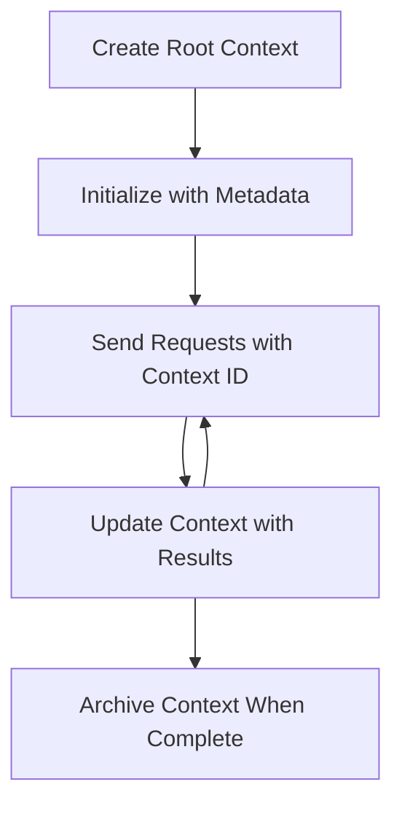

<!--
CO_OP_TRANSLATOR_METADATA:
{
  "original_hash": "ebdb86db46113f1cbd59ce4c74caaa79",
  "translation_date": "2025-07-17T00:34:44+00:00",
  "source_file": "05-AdvancedTopics/mcp-root-contexts/README.md",
  "language_code": "ne"
}
-->
# MCP Root Contexts

Root contexts मोडेल कन्टेक्स्ट प्रोटोकलमा एउटा आधारभूत अवधारणा हो जसले बहु अनुरोध र सत्रहरूमा कुराकानी इतिहास र साझा अवस्थालाई कायम राख्न स्थायी तह प्रदान गर्छ।

## परिचय

यस पाठमा, हामी MCP मा root contexts कसरी सिर्जना गर्ने, व्यवस्थापन गर्ने, र प्रयोग गर्ने बारेमा अध्ययन गर्नेछौं।

## सिकाइका उद्देश्यहरू

यस पाठको अन्त्यसम्म, तपाईं सक्षम हुनुहुनेछ:

- root contexts को उद्देश्य र संरचना बुझ्न
- MCP क्लाइन्ट लाइब्रेरीहरू प्रयोग गरी root contexts सिर्जना र व्यवस्थापन गर्न
- .NET, Java, JavaScript, र Python एप्लिकेसनहरूमा root contexts लागू गर्न
- बहु-चरणीय कुराकानी र अवस्था व्यवस्थापनका लागि root contexts प्रयोग गर्न
- root context व्यवस्थापनका लागि उत्तम अभ्यासहरू कार्यान्वयन गर्न

## Root Contexts बुझ्न

Root contexts ती कन्टेनरहरू हुन् जसले सम्बन्धित अन्तरक्रियाहरूको श्रृंखलाको इतिहास र अवस्थालाई सम्हाल्छन्। यीले निम्न कुराहरू सक्षम पार्छन्:

- **कुराकानी निरन्तरता**: सुसंगत बहु-चरणीय कुराकानी कायम राख्न
- **स्मृति व्यवस्थापन**: अन्तरक्रियाहरूमा जानकारी भण्डारण र पुनःप्राप्त गर्न
- **अवस्था व्यवस्थापन**: जटिल कार्यप्रवाहहरूमा प्रगति ट्र्याक गर्न
- **कन्टेक्स्ट साझेदारी**: धेरै क्लाइन्टहरूले एउटै कुराकानी अवस्थामा पहुँच पाउन

MCP मा, root contexts का यी मुख्य विशेषताहरू छन्:

- प्रत्येक root context को एक अनौठो पहिचानकर्ता हुन्छ।
- तिनीहरूले कुराकानी इतिहास, प्रयोगकर्ता प्राथमिकताहरू, र अन्य मेटाडाटा समावेश गर्न सक्छन्।
- आवश्यक अनुसार तिनीहरू सिर्जना, पहुँच, र संग्रहित गर्न सकिन्छ।
- तिनीहरूले सूक्ष्म पहुँच नियन्त्रण र अनुमति समर्थन गर्छन्।

## Root Context जीवनचक्र



## Root Contexts सँग काम गर्ने तरिका

यहाँ root contexts कसरी सिर्जना र व्यवस्थापन गर्ने भन्ने उदाहरण छ।

### C# कार्यान्वयन

```csharp
// .NET Example: Root Context Management
using Microsoft.Mcp.Client;
using System;
using System.Threading.Tasks;
using System.Collections.Generic;

public class RootContextExample
{
    private readonly IMcpClient _client;
    private readonly IRootContextManager _contextManager;
    
    public RootContextExample(IMcpClient client, IRootContextManager contextManager)
    {
        _client = client;
        _contextManager = contextManager;
    }
    
    public async Task DemonstrateRootContextAsync()
    {
        // 1. Create a new root context
        var contextResult = await _contextManager.CreateRootContextAsync(new RootContextCreateOptions
        {
            Name = "Customer Support Session",
            Metadata = new Dictionary<string, string>
            {
                ["CustomerName"] = "Acme Corporation",
                ["PriorityLevel"] = "High",
                ["Domain"] = "Cloud Services"
            }
        });
        
        string contextId = contextResult.ContextId;
        Console.WriteLine($"Created root context with ID: {contextId}");
        
        // 2. First interaction using the context
        var response1 = await _client.SendPromptAsync(
            "I'm having issues scaling my web service deployment in the cloud.", 
            new SendPromptOptions { RootContextId = contextId }
        );
        
        Console.WriteLine($"First response: {response1.GeneratedText}");
        
        // Second interaction - the model will have access to the previous conversation
        var response2 = await _client.SendPromptAsync(
            "Yes, we're using containerized deployments with Kubernetes.", 
            new SendPromptOptions { RootContextId = contextId }
        );
        
        Console.WriteLine($"Second response: {response2.GeneratedText}");
        
        // 3. Add metadata to the context based on conversation
        await _contextManager.UpdateContextMetadataAsync(contextId, new Dictionary<string, string>
        {
            ["TechnicalEnvironment"] = "Kubernetes",
            ["IssueType"] = "Scaling"
        });
        
        // 4. Get context information
        var contextInfo = await _contextManager.GetRootContextInfoAsync(contextId);
        
        Console.WriteLine("Context Information:");
        Console.WriteLine($"- Name: {contextInfo.Name}");
        Console.WriteLine($"- Created: {contextInfo.CreatedAt}");
        Console.WriteLine($"- Messages: {contextInfo.MessageCount}");
        
        // 5. When the conversation is complete, archive the context
        await _contextManager.ArchiveRootContextAsync(contextId);
        Console.WriteLine($"Archived context {contextId}");
    }
}
```

माथिको कोडमा हामीले:

1. ग्राहक समर्थन सत्रका लागि root context सिर्जना गर्यौं।
2. सोही context भित्र धेरै सन्देशहरू पठायौं, जसले मोडेललाई अवस्था कायम राख्न अनुमति दियो।
3. कुराकानीको आधारमा सान्दर्भिक मेटाडाटासहित context अपडेट गर्यौं।
4. कुराकानी इतिहास बुझ्न context जानकारी पुनःप्राप्त गर्यौं।
5. कुराकानी पूरा भएपछि context संग्रहित गर्यौं।

## उदाहरण: वित्तीय विश्लेषणका लागि Root Context कार्यान्वयन

यस उदाहरणमा, हामी वित्तीय विश्लेषण सत्रका लागि root context सिर्जना गर्नेछौं, जसले बहु अन्तरक्रियाहरूमा अवस्था कसरी कायम राख्ने देखाउँछ।

### Java कार्यान्वयन

```java
// Java Example: Root Context Implementation
package com.example.mcp.contexts;

import com.mcp.client.McpClient;
import com.mcp.client.ContextManager;
import com.mcp.models.RootContext;
import com.mcp.models.McpResponse;

import java.util.HashMap;
import java.util.Map;
import java.util.UUID;

public class RootContextsDemo {
    private final McpClient client;
    private final ContextManager contextManager;
    
    public RootContextsDemo(String serverUrl) {
        this.client = new McpClient.Builder()
            .setServerUrl(serverUrl)
            .build();
            
        this.contextManager = new ContextManager(client);
    }
    
    public void demonstrateRootContext() throws Exception {
        // Create context metadata
        Map<String, String> metadata = new HashMap<>();
        metadata.put("projectName", "Financial Analysis");
        metadata.put("userRole", "Financial Analyst");
        metadata.put("dataSource", "Q1 2025 Financial Reports");
        
        // 1. Create a new root context
        RootContext context = contextManager.createRootContext("Financial Analysis Session", metadata);
        String contextId = context.getId();
        
        System.out.println("Created context: " + contextId);
        
        // 2. First interaction
        McpResponse response1 = client.sendPrompt(
            "Analyze the trends in Q1 financial data for our technology division",
            contextId
        );
        
        System.out.println("First response: " + response1.getGeneratedText());
        
        // 3. Update context with important information gained from response
        contextManager.addContextMetadata(contextId, 
            Map.of("identifiedTrend", "Increasing cloud infrastructure costs"));
        
        // Second interaction - using the same context
        McpResponse response2 = client.sendPrompt(
            "What's driving the increase in cloud infrastructure costs?",
            contextId
        );
        
        System.out.println("Second response: " + response2.getGeneratedText());
        
        // 4. Generate a summary of the analysis session
        McpResponse summaryResponse = client.sendPrompt(
            "Summarize our analysis of the technology division financials in 3-5 key points",
            contextId
        );
        
        // Store the summary in context metadata
        contextManager.addContextMetadata(contextId, 
            Map.of("analysisSummary", summaryResponse.getGeneratedText()));
            
        // Get updated context information
        RootContext updatedContext = contextManager.getRootContext(contextId);
        
        System.out.println("Context Information:");
        System.out.println("- Created: " + updatedContext.getCreatedAt());
        System.out.println("- Last Updated: " + updatedContext.getLastUpdatedAt());
        System.out.println("- Analysis Summary: " + 
            updatedContext.getMetadata().get("analysisSummary"));
            
        // 5. Archive context when done
        contextManager.archiveContext(contextId);
        System.out.println("Context archived");
    }
}
```

माथिको कोडमा हामीले:

1. वित्तीय विश्लेषण सत्रका लागि root context सिर्जना गर्यौं।
2. सोही context भित्र धेरै सन्देशहरू पठायौं, जसले मोडेललाई अवस्था कायम राख्न अनुमति दियो।
3. कुराकानीको आधारमा सान्दर्भिक मेटाडाटासहित context अपडेट गर्यौं।
4. विश्लेषण सत्रको सारांश तयार गरी context मेटाडाटामा भण्डारण गर्यौं।
5. कुराकानी पूरा भएपछि context संग्रहित गर्यौं।

## उदाहरण: Root Context व्यवस्थापन

Root contexts लाई प्रभावकारी रूपमा व्यवस्थापन गर्नु कुराकानी इतिहास र अवस्था कायम राख्न अत्यन्त महत्वपूर्ण छ। तल root context व्यवस्थापन कसरी कार्यान्वयन गर्ने उदाहरण छ।

### JavaScript कार्यान्वयन

```javascript
// JavaScript Example: Managing MCP Root Contexts
const { McpClient, RootContextManager } = require('@mcp/client');

class ContextSession {
  constructor(serverUrl, apiKey = null) {
    // Initialize the MCP client
    this.client = new McpClient({
      serverUrl,
      apiKey
    });
    
    // Initialize context manager
    this.contextManager = new RootContextManager(this.client);
  }
  
  /**
   * Create a new conversation context
   * @param {string} sessionName - Name of the conversation session
   * @param {Object} metadata - Additional metadata for the context
   * @returns {Promise<string>} - Context ID
   */
  async createConversationContext(sessionName, metadata = {}) {
    try {
      const contextResult = await this.contextManager.createRootContext({
        name: sessionName,
        metadata: {
          ...metadata,
          createdAt: new Date().toISOString(),
          status: 'active'
        }
      });
      
      console.log(`Created root context '${sessionName}' with ID: ${contextResult.id}`);
      return contextResult.id;
    } catch (error) {
      console.error('Error creating root context:', error);
      throw error;
    }
  }
  
  /**
   * Send a message in an existing context
   * @param {string} contextId - The root context ID
   * @param {string} message - The user's message
   * @param {Object} options - Additional options
   * @returns {Promise<Object>} - Response data
   */
  async sendMessage(contextId, message, options = {}) {
    try {
      // Send the message using the specified context
      const response = await this.client.sendPrompt(message, {
        rootContextId: contextId,
        temperature: options.temperature || 0.7,
        allowedTools: options.allowedTools || []
      });
      
      // Optionally store important insights from the conversation
      if (options.storeInsights) {
        await this.storeConversationInsights(contextId, message, response.generatedText);
      }
      
      return {
        message: response.generatedText,
        toolCalls: response.toolCalls || [],
        contextId
      };
    } catch (error) {
      console.error(`Error sending message in context ${contextId}:`, error);
      throw error;
    }
  }
  
  /**
   * Store important insights from a conversation
   * @param {string} contextId - The root context ID
   * @param {string} userMessage - User's message
   * @param {string} aiResponse - AI's response
   */
  async storeConversationInsights(contextId, userMessage, aiResponse) {
    try {
      // Extract potential insights (in a real app, this would be more sophisticated)
      const combinedText = userMessage + "\n" + aiResponse;
      
      // Simple heuristic to identify potential insights
      const insightWords = ["important", "key point", "remember", "significant", "crucial"];
      
      const potentialInsights = combinedText
        .split(".")
        .filter(sentence => 
          insightWords.some(word => sentence.toLowerCase().includes(word))
        )
        .map(sentence => sentence.trim())
        .filter(sentence => sentence.length > 10);
      
      // Store insights in context metadata
      if (potentialInsights.length > 0) {
        const insights = {};
        potentialInsights.forEach((insight, index) => {
          insights[`insight_${Date.now()}_${index}`] = insight;
        });
        
        await this.contextManager.updateContextMetadata(contextId, insights);
        console.log(`Stored ${potentialInsights.length} insights in context ${contextId}`);
      }
    } catch (error) {
      console.warn('Error storing conversation insights:', error);
      // Non-critical error, so just log warning
    }
  }
  
  /**
   * Get summary information about a context
   * @param {string} contextId - The root context ID
   * @returns {Promise<Object>} - Context information
   */
  async getContextInfo(contextId) {
    try {
      const contextInfo = await this.contextManager.getContextInfo(contextId);
      
      return {
        id: contextInfo.id,
        name: contextInfo.name,
        created: new Date(contextInfo.createdAt).toLocaleString(),
        lastUpdated: new Date(contextInfo.lastUpdatedAt).toLocaleString(),
        messageCount: contextInfo.messageCount,
        metadata: contextInfo.metadata,
        status: contextInfo.status
      };
    } catch (error) {
      console.error(`Error getting context info for ${contextId}:`, error);
      throw error;
    }
  }
  
  /**
   * Generate a summary of the conversation in a context
   * @param {string} contextId - The root context ID
   * @returns {Promise<string>} - Generated summary
   */
  async generateContextSummary(contextId) {
    try {
      // Ask the model to generate a summary of the conversation so far
      const response = await this.client.sendPrompt(
        "Please summarize our conversation so far in 3-4 sentences, highlighting the main points discussed.",
        { rootContextId: contextId, temperature: 0.3 }
      );
      
      // Store the summary in context metadata
      await this.contextManager.updateContextMetadata(contextId, {
        conversationSummary: response.generatedText,
        summarizedAt: new Date().toISOString()
      });
      
      return response.generatedText;
    } catch (error) {
      console.error(`Error generating context summary for ${contextId}:`, error);
      throw error;
    }
  }
  
  /**
   * Archive a context when it's no longer needed
   * @param {string} contextId - The root context ID
   * @returns {Promise<Object>} - Result of the archive operation
   */
  async archiveContext(contextId) {
    try {
      // Generate a final summary before archiving
      const summary = await this.generateContextSummary(contextId);
      
      // Archive the context
      await this.contextManager.archiveContext(contextId);
      
      return {
        status: "archived",
        contextId,
        summary
      };
    } catch (error) {
      console.error(`Error archiving context ${contextId}:`, error);
      throw error;
    }
  }
}

// Example usage
async function demonstrateContextSession() {
  const session = new ContextSession('https://mcp-server-example.com');
  
  try {
    // 1. Create a new context for a product support conversation
    const contextId = await session.createConversationContext(
      'Product Support - Database Performance',
      {
        customer: 'Globex Corporation',
        product: 'Enterprise Database',
        severity: 'Medium',
        supportAgent: 'AI Assistant'
      }
    );
    
    // 2. First message in the conversation
    const response1 = await session.sendMessage(
      contextId,
      "I'm experiencing slow query performance on our database cluster after the latest update.",
      { storeInsights: true }
    );
    console.log('Response 1:', response1.message);
    
    // Follow-up message in the same context
    const response2 = await session.sendMessage(
      contextId,
      "Yes, we've already checked the indexes and they seem to be properly configured.",
      { storeInsights: true }
    );
    console.log('Response 2:', response2.message);
    
    // 3. Get information about the context
    const contextInfo = await session.getContextInfo(contextId);
    console.log('Context Information:', contextInfo);
    
    // 4. Generate and display conversation summary
    const summary = await session.generateContextSummary(contextId);
    console.log('Conversation Summary:', summary);
    
    // 5. Archive the context when done
    const archiveResult = await session.archiveContext(contextId);
    console.log('Archive Result:', archiveResult);
    
    // 6. Handle any errors gracefully
  } catch (error) {
    console.error('Error in context session demonstration:', error);
  }
}

demonstrateContextSession();
```

माथिको कोडमा हामीले:

1. `createConversationContext` फंक्शन प्रयोग गरी उत्पादन समर्थन कुराकानीका लागि root context सिर्जना गर्यौं। यस अवस्थामा, context डेटाबेस प्रदर्शन समस्याहरू सम्बन्धी छ।

2. सोही context भित्र धेरै सन्देशहरू `sendMessage` फंक्शनमार्फत पठायौं, जसले मोडेललाई अवस्था कायम राख्न अनुमति दियो। पठाइएका सन्देशहरू सुस्त क्वेरी प्रदर्शन र इन्डेक्स कन्फिगरेसन सम्बन्धी थिए।

3. कुराकानीको आधारमा सान्दर्भिक मेटाडाटासहित context अपडेट गर्यौं।

4. `generateContextSummary` फंक्शन प्रयोग गरी कुराकानीको सारांश तयार गरी context मेटाडाटामा भण्डारण गर्यौं।

5. कुराकानी पूरा भएपछि `archiveContext` फंक्शन प्रयोग गरी context संग्रहित गर्यौं।

6. त्रुटिहरूलाई सहज रूपमा व्यवस्थापन गर्यौं ताकि प्रणाली बलियो रहोस्।

## बहु-चरणीय सहायता लागि Root Context

यस उदाहरणमा, हामी बहु-चरणीय सहायता सत्रका लागि root context सिर्जना गर्नेछौं, जसले बहु अन्तरक्रियाहरूमा अवस्था कसरी कायम राख्ने देखाउँछ।

### Python कार्यान्वयन

```python
# Python Example: Root Context for Multi-Turn Assistance
import asyncio
from datetime import datetime
from mcp_client import McpClient, RootContextManager

class AssistantSession:
    def __init__(self, server_url, api_key=None):
        self.client = McpClient(server_url=server_url, api_key=api_key)
        self.context_manager = RootContextManager(self.client)
    
    async def create_session(self, name, user_info=None):
        """Create a new root context for an assistant session"""
        metadata = {
            "session_type": "assistant",
            "created_at": datetime.now().isoformat(),
        }
        
        # Add user information if provided
        if user_info:
            metadata.update({f"user_{k}": v for k, v in user_info.items()})
            
        # Create the root context
        context = await self.context_manager.create_root_context(name, metadata)
        return context.id
    
    async def send_message(self, context_id, message, tools=None):
        """Send a message within a root context"""
        # Create options with context ID
        options = {
            "root_context_id": context_id
        }
        
        # Add tools if specified
        if tools:
            options["allowed_tools"] = tools
        
        # Send the prompt within the context
        response = await self.client.send_prompt(message, options)
        
        # Update context metadata with conversation progress
        await self.context_manager.update_context_metadata(
            context_id,
            {
                f"message_{datetime.now().timestamp()}": message[:50] + "...",
                "last_interaction": datetime.now().isoformat()
            }
        )
        
        return response
    
    async def get_conversation_history(self, context_id):
        """Retrieve conversation history from a context"""
        context_info = await self.context_manager.get_context_info(context_id)
        messages = await self.client.get_context_messages(context_id)
        
        return {
            "context_info": context_info,
            "messages": messages
        }
    
    async def end_session(self, context_id):
        """End an assistant session by archiving the context"""
        # Generate a summary prompt first
        summary_response = await self.client.send_prompt(
            "Please summarize our conversation and any key points or decisions made.",
            {"root_context_id": context_id}
        )
        
        # Store summary in metadata
        await self.context_manager.update_context_metadata(
            context_id,
            {
                "summary": summary_response.generated_text,
                "ended_at": datetime.now().isoformat(),
                "status": "completed"
            }
        )
        
        # Archive the context
        await self.context_manager.archive_context(context_id)
        
        return {
            "status": "completed",
            "summary": summary_response.generated_text
        }

# Example usage
async def demo_assistant_session():
    assistant = AssistantSession("https://mcp-server-example.com")
    
    # 1. Create session
    context_id = await assistant.create_session(
        "Technical Support Session",
        {"name": "Alex", "technical_level": "advanced", "product": "Cloud Services"}
    )
    print(f"Created session with context ID: {context_id}")
    
    # 2. First interaction
    response1 = await assistant.send_message(
        context_id, 
        "I'm having trouble with the auto-scaling feature in your cloud platform.",
        ["documentation_search", "diagnostic_tool"]
    )
    print(f"Response 1: {response1.generated_text}")
    
    # Second interaction in the same context
    response2 = await assistant.send_message(
        context_id,
        "Yes, I've already checked the configuration settings you mentioned, but it's still not working."
    )
    print(f"Response 2: {response2.generated_text}")
    
    # 3. Get history
    history = await assistant.get_conversation_history(context_id)
    print(f"Session has {len(history['messages'])} messages")
    
    # 4. End session
    end_result = await assistant.end_session(context_id)
    print(f"Session ended with summary: {end_result['summary']}")

if __name__ == "__main__":
    asyncio.run(demo_assistant_session())
```

माथिको कोडमा हामीले:

1. `create_session` फंक्शन प्रयोग गरी प्राविधिक समर्थन सत्रका लागि root context सिर्जना गर्यौं। context मा प्रयोगकर्ताको नाम र प्राविधिक स्तर जस्ता जानकारी समावेश छन्।

2. सोही context भित्र धेरै सन्देशहरू `send_message` फंक्शनमार्फत पठायौं, जसले मोडेललाई अवस्था कायम राख्न अनुमति दियो। पठाइएका सन्देशहरू अटो-स्केलिङ सुविधा सम्बन्धी समस्याहरू थिए।

3. `get_conversation_history` फंक्शन प्रयोग गरी कुराकानी इतिहास पुनःप्राप्त गर्यौं, जसले context जानकारी र सन्देशहरू प्रदान गर्छ।

4. `end_session` फंक्शन प्रयोग गरी सत्र समाप्त गर्यौं, context संग्रहित गर्यौं र सारांश तयार गर्यौं। सारांशले कुराकानीका मुख्य बुँदाहरू समेट्छ।

## Root Context का लागि उत्तम अभ्यासहरू

यहाँ root contexts लाई प्रभावकारी रूपमा व्यवस्थापन गर्न केही उत्तम अभ्यासहरू छन्:

- **केन्द्रित Contexts सिर्जना गर्नुहोस्**: विभिन्न कुराकानी उद्देश्य वा डोमेनका लागि अलग-अलग root contexts सिर्जना गरेर स्पष्टता कायम राख्नुहोस्।

- **समाप्ति नीति सेट गर्नुहोस्**: पुराना contexts लाई संग्रहित वा मेटाउने नीतिहरू लागू गरेर भण्डारण व्यवस्थापन र डाटा संरक्षण नीतिहरूको पालना गर्नुहोस्।

- **सान्दर्भिक मेटाडाटा भण्डारण गर्नुहोस्**: कुराकानीसँग सम्बन्धित महत्वपूर्ण जानकारी पछि उपयोगका लागि context मेटाडाटामा राख्नुहोस्।

- **Context IDs को निरन्तर प्रयोग गर्नुहोस्**: एक पटक context सिर्जना भएपछि, सबै सम्बन्धित अनुरोधहरूमा यसको ID निरन्तर प्रयोग गरेर निरन्तरता कायम राख्नुहोस्।

- **सारांशहरू तयार गर्नुहोस्**: जब context ठूलो हुन्छ, आवश्यक जानकारी समेट्न र context आकार व्यवस्थापन गर्न सारांशहरू तयार गर्ने विचार गर्नुहोस्।

- **पहुँच नियन्त्रण लागू गर्नुहोस्**: बहु-प्रयोगकर्ता प्रणालीहरूमा, कुराकानी context को गोपनीयता र सुरक्षा सुनिश्चित गर्न उचित पहुँच नियन्त्रण लागू गर्नुहोस्।

- **Context सीमाहरूको ख्याल राख्नुहोस्**: context आकार सीमाहरूको जानकारी राख्नुहोस् र धेरै लामो कुराकानीहरूका लागि रणनीतिहरू लागू गर्नुहोस्।

- **पूरा भएपछि संग्रहित गर्नुहोस्**: कुराकानी पूरा भएपछि context संग्रहित गरेर स्रोतहरू मुक्त गर्नुहोस् र कुराकानी इतिहास सुरक्षित राख्नुहोस्।

## के छ अर्को

- [5.5 Routing](../mcp-routing/README.md)

**अस्वीकरण**:  
यो दस्तावेज AI अनुवाद सेवा [Co-op Translator](https://github.com/Azure/co-op-translator) प्रयोग गरी अनुवाद गरिएको हो। हामी शुद्धताका लागि प्रयासरत छौं, तर कृपया ध्यान दिनुहोस् कि स्वचालित अनुवादमा त्रुटि वा अशुद्धता हुन सक्छ। मूल दस्तावेज यसको मूल भाषामा नै अधिकारिक स्रोत मानिनु पर्छ। महत्वपूर्ण जानकारीका लागि व्यावसायिक मानव अनुवाद सिफारिस गरिन्छ। यस अनुवादको प्रयोगबाट उत्पन्न कुनै पनि गलतफहमी वा गलत व्याख्याका लागि हामी जिम्मेवार छैनौं।