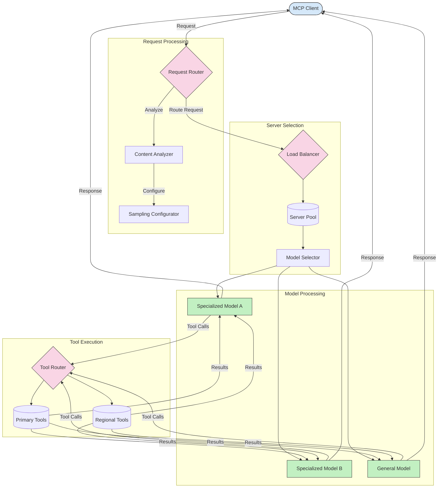

<!--
CO_OP_TRANSLATOR_METADATA:
{
  "original_hash": "a621fc52c7daec552eb8b3b48c0361dd",
  "translation_date": "2025-06-02T19:44:23+00:00",
  "source_file": "05-AdvancedTopics/mcp-routing/README.md",
  "language_code": "ne"
}
-->
## MCP मा स्याम्पलिङ र राउटिङ आर्किटेक्चर

स्याम्पलिङ Model Context Protocol (MCP) को एक महत्वपूर्ण अङ्ग हो जसले प्रभावकारी अनुरोध प्रक्रिया र राउटिङ सम्भव बनाउँछ। यसले आउने अनुरोधहरूको विश्लेषण गरेर तिनीहरूलाई सबैभन्दा उपयुक्त मोडेल वा सेवामा पठाउने निर्णय गर्छ, जस्तै सामग्री प्रकार, प्रयोगकर्ता सन्दर्भ, र सिस्टम लोडका आधारमा।

स्याम्पलिङ र राउटिङलाई मिलाएर एक बलियो आर्किटेक्चर तयार गर्न सकिन्छ जसले स्रोतहरूको सदुपयोग र उच्च उपलब्धता सुनिश्चित गर्छ। स्याम्पलिङले अनुरोधहरूको वर्गीकरण गर्न मद्दत गर्छ भने राउटिङले तिनीहरूलाई उपयुक्त मोडेल वा सेवामा पठाउँछ।

तलको चित्रले देखाउँछ कि कसरी स्याम्पलिङ र राउटिङ एकसाथ काम गर्छन् एक व्यापक MCP आर्किटेक्चरमा:

## अब के गर्ने

- [Sampling](../mcp-sampling/README.md)

**अस्वीकरण**:  
यो दस्तावेज AI अनुवाद सेवा [Co-op Translator](https://github.com/Azure/co-op-translator) प्रयोग गरेर अनुवाद गरिएको हो। हामी शुद्धताका लागि प्रयासरत छौं, तर कृपया ध्यान दिनुहोस् कि स्वचालित अनुवादमा त्रुटिहरू वा असंगतिहरू हुन सक्छन्। मूल दस्तावेज यसको मूल भाषामा नै आधिकारिक स्रोत मानिनुपर्छ। महत्वपूर्ण जानकारीका लागि व्यावसायिक मानव अनुवाद सिफारिस गरिन्छ। यस अनुवादको प्रयोगबाट उत्पन्न कुनै पनि गलतफहमी वा गलत व्याख्याका लागि हामी जिम्मेवार छैनौं।