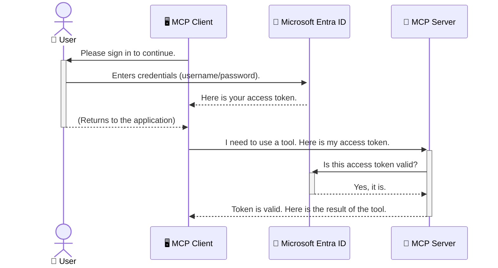

<!--
CO_OP_TRANSLATOR_METADATA:
{
  "original_hash": "6e562d7e5a77c8982da4aa8f762ad1d8",
  "translation_date": "2025-07-02T09:14:45+00:00",
  "source_file": "05-AdvancedTopics/mcp-security-entra/README.md",
  "language_code": "ne"
}
-->
# AI कार्यप्रवाहहरूलाई सुरक्षित पार्ने: मोडेल कन्टेक्स्ट प्रोटोकल सर्भरहरूको लागि Entra ID प्रमाणीकरण

## परिचय  
तपाईंको मोडेल कन्टेक्स्ट प्रोटोकल (MCP) सर्भरलाई सुरक्षित पार्नु आफ्नो घरको मुख्य ढोका लक लगाउनु जत्तिकै महत्वपूर्ण छ। तपाईंको MCP सर्भर खुला छ भने, तपाईंका उपकरण र डाटामा अनधिकृत पहुँच हुन सक्छ, जसले सुरक्षा उल्लंघन निम्त्याउन सक्छ। Microsoft Entra ID ले एक बलियो क्लाउड-आधारित पहिचान र पहुँच व्यवस्थापन समाधान प्रदान गर्छ, जसले सुनिश्चित गर्छ कि केवल अधिकृत प्रयोगकर्ता र अनुप्रयोगहरूले मात्र तपाईंको MCP सर्भरसँग अन्तरक्रिया गर्न सक्छन्। यस खण्डमा, तपाईंले Entra ID प्रमाणीकरण प्रयोग गरी आफ्नो AI कार्यप्रवाहहरू कसरी सुरक्षित गर्ने भनेर सिक्नु हुनेछ।

## सिकाइ उद्देश्यहरू  
यस खण्डको अन्त्यसम्म, तपाईं सक्षम हुनुहुनेछ:

- MCP सर्भरहरूलाई सुरक्षित पार्नुको महत्व बुझ्न।
- Microsoft Entra ID र OAuth 2.0 प्रमाणीकरणका आधारभूत कुरा व्याख्या गर्न।
- सार्वजनिक र गोप्य क्लाइन्टबीचको भिन्नता चिन्हित गर्न।
- स्थानीय (सार्वजनिक क्लाइन्ट) र दूरस्थ (गोप्य क्लाइन्ट) MCP सर्भर परिदृश्यहरूमा Entra ID प्रमाणीकरण कार्यान्वयन गर्न।
- AI कार्यप्रवाहहरू विकास गर्दा सुरक्षा उत्तम अभ्यासहरू लागू गर्न।

## सुरक्षा र MCP

जसरी तपाईं आफ्नो घरको मुख्य ढोका खुला राख्नु हुन्न, त्यस्तै तपाईंले आफ्नो MCP सर्भर पनि सबैका लागि खुला राख्नु हुँदैन। तपाईंका AI कार्यप्रवाहहरूलाई सुरक्षित पार्नु मजबुत, विश्वासयोग्य, र सुरक्षित अनुप्रयोगहरू निर्माण गर्न आवश्यक छ। यस अध्यायले तपाईंलाई Microsoft Entra ID प्रयोग गरी MCP सर्भरहरूलाई कसरी सुरक्षित गर्ने भनेर परिचय गराउनेछ, जसले सुनिश्चित गर्छ कि केवल अधिकृत प्रयोगकर्ता र अनुप्रयोगहरूले मात्र तपाईंका उपकरण र डाटासँग अन्तरक्रिया गर्न सक्छन्।

## MCP सर्भरहरूको लागि सुरक्षा किन महत्वपूर्ण छ

कल्पना गर्नुहोस् कि तपाईंको MCP सर्भरमा एउटा उपकरण छ जसले इमेल पठाउन वा ग्राहक डाटाबेस पहुँच गर्न सक्छ। यदि सर्भर सुरक्षित छैन भने, कुनै पनि व्यक्ति त्यो उपकरण प्रयोग गर्न सक्छ, जसले अनधिकृत डाटा पहुँच, स्प्याम, वा अन्य दुर्भावनापूर्ण गतिविधिहरू निम्त्याउन सक्छ।

प्रमाणीकरण लागू गरेर, तपाईं सुनिश्चित गर्नुहुन्छ कि सर्भरमा आउने प्रत्येक अनुरोध प्रमाणित हुन्छ, जसले अनुरोध गर्ने प्रयोगकर्ता वा अनुप्रयोगको पहिचान पुष्टि गर्छ। यो तपाईंको AI कार्यप्रवाहहरूलाई सुरक्षित पार्ने पहिलो र सबैभन्दा महत्वपूर्ण कदम हो।

## Microsoft Entra ID परिचय

[**Microsoft Entra ID**](https://adoption.microsoft.com/microsoft-security/entra/) एक क्लाउड-आधारित पहिचान र पहुँच व्यवस्थापन सेवा हो। यसलाई तपाईंका अनुप्रयोगहरूको लागि एक सार्वभौम सुरक्षा प्रहरीको रूपमा सोच्न सकिन्छ। यो प्रयोगकर्ताको पहिचान प्रमाणित गर्ने (प्रमाणीकरण) र तिनीहरूले के गर्न सक्ने निर्णय गर्ने (अधिकृत) जटिल प्रक्रियाहरू सम्हाल्छ।

Entra ID प्रयोग गरेर तपाईंले:

- प्रयोगकर्ताहरूका लागि सुरक्षित साइन-इन सक्षम गर्न सक्नुहुन्छ।
- API र सेवाहरूलाई सुरक्षित गर्न सक्नुहुन्छ।
- पहुँच नीतिहरूलाई केन्द्रिय स्थानबाट व्यवस्थापन गर्न सक्नुहुन्छ।

MCP सर्भरहरूको लागि, Entra ID ले कसले तपाईंको सर्भरका क्षमता पहुँच गर्न सक्छ भनी व्यवस्थापन गर्न बलियो र विश्वसनीय समाधान प्रदान गर्छ।

---

## जादू बुझ्नुहोस्: Entra ID प्रमाणीकरण कसरी काम गर्छ

Entra ID ले प्रमाणीकरणको लागि **OAuth 2.0** जस्ता खुला मानकहरू प्रयोग गर्छ। यद्यपि विवरणहरू जटिल हुन सक्छन्, मुख्य अवधारणा सरल छ र एउटा उपमा मार्फत बुझ्न सकिन्छ।

### OAuth 2.0 को सरल परिचय: भ्याले किज

OAuth 2.0 लाई तपाईंको कारको लागि भ्याले सेवा जस्तै सोच्नुहोस्। जब तपाईं रेस्टुरेन्टमा जानुहुन्छ, तपाईंले आफ्नो मास्टर कुञ्जी भ्यालेलाई दिनु हुन्न। यसको सट्टा, तपाईं एउटा **भ्याले कुञ्जी** दिनुहुन्छ जसमा सीमित अनुमति हुन्छ—यो कार स्टार्ट गर्न र ढोका लक गर्न सक्छ, तर ट्रंक वा ग्लोभ कम्पार्टमेन्ट खोल्न सक्दैन।

यस उपमामा:

- **तपाईं** हुनुहुन्छ **प्रयोगकर्ता**।
- **तपाईंको कार** हो **MCP सर्भर** जसमा महत्वपूर्ण उपकरण र डाटा छन्।
- **भ्याले** हो **Microsoft Entra ID**।
- **पार्किङ अटेन्डेन्ट** हो **MCP क्लाइन्ट** (सर्भर पहुँच गर्न खोज्ने अनुप्रयोग)।
- **भ्याले कुञ्जी** हो **Access Token**।

Access token एक सुरक्षित टेक्स्ट स्ट्रिङ हो जुन MCP क्लाइन्टले Entra ID बाट साइन इन गरेपछि प्राप्त गर्छ। क्लाइन्टले यो टोकन सर्भरमा हरेक अनुरोधमा प्रस्तुत गर्छ। सर्भरले टोकन प्रमाणित गरेर अनुरोध वैध छ भनी सुनिश्चित गर्छ र क्लाइन्टसँग आवश्यक अनुमति छ कि छैन भनी जाँच गर्छ, तपाईंको वास्तविक प्रमाणपत्र (जस्तै पासवर्ड) बिना नै।

### प्रमाणीकरण प्रवाह

यसरी प्रक्रिया व्यवहारमा काम गर्छ:



### Microsoft Authentication Library (MSAL) परिचय

कोडमा जाने अघि, एउटा महत्वपूर्ण कम्पोनेन्ट MSAL परिचय गराउनु आवश्यक छ।

MSAL Microsoft द्वारा विकसित लाइब्रेरी हो जसले विकासकर्ताहरूलाई प्रमाणीकरण सजिलो बनाउँछ। तपाईंले सुरक्षा टोकनहरू व्यवस्थापन, साइन-इन प्रक्रिया, र सत्र रिफ्रेस जस्ता जटिल कोडहरू लेख्न नपर्ने गरी MSAL ले ती सबै कामहरू गर्छ।

MSAL प्रयोग गर्नुका फाइदाहरू:

- **सुरक्षित छ:** यसले उद्योग मानक प्रोटोकल र सुरक्षा उत्तम अभ्यासहरू लागू गर्छ, जसले तपाईंको कोडमा जोखिम कम गर्छ।
- **विकास सजिलो बनाउँछ:** OAuth 2.0 र OpenID Connect प्रोटोकलहरूको जटिलता लुकाएर केही लाइन कोडमा बलियो प्रमाणीकरण थप्न मद्दत गर्छ।
- **मेन्टेन्ड छ:** Microsoft ले MSAL लाई नयाँ सुरक्षा खतराहरू र प्लेटफर्म परिवर्तनहरू अनुसार नियमित अपडेट गर्छ।

MSAL ले .NET, JavaScript/TypeScript, Python, Java, Go, र मोबाइल प्लेटफर्महरू (iOS, Android) लगायत धेरै भाषाहरू र फ्रेमवर्कहरू समर्थन गर्छ। यसले तपाईंको प्रविधि स्ट्याकभरि एकै प्रकारको प्रमाणीकरण ढाँचा प्रयोग गर्न सकिन्छ।

MSAL बारे थप जान्न, आधिकारिक [MSAL अवलोकन कागजात](https://learn.microsoft.com/entra/identity-platform/msal-overview) हेर्न सक्नुहुन्छ।

---

## Entra ID प्रयोग गरी आफ्नो MCP सर्भर सुरक्षित पार्ने: चरण-द्वारा-चरण मार्गदर्शन

अब, स्थानीय MCP सर्भरलाई कसरी सुरक्षित गर्ने भनेर हिँडौँ (जसले `stdio`) using Entra ID. This example uses a **public client**, which is suitable for applications running on a user's machine, like a desktop app or a local development server.

### Scenario 1: Securing a Local MCP Server (with a Public Client)

In this scenario, we'll look at an MCP server that runs locally, communicates over `stdio`, and uses Entra ID to authenticate the user before allowing access to its tools. The server will have a single tool that fetches the user's profile information from the Microsoft Graph API.

#### 1. Setting Up the Application in Entra ID

Before writing any code, you need to register your application in Microsoft Entra ID. This tells Entra ID about your application and grants it permission to use the authentication service.

1. Navigate to the **[Microsoft Entra portal](https://entra.microsoft.com/)**.
2. Go to **App registrations** and click **New registration**.
3. Give your application a name (e.g., "My Local MCP Server").
4. For **Supported account types**, select **Accounts in this organizational directory only**.
5. You can leave the **Redirect URI** blank for this example.
6. Click **Register**.

Once registered, take note of the **Application (client) ID** and **Directory (tenant) ID**. You'll need these in your code.

#### 2. The Code: A Breakdown

Let's look at the key parts of the code that handle authentication. The full code for this example is available in the [Entra ID - Local - WAM](https://github.com/Azure-Samples/mcp-auth-servers/tree/main/src/entra-id-local-wam) folder of the [mcp-auth-servers GitHub repository](https://github.com/Azure-Samples/mcp-auth-servers).

**`AuthenticationService.cs`**

This class is responsible for handling the interaction with Entra ID.

- **`CreateAsync`**: This method initializes the `PublicClientApplication` from the MSAL (Microsoft Authentication Library). It's configured with your application's `clientId` and `tenantId`.
- **`WithBroker`**: This enables the use of a broker (like the Windows Web Account Manager), which provides a more secure and seamless single sign-on experience.
- **`AcquireTokenAsync` प्रयोग गर्छ): यो मुख्य विधि हो। यसले पहिले मौन रूपमा टोकन प्राप्त गर्ने प्रयास गर्छ (यदि प्रयोगकर्ताको वैध सत्र छ भने पुन: साइन इन आवश्यक पर्दैन)। यदि मौन टोकन प्राप्त गर्न नसकिने हो भने, प्रयोगकर्तालाई अन्तरक्रियात्मक रूपमा साइन इन गर्न आग्रह गरिन्छ।

```csharp
// Simplified for clarity
public static async Task<AuthenticationService> CreateAsync(ILogger<AuthenticationService> logger)
{
    var msalClient = PublicClientApplicationBuilder
        .Create(_clientId) // Your Application (client) ID
        .WithAuthority(AadAuthorityAudience.AzureAdMyOrg)
        .WithTenantId(_tenantId) // Your Directory (tenant) ID
        .WithBroker(new BrokerOptions(BrokerOptions.OperatingSystems.Windows))
        .Build();

    // ... cache registration ...

    return new AuthenticationService(logger, msalClient);
}

public async Task<string> AcquireTokenAsync()
{
    try
    {
        // Try silent authentication first
        var accounts = await _msalClient.GetAccountsAsync();
        var account = accounts.FirstOrDefault();

        AuthenticationResult? result = null;

        if (account != null)
        {
            result = await _msalClient.AcquireTokenSilent(_scopes, account).ExecuteAsync();
        }
        else
        {
            // If no account, or silent fails, go interactive
            result = await _msalClient.AcquireTokenInteractive(_scopes).ExecuteAsync();
        }

        return result.AccessToken;
    }
    catch (Exception ex)
    {
        _logger.LogError(ex, "An error occurred while acquiring the token.");
        throw; // Optionally rethrow the exception for higher-level handling
    }
}
```

**`Program.cs`**

This is where the MCP server is set up and the authentication service is integrated.

- **`AddSingleton<AuthenticationService>`**: This registers the `AuthenticationService` with the dependency injection container, so it can be used by other parts of the application (like our tool).
- **`GetUserDetailsFromGraph` tool**: This tool requires an instance of `AuthenticationService`. Before it does anything, it calls `authService.AcquireTokenAsync()` प्रयोग गरेर मान्य पहुँच टोकन प्राप्त गर्छ। यदि प्रमाणीकरण सफल भयो भने, यो टोकन प्रयोग गरी Microsoft Graph API कल गरेर प्रयोगकर्ताको विवरण ल्याउँछ।

```csharp
// Simplified for clarity
[McpServerTool(Name = "GetUserDetailsFromGraph")]
public static async Task<string> GetUserDetailsFromGraph(
    AuthenticationService authService)
{
    try
    {
        // This will trigger the authentication flow
        var accessToken = await authService.AcquireTokenAsync();

        // Use the token to create a GraphServiceClient
        var graphClient = new GraphServiceClient(
            new BaseBearerTokenAuthenticationProvider(new TokenProvider(authService)));

        var user = await graphClient.Me.GetAsync();

        return System.Text.Json.JsonSerializer.Serialize(user);
    }
    catch (Exception ex)
    {
        return $"Error: {ex.Message}";
    }
}
```

#### ३. सबै कुरा कसरी सँगै काम गर्छ

1. जब MCP क्लाइन्टले `GetUserDetailsFromGraph` tool, the tool first calls `AcquireTokenAsync`.
2. `AcquireTokenAsync` triggers the MSAL library to check for a valid token.
3. If no token is found, MSAL, through the broker, will prompt the user to sign in with their Entra ID account.
4. Once the user signs in, Entra ID issues an access token.
5. The tool receives the token and uses it to make a secure call to the Microsoft Graph API.
6. The user's details are returned to the MCP client.

This process ensures that only authenticated users can use the tool, effectively securing your local MCP server.

### Scenario 2: Securing a Remote MCP Server (with a Confidential Client)

When your MCP server is running on a remote machine (like a cloud server) and communicates over a protocol like HTTP Streaming, the security requirements are different. In this case, you should use a **confidential client** and the **Authorization Code Flow**. This is a more secure method because the application's secrets are never exposed to the browser.

This example uses a TypeScript-based MCP server that uses Express.js to handle HTTP requests.

#### 1. Setting Up the Application in Entra ID

The setup in Entra ID is similar to the public client, but with one key difference: you need to create a **client secret**.

1. Navigate to the **[Microsoft Entra portal](https://entra.microsoft.com/)**.
2. In your app registration, go to the **Certificates & secrets** tab.
3. Click **New client secret**, give it a description, and click **Add**.
4. **Important:** Copy the secret value immediately. You will not be able to see it again.
5. You also need to configure a **Redirect URI**. Go to the **Authentication** tab, click **Add a platform**, select **Web**, and enter the redirect URI for your application (e.g., `http://localhost:3001/auth/callback`).

> **⚠️ Important Security Note:** For production applications, Microsoft strongly recommends using **secretless authentication** methods such as **Managed Identity** or **Workload Identity Federation** instead of client secrets. Client secrets pose security risks as they can be exposed or compromised. Managed identities provide a more secure approach by eliminating the need to store credentials in your code or configuration.
>
> For more information about managed identities and how to implement them, see the [Managed identities for Azure resources overview](https://learn.microsoft.com/entra/identity/managed-identities-azure-resources/overview).

#### 2. The Code: A Breakdown

This example uses a session-based approach. When the user authenticates, the server stores the access token and refresh token in a session and gives the user a session token. This session token is then used for subsequent requests. The full code for this example is available in the [Entra ID - Confidential client](https://github.com/Azure-Samples/mcp-auth-servers/tree/main/src/entra-id-cca-session) folder of the [mcp-auth-servers GitHub repository](https://github.com/Azure-Samples/mcp-auth-servers).

**`Server.ts`**

This file sets up the Express server and the MCP transport layer.

- **`requireBearerAuth`**: This is middleware that protects the `/sse` and `/message` endpoints. It checks for a valid bearer token in the `Authorization` header of the request.
- **`EntraIdServerAuthProvider`**: This is a custom class that implements the `McpServerAuthorizationProvider` interface. It's responsible for handling the OAuth 2.0 flow.
- **`/auth/callback` मा अनुरोध गर्छ: यो अन्तबिन्दु प्रयोगकर्ताले प्रमाणीकरण गरेपछि Entra ID बाट रिडिरेक्टलाई सम्हाल्छ। यसले अधिकृत कोडलाई पहुँच टोकन र रिफ्रेस टोकनमा रूपान्तरण गर्छ।

```typescript
// Simplified for clarity
const app = express();
const { server } = createServer();
const provider = new EntraIdServerAuthProvider();

// Protect the SSE endpoint
app.get("/sse", requireBearerAuth({
  provider,
  requiredScopes: ["User.Read"]
}), async (req, res) => {
  // ... connect to the transport ...
});

// Protect the message endpoint
app.post("/message", requireBearerAuth({
  provider,
  requiredScopes: ["User.Read"]
}), async (req, res) => {
  // ... handle the message ...
});

// Handle the OAuth 2.0 callback
app.get("/auth/callback", (req, res) => {
  provider.handleCallback(req.query.code, req.query.state)
    .then(result => {
      // ... handle success or failure ...
    });
});
```

**`Tools.ts`**

This file defines the tools that the MCP server provides. The `getUserDetails` उपकरण पहिलाको जस्तै छ, तर यसले सत्रबाट पहुँच टोकन प्राप्त गर्छ।

```typescript
// Simplified for clarity
server.setRequestHandler(CallToolRequestSchema, async (request) => {
  const { name } = request.params;
  const context = request.params?.context as { token?: string } | undefined;
  const sessionToken = context?.token;

  if (name === ToolName.GET_USER_DETAILS) {
    if (!sessionToken) {
      throw new AuthenticationError("Authentication token is missing or invalid. Ensure the token is provided in the request context.");
    }

    // Get the Entra ID token from the session store
    const tokenData = tokenStore.getToken(sessionToken);
    const entraIdToken = tokenData.accessToken;

    const graphClient = Client.init({
      authProvider: (done) => {
        done(null, entraIdToken);
      }
    });

    const user = await graphClient.api('/me').get();

    // ... return user details ...
  }
});
```

**`auth/EntraIdServerAuthProvider.ts`**

This class handles the logic for:

- Redirecting the user to the Entra ID sign-in page.
- Exchanging the authorization code for an access token.
- Storing the tokens in the `tokenStore`.
- Refreshing the access token when it expires.

#### 3. How It All Works Together

1. When a user first tries to connect to the MCP server, the `requireBearerAuth` middleware will see that they don't have a valid session and will redirect them to the Entra ID sign-in page.
2. The user signs in with their Entra ID account.
3. Entra ID redirects the user back to the `/auth/callback` endpoint with an authorization code.
4. The server exchanges the code for an access token and a refresh token, stores them, and creates a session token which is sent to the client.
5. The client can now use this session token in the `Authorization` header for all future requests to the MCP server.
6. When the `getUserDetails` उपकरण कल गर्दा, यो सत्र टोकन प्रयोग गरेर Entra ID पहुँच टोकन खोज्छ र त्यसपछि Microsoft Graph API कल गर्छ।

यो प्रवाह सार्वजनिक क्लाइन्ट प्रवाह भन्दा जटिल छ, तर इन्टरनेट-आधारित अन्तबिन्दुहरूको लागि आवश्यक छ। किनकि दूरस्थ MCP सर्भरहरू सार्वजनिक इन्टरनेटमा पहुँचयोग्य हुन्छन्, तिनीहरूलाई अनधिकृत पहुँच र सम्भावित आक्रमणहरूबाट बचाउन कडा सुरक्षा उपाय आवश्यक हुन्छ।

## सुरक्षा उत्तम अभ्यासहरू

- **सधैं HTTPS प्रयोग गर्नुहोस्**: क्लाइन्ट र सर्भर बीचको सञ्चार इन्क्रिप्ट गरेर टोकनहरू चोरी हुनबाट बचाउनुहोस्।
- **भूमिका-आधारित पहुँच नियन्त्रण (RBAC) लागू गर्नुहोस्**: केवल *प्रयोगकर्ता प्रमाणीकरण भयो* भनी मात्र जाँच नगर्नुहोस्; *के उनीहरूलाई के गर्न अनुमति छ* भनी पनि जाँच गर्नुहोस्। Entra ID मा भूमिका परिभाषित गरेर MCP सर्भरमा तिनीहरूलाई जाँच गर्न सकिन्छ।
- **निगरानी र अडिट गर्नुहोस्**: सबै प्रमाणीकरण घटनाहरू लग गर्नुहोस् ताकि शंकास्पद गतिविधि पत्ता लगाउन र प्रतिक्रिया दिन सकियोस्।
- **रेट लिमिटिङ र थ्रोटलिङ व्यवस्थापन गर्नुहोस्**: Microsoft Graph र अन्य APIहरूले दुरुपयोग रोक्न रेट लिमिटिङ लागू गर्छन्। MCP सर्भरमा HTTP 429 (धेरै अनुरोधहरू) प्रतिक्रिया सहजै व्यवस्थापन गर्न एक्सपोनेन्सियल ब्याकअफ र पुन: प्रयास तर्क लागू गर्नुहोस्। बारम्बार पहुँच हुने डाटालाई क्यासिङ गरेर API कलहरू कम गर्नुहोस्।
- **टोकन सुरक्षित भण्डारण गर्नुहोस्**: पहुँच रिफ्रेस टोकनहरू सुरक्षित रूपमा भण्डारण गर्नुहोस्। स्थानीय अनुप्रयोगहरूका लागि प्रणालीको सुरक्षित भण्डारण प्रणाली प्रयोग गर्नुहोस्। सर्भर अनुप्रयोगहरूको लागि एन्क्रिप्टेड भण्डारण वा Azure Key Vault जस्ता सुरक्षित कुञ्जी व्यवस्थापन सेवा विचार गर्नुहोस्।
- **टोकन म्याद समाप्ति व्यवस्थापन गर्नुहोस्**: पहुँच टोकनको सीमित अवधि हुन्छ। प्रयोगकर्तालाई पुन: प्रमाणीकरण नगरी सहज अनुभव कायम राख्न रिफ्रेस टोकन प्रयोग गरेर स्वचालित टोकन रिफ्रेस कार्यान्वयन गर्नुहोस्।
- **Azure API Management प्रयोग गर्ने विचार गर्नुहोस्**: MCP सर्भरमा सिधै सुरक्षा लागू गर्दा तपाईंलाई सूक्ष्म नियन्त्रण मिल्छ, तर Azure API Management जस्ता API गेटवेहरूले प्रमाणीकरण, अधिकृत, रेट लिमिटिङ, र निगरानी जस्ता धेरै सुरक्षा समस्याहरू स्वचालित रूपमा व्यवस्थापन गर्छन्। तिनीहरूले क्लाइन्ट र MCP सर्भरहरू बीच केन्द्रिय सुरक्षा तह प्रदान गर्छन्। MCP सँग API गेटवेहरू प्रयोग गर्ने थप विवरणका लागि हाम्रो [Azure API Management Your Auth Gateway For MCP Servers](https://techcommunity.microsoft.com/blog/integrationsonazureblog/azure-api-management-your-auth-gateway-for-mcp-servers/4402690) हेर्नुहोस्।

## मुख्य सिकाइ बुँदाहरू

- तपाईंको MCP सर्भर सुरक्षित पार्नु तपाईंका डाटा र उपकरणहरूलाई जोगाउन अत्यन्त आवश्यक छ।
- Microsoft Entra ID ले प्रमाणीकरण र अधिकृतको लागि बलियो र मापनयोग्य समाधान प्रदान गर्छ।
- स्थानीय अनुप्रयोगहरूको लागि **सार्वजनिक क्लाइन्ट** र दूरस्थ सर्भरहरूको लागि **गोप्य क्लाइन्ट** प्रयोग गर्नुहोस्।
- वेब अनुप्रयोगहरूको लागि **Authorization Code Flow** सबैभन्दा सुरक्षित विकल्प हो।

## अभ्यास

1. तपाईंले बनाउन सक्ने MCP सर्भरको बारेमा सोच्नुहोस्। के त्यो स्थानीय सर्भर हुनेछ वा दूरस्थ सर्भर?
2. तपाईंको जवाफको आधारमा, सार्वजनिक क्लाइन्ट प्रयोग गर्नुहुन्छ कि गोप्य क्लाइन्ट?
3. Microsoft Graph विरुद्ध कार्यहरू गर्न तपाईंको MCP सर्भरले कुन अनुमति अनुरोध गर्नेछ?

## व्यावहारिक अभ्यासहरू

### अभ्यास १: Entra ID मा अनुप्रयोग दर्ता गर्नुहोस्  
Microsoft Entra पोर्टलमा जानुहोस्।  
तपाईंको MCP सर्भरको लागि नयाँ अनुप्रयोग दर्ता गर्नुहोस्।  
Application (client) ID र Directory (tenant) ID नोट गर्नुहोस्।

### अभ्यास २: स्थानीय MCP सर्भर सुरक्षित पार्नुहोस् (सार्वजनिक क्लाइन्ट)  
- MSAL (Microsoft Authentication Library) प्रयोग गरी प्रयोगकर्ता प्रमाणीकरण एकीकृत गर्न कोड उदाहरण अनुसरण गर्नुहोस्।  
- Microsoft Graph बाट प्रयोगकर्ता विवरण ल्याउने MCP उपकरण कल गरेर प्रमाणीकरण प्रवाह परीक्षण गर्नुहोस्।

### अभ्यास ३: दूरस्थ MCP सर्भर सुरक्षित पार्नुहोस् (गोप्य क्लाइन्ट)  
- Entra ID मा गोप्य क्लाइन्ट दर्ता गर्नुहोस् र क्लाइन्ट सीक्रेट बनाउनुहोस्।  
- तपाईंको Express.js MCP सर्भरमा Authorization Code Flow कन्फिगर गर्नुहोस्।  
- सुरक्षित अन्तबिन्दुहरू परीक्षण गर्नुहोस् र टोकन-आधारित पहुँच पुष्टि गर्नुहोस्।

### अभ्यास ४: सुरक्षा उत्तम अभ्यासहरू लागू गर्नुहोस्  
- तपाईंको स्थानीय वा दूरस्थ सर्भरमा HTTPS सक्षम गर्नुहोस्।  
- सर्भर लॉजिकमा भूमिका-आधारित पहुँच नियन्त्रण (RBAC) लागू गर्नुहोस्।  
- टोकन म्याद समाप्ति व्यवस्थापन र सुरक्षित टोकन भण्डारण थप्नुहोस्।

## स्रोतहरू

1. **MSAL अवलोकन कागजात**  
   Microsoft Authentication Library (MSAL) ले कसरी विभिन्न प्लेटफर्महरूमा सुरक्षित टोकन प्राप्ति सक्षम गर्छ बुझ्न:  
   [MSAL Overview on Microsoft Learn](https://learn.microsoft.com/en-gb/entra/msal/overview)

2. **Azure-Samples/mcp-auth-servers GitHub रिपोजिटरी**  
   प्रमाणीकरण प्रवाह प्रदर्शन गर्ने MCP सर्भरहरूको सन्दर्भ कार्यान्वयनहरू:  
   [Azure-Samples/mcp-auth-servers on GitHub](https://github.com/Azure-Samples/mcp-auth-servers)

3. **Azure स्रोतहरूको लागि Managed Identities अवलोकन**  
   सिस्टम वा प्रयोगकर्ता-आधारित व्यवस्थापन पहिचान प्रयोग गरी गोप्य कुरा कसरी हटाउने:  
   [Managed Identities Overview on Microsoft Learn](https://learn.microsoft.com/en-us/entra/identity/managed-identities-azure-resources/)

4. **Azure API Management: MCP सर्भरहरूको लागि तपाईंको प्रमाणीकरण गेटवे**  
   MCP सर्भरहरूको लागि OAuth2 गेटवेको रूपमा APIM प्रयोग गर्ने विस्तृत चर्चा:  
   [Azure API Management Your Auth Gateway For MCP Servers](https://techcommunity.microsoft.com/blog/integrationsonazureblog/azure-api-management-your-auth-gateway-for-mcp-servers/4402690)

5. **Microsoft Graph अनुमति सन्दर्भ**  
   Microsoft Graph का लागि प्रतिनिधित्व गरिएको र अनुप्रयोग अनुमति सूची:  
   [Microsoft Graph Permissions Reference](https://learn.microsoft.com/zh-tw/graph/permissions-reference)

## सिकाइ परिणामहरू  
यस खण्ड पूरा गरेपछि, तपाईं सक्षम हुनुहुनेछ:

- किन प्रमाणीकरण MCP सर्भर र AI कार्यप्रवाहहरूका लागि महत्वपूर्ण छ भन्ने स्पष्ट रूपमा व्यक्त गर्न।  
- स्थानीय र दूरस्थ MCP सर्भर परिदृश्यहरूको लागि Entra ID प्रमाणीकरण सेटअप र कन्फिगर गर्न।  
- तपाईंको सर्भरको परिनियोजन अनुसार उपयुक्त क्लाइन्ट प्रकार (सार्वजनिक वा गोप्य) चयन गर्न।  
- टोकन भण्डारण र भूमिका-आधारित अधिकृत सहित सुरक्षित कोडिङ अभ्यासहरू कार्यान्वयन गर्न।  
- तपाईंको MCP सर्भर र त्यसका उपकरणहरूलाई अनधिकृत पहुँचबाट विश्वस्त रूपमा सुरक्षा गर्न।

## के आउने छ

- [5.13 Model Context Protocol (MCP) Integration with Azure AI Foundry](../mcp-foundry-agent-integration/README.md)

**अस्वीकरण**:  
यो दस्तावेज AI अनुवाद सेवा [Co-op Translator](https://github.com/Azure/co-op-translator) प्रयोग गरी अनुवाद गरिएको हो। हामी शुद्धताका लागि प्रयासरत छौं, तर कृपया ध्यान दिनुहोस् कि स्वचालित अनुवादमा त्रुटि वा अशुद्धता हुन सक्छ। मूल दस्तावेज यसको स्वदेशी भाषामा आधिकारिक स्रोत मानिनुपर्छ। महत्वपूर्ण जानकारीको लागि व्यावसायिक मानव अनुवाद सिफारिस गरिन्छ। यस अनुवादको प्रयोगबाट उत्पन्न हुने कुनै पनि गलतफहमी वा गलत व्याख्याको लागि हामी जिम्मेवार छैनौं।