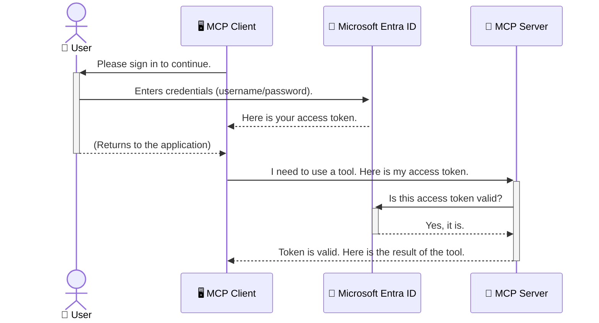

<!--
CO_OP_TRANSLATOR_METADATA:
{
  "original_hash": "6e562d7e5a77c8982da4aa8f762ad1d8",
  "translation_date": "2025-07-14T02:57:31+00:00",
  "source_file": "05-AdvancedTopics/mcp-security-entra/README.md",
  "language_code": "ne"
}
-->
# AI कार्यप्रवाहहरू सुरक्षित गर्ने: मोडेल कन्टेक्स्ट प्रोटोकल सर्भरहरूका लागि Entra ID प्रमाणीकरण

## परिचय  
तपाईंको मोडेल कन्टेक्स्ट प्रोटोकल (MCP) सर्भरलाई सुरक्षित गर्नु तपाईंको घरको मुख्य ढोका लक लगाउनु जत्तिकै महत्वपूर्ण छ। यदि तपाईंको MCP सर्भर खुला छ भने, तपाईंका उपकरण र डाटा अनधिकृत पहुँचमा पर्न सक्छन्, जसले सुरक्षा उल्लङ्घन निम्त्याउन सक्छ। Microsoft Entra ID एक बलियो क्लाउड-आधारित पहिचान र पहुँच व्यवस्थापन समाधान हो, जसले सुनिश्चित गर्छ कि केवल अधिकृत प्रयोगकर्ता र अनुप्रयोगहरू मात्र तपाईंको MCP सर्भरसँग अन्तरक्रिया गर्न सक्छन्। यस खण्डमा, तपाईंले Entra ID प्रमाणीकरण प्रयोग गरेर आफ्नो AI कार्यप्रवाहहरू कसरी सुरक्षित गर्ने सिक्नुहुनेछ।

## सिकाइका उद्देश्यहरू  
यस खण्डको अन्त्यसम्म, तपाईं सक्षम हुनुहुनेछ:

- MCP सर्भरहरू सुरक्षित गर्ने महत्त्व बुझ्न।
- Microsoft Entra ID र OAuth 2.0 प्रमाणीकरणका आधारभूत कुरा व्याख्या गर्न।
- सार्वजनिक र गोप्य क्लाइन्टबीचको भिन्नता चिन्हित गर्न।
- स्थानीय (सार्वजनिक क्लाइन्ट) र रिमोट (गोप्य क्लाइन्ट) MCP सर्भर परिदृश्यहरूमा Entra ID प्रमाणीकरण लागू गर्न।
- AI कार्यप्रवाह विकास गर्दा सुरक्षा सर्वोत्तम अभ्यासहरू अपनाउन।

## सुरक्षा र MCP

जसरी तपाईं आफ्नो घरको मुख्य ढोका अनलक छोड्नु हुन्न, त्यसैगरी तपाईंले आफ्नो MCP सर्भरलाई सबैका लागि खुला राख्नु हुँदैन। तपाईंका AI कार्यप्रवाहहरूलाई सुरक्षित बनाउनु बलियो, भरपर्दो र सुरक्षित अनुप्रयोगहरू निर्माण गर्न अत्यावश्यक छ। यस अध्यायले तपाईंलाई Microsoft Entra ID प्रयोग गरी तपाईंका MCP सर्भरहरू कसरी सुरक्षित गर्ने भनेर परिचय गराउनेछ, जसले सुनिश्चित गर्छ कि केवल अधिकृत प्रयोगकर्ता र अनुप्रयोगहरू मात्र तपाईंका उपकरण र डाटासँग अन्तरक्रिया गर्न सक्छन्।

## MCP सर्भरहरूको लागि सुरक्षा किन आवश्यक छ

कल्पना गर्नुहोस् तपाईंको MCP सर्भरमा एउटा उपकरण छ जसले इमेल पठाउन वा ग्राहक डाटाबेस पहुँच गर्न सक्छ। यदि सर्भर सुरक्षित छैन भने, कुनै पनि व्यक्तिले त्यो उपकरण प्रयोग गर्न सक्छ, जसले अनधिकृत डाटा पहुँच, स्प्याम वा अन्य दुष्ट गतिविधिहरू निम्त्याउन सक्छ।

प्रमाणीकरण लागू गरेर, तपाईं सुनिश्चित गर्नुहुन्छ कि सर्भरमा आउने प्रत्येक अनुरोध प्रमाणित हुन्छ, जसले अनुरोध गर्ने प्रयोगकर्ता वा अनुप्रयोगको पहिचान पुष्टि गर्छ। यो तपाईंका AI कार्यप्रवाहहरू सुरक्षित गर्ने पहिलो र सबैभन्दा महत्वपूर्ण कदम हो।

## Microsoft Entra ID परिचय

[**Microsoft Entra ID**](https://adoption.microsoft.com/microsoft-security/entra/) एक क्लाउड-आधारित पहिचान र पहुँच व्यवस्थापन सेवा हो। यसलाई तपाईंका अनुप्रयोगहरूको लागि एक सार्वभौमिक सुरक्षा गार्डको रूपमा सोच्न सकिन्छ। यो प्रयोगकर्ता पहिचानहरू (प्रमाणीकरण) जाँच्ने र उनीहरूले के गर्न पाउँछन् (अधिकार निर्धारण) भन्ने जटिल प्रक्रियालाई व्यवस्थापन गर्छ।

Entra ID प्रयोग गरेर तपाईंले:

- प्रयोगकर्ताहरूका लागि सुरक्षित साइन-इन सक्षम गर्न सक्नुहुन्छ।
- API र सेवाहरूलाई सुरक्षा गर्न सक्नुहुन्छ।
- पहुँच नीतिहरूलाई केन्द्रीय स्थानबाट व्यवस्थापन गर्न सक्नुहुन्छ।

MCP सर्भरहरूको लागि, Entra ID ले एक बलियो र व्यापक रूपमा विश्वास गरिएको समाधान प्रदान गर्छ जसले को सर्भरको क्षमता पहुँच गर्न सक्छ भनेर व्यवस्थापन गर्छ।

---

## जादू बुझ्न: Entra ID प्रमाणीकरण कसरी काम गर्छ

Entra ID ले प्रमाणीकरणका लागि **OAuth 2.0** जस्ता खुला मापदण्डहरू प्रयोग गर्छ। विवरणहरू जटिल हुन सक्छन्, तर मुख्य अवधारणा सरल छ र एउटा उपमा प्रयोग गरेर बुझ्न सकिन्छ।

### OAuth 2.0 को सरल परिचय: भ्यालेट कुञ्जी

OAuth 2.0 लाई तपाईंको कारको लागि भ्यालेट सेवा जस्तै सोच्नुहोस्। जब तपाईं रेस्टुरेन्ट पुग्नुहुन्छ, तपाईंले भ्यालेटलाई आफ्नो मुख्य कुञ्जी दिनुहुन्न। यसको सट्टा, तपाईंले एउटा **भ्यालेट कुञ्जी** दिनुहुन्छ जसमा सीमित अनुमति हुन्छ—यो कार स्टार्ट गर्न र ढोका लक गर्न सक्छ, तर ट्रंक वा ग्लोभ कम्पार्टमेन्ट खोल्न सक्दैन।

यस उपमामा:

- **तपाईं** हुनुहुन्छ **प्रयोगकर्ता**।
- **तपाईंको कार** हो **MCP सर्भर** जसमा मूल्यवान उपकरण र डाटा छन्।
- **भ्यालेट** हो **Microsoft Entra ID**।
- **पार्किङ्ग अटेन्डेन्ट** हो **MCP क्लाइन्ट** (सर्भर पहुँच गर्न खोज्ने अनुप्रयोग)।
- **भ्यालेट कुञ्जी** हो **Access Token**।

Access token एउटा सुरक्षित पाठ स्ट्रिङ हो जुन MCP क्लाइन्टले तपाईं साइन इन गरेपछि Entra ID बाट प्राप्त गर्छ। क्लाइन्टले यो टोकन प्रत्येक अनुरोधमा MCP सर्भरलाई देखाउँछ। सर्भरले टोकन प्रमाणित गरेर अनुरोध वैध छ र क्लाइन्टसँग आवश्यक अनुमति छ भनी सुनिश्चित गर्छ, तपाईंको वास्तविक प्रमाणपत्र (जस्तै पासवर्ड) कहिल्यै सम्हाल्नु नपर्ने गरी।

### प्रमाणीकरण प्रक्रिया

यसरी प्रक्रिया व्यवहारमा काम गर्छ:



### Microsoft Authentication Library (MSAL) परिचय

कोडमा प्रवेश गर्नु अघि, एउटा महत्वपूर्ण कम्पोनेन्ट परिचय गराउन आवश्यक छ: **Microsoft Authentication Library (MSAL)**।

MSAL माइक्रोसफ्टले विकास गरेको एउटा पुस्तकालय हो जसले विकासकर्ताहरूलाई प्रमाणीकरण सजिलो बनाउँछ। तपाईंले सुरक्षा टोकनहरू सम्हाल्न, साइन-इन व्यवस्थापन गर्न र सेसन रिफ्रेस गर्न जटिल कोड लेख्नु नपर्ने गरी MSAL ले सबै भारी काम गर्छ।

MSAL प्रयोग गर्न सिफारिस गरिन्छ किनभने:

- **यो सुरक्षित छ:** यसले उद्योग-मानक प्रोटोकल र सुरक्षा सर्वोत्तम अभ्यासहरू लागू गर्छ, जसले तपाईंको कोडमा कमजोरीहरू कम गर्छ।
- **यो विकास सजिलो बनाउँछ:** OAuth 2.0 र OpenID Connect प्रोटोकलहरूको जटिलता लुकाएर तपाईंलाई केही लाइन कोडमा बलियो प्रमाणीकरण थप्न अनुमति दिन्छ।
- **यो नियमित रूपमा अपडेट हुन्छ:** माइक्रोसफ्टले नयाँ सुरक्षा खतराहरू र प्लेटफर्म परिवर्तनहरूलाई सम्बोधन गर्न MSAL लाई सक्रिय रूपमा मर्मत गर्दछ।

MSAL ले .NET, JavaScript/TypeScript, Python, Java, Go, र मोबाइल प्लेटफर्महरू (iOS र Android) सहित विभिन्न भाषाहरू र फ्रेमवर्कहरू समर्थन गर्छ। यसले तपाईंलाई सम्पूर्ण प्रविधि स्ट्याकमा समान प्रमाणीकरण ढाँचा प्रयोग गर्न अनुमति दिन्छ।

MSAL बारे थप जान्न, तपाईं आधिकारिक [MSAL अवलोकन कागजात](https://learn.microsoft.com/entra/identity-platform/msal-overview) हेर्न सक्नुहुन्छ।

---

## Entra ID प्रयोग गरी तपाईंको MCP सर्भर सुरक्षित गर्ने: चरण-दर-चरण मार्गदर्शन

अब, हामी स्थानीय MCP सर्भर (जो `stdio` मार्फत सञ्चार गर्छ) लाई Entra ID प्रयोग गरी कसरी सुरक्षित गर्ने भनेर हिँड्नेछौं। यो उदाहरणमा **सार्वजनिक क्लाइन्ट** प्रयोग गरिएको छ, जुन प्रयोगकर्ताको मेसिनमा चल्ने अनुप्रयोगहरू (जस्तै डेस्कटप एप वा स्थानीय विकास सर्भर) का लागि उपयुक्त छ।

### परिदृश्य १: स्थानीय MCP सर्भर सुरक्षित गर्ने (सार्वजनिक क्लाइन्टसँग)

यस परिदृश्यमा, हामी एउटा स्थानीय रूपमा चल्ने MCP सर्भर हेरौं, जुन `stdio` मार्फत सञ्चार गर्छ र प्रयोगकर्तालाई प्रमाणित गर्न Entra ID प्रयोग गर्छ। सर्भरमा एउटा उपकरण हुनेछ जसले Microsoft Graph API बाट प्रयोगकर्ताको प्रोफाइल जानकारी ल्याउँछ।

#### १. Entra ID मा अनुप्रयोग सेटअप गर्ने

कोड लेख्नुअघि, तपाईंले Microsoft Entra ID मा आफ्नो अनुप्रयोग दर्ता गर्नुपर्छ। यसले Entra ID लाई तपाईंको अनुप्रयोगको बारेमा जानकारी दिन्छ र प्रमाणीकरण सेवा प्रयोग गर्ने अनुमति दिन्छ।

1. **[Microsoft Entra पोर्टल](https://entra.microsoft.com/)** मा जानुहोस्।
2. **App registrations** मा जानुहोस् र **New registration** क्लिक गर्नुहोस्।
3. आफ्नो अनुप्रयोगलाई नाम दिनुहोस् (जस्तै "My Local MCP Server")।
4. **Supported account types** मा **Accounts in this organizational directory only** चयन गर्नुहोस्।
5. यस उदाहरणका लागि **Redirect URI** खाली छोड्न सक्नुहुन्छ।
6. **Register** क्लिक गर्नुहोस्।

दर्ता भएपछि, **Application (client) ID** र **Directory (tenant) ID** नोट गर्नुहोस्। तपाईंलाई यी कोडमा आवश्यक पर्छ।

#### २. कोड: विश्लेषण

प्रमाणीकरण सम्हाल्ने मुख्य भागहरू हेरौं। यस उदाहरणको पूर्ण कोड [Entra ID - Local - WAM](https://github.com/Azure-Samples/mcp-auth-servers/tree/main/src/entra-id-local-wam) फोल्डरमा उपलब्ध छ, जुन [mcp-auth-servers GitHub रिपोजिटरी](https://github.com/Azure-Samples/mcp-auth-servers) मा छ।

**`AuthenticationService.cs`**

यो क्लास Entra ID सँग अन्तरक्रिया सम्हाल्छ।

- **`CreateAsync`**: MSAL बाट `PublicClientApplication` सुरु गर्छ। यो तपाईंको अनुप्रयोगको `clientId` र `tenantId` सँग कन्फिगर गरिएको छ।
- **`WithBroker`**: यो Windows Web Account Manager जस्तो ब्रोकर प्रयोग गर्न सक्षम पार्छ, जसले सुरक्षित र सहज सिंगल साइन-ऑन अनुभव दिन्छ।
- **`AcquireTokenAsync`**: मुख्य विधि हो। यसले पहिले मौन रूपमा टोकन प्राप्त गर्ने प्रयास गर्छ (यदि प्रयोगकर्ताको वैध सेसन छ भने पुनः साइन इन आवश्यक पर्दैन)। यदि मौन टोकन प्राप्त गर्न सकिँदैन भने, प्रयोगकर्तालाई अन्तरक्रियात्मक रूपमा साइन इन गर्न आग्रह गर्छ।

```csharp
// Simplified for clarity
public static async Task<AuthenticationService> CreateAsync(ILogger<AuthenticationService> logger)
{
    var msalClient = PublicClientApplicationBuilder
        .Create(_clientId) // Your Application (client) ID
        .WithAuthority(AadAuthorityAudience.AzureAdMyOrg)
        .WithTenantId(_tenantId) // Your Directory (tenant) ID
        .WithBroker(new BrokerOptions(BrokerOptions.OperatingSystems.Windows))
        .Build();

    // ... cache registration ...

    return new AuthenticationService(logger, msalClient);
}

public async Task<string> AcquireTokenAsync()
{
    try
    {
        // Try silent authentication first
        var accounts = await _msalClient.GetAccountsAsync();
        var account = accounts.FirstOrDefault();

        AuthenticationResult? result = null;

        if (account != null)
        {
            result = await _msalClient.AcquireTokenSilent(_scopes, account).ExecuteAsync();
        }
        else
        {
            // If no account, or silent fails, go interactive
            result = await _msalClient.AcquireTokenInteractive(_scopes).ExecuteAsync();
        }

        return result.AccessToken;
    }
    catch (Exception ex)
    {
        _logger.LogError(ex, "An error occurred while acquiring the token.");
        throw; // Optionally rethrow the exception for higher-level handling
    }
}
```

**`Program.cs`**

यहाँ MCP सर्भर सेटअप गरिएको छ र प्रमाणीकरण सेवा समावेश गरिएको छ।

- **`AddSingleton<AuthenticationService>`**: यसले `AuthenticationService` लाई निर्भरता इन्जेक्शन कन्टेनरमा दर्ता गर्छ, जसले अन्य भागहरूले (जस्तै हाम्रो उपकरण) यसलाई प्रयोग गर्न सक्छन्।
- **`GetUserDetailsFromGraph` उपकरण**: यस उपकरणलाई `AuthenticationService` को उदाहरण चाहिन्छ। यसले पहिले `authService.AcquireTokenAsync()` कल गरेर मान्य पहुँच टोकन प्राप्त गर्छ। प्रमाणीकरण सफल भएमा, यो टोकन प्रयोग गरी Microsoft Graph API कल गरेर प्रयोगकर्ताको विवरण ल्याउँछ।

```csharp
// Simplified for clarity
[McpServerTool(Name = "GetUserDetailsFromGraph")]
public static async Task<string> GetUserDetailsFromGraph(
    AuthenticationService authService)
{
    try
    {
        // This will trigger the authentication flow
        var accessToken = await authService.AcquireTokenAsync();

        // Use the token to create a GraphServiceClient
        var graphClient = new GraphServiceClient(
            new BaseBearerTokenAuthenticationProvider(new TokenProvider(authService)));

        var user = await graphClient.Me.GetAsync();

        return System.Text.Json.JsonSerializer.Serialize(user);
    }
    catch (Exception ex)
    {
        return $"Error: {ex.Message}";
    }
}
```

#### ३. सबै कुरा कसरी सँगै काम गर्छ

1. MCP क्लाइन्टले `GetUserDetailsFromGraph` उपकरण प्रयोग गर्न खोज्दा, उपकरणले पहिले `AcquireTokenAsync` कल गर्छ।
2. `AcquireTokenAsync` ले MSAL लाइब्रेरीलाई मान्य टोकन छ कि छैन जाँच्न भन्छ।
3. यदि टोकन छैन भने, MSAL ब्रोकर मार्फत प्रयोगकर्तालाई Entra ID खातामा साइन इन गर्न आग्रह गर्छ।
4. प्रयोगकर्ताले साइन इन गरेपछि, Entra ID ले पहुँच टोकन जारी गर्छ।
5. उपकरणले टोकन प्राप्त गरी Microsoft Graph API लाई सुरक्षित कल गर्छ।
6. प्रयोगकर्ताको विवरण MCP क्लाइन्टलाई फर्काइन्छ।

यस प्रक्रियाले केवल प्रमाणित प्रयोगकर्ताहरूले उपकरण प्रयोग गर्न सकून् भनेर सुनिश्चित गर्दै तपाईंको स्थानीय MCP सर्भरलाई प्रभावकारी रूपमा सुरक्षित बनाउँछ।

### परिदृश्य २: रिमोट MCP सर्भर सुरक्षित गर्ने (गोप्य क्लाइन्टसँग)

जब तपाईंको MCP सर्भर रिमोट मेसिनमा (जस्तै क्लाउड सर्भर) चलिरहेको हुन्छ र HTTP Streaming जस्तो प्रोटोकलमार्फत सञ्चार गर्छ, सुरक्षा आवश्यकताहरू फरक हुन्छन्। यस अवस्थामा, तपाईंले **गोप्य क्लाइन्ट** र **Authorization Code Flow** प्रयोग गर्नुपर्छ। यो विधि बढी सुरक्षित हुन्छ किनभने अनुप्रयोगका गोप्य कुञ्जीहरू ब्राउजरमा कहिल्यै देखिँदैनन्।

यो उदाहरणमा TypeScript आधारित MCP सर्भर छ जसले HTTP अनुरोधहरू ह्यान्डल गर्न Express.js प्रयोग गर्छ।

#### १. Entra ID मा अनुप्रयोग सेटअप गर्ने

Entra ID मा सेटअप सार्वजनिक क्लाइन्ट जस्तै छ, तर एउटा मुख्य फरक छ: तपाईंले **client secret** सिर्जना गर्नुपर्छ।

1. **[Microsoft Entra पोर्टल](https://entra.microsoft.com/)** मा जानुहोस्।
2. आफ्नो अनुप्रयोग दर्तामा **Certificates & secrets** ट्याबमा जानुहोस्।
3. **New client secret** क्लिक गर्नुहोस्, विवरण दिनुहोस् र **Add** क्लिक गर्नुहोस्।
4. **महत्त्वपूर्ण:** गोप्य मान तुरुन्तै कपी गर्नुहोस्। तपाईंले यो फेरि हेर्न सक्नुहुने छैन।
5. तपाईंले **Redirect URI** पनि कन्फिगर गर्नुपर्छ। **Authentication** ट्याबमा जानुहोस्, **Add a platform** क्लिक गरी **Web** चयन गर्नुहोस् र आफ्नो अनुप्रयोगको Redirect URI प्रविष्ट गर्नुहोस् (जस्तै `http://localhost:3001/auth/callback`)।

> **⚠️ महत्त्वपूर्ण सुरक्षा सूचना:** उत्पादन अनुप्रयोगहरूको लागि, Microsoft ले **client secrets** को सट्टा **secretless authentication** विधिहरू जस्तै **Managed Identity** वा **Workload Identity Federation** प्रयोग गर्न कडा सिफारिस गर्छ। client secrets सुरक्षा जोखिमहरू निम्त्याउन सक्छन् किनभने तिनीहरू खुल्न वा चोरी हुन सक्छन्। Managed identities ले तपाईंको कोड वा कन्फिगरेसनमा प्रमाणपत्रहरू भण्डारण नगरी बढी सुरक्षित तरिका प्रदान गर्छ।  
>  
> Managed identities र तिनीहरूलाई कसरी लागू गर्ने बारे थप जानकारीका लागि [Managed identities for Azure resources overview](https://learn.microsoft.com/entra/identity/managed-identities-azure-resources/overview) हेर्नुहोस्।

#### २. कोड: विश्लेषण

यो उदाहरण सेसन-आधारित विधि प्रयोग गर्छ। प्रयोगकर्ताले प्रमाणीकरण गर्दा, सर्भरले पहुँच टोकन र रिफ्रेस टोकन सेसनमा भण्डारण गर्छ र प्रयोगकर्तालाई सेसन टोकन दिन्छ। यो सेसन टोकन पछि आउने अनुरोधहरूमा प्रयोग हुन्छ। यस उदाहरणको पूर्ण कोड [Entra ID - Confidential client](https://github.com/Azure-Samples/mcp-auth-servers/tree/main/src/entra-id-cca-session) फोल्डरमा उपलब्ध छ, जुन [mcp-auth-servers GitHub रिपोजिटरी](https://github.com/Azure-Samples/mcp-auth-servers) मा छ।

**`Server.ts`**

यो फाइलले Express सर्भर र MCP ट्रान्सपोर्ट लेयर सेटअप गर्छ।

- **`requireBearerAuth`**: यो मिडलवेयरले `/sse` र `/message` अन्तिम बिन्दुहरूलाई सुरक्षा गर्छ। यसले अनुरोधको `Authorization` हेडरमा मान्य bearer टोकन छ कि छैन जाँच गर्छ।
- **`EntraIdServerAuthProvider`**: यो कस्टम क्लास हो जसले `McpServerAuthorizationProvider` इन्टरफेस लागू गर्छ। यो OAuth 2.0 फ्लो सम्हाल्छ।
- **`/auth/callback`**: यो अन्तिम बिन्दुले प्रयोगकर्ताले प्रमाणीकरण गरेपछि Entra ID बाट आएको रिडिरेक्ट सम्हाल्छ। यसले authorization code लाई पहुँच टोकन र रिफ्रेस टोकनमा परिवर्तन गर्छ।

```typescript
// Simplified for clarity
const app = express();
const { server } = createServer();
const provider = new EntraIdServerAuthProvider();

// Protect the SSE endpoint
app.get("/sse", requireBearerAuth({
  provider,
  requiredScopes: ["User.Read"]
}), async (req, res) => {
  // ... connect to the transport ...
});

// Protect the message endpoint
app.post("/message", requireBearerAuth({
  provider,
  requiredScopes: ["User.Read"]
}), async (req, res) => {
  // ... handle the message ...
});

// Handle the OAuth 2.0 callback
app.get("/auth/callback", (req, res) => {
  provider.handleCallback(req.query.code, req.query.state)
    .then(result => {
      // ... handle success or failure ...
    });
});
```

**`Tools.ts`**

यो फाइलले MCP सर्भरले प्रदान गर्ने उपकरणहरू परिभाषित गर्छ। `getUserDetails` उपकरण पहिलेको जस्तै छ, तर यसले पहुँच टोकन सेसनबाट प्राप्त गर्छ।

```typescript
// Simplified for clarity
server.setRequestHandler(CallToolRequestSchema, async (request) => {
  const { name } = request.params;
  const context = request.params?.context as { token?: string } | undefined;
  const sessionToken = context?.token;

  if (name === ToolName.GET_USER_DETAILS) {
    if (!sessionToken) {
      throw new AuthenticationError("Authentication token is missing or invalid. Ensure the token is provided in the request context.");
    }

    // Get the Entra ID token from the session store
    const tokenData = tokenStore.getToken(sessionToken);
    const entraIdToken = tokenData.accessToken;

    const graphClient = Client.init({
      authProvider: (done) => {
        done(null, entraIdToken);
      }
    });

    const user = await graphClient.api('/me').get();

    // ... return user details ...
  }
});
```

**`auth/EntraIdServerAuthProvider.ts`**

यो क्लासले निम्न कार्यहरू सम्हाल्छ:

- प्रयोगकर्तालाई Entra ID साइन-इन पृष्ठमा रिडिरेक्ट गर्ने।
- authorization code लाई पहुँच टोकनमा परिवर्तन गर्ने।
- टोकनहरू `tokenStore` मा भण्डारण गर्ने।
- पहुँच टोकन म्याद सकिएपछि रिफ्रेस गर्ने।

#### ३. सबै कुरा कसरी सँगै काम गर्छ

1. जब प्रयोगकर्ताले पहिलो पटक MCP सर्भरसँग जडान गर्न खोज्छ, `requireBearerAuth` मिडलवेयरले देख्छ कि उनीसँग मान्य सेसन छैन र Entra ID साइन-इन पृष्ठमा रिडिरेक्ट गर्छ।
2. प्रयोगकर्ताले आफ्नो Entra ID खातामा साइन इन गर्छ।
3. Entra ID ले प्रयोगकर्तालाई `/auth/callback` अन्तिम बिन्दुमा authorization code सहित रिडिरेक्ट गर्छ।
4. सर्भरले कोडलाई एक्सेस टोकन र रिफ्रेश टोकनमा परिवर्तन गर्छ, तिनीहरूलाई सुरक्षित राख्छ, र एउटा सेसन टोकन सिर्जना गर्छ जुन क्लाइन्टलाई पठाइन्छ।  
5. क्लाइन्टले अब यो सेसन टोकनलाई `Authorization` हेडरमा राखेर MCP सर्भरमा सबै भविष्यका अनुरोधहरू गर्न सक्छ।  
6. जब `getUserDetails` टुल कल गरिन्छ, यसले सेसन टोकन प्रयोग गरेर Entra ID एक्सेस टोकन खोज्छ र त्यसपछि Microsoft Graph API कल गर्न प्रयोग गर्छ।  

यो प्रवाह सार्वजनिक क्लाइन्ट प्रवाहभन्दा जटिल छ, तर इन्टरनेट-फेसिङ एन्डपोइन्टहरूका लागि आवश्यक छ। किनभने रिमोट MCP सर्भरहरू सार्वजनिक इन्टरनेटमार्फत पहुँचयोग्य हुन्छन्, तिनीहरूलाई अनधिकृत पहुँच र सम्भावित आक्रमणहरूबाट सुरक्षा गर्न कडा सुरक्षा उपायहरू आवश्यक हुन्छन्।  


## सुरक्षा सम्बन्धी उत्तम अभ्यासहरू

- **सधैं HTTPS प्रयोग गर्नुहोस्**: क्लाइन्ट र सर्भरबीचको सञ्चारलाई इन्क्रिप्ट गरेर टोकनहरू चोरी हुनबाट जोगाउनुहोस्।  
- **Role-Based Access Control (RBAC) लागू गर्नुहोस्**: केवल *प्रमाणित* भएको छ कि छैन भनेर मात्र जाँच नगर्नुहोस्; प्रयोगकर्ताले *के गर्न अनुमति छ* त्यो पनि जाँच गर्नुहोस्। तपाईं Entra ID मा रोलहरू परिभाषित गर्न सक्नुहुन्छ र आफ्नो MCP सर्भरमा तिनीहरूको जाँच गर्न सक्नुहुन्छ।  
- **निगरानी र अडिट गर्नुहोस्**: सबै प्रमाणीकरण घटनाहरू लग गर्नुहोस् ताकि शंकास्पद गतिविधि पत्ता लगाउन र प्रतिक्रिया दिन सकियोस्।  
- **रेट लिमिटिङ र थ्रोटलिङ व्यवस्थापन गर्नुहोस्**: Microsoft Graph र अन्य API हरूले दुरुपयोग रोक्न रेट लिमिटिङ लागू गर्छन्। आफ्नो MCP सर्भरमा एक्स्पोनेन्सियल ब्याकअफ र पुन: प्रयास गर्ने तर्क लागू गर्नुहोस् ताकि HTTP 429 (धेरै अनुरोधहरू) प्रतिक्रिया सहजै व्यवस्थापन गर्न सकियोस्। बारम्बार पहुँच गरिने डाटालाई क्यासिङ गर्ने विचार गर्नुहोस् जसले API कलहरू कम गर्छ।  
- **टोकन सुरक्षित भण्डारण गर्नुहोस्**: एक्सेस टोकन र रिफ्रेश टोकनहरू सुरक्षित रूपमा भण्डारण गर्नुहोस्। स्थानीय एप्लिकेसनहरूका लागि, प्रणालीको सुरक्षित भण्डारण संयन्त्रहरू प्रयोग गर्नुहोस्। सर्भर एप्लिकेसनहरूका लागि, इन्क्रिप्टेड भण्डारण वा Azure Key Vault जस्ता सुरक्षित कुञ्जी व्यवस्थापन सेवाहरू प्रयोग गर्ने विचार गर्नुहोस्।  
- **टोकन म्याद समाप्ति व्यवस्थापन गर्नुहोस्**: एक्सेस टोकनहरूको सीमित जीवनकाल हुन्छ। रिफ्रेश टोकन प्रयोग गरेर स्वचालित टोकन रिफ्रेश लागू गर्नुहोस् ताकि पुनः प्रमाणीकरण बिना प्रयोगकर्ता अनुभव निरन्तर रहोस्।  
- **Azure API Management प्रयोग गर्ने विचार गर्नुहोस्**: आफ्नो MCP सर्भरमा प्रत्यक्ष सुरक्षा लागू गर्दा तपाईंलाई सूक्ष्म नियन्त्रण मिल्छ, तर Azure API Management जस्ता API गेटवेहरूले प्रमाणीकरण, प्राधिकरण, रेट लिमिटिङ, र निगरानी जस्ता धेरै सुरक्षा चिन्ताहरू स्वचालित रूपमा व्यवस्थापन गर्न सक्छन्। यीले क्लाइन्ट र MCP सर्भरबीच केन्द्रित सुरक्षा तह प्रदान गर्छन्। MCP सँग API गेटवेहरू प्रयोग गर्ने बारे थप जानकारीका लागि हाम्रो [Azure API Management Your Auth Gateway For MCP Servers](https://techcommunity.microsoft.com/blog/integrationsonazureblog/azure-api-management-your-auth-gateway-for-mcp-servers/4402690) हेर्नुहोस्।  


## मुख्य बुँदाहरू

- आफ्नो MCP सर्भरलाई सुरक्षित बनाउनु तपाईंको डाटा र उपकरणहरूको सुरक्षा लागि अत्यन्त महत्वपूर्ण छ।  
- Microsoft Entra ID प्रमाणीकरण र प्राधिकरणका लागि बलियो र स्केलेबल समाधान प्रदान गर्छ।  
- स्थानीय एप्लिकेसनहरूका लागि **सार्वजनिक क्लाइन्ट** र रिमोट सर्भरहरूका लागि **गोप्य क्लाइन्ट** प्रयोग गर्नुहोस्।  
- वेब एप्लिकेसनहरूका लागि **Authorization Code Flow** सबैभन्दा सुरक्षित विकल्प हो।  


## अभ्यास

1. तपाईंले बनाउन सक्ने MCP सर्भरको बारेमा सोच्नुहोस्। के त्यो स्थानीय सर्भर हुनेछ वा रिमोट सर्भर?  
2. तपाईंको उत्तरको आधारमा, के तपाईं सार्वजनिक क्लाइन्ट प्रयोग गर्नुहुन्छ वा गोप्य क्लाइन्ट?  
3. Microsoft Graph विरुद्ध कार्यहरू गर्न तपाईंको MCP सर्भरले कुन अनुमति अनुरोध गर्नेछ?  


## व्यावहारिक अभ्यासहरू

### अभ्यास १: Entra ID मा एप्लिकेसन दर्ता गर्नुहोस्  
Microsoft Entra पोर्टलमा जानुहोस्।  
तपाईंको MCP सर्भरका लागि नयाँ एप्लिकेसन दर्ता गर्नुहोस्।  
Application (client) ID र Directory (tenant) ID रेकर्ड गर्नुहोस्।  

### अभ्यास २: स्थानीय MCP सर्भर सुरक्षित गर्नुहोस् (सार्वजनिक क्लाइन्ट)  
- प्रयोगकर्ता प्रमाणीकरणका लागि MSAL (Microsoft Authentication Library) एकीकरण गर्न कोड उदाहरण अनुसरण गर्नुहोस्।  
- Microsoft Graph बाट प्रयोगकर्ता विवरण ल्याउने MCP टुल कल गरेर प्रमाणीकरण प्रवाह परीक्षण गर्नुहोस्।  

### अभ्यास ३: रिमोट MCP सर्भर सुरक्षित गर्नुहोस् (गोप्य क्लाइन्ट)  
- Entra ID मा गोप्य क्लाइन्ट दर्ता गर्नुहोस् र क्लाइन्ट सिक्रेट सिर्जना गर्नुहोस्।  
- आफ्नो Express.js MCP सर्भरलाई Authorization Code Flow प्रयोग गर्न कन्फिगर गर्नुहोस्।  
- सुरक्षित एन्डपोइन्टहरू परीक्षण गर्नुहोस् र टोकन-आधारित पहुँच पुष्टि गर्नुहोस्।  

### अभ्यास ४: सुरक्षा उत्तम अभ्यासहरू लागू गर्नुहोस्  
- आफ्नो स्थानीय वा रिमोट सर्भरमा HTTPS सक्षम गर्नुहोस्।  
- सर्भरको तर्कमा रोल-आधारित पहुँच नियन्त्रण (RBAC) लागू गर्नुहोस्।  
- टोकन म्याद समाप्ति व्यवस्थापन र सुरक्षित टोकन भण्डारण थप्नुहोस्।  


## स्रोतहरू

1. **MSAL अवलोकन दस्तावेज**  
   Microsoft Authentication Library (MSAL) ले कसरी विभिन्न प्लेटफर्महरूमा सुरक्षित टोकन प्राप्ति सक्षम गर्छ जान्नुहोस्:  
   [MSAL Overview on Microsoft Learn](https://learn.microsoft.com/en-gb/entra/msal/overview)  

2. **Azure-Samples/mcp-auth-servers GitHub रिपोजिटरी**  
   प्रमाणीकरण प्रवाहहरू देखाउने MCP सर्भरहरूको सन्दर्भ कार्यान्वयनहरू:  
   [Azure-Samples/mcp-auth-servers on GitHub](https://github.com/Azure-Samples/mcp-auth-servers)  

3. **Azure स्रोतहरूको लागि Managed Identities अवलोकन**  
   प्रणाली वा प्रयोगकर्ता-निर्धारित प्रबन्धित पहिचानहरू प्रयोग गरेर सिक्रेटहरू हटाउने तरिका बुझ्नुहोस्:  
   [Managed Identities Overview on Microsoft Learn](https://learn.microsoft.com/en-us/entra/identity/managed-identities-azure-resources/)  

4. **Azure API Management: MCP सर्भरहरूको लागि तपाईंको प्रमाणीकरण गेटवे**  
   MCP सर्भरहरूको लागि सुरक्षित OAuth2 गेटवेको रूपमा APIM प्रयोग गर्ने गहिरो अध्ययन:  
   [Azure API Management Your Auth Gateway For MCP Servers](https://techcommunity.microsoft.com/blog/integrationsonazureblog/azure-api-management-your-auth-gateway-for-mcp-servers/4402690)  

5. **Microsoft Graph अनुमति सन्दर्भ**  
   Microsoft Graph का लागि प्रतिनिधित्व र एप्लिकेसन अनुमति सूची:  
   [Microsoft Graph Permissions Reference](https://learn.microsoft.com/zh-tw/graph/permissions-reference)  


## सिकाइ नतिजाहरू  
यस खण्ड पूरा गरेपछि, तपाईं सक्षम हुनुहुनेछ:

- MCP सर्भरहरू र AI कार्यप्रवाहहरूका लागि प्रमाणीकरण किन महत्वपूर्ण छ स्पष्ट रूपमा व्याख्या गर्न।  
- स्थानीय र रिमोट MCP सर्भर परिदृश्यहरूका लागि Entra ID प्रमाणीकरण सेटअप र कन्फिगर गर्न।  
- आफ्नो सर्भरको परिनियोजन अनुसार उपयुक्त क्लाइन्ट प्रकार (सार्वजनिक वा गोप्य) चयन गर्न।  
- सुरक्षित कोडिङ अभ्यासहरू लागू गर्न, जसमा टोकन भण्डारण र रोल-आधारित प्राधिकरण समावेश छ।  
- आफ्नो MCP सर्भर र उपकरणहरूलाई अनधिकृत पहुँचबाट आत्मविश्वासपूर्वक सुरक्षा गर्न।  


## के अगाडि छ  

- [5.13 Model Context Protocol (MCP) Integration with Azure AI Foundry](../mcp-foundry-agent-integration/README.md)

**अस्वीकरण**:  
यो दस्तावेज AI अनुवाद सेवा [Co-op Translator](https://github.com/Azure/co-op-translator) प्रयोग गरी अनुवाद गरिएको हो। हामी शुद्धताका लागि प्रयासरत छौं भने पनि, कृपया ध्यान दिनुहोस् कि स्वचालित अनुवादमा त्रुटि वा अशुद्धता हुन सक्छ। मूल दस्तावेज यसको मूल भाषामा नै अधिकारिक स्रोत मानिनु पर्छ। महत्वपूर्ण जानकारीका लागि व्यावसायिक मानव अनुवाद सिफारिस गरिन्छ। यस अनुवादको प्रयोगबाट उत्पन्न कुनै पनि गलतफहमी वा गलत व्याख्याका लागि हामी जिम्मेवार छैनौं।