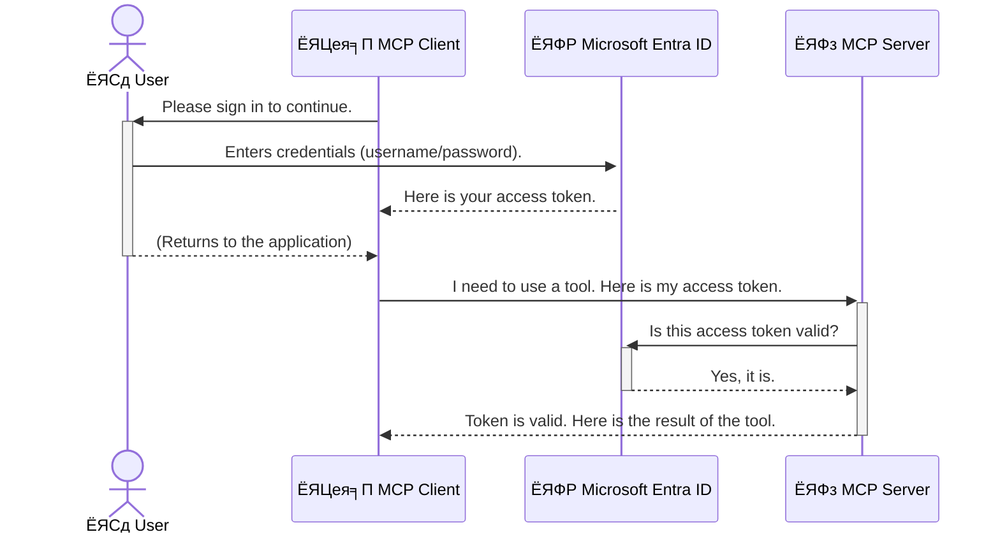

<!--
CO_OP_TRANSLATOR_METADATA:
{
  "original_hash": "0abf26a6c4dbe905d5d49ccdc0ccfe92",
  "translation_date": "2025-06-26T16:25:07+00:00",
  "source_file": "05-AdvancedTopics/mcp-security-entra/README.md",
  "language_code": "ne"
}
-->
# AI कार्यप्रवाहहरू सुरक्षित गर्ने: मोडेल कन्टेक्स्ट प्रोटोकल सर्भरहरूका लागि Entra ID प्रमाणीकरण

## परिचय  
तपाईंको मोडेल कन्टेक्स्ट प्रोटोकल (MCP) सर्भरलाई सुरक्षित गर्नु घरको मुख्य ढोका लक गर्ने जत्तिकै महत्त्वपूर्ण छ। तपाईंको MCP सर्भर खुला छ भने तपाईंका उपकरण र डाटा अनधिकृत पहुँचका लागि खुल्ला हुन्छन्, जसले सुरक्षा उल्लङ्घन निम्त्याउन सक्छ। Microsoft Entra ID एक बलियो क्लाउड-आधारित पहिचान र पहुँच व्यवस्थापन समाधान हो, जसले सुनिश्चित गर्छ कि केवल अधिकृत प्रयोगकर्ता र एप्लिकेसनहरूले मात्र तपाईंको MCP सर्भरसँग अन्तरक्रिया गर्न सकून्। यस खण्डमा, तपाईंले Entra ID प्रमाणीकरण प्रयोग गरेर आफ्नो AI कार्यप्रवाहहरू कसरी सुरक्षित गर्ने भनेर सिक्नुहुनेछ।

## सिकाइ उद्देश्यहरू  
यस खण्डको अन्त्यसम्म तपाईं सक्षम हुनुहुनेछ:

- MCP सर्भरहरू सुरक्षित गर्ने महत्त्व बुझ्न।
- Microsoft Entra ID र OAuth 2.0 प्रमाणीकरणका आधारभूत कुराहरू व्याख्या गर्न।
- सार्वजनिक र गोप्य क्लाइन्टबीचको भिन्नता चिन्ह लगाउन।
- स्थानीय (सार्वजनिक क्लाइन्ट) र रिमोट (गोप्य क्लाइन्ट) MCP सर्भर परिदृश्यहरूमा Entra ID प्रमाणीकरण लागू गर्न।
- AI कार्यप्रवाह विकास गर्दा सुरक्षा सर्वोत्तम अभ्यासहरू लागू गर्न।

## सुरक्षा र MCP

जसरी तपाईं आफ्नो घरको मुख्य ढोका नखोली छोड्नु हुन्न, त्यस्तै तपाईंले आफ्नो MCP सर्भर पनि सबैका लागि खुला छोड्नु हुँदैन। तपाईंको AI कार्यप्रवाहहरू सुरक्षित गर्नु बलियो, विश्वसनीय र सुरक्षित एप्लिकेसनहरू निर्माण गर्न आवश्यक छ। यो अध्यायले तपाईंलाई Microsoft Entra ID प्रयोग गरी तपाईंका MCP सर्भरहरू कसरी सुरक्षित गर्ने भन्ने परिचय गराउनेछ, जसले सुनिश्चित गर्छ कि केवल अधिकृत प्रयोगकर्ता र एप्लिकेसनहरूले तपाईंका उपकरण र डाटासँग अन्तरक्रिया गर्न सकून्।

## MCP सर्भरहरूको लागि सुरक्षा किन महत्त्वपूर्ण छ

कल्पना गर्नुहोस् कि तपाईंको MCP सर्भरमा एउटा उपकरण छ जसले इमेल पठाउन वा ग्राहक डाटाबेस पहुँच गर्न सक्छ। यदि सर्भर असुरक्षित छ भने, कुनै पनि व्यक्तिले त्यो उपकरण प्रयोग गर्न सक्नेछ, जसले अनधिकृत डाटा पहुँच, स्प्याम, वा अन्य दुर्भावनापूर्ण क्रियाकलापहरू निम्त्याउन सक्छ।

प्रमाणीकरण लागू गरेर, तपाईं सुनिश्चित गर्नुहुन्छ कि प्रत्येक अनुरोध प्रमाणित हुन्छ, जसले अनुरोध गर्ने प्रयोगकर्ता वा एप्लिकेसनको पहिचान पुष्टि गर्छ। यो तपाईंको AI कार्यप्रवाहहरू सुरक्षित गर्ने पहिलो र सबैभन्दा महत्वपूर्ण कदम हो।

## Microsoft Entra ID परिचय

[**Microsoft Entra ID**](https://adoption.microsoft.com/microsoft-security/entra/) एक क्लाउड-आधारित पहिचान र पहुँच व्यवस्थापन सेवा हो। यसलाई तपाईंका एप्लिकेसनहरूको लागि एक सार्वभौम सुरक्षा गार्डको रूपमा सोच्न सकिन्छ। यो प्रयोगकर्ता पहिचानहरू (प्रमाणीकरण) प्रमाणित गर्ने र उनीहरूलाई के गर्ने अनुमति छ (प्राधिकरण) निर्धारण गर्ने जटिल प्रक्रियालाई व्यवस्थापन गर्छ।

Entra ID प्रयोग गरेर तपाईंले गर्न सक्नुहुन्छ:

- प्रयोगकर्ताहरूको लागि सुरक्षित साइन-इन सक्षम पार्न।
- API र सेवाहरूलाई सुरक्षा गर्न।
- केन्द्रिय स्थानबाट पहुँच नीतिहरू व्यवस्थापन गर्न।

MCP सर्भरहरूका लागि, Entra ID एक बलियो र विश्वसनीय समाधान हो जसले कसले तपाईंको सर्भरको क्षमता प्रयोग गर्न सक्छ भनेर व्यवस्थापन गर्छ।

---

## जादू बुझ्न: Entra ID प्रमाणीकरण कसरी काम गर्छ

Entra ID प्रमाणीकरणका लागि **OAuth 2.0** जस्ता खुला मानकहरू प्रयोग गर्छ। विवरणहरू जटिल हुन सक्छन्, तर मूल अवधारणा सरल छ र एउटा उपमा मार्फत बुझ्न सकिन्छ।

### OAuth 2.0 को सरल परिचय: भ्यालेट कुञ्जी

OAuth 2.0 लाई तपाईंको कारको लागि भ्यालेट सेवा जस्तै सोच्नुहोस्। जब तपाईं रेस्टुरेन्टमा जानुहुन्छ, तपाईंले भ्यालेटलाई आफ्नो मुख्य कुञ्जी दिनु हुन्न। बरु, तपाईंले **भ्यालेट कुञ्जी** दिनुहुन्छ जसमा सीमित अनुमति हुन्छ—यसले कार सुरु गर्न र ढोका लक गर्न सक्छ, तर ट्रंक वा ग्लोभ कम्पार्टमेन्ट खोल्न सक्दैन।

यस उपमामा:

- **तपाईं** हुनुहुन्छ **प्रयोगकर्ता**।
- **तपाईंको कार** हो **MCP सर्भर** जसमा मूल्यवान उपकरण र डाटा छ।
- **भ्यालेट** हो **Microsoft Entra ID**।
- **पार्किङ कर्मचारी** हो **MCP क्लाइन्ट** (सर्भर पहुँच गर्न खोज्ने एप्लिकेसन)।
- **भ्यालेट कुञ्जी** हो **एक्सेस टोकन**।

एक्सेस टोकन एक सुरक्षित स्ट्रिङ हो जुन MCP क्लाइन्टले Entra ID बाट साइन-इन गरेपछि प्राप्त गर्छ। क्लाइन्टले यो टोकन प्रत्येक अनुरोधमा MCP सर्भरलाई प्रस्तुत गर्छ। सर्भरले टोकन प्रमाणित गरेर अनुरोध वैध छ र क्लाइन्टसँग आवश्यक अनुमति छ भनी सुनिश्चित गर्छ, तपाईंको वास्तविक प्रमाणपत्रहरू (जस्तै पासवर्ड) कहिल्यै प्रयोग नगरी।

### प्रमाणीकरण प्रवाह

प्रक्रिया यसरी काम गर्छ:



### Microsoft Authentication Library (MSAL) परिचय

कोडमा जानुअघि, एउटा मुख्य कम्पोनेन्ट परिचय गराउन जरुरी छ: **Microsoft Authentication Library (MSAL)**।

MSAL माइक्रोसफ्टद्वारा विकास गरिएको पुस्तकालय हो जसले विकासकर्ताहरूलाई प्रमाणीकरण व्यवस्थापन गर्न सजिलो बनाउँछ। तपाईंले सुरक्षा टोकनहरू, साइन-इनहरू, र सेसन रिफ्रेश जस्ता जटिल कोड लेख्नु नपर्ने गरी MSAL ले सबै भार वहन गर्छ।

MSAL प्रयोग गर्न सिफारिस गरिन्छ किनभने:

- **यो सुरक्षित छ:** यसले उद्योग-मानक प्रोटोकल र सुरक्षा सर्वोत्तम अभ्यासहरू लागू गर्छ, जसले तपाईंको कोडमा कमजोरीको जोखिम घटाउँछ।
- **विकास सजिलो बनाउँछ:** OAuth 2.0 र OpenID Connect प्रोटोकलको जटिलता लुकाएर तपाईंको एप्लिकेसनमा मात्र केही कोडले बलियो प्रमाणीकरण थप्न अनुमति दिन्छ।
- **यसलाई नियमित अपडेट गरिन्छ:** माइक्रोसफ्टले नयाँ सुरक्षा खतराहरू र प्लेटफर्म परिवर्तनहरूलाई सम्बोधन गर्न MSAL लाई सक्रिय रूपमा अपडेट गर्छ।

MSAL ले .NET, JavaScript/TypeScript, Python, Java, Go, र मोबाइल प्लेटफर्महरू (iOS, Android) जस्ता धेरै भाषाहरू र फ्रेमवर्कहरू समर्थन गर्छ। यसले तपाईंलाई सम्पूर्ण प्रविधि स्ट्याकमा समान प्रमाणीकरण ढाँचा प्रयोग गर्न अनुमति दिन्छ।

MSAL को बारेमा थप जान्न, आधिकारिक [MSAL अवलोकन कागजात](https://learn.microsoft.com/entra/identity-platform/msal-overview) हेर्न सक्नुहुन्छ।

---

## Entra ID सँग तपाईंको MCP सर्भर सुरक्षित गर्ने: चरण-द्वारा-चरण मार्गदर्शन

अब, स्थानीय MCP सर्भर कसरी सुरक्षित गर्ने भनेर हिँडौं (जसले `stdio`) using Entra ID. This example uses a **public client**, which is suitable for applications running on a user's machine, like a desktop app or a local development server.

### Scenario 1: Securing a Local MCP Server (with a Public Client)

In this scenario, we'll look at an MCP server that runs locally, communicates over `stdio`, and uses Entra ID to authenticate the user before allowing access to its tools. The server will have a single tool that fetches the user's profile information from the Microsoft Graph API.

#### 1. Setting Up the Application in Entra ID

Before writing any code, you need to register your application in Microsoft Entra ID. This tells Entra ID about your application and grants it permission to use the authentication service.

1. Navigate to the **[Microsoft Entra portal](https://entra.microsoft.com/)**.
2. Go to **App registrations** and click **New registration**.
3. Give your application a name (e.g., "My Local MCP Server").
4. For **Supported account types**, select **Accounts in this organizational directory only**.
5. You can leave the **Redirect URI** blank for this example.
6. Click **Register**.

Once registered, take note of the **Application (client) ID** and **Directory (tenant) ID**. You'll need these in your code.

#### 2. The Code: A Breakdown

Let's look at the key parts of the code that handle authentication. The full code for this example is available in the [Entra ID - Local - WAM](https://github.com/Azure-Samples/mcp-auth-servers/tree/main/src/entra-id-local-wam) folder of the [mcp-auth-servers GitHub repository](https://github.com/Azure-Samples/mcp-auth-servers).

**`AuthenticationService.cs`**

This class is responsible for handling the interaction with Entra ID.

- **`CreateAsync`**: This method initializes the `PublicClientApplication` from the MSAL (Microsoft Authentication Library). It's configured with your application's `clientId` and `tenantId`.
- **`WithBroker`**: This enables the use of a broker (like the Windows Web Account Manager), which provides a more secure and seamless single sign-on experience.
- **`AcquireTokenAsync`** प्रयोग गर्छ): यो मुख्य विधि हो। यसले पहिले शान्तिपूर्वक टोकन प्राप्त गर्ने प्रयास गर्छ (अर्थात् प्रयोगकर्ताले पहिले नै मान्य सेसन छ भने पुनः साइन-इन गर्नु पर्दैन)। यदि शान्त टोकन प्राप्त गर्न सकिन्न भने, यसले प्रयोगकर्तालाई अन्तरक्रियात्मक रूपमा साइन-इन गर्न आग्रह गर्छ।

```csharp
// Simplified for clarity
public static async Task<AuthenticationService> CreateAsync(ILogger<AuthenticationService> logger)
{
    var msalClient = PublicClientApplicationBuilder
        .Create(_clientId) // Your Application (client) ID
        .WithAuthority(AadAuthorityAudience.AzureAdMyOrg)
        .WithTenantId(_tenantId) // Your Directory (tenant) ID
        .WithBroker(new BrokerOptions(BrokerOptions.OperatingSystems.Windows))
        .Build();

    // ... cache registration ...

    return new AuthenticationService(logger, msalClient);
}

public async Task<string> AcquireTokenAsync()
{
    try
    {
        // Try silent authentication first
        var accounts = await _msalClient.GetAccountsAsync();
        var account = accounts.FirstOrDefault();

        AuthenticationResult? result = null;

        if (account != null)
        {
            result = await _msalClient.AcquireTokenSilent(_scopes, account).ExecuteAsync();
        }
        else
        {
            // If no account, or silent fails, go interactive
            result = await _msalClient.AcquireTokenInteractive(_scopes).ExecuteAsync();
        }

        return result.AccessToken;
    }
    catch (Exception ex)
    {
        _logger.LogError(ex, "An error occurred while acquiring the token.");
        throw; // Optionally rethrow the exception for higher-level handling
    }
}
```

**`Program.cs`**

This is where the MCP server is set up and the authentication service is integrated.

- **`AddSingleton<AuthenticationService>`**: This registers the `AuthenticationService` with the dependency injection container, so it can be used by other parts of the application (like our tool).
- **`GetUserDetailsFromGraph` tool**: This tool requires an instance of `AuthenticationService`. Before it does anything, it calls `authService.AcquireTokenAsync()`** प्रयोग गरेर मान्य एक्सेस टोकन प्राप्त गर्छ। यदि प्रमाणीकरण सफल भयो भने, यो टोकन प्रयोग गरेर Microsoft Graph API कल गरी प्रयोगकर्ताको विवरण ल्याउँछ।

```csharp
// Simplified for clarity
[McpServerTool(Name = "GetUserDetailsFromGraph")]
public static async Task<string> GetUserDetailsFromGraph(
    AuthenticationService authService)
{
    try
    {
        // This will trigger the authentication flow
        var accessToken = await authService.AcquireTokenAsync();

        // Use the token to create a GraphServiceClient
        var graphClient = new GraphServiceClient(
            new BaseBearerTokenAuthenticationProvider(new TokenProvider(authService)));

        var user = await graphClient.Me.GetAsync();

        return System.Text.Json.JsonSerializer.Serialize(user);
    }
    catch (Exception ex)
    {
        return $"Error: {ex.Message}";
    }
}
```

#### ३. सबै कुरा कसरी सँगै काम गर्छ

1. जब MCP क्लाइन्ट `GetUserDetailsFromGraph` tool, the tool first calls `AcquireTokenAsync`.
2. `AcquireTokenAsync` triggers the MSAL library to check for a valid token.
3. If no token is found, MSAL, through the broker, will prompt the user to sign in with their Entra ID account.
4. Once the user signs in, Entra ID issues an access token.
5. The tool receives the token and uses it to make a secure call to the Microsoft Graph API.
6. The user's details are returned to the MCP client.

This process ensures that only authenticated users can use the tool, effectively securing your local MCP server.

### Scenario 2: Securing a Remote MCP Server (with a Confidential Client)

When your MCP server is running on a remote machine (like a cloud server) and communicates over a protocol like HTTP Streaming, the security requirements are different. In this case, you should use a **confidential client** and the **Authorization Code Flow**. This is a more secure method because the application's secrets are never exposed to the browser.

This example uses a TypeScript-based MCP server that uses Express.js to handle HTTP requests.

#### 1. Setting Up the Application in Entra ID

The setup in Entra ID is similar to the public client, but with one key difference: you need to create a **client secret**.

1. Navigate to the **[Microsoft Entra portal](https://entra.microsoft.com/)**.
2. In your app registration, go to the **Certificates & secrets** tab.
3. Click **New client secret**, give it a description, and click **Add**.
4. **Important:** Copy the secret value immediately. You will not be able to see it again.
5. You also need to configure a **Redirect URI**. Go to the **Authentication** tab, click **Add a platform**, select **Web**, and enter the redirect URI for your application (e.g., `http://localhost:3001/auth/callback`).

> **⚠️ Important Security Note:** For production applications, Microsoft strongly recommends using **secretless authentication** methods such as **Managed Identity** or **Workload Identity Federation** instead of client secrets. Client secrets pose security risks as they can be exposed or compromised. Managed identities provide a more secure approach by eliminating the need to store credentials in your code or configuration.
>
> For more information about managed identities and how to implement them, see the [Managed identities for Azure resources overview](https://learn.microsoft.com/entra/identity/managed-identities-azure-resources/overview).

#### 2. The Code: A Breakdown

This example uses a session-based approach. When the user authenticates, the server stores the access token and refresh token in a session and gives the user a session token. This session token is then used for subsequent requests. The full code for this example is available in the [Entra ID - Confidential client](https://github.com/Azure-Samples/mcp-auth-servers/tree/main/src/entra-id-cca-session) folder of the [mcp-auth-servers GitHub repository](https://github.com/Azure-Samples/mcp-auth-servers).

**`Server.ts`**

This file sets up the Express server and the MCP transport layer.

- **`requireBearerAuth`**: This is middleware that protects the `/sse` and `/message` endpoints. It checks for a valid bearer token in the `Authorization` header of the request.
- **`EntraIdServerAuthProvider`**: This is a custom class that implements the `McpServerAuthorizationProvider` interface. It's responsible for handling the OAuth 2.0 flow.
- **`/auth/callback`** कल गर्छ: यो एन्डपोइन्टले प्रयोगकर्ताले प्रमाणीकरण गरेपछि Entra ID बाट रिडिरेक्ट ह्यान्डल गर्छ। यसले प्राधिकरण कोडलाई एक्सेस टोकन र रिफ्रेश टोकनमा परिवर्तन गर्छ।

```typescript
// Simplified for clarity
const app = express();
const { server } = createServer();
const provider = new EntraIdServerAuthProvider();

// Protect the SSE endpoint
app.get("/sse", requireBearerAuth({
  provider,
  requiredScopes: ["User.Read"]
}), async (req, res) => {
  // ... connect to the transport ...
});

// Protect the message endpoint
app.post("/message", requireBearerAuth({
  provider,
  requiredScopes: ["User.Read"]
}), async (req, res) => {
  // ... handle the message ...
});

// Handle the OAuth 2.0 callback
app.get("/auth/callback", (req, res) => {
  provider.handleCallback(req.query.code, req.query.state)
    .then(result => {
      // ... handle success or failure ...
    });
});
```

**`Tools.ts`**

This file defines the tools that the MCP server provides. The `getUserDetails`** उपकरण पहिलेको उदाहरण जस्तै छ, तर यसले सेसनबाट एक्सेस टोकन प्राप्त गर्छ।

```typescript
// Simplified for clarity
server.setRequestHandler(CallToolRequestSchema, async (request) => {
  const { name } = request.params;
  const context = request.params?.context as { token?: string } | undefined;
  const sessionToken = context?.token;

  if (name === ToolName.GET_USER_DETAILS) {
    if (!sessionToken) {
      throw new AuthenticationError("Authentication token is missing or invalid. Ensure the token is provided in the request context.");
    }

    // Get the Entra ID token from the session store
    const tokenData = tokenStore.getToken(sessionToken);
    const entraIdToken = tokenData.accessToken;

    const graphClient = Client.init({
      authProvider: (done) => {
        done(null, entraIdToken);
      }
    });

    const user = await graphClient.api('/me').get();

    // ... return user details ...
  }
});
```

**`auth/EntraIdServerAuthProvider.ts`**

This class handles the logic for:

- Redirecting the user to the Entra ID sign-in page.
- Exchanging the authorization code for an access token.
- Storing the tokens in the `tokenStore`.
- Refreshing the access token when it expires.

#### 3. How It All Works Together

1. When a user first tries to connect to the MCP server, the `requireBearerAuth` middleware will see that they don't have a valid session and will redirect them to the Entra ID sign-in page.
2. The user signs in with their Entra ID account.
3. Entra ID redirects the user back to the `/auth/callback` endpoint with an authorization code.
4. The server exchanges the code for an access token and a refresh token, stores them, and creates a session token which is sent to the client.
5. The client can now use this session token in the `Authorization` header for all future requests to the MCP server.
6. When the `getUserDetails`** उपकरण कल हुँदा, यसले सेसन टोकन प्रयोग गरी Entra ID एक्सेस टोकन खोज्छ र त्यसपछि Microsoft Graph API कल गर्छ।

यो प्रवाह सार्वजनिक क्लाइन्ट प्रवाहभन्दा जटिल छ, तर इन्टरनेट-आधारित एन्डपोइन्टहरूका लागि आवश्यक छ। किनभने रिमोट MCP सर्भरहरू सार्वजनिक इन्टरनेटमा पहुँचयोग्य हुन्छन्, तिनीहरूलाई अनधिकृत पहुँच र सम्भावित आक्रमणबाट सुरक्षा गर्न कडा सुरक्षा उपायहरू चाहिन्छ।

## सुरक्षा सर्वोत्तम अभ्यासहरू

- **सधैं HTTPS प्रयोग गर्नुहोस्**: क्लाइन्ट र सर्भरबीचको सञ्चार इन्क्रिप्ट गरेर टोकनहरू चोरी हुनबाट बचाउनुहोस्।
- **भूमिका-आधारित पहुँच नियन्त्रण (RBAC) लागू गर्नुहोस्**: केवल प्रयोगकर्ता प्रमाणित छ कि छैन भनेर मात्र जाँच नगर्नुहोस्; उनीहरूले के गर्न अनुमति छ भनेर पनि जाँच गर्नुहोस्। तपाईं Entra ID मा भूमिकाहरू परिभाषित गर्न सक्नुहुन्छ र तपाईंको MCP सर्भरमा तिनीहरूको जाँच गर्न सक्नुहुन्छ।
- **निगरानी र अडिट गर्नुहोस्**: सबै प्रमाणीकरण घटनाहरू लग गर्नुहोस् ताकि शङ्कास्पद गतिविधि पत्ता लगाउन र प्रतिक्रिया दिन सकियोस्।
- **दर सीमितीकरण र थ्रोटलिंग व्यवस्थापन गर्नुहोस्**: Microsoft Graph र अन्य API हरूले दुरुपयोग रोक्न दर सीमितीकरण लागू गर्छन्। तपाईंको MCP सर्भरमा HTTP 429 (धेरै अनुरोध) प्रतिक्रिया प्राप्त हुँदा एक्स्पोनेन्सियल ब्याकअफ र पुनः प्रयास तर्क लागू गर्नुहोस्। प्रायः पहुँच गरिने डाटा क्यासिङ गरेर API कलहरू घटाउन विचार गर्नुहोस्।
- **टोकन सुरक्षित भण्डारण**: एक्सेस रिफ्रेश टोकनहरू सुरक्षित रूपमा भण्डारण गर्नुहोस्। स्थानीय एप्लिकेसनहरूका लागि प्रणालीको सुरक्षित भण्डारण प्रयोग गर्नुहोस्। सर्भर एप्लिकेसनहरूका लागि एन्क्रिप्टेड भण्डारण वा Azure Key Vault जस्ता सुरक्षित कुञ्जी व्यवस्थापन सेवा प्रयोग गर्ने विचार गर्नुहोस्।
- **टोकन म्याद समाप्ति व्यवस्थापन**: एक्सेस टोकनहरूको सीमित अवधि हुन्छ। रिफ्रेश टोकन प्रयोग गरी स्वचालित रूपमा टोकन रिफ्रेश लागू गर्नुहोस् ताकि प्रयोगकर्तालाई पुनः प्रमाणीकरण आवश्यक नपरोस्।
- **Azure API Management प्रयोग गर्ने विचार गर्नुहोस्**: तपाईंको MCP सर्भरमा प्रत्यक्ष सुरक्षा लागू गर्दा तपाईंलाई विस्तृत नियन्त्रण मिल्छ, तर API गेटवेहरू जस्तै Azure API Management ले प्रमाणीकरण, प्राधिकरण, दर सीमितीकरण र निगरानी स्वतः व्यवस्थापन गर्न सक्छन्। यीले तपाईंका क्लाइन्ट र MCP सर्भरबीच केन्द्रिय सुरक्षा तह प्रदान गर्छन्। MCP सँग API गेटवेहरू प्रयोग गर्ने बारे थप जानकारीका लागि हाम्रो [Azure API Management Your Auth Gateway For MCP Servers](https://techcommunity.microsoft.com/blog/integrationsonazureblog/azure-api-management-your-auth-gateway-for-mcp-servers/4402690) हेर्नुहोस्।

## मुख्य बुँदाहरू

- तपाईंको MCP सर्भर सुरक्षित गर्नु तपाईंका डाटा र उपकरणहरू सुरक्षा गर्न अत्यावश्यक छ।
- Microsoft Entra ID प्रमाणीकरण र प्राधिकरणका लागि बलियो र मापनयोग्य समाधान हो।
- स्थानीय एप्लिकेसनहरूका लागि **सार्वजनिक क्लाइन्ट** र रिमोट सर्भरहरूका लागि **गोप्य क्लाइन्ट** प्रयोग गर्नुहोस्।
- वेब एप्लिकेसनहरूका लागि **Authorization Code Flow** सबैभन्दा सुरक्षित विकल्प हो।

## अभ्यास

1. तपाईंले निर्माण गर्न सक्ने कुनै MCP सर्भरको बारेमा सोच्नुहोस्। त्यो स्थानीय सर्भर हो कि रिमोट सर्भर?
2. तपाईंको जवाफको आधारमा, सार्वजनिक क्लाइन्ट प्रयोग गर्नुहुन्छ कि गोप्य क्लाइन्ट?
3. Microsoft Graph विरुद्ध कार्यहरू गर्न तपाईंको MCP सर्भरले कुन अनुमति माग्नेछ?

## हात-हात अभ्यासहरू

### अभ्यास १: Entra ID मा एप्लिकेसन दर्ता गर्नुहोस्  
Microsoft Entra पोर्टलमा जानुहोस्।  
तपाईंको MCP सर्भरका लागि नयाँ एप्लिकेसन दर्ता गर्नुहोस्।  
एप्लिकेसन (क्लाइन्ट) ID र डाइरेक्टरी (टेनेन्ट) ID नोट गर्नुहोस्।

### अभ्यास २: स्थानीय MCP सर्भर सुरक्षित गर्नुहोस् (सार्वजनिक क्लाइन्ट)  
- प्रयोगकर्ता प्रमाणीकरणका लागि MSAL (Microsoft Authentication Library) एकीकरण गर्न कोड उदाहरण अनुसरण गर्नुहोस्।  
- Microsoft Graph बाट प्रयोगकर्ता विवरण ल्याउने MCP उपकरण कल गरेर प्रमाणीकरण प्रवाह परीक्षण गर्नुहोस्।

### अभ्यास ३: रिमोट MCP सर्भर सुरक्षित गर्नुहोस् (गोप्य क्लाइन्ट)  
- Entra ID मा गोप्य क्लाइन्ट दर्ता गर्नुहोस् र क्लाइन्ट सिक्रेट सिर्जना गर्नुहोस्।  
- तपाईंको Express.js MCP सर्भरमा Authorization Code Flow कन्फिगर गर्नुहोस्।  
- सुरक्षित एन्डपोइन्टहरू परीक्षण गर्नुहोस् र टोकन-आधारित पहुँच पुष्टि गर्नुहोस्।

### अभ्यास ४: सुरक्षा सर्वोत्तम अभ्यासहरू लागू गर्नुहोस्  
- तपाईंको स्थानीय वा रिमोट सर्भरका लागि HTTPS सक्षम गर्नुहोस्।  
- सर्भरको तर्कमा भूमिका-आधारित पहुँच नियन्त्रण (RBAC) लागू गर्नुहोस्।  
- टोकन म्याद समाप्ति व्यवस्थापन र सुरक्षित टोकन भण्डारण थप्नुहोस्।

## स्रोतहरू

1. **MSAL अवलोकन कागजात**  
   Microsoft Authentication Library (MSAL) कसरी विभिन्न प्लेटफर्महरूमा सुरक्षित टोकन प्राप्ति सक्षम पार्छ जान्न:  
   [MSAL Overview on Microsoft Learn](https://learn.microsoft.com/en-gb/entra/msal/overview)

2. **Azure-Samples/mcp-auth-servers GitHub रिपोजिटरी**  
   प्रमाणीकरण प्रवाहहरू प्रदर्शन गर्ने MCP सर्भरहरूको सन्दर्भ कार्यान्वयनहरू:  
   [Azure-Samples/mcp-auth-servers on GitHub](https://github.com/Azure-Samples/mcp-auth-servers)

3. **Azure स्रोतहरूको लागि प्रबन्धित पहिचानहरूको अवलोकन**  
   प्रणाली वा प्रयोगकर्ता-आधारित प्रबन्धित पहिचानहरू प्रयोग गरी सिक्रेटहरू कसरी हटाउने बुझ्न:  
   [Managed Identities Overview on Microsoft Learn](https://learn.microsoft.com/en-us/entra/identity/managed-identities-azure-resources/)

4. **Azure API Management: MCP सर्भरहरूको लागि तपाईंको प्रमाणीकरण गेटवे**  
   MCP सर्भरहरूको लागि सुरक्षित OAuth2 गेटवेको रूपमा APIM प्रयोगमा गहिरो अध्ययन:  
   [Azure API Management Your Auth Gateway For MCP Servers](https://techcommunity.microsoft.com/blog/integrationsonazureblog/azure-api-management-your-auth-gateway-for-mcp-servers/4402690)

5. **Microsoft Graph अनुमति सन्दर्भ**  
   Microsoft Graph का लागि प्रतिनिधित्व गरिएको र एप्लिकेसन अनुमति सूची:  
   [Microsoft Graph Permissions Reference](https://learn.microsoft.com/zh-tw/graph/permissions-reference)

## सिकाइ नतिजाहरू  
यस खण्ड पूरा गरेपछि, तपाईं सक्षम हुनुहुनेछ:

- MCP सर्भरहरू र AI कार्यप्रवाहहरूको लागि प्रमाणीकरण किन महत्वपूर्ण छ स्पष्ट रूपमा बताउन।  
- स्थानीय र रिमोट MCP सर्भर परिदृश्यहरूका लागि Entra ID प्रमाणीकरण सेटअप र कन्फिगर गर्न।  
- तपाईंको सर्भरको परिनियोजन आधारमा उपयुक्त क्लाइन्ट प्रकार (सार्वजनिक वा गोप्य) चयन गर्न।  
- टोकन भण्डारण र भूमिका-आधारित प्राधिकरण सहित सुरक्षित कोडिङ अभ्यासहरू लागू गर्न।  
- आफ्नो MCP सर्भर र उपकरणहरूलाई अनधिकृत पहुँचबाट विश्वस्तरूपमा सुरक्षित गर्न।

## अर्को के छ

- [6. समुदाय योगदानहरू](../../06-CommunityContributions/README.md)

**अस्वीकरण**:  
यो दस्तावेज AI अनुवाद सेवा [Co-op Translator](https://github.com/Azure/co-op-translator) प्रयोग गरी अनुवाद गरिएको हो। हामी शुद्धताको प्रयास गर्छौं भने पनि, कृपया ध्यान दिनुहोस् कि स्वचालित अनुवादमा त्रुटि वा अशुद्धि हुन सक्दछ। मूल दस्तावेज यसको मूल भाषामा नै अधिकारिक स्रोत मानिनुपर्छ। महत्वपूर्ण जानकारीका लागि व्यावसायिक मानव अनुवाद सिफारिस गरिन्छ। यस अनुवादको प्रयोगबाट उत्पन्न हुने कुनै पनि गलतफहमी वा गलत व्याख्याका लागि हामी जिम्मेवार छैनौं।