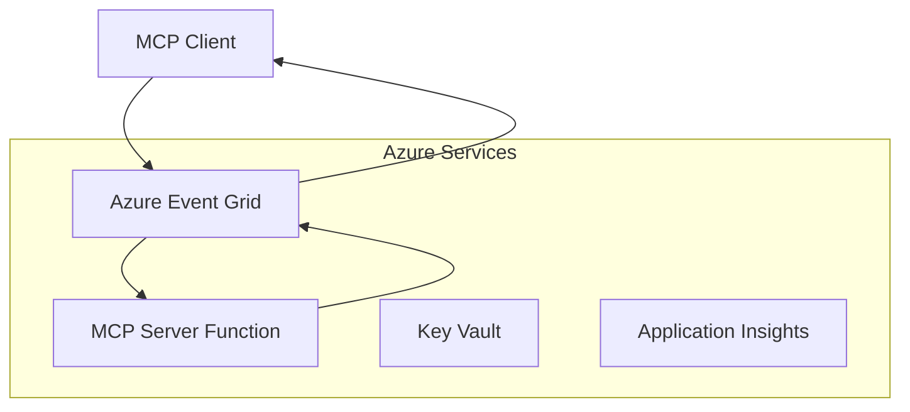
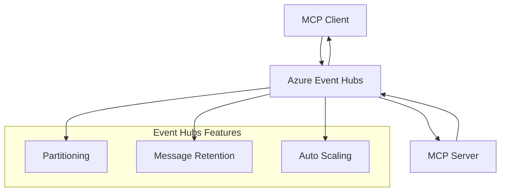

<!--
CO_OP_TRANSLATOR_METADATA:
{
  "original_hash": "c71c60af76120a517809a6cfba47e9a3",
  "translation_date": "2025-09-15T21:32:23+00:00",
  "source_file": "05-AdvancedTopics/mcp-transport/README.md",
  "language_code": "ne"
}
-->
# MCP कस्टम ट्रान्सपोर्ट्स - उन्नत कार्यान्वयन मार्गदर्शिका

मोडेल कन्टेक्स्ट प्रोटोकल (MCP) ले ट्रान्सपोर्ट मेकानिज्ममा लचिलोपन प्रदान गर्दछ, जसले विशेष उद्यम वातावरणहरूको लागि कस्टम कार्यान्वयनलाई अनुमति दिन्छ। यो उन्नत मार्गदर्शिकाले Azure Event Grid र Azure Event Hubs प्रयोग गरेर कस्टम ट्रान्सपोर्ट कार्यान्वयनको अन्वेषण गर्दछ, जसले स्केलेबल, क्लाउड-नेटिभ MCP समाधान निर्माण गर्न सहयोग पुर्‍याउँछ।

## परिचय

MCP का मानक ट्रान्सपोर्टहरू (stdio र HTTP स्ट्रिमिङ) अधिकांश प्रयोगका लागि उपयुक्त भए पनि, उद्यम वातावरणहरूले प्रायः सुधारिएको स्केलेबिलिटी, विश्वसनीयता, र विद्यमान क्लाउड पूर्वाधारसँग एकीकरणका लागि विशेष ट्रान्सपोर्ट मेकानिज्मको आवश्यकता पर्दछ। कस्टम ट्रान्सपोर्टहरूले MCP लाई क्लाउड-नेटिभ मेसेजिङ सेवाहरू प्रयोग गर्न सक्षम बनाउँछ, जसले असिंक्रोनस सञ्चार, इभेन्ट-ड्राइभन आर्किटेक्चर, र वितरित प्रशोधनलाई समर्थन गर्दछ।

यो पाठले नवीनतम MCP स्पेसिफिकेसन (2025-06-18), Azure मेसेजिङ सेवाहरू, र स्थापित उद्यम एकीकरण ढाँचाहरूमा आधारित उन्नत ट्रान्सपोर्ट कार्यान्वयनहरूको अन्वेषण गर्दछ।

### **MCP ट्रान्सपोर्ट आर्किटेक्चर**

**MCP स्पेसिफिकेसन (2025-06-18) बाट:**

- **मानक ट्रान्सपोर्टहरू**: stdio (सिफारिस गरिएको), HTTP स्ट्रिमिङ (दूरस्थ परिदृश्यहरूको लागि)
- **कस्टम ट्रान्सपोर्टहरू**: कुनै पनि ट्रान्सपोर्ट जसले MCP मेसेज एक्सचेन्ज प्रोटोकल कार्यान्वयन गर्दछ
- **मेसेज ढाँचा**: JSON-RPC 2.0 MCP-विशेष विस्तारहरूसँग
- **द्विदिश सञ्चार**: सूचना र प्रतिक्रियाको लागि पूर्ण डुप्लेक्स सञ्चार आवश्यक

## सिकाइ उद्देश्यहरू

यो उन्नत पाठको अन्त्यसम्म, तपाईं सक्षम हुनुहुनेछ:

- **कस्टम ट्रान्सपोर्ट आवश्यकताहरू बुझ्नुहोस्**: कुनै पनि ट्रान्सपोर्ट लेयरमा MCP प्रोटोकल कार्यान्वयन गर्नुहोस् र अनुपालन कायम राख्नुहोस्
- **Azure Event Grid ट्रान्सपोर्ट निर्माण गर्नुहोस्**: Azure Event Grid प्रयोग गरेर इभेन्ट-ड्राइभन MCP सर्भरहरू सिर्जना गर्नुहोस्
- **Azure Event Hubs ट्रान्सपोर्ट कार्यान्वयन गर्नुहोस्**: Azure Event Hubs प्रयोग गरेर उच्च-थ्रुपुट MCP समाधानहरू डिजाइन गर्नुहोस्
- **उद्यम ढाँचाहरू लागू गर्नुहोस्**: कस्टम ट्रान्सपोर्टहरू विद्यमान Azure पूर्वाधार र सुरक्षा मोडेलहरूसँग एकीकृत गर्नुहोस्
- **ट्रान्सपोर्ट विश्वसनीयता व्यवस्थापन गर्नुहोस्**: उद्यम परिदृश्यहरूको लागि मेसेज स्थायित्व, क्रमबद्धता, र त्रुटि व्यवस्थापन कार्यान्वयन गर्नुहोस्
- **प्रदर्शन अनुकूलन गर्नुहोस्**: स्केल, विलम्बता, र थ्रुपुट आवश्यकताहरूको लागि ट्रान्सपोर्ट समाधानहरू डिजाइन गर्नुहोस्

## **ट्रान्सपोर्ट आवश्यकताहरू**

### **MCP स्पेसिफिकेसन (2025-06-18) बाट कोर आवश्यकताहरू:**

```yaml
Message Protocol:
  format: "JSON-RPC 2.0 with MCP extensions"
  bidirectional: "Full duplex communication required"
  ordering: "Message ordering must be preserved per session"
  
Transport Layer:
  reliability: "Transport MUST handle connection failures gracefully"
  security: "Transport MUST support secure communication"
  identification: "Each session MUST have unique identifier"
  
Custom Transport:
  compliance: "MUST implement complete MCP message exchange"
  extensibility: "MAY add transport-specific features"
  interoperability: "MUST maintain protocol compatibility"
```

## **Azure Event Grid ट्रान्सपोर्ट कार्यान्वयन**

Azure Event Grid एक सर्भरलेस इभेन्ट राउटिङ सेवा प्रदान गर्दछ, जुन इभेन्ट-ड्राइभन MCP आर्किटेक्चरहरूको लागि आदर्श हो। यो कार्यान्वयनले स्केलेबल, लुजली-कपल्ड MCP प्रणालीहरू निर्माण गर्ने तरिका प्रदर्शन गर्दछ।

### **आर्किटेक्चर अवलोकन**



### **C# कार्यान्वयन - Event Grid ट्रान्सपोर्ट**

```csharp
using Azure.Messaging.EventGrid;
using Microsoft.Extensions.Azure;
using System.Text.Json;

public class EventGridMcpTransport : IMcpTransport
{
    private readonly EventGridPublisherClient _publisher;
    private readonly string _topicEndpoint;
    private readonly string _clientId;
    
    public EventGridMcpTransport(string topicEndpoint, string accessKey, string clientId)
    {
        _publisher = new EventGridPublisherClient(
            new Uri(topicEndpoint), 
            new AzureKeyCredential(accessKey));
        _topicEndpoint = topicEndpoint;
        _clientId = clientId;
    }
    
    public async Task SendMessageAsync(McpMessage message)
    {
        var eventGridEvent = new EventGridEvent(
            subject: $"mcp/{_clientId}",
            eventType: "MCP.MessageReceived",
            dataVersion: "1.0",
            data: JsonSerializer.Serialize(message))
        {
            Id = Guid.NewGuid().ToString(),
            EventTime = DateTimeOffset.UtcNow
        };
        
        await _publisher.SendEventAsync(eventGridEvent);
    }
    
    public async Task<McpMessage> ReceiveMessageAsync(CancellationToken cancellationToken)
    {
        // Event Grid is push-based, so implement webhook receiver
        // This would typically be handled by Azure Functions trigger
        throw new NotImplementedException("Use EventGridTrigger in Azure Functions");
    }
}

// Azure Function for receiving Event Grid events
[FunctionName("McpEventGridReceiver")]
public async Task<IActionResult> HandleEventGridMessage(
    [EventGridTrigger] EventGridEvent eventGridEvent,
    ILogger log)
{
    try
    {
        var mcpMessage = JsonSerializer.Deserialize<McpMessage>(
            eventGridEvent.Data.ToString());
        
        // Process MCP message
        var response = await _mcpServer.ProcessMessageAsync(mcpMessage);
        
        // Send response back via Event Grid
        await _transport.SendMessageAsync(response);
        
        return new OkResult();
    }
    catch (Exception ex)
    {
        log.LogError(ex, "Error processing Event Grid MCP message");
        return new BadRequestResult();
    }
}
```

### **TypeScript कार्यान्वयन - Event Grid ट्रान्सपोर्ट**

```typescript
import { EventGridPublisherClient, AzureKeyCredential } from "@azure/eventgrid";
import { McpTransport, McpMessage } from "./mcp-types";

export class EventGridMcpTransport implements McpTransport {
    private publisher: EventGridPublisherClient;
    private clientId: string;
    
    constructor(
        private topicEndpoint: string,
        private accessKey: string,
        clientId: string
    ) {
        this.publisher = new EventGridPublisherClient(
            topicEndpoint,
            new AzureKeyCredential(accessKey)
        );
        this.clientId = clientId;
    }
    
    async sendMessage(message: McpMessage): Promise<void> {
        const event = {
            id: crypto.randomUUID(),
            source: `mcp-client-${this.clientId}`,
            type: "MCP.MessageReceived",
            time: new Date(),
            data: message
        };
        
        await this.publisher.sendEvents([event]);
    }
    
    // Event-driven receive via Azure Functions
    onMessage(handler: (message: McpMessage) => Promise<void>): void {
        // Implementation would use Azure Functions Event Grid trigger
        // This is a conceptual interface for the webhook receiver
    }
}

// Azure Functions implementation
import { app, InvocationContext, EventGridEvent } from "@azure/functions";

app.eventGrid("mcpEventGridHandler", {
    handler: async (event: EventGridEvent, context: InvocationContext) => {
        try {
            const mcpMessage = event.data as McpMessage;
            
            // Process MCP message
            const response = await mcpServer.processMessage(mcpMessage);
            
            // Send response via Event Grid
            await transport.sendMessage(response);
            
        } catch (error) {
            context.error("Error processing MCP message:", error);
            throw error;
        }
    }
});
```

### **Python कार्यान्वयन - Event Grid ट्रान्सपोर्ट**

```python
from azure.eventgrid import EventGridPublisherClient, EventGridEvent
from azure.core.credentials import AzureKeyCredential
import asyncio
import json
from typing import Callable, Optional
import uuid
from datetime import datetime

class EventGridMcpTransport:
    def __init__(self, topic_endpoint: str, access_key: str, client_id: str):
        self.client = EventGridPublisherClient(
            topic_endpoint, 
            AzureKeyCredential(access_key)
        )
        self.client_id = client_id
        self.message_handler: Optional[Callable] = None
    
    async def send_message(self, message: dict) -> None:
        """Send MCP message via Event Grid"""
        event = EventGridEvent(
            data=message,
            subject=f"mcp/{self.client_id}",
            event_type="MCP.MessageReceived",
            data_version="1.0"
        )
        
        await self.client.send(event)
    
    def on_message(self, handler: Callable[[dict], None]) -> None:
        """Register message handler for incoming events"""
        self.message_handler = handler

# Azure Functions implementation
import azure.functions as func
import logging

def main(event: func.EventGridEvent) -> None:
    """Azure Functions Event Grid trigger for MCP messages"""
    try:
        # Parse MCP message from Event Grid event
        mcp_message = json.loads(event.get_body().decode('utf-8'))
        
        # Process MCP message
        response = process_mcp_message(mcp_message)
        
        # Send response back via Event Grid
        # (Implementation would create new Event Grid client)
        
    except Exception as e:
        logging.error(f"Error processing MCP Event Grid message: {e}")
        raise
```

## **Azure Event Hubs ट्रान्सपोर्ट कार्यान्वयन**

Azure Event Hubs ले उच्च-थ्रुपुट, वास्तविक-समय स्ट्रिमिङ क्षमता प्रदान गर्दछ, जसले कम विलम्बता र उच्च मेसेज भोल्युम आवश्यक पर्ने MCP परिदृश्यहरूको लागि उपयुक्त बनाउँछ।

### **आर्किटेक्चर अवलोकन**



### **C# कार्यान्वयन - Event Hubs ट्रान्सपोर्ट**

```csharp
using Azure.Messaging.EventHubs;
using Azure.Messaging.EventHubs.Producer;
using Azure.Messaging.EventHubs.Consumer;
using System.Text;

public class EventHubsMcpTransport : IMcpTransport, IDisposable
{
    private readonly EventHubProducerClient _producer;
    private readonly EventHubConsumerClient _consumer;
    private readonly string _consumerGroup;
    private readonly CancellationTokenSource _cancellationTokenSource;
    
    public EventHubsMcpTransport(
        string connectionString, 
        string eventHubName,
        string consumerGroup = "$Default")
    {
        _producer = new EventHubProducerClient(connectionString, eventHubName);
        _consumer = new EventHubConsumerClient(
            consumerGroup, 
            connectionString, 
            eventHubName);
        _consumerGroup = consumerGroup;
        _cancellationTokenSource = new CancellationTokenSource();
    }
    
    public async Task SendMessageAsync(McpMessage message)
    {
        var messageBody = JsonSerializer.Serialize(message);
        var eventData = new EventData(Encoding.UTF8.GetBytes(messageBody));
        
        // Add MCP-specific properties
        eventData.Properties.Add("MessageType", message.Method ?? "response");
        eventData.Properties.Add("MessageId", message.Id);
        eventData.Properties.Add("Timestamp", DateTimeOffset.UtcNow);
        
        await _producer.SendAsync(new[] { eventData });
    }
    
    public async Task StartReceivingAsync(
        Func<McpMessage, Task> messageHandler)
    {
        await foreach (PartitionEvent partitionEvent in _consumer.ReadEventsAsync(
            _cancellationTokenSource.Token))
        {
            try
            {
                var messageBody = Encoding.UTF8.GetString(
                    partitionEvent.Data.EventBody.ToArray());
                var mcpMessage = JsonSerializer.Deserialize<McpMessage>(messageBody);
                
                await messageHandler(mcpMessage);
            }
            catch (Exception ex)
            {
                // Handle deserialization or processing errors
                Console.WriteLine($"Error processing message: {ex.Message}");
            }
        }
    }
    
    public void Dispose()
    {
        _cancellationTokenSource?.Cancel();
        _producer?.DisposeAsync().AsTask().Wait();
        _consumer?.DisposeAsync().AsTask().Wait();
        _cancellationTokenSource?.Dispose();
    }
}
```

### **TypeScript कार्यान्वयन - Event Hubs ट्रान्सपोर्ट**

```typescript
import { 
    EventHubProducerClient, 
    EventHubConsumerClient, 
    EventData 
} from "@azure/event-hubs";

export class EventHubsMcpTransport implements McpTransport {
    private producer: EventHubProducerClient;
    private consumer: EventHubConsumerClient;
    private isReceiving = false;
    
    constructor(
        private connectionString: string,
        private eventHubName: string,
        private consumerGroup: string = "$Default"
    ) {
        this.producer = new EventHubProducerClient(
            connectionString, 
            eventHubName
        );
        this.consumer = new EventHubConsumerClient(
            consumerGroup,
            connectionString,
            eventHubName
        );
    }
    
    async sendMessage(message: McpMessage): Promise<void> {
        const eventData: EventData = {
            body: JSON.stringify(message),
            properties: {
                messageType: message.method || "response",
                messageId: message.id,
                timestamp: new Date().toISOString()
            }
        };
        
        await this.producer.sendBatch([eventData]);
    }
    
    async startReceiving(
        messageHandler: (message: McpMessage) => Promise<void>
    ): Promise<void> {
        if (this.isReceiving) return;
        
        this.isReceiving = true;
        
        const subscription = this.consumer.subscribe({
            processEvents: async (events, context) => {
                for (const event of events) {
                    try {
                        const messageBody = event.body as string;
                        const mcpMessage: McpMessage = JSON.parse(messageBody);
                        
                        await messageHandler(mcpMessage);
                        
                        // Update checkpoint for at-least-once delivery
                        await context.updateCheckpoint(event);
                    } catch (error) {
                        console.error("Error processing Event Hubs message:", error);
                    }
                }
            },
            processError: async (err, context) => {
                console.error("Event Hubs error:", err);
            }
        });
    }
    
    async close(): Promise<void> {
        this.isReceiving = false;
        await this.producer.close();
        await this.consumer.close();
    }
}
```

### **Python कार्यान्वयन - Event Hubs ट्रान्सपोर्ट**

```python
from azure.eventhub import EventHubProducerClient, EventHubConsumerClient
from azure.eventhub import EventData
import json
import asyncio
from typing import Callable, Dict, Any
import logging

class EventHubsMcpTransport:
    def __init__(
        self, 
        connection_string: str, 
        eventhub_name: str,
        consumer_group: str = "$Default"
    ):
        self.producer = EventHubProducerClient.from_connection_string(
            connection_string, 
            eventhub_name=eventhub_name
        )
        self.consumer = EventHubConsumerClient.from_connection_string(
            connection_string,
            consumer_group=consumer_group,
            eventhub_name=eventhub_name
        )
        self.is_receiving = False
    
    async def send_message(self, message: Dict[str, Any]) -> None:
        """Send MCP message via Event Hubs"""
        event_data = EventData(json.dumps(message))
        
        # Add MCP-specific properties
        event_data.properties = {
            "messageType": message.get("method", "response"),
            "messageId": message.get("id"),
            "timestamp": "2025-01-14T10:30:00Z"  # Use actual timestamp
        }
        
        async with self.producer:
            event_data_batch = await self.producer.create_batch()
            event_data_batch.add(event_data)
            await self.producer.send_batch(event_data_batch)
    
    async def start_receiving(
        self, 
        message_handler: Callable[[Dict[str, Any]], None]
    ) -> None:
        """Start receiving MCP messages from Event Hubs"""
        if self.is_receiving:
            return
        
        self.is_receiving = True
        
        async with self.consumer:
            await self.consumer.receive(
                on_event=self._on_event_received(message_handler),
                starting_position="-1"  # Start from beginning
            )
    
    def _on_event_received(self, handler: Callable):
        """Internal event handler wrapper"""
        async def handle_event(partition_context, event):
            try:
                # Parse MCP message from Event Hubs event
                message_body = event.body_as_str(encoding='UTF-8')
                mcp_message = json.loads(message_body)
                
                # Process MCP message
                await handler(mcp_message)
                
                # Update checkpoint for at-least-once delivery
                await partition_context.update_checkpoint(event)
                
            except Exception as e:
                logging.error(f"Error processing Event Hubs message: {e}")
        
        return handle_event
    
    async def close(self) -> None:
        """Clean up transport resources"""
        self.is_receiving = False
        await self.producer.close()
        await self.consumer.close()
```

## **उन्नत ट्रान्सपोर्ट ढाँचाहरू**

### **मेसेज स्थायित्व र विश्वसनीयता**

```csharp
// Implementing message durability with retry logic
public class ReliableTransportWrapper : IMcpTransport
{
    private readonly IMcpTransport _innerTransport;
    private readonly RetryPolicy _retryPolicy;
    
    public async Task SendMessageAsync(McpMessage message)
    {
        await _retryPolicy.ExecuteAsync(async () =>
        {
            try
            {
                await _innerTransport.SendMessageAsync(message);
            }
            catch (TransportException ex) when (ex.IsRetryable)
            {
                // Log and retry
                throw;
            }
        });
    }
}
```

### **ट्रान्सपोर्ट सुरक्षा एकीकरण**

```csharp
// Integrating Azure Key Vault for transport security
public class SecureTransportFactory
{
    private readonly SecretClient _keyVaultClient;
    
    public async Task<IMcpTransport> CreateEventGridTransportAsync()
    {
        var accessKey = await _keyVaultClient.GetSecretAsync("EventGridAccessKey");
        var topicEndpoint = await _keyVaultClient.GetSecretAsync("EventGridTopic");
        
        return new EventGridMcpTransport(
            topicEndpoint.Value.Value,
            accessKey.Value.Value,
            Environment.MachineName
        );
    }
}
```

### **ट्रान्सपोर्ट अनुगमन र अवलोकनीयता**

```csharp
// Adding telemetry to custom transports
public class ObservableTransport : IMcpTransport
{
    private readonly IMcpTransport _transport;
    private readonly ILogger _logger;
    private readonly TelemetryClient _telemetryClient;
    
    public async Task SendMessageAsync(McpMessage message)
    {
        using var activity = Activity.StartActivity("MCP.Transport.Send");
        activity?.SetTag("transport.type", "EventGrid");
        activity?.SetTag("message.method", message.Method);
        
        var stopwatch = Stopwatch.StartNew();
        
        try
        {
            await _transport.SendMessageAsync(message);
            
            _telemetryClient.TrackDependency(
                "EventGrid",
                "SendMessage",
                DateTime.UtcNow.Subtract(stopwatch.Elapsed),
                stopwatch.Elapsed,
                true
            );
        }
        catch (Exception ex)
        {
            _telemetryClient.TrackException(ex);
            throw;
        }
    }
}
```

## **उद्यम एकीकरण परिदृश्यहरू**

### **परिदृश्य 1: वितरित MCP प्रशोधन**

Azure Event Grid प्रयोग गरेर MCP अनुरोधहरूलाई धेरै प्रशोधन नोडहरूमा वितरण गर्ने:

```yaml
Architecture:
  - MCP Client sends requests to Event Grid topic
  - Multiple Azure Functions subscribe to process different tool types
  - Results aggregated and returned via separate response topic
  
Benefits:
  - Horizontal scaling based on message volume
  - Fault tolerance through redundant processors
  - Cost optimization with serverless compute
```

### **परिदृश्य 2: वास्तविक-समय MCP स्ट्रिमिङ**

Azure Event Hubs प्रयोग गरेर उच्च-आवृत्ति MCP अन्तरक्रियाहरू:

```yaml
Architecture:
  - MCP Client streams continuous requests via Event Hubs
  - Stream Analytics processes and routes messages
  - Multiple consumers handle different aspect of processing
  
Benefits:
  - Low latency for real-time scenarios
  - High throughput for batch processing
  - Built-in partitioning for parallel processing
```

### **परिदृश्य 3: हाइब्रिड ट्रान्सपोर्ट आर्किटेक्चर**

विभिन्न प्रयोगका लागि धेरै ट्रान्सपोर्टहरू संयोजन गर्ने:

```csharp
public class HybridMcpTransport : IMcpTransport
{
    private readonly IMcpTransport _realtimeTransport; // Event Hubs
    private readonly IMcpTransport _batchTransport;    // Event Grid
    private readonly IMcpTransport _fallbackTransport; // HTTP Streaming
    
    public async Task SendMessageAsync(McpMessage message)
    {
        // Route based on message characteristics
        var transport = message.Method switch
        {
            "tools/call" when IsRealtime(message) => _realtimeTransport,
            "resources/read" when IsBatch(message) => _batchTransport,
            _ => _fallbackTransport
        };
        
        await transport.SendMessageAsync(message);
    }
}
```

## **प्रदर्शन अनुकूलन**

### **Event Grid को लागि मेसेज ब्याचिङ**

```csharp
public class BatchingEventGridTransport : IMcpTransport
{
    private readonly List<McpMessage> _messageBuffer = new();
    private readonly Timer _flushTimer;
    private const int MaxBatchSize = 100;
    
    public async Task SendMessageAsync(McpMessage message)
    {
        lock (_messageBuffer)
        {
            _messageBuffer.Add(message);
            
            if (_messageBuffer.Count >= MaxBatchSize)
            {
                _ = Task.Run(FlushMessages);
            }
        }
    }
    
    private async Task FlushMessages()
    {
        List<McpMessage> toSend;
        lock (_messageBuffer)
        {
            toSend = new List<McpMessage>(_messageBuffer);
            _messageBuffer.Clear();
        }
        
        if (toSend.Any())
        {
            var events = toSend.Select(CreateEventGridEvent);
            await _publisher.SendEventsAsync(events);
        }
    }
}
```

### **Event Hubs को लागि पार्टिशनिङ रणनीति**

```csharp
public class PartitionedEventHubsTransport : IMcpTransport
{
    public async Task SendMessageAsync(McpMessage message)
    {
        // Partition by client ID for session affinity
        var partitionKey = ExtractClientId(message);
        
        var eventData = new EventData(JsonSerializer.SerializeToUtf8Bytes(message))
        {
            PartitionKey = partitionKey
        };
        
        await _producer.SendAsync(new[] { eventData });
    }
}
```

## **कस्टम ट्रान्सपोर्ट परीक्षण**

### **युनिट परीक्षण टेस्ट डबल्सको साथ**

```csharp
[Test]
public async Task EventGridTransport_SendMessage_PublishesCorrectEvent()
{
    // Arrange
    var mockPublisher = new Mock<EventGridPublisherClient>();
    var transport = new EventGridMcpTransport(mockPublisher.Object);
    var message = new McpMessage { Method = "tools/list", Id = "test-123" };
    
    // Act
    await transport.SendMessageAsync(message);
    
    // Assert
    mockPublisher.Verify(
        x => x.SendEventAsync(
            It.Is<EventGridEvent>(e => 
                e.EventType == "MCP.MessageReceived" &&
                e.Subject == "mcp/test-client"
            )
        ),
        Times.Once
    );
}
```

### **Azure टेस्ट कन्टेनरहरूको साथ एकीकरण परीक्षण**

```csharp
[Test]
public async Task EventHubsTransport_IntegrationTest()
{
    // Using Testcontainers for integration testing
    var eventHubsContainer = new EventHubsContainer()
        .WithEventHub("test-hub");
    
    await eventHubsContainer.StartAsync();
    
    var transport = new EventHubsMcpTransport(
        eventHubsContainer.GetConnectionString(),
        "test-hub"
    );
    
    // Test message round-trip
    var sentMessage = new McpMessage { Method = "test", Id = "123" };
    McpMessage receivedMessage = null;
    
    await transport.StartReceivingAsync(msg => {
        receivedMessage = msg;
        return Task.CompletedTask;
    });
    
    await transport.SendMessageAsync(sentMessage);
    await Task.Delay(1000); // Allow for message processing
    
    Assert.That(receivedMessage?.Id, Is.EqualTo("123"));
}
```

## **सर्वोत्तम अभ्यासहरू र दिशानिर्देशहरू**

### **ट्रान्सपोर्ट डिजाइन सिद्धान्तहरू**

1. **Idempotency**: डुप्लिकेटहरू व्यवस्थापन गर्न मेसेज प्रशोधनलाई Idempotent बनाउनुहोस्
2. **त्रुटि व्यवस्थापन**: व्यापक त्रुटि व्यवस्थापन र डेड लेटर क्व्युहरू कार्यान्वयन गर्नुहोस्
3. **अनुगमन**: विस्तृत टेलिमेट्री र स्वास्थ्य जाँचहरू थप्नुहोस्
4. **सुरक्षा**: व्यवस्थापित पहिचान र न्यूनतम विशेषाधिकार पहुँच प्रयोग गर्नुहोस्
5. **प्रदर्शन**: तपाईंको विशिष्ट विलम्बता र थ्रुपुट आवश्यकताहरूको लागि डिजाइन गर्नुहोस्

### **Azure-विशेष सिफारिसहरू**

1. **व्यवस्थापित पहिचान प्रयोग गर्नुहोस्**: उत्पादनमा कनेक्शन स्ट्रिङहरूबाट बच्नुहोस्
2. **सर्किट ब्रेकरहरू कार्यान्वयन गर्नुहोस्**: Azure सेवा अवरोधहरूबाट बच्न
3. **खर्च अनुगमन गर्नुहोस्**: मेसेज भोल्युम र प्रशोधन लागतहरू ट्र्याक गर्नुहोस्
4. **स्केलको योजना बनाउनुहोस्**: प्रारम्भिक पार्टिशनिङ र स्केलिङ रणनीतिहरू डिजाइन गर्नुहोस्
5. **थोरै परीक्षण गर्नुहोस्**: व्यापक परीक्षणको लागि Azure DevTest Labs प्रयोग गर्नुहोस्

## **निष्कर्ष**

कस्टम MCP ट्रान्सपोर्टहरूले Azure को मेसेजिङ सेवाहरू प्रयोग गरेर शक्तिशाली उद्यम परिदृश्यहरू सक्षम बनाउँछ। Event Grid वा Event Hubs ट्रान्सपोर्टहरू कार्यान्वयन गरेर, तपाईं स्केलेबल, विश्वसनीय MCP समाधानहरू निर्माण गर्न सक्नुहुन्छ, जसले विद्यमान Azure पूर्वाधारसँग सहज रूपमा एकीकृत गर्दछ।

प्रदान गरिएका उदाहरणहरूले उत्पादन-तयार ढाँचाहरू प्रदर्शन गर्दछ, जसले MCP प्रोटोकल अनुपालन र Azure सर्वोत्तम अभ्यासहरू कायम राख्दै कस्टम ट्रान्सपोर्टहरू कार्यान्वयन गर्न सहयोग पुर्‍याउँछ।

## **थप स्रोतहरू**

- [MCP स्पेसिफिकेसन 2025-06-18](https://spec.modelcontextprotocol.io/specification/2025-06-18/)
- [Azure Event Grid डकुमेन्टेशन](https://docs.microsoft.com/azure/event-grid/)
- [Azure Event Hubs डकुमेन्टेशन](https://docs.microsoft.com/azure/event-hubs/)
- [Azure Functions Event Grid Trigger](https://docs.microsoft.com/azure/azure-functions/functions-bindings-event-grid)
- [Azure SDK for .NET](https://github.com/Azure/azure-sdk-for-net)
- [Azure SDK for TypeScript](https://github.com/Azure/azure-sdk-for-js)
- [Azure SDK for Python](https://github.com/Azure/azure-sdk-for-python)

---

> *यो मार्गदर्शिका उत्पादन MCP प्रणालीहरूको लागि व्यावहारिक कार्यान्वयन ढाँचाहरूमा केन्द्रित छ। सधैं तपाईंको विशिष्ट आवश्यकताहरू र Azure सेवा सीमाहरूको विरुद्ध ट्रान्सपोर्ट कार्यान्वयनहरू मान्य गर्नुहोस्।*
> **हालको मानक**: यो मार्गदर्शिकाले [MCP स्पेसिफिकेसन 2025-06-18](https://spec.modelcontextprotocol.io/specification/2025-06-18/) ट्रान्सपोर्ट आवश्यकताहरू र उद्यम वातावरणहरूको लागि उन्नत ट्रान्सपोर्ट ढाँचाहरूलाई प्रतिबिम्बित गर्दछ।

## अब के गर्ने
- [6. सामुदायिक योगदानहरू](../../06-CommunityContributions/README.md)

---

**अस्वीकरण**:  
यो दस्तावेज़ AI अनुवाद सेवा [Co-op Translator](https://github.com/Azure/co-op-translator) प्रयोग गरेर अनुवाद गरिएको छ। हामी शुद्धताको लागि प्रयास गर्छौं, तर कृपया ध्यान दिनुहोस् कि स्वचालित अनुवादमा त्रुटिहरू वा अशुद्धताहरू हुन सक्छ। यसको मूल भाषा मा रहेको मूल दस्तावेज़लाई आधिकारिक स्रोत मानिनुपर्छ। महत्वपूर्ण जानकारीको लागि, व्यावसायिक मानव अनुवाद सिफारिस गरिन्छ। यस अनुवादको प्रयोगबाट उत्पन्न हुने कुनै पनि गलतफहमी वा गलत व्याख्याको लागि हामी जिम्मेवार हुने छैनौं।