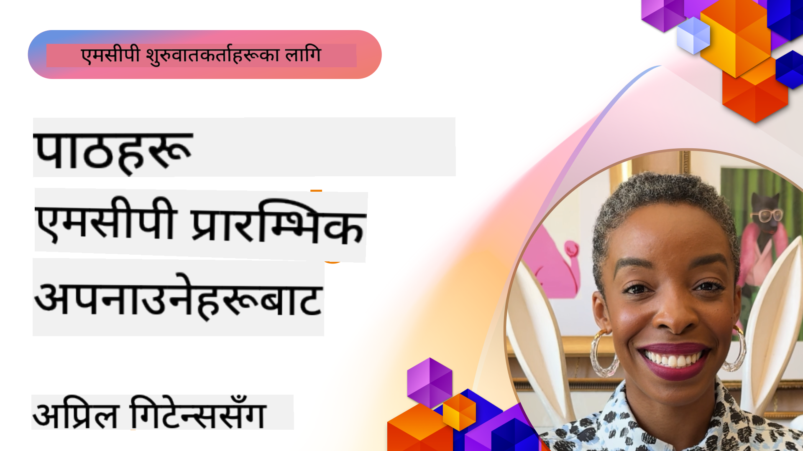

<!--
CO_OP_TRANSLATOR_METADATA:
{
  "original_hash": "41f16dac486d2086a53bc644a01cbe42",
  "translation_date": "2025-08-18T16:00:46+00:00",
  "source_file": "07-LessonsfromEarlyAdoption/README.md",
  "language_code": "ne"
}
-->
# 🌟 प्रारम्भिक प्रयोगकर्ताहरूबाट सिकाइ

[](https://youtu.be/jds7dSmNptE)

_(यो पाठको भिडियो हेर्न माथिको तस्बिरमा क्लिक गर्नुहोस्)_

## 🎯 यो मोड्युलले के समेट्छ

यो मोड्युलले कसरी वास्तविक संगठनहरू र विकासकर्ताहरूले Model Context Protocol (MCP) लाई प्रयोग गरेर चुनौतीहरू समाधान गरिरहेका छन् र नवप्रवर्तनलाई अघि बढाइरहेका छन् भन्ने कुरा अन्वेषण गर्दछ। विस्तृत केस अध्ययनहरू र व्यावहारिक परियोजनाहरू मार्फत, तपाईंले MCP ले कसरी सुरक्षित, मापनयोग्य AI एकीकरणलाई सक्षम बनाउँछ भन्ने कुरा पत्ता लगाउनुहुनेछ, जसले भाषा मोडेलहरू, उपकरणहरू, र उद्यम डाटालाई जोड्छ।

### 📚 MCP लाई कार्यमा हेर्नुहोस्

यी सिद्धान्तहरू उत्पादन-तयार उपकरणहरूमा लागू भएको हेर्न चाहनुहुन्छ? हाम्रो [**10 Microsoft MCP Servers That Are Transforming Developer Productivity**](microsoft-mcp-servers.md) हेर्नुहोस्, जसले आजै प्रयोग गर्न सकिने वास्तविक Microsoft MCP सर्भरहरू प्रदर्शन गर्दछ।

## अवलोकन

यो पाठले कसरी प्रारम्भिक प्रयोगकर्ताहरूले Model Context Protocol (MCP) लाई प्रयोग गरेर वास्तविक-विश्व चुनौतीहरू समाधान गरेका छन् र विभिन्न उद्योगहरूमा नवप्रवर्तनलाई अघि बढाएका छन् भन्ने कुरा अन्वेषण गर्दछ। विस्तृत केस अध्ययनहरू र व्यावहारिक परियोजनाहरू मार्फत, तपाईंले MCP ले कसरी मानकीकृत, सुरक्षित, र मापनयोग्य AI एकीकरणलाई सक्षम बनाउँछ भन्ने कुरा देख्नुहुनेछ—ठूला भाषा मोडेलहरू, उपकरणहरू, र उद्यम डाटालाई एकीकृत फ्रेमवर्कमा जोड्दै। तपाईंले MCP-आधारित समाधानहरू डिजाइन र निर्माण गर्ने व्यावहारिक अनुभव प्राप्त गर्नुहुनेछ, प्रमाणित कार्यान्वयन ढाँचाहरूबाट सिक्नुहुनेछ, र उत्पादन वातावरणमा MCP तैनाथ गर्नका लागि उत्कृष्ट अभ्यासहरू पत्ता लगाउनुहुनेछ। पाठले उदीयमान प्रवृत्तिहरू, भविष्यका दिशाहरू, र खुला स्रोत स्रोतहरूलाई पनि उजागर गर्दछ जसले तपाईंलाई MCP प्रविधि र यसको विकसित पारिस्थितिकी तन्त्रको अग्रभागमा रहन मद्दत गर्दछ।

## सिकाइका उद्देश्यहरू

- विभिन्न उद्योगहरूमा वास्तविक-विश्व MCP कार्यान्वयनहरूको विश्लेषण गर्नुहोस्
- पूर्ण MCP-आधारित अनुप्रयोगहरू डिजाइन र निर्माण गर्नुहोस्
- MCP प्रविधिमा उदीयमान प्रवृत्तिहरू र भविष्यका दिशाहरू अन्वेषण गर्नुहोस्
- वास्तविक विकास परिदृश्यहरूमा उत्कृष्ट अभ्यासहरू लागू गर्नुहोस्

## वास्तविक-विश्व MCP कार्यान्वयनहरू

### केस अध्ययन 1: उद्यम ग्राहक समर्थन स्वचालन

एक बहुराष्ट्रिय कम्पनीले आफ्नो ग्राहक समर्थन प्रणालीहरूमा AI अन्तरक्रियाहरूलाई मानकीकृत गर्न MCP-आधारित समाधान कार्यान्वयन गर्‍यो। यसले उनीहरूलाई निम्न गर्न सक्षम बनायो:

- धेरै LLM प्रदायकहरूको लागि एकीकृत इन्टरफेस सिर्जना गर्नुहोस्
- विभागहरूमा स्थिर प्रम्प्ट व्यवस्थापन कायम गर्नुहोस्
- बलियो सुरक्षा र अनुपालन नियन्त्रणहरू कार्यान्वयन गर्नुहोस्
- विशिष्ट आवश्यकताहरूको आधारमा विभिन्न AI मोडेलहरू बीच सजिलै स्विच गर्नुहोस्

**प्राविधिक कार्यान्वयन:**

```python
# Python MCP server implementation for customer support
import logging
import asyncio
from modelcontextprotocol import create_server, ServerConfig
from modelcontextprotocol.server import MCPServer
from modelcontextprotocol.transports import create_http_transport
from modelcontextprotocol.resources import ResourceDefinition
from modelcontextprotocol.prompts import PromptDefinition
from modelcontextprotocol.tool import ToolDefinition

# Configure logging
logging.basicConfig(level=logging.INFO)

async def main():
    # Create server configuration
    config = ServerConfig(
        name="Enterprise Customer Support Server",
        version="1.0.0",
        description="MCP server for handling customer support inquiries"
    )
    
    # Initialize MCP server
    server = create_server(config)
    
    # Register knowledge base resources
    server.resources.register(
        ResourceDefinition(
            name="customer_kb",
            description="Customer knowledge base documentation"
        ),
        lambda params: get_customer_documentation(params)
    )
    
    # Register prompt templates
    server.prompts.register(
        PromptDefinition(
            name="support_template",
            description="Templates for customer support responses"
        ),
        lambda params: get_support_templates(params)
    )
    
    # Register support tools
    server.tools.register(
        ToolDefinition(
            name="ticketing",
            description="Create and update support tickets"
        ),
        handle_ticketing_operations
    )
    
    # Start server with HTTP transport
    transport = create_http_transport(port=8080)
    await server.run(transport)

if __name__ == "__main__":
    asyncio.run(main())
```

**परिणामहरू:** मोडेल लागतमा 30% कमी, प्रतिक्रिया स्थिरतामा 45% सुधार, र विश्वव्यापी सञ्चालनहरूमा सुधारिएको अनुपालन।

### केस अध्ययन 2: स्वास्थ्य सेवा निदान सहायक

एक स्वास्थ्य सेवा प्रदायकले धेरै विशेषज्ञ चिकित्सा AI मोडेलहरू एकीकृत गर्न MCP पूर्वाधार विकास गर्‍यो, जबकि संवेदनशील बिरामी डाटा सुरक्षित राख्न सुनिश्चित गर्‍यो:

- सामान्य र विशेषज्ञ चिकित्सा मोडेलहरू बीच सहज स्विचिङ
- कडा गोपनीयता नियन्त्रणहरू र अडिट ट्रेलहरू
- विद्यमान इलेक्ट्रोनिक स्वास्थ्य रेकर्ड (EHR) प्रणालीहरूसँग एकीकरण
- चिकित्सा शब्दावलीको लागि स्थिर प्रम्प्ट इन्जिनियरिङ

**प्राविधिक कार्यान्वयन:**

```csharp
// C# MCP host application implementation in healthcare application
using Microsoft.Extensions.DependencyInjection;
using ModelContextProtocol.SDK.Client;
using ModelContextProtocol.SDK.Security;
using ModelContextProtocol.SDK.Resources;

public class DiagnosticAssistant
{
    private readonly MCPHostClient _mcpClient;
    private readonly PatientContext _patientContext;
    
    public DiagnosticAssistant(PatientContext patientContext)
    {
        _patientContext = patientContext;
        
        // Configure MCP client with healthcare-specific settings
        var clientOptions = new ClientOptions
        {
            Name = "Healthcare Diagnostic Assistant",
            Version = "1.0.0",
            Security = new SecurityOptions
            {
                Encryption = EncryptionLevel.Medical,
                AuditEnabled = true
            }
        };
        
        _mcpClient = new MCPHostClientBuilder()
            .WithOptions(clientOptions)
            .WithTransport(new HttpTransport("https://healthcare-mcp.example.org"))
            .WithAuthentication(new HIPAACompliantAuthProvider())
            .Build();
    }
    
    public async Task<DiagnosticSuggestion> GetDiagnosticAssistance(
        string symptoms, string patientHistory)
    {
        // Create request with appropriate resources and tool access
        var resourceRequest = new ResourceRequest
        {
            Name = "patient_records",
            Parameters = new Dictionary<string, object>
            {
                ["patientId"] = _patientContext.PatientId,
                ["requestingProvider"] = _patientContext.ProviderId
            }
        };
        
        // Request diagnostic assistance using appropriate prompt
        var response = await _mcpClient.SendPromptRequestAsync(
            promptName: "diagnostic_assistance",
            parameters: new Dictionary<string, object>
            {
                ["symptoms"] = symptoms,
                patientHistory = patientHistory,
                relevantGuidelines = _patientContext.GetRelevantGuidelines()
            });
            
        return DiagnosticSuggestion.FromMCPResponse(response);
    }
}
```

**परिणामहरू:** चिकित्सकहरूको लागि सुधारिएको निदान सुझावहरू, HIPAA अनुपालनको पूर्ण सुनिश्चितता, र प्रणालीहरू बीचको सन्दर्भ-स्विचिङमा महत्त्वपूर्ण कमी।

### केस अध्ययन 3: वित्तीय सेवाहरू जोखिम विश्लेषण

एक वित्तीय संस्थाले विभिन्न विभागहरूमा जोखिम विश्लेषण प्रक्रियाहरूलाई मानकीकृत गर्न MCP कार्यान्वयन गर्‍यो:

- क्रेडिट जोखिम, ठगी पत्ता लगाउने, र लगानी जोखिम मोडेलहरूको लागि एकीकृत इन्टरफेस सिर्जना गरियो
- कडा पहुँच नियन्त्रण र मोडेल संस्करणिङ कार्यान्वयन गरियो
- सबै AI सिफारिसहरूको अडिटयोग्यता सुनिश्चित गरियो
- विविध प्रणालीहरूमा डाटाको स्थिर ढाँचा कायम गरियो

**प्राविधिक कार्यान्वयन:**

```java
// Java MCP server for financial risk assessment
import org.mcp.server.*;
import org.mcp.security.*;

public class FinancialRiskMCPServer {
    public static void main(String[] args) {
        // Create MCP server with financial compliance features
        MCPServer server = new MCPServerBuilder()
            .withModelProviders(
                new ModelProvider("risk-assessment-primary", new AzureOpenAIProvider()),
                new ModelProvider("risk-assessment-audit", new LocalLlamaProvider())
            )
            .withPromptTemplateDirectory("./compliance/templates")
            .withAccessControls(new SOCCompliantAccessControl())
            .withDataEncryption(EncryptionStandard.FINANCIAL_GRADE)
            .withVersionControl(true)
            .withAuditLogging(new DatabaseAuditLogger())
            .build();
            
        server.addRequestValidator(new FinancialDataValidator());
        server.addResponseFilter(new PII_RedactionFilter());
        
        server.start(9000);
        
        System.out.println("Financial Risk MCP Server running on port 9000");
    }
}
```

**परिणामहरू:** सुधारिएको नियामक अनुपालन, मोडेल तैनाथ चक्रहरूमा 40% तीव्रता, र विभागहरूमा जोखिम मूल्याङ्कन स्थिरतामा सुधार।

### केस अध्ययन 4: ब्राउजर अटोमेसनका लागि Microsoft Playwright MCP Server

Microsoft ले Model Context Protocol मार्फत सुरक्षित, मानकीकृत ब्राउजर अटोमेसन सक्षम गर्न [Playwright MCP Server](https://github.com/microsoft/playwright-mcp) विकास गर्‍यो। यो उत्पादन-तयार सर्भरले AI एजेन्टहरू र LLM हरूलाई वेब ब्राउजरहरूसँग नियन्त्रण गरिएको, अडिटयोग्य, र विस्तारयोग्य तरिकामा अन्तरक्रिया गर्न अनुमति दिन्छ—स्वचालित वेब परीक्षण, डाटा निकासी, र अन्त-देखि-अन्त वर्कफ्लोहरू जस्ता प्रयोगका केसहरूलाई सक्षम बनाउँदै।

> **🎯 उत्पादन-तयार उपकरण**
> 
> यो केस अध्ययनले आजै प्रयोग गर्न सकिने वास्तविक MCP सर्भरलाई प्रदर्शन गर्दछ! Playwright MCP Server र अन्य 9 उत्पादन-तयार Microsoft MCP सर्भरहरूको बारेमा हाम्रो [**Microsoft MCP Servers Guide**](microsoft-mcp-servers.md#8--playwright-mcp-server) मा थप जान्नुहोस्।

**मुख्य विशेषताहरू:**
- MCP उपकरणहरूका रूपमा ब्राउजर अटोमेसन क्षमताहरू (नेभिगेसन, फारम भर्नु, स्क्रिनसट लिनु आदि) प्रदान गर्दछ
- अनधिकृत कार्यहरू रोक्न कडा पहुँच नियन्त्रण र स्यान्डबक्सिङ कार्यान्वयन गर्दछ
- सबै ब्राउजर अन्तरक्रियाहरूको विस्तृत अडिट लगहरू प्रदान गर्दछ
- एजेन्ट-चालित अटोमेसनका लागि Azure OpenAI र अन्य LLM प्रदायकहरूसँग एकीकरण समर्थन गर्दछ
- GitHub Copilot को कोडिङ एजेन्टलाई वेब ब्राउजिङ क्षमताहरू प्रदान गर्दछ

**प्राविधिक कार्यान्वयन:**

```typescript
// TypeScript: Registering Playwright browser automation tools in an MCP server
import { createServer, ToolDefinition } from 'modelcontextprotocol';
import { launch } from 'playwright';

const server = createServer({
  name: 'Playwright MCP Server',
  version: '1.0.0',
  description: 'MCP server for browser automation using Playwright'
});

// Register a tool for navigating to a URL and capturing a screenshot
server.tools.register(
  new ToolDefinition({
    name: 'navigate_and_screenshot',
    description: 'Navigate to a URL and capture a screenshot',
    parameters: {
      url: { type: 'string', description: 'The URL to visit' }
    }
  }),
  async ({ url }) => {
    const browser = await launch();
    const page = await browser.newPage();
    await page.goto(url);
    const screenshot = await page.screenshot();
    await browser.close();
    return { screenshot };
  }
);

// Start the MCP server
server.listen(8080);
```

**परिणामहरू:**

- AI एजेन्टहरू र LLM हरूका लागि सुरक्षित, प्रोग्रामेटिक ब्राउजर अटोमेसन सक्षम गरियो
- म्यानुअल परीक्षण प्रयासमा कमी र वेब अनुप्रयोगहरूको परीक्षण कवरेजमा सुधार
- उद्यम वातावरणमा ब्राउजर-आधारित उपकरण एकीकरणको लागि पुन: प्रयोगयोग्य, विस्तारयोग्य फ्रेमवर्क प्रदान गरियो
- GitHub Copilot को वेब ब्राउजिङ क्षमताहरूलाई सशक्त बनायो

**सन्दर्भहरू:**

- [Playwright MCP Server GitHub Repository](https://github.com/microsoft/playwright-mcp)
- [Microsoft AI र अटोमेसन समाधानहरू](https://azure.microsoft.com/en-us/products/ai-services/)

### केस अध्ययन 5: Azure MCP – सेवा रूपमा उद्यम-ग्रेड Model Context Protocol

Azure MCP Server ([https://aka.ms/azmcp](https://aka.ms/azmcp)) Microsoft को व्यवस्थापित, उद्यम-ग्रेड Model Context Protocol को कार्यान्वयन हो, जसले क्लाउड सेवाको रूपमा मापनयोग्य, सुरक्षित, र अनुपालन MCP सर्भर क्षमताहरू प्रदान गर्न डिजाइन गरिएको हो। Azure MCP ले संगठनहरूलाई MCP सर्भरहरूलाई छिटो तैनाथ, व्यवस्थापन, र Azure AI, डाटा, र सुरक्षा सेवाहरूसँग एकीकृत गर्न सक्षम बनाउँछ, सञ्चालनात्मक ओभरहेड घटाउँछ र AI अपनाउने प्रक्रियालाई तीव्र बनाउँछ।

> **🎯 उत्पादन-तयार उपकरण**
> 
> यो आजै प्रयोग गर्न सकिने वास्तविक MCP सर्भर हो! Azure AI Foundry MCP Server को बारेमा हाम्रो [**Microsoft MCP Servers Guide**](microsoft-mcp-servers.md) मा थप जान्नुहोस्।

- बिल्ट-इन स्केलिङ, अनुगमन, र सुरक्षासहित पूर्ण व्यवस्थापित MCP सर्भर होस्टिङ
- Azure OpenAI, Azure AI Search, र अन्य Azure सेवाहरूसँग देशी एकीकरण
- Microsoft Entra ID मार्फत उद्यम प्रमाणीकरण र प्राधिकरण
- अनुकूलन उपकरणहरू, प्रम्प्ट टेम्प्लेटहरू, र स्रोत कनेक्टरहरूको लागि समर्थन
- उद्यम सुरक्षा र नियामक आवश्यकताहरूको अनुपालन

**प्राविधिक कार्यान्वयन:**

```yaml
# Example: Azure MCP server deployment configuration (YAML)
apiVersion: mcp.microsoft.com/v1
kind: McpServer
metadata:
  name: enterprise-mcp-server
spec:
  modelProviders:
    - name: azure-openai
      type: AzureOpenAI
      endpoint: https://<your-openai-resource>.openai.azure.com/
      apiKeySecret: <your-azure-keyvault-secret>
  tools:
    - name: document_search
      type: AzureAISearch
      endpoint: https://<your-search-resource>.search.windows.net/
      apiKeySecret: <your-azure-keyvault-secret>
  authentication:
    type: EntraID
    tenantId: <your-tenant-id>
  monitoring:
    enabled: true
    logAnalyticsWorkspace: <your-log-analytics-id>
```

**परिणामहरू:**  
- उद्यम AI परियोजनाहरूको लागि समय-देखि-मूल्य घटाइयो, तयार-प्रयोग MCP सर्भर प्लेटफर्म प्रदान गरेर
- LLM हरू, उपकरणहरू, र उद्यम डाटा स्रोतहरूको एकीकरणलाई सरल बनायो
- MCP कार्यभारहरूको लागि सुरक्षा, अवलोकनीयता, र सञ्चालनात्मक दक्षतामा सुधार
- Azure SDK उत्कृष्ट अभ्यासहरू र वर्तमान प्रमाणीकरण ढाँचाहरूको साथ कोड गुणस्तर सुधार

**सन्दर्भहरू:**  
- [Azure MCP Documentation](https://aka.ms/azmcp)
- [Azure MCP Server GitHub Repository](https://github.com/Azure/azure-mcp)
- [Azure AI Services](https://azure.microsoft.com/en-us/products/ai-services/)
- [Microsoft MCP Center](https://mcp.azure.com)

### केस अध्ययन 6: NLWeb

MCP (Model Context Protocol) एक उदीयमान प्रोटोकल हो जसले च्याटबोटहरू र AI सहायकहरूलाई उपकरणहरूसँग अन्तरक्रिया गर्न अनुमति दिन्छ। प्रत्येक NLWeb उदाहरण पनि एक MCP सर्भर हो, जसले एक कोर विधि, "ask," समर्थन गर्दछ, जसले वेबसाइटलाई प्राकृतिक भाषामा प्रश्न सोध्न प्रयोग गरिन्छ। फर्काइएको जवाफले schema.org, वेब डाटालाई वर्णन गर्न व्यापक रूपमा प्रयोग हुने शब्दावली, प्रयोग गर्दछ। सरल भाषामा, MCP NLWeb हो जसरी Http HTML हो। NLWeb ले प्रोटोकलहरू, Schema.org ढाँचाहरू, र नमूना कोडलाई संयोजन गर्दछ, जसले साइटहरूलाई तीव्र रूपमा यी अन्तर्क्रियात्मक बिन्दुहरू सिर्जना गर्न मद्दत गर्दछ, मानवहरूलाई संवादात्मक इन्टरफेसहरू र मेसिनहरूलाई प्राकृतिक एजेन्ट-देखि-एजेन्ट अन्तरक्रियाको माध्यमबाट फाइदा पुर्‍याउँछ।

NLWeb का दुई फरक घटकहरू छन्:
- एक प्रोटोकल, सुरु गर्न धेरै सरल, जसले साइटसँग प्राकृतिक भाषामा अन्तरफेस गर्न अनुमति दिन्छ, र एक ढाँचा, json र schema.org लाई फर्काइएको उत्तरको लागि प्रयोग गर्दै। REST API को दस्तावेजमा थप विवरणहरू हेर्नुहोस्।
- (1) को एक सरल कार्यान्वयन, जसले वस्तुहरूको सूची (उत्पादनहरू, रेसिपीहरू, आकर्षणहरू, समीक्षाहरू, आदि) को रूपमा सार्न सकिने साइटहरूको लागि विद्यमान मार्कअपलाई उपयोग गर्दछ। प्रयोगकर्ता इन्टरफेस विजेटहरूको सेटसँगै, साइटहरूले सजिलैसँग आफ्नो सामग्रीमा संवादात्मक इन्टरफेसहरू प्रदान गर्न सक्छन्। च्याट क्वेरीको जीवनको बारेमा थप विवरणहरूको लागि दस्तावेज हेर्नुहोस्।

**सन्दर्भहरू:**  
- [Azure MCP Documentation](https://aka.ms/azmcp)
- [NLWeb](https://github.com/microsoft/NlWeb)

### केस अध्ययन 7: Azure AI Foundry MCP Server – उद्यम AI एजेन्ट एकीकरण

Azure AI Foundry MCP सर्भरहरूले देखाउँछन् कि कसरी MCP लाई उद्यम वातावरणमा AI एजेन्टहरू र वर्कफ्लोहरूलाई व्यवस्थित र व्यवस्थापन गर्न प्रयोग गर्न सकिन्छ। MCP लाई Azure AI Foundry सँग एकीकृत गरेर, संगठनहरूले एजेन्ट अन्तरक्रियाहरूलाई मानकीकृत गर्न, Foundry को वर्कफ्लो व्यवस्थापनलाई उपयोग गर्न, र सुरक्षित, मापनयोग्य तैनाथ सुनिश्चित गर्न सक्छन्।

> **🎯 उत्पादन-तयार उपकरण**
> 
> यो आजै प्रयोग गर्न सकिने वास्तविक MCP सर्भर हो! Azure AI Foundry MCP Server को बारेमा हाम्रो [**Microsoft MCP Servers Guide**](microsoft-mcp-servers.md#9--azure-ai-foundry-mcp-server) मा थप जान्नुहोस्।

**मुख्य विशेषताहरू:**
- Azure को AI पारिस्थितिकी तन्त्रमा व्यापक पहुँच, जसमा मोडेल क्याटलग र तैनाथ व्यवस्थापन समावेश छ
- RAG अनुप्रयोगहरूको लागि Azure AI Search सँग ज्ञान अनुक्रमणिका
- AI मोडेल प्रदर्शन र गुणस्तर आश्वासनका लागि मूल्याङ्कन उपकरणहरू
- Azure AI Foundry Catalog र Labs सँग एकीकरण, अत्याधुनिक अनुसन्धान मोडेलहरूको लागि
- उत्पादन परिदृश्यहरूको लागि एजेन्ट व्यवस्थापन र मूल्याङ्कन क्षमताहरू

**परिणामहरू:**
- AI एजेन्ट वर्कफ्लोहरूको छिटो प्रोटोटाइपिङ र बलियो अनुगमन
- उन्नत परिदृश्यहरूको लागि Azure AI सेवाहरूसँग सहज एकीकरण
- एजेन्ट पाइपलाइनहरू निर्माण, तैनाथ, र अनुगमन गर्नको लागि एकीकृत इन्टरफेस
- उद्यमहरूको लागि सुधारिएको सुरक्षा, अनुपालन, र सञ्चालन दक्षता
- जटिल एजेन्ट-चालित प्रक्रियाहरूमा नियन्त्रण कायम राख्दै AI अपनाउने प्रक्रियालाई तीव्र बनायो

**सन्दर्भहरू:**
- [Azure AI Foundry MCP Server GitHub Repository](https://github.com/azure-ai-foundry/mcp-foundry)
- [Azure AI एजेन्टहरू MCP सँग एकीकृत गर्दै (Microsoft Foundry Blog)](https://devblogs.microsoft.com/foundry/integrating-azure-ai-agents-mcp/)

### केस अध्ययन 8: Foundry MCP Playground – प्रयोग र प्रोटोटाइपिङ

Foundry MCP Playground ले MCP सर्भरहरू र Azure AI Foundry एकीकरणहरूसँग प्रयोग गर्न तयार वातावरण प्रदान गर्दछ। विकासकर्ताहरूले Azure AI Foundry Catalog र Labs बाट स्रोतहरू प्रयोग गरेर AI मोडेलहरू र एजेन्ट वर्कफ्लोहरू छिटो प्रोटोटाइप, परीक्षण, र मूल्याङ्कन गर्न सक्छन्। Playground ले सेटअपलाई सरल बनाउँछ, नमूना परियोजनाहरू प्रदान गर्दछ, र सहकार्यात्मक विकासलाई समर्थन गर्दछ, जसले न्यूनतम ओभरहेडका साथ उत्कृष्ट अभ्यासहरू र नयाँ परिदृश्यहरू अन्वेषण गर्न सजिलो बनाउँछ। यो विशेष गरी टोलीहरूको लागि उपयोगी छ जसले विचारहरूलाई मान्य गर्न, प्रयोगहरू साझा गर्न, र जटिल पूर्वाधारको आवश्यकता बिना सिकाइलाई तीव्र बनाउन चाहन्छन्। प्रवेशको बाधा घटाएर, Playground ले MCP र Azure AI Foundry पारिस्थितिकी तन्त्रमा नवप्रवर्तन र समुदाय योगदानलाई प्रोत्साहित गर्दछ।

**सन्दर्भहरू:**

- [Foundry MCP Playground GitHub Repository](https://github.com/azure-ai-foundry/foundry-mcp-playground)

### केस अध्ययन 9: Microsoft Learn Docs MCP Server – AI-शक्तियुक्त दस्तावेज पहुँच

Microsoft Learn Docs MCP Server एक क्लाउड-होस्ट गरिएको सेवा हो जसले AI सहायकहरूलाई Model Context Protocol मार्फत आधिकारिक Microsoft दस्तावेजहरूको वास्तविक-समय पहुँच प्रदान गर्दछ। यो उत्पादन-तयार सर्भरले व्यापक Microsoft Learn पारिस्थितिकी तन्त्रसँग जडान गर्दछ र सबै आधिकारिक Microsoft स्रोतहरूमा अर्थपूर्ण खोज सक्षम गर्दछ।
> **🎯 उत्पादनको लागि तयार उपकरण**

> यो एक वास्तविक MCP सर्भर हो जुन तपाईं आजै प्रयोग गर्न सक्नुहुन्छ! Microsoft Learn Docs MCP Server को बारेमा थप जान्नको लागि हाम्रो [**Microsoft MCP Servers Guide**](microsoft-mcp-servers.md#1--microsoft-learn-docs-mcp-server) हेर्नुहोस्।
**मुख्य विशेषताहरू:**
- आधिकारिक Microsoft दस्तावेज, Azure डक्स, र Microsoft 365 दस्तावेजहरूको वास्तविक-समय पहुँच
- सन्दर्भ र उद्देश्य बुझ्ने उन्नत अर्थपूर्ण खोज क्षमता
- Microsoft Learn सामग्री प्रकाशित भएलगत्तै सधैं अद्यावधिक जानकारी
- Microsoft Learn, Azure दस्तावेज, र Microsoft 365 स्रोतहरूमा व्यापक कवरेज
- लेख शीर्षक र URL सहित १० उच्च-गुणस्तर सामग्री टुक्राहरू फिर्ता गर्दछ

**किन यो महत्त्वपूर्ण छ:**
- Microsoft प्रविधिहरूको लागि "पुरानो AI ज्ञान" समस्या समाधान गर्दछ
- AI सहायकहरूले नवीनतम .NET, C#, Azure, र Microsoft 365 सुविधाहरूको पहुँच सुनिश्चित गर्दछ
- सही कोड उत्पादनको लागि आधिकारिक, पहिलो-पक्ष जानकारी प्रदान गर्दछ
- तीव्र रूपमा विकसित Microsoft प्रविधिहरूसँग काम गर्ने विकासकर्ताहरूको लागि आवश्यक

**परिणामहरू:**
- Microsoft प्रविधिहरूको लागि AI-उत्पन्न कोडको सटीकता नाटकीय रूपमा सुधार
- वर्तमान दस्तावेज र उत्कृष्ट अभ्यासहरू खोज्न खर्च गरिएको समय घट्यो
- सन्दर्भ-सचेत दस्तावेज पुनःप्राप्तिसँग विकासकर्ताको उत्पादकता बढ्यो
- IDE छोड्न नपर्ने विकास कार्यप्रवाहहरूसँग सहज एकीकरण

**सन्दर्भहरू:**
- [Microsoft Learn Docs MCP Server GitHub Repository](https://github.com/MicrosoftDocs/mcp)
- [Microsoft Learn Documentation](https://learn.microsoft.com/)

## व्यावहारिक परियोजनाहरू

### परियोजना १: बहु-प्रदायक MCP सर्भर निर्माण गर्नुहोस्

**उद्देश्य:** विशिष्ट मापदण्डहरूमा आधारित अनुरोधहरूलाई बहु AI मोडेल प्रदायकहरूमा रुट गर्न सक्ने MCP सर्भर सिर्जना गर्नुहोस्।

**आवश्यकताहरू:**

- कम्तीमा तीन फरक मोडेल प्रदायकहरूको समर्थन गर्नुहोस् (जस्तै, OpenAI, Anthropic, स्थानीय मोडेलहरू)
- अनुरोध मेटाडेटामा आधारित रुटिङ मेकानिजम कार्यान्वयन गर्नुहोस्
- प्रदायक प्रमाणपत्रहरू व्यवस्थापन गर्न कन्फिगरेसन प्रणाली सिर्जना गर्नुहोस्
- प्रदर्शन र लागत अनुकूलन गर्न क्यासिङ थप्नुहोस्
- प्रयोगको निगरानी गर्न सरल ड्यासबोर्ड निर्माण गर्नुहोस्

**कार्यान्वयन चरणहरू:**

1. आधारभूत MCP सर्भर पूर्वाधार सेटअप गर्नुहोस्
2. प्रत्येक AI मोडेल सेवाको लागि प्रदायक एडाप्टरहरू कार्यान्वयन गर्नुहोस्
3. अनुरोध विशेषताहरूमा आधारित रुटिङ तर्क सिर्जना गर्नुहोस्
4. बारम्बार अनुरोधहरूको लागि क्यासिङ मेकानिजम थप्नुहोस्
5. निगरानी ड्यासबोर्ड विकास गर्नुहोस्
6. विभिन्न अनुरोध ढाँचाहरूको साथ परीक्षण गर्नुहोस्

**प्रविधिहरू:** Python (.NET/Java/Python तपाईंको प्राथमिकतामा आधारित), Redis क्यासिङको लागि, र ड्यासबोर्डको लागि सरल वेब फ्रेमवर्क।

### परियोजना २: उद्यम प्रम्प्ट व्यवस्थापन प्रणाली

**उद्देश्य:** संगठनभरि प्रम्प्ट टेम्प्लेटहरू व्यवस्थापन, संस्करण, र तैनाथ गर्न MCP-आधारित प्रणाली विकास गर्नुहोस्।

**आवश्यकताहरू:**

- प्रम्प्ट टेम्प्लेटहरूको लागि केन्द्रीय भण्डार सिर्जना गर्नुहोस्
- संस्करण र अनुमोदन कार्यप्रवाहहरू कार्यान्वयन गर्नुहोस्
- नमूना इनपुटहरूसँग टेम्प्लेट परीक्षण क्षमताहरू निर्माण गर्नुहोस्
- भूमिका-आधारित पहुँच नियन्त्रणहरू विकास गर्नुहोस्
- टेम्प्लेट पुनःप्राप्ति र तैनातीको लागि API सिर्जना गर्नुहोस्

**कार्यान्वयन चरणहरू:**

1. टेम्प्लेट भण्डारणको लागि डाटाबेस स्कीमा डिजाइन गर्नुहोस्
2. टेम्प्लेट CRUD अपरेशनहरूको लागि कोर API सिर्जना गर्नुहोस्
3. संस्करण प्रणाली कार्यान्वयन गर्नुहोस्
4. अनुमोदन कार्यप्रवाह निर्माण गर्नुहोस्
5. परीक्षण फ्रेमवर्क विकास गर्नुहोस्
6. व्यवस्थापनको लागि सरल वेब इन्टरफेस सिर्जना गर्नुहोस्
7. MCP सर्भरसँग एकीकृत गर्नुहोस्

**प्रविधिहरू:** ब्याकएन्ड फ्रेमवर्क, SQL वा NoSQL डाटाबेस, र व्यवस्थापन इन्टरफेसको लागि फ्रन्टएन्ड फ्रेमवर्क।

### परियोजना ३: MCP-आधारित सामग्री उत्पादन प्लेटफर्म

**उद्देश्य:** विभिन्न सामग्री प्रकारहरूमा स्थिर परिणामहरू प्रदान गर्न MCP प्रयोग गर्ने सामग्री उत्पादन प्लेटफर्म निर्माण गर्नुहोस्।

**आवश्यकताहरू:**

- बहु सामग्री ढाँचाहरूको समर्थन गर्नुहोस् (ब्लग पोस्टहरू, सामाजिक सञ्जाल, मार्केटिङ प्रतिलिपि)
- अनुकूलन विकल्पहरूसँग टेम्प्लेट-आधारित उत्पादन कार्यान्वयन गर्नुहोस्
- सामग्री समीक्षा र प्रतिक्रिया प्रणाली सिर्जना गर्नुहोस्
- सामग्री प्रदर्शन मेट्रिक्स ट्र्याक गर्नुहोस्
- सामग्री संस्करण र पुनरावृत्तिको समर्थन गर्नुहोस्

**कार्यान्वयन चरणहरू:**

1. MCP क्लाइन्ट पूर्वाधार सेटअप गर्नुहोस्
2. विभिन्न सामग्री प्रकारहरूको लागि टेम्प्लेटहरू सिर्जना गर्नुहोस्
3. सामग्री उत्पादन पाइपलाइन निर्माण गर्नुहोस्
4. समीक्षा प्रणाली कार्यान्वयन गर्नुहोस्
5. मेट्रिक्स ट्र्याकिङ प्रणाली विकास गर्नुहोस्
6. टेम्प्लेट व्यवस्थापन र सामग्री उत्पादनको लागि प्रयोगकर्ता इन्टरफेस सिर्जना गर्नुहोस्

**प्रविधिहरू:** तपाईंको प्राथमिकतामा आधारित प्रोग्रामिङ भाषा, वेब फ्रेमवर्क, र डाटाबेस प्रणाली।

## MCP प्रविधिको भविष्यको दिशा

### उदयशील प्रवृत्तिहरू

1. **मल्टि-मोडल MCP**
   - छवि, अडियो, र भिडियो मोडेलहरूसँग अन्तरक्रिया मानकीकरण गर्न MCP विस्तार
   - क्रस-मोडल तर्क क्षमताहरूको विकास
   - विभिन्न मोडालिटीहरूको लागि मानकीकृत प्रम्प्ट ढाँचाहरू

2. **फेडरेटेड MCP पूर्वाधार**
   - वितरित MCP नेटवर्कहरू जसले संगठनहरूमा स्रोतहरू साझा गर्न सक्छ
   - सुरक्षित मोडेल साझेदारीको लागि मानकीकृत प्रोटोकलहरू
   - गोपनीयता-संरक्षण गणना प्रविधिहरू

3. **MCP बजारहरू**
   - MCP टेम्प्लेट र प्लगइनहरू साझा र मुद्रीकरण गर्नको लागि पारिस्थितिकी तन्त्रहरू
   - गुणस्तर आश्वासन र प्रमाणन प्रक्रियाहरू
   - मोडेल बजारहरूसँग एकीकरण

4. **एज कम्प्युटिङको लागि MCP**
   - स्रोत-सीमित एज उपकरणहरूको लागि MCP मानकहरूको अनुकूलन
   - कम-ब्यान्डविथ वातावरणहरूको लागि अनुकूलित प्रोटोकलहरू
   - IoT पारिस्थितिकी तन्त्रहरूको लागि विशेष MCP कार्यान्वयनहरू

5. **नियामक फ्रेमवर्कहरू**
   - नियामक अनुपालनको लागि MCP विस्तारहरूको विकास
   - मानकीकृत अडिट ट्रेलहरू र व्याख्यात्मक इन्टरफेसहरू
   - उदीयमान AI शासन फ्रेमवर्कहरूसँग एकीकरण

### Microsoft बाट MCP समाधानहरू

Microsoft र Azure ले विभिन्न परिदृश्यहरूमा MCP कार्यान्वयन गर्न विकासकर्ताहरूलाई मद्दत गर्न धेरै ओपन-सोर्स रिपोजिटरीहरू विकास गरेका छन्:

#### Microsoft संगठन

1. [playwright-mcp](https://github.com/microsoft/playwright-mcp) - ब्राउजर अटोमेसन र परीक्षणको लागि Playwright MCP सर्भर
2. [files-mcp-server](https://github.com/microsoft/files-mcp-server) - स्थानीय परीक्षण र समुदाय योगदानको लागि OneDrive MCP सर्भर कार्यान्वयन
3. [NLWeb](https://github.com/microsoft/NlWeb) - NLWeb खुला प्रोटोकलहरूको संग्रह हो। यसको मुख्य फोकस AI वेबको लागि आधारभूत तह स्थापना गर्नु हो

#### Azure-Samples संगठन

1. [mcp](https://github.com/Azure-Samples/mcp) - Azure मा MCP सर्भरहरू निर्माण र एकीकृत गर्नका लागि नमूनाहरू, उपकरणहरू, र स्रोतहरूको लिंक
2. [mcp-auth-servers](https://github.com/Azure-Samples/mcp-auth-servers) - वर्तमान मोडेल सन्दर्भ प्रोटोकल विशिष्टताको साथ प्रमाणीकरण प्रदर्शन गर्ने सन्दर्भ MCP सर्भरहरू
3. [remote-mcp-functions](https://github.com/Azure-Samples/remote-mcp-functions) - Azure Functions मा कस्टम रिमोट MCP सर्भरहरू निर्माण र तैनाथ गर्नका लागि भाषा-विशिष्ट रिपोजिटरीहरूको लिंक
4. [remote-mcp-functions-python](https://github.com/Azure-Samples/remote-mcp-functions-python) - Python प्रयोग गरेर Azure Functions मा कस्टम रिमोट MCP सर्भरहरू निर्माण र तैनाथ गर्नको लागि क्विकस्टार्ट टेम्प्लेट
5. [remote-mcp-functions-dotnet](https://github.com/Azure-Samples/remote-mcp-functions-dotnet) - .NET/C# प्रयोग गरेर Azure Functions मा कस्टम रिमोट MCP सर्भरहरू निर्माण र तैनाथ गर्नको लागि क्विकस्टार्ट टेम्प्लेट
6. [remote-mcp-functions-typescript](https://github.com/Azure-Samples/remote-mcp-functions-typescript) - TypeScript प्रयोग गरेर Azure Functions मा कस्टम रिमोट MCP सर्भरहरू निर्माण र तैनाथ गर्नको लागि क्विकस्टार्ट टेम्प्लेट
7. [remote-mcp-apim-functions-python](https://github.com/Azure-Samples/remote-mcp-apim-functions-python) - Python प्रयोग गरेर Azure API व्यवस्थापनलाई रिमोट MCP सर्भरहरूसँग AI गेटवेको रूपमा एकीकृत गर्नुहोस्
8. [AI-Gateway](https://github.com/Azure-Samples/AI-Gateway) - APIM ❤️ AI प्रयोगहरू जसमा MCP क्षमताहरू समावेश छन्, Azure OpenAI र AI Foundry सँग एकीकृत गर्दै

यी रिपोजिटरीहरूले विभिन्न कार्यान्वयनहरू, टेम्प्लेटहरू, र Model Context Protocol सँग काम गर्न स्रोतहरू प्रदान गर्दछ। तिनीहरूले आधारभूत सर्भर कार्यान्वयनदेखि प्रमाणीकरण, क्लाउड तैनाती, र उद्यम एकीकरण परिदृश्यहरू सम्मको दायरा समेट्छन्।

#### MCP स्रोतहरू निर्देशिका

[आधिकारिक Microsoft MCP रिपोजिटरी](https://github.com/microsoft/mcp/tree/main/Resources) मा रहेको [MCP स्रोतहरू निर्देशिका](https://github.com/microsoft/mcp/tree/main/Resources) ले Model Context Protocol सर्भरहरूसँग प्रयोग गर्न नमूना स्रोतहरू, प्रम्प्ट टेम्प्लेटहरू, र उपकरण परिभाषाहरूको क्युरेट गरिएको संग्रह प्रदान गर्दछ। यो निर्देशिकाले विकासकर्ताहरूलाई पुन: प्रयोग गर्न मिल्ने निर्माण ब्लकहरू र उत्कृष्ट अभ्यास उदाहरणहरू प्रदान गरेर MCP सँग छिटो सुरु गर्न मद्दत गर्दछ।

- **प्रम्प्ट टेम्प्लेटहरू:** सामान्य AI कार्यहरू र परिदृश्यहरूको लागि तयार-प्रयोग प्रम्प्ट टेम्प्लेटहरू, जुन तपाईंको आफ्नै MCP सर्भर कार्यान्वयनहरूको लागि अनुकूलित गर्न सकिन्छ।
- **उपकरण परिभाषाहरू:** विभिन्न MCP सर्भरहरूमा उपकरण एकीकरण र आह्वानलाई मानकीकरण गर्न उदाहरण उपकरण स्कीमाहरू र मेटाडेटा।
- **स्रोत नमूनाहरू:** MCP फ्रेमवर्क भित्र डाटा स्रोतहरू, APIहरू, र बाह्य सेवाहरूमा जडान गर्न उदाहरण स्रोत परिभाषाहरू।
- **सन्दर्भ कार्यान्वयनहरू:** व्यावहारिक नमूनाहरू जसले वास्तविक संसारको MCP परियोजनाहरूमा स्रोतहरू, प्रम्प्टहरू, र उपकरणहरू संरचना र व्यवस्थित गर्ने तरिका प्रदर्शन गर्दछ।

यी स्रोतहरूले विकासलाई तीव्र बनाउँछ, मानकीकरणलाई प्रवर्द्धन गर्दछ, र MCP-आधारित समाधानहरू निर्माण र तैनाथ गर्दा उत्कृष्ट अभ्यास सुनिश्चित गर्न मद्दत गर्दछ।

#### MCP स्रोतहरू निर्देशिका

- [MCP स्रोतहरू (नमूना प्रम्प्टहरू, उपकरणहरू, र स्रोत परिभाषाहरू)](https://github.com/microsoft/mcp/tree/main/Resources)

### अनुसन्धान अवसरहरू

- MCP फ्रेमवर्कहरू भित्र कुशल प्रम्प्ट अनुकूलन प्रविधिहरू
- बहु-भाडावाल MCP तैनातीहरूको लागि सुरक्षा मोडेलहरू
- विभिन्न MCP कार्यान्वयनहरूमा प्रदर्शन बेंचमार्किङ
- MCP सर्भरहरूको लागि औपचारिक प्रमाणीकरण विधिहरू

## निष्कर्ष

Model Context Protocol (MCP) उद्योगहरूमा मानकीकृत, सुरक्षित, र अन्तरक्रियात्मक AI एकीकरणको भविष्यलाई तीव्र रूपमा आकार दिइरहेको छ। यस पाठमा केस अध्ययनहरू र व्यावहारिक परियोजनाहरू मार्फत, तपाईंले देख्नुभएको छ कि प्रारम्भिक अपनाउनेहरू—Microsoft र Azure सहित—MCP प्रयोग गरेर वास्तविक-विश्व चुनौतीहरू समाधान गर्दैछन्, AI अपनाउनेलाई तीव्र बनाउँदैछन्, र अनुपालन, सुरक्षा, र स्केलेबिलिटी सुनिश्चित गर्दैछन्। MCP को मोड्युलर दृष्टिकोणले संगठनहरूलाई ठूलो भाषा मोडेलहरू, उपकरणहरू, र उद्यम डाटालाई एकीकृत, अडिटयोग्य फ्रेमवर्कमा जडान गर्न सक्षम बनाउँछ। MCP निरन्तर विकसित हुँदै गर्दा, समुदायसँग संलग्न रहनु, ओपन-सोर्स स्रोतहरू अन्वेषण गर्नु, र उत्कृष्ट अभ्यासहरू लागू गर्नु बलियो, भविष्य-तयार AI समाधानहरू निर्माण गर्न महत्त्वपूर्ण हुनेछ।

## अतिरिक्त स्रोतहरू

- [MCP Foundry GitHub Repository](https://github.com/azure-ai-foundry/mcp-foundry)
- [Foundry MCP Playground](https://github.com/azure-ai-foundry/foundry-mcp-playground)
- [Integrating Azure AI Agents with MCP (Microsoft Foundry Blog)](https://devblogs.microsoft.com/foundry/integrating-azure-ai-agents-mcp/)
- [MCP GitHub Repository (Microsoft)](https://github.com/microsoft/mcp)
- [MCP Resources Directory (Sample Prompts, Tools, and Resource Definitions)](https://github.com/microsoft/mcp/tree/main/Resources)
- [MCP Community & Documentation](https://modelcontextprotocol.io/introduction)
- [Azure MCP Documentation](https://aka.ms/azmcp)
- [Playwright MCP Server GitHub Repository](https://github.com/microsoft/playwright-mcp)
- [Files MCP Server (OneDrive)](https://github.com/microsoft/files-mcp-server)
- [Azure-Samples MCP](https://github.com/Azure-Samples/mcp)
- [MCP Auth Servers (Azure-Samples)](https://github.com/Azure-Samples/mcp-auth-servers)
- [Remote MCP Functions (Azure-Samples)](https://github.com/Azure-Samples/remote-mcp-functions)
- [Remote MCP Functions Python (Azure-Samples)](https://github.com/Azure-Samples/remote-mcp-functions-python)
- [Remote MCP Functions .NET (Azure-Samples)](https://github.com/Azure-Samples/remote-mcp-functions-dotnet)
- [Remote MCP Functions TypeScript (Azure-Samples)](https://github.com/Azure-Samples/remote-mcp-functions-typescript)
- [Remote MCP APIM Functions Python (Azure-Samples)](https://github.com/Azure-Samples/remote-mcp-apim-functions-python)
- [AI-Gateway (Azure-Samples)](https://github.com/Azure-Samples/AI-Gateway)
- [Microsoft AI and Automation Solutions](https://azure.microsoft.com/en-us/products/ai-services/)

## अभ्यासहरू

1. कुनै एक केस अध्ययन विश्लेषण गर्नुहोस् र वैकल्पिक कार्यान्वयन दृष्टिकोण प्रस्ताव गर्नुहोस्।
2. परियोजना विचारहरू मध्ये एक चयन गर्नुहोस् र विस्तृत प्राविधिक विशिष्टता सिर्जना गर्नुहोस्।
3. केस अध्ययनहरूमा समेटिएको छैन यस्तो उद्योग अनुसन्धान गर्नुहोस् र MCP ले यसको विशिष्ट चुनौतीहरू कसरी सम्बोधन गर्न सक्छ outline गर्नुहोस्।
4. भविष्यको दिशाहरू मध्ये एक अन्वेषण गर्नुहोस् र यसलाई समर्थन गर्न नयाँ MCP विस्तारको लागि अवधारणा सिर्जना गर्नुहोस्।

अर्को: [Microsoft MCP Server](../07-LessonsfromEarlyAdoption/microsoft-mcp-servers.md)

**अस्वीकरण**:  
यो दस्तावेज़ AI अनुवाद सेवा [Co-op Translator](https://github.com/Azure/co-op-translator) प्रयोग गरी अनुवाद गरिएको हो। हामी यथासम्भव सटीकता सुनिश्चित गर्न प्रयास गर्छौं, तर कृपया ध्यान दिनुहोस् कि स्वचालित अनुवादहरूमा त्रुटि वा अशुद्धता हुन सक्छ। यसको मूल भाषामा रहेको मूल दस्तावेजलाई आधिकारिक स्रोत मानिनुपर्छ। महत्वपूर्ण जानकारीका लागि, व्यावसायिक मानव अनुवाद सिफारिस गरिन्छ। यस अनुवादको प्रयोगबाट उत्पन्न हुने कुनै पनि गलतफहमी वा गलत व्याख्याको लागि हामी जिम्मेवार हुने छैनौं।