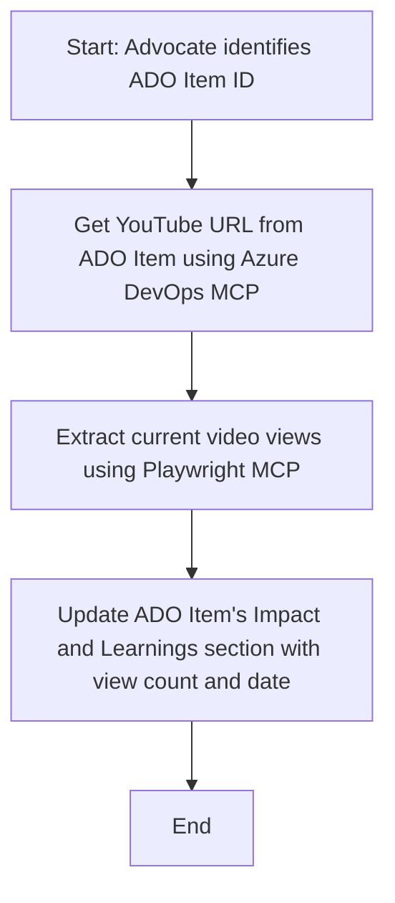

<!--
CO_OP_TRANSLATOR_METADATA:
{
  "original_hash": "14a2dfbea55ef735660a06bd6bdfe5f3",
  "translation_date": "2025-06-13T21:33:43+00:00",
  "source_file": "09-CaseStudy/UpdateADOItemsFromYT.md",
  "language_code": "ne"
}
-->
# केस स्टडी: MCP सँग YouTube डेटा बाट Azure DevOps आइटमहरू अपडेट गर्ने

> **अस्वीकरण:** Azure DevOps आइटमहरूलाई YouTube जस्ता प्लेटफर्मबाट प्राप्त डाटाले अपडेट गर्ने प्रक्रिया स्वचालित गर्नका लागि पहिले नै अनलाइन उपकरणहरू र रिपोर्टहरू उपलब्ध छन्। तलको परिदृश्य केवल एक नमुना प्रयोग केसको रूपमा प्रस्तुत गरिएको हो जसले देखाउँछ कि कसरी MCP उपकरणहरू स्वचालन र एकीकरण कार्यहरूका लागि प्रयोग गर्न सकिन्छ।

## अवलोकन

यो केस स्टडीले देखाउँछ कि Model Context Protocol (MCP) र यसको उपकरणहरू कसरी Azure DevOps (ADO) कार्य आइटमहरूलाई अनलाइन प्लेटफर्महरूबाट प्राप्त जानकारी, जस्तै YouTube बाट, अपडेट गर्न स्वचालित गर्न सकिन्छ। वर्णन गरिएको परिदृश्य यी उपकरणहरूको व्यापक क्षमता मध्ये एउटा मात्र उदाहरण हो, जुन यस्ता धेरै समान स्वचालन आवश्यकताहरूमा अनुकूलन गर्न सकिन्छ।

यस उदाहरणमा, एक Advocate ले ADO आइटमहरू प्रयोग गरेर अनलाइन सत्रहरू ट्र्याक गर्छ, जहाँ प्रत्येक आइटममा YouTube भिडियो URL समावेश हुन्छ। MCP उपकरणहरूको प्रयोगले Advocate लाई ADO आइटमहरूलाई नवीनतम भिडियो मेट्रिक्सहरू जस्तै दृश्य गणना अपडेट गर्न पुनरावृत्त र स्वचालित तरिकाले मद्दत गर्छ। यो विधि अन्य केसहरूमा पनि लागू गर्न सकिन्छ जहाँ अनलाइन स्रोतबाट जानकारी ADO वा अन्य प्रणालीहरूमा एकीकृत गर्न आवश्यक हुन्छ।

## परिदृश्य

एक Advocate अनलाइन सत्रहरू र समुदाय सहभागिताको प्रभाव ट्र्याक गर्ने जिम्मेवारीमा छन्। प्रत्येक सत्र 'DevRel' परियोजनामा ADO कार्य आइटमको रूपमा लग गरिएको हुन्छ, र कार्य आइटममा YouTube भिडियो URL को लागि एउटा फिल्ड हुन्छ। सत्रको पहुँच सही रूपमा रिपोर्ट गर्न Advocate लाई ADO आइटमलाई हालको भिडियो दृश्य संख्या र यो जानकारी कहिले प्राप्त गरिएको हो भनी अपडेट गर्न आवश्यक छ।

## प्रयोग गरिएका उपकरणहरू

- [Azure DevOps MCP](https://github.com/microsoft/azure-devops-mcp): MCP मार्फत ADO कार्य आइटमहरूमा प्रोग्रामेटिक पहुँच र अपडेट सक्षम पार्छ।
- [Playwright MCP](https://github.com/microsoft/playwright-mcp): ब्राउजर क्रियाकलापहरू स्वचालित गरेर वेब पृष्ठहरूबाट प्रत्यक्ष डेटा, जस्तै YouTube भिडियो तथ्यांक निकाल्छ।

## चरण-दर-चरण कार्यप्रवाह

1. **ADO आइटम पहिचान गर्नुहोस्**: 'DevRel' परियोजनामा ADO कार्य आइटम ID (जस्तै, 1234) बाट सुरु गर्नुहोस्।
2. **YouTube URL प्राप्त गर्नुहोस्**: Azure DevOps MCP उपकरण प्रयोग गरी कार्य आइटमबाट YouTube URL लिनुहोस्।
3. **भिडियो दृश्य संख्या निकाल्नुहोस्**: Playwright MCP उपकरण प्रयोग गरी YouTube URL मा जानुहोस् र हालको दृश्य संख्या निकाल्नुहोस्।
4. **ADO आइटम अपडेट गर्नुहोस्**: Azure DevOps MCP उपकरण प्रयोग गरी 'Impact and Learnings' सेक्सनमा नवीनतम दृश्य संख्या र प्राप्ति मिति लेख्नुहोस्।

## उदाहरण प्रॉम्प्ट

```bash
- Work with the ADO Item ID: 1234
- The project is '2025-Awesome'
- Get the YouTube URL for the ADO item
- Use Playwright to get the current views from the YouTube video
- Update the ADO item with the current video views and the updated date of the information
```

## Mermaid फ्लोचार्ट



## प्राविधिक कार्यान्वयन

- **MCP व्यवस्थापन**: कार्यप्रवाह MCP सर्भरले व्यवस्थापन गर्छ, जसले Azure DevOps MCP र Playwright MCP दुबै उपकरणहरूको प्रयोग समन्वय गर्छ।
- **स्वचालन**: प्रक्रिया म्यानुअली ट्रिगर गर्न सकिन्छ वा नियमित अन्तरालमा चलाउन तालिका बनाइन्छ ताकि ADO आइटमहरू अपडेट रहून्।
- **विस्तारयोग्यता**: त्यही ढाँचा प्रयोग गरी अन्य अनलाइन मेट्रिक्सहरू (जस्तै, लाइक, कमेन्ट) वा अन्य प्लेटफर्महरूबाट ADO आइटमहरू अपडेट गर्न सकिन्छ।

## नतिजा र प्रभाव

- **दक्षता**: Advocate हरूको म्यानुअल प्रयास घटाउँछ, भिडियो मेट्रिक्सको प्राप्ति र अपडेट स्वचालित गरेर।
- **शुद्धता**: ADO आइटमहरूले अनलाइन स्रोतहरूबाट उपलब्ध सबैभन्दा नयाँ डाटा प्रतिबिम्बित गर्छन्।
- **पुनरावृत्ति क्षमता**: अन्य डाटा स्रोत वा मेट्रिक्स समावेश गर्ने समान परिदृश्यहरूका लागि पुन: प्रयोग गर्न मिल्ने कार्यप्रवाह प्रदान गर्छ।

## सन्दर्भहरू

- [Azure DevOps MCP](https://github.com/microsoft/azure-devops-mcp)
- [Playwright MCP](https://github.com/microsoft/playwright-mcp)
- [Model Context Protocol (MCP)](https://modelcontextprotocol.io/)

**अस्वीकरण**:  
यो दस्तावेज AI अनुवाद सेवा [Co-op Translator](https://github.com/Azure/co-op-translator) को प्रयोग गरी अनुवाद गरिएको हो। हामी शुद्धताको लागि प्रयासरत छौं, तर कृपया जान्नुहोस् कि स्वचालित अनुवादमा त्रुटि वा अशुद्धि हुन सक्छ। मूल दस्तावेज यसको मूल भाषामा आधिकारिक स्रोत मानिनु पर्छ। महत्वपूर्ण जानकारीको लागि, व्यावसायिक मानव अनुवाद सिफारिस गरिन्छ। यस अनुवादको प्रयोगबाट उत्पन्न कुनै पनि गलतफहमी वा गलत व्याख्याका लागि हामी जिम्मेवार छैनौं।