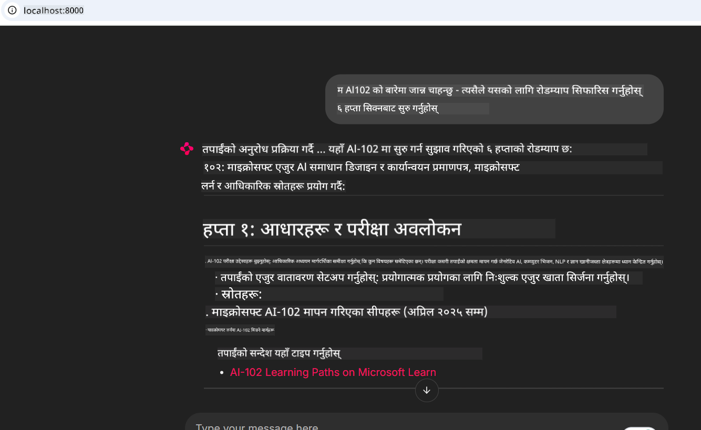

<!--
CO_OP_TRANSLATOR_METADATA:
{
  "original_hash": "4319d291c9d124ecafea52b3d04bfa0e",
  "translation_date": "2025-07-14T06:21:41+00:00",
  "source_file": "09-CaseStudy/docs-mcp/README.md",
  "language_code": "ne"
}
-->
# केस स्टडी: क्लाइन्टबाट Microsoft Learn Docs MCP सर्भरसँग जडान

के तपाईं कहिल्यै कागजात साइटहरू, Stack Overflow, र अनगिन्ती सर्च इन्जिन ट्याबहरू बीच झगडा गर्दै आफ्नो कोडको समस्या समाधान गर्ने प्रयास गर्दै हुनुहुन्थ्यो? सायद तपाईंले कागजातहरूका लागि दोस्रो मोनिटर राख्नु भएको छ, वा तपाईं निरन्तर आफ्नो IDE र ब्राउजर बीच Alt-Tab गर्दै हुनुहुन्छ। के कागजातहरूलाई सिधै तपाईंको कार्यप्रवाहमा ल्याउन सक्ने भए कस्तो हुन्थ्यो—तपाईंका एपहरू, IDE, वा आफ्नै कस्टम उपकरणहरूमा एकीकृत? यस केस स्टडीमा, हामी तपाईंको आफ्नै क्लाइन्ट एप्लिकेशनबाट Microsoft Learn Docs MCP सर्भरसँग सिधै जडान गर्ने तरिका अन्वेषण गर्नेछौं।

## अवलोकन

आधुनिक विकास केवल कोड लेख्ने मात्र होइन—सही समयमा सही जानकारी पत्ता लगाउने कुरा हो। कागजातहरू सबै ठाउँमा छन्, तर प्रायः तपाईंलाई सबैभन्दा आवश्यक ठाउँमा हुँदैनन्: तपाईंका उपकरण र कार्यप्रवाह भित्र। कागजात पुनःप्राप्तिलाई सिधै तपाईंका एप्लिकेशनहरूमा एकीकृत गरेर, तपाईं समय बचत गर्न सक्नुहुन्छ, सन्दर्भ परिवर्तन कम गर्न सक्नुहुन्छ, र उत्पादकत्व बढाउन सक्नुहुन्छ। यस खण्डमा, हामी तपाईंलाई Microsoft Learn Docs MCP सर्भरसँग क्लाइन्ट कसरी जडान गर्ने देखाउनेछौं, जसले तपाईंलाई आफ्नो एप छोड्न नपरी वास्तविक-समय, सन्दर्भ-सम्बन्धित कागजातहरू पहुँच गर्न मद्दत गर्नेछ।

हामी जडान स्थापना गर्ने प्रक्रिया, अनुरोध पठाउने, र स्ट्रिमिङ प्रतिक्रिया प्रभावकारी रूपमा व्यवस्थापन गर्ने तरिका देखाउनेछौं। यसले तपाईंको कार्यप्रवाहलाई मात्र सहज बनाउँदैन, तर स्मार्ट र उपयोगी विकासकर्ता उपकरणहरू निर्माण गर्ने बाटो पनि खोल्छ।

## सिकाइ उद्देश्यहरू

हामी किन यो गर्दैछौं? किनभने सबैभन्दा राम्रो विकासकर्ता अनुभवहरू ती हुन् जसले अवरोध हटाउँछन्। कल्पना गर्नुहोस् यस्तो संसार जहाँ तपाईंको कोड सम्पादक, च्याटबोट, वा वेब एपले Microsoft Learn बाट नवीनतम सामग्री प्रयोग गरेर तपाईंका कागजात प्रश्नहरूको तुरुन्त जवाफ दिन सक्छ। यस अध्यायको अन्त्यसम्म, तपाईं जान्नु हुनेछ:

- कागजातका लागि MCP सर्भर-क्लाइन्ट सञ्चारको आधारभूत कुरा बुझ्न
- Microsoft Learn Docs MCP सर्भरसँग जडान गर्न कन्सोल वा वेब एप्लिकेशन कार्यान्वयन गर्न
- वास्तविक-समय कागजात पुनःप्राप्तिका लागि स्ट्रिमिङ HTTP क्लाइन्टहरू प्रयोग गर्न
- तपाईंको एप्लिकेशनमा कागजात प्रतिक्रियाहरू लग र व्याख्या गर्न

यी सीपहरूले तपाईंलाई प्रतिक्रियाशील मात्र नभई साँच्चिकै अन्तरक्रियात्मक र सन्दर्भ-सम्बन्धित उपकरणहरू निर्माण गर्न मद्दत गर्नेछन्।

## परिदृश्य १ - MCP सँग वास्तविक-समय कागजात पुनःप्राप्ति

यस परिदृश्यमा, हामी तपाईंलाई Microsoft Learn Docs MCP सर्भरसँग क्लाइन्ट कसरी जडान गर्ने देखाउनेछौं, जसले तपाईंलाई आफ्नो एप छोड्न नपरी वास्तविक-समय, सन्दर्भ-सम्बन्धित कागजातहरू पहुँच गर्न मद्दत गर्नेछ।

अब यसलाई व्यवहारमा ल्याऔं। तपाईंको काम Microsoft Learn Docs MCP सर्भरसँग जडान गर्ने, `microsoft_docs_search` उपकरण कल गर्ने, र स्ट्रिमिङ प्रतिक्रियालाई कन्सोलमा लग गर्ने एप लेख्नु हो।

### किन यो तरिका?
किनभने यो थप उन्नत एकीकरणहरू निर्माण गर्ने आधार हो—चाहे तपाईं च्याटबोट, IDE विस्तार, वा वेब ड्यासबोर्ड बनाउन चाहनुहुन्छ।

यस परिदृश्यको कोड र निर्देशनहरू [`solution`](./solution/README.md) फोल्डरमा उपलब्ध छन्। चरणहरूले तपाईंलाई जडान सेटअप गर्न मार्गदर्शन गर्नेछन्:
- आधिकारिक MCP SDK र स्ट्रिमेबल HTTP क्लाइन्ट प्रयोग गरेर जडान
- कागजात पुनःप्राप्तिका लागि `microsoft_docs_search` उपकरणलाई क्वेरी प्यारामिटर सहित कल गर्ने
- उचित लगिङ र त्रुटि व्यवस्थापन कार्यान्वयन गर्ने
- प्रयोगकर्ताहरूलाई धेरै खोज क्वेरीहरू प्रविष्ट गर्न अनुमति दिन अन्तरक्रियात्मक कन्सोल इन्टरफेस सिर्जना गर्ने

यसले देखाउँछ कसरी:
- Docs MCP सर्भरसँग जडान गर्ने
- क्वेरी पठाउने
- परिणामहरू पार्स र प्रिन्ट गर्ने

समाधान चलाउँदा यस्तो देखिन सक्छ:

```
Prompt> What is Azure Key Vault?
Answer> Azure Key Vault is a cloud service for securely storing and accessing secrets. ...
```

तल न्यूनतम नमूना समाधान छ। पूर्ण कोड र विवरण समाधान फोल्डरमा उपलब्ध छन्।

<details>
<summary>Python</summary>

```python
import asyncio
from mcp.client.streamable_http import streamablehttp_client
from mcp import ClientSession

async def main():
    async with streamablehttp_client("https://learn.microsoft.com/api/mcp") as (read_stream, write_stream, _):
        async with ClientSession(read_stream, write_stream) as session:
            await session.initialize()
            result = await session.call_tool("microsoft_docs_search", {"query": "Azure Functions best practices"})
            print(result.content)

if __name__ == "__main__":
    asyncio.run(main())
```

- पूर्ण कार्यान्वयन र लगिङका लागि [`scenario1.py`](../../../../09-CaseStudy/docs-mcp/solution/python/scenario1.py) हेर्नुहोस्।
- स्थापना र प्रयोग निर्देशनहरूका लागि सोही फोल्डरमा रहेको [`README.md`](./solution/python/README.md) फाइल हेर्नुहोस्।
</details>

## परिदृश्य २ - MCP सँग अन्तरक्रियात्मक अध्ययन योजना जनरेटर वेब एप

यस परिदृश्यमा, तपाईं Docs MCP लाई वेब विकास परियोजनामा कसरी एकीकृत गर्ने सिक्नुहुनेछ। लक्ष्य भनेको प्रयोगकर्ताहरूलाई वेब इन्टरफेसबाट सिधै Microsoft Learn कागजात खोज्न सक्षम बनाउनु हो, जसले तपाईंको एप वा साइट भित्र कागजात तुरुन्त पहुँचयोग्य बनाउँछ।

तपाईंले देख्नुहुनेछ:
- वेब एप सेटअप गर्ने
- Docs MCP सर्भरसँग जडान गर्ने
- प्रयोगकर्ता इनपुट व्यवस्थापन गर्ने र परिणाम प्रदर्शन गर्ने

समाधान चलाउँदा यस्तो देखिन सक्छ:

```
User> I want to learn about AI102 - so suggest the roadmap to get it started from learn for 6 weeks

Assistant> Here’s a detailed 6-week roadmap to start your preparation for the AI-102: Designing and Implementing a Microsoft Azure AI Solution certification, using official Microsoft resources and focusing on exam skills areas:

---
## Week 1: Introduction & Fundamentals
- **Understand the Exam**: Review the [AI-102 exam skills outline](https://learn.microsoft.com/en-us/credentials/certifications/exams/ai-102/).
- **Set up Azure**: Sign up for a free Azure account if you don't have one.
- **Learning Path**: [Introduction to Azure AI services](https://learn.microsoft.com/en-us/training/modules/intro-to-azure-ai/)
- **Focus**: Get familiar with Azure portal, AI capabilities, and necessary tools.

....more weeks of the roadmap...

Let me know if you want module-specific recommendations or need more customized weekly tasks!
```

तल न्यूनतम नमूना समाधान छ। पूर्ण कोड र विवरण समाधान फोल्डरमा उपलब्ध छन्।



<details>
<summary>Python (Chainlit)</summary>

Chainlit संवादात्मक AI वेब एपहरू निर्माण गर्ने फ्रेमवर्क हो। यसले MCP उपकरणहरू कल गर्न र वास्तविक समयमा परिणामहरू प्रदर्शन गर्न सजिलो बनाउँछ। यो छिटो प्रोटोटाइपिङ र प्रयोगकर्ता मैत्री इन्टरफेसका लागि उपयुक्त छ।

```python
import chainlit as cl
import requests

MCP_URL = "https://learn.microsoft.com/api/mcp"

@cl.on_message
def handle_message(message):
    query = {"question": message}
    response = requests.post(MCP_URL, json=query)
    if response.ok:
        result = response.json()
        cl.Message(content=result.get("answer", "No answer found.")).send()
    else:
        cl.Message(content="Error: " + response.text).send()
```

- पूर्ण कार्यान्वयनका लागि [`scenario2.py`](../../../../09-CaseStudy/docs-mcp/solution/python/scenario2.py) हेर्नुहोस्।
- सेटअप र चलाउने निर्देशनहरूका लागि [`README.md`](./solution/python/README.md) हेर्नुहोस्।
</details>

## परिदृश्य ३: VS Code मा MCP सर्भरसँग इन-एडिटर कागजातहरू

यदि तपाईं Microsoft Learn Docs सिधै VS Code भित्र प्राप्त गर्न चाहनुहुन्छ (ब्राउजर ट्याबहरू स्विच नगरी), तपाईंले आफ्नो सम्पादकमा MCP सर्भर प्रयोग गर्न सक्नुहुन्छ। यसले तपाईंलाई:
- VS Code मा कोडिङ वातावरण छोड्न नपरी कागजातहरू खोज्न र पढ्न सक्षम बनाउँछ।
- README वा कोर्स फाइलहरूमा सिधै कागजात सन्दर्भ र लिंकहरू समावेश गर्न सकिन्छ।
- GitHub Copilot र MCP सँग मिलेर सहज, AI-सञ्चालित कागजात कार्यप्रवाह प्रयोग गर्न सकिन्छ।

**तपाईंले सिक्नुहुनेछ:**
- तपाईंको कार्यक्षेत्रको मूलमा मान्य `.vscode/mcp.json` फाइल थप्ने (तल उदाहरण हेर्नुहोस्)।
- VS Code मा MCP प्यानल खोल्ने वा कमाण्ड प्यालेट प्रयोग गरेर कागजात खोज्ने र समावेश गर्ने।
- तपाईंको मार्कडाउन फाइलहरूमा सिधै कागजात सन्दर्भ गर्ने।
- GitHub Copilot सँग यो कार्यप्रवाह संयोजन गरेर अझ बढी उत्पादकता प्राप्त गर्ने।

यहाँ VS Code मा MCP सर्भर सेटअप गर्ने उदाहरण छ:

```json
{
  "servers": {
    "LearnDocsMCP": {
      "url": "https://learn.microsoft.com/api/mcp"
    }
  }
}
```

</details>

> विस्तृत चरण-द्वारा-चरण मार्गदर्शन र स्क्रिनशटहरूका लागि [`README.md`](./solution/scenario3/README.md) हेर्नुहोस्।


यो तरिका प्राविधिक कोर्सहरू निर्माण गर्ने, कागजात लेख्ने, वा बारम्बार सन्दर्भ आवश्यक पर्ने कोड विकास गर्नेहरूका लागि उपयुक्त छ।

## मुख्य सिकाइहरू

कागजातहरूलाई सिधै तपाईंका उपकरणहरूमा एकीकृत गर्नु केवल सुविधा मात्र होइन—यो उत्पादकताको लागि ठूलो परिवर्तन हो। तपाईंको क्लाइन्टबाट Microsoft Learn Docs MCP सर्भरसँग जडान गरेर, तपाईंले:

- तपाईंको कोड र कागजात बीच सन्दर्भ परिवर्तन हटाउन सक्नुहुन्छ
- वास्तविक समयमा अद्यावधिक, सन्दर्भ-सम्बन्धित कागजातहरू प्राप्त गर्न सक्नुहुन्छ
- स्मार्ट, अन्तरक्रियात्मक विकासकर्ता उपकरणहरू निर्माण गर्न सक्नुहुन्छ

यी सीपहरूले तपाईंलाई केवल प्रभावकारी मात्र नभई प्रयोग गर्न रमाइलो हुने समाधानहरू बनाउन मद्दत गर्नेछन्।

## थप स्रोतहरू

तपाईंको बुझाइ गहिरो बनाउन यी आधिकारिक स्रोतहरू अन्वेषण गर्नुहोस्:

- [Microsoft Learn Docs MCP Server (GitHub)](https://github.com/MicrosoftDocs/mcp)
- [Azure MCP Server सुरु गर्ने (mcp-python)](https://learn.microsoft.com/en-us/azure/developer/azure-mcp-server/get-started#create-the-python-app)
- [Azure MCP Server के हो?](https://learn.microsoft.com/en-us/azure/developer/azure-mcp-server/)
- [Model Context Protocol (MCP) परिचय](https://modelcontextprotocol.io/introduction)
- [MCP Server बाट प्लगइनहरू थप्ने (Python)](https://learn.microsoft.com/en-us/semantic-kernel/concepts/plugins/adding-mcp-plugins)

**अस्वीकरण**:  
यो दस्तावेज AI अनुवाद सेवा [Co-op Translator](https://github.com/Azure/co-op-translator) प्रयोग गरी अनुवाद गरिएको हो। हामी शुद्धताका लागि प्रयासरत छौं, तर कृपया ध्यान दिनुहोस् कि स्वचालित अनुवादमा त्रुटि वा अशुद्धता हुन सक्छ। मूल दस्तावेज यसको मूल भाषामा नै अधिकारिक स्रोत मानिनुपर्छ। महत्वपूर्ण जानकारीका लागि व्यावसायिक मानव अनुवाद सिफारिस गरिन्छ। यस अनुवादको प्रयोगबाट उत्पन्न कुनै पनि गलतफहमी वा गलत व्याख्याका लागि हामी जिम्मेवार छैनौं।