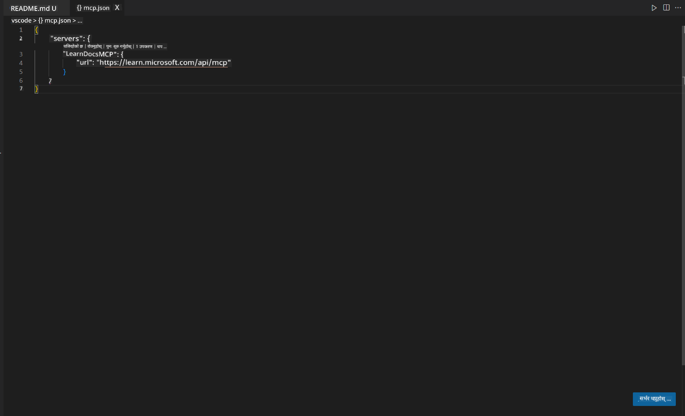
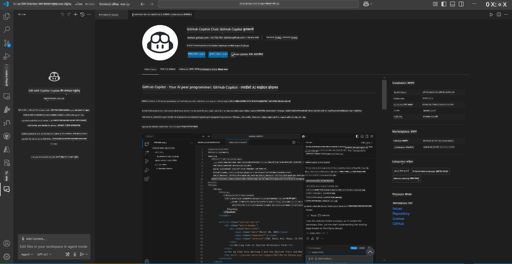
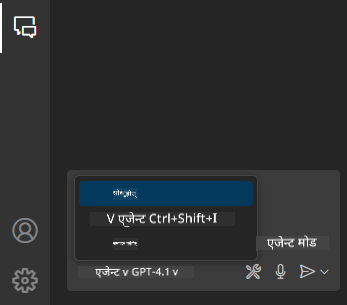
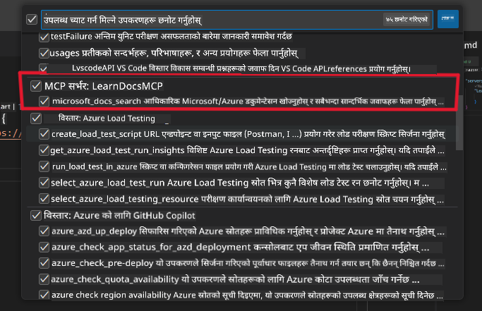
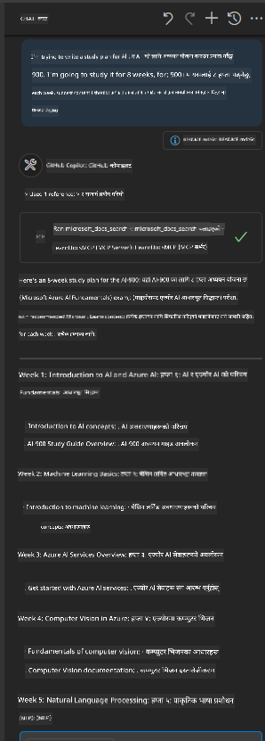
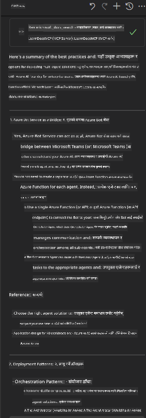

<!--
CO_OP_TRANSLATOR_METADATA:
{
  "original_hash": "db532b1ec386c9ce38c791653dc3c881",
  "translation_date": "2025-07-14T06:49:45+00:00",
  "source_file": "09-CaseStudy/docs-mcp/solution/scenario3/README.md",
  "language_code": "ne"
}
-->
# Scenario 3: VS Code मा MCP सर्भरसहित इन-एडिटर डकुमेन्टेसन

## अवलोकन

यस परिदृश्यमा, तपाईंले Microsoft Learn Docs लाई सिधै आफ्नो Visual Studio Code वातावरणमा ल्याउन MCP सर्भर कसरी प्रयोग गर्ने सिक्नुहुनेछ। बारम्बार ब्राउजर ट्याबहरू सर्छनुको सट्टा, तपाईंले आफ्नो एडिटर भित्रै आधिकारिक डकुमेन्टेसन पहुँच, खोज र सन्दर्भ गर्न सक्नुहुन्छ। यसले तपाईंको कार्यप्रवाहलाई सहज बनाउँछ, ध्यान केन्द्रित राख्छ, र GitHub Copilot जस्ता उपकरणहरूसँग सहज एकीकरण सक्षम पार्छ।

- VS Code भित्रै डकुमेन्टेसन खोज्नुहोस् र पढ्नुहोस्, कोडिङ वातावरण छोड्न नपर्ने।
- README वा कोर्स फाइलहरूमा सिधै डकुमेन्टेसन सन्दर्भ र लिंकहरू समावेश गर्नुहोस्।
- GitHub Copilot र MCP सँगै प्रयोग गरी सहज, AI-सञ्चालित डकुमेन्टेसन कार्यप्रवाह बनाउनुहोस्।

## सिकाइका उद्देश्यहरू

यस अध्यायको अन्त्यसम्म, तपाईंले VS Code भित्र MCP सर्भर सेटअप र प्रयोग गरेर आफ्नो डकुमेन्टेसन र विकास कार्यप्रवाह कसरी सुधार गर्ने बुझ्नुहुनेछ। तपाईं सक्षम हुनुहुनेछ:

- डकुमेन्टेसन खोजका लागि MCP सर्भर प्रयोग गर्न आफ्नो कार्यक्षेत्र कन्फिगर गर्न।
- VS Code भित्रैबाट डकुमेन्टेसन खोज्न र समावेश गर्न।
- GitHub Copilot र MCP को शक्ति संयोजन गरी अझ उत्पादक, AI-सहायता प्राप्त कार्यप्रवाह बनाउन।

यी सीपहरूले तपाईंलाई ध्यान केन्द्रित राख्न, डकुमेन्टेसनको गुणस्तर सुधार्न, र विकासकर्ता वा प्राविधिक लेखकको रूपमा उत्पादकता बढाउन मद्दत गर्नेछ।

## समाधान

इन-एडिटर डकुमेन्टेसन पहुँच प्राप्त गर्न, तपाईंले MCP सर्भरलाई VS Code र GitHub Copilot सँग एकीकृत गर्ने चरणहरू पालना गर्नुहुनेछ। यो समाधान कोर्स लेखक, डकुमेन्टेसन लेखक, र विकासकर्ताहरूका लागि उपयुक्त छ जसले एडिटरमा ध्यान केन्द्रित राख्दै डकुमेन्टेसन र Copilot सँग काम गर्न चाहन्छन्।

- कोर्स वा प्रोजेक्ट डकुमेन्टेसन लेख्दा README मा छिटो सन्दर्भ लिंकहरू थप्नुहोस्।
- Copilot प्रयोग गरी कोड उत्पन्न गर्नुहोस् र MCP प्रयोग गरी तुरुन्तै सम्बन्धित डकुमेन्टेसन फेला पार्नुहोस् र उद्धृत गर्नुहोस्।
- आफ्नो एडिटरमा ध्यान केन्द्रित राख्नुहोस् र उत्पादकता बढाउनुहोस्।

### चरण-द्वारा-चरण मार्गदर्शन

सुरु गर्नका लागि, यी चरणहरू पालना गर्नुहोस्। प्रत्येक चरणका लागि, प्रक्रिया दृश्यात्मक रूपमा देखाउन assets फोल्डरबाट स्क्रिनशट थप्न सक्नुहुन्छ।

1. **MCP कन्फिगरेसन थप्नुहोस्:**
   आफ्नो प्रोजेक्ट रुटमा `.vscode/mcp.json` फाइल बनाउनुहोस् र तलको कन्फिगरेसन थप्नुहोस्:
   ```json
   {
     "servers": {
       "LearnDocsMCP": {
         "url": "https://learn.microsoft.com/api/mcp"
       }
     }
   }
   ```
   यस कन्फिगरेसनले VS Code लाई [`Microsoft Learn Docs MCP server`](https://github.com/MicrosoftDocs/mcp) सँग कसरी जडान गर्ने भनेर बताउँछ।
   
   
    
2. **GitHub Copilot Chat प्यानल खोल्नुहोस्:**
   यदि तपाईंले GitHub Copilot एक्सटेन्सन पहिले नै इन्स्टल गर्नुभएको छैन भने, VS Code को Extensions भ्यूमा गएर इन्स्टल गर्नुहोस्। तपाईं यसलाई सिधै [Visual Studio Code Marketplace](https://marketplace.visualstudio.com/items?itemName=GitHub.copilot-chat) बाट डाउनलोड गर्न सक्नुहुन्छ। त्यसपछि, साइडबारबाट Copilot Chat प्यानल खोल्नुहोस्।

   

3. **एजेन्ट मोड सक्षम गर्नुहोस् र उपकरणहरू जाँच गर्नुहोस्:**
   Copilot Chat प्यानलमा एजेन्ट मोड सक्षम गर्नुहोस्।

   

   एजेन्ट मोड सक्षम गरेपछि, MCP सर्भर उपलब्ध उपकरणहरूमा सूचीबद्ध छ कि छैन जाँच गर्नुहोस्। यसले सुनिश्चित गर्छ कि Copilot एजेन्टले सम्बन्धित जानकारी ल्याउन डकुमेन्टेसन सर्भर पहुँच गर्न सक्छ।
   
   

4. **नयाँ च्याट सुरु गर्नुहोस् र एजेन्टलाई सोध्नुहोस्:**
   Copilot Chat प्यानलमा नयाँ च्याट खोल्नुहोस्। अब तपाईं आफ्नो डकुमेन्टेसन सम्बन्धी प्रश्नहरू एजेन्टलाई सोध्न सक्नुहुन्छ। एजेन्टले MCP सर्भर प्रयोग गरी सम्बन्धित Microsoft Learn डकुमेन्टेसन सिधै तपाईंको एडिटरमा ल्याउनेछ।

   - *"म विषय X को लागि अध्ययन योजना लेख्न खोज्दैछु। म यसलाई ८ हप्ता अध्ययन गर्नेछु, प्रत्येक हप्ताका लागि कुन सामग्री लिनु उपयुक्त हुन्छ सुझाव दिनुहोस्।"*

   

5. **प्रत्यक्ष प्रश्न:**

   > Azure AI Foundry Discord को [#get-help](https://discord.gg/D6cRhjHWSC) सेक्सनबाट प्रत्यक्ष प्रश्न लिऔं ([मूल सन्देश हेर्नुहोस्](https://discord.com/channels/1113626258182504448/1385498306720829572)):
   
   *"म Azure AI Foundry मा विकास गरिएका AI एजेन्टहरूसँग बहु-एजेन्ट समाधान कसरी डिप्लोय गर्ने भन्ने बारे उत्तर खोज्दैछु। मलाई थाहा छ कि Copilot Studio च्यानल जस्तो सिधा डिप्लोय मेथड छैन। त्यसैले, एंटरप्राइज प्रयोगकर्ताहरूले अन्तरक्रिया गरी काम सम्पन्न गर्नका लागि यो डिप्लोय गर्ने विभिन्न तरिकाहरू के-के हुन्?
धेरै लेख/ब्लगहरू भन्छन् कि Azure Bot सेवा प्रयोग गरेर MS Teams र Azure AI Foundry एजेन्टहरू बीच पुलको रूपमा काम गर्न सकिन्छ, के Azure Bot सेटअप गरेर जुन Azure AI Foundry को Orchestrator Agent सँग Azure Function मार्फत जडान हुन्छ, त्यो काम गर्नेछ? वा मल्टि-एजेन्ट समाधानका प्रत्येक AI एजेन्टको लागि Azure Function बनाउनुपर्नेछ Bot Framework मा orchestration गर्न? अन्य सुझावहरू स्वागतयोग्य छन्।"*

   

   एजेन्टले सम्बन्धित डकुमेन्टेसन लिंकहरू र सारांशहरू प्रदान गर्नेछ, जुन तपाईंले सिधै आफ्नो मार्कडाउन फाइलहरूमा समावेश गर्न वा कोडमा सन्दर्भको रूपमा प्रयोग गर्न सक्नुहुन्छ।

### नमूना प्रश्नहरू

यहाँ केही उदाहरण प्रश्नहरू छन् जुन तपाईंले प्रयास गर्न सक्नुहुन्छ। यी प्रश्नहरूले देखाउनेछन् कि कसरी MCP सर्भर र Copilot सँगै काम गरी तुरुन्त, सन्दर्भ-सम्बन्धित डकुमेन्टेसन र सन्दर्भहरू VS Code छोड्न नपरी प्रदान गर्न सक्छन्:

- "Azure Functions triggers कसरी प्रयोग गर्ने देखाउनुहोस्।"
- "Azure Key Vault को आधिकारिक डकुमेन्टेसनको लिंक समावेश गर्नुहोस्।"
- "Azure स्रोतहरू सुरक्षित गर्ने उत्तम अभ्यासहरू के-के हुन्?"
- "Azure AI सेवाहरूको लागि क्विकस्टार्ट फेला पार्नुहोस्।"

यी प्रश्नहरूले देखाउनेछन् कि कसरी MCP सर्भर र Copilot सँगै काम गरी तुरुन्त, सन्दर्भ-सम्बन्धित डकुमेन्टेसन र सन्दर्भहरू VS Code छोड्न नपरी प्रदान गर्न सक्छन्।

---

**अस्वीकरण**:  
यो दस्तावेज AI अनुवाद सेवा [Co-op Translator](https://github.com/Azure/co-op-translator) प्रयोग गरी अनुवाद गरिएको हो। हामी शुद्धताका लागि प्रयासरत छौं भने पनि, कृपया ध्यान दिनुहोस् कि स्वचालित अनुवादमा त्रुटि वा अशुद्धता हुनसक्छ। मूल दस्तावेज यसको मूल भाषामा नै अधिकारिक स्रोत मानिनुपर्छ। महत्वपूर्ण जानकारीका लागि व्यावसायिक मानव अनुवाद सिफारिस गरिन्छ। यस अनुवादको प्रयोगबाट उत्पन्न कुनै पनि गलतफहमी वा गलत व्याख्याका लागि हामी जिम्मेवार छैनौं।