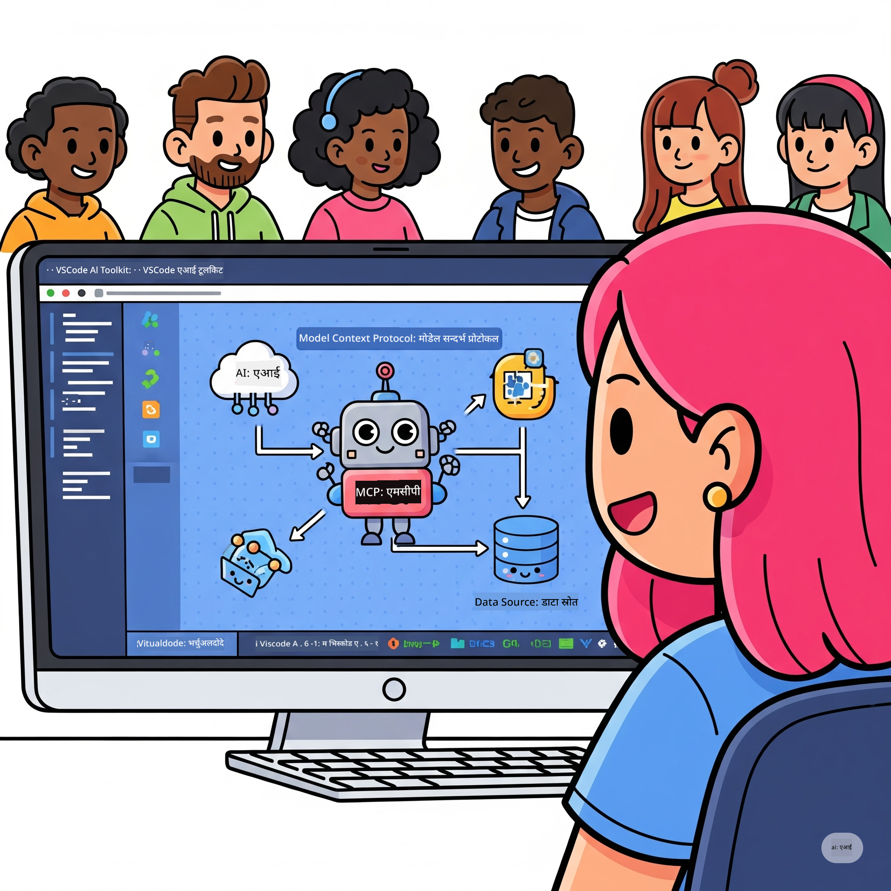

<!--
CO_OP_TRANSLATOR_METADATA:
{
  "original_hash": "1b000fd6e1b04c047578bfc5d07d54eb",
  "translation_date": "2025-08-18T16:20:22+00:00",
  "source_file": "10-StreamliningAIWorkflowsBuildingAnMCPServerWithAIToolkit/README.md",
  "language_code": "ne"
}
-->
# एआई कार्यप्रवाहलाई सरल बनाउँदै: एआई टूलकिटको साथ MCP सर्भर निर्माण

## 🎯  अवलोकन

_(यो पाठको भिडियो हेर्न माथिको तस्बिरमा क्लिक गर्नुहोस्)_

**मोडेल कन्टेक्स्ट प्रोटोकल (MCP) कार्यशाला**मा स्वागत छ! यो व्यापक व्यावहारिक कार्यशालाले दुई अत्याधुनिक प्रविधिहरूलाई संयोजन गरी एआई एप्लिकेसन विकासमा क्रान्ति ल्याउँछ:

- **🔗 मोडेल कन्टेक्स्ट प्रोटोकल (MCP)**: एआई उपकरणहरूको सहज एकीकरणका लागि खुला मानक
- **🛠️ भिजुअल स्टुडियो कोडका लागि एआई टूलकिट (AITK)**: माइक्रोसफ्टको शक्तिशाली एआई विकास एक्सटेन्सन

### 🎓 तपाईंले के सिक्नुहुनेछ

यो कार्यशाला पूरा गर्दा, तपाईंले एआई मोडेलहरूलाई वास्तविक संसारका उपकरण र सेवाहरूसँग जोड्ने बौद्धिक एप्लिकेसन निर्माण गर्ने कला सिक्नुहुनेछ। स्वचालित परीक्षणदेखि अनुकूलित API एकीकरणसम्म, तपाईंले जटिल व्यापार चुनौतीहरू समाधान गर्न व्यावहारिक सीपहरू प्राप्त गर्नुहुनेछ।

## 🏗️ प्रविधि स्ट्याक

### 🔌 मोडेल कन्टेक्स्ट प्रोटोकल (MCP)

MCP भनेको एआईको लागि **"USB-C"** हो - यो एक सार्वभौमिक मानक हो जसले एआई मोडेलहरूलाई बाह्य उपकरण र डाटा स्रोतहरूसँग जोड्छ।

**✨ मुख्य विशेषताहरू:**

- 🔄 **मानकीकृत एकीकरण**: एआई उपकरणहरूको लागि सार्वभौमिक इन्टरफेस
- 🏛️ **लचिलो आर्किटेक्चर**: स्थानीय र रिमोट सर्भरहरू stdio/SSE ट्रान्सपोर्टमार्फत
- 🧰 **समृद्ध इकोसिस्टम**: उपकरण, प्रम्प्ट, र स्रोतहरू एउटै प्रोटोकलमा
- 🔒 **उद्यम-तयार**: सुरक्षा र विश्वसनीयता निर्मित

**🎯 MCP किन महत्त्वपूर्ण छ:**
जसरी USB-C ले केबलको झन्झट हटायो, MCP ले एआई एकीकरणको जटिलता हटाउँछ। एउटै प्रोटोकल, अनन्त सम्भावनाहरू।

### 🤖 भिजुअल स्टुडियो कोडका लागि एआई टूलकिट (AITK)

माइक्रोसफ्टको प्रमुख एआई विकास एक्सटेन्सन जसले VS Code लाई एआई पावरहाउसमा रूपान्तरण गर्दछ।

**🚀 मुख्य क्षमताहरू:**

- 📦 **मोडेल क्याटलग**: Azure AI, GitHub, Hugging Face, Ollama बाट मोडेलहरू पहुँच गर्नुहोस्
- ⚡ **स्थानीय इनफरेन्स**: ONNX-अप्टिमाइज्ड CPU/GPU/NPU कार्यान्वयन
- 🏗️ **एजेन्ट बिल्डर**: MCP एकीकरणको साथ दृश्यात्मक एआई एजेन्ट विकास
- 🎭 **मल्टि-मोडल**: पाठ, दृष्टि, र संरचित आउटपुट समर्थन

**💡 विकासका फाइदाहरू:**

- शून्य-कन्फिग मोडेल परिनियोजन
- दृश्यात्मक प्रम्प्ट इन्जिनियरिङ
- वास्तविक-समय परीक्षण खेल मैदान
- MCP सर्भरको सहज एकीकरण

## 📚 सिकाइ यात्रा

### [🚀 मोड्युल १: एआई टूलकिटको आधारभूत कुरा](./lab1/README.md)

**अवधि**: १५ मिनेट

- 🛠️ भिजुअल स्टुडियो कोडका लागि एआई टूलकिट स्थापना र कन्फिगर गर्नुहोस्
- 🗂️ मोडेल क्याटलग अन्वेषण गर्नुहोस् (GitHub, ONNX, OpenAI, Anthropic, Google बाट १००+ मोडेलहरू)
- 🎮 वास्तविक-समय मोडेल परीक्षणका लागि इन्टरएक्टिभ खेल मैदानमा महारत हासिल गर्नुहोस्
- 🤖 एजेन्ट बिल्डरको साथ आफ्नो पहिलो एआई एजेन्ट निर्माण गर्नुहोस्
- 📊 निर्मित मेट्रिक्स (F1, प्रासंगिकता, समानता, सुसंगतता) को साथ मोडेल प्रदर्शन मूल्याङ्कन गर्नुहोस्
- ⚡ ब्याच प्रोसेसिङ र मल्टि-मोडल समर्थन क्षमताहरू सिक्नुहोस्

**🎯 सिकाइ परिणाम**: AITK क्षमताहरूको व्यापक बुझाइका साथ कार्यात्मक एआई एजेन्ट सिर्जना गर्नुहोस्

### [🌐 मोड्युल २: MCP र एआई टूलकिटको आधारभूत कुरा](./lab2/README.md)

**अवधि**: २० मिनेट

- 🧠 मोडेल कन्टेक्स्ट प्रोटोकल (MCP) आर्किटेक्चर र अवधारणाहरूमा महारत हासिल गर्नुहोस्
- 🌐 माइक्रोसफ्टको MCP सर्भर इकोसिस्टम अन्वेषण गर्नुहोस्
- 🤖 Playwright MCP सर्भर प्रयोग गरेर ब्राउजर अटोमेसन एजेन्ट निर्माण गर्नुहोस्
- 🔧 MCP सर्भरहरूलाई एआई टूलकिट एजेन्ट बिल्डरसँग एकीकृत गर्नुहोस्
- 📊 आफ्नो एजेन्टहरूमा MCP उपकरणहरू कन्फिगर र परीक्षण गर्नुहोस्
- 🚀 उत्पादन प्रयोगका लागि MCP-संचालित एजेन्टहरू निर्यात र परिनियोजन गर्नुहोस्

**🎯 सिकाइ परिणाम**: बाह्य उपकरणहरूसँग सुपरचार्ज गरिएको एआई एजेन्ट परिनियोजन गर्नुहोस्

### [🔧 मोड्युल ३: एआई टूलकिटको साथ उन्नत MCP विकास](./lab3/README.md)

**अवधि**: २० मिनेट

- 💻 एआई टूलकिट प्रयोग गरेर अनुकूलित MCP सर्भरहरू सिर्जना गर्नुहोस्
- 🐍 नवीनतम MCP Python SDK (v1.9.3) कन्फिगर र प्रयोग गर्नुहोस्
- 🔍 डिबगिङका लागि MCP Inspector सेटअप र उपयोग गर्नुहोस्
- 🛠️ व्यावसायिक डिबगिङ कार्यप्रवाहहरूसँग वेदर MCP सर्भर निर्माण गर्नुहोस्
- 🧪 एजेन्ट बिल्डर र इन्स्पेक्टर वातावरणमा MCP सर्भरहरू डिबग गर्नुहोस्

**🎯 सिकाइ परिणाम**: आधुनिक उपकरणहरूसँग अनुकूलित MCP सर्भरहरू विकास र डिबग गर्नुहोस्

### [🐙 मोड्युल ४: व्यावहारिक MCP विकास - अनुकूलित GitHub क्लोन सर्भर](./lab4/README.md)

**अवधि**: ३० मिनेट

- 🏗️ विकास कार्यप्रवाहका लागि वास्तविक-विश्व GitHub क्लोन MCP सर्भर निर्माण गर्नुहोस्
- 🔄 मान्यकरण र त्रुटि ह्यान्डलिङको साथ स्मार्ट रिपोजिटरी क्लोनिङ कार्यान्वयन गर्नुहोस्
- 📁 बौद्धिक डाइरेक्टरी व्यवस्थापन र VS Code एकीकरण सिर्जना गर्नुहोस्
- 🤖 अनुकूलित MCP उपकरणहरूसँग GitHub Copilot एजेन्ट मोड प्रयोग गर्नुहोस्
- 🛡️ उत्पादन-तयार विश्वसनीयता र क्रस-प्ल्याटफर्म अनुकूलता लागू गर्नुहोस्

**🎯 सिकाइ परिणाम**: उत्पादन-तयार MCP सर्भर परिनियोजन गर्नुहोस् जसले वास्तविक विकास कार्यप्रवाहलाई सरल बनाउँछ

## 💡 वास्तविक-विश्व अनुप्रयोगहरू र प्रभाव

### 🏢 उद्यम प्रयोगका केसहरू

#### 🔄 DevOps अटोमेसन

तपाईंको विकास कार्यप्रवाहलाई बौद्धिक अटोमेसनसँग रूपान्तरण गर्नुहोस्:

- **स्मार्ट रिपोजिटरी व्यवस्थापन**: एआई-चालित कोड समीक्षा र मर्ज निर्णयहरू
- **बौद्धिक CI/CD**: कोड परिवर्तनहरूमा आधारित स्वचालित पाइपलाइन अनुकूलन
- **इश्यू ट्रायज**: स्वचालित बग वर्गीकरण र असाइनमेन्ट

#### 🧪 गुणस्तर आश्वासन क्रान्ति

एआई-संचालित अटोमेसनसँग परीक्षणलाई उचाइमा पुर्‍याउनुहोस्:

- **बौद्धिक परीक्षण उत्पादन**: व्यापक परीक्षण सूटहरू स्वचालित रूपमा सिर्जना गर्नुहोस्
- **दृश्य प्रतिगमन परीक्षण**: एआई-संचालित UI परिवर्तन पत्ता लगाउने
- **प्रदर्शन अनुगमन**: सक्रिय रूपमा समस्या पहिचान र समाधान

#### 📊 डाटा पाइपलाइन बुद्धिमत्ता

स्मार्ट डाटा प्रोसेसिङ कार्यप्रवाहहरू निर्माण गर्नुहोस्:

- **अनुकूलनशील ETL प्रक्रिया**: आत्म-अनुकूलन डाटा रूपान्तरणहरू
- **असामान्यता पत्ता लगाउने**: वास्तविक-समय डाटा गुणस्तर अनुगमन
- **बौद्धिक रुटिङ**: स्मार्ट डाटा फ्लो व्यवस्थापन

#### 🎧 ग्राहक अनुभव सुधार

असाधारण ग्राहक अन्तरक्रियाहरू सिर्जना गर्नुहोस्:

- **प्रसङ्ग-सचेत समर्थन**: ग्राहक इतिहासमा पहुँच भएको एआई एजेन्टहरू
- **प्रोएक्टिभ समस्या समाधान**: पूर्वानुमानात्मक ग्राहक सेवा
- **मल्टि-च्यानल एकीकरण**: प्लेटफर्महरूमा एकीकृत एआई अनुभव

## 🛠️ पूर्वाधार र सेटअप

### 💻 प्रणाली आवश्यकताहरू

| कम्पोनेन्ट | आवश्यकताहरू | नोट्स |
|-----------|-------------|-------|
| **अपरेटिङ सिस्टम** | Windows 10+, macOS 10.15+, Linux | कुनै पनि आधुनिक OS |
| **भिजुअल स्टुडियो कोड** | नवीनतम स्थिर संस्करण | AITK को लागि आवश्यक |
| **Node.js** | v18.0+ र npm | MCP सर्भर विकासका लागि |
| **Python** | 3.10+ | वैकल्पिक Python MCP सर्भरहरूको लागि |
| **मेमोरी** | न्यूनतम 8GB RAM | स्थानीय मोडेलहरूको लागि 16GB सिफारिस गरिएको |

### 🔧 विकास वातावरण

#### सिफारिस गरिएका VS Code एक्सटेन्सनहरू

- **AI Toolkit** (ms-windows-ai-studio.windows-ai-studio)
- **Python** (ms-python.python)
- **Python Debugger** (ms-python.debugpy)
- **GitHub Copilot** (GitHub.copilot) - वैकल्पिक तर उपयोगी

#### वैकल्पिक उपकरणहरू

- **uv**: आधुनिक Python प्याकेज प्रबन्धक
- **MCP Inspector**: MCP सर्भरहरूको लागि दृश्यात्मक डिबगिङ उपकरण
- **Playwright**: वेब अटोमेसन उदाहरणहरूको लागि

## 🎖️ सिकाइ परिणामहरू र प्रमाणपत्र मार्ग

### 🏆 सीप महारत चेकलिस्ट

यो कार्यशाला पूरा गरेर, तपाईंले निम्न सीपहरूमा महारत हासिल गर्नुहुनेछ:

#### 🎯 मुख्य दक्षताहरू

- [ ] **MCP प्रोटोकल महारत**: आर्किटेक्चर र कार्यान्वयन ढाँचाहरूको गहिरो बुझाइ
- [ ] **AITK दक्षता**: छिटो विकासका लागि एआई टूलकिटको विशेषज्ञ-स्तर प्रयोग
- [ ] **अनुकूलित सर्भर विकास**: MCP सर्भरहरू निर्माण, परिनियोजन, र मर्मत गर्नुहोस्
- [ ] **उपकरण एकीकरण उत्कृष्टता**: एआईलाई विद्यमान विकास कार्यप्रवाहहरूसँग सहज रूपमा जोड्नुहोस्
- [ ] **समस्या समाधान अनुप्रयोग**: सिकेका सीपहरूलाई वास्तविक व्यापार चुनौतीहरूमा लागू गर्नुहोस्

#### 🔧 प्राविधिक सीपहरू

- [ ] VS Code मा एआई टूलकिट सेटअप र कन्फिगर गर्नुहोस्
- [ ] अनुकूलित MCP सर्भरहरू डिजाइन र कार्यान्वयन गर्नुहोस्
- [ ] MCP आर्किटेक्चरसँग GitHub मोडेलहरू एकीकृत गर्नुहोस्
- [ ] Playwright प्रयोग गरेर स्वचालित परीक्षण कार्यप्रवाहहरू निर्माण गर्नुहोस्
- [ ] उत्पादन प्रयोगका लागि एआई एजेन्टहरू परिनियोजन गर्नुहोस्
- [ ] MCP सर्भर प्रदर्शन डिबग र अनुकूलित गर्नुहोस्

#### 🚀 उन्नत क्षमताहरू

- [ ] उद्यम-स्तरको एआई एकीकरण आर्किटेक्चर डिजाइन गर्नुहोस्
- [ ] एआई एप्लिकेसनहरूको लागि सुरक्षा उत्तम अभ्यासहरू कार्यान्वयन गर्नुहोस्
- [ ] मापनयोग्य MCP सर्भर आर्किटेक्चरहरू डिजाइन गर्नुहोस्
- [ ] विशिष्ट डोमेनहरूको लागि अनुकूलित उपकरण चेनहरू सिर्जना गर्नुहोस्
- [ ] एआई-देशी विकासमा अरूलाई मार्गदर्शन गर्नुहोस्

## 📖 थप स्रोतहरू

- [MCP विशिष्टता](https://modelcontextprotocol.io/docs)
- [AI टूलकिट GitHub रिपोजिटरी](https://github.com/microsoft/vscode-ai-toolkit)
- [नमूना MCP सर्भरहरूको सङ्ग्रह](https://github.com/modelcontextprotocol/servers)
- [उत्तम अभ्यास मार्गदर्शिका](https://modelcontextprotocol.io/docs/best-practices)

---

**🚀 के तपाईं आफ्नो एआई विकास कार्यप्रवाहलाई क्रान्तिकारी बनाउन तयार हुनुहुन्छ?**

MCP र एआई टूलकिटको साथ बौद्धिक एप्लिकेसनहरूको भविष्य निर्माण गरौं!

**अस्वीकरण**:  
यो दस्तावेज़ AI अनुवाद सेवा [Co-op Translator](https://github.com/Azure/co-op-translator) प्रयोग गरेर अनुवाद गरिएको छ। हामी यथार्थताको लागि प्रयास गर्छौं, तर कृपया ध्यान दिनुहोस् कि स्वचालित अनुवादमा त्रुटिहरू वा अशुद्धताहरू हुन सक्छ। यसको मूल भाषा मा रहेको मूल दस्तावेज़लाई आधिकारिक स्रोत मानिनुपर्छ। महत्वपूर्ण जानकारीको लागि, व्यावसायिक मानव अनुवाद सिफारिस गरिन्छ। यस अनुवादको प्रयोगबाट उत्पन्न हुने कुनै पनि गलतफहमी वा गलत व्याख्याको लागि हामी जिम्मेवार हुने छैनौं।