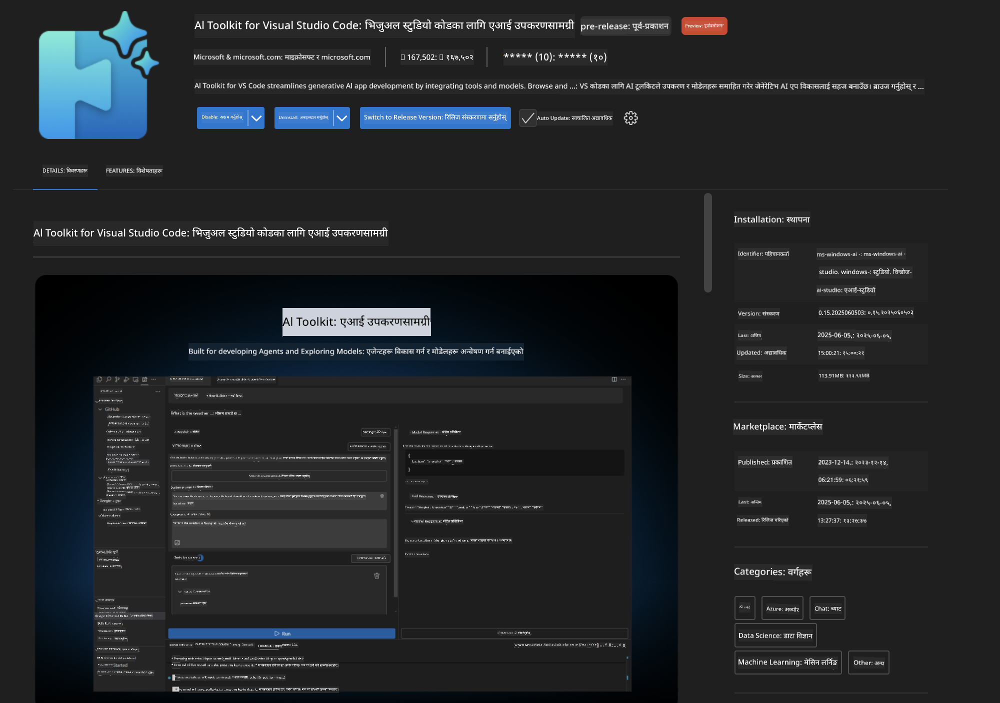
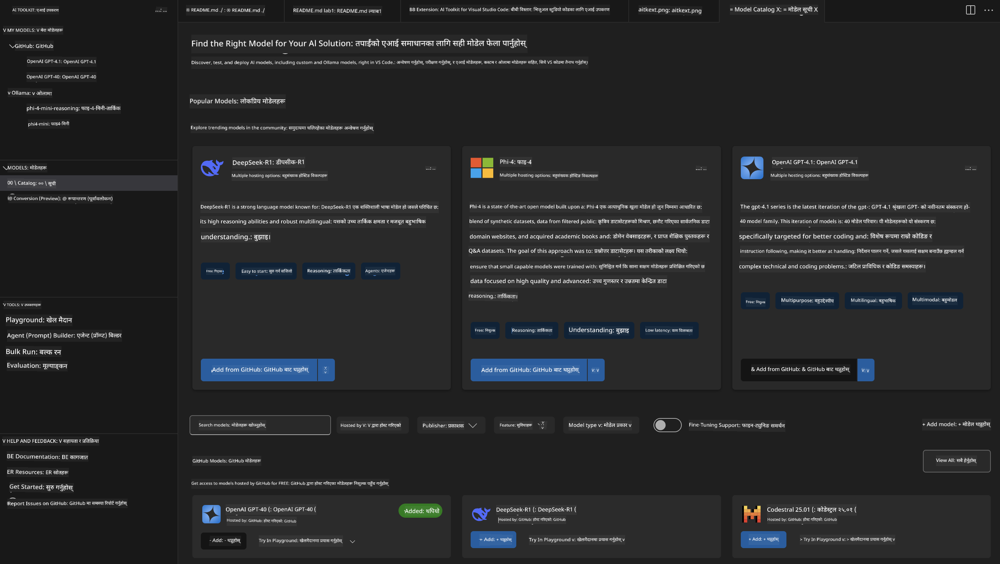
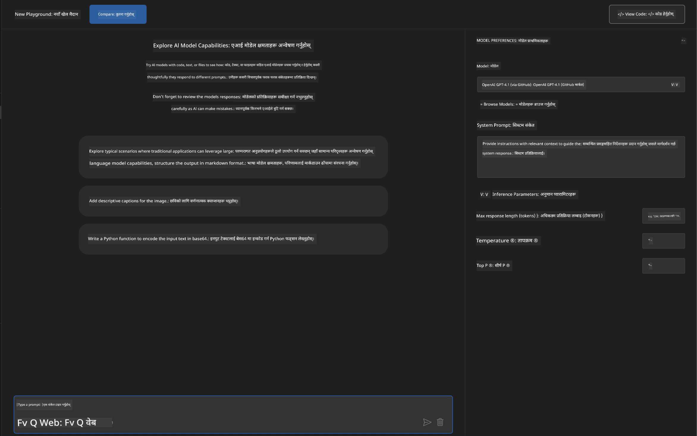
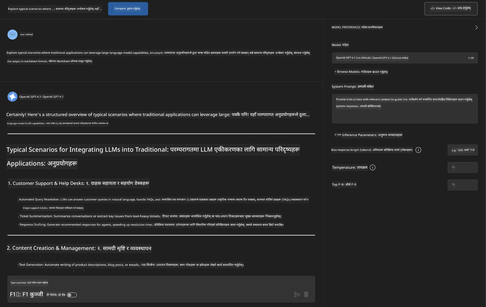
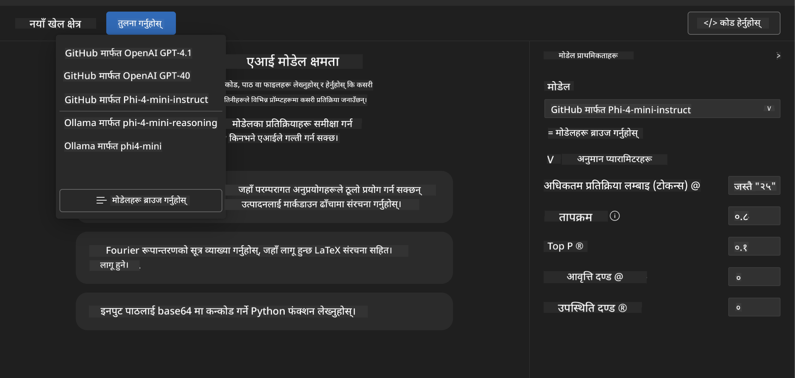
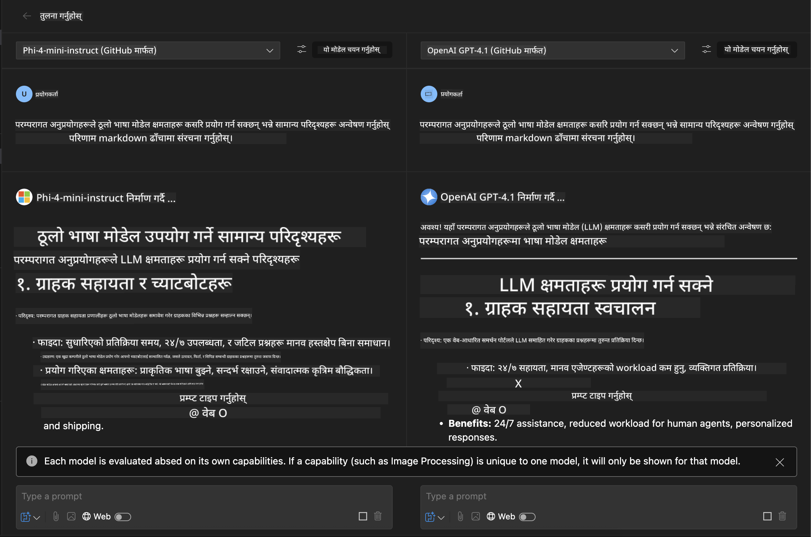
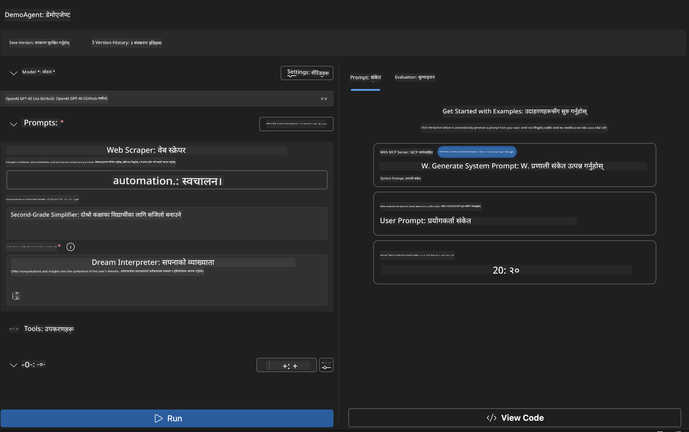
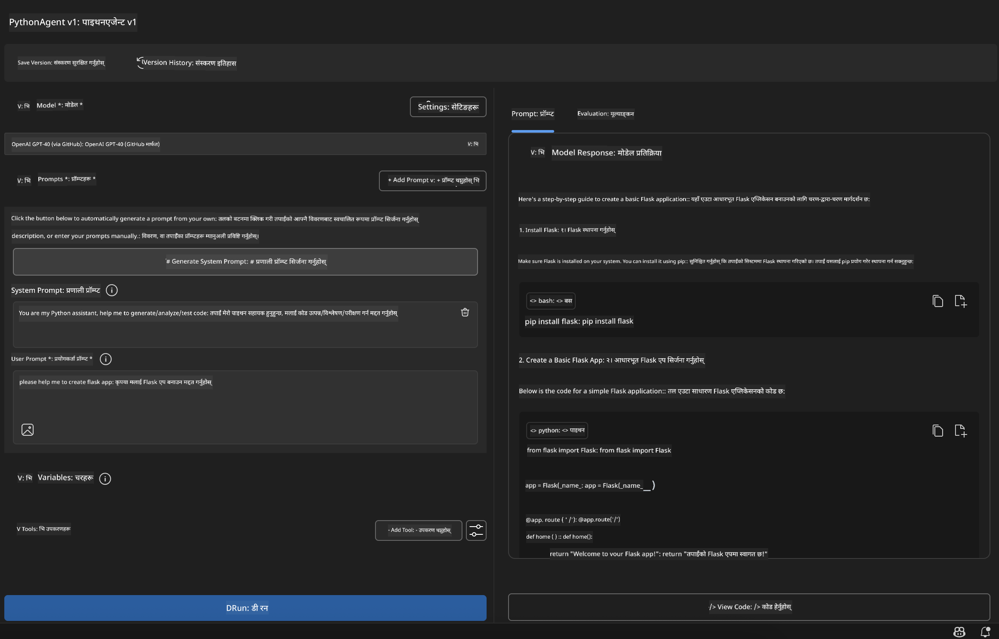

<!--
CO_OP_TRANSLATOR_METADATA:
{
  "original_hash": "2aa9dbc165e104764fa57e8a0d3f1c73",
  "translation_date": "2025-07-14T07:24:04+00:00",
  "source_file": "10-StreamliningAIWorkflowsBuildingAnMCPServerWithAIToolkit/lab1/README.md",
  "language_code": "ne"
}
-->
# 🚀 मोड्युल १: AI Toolkit को आधारभूत कुरा

[]()
[]()
[]()

## 📋 सिकाइका उद्देश्यहरू

यस मोड्युलको अन्त्यसम्म, तपाईं सक्षम हुनुहुनेछ:
- ✅ Visual Studio Code का लागि AI Toolkit इन्स्टल र कन्फिगर गर्न
- ✅ Model Catalog मा नेभिगेट गरी विभिन्न मोडेल स्रोतहरू बुझ्न
- ✅ Playground मा मोडेल परीक्षण र प्रयोग गर्न
- ✅ Agent Builder प्रयोग गरी कस्टम AI एजेन्टहरू सिर्जना गर्न
- ✅ विभिन्न प्रदायकहरूका मोडेल प्रदर्शन तुलना गर्न
- ✅ prompt engineering का लागि उत्कृष्ट अभ्यासहरू लागू गर्न

## 🧠 AI Toolkit (AITK) परिचय

**Visual Studio Code का लागि AI Toolkit** माइक्रोसफ्टको प्रमुख एक्सटेन्सन हो जसले VS Code लाई पूर्ण AI विकास वातावरणमा रूपान्तरण गर्छ। यसले AI अनुसन्धान र व्यावहारिक अनुप्रयोग विकासबीचको दूरी घटाउँछ, र सबै स्तरका विकासकर्ताहरूका लागि जनरेटिभ AI पहुँचयोग्य बनाउँछ।

### 🌟 मुख्य क्षमताहरू

| सुविधा | विवरण | प्रयोग केस |
|---------|-------------|----------|
| **🗂️ Model Catalog** | GitHub, ONNX, OpenAI, Anthropic, Google बाट १००+ मोडेलहरू पहुँच | मोडेल खोज र छनोट |
| **🔌 BYOM Support** | आफ्नै मोडेलहरू (स्थानीय/दूरस्थ) समावेश गर्न सकिन्छ | कस्टम मोडेल तैनाथीकरण |
| **🎮 Interactive Playground** | च्याट इन्टरफेससहित वास्तविक-समय मोडेल परीक्षण | छिटो प्रोटोटाइप र परीक्षण |
| **📎 Multi-Modal Support** | टेक्स्ट, छवि, र अट्याचमेन्टहरू सम्हाल्न सकिन्छ | जटिल AI अनुप्रयोगहरू |
| **⚡ Batch Processing** | एकैपटक धेरै प्रॉम्प्टहरू चलाउन सकिन्छ | प्रभावकारी परीक्षण कार्यप्रवाह |
| **📊 Model Evaluation** | बिल्ट-इन मेट्रिक्स (F1, सान्दर्भिकता, समानता, सुसंगतता) | प्रदर्शन मूल्याङ्कन |

### 🎯 किन AI Toolkit महत्वपूर्ण छ

- **🚀 छिटो विकास**: विचारदेखि प्रोटोटाइपसम्म केही मिनेटमै
- **🔄 एकीकृत कार्यप्रवाह**: धेरै AI प्रदायकहरूको लागि एउटै इन्टरफेस
- **🧪 सजिलो प्रयोग**: जटिल सेटअप बिना मोडेलहरू तुलना गर्न सकिन्छ
- **📈 उत्पादन तयार**: प्रोटोटाइपबाट तैनाथीकरणसम्म सहज रूपान्तरण

## 🛠️ पूर्वआवश्यकता र सेटअप

### 📦 AI Toolkit एक्सटेन्सन इन्स्टल गर्नुहोस्

**चरण १: एक्सटेन्सन मार्केटप्लेसमा जानुहोस्**
1. Visual Studio Code खोल्नुहोस्
2. एक्सटेन्सन दृश्यमा जानुहोस् (`Ctrl+Shift+X` वा `Cmd+Shift+X`)
3. "AI Toolkit" खोज्नुहोस्

**चरण २: आफ्नो संस्करण छान्नुहोस्**
- **🟢 Release**: उत्पादन प्रयोगका लागि सिफारिस गरिएको
- **🔶 Pre-release**: नयाँ सुविधाहरूको प्रारम्भिक पहुँच

**चरण ३: इन्स्टल र सक्रिय गर्नुहोस्**



### ✅ प्रमाणीकरण जाँचसूची
- [ ] AI Toolkit आइकन VS Code साइडबारमा देखिन्छ
- [ ] एक्सटेन्सन सक्षम र सक्रिय छ
- [ ] आउटपुट प्यानलमा कुनै इन्स्टलेशन त्रुटि छैन

## 🧪 व्यावहारिक अभ्यास १: GitHub मोडेलहरू अन्वेषण

**🎯 उद्देश्य**: Model Catalog मा दक्षता हासिल गरी पहिलो AI मोडेल परीक्षण गर्नुहोस्

### 📊 चरण १: Model Catalog मा नेभिगेट गर्नुहोस्

Model Catalog तपाईंको AI इकोसिस्टमको प्रवेशद्वार हो। यसले विभिन्न प्रदायकहरूबाट मोडेलहरू सङ्कलन गर्छ, जसले विकल्पहरू सजिलै पत्ता लगाउन र तुलना गर्न मद्दत गर्छ।

**🔍 नेभिगेशन मार्गदर्शन:**

AI Toolkit साइडबारमा **MODELS - Catalog** मा क्लिक गर्नुहोस्



**💡 सुझाव**: आफ्नो प्रयोग केससँग मेल खाने विशेष क्षमताहरू भएका मोडेलहरू खोज्नुहोस् (जस्तै, कोड जेनेरेशन, सिर्जनात्मक लेखन, विश्लेषण)।

**⚠️ Note**: GitHub-होस्ट गरिएका मोडेलहरू (GitHub Models) निःशुल्क प्रयोग गर्न सकिन्छ तर अनुरोध र टोकनमा दर सीमाहरू लागू हुन्छन्। यदि तपाईं गैर-GitHub मोडेलहरू (जस्तै Azure AI वा अन्य एन्डपोइन्टहरूमा होस्ट गरिएका) पहुँच गर्न चाहनुहुन्छ भने, उपयुक्त API कुञ्जी वा प्रमाणीकरण आवश्यक पर्छ।

### 🚀 चरण २: पहिलो मोडेल थप्नुहोस् र कन्फिगर गर्नुहोस्

**मोडेल छनोट रणनीति:**
- **GPT-4.1**: जटिल तर्क र विश्लेषणका लागि उत्तम
- **Phi-4-mini**: हल्का, छिटो प्रतिक्रिया दिने सरल कार्यहरूका लागि

**🔧 कन्फिगरेसन प्रक्रिया:**
1. Catalog बाट **OpenAI GPT-4.1** छान्नुहोस्
2. **Add to My Models** मा क्लिक गर्नुहोस् - यसले मोडेल प्रयोगका लागि दर्ता गर्छ
3. **Try in Playground** छान्नुहोस् र परीक्षण वातावरण सुरु गर्नुहोस्
4. मोडेल सुरु हुन कुर्नुहोस् (पहिलो पटक सेटअपमा केही समय लाग्न सक्छ)



**⚙️ मोडेल प्यारामिटरहरू बुझ्नुहोस्:**
- **Temperature**: सिर्जनशीलता नियन्त्रण (0 = निश्चित, 1 = सिर्जनात्मक)
- **Max Tokens**: अधिकतम प्रतिक्रिया लम्बाइ
- **Top-p**: प्रतिक्रिया विविधताका लागि न्युक्लियस स्याम्पलिङ

### 🎯 चरण ३: Playground इन्टरफेसमा दक्षता हासिल गर्नुहोस्

Playground तपाईंको AI प्रयोगशाला हो। यसको अधिकतम उपयोग कसरी गर्ने:

**🎨 Prompt Engineering का उत्कृष्ट अभ्यासहरू:**
1. **विशिष्ट हुनुहोस्**: स्पष्ट, विस्तृत निर्देशनले राम्रो नतिजा दिन्छ
2. **सन्दर्भ दिनुहोस्**: सम्बन्धित पृष्ठभूमि जानकारी समावेश गर्नुहोस्
3. **उदाहरणहरू प्रयोग गर्नुहोस्**: मोडेललाई के चाहिन्छ भनेर उदाहरणले देखाउनुहोस्
4. **पुनरावृत्ति गर्नुहोस्**: प्रारम्भिक नतिजाका आधारमा प्रॉम्प्ट सुधार गर्नुहोस्

**🧪 परीक्षण परिदृश्यहरू:**
```markdown
# Example 1: Code Generation
"Write a Python function that calculates the factorial of a number using recursion. Include error handling and docstrings."

# Example 2: Creative Writing
"Write a professional email to a client explaining a project delay, maintaining a positive tone while being transparent about challenges."

# Example 3: Data Analysis
"Analyze this sales data and provide insights: [paste your data]. Focus on trends, anomalies, and actionable recommendations."
```



### 🏆 चुनौती अभ्यास: मोडेल प्रदर्शन तुलना

**🎯 लक्ष्य**: समान प्रॉम्प्टहरू प्रयोग गरी विभिन्न मोडेलहरूको शक्ति बुझ्न तुलना गर्नुहोस्

**📋 निर्देशनहरू:**
1. आफ्नो कार्यक्षेत्रमा **Phi-4-mini** थप्नुहोस्
2. GPT-4.1 र Phi-4-mini दुवैमा एउटै प्रॉम्प्ट प्रयोग गर्नुहोस्



3. प्रतिक्रिया गुणस्तर, गति, र शुद्धता तुलना गर्नुहोस्
4. नतिजा खण्डमा आफ्नो निष्कर्षहरू लेख्नुहोस्



**💡 पत्ता लगाउनुपर्ने मुख्य कुरा:**
- LLM र SLM कहिले प्रयोग गर्ने
- लागत र प्रदर्शन बीचको सन्तुलन
- विभिन्न मोडेलहरूको विशेष क्षमताहरू

## 🤖 व्यावहारिक अभ्यास २: Agent Builder प्रयोग गरी कस्टम एजेन्टहरू बनाउने

**🎯 उद्देश्य**: विशेष कार्य र कार्यप्रवाहका लागि अनुकूलित AI एजेन्टहरू सिर्जना गर्नुहोस्

### 🏗️ चरण १: Agent Builder बुझ्नुहोस्

Agent Builder AI Toolkit को सबैभन्दा महत्वपूर्ण भाग हो। यसले तपाईंलाई ठूलो भाषा मोडेलहरूको शक्ति कस्टम निर्देशन, विशेष प्यारामिटरहरू, र विशेषज्ञ ज्ञानसँग जोडेर उद्देश्य-निर्मित AI सहायकहरू बनाउन अनुमति दिन्छ।

**🧠 Agent संरचना कम्पोनेन्टहरू:**
- **Core Model**: आधारभूत LLM (GPT-4, Groks, Phi, आदि)
- **System Prompt**: एजेन्टको व्यक्तित्व र व्यवहार परिभाषित गर्ने
- **Parameters**: उत्कृष्ट प्रदर्शनका लागि सूक्ष्म समायोजनहरू
- **Tools Integration**: बाह्य API र MCP सेवासँग जडान
- **Memory**: संवाद सन्दर्भ र सत्र स्थायित्व



### ⚙️ चरण २: एजेन्ट कन्फिगरेसन गहिराइमा

**🎨 प्रभावकारी System Prompt सिर्जना:**
```markdown
# Template Structure:
## Role Definition
You are a [specific role] with expertise in [domain].

## Capabilities
- List specific abilities
- Define scope of knowledge
- Clarify limitations

## Behavior Guidelines
- Response style (formal, casual, technical)
- Output format preferences
- Error handling approach

## Examples
Provide 2-3 examples of ideal interactions
```

*पक्कै पनि, Generate System Prompt प्रयोग गरेर AI को मद्दतले प्रॉम्प्टहरू सिर्जना र अनुकूलन गर्न सक्नुहुन्छ*

**🔧 प्यारामिटर अनुकूलन:**
| प्यारामिटर | सिफारिस गरिएको दायरा | प्रयोग केस |
|-----------|------------------|----------|
| **Temperature** | 0.1-0.3 | प्राविधिक/तथ्यात्मक प्रतिक्रिया |
| **Temperature** | 0.7-0.9 | सिर्जनात्मक/विचार मन्थन कार्यहरू |
| **Max Tokens** | ५००-१००० | संक्षिप्त प्रतिक्रिया |
| **Max Tokens** | २०००-४००० | विस्तृत व्याख्या |

### 🐍 चरण ३: व्यावहारिक अभ्यास - Python प्रोग्रामिङ एजेन्ट

**🎯 मिशन**: विशेष Python कोडिङ सहायक बनाउनुहोस्

**📋 कन्फिगरेसन चरणहरू:**

1. **मोडेल चयन**: **Claude 3.5 Sonnet** छान्नुहोस् (कोडका लागि उत्कृष्ट)

2. **System Prompt डिजाइन**:
```markdown
# Python Programming Expert Agent

## Role
You are a senior Python developer with 10+ years of experience. You excel at writing clean, efficient, and well-documented Python code.

## Capabilities
- Write production-ready Python code
- Debug complex issues
- Explain code concepts clearly
- Suggest best practices and optimizations
- Provide complete working examples

## Response Format
- Always include docstrings
- Add inline comments for complex logic
- Suggest testing approaches
- Mention relevant libraries when applicable

## Code Quality Standards
- Follow PEP 8 style guidelines
- Use type hints where appropriate
- Handle exceptions gracefully
- Write readable, maintainable code
```

3. **प्यारामिटर कन्फिगरेसन**:
   - Temperature: 0.2 (सुसंगत, भरपर्दो कोडका लागि)
   - Max Tokens: 2000 (विस्तृत व्याख्या)
   - Top-p: 0.9 (सन्तुलित सिर्जनशीलता)



### 🧪 चरण ४: आफ्नो Python एजेन्ट परीक्षण गर्नुहोस्

**परीक्षण परिदृश्यहरू:**
1. **आधारभूत कार्य**: "प्राइम नम्बर फेला पार्ने फङ्सन बनाउनुहोस्"
2. **जटिल एल्गोरिदम**: "इनसर्ट, डिलिट, र सर्च मेथडसहित बाइनरी सर्च ट्री कार्यान्वयन गर्नुहोस्"
3. **वास्तविक समस्या**: "रेट लिमिटिङ र पुन: प्रयासहरू सम्हाल्ने वेब स्क्र्यापर बनाउनुहोस्"
4. **डिबगिङ**: "यो कोड ठीक गर्नुहोस् [बगयुक्त कोड टाँस्नुहोस्]"

**🏆 सफलताको मापदण्ड:**
- ✅ कोड त्रुटि बिना चल्छ
- ✅ उचित कागजात समावेश छ
- ✅ Python का उत्कृष्ट अभ्यासहरू पालना गरिएको छ
- ✅ स्पष्ट व्याख्या प्रदान गर्दछ
- ✅ सुधारका सुझावहरू दिन्छ

## 🎓 मोड्युल १ समापन र आगामी कदमहरू

### 📊 ज्ञान जाँच

आफ्नो बुझाइ परीक्षण गर्नुहोस्:
- [ ] के तपाईं Catalog मा मोडेलहरूको भिन्नता व्याख्या गर्न सक्नुहुन्छ?
- [ ] के तपाईंले सफलतापूर्वक कस्टम एजेन्ट सिर्जना र परीक्षण गर्नुभएको छ?
- [ ] के तपाईं विभिन्न प्रयोग केसका लागि प्यारामिटरहरू कसरी अनुकूलन गर्ने बुझ्नुहुन्छ?
- [ ] के तपाईं प्रभावकारी System Prompt डिजाइन गर्न सक्नुहुन्छ?

### 📚 थप स्रोतहरू

- **AI Toolkit कागजात**: [Official Microsoft Docs](https://github.com/microsoft/vscode-ai-toolkit)
- **Prompt Engineering मार्गदर्शन**: [Best Practices](https://platform.openai.com/docs/guides/prompt-engineering)
- **AI Toolkit मा मोडेलहरू**: [Models in Development](https://github.com/microsoft/vscode-ai-toolkit/blob/main/doc/models.md)

**🎉 बधाई छ!** तपाईंले AI Toolkit का आधारभूत कुरा सिक्नुभयो र अझ उन्नत AI अनुप्रयोगहरू बनाउन तयार हुनुहुन्छ!

### 🔜 अर्को मोड्युलमा जानुहोस्

अझ उन्नत क्षमताहरूका लागि तयार हुनुहुन्छ? **[मोड्युल २: MCP with AI Toolkit Fundamentals](../lab2/README.md)** मा जानुहोस् जहाँ तपाईं सिक्नुहुनेछ:
- Model Context Protocol (MCP) प्रयोग गरी एजेन्टहरूलाई बाह्य उपकरणहरूसँग कसरी जडान गर्ने
- Playwright प्रयोग गरी ब्राउजर अटोमेसन एजेन्टहरू बनाउने
- AI Toolkit एजेन्टहरूसँग MCP सर्भरहरू एकीकृत गर्ने
- बाह्य डेटा र क्षमताहरूले एजेन्टहरूलाई सुपरचार्ज गर्ने

**अस्वीकरण**:  
यो दस्तावेज AI अनुवाद सेवा [Co-op Translator](https://github.com/Azure/co-op-translator) प्रयोग गरी अनुवाद गरिएको हो। हामी शुद्धताका लागि प्रयासरत छौं, तर कृपया ध्यान दिनुहोस् कि स्वचालित अनुवादमा त्रुटि वा अशुद्धता हुन सक्छ। मूल दस्तावेज यसको मूल भाषामा आधिकारिक स्रोत मानिनुपर्छ। महत्वपूर्ण जानकारीका लागि व्यावसायिक मानव अनुवाद सिफारिस गरिन्छ। यस अनुवादको प्रयोगबाट उत्पन्न कुनै पनि गलतफहमी वा गलत व्याख्याका लागि हामी जिम्मेवार छैनौं।