<!--
CO_OP_TRANSLATOR_METADATA:
{
  "original_hash": "a22b7dd11cd7690f99f9195877cafdc3",
  "translation_date": "2025-07-14T07:47:44+00:00",
  "source_file": "10-StreamliningAIWorkflowsBuildingAnMCPServerWithAIToolkit/lab2/README.md",
  "language_code": "ne"
}
-->
# 🌐 मोड्युल २: AI Toolkit को साथ MCP को आधारभूत कुरा

[]()
[]()
[]()

## 📋 सिकाइका उद्देश्यहरू

यस मोड्युलको अन्त्यसम्म, तपाईं सक्षम हुनुहुनेछ:
- ✅ Model Context Protocol (MCP) को संरचना र फाइदाहरू बुझ्न
- ✅ Microsoft को MCP सर्भर इकोसिस्टम अन्वेषण गर्न
- ✅ MCP सर्भरहरूलाई AI Toolkit Agent Builder सँग एकीकृत गर्न
- ✅ Playwright MCP प्रयोग गरी कार्यक्षम ब्राउजर अटोमेसन एजेन्ट बनाउन
- ✅ आफ्नो एजेन्टहरू भित्र MCP उपकरणहरू कन्फिगर र परीक्षण गर्न
- ✅ उत्पादनका लागि MCP-संचालित एजेन्टहरू निर्यात र तैनाथ गर्न

## 🎯 मोड्युल १ मा आधारित

मोड्युल १ मा, हामीले AI Toolkit का आधारभूत कुरा सिक्यौं र हाम्रो पहिलो Python एजेन्ट बनायौं। अब हामी तपाईंका एजेन्टहरूलाई बाह्य उपकरण र सेवाहरूसँग जोडेर **Model Context Protocol (MCP)** को क्रान्तिकारी माध्यमबाट **शक्तिशाली** बनाउनेछौं।

यसलाई एउटा साधारण क्याल्कुलेटरबाट पूर्ण कम्प्युटरमा अपग्रेड गर्ने जस्तो सोच्नुहोस् - तपाईंका AI एजेन्टहरूले अब:
- 🌐 वेबसाइटहरू ब्राउज र अन्तरक्रिया गर्न सक्नेछन्
- 📁 फाइलहरू पहुँच र व्यवस्थापन गर्न सक्नेछन्
- 🔧 उद्यम प्रणालीहरूसँग एकीकृत हुन सक्नेछन्
- 📊 API बाट वास्तविक-समय डाटा प्रशोधन गर्न सक्नेछन्

## 🧠 Model Context Protocol (MCP) बुझ्न

### 🔍 MCP के हो?

Model Context Protocol (MCP) भनेको AI अनुप्रयोगहरूको लागि **"USB-C"** हो - एउटा क्रान्तिकारी खुला मानक जसले ठूलो भाषा मोडेलहरू (LLMs) लाई बाह्य उपकरण, डाटा स्रोत र सेवाहरूसँग जोड्छ। जस्तै USB-C ले सबै कनेक्टरलाई एउटै बनायो र तारहरूको झन्झट हटायो, MCP ले AI एकीकरणलाई एउटै मानकीकृत प्रोटोकलमार्फत सजिलो बनाउँछ।

### 🎯 MCP ले समाधान गर्ने समस्या

**MCP अघि:**
- 🔧 प्रत्येक उपकरणका लागि अनुकूलित एकीकरणहरू
- 🔄 विक्रेता-आश्रित समाधानहरूमा बन्दिनु
- 🔒 अनियमित जडानबाट सुरक्षा जोखिमहरू
- ⏱️ आधारभूत एकीकरणका लागि महिनौं विकास

**MCP सँग:**
- ⚡ प्लग-एण्ड-प्ले उपकरण एकीकरण
- 🔄 विक्रेता-स्वतन्त्र संरचना
- 🛡️ सुरक्षा सर्वोत्तम अभ्यासहरू समावेश
- 🚀 नयाँ क्षमता थप्न केही मिनेट मात्र लाग्ने

### 🏗️ MCP संरचनाको गहिरो अध्ययन

MCP ले **क्लाइन्ट-सर्भर संरचना** अपनाउँछ जसले सुरक्षित र स्केलेबल इकोसिस्टम बनाउँछ:

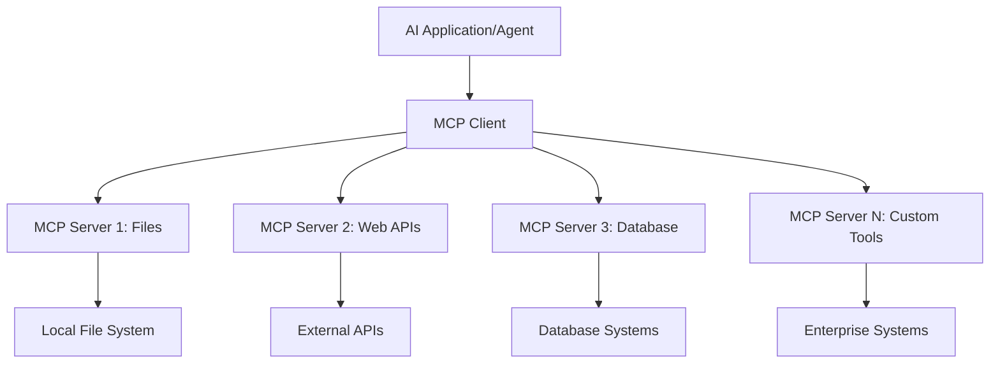

**🔧 मुख्य कम्पोनेन्टहरू:**

| कम्पोनेन्ट | भूमिका | उदाहरणहरू |
|-----------|--------|------------|
| **MCP Hosts** | MCP सेवाहरू उपभोग गर्ने अनुप्रयोगहरू | Claude Desktop, VS Code, AI Toolkit |
| **MCP Clients** | प्रोटोकल ह्यान्डलरहरू (सर्भरसँग १:१) | होस्ट अनुप्रयोगमा निर्मित |
| **MCP Servers** | मानकीकृत प्रोटोकलमार्फत क्षमता प्रदान गर्ने | Playwright, Files, Azure, GitHub |
| **Transport Layer** | सञ्चारका माध्यमहरू | stdio, HTTP, WebSockets |

## 🏢 Microsoft को MCP सर्भर इकोसिस्टम

Microsoft ले MCP इकोसिस्टममा अग्रणी भूमिका खेल्दै वास्तविक व्यापार आवश्यकताहरू पूरा गर्ने उद्यम-स्तरका सर्भरहरूको व्यापक सेट प्रदान गर्दछ।

### 🌟 Microsoft का प्रमुख MCP सर्भरहरू

#### १. ☁️ Azure MCP Server  
**🔗 रिपोजिटरी**: [azure/azure-mcp](https://github.com/azure/azure-mcp)  
**🎯 उद्देश्य**: AI एकीकरणसहित व्यापक Azure स्रोत व्यवस्थापन

**✨ मुख्य विशेषताहरू:**  
- घोषणात्मक पूर्वाधार प्रबन्धन  
- वास्तविक-समय स्रोत अनुगमन  
- लागत अनुकूलन सिफारिसहरू  
- सुरक्षा अनुपालन जाँच

**🚀 प्रयोगका केसहरू:**  
- AI सहयोगमा Infrastructure-as-Code  
- स्वचालित स्रोत स्केलिङ  
- क्लाउड लागत अनुकूलन  
- DevOps कार्यप्रवाह स्वचालन

#### २. 📊 Microsoft Dataverse MCP  
**📚 कागजात**: [Microsoft Dataverse Integration](https://go.microsoft.com/fwlink/?linkid=2320176)  
**🎯 उद्देश्य**: व्यापार डाटाका लागि प्राकृतिक भाषा अन्तरफलक

**✨ मुख्य विशेषताहरू:**  
- प्राकृतिक भाषा डाटाबेस क्वेरीहरू  
- व्यापार सन्दर्भ बुझाइ  
- अनुकूलित प्रॉम्प्ट टेम्प्लेटहरू  
- उद्यम डाटा शासन

**🚀 प्रयोगका केसहरू:**  
- व्यापार बुद्धिमत्ता रिपोर्टिङ  
- ग्राहक डाटा विश्लेषण  
- बिक्री पाइपलाइन अन्तर्दृष्टि  
- अनुपालन डाटा क्वेरीहरू

#### ३. 🌐 Playwright MCP Server  
**🔗 रिपोजिटरी**: [microsoft/playwright-mcp](https://github.com/microsoft/playwright-mcp)  
**🎯 उद्देश्य**: ब्राउजर अटोमेसन र वेब अन्तरक्रिया क्षमता

**✨ मुख्य विशेषताहरू:**  
- क्रस-ब्राउजर अटोमेसन (Chrome, Firefox, Safari)  
- बुद्धिमान एलिमेन्ट पहिचान  
- स्क्रिनसट र PDF उत्पादन  
- नेटवर्क ट्राफिक अनुगमन

**🚀 प्रयोगका केसहरू:**  
- स्वचालित परीक्षण कार्यप्रवाह  
- वेब स्क्र्यापिङ र डाटा निकासी  
- UI/UX अनुगमन  
- प्रतिस्पर्धात्मक विश्लेषण स्वचालन

#### ४. 📁 Files MCP Server  
**🔗 रिपोजिटरी**: [microsoft/files-mcp-server](https://github.com/microsoft/files-mcp-server)  
**🎯 उद्देश्य**: बुद्धिमान फाइल प्रणाली अपरेसनहरू

**✨ मुख्य विशेषताहरू:**  
- घोषणात्मक फाइल व्यवस्थापन  
- सामग्री समकालिकरण  
- भर्सन कन्ट्रोल एकीकरण  
- मेटाडाटा निकासी

**🚀 प्रयोगका केसहरू:**  
- कागजात व्यवस्थापन  
- कोड रिपोजिटरी संगठन  
- सामग्री प्रकाशन कार्यप्रवाह  
- डाटा पाइपलाइन फाइल ह्यान्डलिङ

#### ५. 📝 MarkItDown MCP Server  
**🔗 रिपोजिटरी**: [microsoft/markitdown](https://github.com/microsoft/markitdown)  
**🎯 उद्देश्य**: उन्नत Markdown प्रशोधन र व्यवस्थापन

**✨ मुख्य विशेषताहरू:**  
- समृद्ध Markdown पार्सिङ  
- ढाँचा रूपान्तरण (MD ↔ HTML ↔ PDF)  
- सामग्री संरचना विश्लेषण  
- टेम्प्लेट प्रशोधन

**🚀 प्रयोगका केसहरू:**  
- प्राविधिक कागजात कार्यप्रवाह  
- सामग्री व्यवस्थापन प्रणाली  
- रिपोर्ट उत्पादन  
- ज्ञान आधार स्वचालन

#### ६. 📈 Clarity MCP Server  
**📦 प्याकेज**: [@microsoft/clarity-mcp-server](https://www.npmjs.com/package/@microsoft/clarity-mcp-server)  
**🎯 उद्देश्य**: वेब विश्लेषण र प्रयोगकर्ता व्यवहार अन्तर्दृष्टि

**✨ मुख्य विशेषताहरू:**  
- हीटम्याप डाटा विश्लेषण  
- प्रयोगकर्ता सत्र रेकर्डिङ  
- प्रदर्शन मेट्रिक्स  
- रूपान्तरण फनेल विश्लेषण

**🚀 प्रयोगका केसहरू:**  
- वेबसाइट अनुकूलन  
- प्रयोगकर्ता अनुभव अनुसन्धान  
- A/B परीक्षण विश्लेषण  
- व्यापार बुद्धिमत्ता ड्यासबोर्ड

### 🌍 समुदाय इकोसिस्टम

Microsoft का सर्भरहरू बाहेक, MCP इकोसिस्टममा समावेश छन्:  
- **🐙 GitHub MCP**: रिपोजिटरी व्यवस्थापन र कोड विश्लेषण  
- **🗄️ डाटाबेस MCPs**: PostgreSQL, MySQL, MongoDB एकीकरणहरू  
- **☁️ क्लाउड प्रदायक MCPs**: AWS, GCP, Digital Ocean उपकरणहरू  
- **📧 सञ्चार MCPs**: Slack, Teams, इमेल एकीकरणहरू

## 🛠️ व्यावहारिक प्रयोगशाला: ब्राउजर अटोमेसन एजेन्ट बनाउने

**🎯 परियोजना लक्ष्य**: Playwright MCP सर्भर प्रयोग गरी एक बुद्धिमान ब्राउजर अटोमेसन एजेन्ट बनाउने जसले वेबसाइटहरूमा नेभिगेट गर्न, जानकारी निकाल्न र जटिल वेब अन्तरक्रियाहरू गर्न सक्छ।

### 🚀 चरण १: एजेन्ट आधार सेटअप

#### चरण १: आफ्नो एजेन्ट सुरु गर्नुहोस्  
1. **AI Toolkit Agent Builder खोल्नुहोस्**  
2. **नयाँ एजेन्ट बनाउनुहोस्** निम्न कन्फिगरेसनसहित:  
   - **नाम**: `BrowserAgent`  
   - **मोडेल**: GPT-4o रोज्नुहोस्  

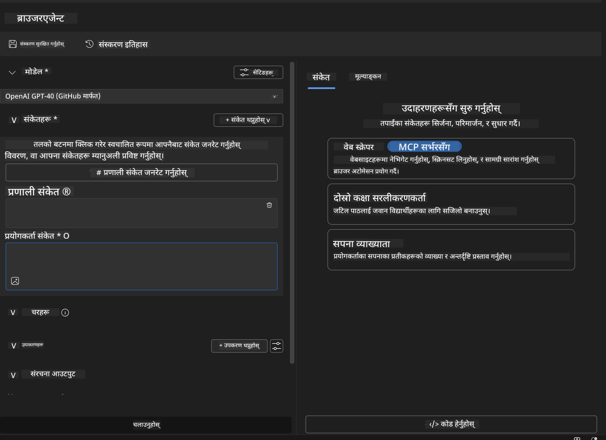

### 🔧 चरण २: MCP एकीकरण कार्यप्रवाह

#### चरण ३: MCP सर्भर एकीकरण थप्नुहोस्  
1. **Agent Builder मा Tools सेक्सनमा जानुहोस्**  
2. **"Add Tool" क्लिक गरेर एकीकरण मेनु खोल्नुहोस्**  
3. **"MCP Server" विकल्प छान्नुहोस्**  

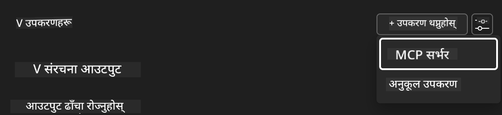

**🔍 उपकरण प्रकारहरू बुझ्न:**  
- **Built-in Tools**: पूर्व-कन्फिगर गरिएको AI Toolkit कार्यहरू  
- **MCP Servers**: बाह्य सेवा एकीकरणहरू  
- **Custom APIs**: तपाईंका आफ्नै सेवा अन्तबिन्दुहरू  
- **Function Calling**: मोडेलको प्रत्यक्ष फंक्शन पहुँच

#### चरण ४: MCP सर्भर चयन  
1. **"MCP Server" विकल्प छान्नुहोस्**  
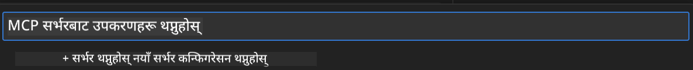

2. **MCP क्याटलग ब्राउज गरेर उपलब्ध एकीकरणहरू अन्वेषण गर्नुहोस्**  
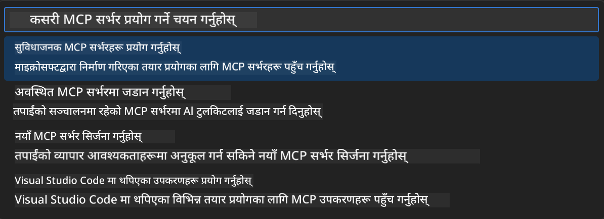

### 🎮 चरण ३: Playwright MCP कन्फिगरेसन

#### चरण ५: Playwright चयन र कन्फिगर गर्नुहोस्  
1. **"Use Featured MCP Servers" क्लिक गरेर Microsoft का प्रमाणित सर्भरहरू पहुँच गर्नुहोस्**  
2. **सूचीबाट "Playwright" छान्नुहोस्**  
3. **डिफल्ट MCP ID स्वीकार्नुहोस् वा आफ्नो वातावरण अनुसार अनुकूलन गर्नुहोस्**  

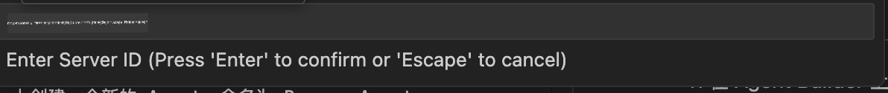

#### चरण ६: Playwright क्षमताहरू सक्षम गर्नुहोस्  
**🔑 महत्वपूर्ण चरण**: अधिकतम कार्यक्षमताका लागि सबै उपलब्ध Playwright विधिहरू छान्नुहोस्  

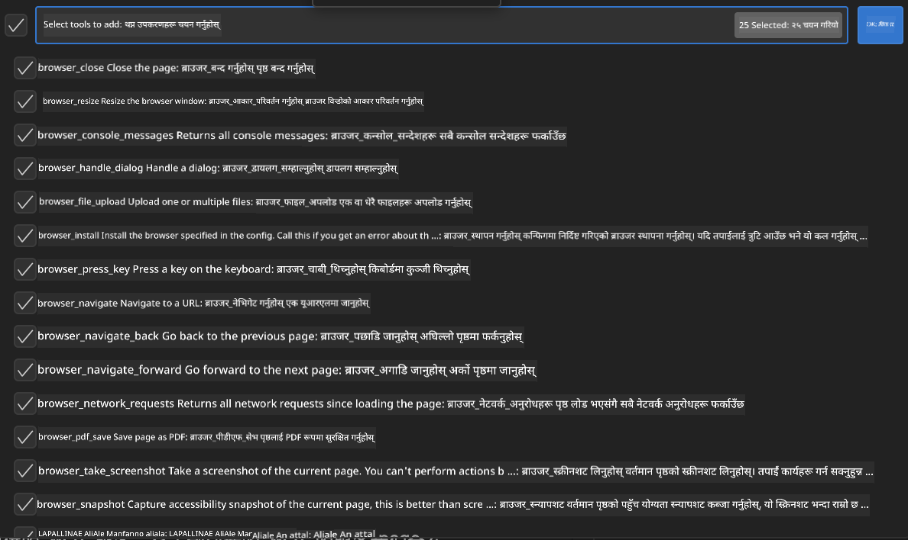

**🛠️ आवश्यक Playwright उपकरणहरू:**  
- **नेभिगेसन**: `goto`, `goBack`, `goForward`, `reload`  
- **अन्तरक्रिया**: `click`, `fill`, `press`, `hover`, `drag`  
- **निकासी**: `textContent`, `innerHTML`, `getAttribute`  
- **मान्यता**: `isVisible`, `isEnabled`, `waitForSelector`  
- **क्याप्चर**: `screenshot`, `pdf`, `video`  
- **नेटवर्क**: `setExtraHTTPHeaders`, `route`, `waitForResponse`

#### चरण ७: एकीकरण सफलताको पुष्टि गर्नुहोस्  
**✅ सफलताको संकेतहरू:**  
- सबै उपकरणहरू Agent Builder इन्टरफेसमा देखिन्छन्  
- एकीकरण प्यानलमा कुनै त्रुटि सन्देश छैन  
- Playwright सर्भर स्थिति "Connected" देखाउँछ  

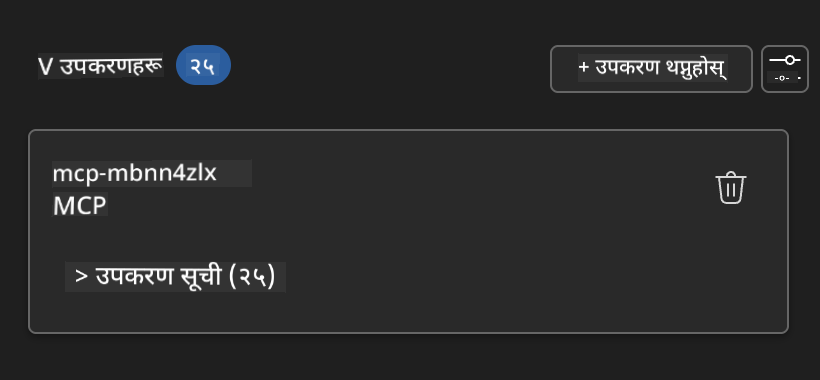

**🔧 सामान्य समस्या समाधान:**  
- **जडान असफल**: इन्टरनेट कनेक्टिविटी र फायरवाल सेटिङ जाँच्नुहोस्  
- **उपकरण हराइरहेको छ**: सेटअपको क्रममा सबै क्षमताहरू छानिएको सुनिश्चित गर्नुहोस्  
- **अनुमति त्रुटि**: VS Code लाई आवश्यक प्रणाली अनुमति दिइएको छ कि छैन जाँच्नुहोस्

### 🎯 चरण ४: उन्नत प्रॉम्प्ट इन्जिनियरिङ

#### चरण ८: बुद्धिमान सिस्टम प्रॉम्प्ट डिजाइन गर्नुहोस्  
Playwright का सम्पूर्ण क्षमताहरू प्रयोग गर्ने जटिल प्रॉम्प्टहरू बनाउनुहोस्:

```markdown
# Web Automation Expert System Prompt

## Core Identity
You are an advanced web automation specialist with deep expertise in browser automation, web scraping, and user experience analysis. You have access to Playwright tools for comprehensive browser control.

## Capabilities & Approach
### Navigation Strategy
- Always start with screenshots to understand page layout
- Use semantic selectors (text content, labels) when possible
- Implement wait strategies for dynamic content
- Handle single-page applications (SPAs) effectively

### Error Handling
- Retry failed operations with exponential backoff
- Provide clear error descriptions and solutions
- Suggest alternative approaches when primary methods fail
- Always capture diagnostic screenshots on errors

### Data Extraction
- Extract structured data in JSON format when possible
- Provide confidence scores for extracted information
- Validate data completeness and accuracy
- Handle pagination and infinite scroll scenarios

### Reporting
- Include step-by-step execution logs
- Provide before/after screenshots for verification
- Suggest optimizations and alternative approaches
- Document any limitations or edge cases encountered

## Ethical Guidelines
- Respect robots.txt and rate limiting
- Avoid overloading target servers
- Only extract publicly available information
- Follow website terms of service
```

#### चरण ९: गतिशील प्रयोगकर्ता प्रॉम्प्टहरू बनाउनुहोस्  
विभिन्न क्षमताहरू प्रदर्शन गर्ने प्रॉम्प्टहरू डिजाइन गर्नुहोस्:

**🌐 वेब विश्लेषण उदाहरण:**  
```markdown
Navigate to github.com/kinfey and provide a comprehensive analysis including:
1. Repository structure and organization
2. Recent activity and contribution patterns  
3. Documentation quality assessment
4. Technology stack identification
5. Community engagement metrics
6. Notable projects and their purposes

Include screenshots at key steps and provide actionable insights.
```

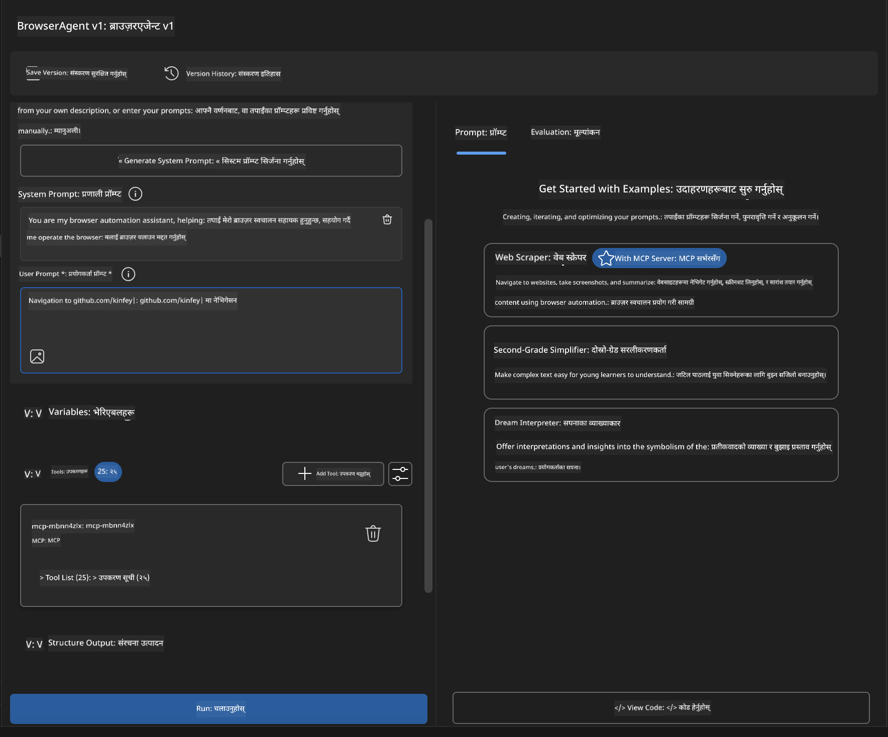

### 🚀 चरण ५: कार्यान्वयन र परीक्षण

#### चरण १०: पहिलो अटोमेसन चलाउनुहोस्  
1. **"Run" क्लिक गरेर अटोमेसन सुरु गर्नुहोस्**  
2. **वास्तविक-समय कार्यान्वयन अनुगमन गर्नुहोस्**:  
   - Chrome ब्राउजर स्वचालित रूपमा खुल्छ  
   - एजेन्ट लक्षित वेबसाइटमा नेभिगेट गर्छ  
   - प्रत्येक मुख्य चरणको स्क्रिनसट लिन्छ  
   - विश्लेषण परिणामहरू वास्तविक-समयमा स्ट्रिम हुन्छन्  

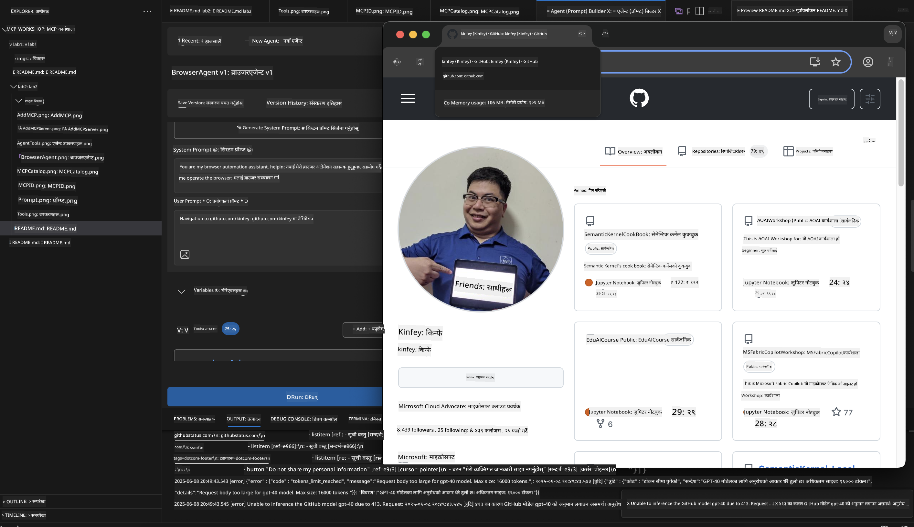

#### चरण ११: परिणाम र अन्तर्दृष्टि विश्लेषण गर्नुहोस्  
Agent Builder को इन्टरफेसमा विस्तृत विश्लेषण समीक्षा गर्नुहोस्:

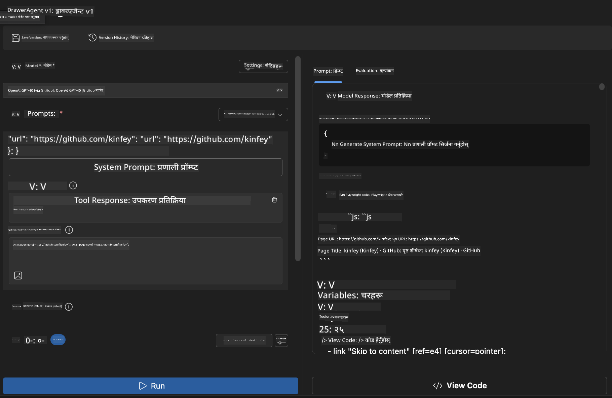

### 🌟 चरण ६: उन्नत क्षमताहरू र तैनाथी

#### चरण १२: निर्यात र उत्पादन तैनाथी  
Agent Builder ले विभिन्न तैनाथी विकल्पहरू समर्थन गर्दछ:

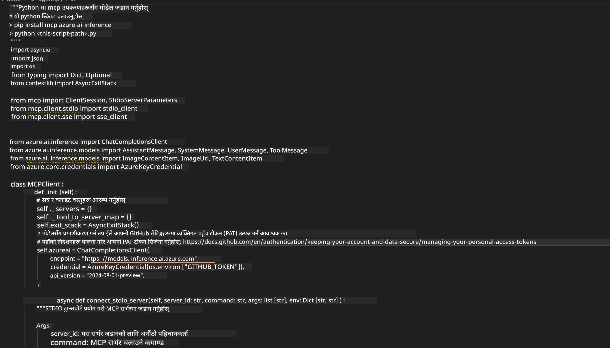

## 🎓 मोड्युल २ सारांश र आगामी कदमहरू

### 🏆 उपलब्धि प्राप्त: MCP एकीकरण मास्टर

**✅ सिकेका सीपहरू:**  
- [ ] MCP संरचना र फाइदाहरू बुझ्न  
- [ ] Microsoft को MCP सर्भर इकोसिस्टममा नेभिगेट गर्न  
- [ ] Playwright MCP लाई AI Toolkit सँग एकीकृत गर्न  
- [ ] जटिल ब्राउजर अटोमेसन एजेन्टहरू बनाउने  
- [ ] वेब अटोमेसनका लागि उन्नत प्रॉम्प्ट इन्जिनियरिङ

### 📚 थप स्रोतहरू

- **🔗 MCP विशिष्टता**: [अधिकारिक प्रोटोकल कागजात](https://modelcontextprotocol.io/)  
- **🛠️ Playwright API**: [पूर्ण विधि सन्दर्भ](https://playwright.dev/docs/api/class-playwright)  
- **🏢 Microsoft MCP सर्भरहरू**: [उद्यम एकीकरण मार्गदर्शन](https://github.com/microsoft/mcp-servers)  
- **🌍 समुदायका उदाहरणहरू**: [MCP सर्भर ग्यालरी](https://github.com/modelcontextprotocol/servers)

**🎉 बधाई छ!** तपाईंले सफलतापूर्वक MCP एकीकरणमा दक्षता हासिल गर्नुभयो र अब बाह्य उपकरण क्षमतासहित उत्पादन-तयार AI एजेन्टहरू बनाउन सक्नुहुन्छ!

### 🔜 अर्को मोड्युलमा जानुहोस्

तपाईंको MCP सीपलाई अर्को स्तरमा लैजान तयार हुनुहुन्छ? अगाडि बढ्नुहोस् **[मोड्युल ३: AI Toolkit सँग उन्नत MCP विकास](../lab3/README.md)** जहाँ तपाईं सिक्नुहुनेछ:  
- आफ्नै कस्टम MCP सर्भरहरू बनाउने  
- नवीनतम MCP Python SDK कन्फिगर र प्रयोग गर्ने  
- MCP Inspector सेटअप गरेर डिबग गर्ने  
- उन्नत MCP सर्भर विकास कार्यप्रवाहहरूमा दक्षता हासिल गर्ने
- मौसम MCP सर्भर शून्यबाट निर्माण गर्नुहोस्

**अस्वीकरण**:  
यो दस्तावेज AI अनुवाद सेवा [Co-op Translator](https://github.com/Azure/co-op-translator) प्रयोग गरी अनुवाद गरिएको हो। हामी शुद्धताका लागि प्रयासरत छौं, तर कृपया ध्यान दिनुहोस् कि स्वचालित अनुवादमा त्रुटि वा अशुद्धता हुन सक्छ। मूल दस्तावेज यसको मूल भाषामा नै अधिकारिक स्रोत मानिनु पर्छ। महत्वपूर्ण जानकारीका लागि व्यावसायिक मानव अनुवाद सिफारिस गरिन्छ। यस अनुवादको प्रयोगबाट उत्पन्न कुनै पनि गलतफहमी वा गलत व्याख्याका लागि हामी जिम्मेवार छैनौं।