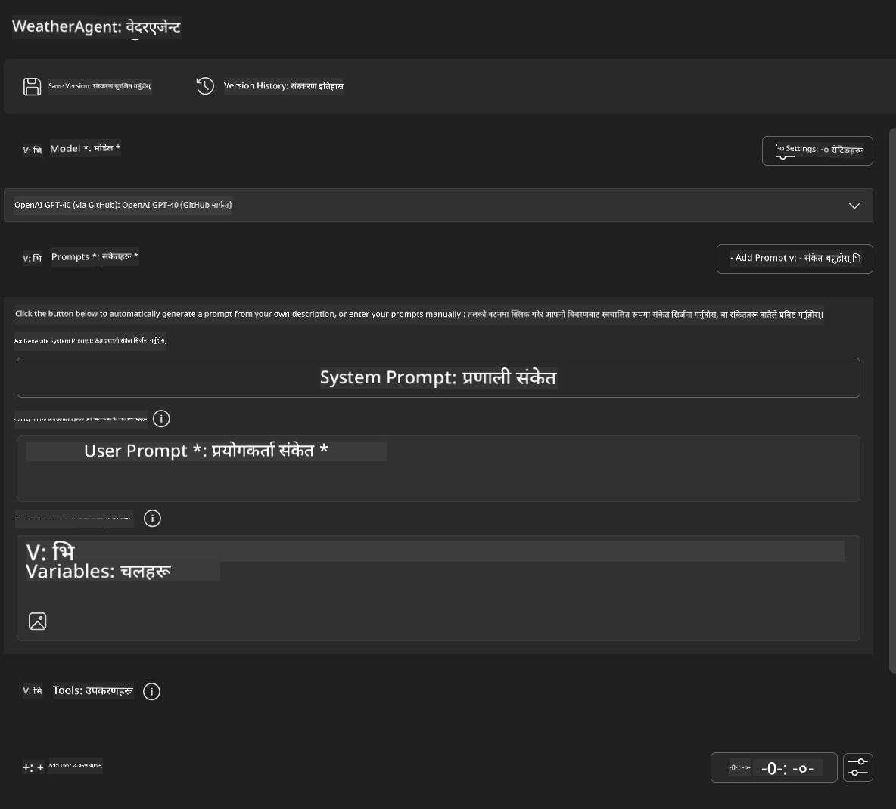
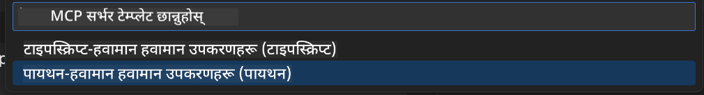
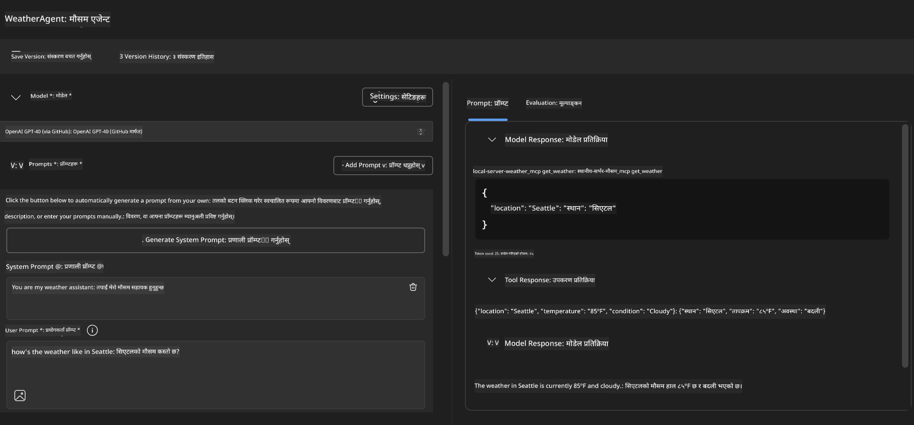
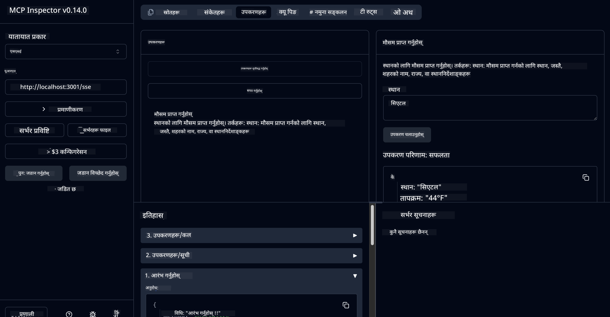

<!--
CO_OP_TRANSLATOR_METADATA:
{
  "original_hash": "dd8da3f75addcef453fe11f02a270217",
  "translation_date": "2025-07-14T08:11:33+00:00",
  "source_file": "10-StreamliningAIWorkflowsBuildingAnMCPServerWithAIToolkit/lab3/README.md",
  "language_code": "ne"
}
-->
# 🔧 मोड्युल ३: AI Toolkit सँग उन्नत MCP विकास


## 🎯 सिकाइका उद्देश्यहरू

यस ल्याबको अन्त्यसम्म, तपाईं सक्षम हुनुहुनेछ:

- ✅ AI Toolkit प्रयोग गरी कस्टम MCP सर्भरहरू सिर्जना गर्न
- ✅ नयाँ MCP Python SDK (v1.9.3) कन्फिगर र प्रयोग गर्न
- ✅ डिबगिङका लागि MCP Inspector सेटअप र उपयोग गर्न
- ✅ Agent Builder र Inspector दुवै वातावरणमा MCP सर्भरहरू डिबग गर्न
- ✅ उन्नत MCP सर्भर विकास कार्यप्रवाहहरू बुझ्न

## 📋 पूर्वआवश्यकताहरू

- ल्याब २ (MCP Fundamentals) पूरा गरेको हुनु पर्ने
- VS Code मा AI Toolkit एक्सटेन्सन इन्स्टल गरिएको
- Python 3.10+ वातावरण
- Inspector सेटअपका लागि Node.js र npm

## 🏗️ तपाईंले के बनाउनुहुनेछ

यस ल्याबमा, तपाईंले **Weather MCP Server** बनाउनुहुनेछ जसले देखाउँछ:
- कस्टम MCP सर्भर कार्यान्वयन
- AI Toolkit Agent Builder सँग एकीकरण
- व्यावसायिक डिबगिङ कार्यप्रवाहहरू
- आधुनिक MCP SDK प्रयोगका ढाँचाहरू

---

## 🔧 मुख्य कम्पोनेन्टहरूको अवलोकन

### 🐍 MCP Python SDK  
Model Context Protocol Python SDK ले कस्टम MCP सर्भरहरू निर्माण गर्ने आधार प्रदान गर्छ। तपाईंले संस्करण 1.9.3 प्रयोग गर्नुहुनेछ जसमा सुधारिएको डिबगिङ क्षमता छ।

### 🔍 MCP Inspector  
शक्तिशाली डिबगिङ उपकरण जसले प्रदान गर्छ:  
- वास्तविक-समय सर्भर अनुगमन  
- उपकरण कार्यान्वयन दृश्यता  
- नेटवर्क अनुरोध/प्रतिक्रिया निरीक्षण  
- अन्तरक्रियात्मक परीक्षण वातावरण  

---

## 📖 चरण-द्वारा-चरण कार्यान्वयन

### चरण १: Agent Builder मा WeatherAgent सिर्जना गर्नुहोस्

1. VS Code मा AI Toolkit एक्सटेन्सन मार्फत **Agent Builder सुरु गर्नुहोस्**  
2. तलको कन्फिगरेसनसहित **नयाँ एजेन्ट सिर्जना गर्नुहोस्:**  
   - एजेन्ट नाम: `WeatherAgent`



### चरण २: MCP Server प्रोजेक्ट सुरु गर्नुहोस्

1. Agent Builder मा **Tools → Add Tool** मा जानुहोस्  
2. उपलब्ध विकल्पहरूबाट **"MCP Server" चयन गर्नुहोस्**  
3. **"Create A new MCP Server" रोज्नुहोस्**  
4. `python-weather` टेम्प्लेट चयन गर्नुहोस्  
5. सर्भरको नाम राख्नुहोस्: `weather_mcp`



### चरण ३: प्रोजेक्ट खोल्नुहोस् र जाँच गर्नुहोस्

1. VS Code मा सिर्जना गरिएको प्रोजेक्ट खोल्नुहोस्  
2. प्रोजेक्ट संरचना समीक्षा गर्नुहोस्:  
   ```
   weather_mcp/
   ├── src/
   │   ├── __init__.py
   │   └── server.py
   ├── inspector/
   │   ├── package.json
   │   └── package-lock.json
   ├── .vscode/
   │   ├── launch.json
   │   └── tasks.json
   ├── pyproject.toml
   └── README.md
   ```

### चरण ४: नयाँ MCP SDK मा अपग्रेड गर्नुहोस्

> **🔍 किन अपग्रेड गर्ने?** हामीले नयाँ MCP SDK (v1.9.3) र Inspector सेवा (0.14.0) प्रयोग गर्न चाहन्छौं जसले थप सुविधाहरू र राम्रो डिबगिङ क्षमता दिन्छ।

#### ४a. Python निर्भरता अपडेट गर्नुहोस्

**`pyproject.toml` सम्पादन गर्नुहोस्:** [./code/weather_mcp/pyproject.toml](../../../../10-StreamliningAIWorkflowsBuildingAnMCPServerWithAIToolkit/lab3/code/weather_mcp/pyproject.toml) मा अपडेट गर्नुहोस्

#### ४b. Inspector कन्फिगरेसन अपडेट गर्नुहोस्

**`inspector/package.json` सम्पादन गर्नुहोस्:** [./code/weather_mcp/inspector/package.json](../../../../10-StreamliningAIWorkflowsBuildingAnMCPServerWithAIToolkit/lab3/code/weather_mcp/inspector/package.json) मा अपडेट गर्नुहोस्

#### ४c. Inspector निर्भरता अपडेट गर्नुहोस्

**`inspector/package-lock.json` सम्पादन गर्नुहोस्:** [./code/weather_mcp/inspector/package-lock.json](../../../../10-StreamliningAIWorkflowsBuildingAnMCPServerWithAIToolkit/lab3/code/weather_mcp/inspector/package-lock.json) मा अपडेट गर्नुहोस्

> **📝 नोट:** यो फाइलमा धेरै निर्भरता परिभाषाहरू छन्। तल आवश्यक संरचना दिइएको छ - पूर्ण सामग्रीले निर्भरता समाधान सुनिश्चित गर्छ।

> **⚡ पूर्ण Package Lock:** package-lock.json मा लगभग ३००० लाइन निर्भरता परिभाषा हुन्छ। माथिको संरचनाले मुख्य भाग देखाउँछ - पूर्ण निर्भरता समाधानका लागि दिइएको फाइल प्रयोग गर्नुहोस्।

### चरण ५: VS Code डिबगिङ कन्फिगरेसन सेटअप गर्नुहोस्

*नोट: निर्दिष्ट पथमा फाइल कपी गरेर स्थानीय फाइल प्रतिस्थापन गर्नुहोस्*

#### ५a. Launch कन्फिगरेसन अपडेट गर्नुहोस्

**`.vscode/launch.json` सम्पादन गर्नुहोस्:**  
```json
{
  "version": "0.2.0",
  "configurations": [
    {
      "name": "Attach to Local MCP",
      "type": "debugpy",
      "request": "attach",
      "connect": {
        "host": "localhost",
        "port": 5678
      },
      "presentation": {
        "hidden": true
      },
      "internalConsoleOptions": "neverOpen",
      "postDebugTask": "Terminate All Tasks"
    },
    {
      "name": "Launch Inspector (Edge)",
      "type": "msedge",
      "request": "launch",
      "url": "http://localhost:6274?timeout=60000&serverUrl=http://localhost:3001/sse#tools",
      "cascadeTerminateToConfigurations": [
        "Attach to Local MCP"
      ],
      "presentation": {
        "hidden": true
      },
      "internalConsoleOptions": "neverOpen"
    },
    {
      "name": "Launch Inspector (Chrome)",
      "type": "chrome",
      "request": "launch",
      "url": "http://localhost:6274?timeout=60000&serverUrl=http://localhost:3001/sse#tools",
      "cascadeTerminateToConfigurations": [
        "Attach to Local MCP"
      ],
      "presentation": {
        "hidden": true
      },
      "internalConsoleOptions": "neverOpen"
    }
  ],
  "compounds": [
    {
      "name": "Debug in Agent Builder",
      "configurations": [
        "Attach to Local MCP"
      ],
      "preLaunchTask": "Open Agent Builder",
    },
    {
      "name": "Debug in Inspector (Edge)",
      "configurations": [
        "Launch Inspector (Edge)",
        "Attach to Local MCP"
      ],
      "preLaunchTask": "Start MCP Inspector",
      "stopAll": true
    },
    {
      "name": "Debug in Inspector (Chrome)",
      "configurations": [
        "Launch Inspector (Chrome)",
        "Attach to Local MCP"
      ],
      "preLaunchTask": "Start MCP Inspector",
      "stopAll": true
    }
  ]
}
```

**`.vscode/tasks.json` सम्पादन गर्नुहोस्:**  
```
{
  "version": "2.0.0",
  "tasks": [
    {
      "label": "Start MCP Server",
      "type": "shell",
      "command": "python -m debugpy --listen 127.0.0.1:5678 src/__init__.py sse",
      "isBackground": true,
      "options": {
        "cwd": "${workspaceFolder}",
        "env": {
          "PORT": "3001"
        }
      },
      "problemMatcher": {
        "pattern": [
          {
            "regexp": "^.*$",
            "file": 0,
            "location": 1,
            "message": 2
          }
        ],
        "background": {
          "activeOnStart": true,
          "beginsPattern": ".*",
          "endsPattern": "Application startup complete|running"
        }
      }
    },
    {
      "label": "Start MCP Inspector",
      "type": "shell",
      "command": "npm run dev:inspector",
      "isBackground": true,
      "options": {
        "cwd": "${workspaceFolder}/inspector",
        "env": {
          "CLIENT_PORT": "6274",
          "SERVER_PORT": "6277",
        }
      },
      "problemMatcher": {
        "pattern": [
          {
            "regexp": "^.*$",
            "file": 0,
            "location": 1,
            "message": 2
          }
        ],
        "background": {
          "activeOnStart": true,
          "beginsPattern": "Starting MCP inspector",
          "endsPattern": "Proxy server listening on port"
        }
      },
      "dependsOn": [
        "Start MCP Server"
      ]
    },
    {
      "label": "Open Agent Builder",
      "type": "shell",
      "command": "echo ${input:openAgentBuilder}",
      "presentation": {
        "reveal": "never"
      },
      "dependsOn": [
        "Start MCP Server"
      ],
    },
    {
      "label": "Terminate All Tasks",
      "command": "echo ${input:terminate}",
      "type": "shell",
      "problemMatcher": []
    }
  ],
  "inputs": [
    {
      "id": "openAgentBuilder",
      "type": "command",
      "command": "ai-mlstudio.agentBuilder",
      "args": {
        "initialMCPs": [ "local-server-weather_mcp" ],
        "triggeredFrom": "vsc-tasks"
      }
    },
    {
      "id": "terminate",
      "type": "command",
      "command": "workbench.action.tasks.terminate",
      "args": "terminateAll"
    }
  ]
}
```

---

## 🚀 तपाईंको MCP सर्भर चलाउने र परीक्षण गर्ने

### चरण ६: निर्भरता इन्स्टल गर्नुहोस्

कन्फिगरेसन परिवर्तन गरेपछि तलका कमाण्डहरू चलाउनुहोस्:

**Python निर्भरता इन्स्टल गर्नुहोस्:**  
```bash
uv sync
```

**Inspector निर्भरता इन्स्टल गर्नुहोस्:**  
```bash
cd inspector
npm install
```

### चरण ७: Agent Builder सँग डिबग गर्नुहोस्

1. **F5 थिच्नुहोस्** वा **"Debug in Agent Builder"** कन्फिगरेसन प्रयोग गर्नुहोस्  
2. डिबग प्यानलबाट कम्पाउन्ड कन्फिगरेसन चयन गर्नुहोस्  
3. सर्भर सुरु हुन र Agent Builder खुल्न पर्खनुहोस्  
4. प्राकृतिक भाषा क्वेरीहरू प्रयोग गरी तपाईंको weather MCP सर्भर परीक्षण गर्नुहोस्

यसरी इनपुट दिनुहोस्

SYSTEM_PROMPT

```
You are my weather assistant
```

USER_PROMPT

```
How's the weather like in Seattle
```



### चरण ८: MCP Inspector सँग डिबग गर्नुहोस्

1. **"Debug in Inspector"** कन्फिगरेसन प्रयोग गर्नुहोस् (Edge वा Chrome)  
2. `http://localhost:6274` मा Inspector इन्टरफेस खोल्नुहोस्  
3. अन्तरक्रियात्मक परीक्षण वातावरण अन्वेषण गर्नुहोस्:  
   - उपलब्ध उपकरणहरू हेर्नुहोस्  
   - उपकरण कार्यान्वयन परीक्षण गर्नुहोस्  
   - नेटवर्क अनुरोधहरू अनुगमन गर्नुहोस्  
   - सर्भर प्रतिक्रियाहरू डिबग गर्नुहोस्



---

## 🎯 मुख्य सिकाइ नतिजाहरू

यस ल्याब पूरा गरेर, तपाईंले:

- [x] AI Toolkit टेम्प्लेटहरू प्रयोग गरी **कस्टम MCP सर्भर सिर्जना गर्नुभयो**  
- [x] नयाँ MCP SDK (v1.9.3) मा **अपग्रेड गर्नुभयो**  
- [x] Agent Builder र Inspector दुवैका लागि **व्यावसायिक डिबगिङ कार्यप्रवाहहरू कन्फिगर गर्नुभयो**  
- [x] अन्तरक्रियात्मक सर्भर परीक्षणका लागि **MCP Inspector सेटअप गर्नुभयो**  
- [x] MCP विकासका लागि **VS Code डिबगिङ कन्फिगरेसनहरूमा दक्षता हासिल गर्नुभयो**

## 🔧 अन्वेषण गरिएका उन्नत सुविधाहरू

| सुविधा | विवरण | प्रयोग केस |
|---------|-------------|----------|
| **MCP Python SDK v1.9.3** | नयाँ प्रोटोकल कार्यान्वयन | आधुनिक सर्भर विकास |
| **MCP Inspector 0.14.0** | अन्तरक्रियात्मक डिबगिङ उपकरण | वास्तविक-समय सर्भर परीक्षण |
| **VS Code Debugging** | एकीकृत विकास वातावरण | व्यावसायिक डिबगिङ कार्यप्रवाह |
| **Agent Builder Integration** | प्रत्यक्ष AI Toolkit जडान | अन्त्य-देखि-अन्त्य एजेन्ट परीक्षण |

## 📚 थप स्रोतहरू

- [MCP Python SDK कागजात](https://modelcontextprotocol.io/docs/sdk/python)  
- [AI Toolkit एक्सटेन्सन गाइड](https://code.visualstudio.com/docs/ai/ai-toolkit)  
- [VS Code डिबगिङ कागजात](https://code.visualstudio.com/docs/editor/debugging)  
- [Model Context Protocol विशिष्टता](https://modelcontextprotocol.io/docs/concepts/architecture)

---

**🎉 बधाई छ!** तपाईंले सफलतापूर्वक ल्याब ३ पूरा गर्नुभयो र अब व्यावसायिक विकास कार्यप्रवाहहरू प्रयोग गरी कस्टम MCP सर्भरहरू सिर्जना, डिबग र डिप्लोय गर्न सक्नुहुन्छ।

### 🔜 अर्को मोड्युलमा जानुहोस्

तपाईंको MCP सीपलाई वास्तविक विकास कार्यप्रवाहमा लागू गर्न तयार हुनुहुन्छ? **[मोड्युल ४: व्यावहारिक MCP विकास - कस्टम GitHub Clone Server](../lab4/README.md)** मा जानुहोस् जहाँ तपाईंले:  
- GitHub रिपोजिटरी अपरेसनहरू स्वचालित गर्ने उत्पादन-तय MCP सर्भर बनाउनुहुनेछ  
- MCP मार्फत GitHub रिपोजिटरी क्लोन गर्ने कार्यान्वयन गर्नुहुनेछ  
- VS Code र GitHub Copilot Agent Mode सँग कस्टम MCP सर्भरहरू एकीकृत गर्नुहुनेछ  
- उत्पादन वातावरणमा कस्टम MCP सर्भरहरू परीक्षण र डिप्लोय गर्नुहुनेछ  
- विकासकर्ताहरूका लागि व्यावहारिक कार्यप्रवाह स्वचालन सिक्नुहुनेछ

**अस्वीकरण**:  
यो दस्तावेज AI अनुवाद सेवा [Co-op Translator](https://github.com/Azure/co-op-translator) प्रयोग गरी अनुवाद गरिएको हो। हामी शुद्धताका लागि प्रयासरत छौं भने पनि, कृपया ध्यान दिनुहोस् कि स्वचालित अनुवादमा त्रुटि वा अशुद्धता हुन सक्छ। मूल दस्तावेज यसको मूल भाषामा नै अधिकारिक स्रोत मानिनुपर्छ। महत्वपूर्ण जानकारीका लागि व्यावसायिक मानव अनुवाद सिफारिस गरिन्छ। यस अनुवादको प्रयोगबाट उत्पन्न कुनै पनि गलतफहमी वा गलत व्याख्याका लागि हामी जिम्मेवार छैनौं।