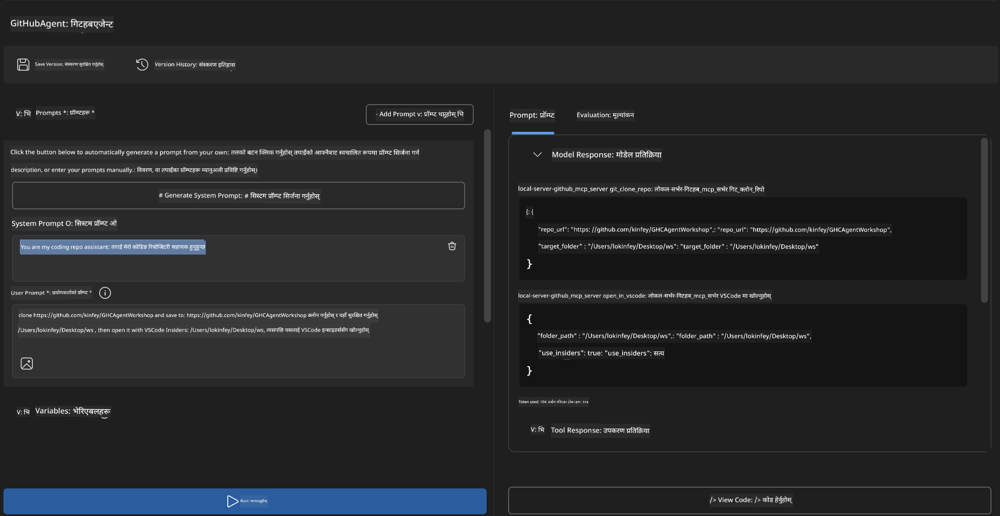
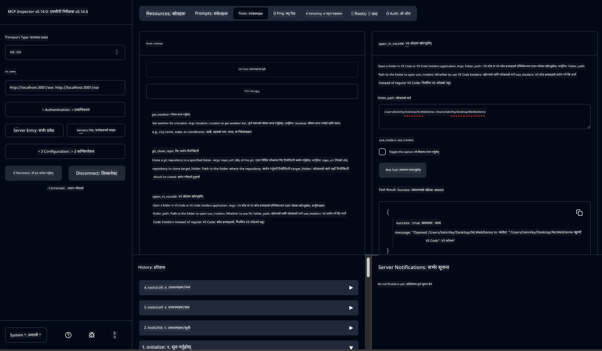

<!--
CO_OP_TRANSLATOR_METADATA:
{
  "original_hash": "f83bc722dc758efffd68667d6a1db470",
  "translation_date": "2025-07-14T08:39:54+00:00",
  "source_file": "10-StreamliningAIWorkflowsBuildingAnMCPServerWithAIToolkit/lab4/README.md",
  "language_code": "ne"
}
-->
# 🐙 मोड्युल ४: व्यावहारिक MCP विकास - कस्टम GitHub क्लोन सर्भर


> **⚡ छिटो सुरुवात:** केवल ३० मिनेटमा GitHub रिपोजिटोरी क्लोन गर्ने र VS Code सँग एकीकृत गर्ने उत्पादन-तयार MCP सर्भर बनाउनुहोस्!

## 🎯 सिकाइका उद्देश्यहरू

यस प्रयोगशालाको अन्त्यसम्म, तपाईं सक्षम हुनुहुनेछ:

- ✅ वास्तविक विकास कार्यप्रवाहका लागि कस्टम MCP सर्भर सिर्जना गर्न
- ✅ MCP मार्फत GitHub रिपोजिटोरी क्लोन गर्ने कार्यक्षमता लागू गर्न
- ✅ कस्टम MCP सर्भरहरूलाई VS Code र Agent Builder सँग एकीकृत गर्न
- ✅ GitHub Copilot Agent Mode कस्टम MCP उपकरणहरूसँग प्रयोग गर्न
- ✅ उत्पादन वातावरणमा कस्टम MCP सर्भरहरू परीक्षण र तैनाथ गर्न

## 📋 पूर्वआवश्यकताहरू

- Labs 1-3 (MCP आधारभूत र उन्नत विकास) पूरा गरेको हुनु पर्ने
- GitHub Copilot सदस्यता ([निःशुल्क साइनअप उपलब्ध](https://github.com/github-copilot/signup))
- VS Code मा AI Toolkit र GitHub Copilot एक्सटेन्सनहरू
- Git CLI इन्स्टल र कन्फिगर गरिएको

## 🏗️ परियोजना अवलोकन

### **वास्तविक विकास चुनौती**
डेभलपरहरूका रूपमा, हामी प्रायः GitHub बाट रिपोजिटोरी क्लोन गरेर VS Code वा VS Code Insiders मा खोल्ने गर्छौं। यो म्यानुअल प्रक्रिया समावेश गर्दछ:
1. टर्मिनल/कमाण्ड प्रम्प्ट खोल्ने
2. इच्छित डाइरेक्टरीमा जानु
3. `git clone` कमाण्ड चलाउने
4. क्लोन गरिएको डाइरेक्टरीमा VS Code खोल्ने

**हाम्रो MCP समाधानले यसलाई एकै बुद्धिमानी कमाण्डमा समेट्छ!**

### **तपाईंले के बनाउनुहुनेछ**
एक **GitHub Clone MCP Server** (`git_mcp_server`) जसले प्रदान गर्दछ:

| सुविधा | विवरण | लाभ |
|---------|-------------|---------|
| 🔄 **स्मार्ट रिपोजिटोरी क्लोनिंग** | GitHub रिपोजिटोरीहरू प्रमाणिकरणसहित क्लोन गर्ने | स्वचालित त्रुटि जाँच |
| 📁 **बुद्धिमानी डाइरेक्टरी व्यवस्थापन** | सुरक्षित रूपमा डाइरेक्टरी जाँच र सिर्जना गर्ने | ओभरराइट हुनबाट जोगाउँछ |
| 🚀 **क्रस-प्लेटफर्म VS Code एकीकरण** | प्रोजेक्टहरू VS Code/Insiders मा खोल्ने | सहज कार्यप्रवाह संक्रमण |
| 🛡️ **दृढ त्रुटि व्यवस्थापन** | नेटवर्क, अनुमति, र पथ समस्याहरू सम्हाल्ने | उत्पादन-तयार विश्वसनीयता |

---

## 📖 चरण-द्वारा-चरण कार्यान्वयन

### चरण १: Agent Builder मा GitHub Agent सिर्जना गर्नुहोस्

1. AI Toolkit एक्सटेन्सनबाट **Agent Builder** सुरु गर्नुहोस्
2. तलको कन्फिगरेसनसहित **नयाँ एजेन्ट सिर्जना गर्नुहोस्:**
   ```
   Agent Name: GitHubAgent
   ```

3. **कस्टम MCP सर्भर सुरु गर्नुहोस्:**
   - **Tools** → **Add Tool** → **MCP Server** मा जानुहोस्
   - **"Create A new MCP Server"** चयन गर्नुहोस्
   - अधिकतम लचिलोपनका लागि **Python template** रोज्नुहोस्
   - **सर्भर नाम:** `git_mcp_server`

### चरण २: GitHub Copilot Agent Mode कन्फिगर गर्नुहोस्

1. VS Code मा **GitHub Copilot खोल्नुहोस्** (Ctrl/Cmd + Shift + P → "GitHub Copilot: Open")
2. Copilot इन्टरफेसमा **Agent Model चयन गर्नुहोस्**
3. उन्नत तर्क क्षमताका लागि **Claude 3.7 मोडेल रोज्नुहोस्**
4. उपकरण पहुँचका लागि **MCP एकीकरण सक्षम गर्नुहोस्**

> **💡 प्रो टिप:** Claude 3.7 ले विकास कार्यप्रवाह र त्रुटि व्यवस्थापन ढाँचाहरूलाई उत्कृष्ट रूपमा बुझ्छ।

### चरण ३: मुख्य MCP सर्भर कार्यक्षमता लागू गर्नुहोस्

**GitHub Copilot Agent Mode सँग तलको विस्तृत प्रॉम्प्ट प्रयोग गर्नुहोस्:**

```
Create two MCP tools with the following comprehensive requirements:

🔧 TOOL A: clone_repository
Requirements:
- Clone any GitHub repository to a specified local folder
- Return the absolute path of the successfully cloned project
- Implement comprehensive validation:
  ✓ Check if target directory already exists (return error if exists)
  ✓ Validate GitHub URL format (https://github.com/user/repo)
  ✓ Verify git command availability (prompt installation if missing)
  ✓ Handle network connectivity issues
  ✓ Provide clear error messages for all failure scenarios

🚀 TOOL B: open_in_vscode
Requirements:
- Open specified folder in VS Code or VS Code Insiders
- Cross-platform compatibility (Windows/Linux/macOS)
- Use direct application launch (not terminal commands)
- Auto-detect available VS Code installations
- Handle cases where VS Code is not installed
- Provide user-friendly error messages

Additional Requirements:
- Follow MCP 1.9.3 best practices
- Include proper type hints and documentation
- Implement logging for debugging purposes
- Add input validation for all parameters
- Include comprehensive error handling
```

### चरण ४: तपाईंको MCP सर्भर परीक्षण गर्नुहोस्

#### ४a. Agent Builder मा परीक्षण

1. Agent Builder को डिबग कन्फिगरेसन सुरु गर्नुहोस्
2. तपाईंको एजेन्टलाई यो सिस्टम प्रॉम्प्टसहित कन्फिगर गर्नुहोस्:

```
SYSTEM_PROMPT:
You are my intelligent coding repository assistant. You help developers efficiently clone GitHub repositories and set up their development environment. Always provide clear feedback about operations and handle errors gracefully.
```

3. यथार्थपरक प्रयोगकर्ता परिदृश्यहरूसँग परीक्षण गर्नुहोस्:

```
USER_PROMPT EXAMPLES:

Scenario : Basic Clone and Open
"Clone {Your GitHub Repo link such as https://github.com/kinfey/GHCAgentWorkshop
 } and save to {The global path you specify}, then open it with VS Code Insiders"
```



**अपेक्षित परिणामहरू:**
- ✅ सफल क्लोनिङ र पथ पुष्टि
- ✅ स्वचालित VS Code सुरु
- ✅ अमान्य परिदृश्यहरूको लागि स्पष्ट त्रुटि सन्देशहरू
- ✅ किनाराका केसहरूको उचित व्यवस्थापन

#### ४b. MCP Inspector मा परीक्षण



---

**🎉 बधाई छ!** तपाईंले सफलतापूर्वक व्यावहारिक, उत्पादन-तयार MCP सर्भर सिर्जना गर्नुभयो जसले वास्तविक विकास कार्यप्रवाह चुनौतीहरू समाधान गर्छ। तपाईंको कस्टम GitHub क्लोन सर्भरले विकासकर्ताको उत्पादकत्व स्वचालन र सुधार गर्ने MCP को शक्ति देखाउँछ।

### 🏆 उपलब्धि प्राप्त भयो:
- ✅ **MCP Developer** - कस्टम MCP सर्भर सिर्जना गरियो
- ✅ **Workflow Automator** - विकास प्रक्रियाहरूलाई सरल बनायो  
- ✅ **Integration Expert** - विभिन्न विकास उपकरणहरू जडान गरियो
- ✅ **Production Ready** - तैनाथ गर्न मिल्ने समाधान बनायो

---

## 🎓 कार्यशाला पूरा भयो: Model Context Protocol सँग तपाईंको यात्रा

**प्रिय कार्यशाला सहभागी,**

Model Context Protocol कार्यशालाका सबै चार मोड्युलहरू पूरा गर्नुभएकोमा बधाई! तपाईंले AI Toolkit का आधारभूत अवधारणाहरू बुझ्नदेखि लिएर उत्पादन-तयार MCP सर्भरहरू निर्माण गरी वास्तविक विकास चुनौतीहरू समाधान गर्न लामो यात्रा तय गर्नुभयो।

### 🚀 तपाईंको सिकाइ मार्ग पुनरावलोकन:

**[मोड्युल १](../lab1/README.md)**: AI Toolkit का आधारभूत कुरा, मोडेल परीक्षण, र पहिलो AI एजेन्ट सिर्जना गर्न सिक्नुभयो।

**[मोड्युल २](../lab2/README.md)**: MCP संरचना बुझ्नुभयो, Playwright MCP एकीकृत गर्नुभयो, र पहिलो ब्राउजर अटोमेसन एजेन्ट बनाउनु भयो।

**[मोड्युल ३](../lab3/README.md)**: Weather MCP सर्भरसँग कस्टम MCP सर्भर विकासमा प्रगति गर्नुभयो र डिबगिङ उपकरणहरूमा दक्षता हासिल गर्नुभयो।

**[मोड्युल ४](../lab4/README.md)**: अब तपाईंले सबै कुरा प्रयोग गरेर व्यावहारिक GitHub रिपोजिटोरी कार्यप्रवाह स्वचालन उपकरण बनाउनु भयो।

### 🌟 तपाईंले के मास्टर गर्नुभयो:

- ✅ **AI Toolkit इकोसिस्टम**: मोडेलहरू, एजेन्टहरू, र एकीकरण ढाँचाहरू
- ✅ **MCP संरचना**: क्लाइन्ट-सर्भर डिजाइन, ट्रान्सपोर्ट प्रोटोकलहरू, र सुरक्षा
- ✅ **डेभलपर उपकरणहरू**: Playground देखि Inspector र उत्पादन तैनाथी सम्म
- ✅ **कस्टम विकास**: आफ्नै MCP सर्भरहरू निर्माण, परीक्षण, र तैनाथी
- ✅ **व्यावहारिक अनुप्रयोगहरू**: AI सँग वास्तविक कार्यप्रवाह चुनौतीहरू समाधान

### 🔮 तपाईंका आगामी कदमहरू:

1. **आफ्नो MCP सर्भर बनाउनुहोस्**: यी सीपहरू प्रयोग गरेर आफ्नै अनौठा कार्यप्रवाहहरू स्वचालित गर्नुहोस्
2. **MCP समुदायमा सहभागी हुनुहोस्**: आफ्ना सिर्जनाहरू साझा गर्नुहोस् र अरूबाट सिक्नुहोस्
3. **उन्नत एकीकरण अन्वेषण गर्नुहोस्**: MCP सर्भरहरूलाई एंटरप्राइज प्रणालीहरूसँग जडान गर्नुहोस्
4. **ओपन सोर्समा योगदान गर्नुहोस्**: MCP उपकरण र दस्तावेजीकरण सुधार गर्न मद्दत गर्नुहोस्

यस कार्यशाला केवल सुरुवात हो। Model Context Protocol इकोसिस्टम तीव्र गतिमा विकास हुँदैछ, र तपाईं अब AI-शक्ति प्राप्त विकास उपकरणहरूको अग्रभागमा हुनुहुन्छ।

**तपाईंको सहभागिता र सिकाइमा समर्पणका लागि धन्यवाद!**

हामी आशा गर्छौं यो कार्यशालाले तपाईंलाई AI उपकरणहरूसँग विकास यात्रामा नयाँ विचारहरू ल्याउने प्रेरणा दिएको छ।

**शुभ कोडिङ!**

---

**अस्वीकरण**:  
यो दस्तावेज AI अनुवाद सेवा [Co-op Translator](https://github.com/Azure/co-op-translator) प्रयोग गरी अनुवाद गरिएको हो। हामी शुद्धताका लागि प्रयासरत छौं, तर कृपया ध्यान दिनुहोस् कि स्वचालित अनुवादमा त्रुटि वा अशुद्धता हुन सक्छ। मूल दस्तावेज यसको मूल भाषामा आधिकारिक स्रोत मानिनुपर्छ। महत्वपूर्ण जानकारीका लागि व्यावसायिक मानव अनुवाद सिफारिस गरिन्छ। यस अनुवादको प्रयोगबाट उत्पन्न कुनै पनि गलतफहमी वा गलत व्याख्याका लागि हामी जिम्मेवार छैनौं।