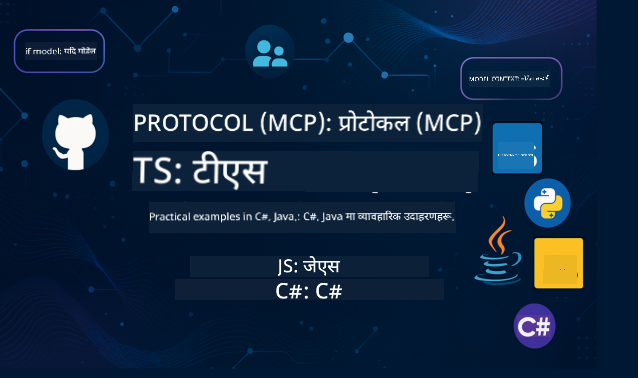

<!--
CO_OP_TRANSLATOR_METADATA:
{
  "original_hash": "866c8877136cb03e1efb9ad633a2f0a6",
  "translation_date": "2025-08-26T17:30:48+00:00",
  "source_file": "README.md",
  "language_code": "ne"
}
-->
 

यी स्रोतहरू प्रयोग गर्न सुरु गर्न यी चरणहरू पालना गर्नुहोस्:
1. **रिपोजिटरी फोर्क गर्नुहोस्**: यहाँ क्लिक गर्नुहोस् 
2. **रिपोजिटरी क्लोन गर्नुहोस्**:   `git clone https://github.com/microsoft/mcp-for-beginners.git`
3. [**Azure AI Foundry Discord मा सामेल हुनुहोस् र विशेषज्ञहरू र अन्य विकासकर्ताहरूसँग भेट्नुहोस्**](https://discord.com/invite/ByRwuEEgH4)

### 🌐 बहुभाषिक समर्थन

#### GitHub Action मार्फत समर्थित (स्वचालित र सधैं अद्यावधिक)

 [अरबी](../ar/README.md) | [बंगाली](../bn/README.md) | [बुल्गेरियन](../bg/README.md) | [बर्मेली (म्यानमार)](../my/README.md) | [चिनियाँ (सरलीकृत)](../zh/README.md) | [चिनियाँ (पारम्परिक, हङकङ)](../hk/README.md) | [चिनियाँ (पारम्परिक, मकाउ)](../mo/README.md) | [चिनियाँ (पारम्परिक, ताइवान)](../tw/README.md) | [क्रोएसियन](../hr/README.md) | [चेक](../cs/README.md) | [डेनिश](../da/README.md) | [डच](../nl/README.md) | [फिनिश](../fi/README.md) | [फ्रान्सेली](../fr/README.md) | [जर्मन](../de/README.md) | [ग्रीक](../el/README.md) | [हिब्रू](../he/README.md) | [हिन्दी](../hi/README.md) | [हंगेरीयन](../hu/README.md) | [इन्डोनेसियन](../id/README.md) | [इटालियन](../it/README.md) | [जापानी](../ja/README.md) | [कोरियन](../ko/README.md) | [मलय](../ms/README.md) | [मराठी](../mr/README.md) | [नेपाली](./README.md) | [नर्वेजियन](../no/README.md) | [फारसी (फारसी)](../fa/README.md) | [पोलिश](../pl/README.md) | [पोर्चुगिज (ब्राजिल)](../br/README.md) | [पोर्चुगिज (पोर्चुगल)](../pt/README.md) | [पञ्जाबी (गुरमुखी)](../pa/README.md) | [रोमानियाली](../ro/README.md) | [रुसी](../ru/README.md) | [सर्बियन (सिरिलिक)](../sr/README.md) | [स्लोभाक](../sk/README.md) | [स्लोभेनियन](../sl/README.md) | [स्पेनिश](../es/README.md) | [स्वाहिली](../sw/README.md) | [स्विडिश](../sv/README.md) | [टागालोग (फिलिपिनो)](../tl/README.md) | [थाई](../th/README.md) | [टर्किश](../tr/README.md) | [युक्रेनी](../uk/README.md) | [उर्दू](../ur/README.md) | [भियतनामी](../vi/README.md)

# 🚀 मोडेल कन्टेक्स्ट प्रोटोकल (MCP) पाठ्यक्रम शुरुआतीहरूको लागि

## **C#, Java, JavaScript, Rust, Python, र TypeScript मा कोड उदाहरणहरूसँग MCP सिक्नुहोस्**

## 🧠 मोडेल कन्टेक्स्ट प्रोटोकल पाठ्यक्रमको अवलोकन

**मोडेल कन्टेक्स्ट प्रोटोकल (MCP)** एक अत्याधुनिक फ्रेमवर्क हो जसले AI मोडेल र क्लाइन्ट एप्लिकेसनहरू बीचको अन्तरक्रियालाई मानकीकरण गर्न डिजाइन गरिएको हो। यो खुला स्रोत पाठ्यक्रमले संरचित सिकाइ मार्ग प्रदान गर्दछ, जसमा व्यावहारिक कोडिङ उदाहरणहरू र वास्तविक संसारका प्रयोग केसहरू समावेश छन्, C#, Java, JavaScript, TypeScript, र Python जस्ता लोकप्रिय प्रोग्रामिङ भाषाहरूमा।

चाहे तपाईं AI विकासकर्ता, प्रणाली वास्तुकार, वा सफ्टवेयर इन्जिनियर हुनुहोस्, यो मार्गदर्शिका MCP को आधारभूत र कार्यान्वयन रणनीतिहरू सिक्नको लागि तपाईंको व्यापक स्रोत हो।

## 🔗 आधिकारिक MCP स्रोतहरू

- 📘 [MCP दस्तावेज](https://modelcontextprotocol.io/) – विस्तृत ट्युटोरियल र प्रयोगकर्ता मार्गदर्शिकाहरू  
- 📜 [MCP विशिष्टता](https://modelcontextprotocol.io/docs/) – प्रोटोकल आर्किटेक्चर र प्राविधिक सन्दर्भहरू  
- 📜 [मूल MCP विशिष्टता](https://spec.modelcontextprotocol.io/) – पुरानो प्राविधिक सन्दर्भहरू (थप विवरणहरू समावेश हुन सक्छ)  
- 🧑‍💻 [MCP GitHub रिपोजिटरी](https://github.com/modelcontextprotocol) – खुला स्रोत SDKs, उपकरणहरू, र कोड नमूनाहरू
- 🌐 [MCP समुदाय](https://github.com/orgs/modelcontextprotocol/discussions) – छलफलहरूमा सामेल हुनुहोस् र समुदायमा योगदान गर्नुहोस्

## 🧭 MCP पाठ्यक्रमको अवलोकन

### 📚 पूर्ण पाठ्यक्रम संरचना

| मोड्युल | विषय | विवरण | लिङ्क |
|--------|-------|-------------|------|
| **मोड्युल 1-3: आधारभूत** | | | |
| 00 | MCP को परिचय | मोडेल कन्टेक्स्ट प्रोटोकल र यसको AI पाइपलाइनहरूमा महत्त्वको अवलोकन | [थप पढ्नुहोस्](./00-Introduction/README.md) |
| 01 | कोर अवधारणाहरूको व्याख्या | MCP को कोर अवधारणाहरूको गहिरो अन्वेषण | [थप पढ्नुहोस्](./01-CoreConcepts/README.md) |
| 02 | MCP मा सुरक्षा | सुरक्षा खतराहरू र उत्तम अभ्यासहरू | [थप पढ्नुहोस्](./02-Security/README.md) |
| 03 | MCP सँग सुरु गर्दै | वातावरण सेटअप, आधारभूत सर्भर/क्लाइन्टहरू, एकीकरण | [थप पढ्नुहोस्](./03-GettingStarted/README.md) |
| **मोड्युल 3: तपाईंको पहिलो सर्भर र क्लाइन्ट निर्माण गर्नुहोस्** | | | |
| 3.1 | पहिलो सर्भर | तपाईंको पहिलो MCP सर्भर बनाउनुहोस् | [मार्गदर्शिका](./03-GettingStarted/01-first-server/README.md) |
| 3.2 | पहिलो क्लाइन्ट | आधारभूत MCP क्लाइन्ट विकास गर्नुहोस् | [मार्गदर्शिका](./03-GettingStarted/02-client/README.md) |
| 3.3 | LLM सँग क्लाइन्ट | ठूला भाषा मोडेलहरू एकीकृत गर्नुहोस् | [मार्गदर्शिका](./03-GettingStarted/03-llm-client/README.md) |
| 3.4 | VS Code एकीकरण | VS Code मा MCP सर्भरहरू प्रयोग गर्नुहोस् | [मार्गदर्शिका](./03-GettingStarted/04-vscode/README.md) |
| 3.5 | stdio सर्भर | stdio ट्रान्सपोर्ट प्रयोग गरेर सर्भरहरू बनाउनुहोस् | [मार्गदर्शिका](./03-GettingStarted/05-stdio-server/README.md) |
| 3.6 | HTTP स्ट्रिमिङ | MCP मा HTTP स्ट्रिमिङ कार्यान्वयन गर्नुहोस् | [मार्गदर्शिका](./03-GettingStarted/06-http-streaming/README.md) |
| 3.7 | AI टूलकिट | MCP सँग AI टूलकिट प्रयोग गर्नुहोस् | [मार्गदर्शिका](./03-GettingStarted/07-aitk/README.md) |
| 3.8 | परीक्षण | तपाईंको MCP सर्भर कार्यान्वयन परीक्षण गर्नुहोस् | [मार्गदर्शिका](./03-GettingStarted/08-testing/README.md) |
| 3.9 | परिनियोजन | उत्पादनमा MCP सर्भरहरू परिनियोजन गर्नुहोस् | [मार्गदर्शिका](./03-GettingStarted/09-deployment/README.md) |
| **मोड्युल 4-5: व्यावहारिक र उन्नत** | | | |
| 04 | व्यावहारिक कार्यान्वयन | SDKs, डिबगिङ, परीक्षण, पुन: प्रयोग गर्न मिल्ने प्रम्प्ट टेम्प्लेटहरू | [थप पढ्नुहोस्](./04-PracticalImplementation/README.md) |
| 05 | MCP मा उन्नत विषयहरू | बहु-मोडल AI, स्केलिङ, उद्यम प्रयोग | [थप पढ्नुहोस्](./05-AdvancedTopics/README.md) |
| 5.1 | Azure एकीकरण | Azure सँग MCP एकीकरण | [मार्गदर्शिका](./05-AdvancedTopics/mcp-integration/README.md) |
| 5.2 | बहु-मोडालिटी | बहु-मोडालिटीहरूसँग काम गर्नुहोस् | [मार्गदर्शिका](./05-AdvancedTopics/mcp-multi-modality/README.md) |
| 5.3 | OAuth2 डेमो | OAuth2 प्रमाणीकरण कार्यान्वयन गर्नुहोस् | [मार्गदर्शिका](./05-AdvancedTopics/mcp-oauth2-demo/README.md) |
| 5.4 | रुट कन्टेक्स्टहरू | रुट कन्टेक्स्टहरू बुझ्नुहोस् र कार्यान्वयन गर्नुहोस् | [मार्गदर्शिका](./05-AdvancedTopics/mcp-root-contexts/README.md) |
| 5.5 | रुटिङ | MCP रुटिङ रणनीतिहरू | [मार्गदर्शिका](./05-AdvancedTopics/mcp-routing/README.md) |
| 5.6 | स्याम्पलिङ | MCP मा स्याम्पलिङ प्रविधिहरू | [मार्गदर्शिका](./05-AdvancedTopics/mcp-sampling/README.md) |
| 5.7 | स्केलिङ | MCP कार्यान्वयनहरू स्केल गर्नुहोस् | [मार्गदर्शिका](./05-AdvancedTopics/mcp-scaling/README.md) |
| 5.8 | सुरक्षा | उन्नत सुरक्षा विचारहरू | [मार्गदर्शिका](./05-AdvancedTopics/mcp-security/README.md) |
| 5.9 | वेब खोज | वेब खोज क्षमताहरू कार्यान्वयन गर्नुहोस् | [मार्गदर्शिका](./05-AdvancedTopics/web-search-mcp/README.md) |
| 5.10 | वास्तविक समय स्ट्रिमिङ | वास्तविक समय स्ट्रिमिङ कार्यक्षमता निर्माण गर्नुहोस् | [मार्गदर्शिका](./05-AdvancedTopics/mcp-realtimestreaming/README.md) |
| 5.11 | वास्तविक समय खोज | वास्तविक समय खोज कार्यान्वयन गर्नुहोस् | [मार्गदर्शिका](./05-AdvancedTopics/mcp-realtimesearch/README.md) |
| 5.12 | Entra ID प्रमाणीकरण | Microsoft Entra ID सँग प्रमाणीकरण | [मार्गदर्शिका](./05-AdvancedTopics/mcp-security-entra/README.md) |
| 5.13 | Foundry एकीकरण | Azure AI Foundry सँग एकीकृत गर्नुहोस् | [मार्गदर्शिका](./05-AdvancedTopics/mcp-foundry-agent-integration/README.md) |
| 5.14 | कन्टेक्स्ट इन्जिनियरिङ | प्रभावकारी कन्टेक्स्ट इन्जिनियरिङका प्रविधिहरू | [मार्गदर्शिका](./05-AdvancedTopics/mcp-contextengineering/README.md) |
| **मोड्युल 6-10: समुदाय र उत्तम अभ्यासहरू** | | | |
| 06 | समुदाय योगदानहरू | MCP इकोसिस्टममा योगदान गर्ने तरिका | [मार्गदर्शिका](./06-CommunityContributions/README.md) |
| 07 | प्रारम्भिक अपनाउनेबाट अन्तर्दृष्टिहरू | वास्तविक संसार कार्यान्वयन कथाहरू | [मार्गदर्शिका](./07-LessonsFromEarlyAdoption/README.md) |
| 08 | MCP का लागि उत्तम अभ्यासहरू | प्रदर्शन, गल्ती-सहनशीलता, लचिलोपन | [मार्गदर्शिका](./08-BestPractices/README.md) |
| 09 | MCP केस अध्ययनहरू | व्यावहारिक कार्यान्वयन उदाहरणहरू | [मार्गदर्शिका](./09-CaseStudy/README.md) |
| 10 | व्यावहारिक कार्यशाला | AI टूलकिटको साथ MCP सर्भर निर्माण गर्नुहोस् | [प्रयोगशाला](./10-StreamliningAIWorkflowsBuildingAnMCPServerWithAIToolkit/README.md) |

### 💻 नमूना कोड परियोजनाहरू

#### आधारभूत MCP क्याल्कुलेटर नमूनाहरू

| भाषा | विवरण | लिङ्क |
|----------|-------------|------|
| C# | MCP सर्भर उदाहरण | [कोड हेर्नुहोस्](./03-GettingStarted/samples/csharp/README.md) |
| Java | MCP क्याल्कुलेटर | [कोड हेर्नुहोस्](./03-GettingStarted/samples/java/calculator/README.md) |
| JavaScript | MCP डेमो | [कोड हेर्नुहोस्](./03-GettingStarted/samples/javascript/README.md) |
| Python | MCP सर्भर | [कोड हेर्नुहोस्](../../03-GettingStarted/samples/python/mcp_calculator_server.py) |
| TypeScript | MCP उदाहरण | [कोड हेर्नुहोस्](./03-GettingStarted/samples/typescript/README.md) |
| Rust | MCP उदाहरण | [कोड हेर्नुहोस्](./03-GettingStarted/samples/rust/README.md) |

#### उन्नत MCP कार्यान्वयनहरू

| भाषा | विवरण | लिङ्क |
|----------|-------------|------|
| C# | उन्नत नमूना | [View Code](./04-PracticalImplementation/samples/csharp/README.md) |
| Java with Spring | कन्टेनर एप उदाहरण | [View Code](./04-PracticalImplementation/samples/java/containerapp/README.md) |
| JavaScript | उन्नत नमूना | [View Code](./04-PracticalImplementation/samples/javascript/README.md) |
| Python | जटिल कार्यान्वयन | [View Code](../../04-PracticalImplementation/samples/python/READMEmd) |
| TypeScript | कन्टेनर नमूना | [View Code](./04-PracticalImplementation/samples/typescript/README.md) |

## 🎯 MCP सिक्नका लागि आवश्यकताहरू

यस पाठ्यक्रमबाट अधिकतम लाभ लिनका लागि तपाईंसँग हुनुपर्छ:

- कम्तिमा निम्न भाषाहरू मध्ये एकमा प्रोग्रामिङको आधारभूत ज्ञान: C#, Java, JavaScript, Python, वा TypeScript  
- क्लाइन्ट-सर्भर मोडेल र API हरूको बुझाइ  
- REST र HTTP अवधारणाहरूको परिचय  
- (वैकल्पिक) AI/ML अवधारणाहरूको पृष्ठभूमि  

- सहयोगका लागि हाम्रो समुदाय छलफलमा सामेल हुनुहोस्  

## 📚 अध्ययन गाइड र स्रोतहरू

यस रिपोजिटरीमा तपाईँलाई प्रभावकारी रूपमा सिक्न र नेभिगेट गर्न मद्दत गर्ने विभिन्न स्रोतहरू समावेश छन्:

### अध्ययन गाइड

[Study Guide](./study_guide.md) उपलब्ध छ जसले यस रिपोजिटरीलाई प्रभावकारी रूपमा नेभिगेट गर्न मद्दत गर्दछ। यसमा समावेश छ:

- सबै समेटिएका विषयहरूको दृश्य पाठ्यक्रम नक्सा  
- प्रत्येक रिपोजिटरी खण्डको विस्तृत विवरण  
- नमूना प्रोजेक्टहरू कसरी प्रयोग गर्ने भन्ने मार्गदर्शन  
- विभिन्न सीप स्तरका लागि सिफारिस गरिएको सिकाइ मार्ग  
- तपाईँको सिकाइ यात्रालाई पूरक बनाउने थप स्रोतहरू  

### परिवर्तन सूची

हामी [Changelog](./changelog.md) राख्छौं जसले पाठ्यक्रम सामग्रीमा भएका सबै महत्त्वपूर्ण अपडेटहरू ट्र्याक गर्दछ, जस्तै:

- नयाँ सामग्री थप  
- संरचनात्मक परिवर्तनहरू  
- सुविधा सुधारहरू  
- दस्तावेजीकरण अपडेटहरू  

## 🛠️ यस पाठ्यक्रमलाई प्रभावकारी रूपमा कसरी प्रयोग गर्ने

यस गाइडका प्रत्येक पाठमा समावेश छ:

1. MCP अवधारणाहरूको स्पष्ट व्याख्या  
2. विभिन्न भाषाहरूमा प्रत्यक्ष कोड उदाहरणहरू  
3. वास्तविक MCP एप्लिकेसनहरू निर्माण गर्न अभ्यासहरू  
4. उन्नत सिक्न चाहनेहरूका लागि अतिरिक्त स्रोतहरू  

## कार्यक्रमहरू 

### [MCP Dev Days जुलाई २०२५](https://developer.microsoft.com/en-us/reactor/series/S-1563/)
#### [➡️Watch on Demand - MCP Dev Days](https://developer.microsoft.com/en-us/reactor/series/S-1563/)
MCP Dev Days मा दुई दिनको गहिरो प्राविधिक जानकारी, समुदायसँगको सम्बन्ध, र व्यावहारिक सिकाइको लागि तयार हुनुहोस्। यो कार्यक्रम Model Context Protocol (MCP) लाई समर्पित छ, जुन AI मोडेलहरू र तिनीहरूले भर पर्ने उपकरणहरूलाई जोड्ने नयाँ मानक हो।  
तपाईं हाम्रो इभेन्ट पेजमा दर्ता गरेर MCP Dev Days हेर्न सक्नुहुन्छ: https://aka.ms/mcpdevdays।  

#### [Day 1: MCP Productivity, DevTools, & Community:](https://developer.microsoft.com/en-us/reactor/series/S-1563/)

यो दिन MCP लाई विकासकर्ताको कार्यप्रवाहमा प्रयोग गर्न र अद्भुत MCP समुदायलाई मनाउन समर्पित छ। हामी Arcade, Block, Okta, र Neon जस्ता साझेदारहरूसँग Microsoft को सहकार्यमा कसरी खुला, विस्तारयोग्य MCP इकोसिस्टम निर्माण भइरहेको छ भन्ने देख्नेछौं।  
- VS Code, Visual Studio, GitHub Copilot, र लोकप्रिय सामुदायिक उपकरणहरूमा वास्तविक-विश्व डेमोहरू  
- व्यावहारिक, सन्दर्भ-चालित विकास कार्यप्रवाहहरू  
- समुदाय-नेतृत्व सत्रहरू र अन्तर्दृष्टिहरू  
चाहे तपाईं MCP मा नयाँ हुनुहुन्छ वा यसमा निर्माण गर्दै हुनुहुन्छ, पहिलो दिनले प्रेरणा र कार्यान्वयन योग्य सुझावहरू प्रदान गर्नेछ।  

#### [Day 2: Build MCP Servers with Confidence](https://developer.microsoft.com/en-us/reactor/series/S-1563/)

यो दिन MCP निर्माणकर्ताहरूका लागि हो। हामी MCP सर्भरहरू निर्माण गर्ने रणनीतिहरू र AI कार्यप्रवाहहरूमा MCP एकीकृत गर्ने उत्तम अभ्यासहरूमा गहिरो रूपमा जानेछौं।  

#### विषयहरू समावेश छन्:

- MCP सर्भरहरू निर्माण गर्ने र तिनीहरूलाई एजेन्ट अनुभवहरूमा एकीकृत गर्ने  
- प्रम्प्ट-चालित विकास  
- सुरक्षा उत्तम अभ्यासहरू  
- Functions, ACA, र API Management जस्ता निर्माण ब्लकहरूको प्रयोग  
- रजिस्ट्री संरेखण र उपकरणहरू (1P + 3P)  

यदि तपाईं विकासकर्ता, उपकरण निर्माणकर्ता, वा AI उत्पादन रणनीतिकार हुनुहुन्छ भने, यो दिन तपाईँलाई मापनयोग्य, सुरक्षित, र भविष्य-तयार MCP समाधानहरू निर्माण गर्न आवश्यक अन्तर्दृष्टिहरूले भरिएको छ।  

### MCP बुट क्याम्प अगस्ट २०२५
MCP सर्भरहरू कसरी निर्माण गर्ने, VS Code सँग एकीकृत गर्ने, र Azure मा व्यावसायिक रूपमा तैनाथ गर्ने सिक्न गहन भिडियो सत्रहरूमा भाग लिनुहोस्। MCP for Beginners पाठ्यक्रमको सामग्रीमा आधारित, व्यावहारिक सीपहरू सिक्नुहोस् जुन प्रमुख कम्पनीहरूले पहिले नै प्रयोग गरिरहेका छन्।  

#### [➡️Watch on Demand MCP Bootcamp | English](https://developer.microsoft.com/en-us/reactor/series/s-1568/)  
#### [➡️Watch on Demand MCP Bootcamp | Brasil](https://developer.microsoft.com/en-us/reactor/series/S-1566/)  
#### [➡️Watch on Demand MCP Bootcamp | Spanish](https://developer.microsoft.com/en-us/reactor/series/S-1567/)  

## 🌟 समुदायलाई धन्यवाद

महत्त्वपूर्ण कोड नमूनाहरू योगदान गरेकोमा Microsoft Valued Professional [Shivam Goyal](https://www.linkedin.com/in/shivam2003/) लाई धन्यवाद।  

## 📜 लाइसेन्स जानकारी

यो सामग्री **MIT License** अन्तर्गत लाइसेन्स गरिएको छ। सर्तहरू र अवस्था हेर्नका लागि [LICENSE](../../LICENSE) हेर्नुहोस्।  

## 🤝 योगदान दिशानिर्देश

यो परियोजनाले योगदान र सुझावहरूलाई स्वागत गर्दछ। अधिकांश योगदानहरूको लागि तपाईँले Contributor License Agreement (CLA) मा सहमति जनाउन आवश्यक छ जसले तपाईँसँग अधिकार छ र वास्तवमा हामीलाई तपाईँको योगदान प्रयोग गर्न अधिकार दिन्छ। विवरणका लागि <https://cla.opensource.microsoft.com> मा जानुहोस्।  

जब तपाईँले pull request पेश गर्नुहुन्छ, CLA बोटले स्वचालित रूपमा निर्धारण गर्नेछ कि तपाईँले CLA प्रदान गर्न आवश्यक छ कि छैन र PR लाई उपयुक्त रूपमा सजाउनेछ (जस्तै, स्थिति जाँच, टिप्पणी)। बोटले प्रदान गरेको निर्देशनहरू पालना गर्नुहोस्। तपाईँले यो सबै रिपोजिटरीहरूमा एक पटक मात्र गर्नुपर्नेछ जसले हाम्रो CLA प्रयोग गर्दछ।  

यस परियोजनाले [Microsoft Open Source Code of Conduct](https://opensource.microsoft.com/codeofconduct/) अपनाएको छ।  
थप जानकारीका लागि [Code of Conduct FAQ](https://opensource.microsoft.com/codeofconduct/faq/) हेर्नुहोस् वा [opencode@microsoft.com](mailto:opencode@microsoft.com) मा सम्पर्क गर्नुहोस्।  

## 📂 रिपोजिटरी संरचना

रिपोजिटरी यसरी व्यवस्थित छ:

- **Core Curriculum (00-10)**: मुख्य सामग्री दस क्रमिक मोड्युलहरूमा व्यवस्थित  
- **images/**: पाठ्यक्रमभर प्रयोग गरिएका आरेख र चित्रहरू  
- **translations/**: स्वचालित अनुवादहरूसहित बहुभाषी समर्थन  
- **translated_images/**: आरेख र चित्रहरूको स्थानीयकृत संस्करणहरू  
- **study_guide.md**: रिपोजिटरी नेभिगेट गर्नका लागि व्यापक गाइड  
- **changelog.md**: पाठ्यक्रम सामग्रीमा भएका सबै महत्त्वपूर्ण परिवर्तनहरूको रेकर्ड  
- **mcp.json**: MCP विशिष्टताको लागि कन्फिगरेसन फाइल  
- **CODE_OF_CONDUCT.md, LICENSE, SECURITY.md, SUPPORT.md**: परियोजना शासन दस्तावेजहरू  

## 🎒 अन्य पाठ्यक्रमहरू
हाम्रो टोलीले अन्य पाठ्यक्रमहरू पनि उत्पादन गर्दछ! हेर्नुहोस्:

- [AI Agents For Beginners](https://github.com/microsoft/ai-agents-for-beginners?WT.mc_id=academic-105485-koreyst)  
- [Generative AI for Beginners using .NET](https://github.com/microsoft/Generative-AI-for-beginners-dotnet?WT.mc_id=academic-105485-koreyst)  
- [Generative AI for Beginners using JavaScript](https://github.com/microsoft/generative-ai-with-javascript?WT.mc_id=academic-105485-koreyst)  
- [Generative AI for Beginners](https://github.com/microsoft/generative-ai-for-beginners?WT.mc_id=academic-105485-koreyst)  
- [Generative AI for Beginners using Java](https://github.com/microsoft/generative-ai-for-beginners-java?WT.mc_id=academic-105485-koreyst)  
- [ML for Beginners](https://aka.ms/ml-beginners?WT.mc_id=academic-105485-koreyst)  
- [Data Science for Beginners](https://aka.ms/datascience-beginners?WT.mc_id=academic-105485-koreyst)  
- [AI for Beginners](https://aka.ms/ai-beginners?WT.mc_id=academic-105485-koreyst)  
- [Cybersecurity for Beginners](https://github.com/microsoft/Security-101?WT.mc_id=academic-96948-sayoung)  
- [Web Dev for Beginners](https://aka.ms/webdev-beginners?WT.mc_id=academic-105485-koreyst)  
- [IoT for Beginners](https://aka.ms/iot-beginners?WT.mc_id=academic-105485-koreyst)  
- [XR Development for Beginners](https://github.com/microsoft/xr-development-for-beginners?WT.mc_id=academic-105485-koreyst)  
- [Mastering GitHub Copilot for AI Paired Programming](https://aka.ms/GitHubCopilotAI?WT.mc_id=academic-105485-koreyst)  
- [Mastering GitHub Copilot for C#/.NET Developers](https://github.com/microsoft/mastering-github-copilot-for-dotnet-csharp-developers?WT.mc_id=academic-105485-koreyst)  
- [Choose Your Own Copilot Adventure](https://github.com/microsoft/CopilotAdventures?WT.mc_id=academic-105485-koreyst)  

## ™️ ट्रेडमार्क सूचना

यस परियोजनामा परियोजना, उत्पादन, वा सेवाहरूका लागि ट्रेडमार्क वा लोगोहरू समावेश हुन सक्छ। Microsoft ट्रेडमार्क वा लोगोहरूको अधिकृत प्रयोग [Microsoft's Trademark & Brand Guidelines](https://www.microsoft.com/legal/intellectualproperty/trademarks/usage/general) पालना गर्नुपर्छ।  
यस परियोजनाको परिमार्जित संस्करणहरूमा Microsoft ट्रेडमार्क वा लोगोहरूको प्रयोगले भ्रम सिर्जना गर्नु हुँदैन वा Microsoft प्रायोजनको संकेत गर्नु हुँदैन। तेस्रो-पक्ष ट्रेडमार्क वा लोगोहरूको कुनै पनि प्रयोग तिनीहरूको नीतिहरूको अधीनमा हुन्छ।  

---

**अस्वीकरण**:  
यो दस्तावेज़ AI अनुवाद सेवा [Co-op Translator](https://github.com/Azure/co-op-translator) प्रयोग गरेर अनुवाद गरिएको छ। हामी शुद्धताको लागि प्रयास गर्छौं, तर कृपया ध्यान दिनुहोस् कि स्वचालित अनुवादमा त्रुटिहरू वा अशुद्धताहरू हुन सक्छ। यसको मूल भाषा मा रहेको मूल दस्तावेज़लाई आधिकारिक स्रोत मानिनुपर्छ। महत्वपूर्ण जानकारीको लागि, व्यावसायिक मानव अनुवाद सिफारिस गरिन्छ। यस अनुवादको प्रयोगबाट उत्पन्न हुने कुनै पनि गलतफहमी वा गलत व्याख्याको लागि हामी जिम्मेवार हुने छैनौं।