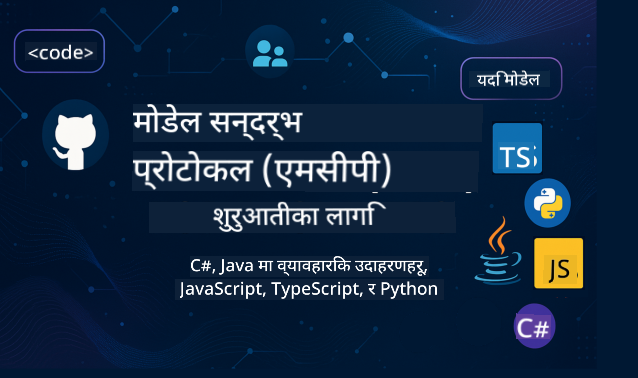

<!--
CO_OP_TRANSLATOR_METADATA:
{
  "original_hash": "2a21391378c12ecfef50f866329dfde0",
  "translation_date": "2025-05-17T05:22:17+00:00",
  "source_file": "README.md",
  "language_code": "ne"
}
-->

यी स्रोतहरू प्रयोग गर्न सुरु गर्न निम्न चरणहरू अनुसरण गर्नुहोस्:
1. **रिपोजिटरीलाई फोर्क गर्नुहोस्**: क्लिक गर्नुहोस् 
2. **रिपोजिटरीलाई क्लोन गर्नुहोस्**: `git clone https://github.com/microsoft/mcp-for-beginners.git`
3. [**Microsoft Azure AI Foundry Discordमा सामेल हुनुहोस् र विशेषज्ञहरू तथा अन्य विकासकर्ताहरूलाई भेट्नुहोस्**](https://discord.com/invite/ByRwuEEgH4)

### 🌐 बहुभाषिक समर्थन

#### GitHub Action मार्फत समर्थन (स्वचालित र सधैं अद्यावधिक)
[फ्रेन्च](../fr/README.md) | [स्पेनिश](../es/README.md) | [जर्मन](../de/README.md) | [रूसी](../ru/README.md) | [अरबी](../ar/README.md) | [फारसी (पर्सियन)](../fa/README.md) | [उर्दू](../ur/README.md) | [चिनियाँ (सरलीकृत)](../zh/README.md) | [चिनियाँ (पारम्परिक, मकाउ)](../mo/README.md) | [चिनियाँ (पारम्परिक, हङकङ)](../hk/README.md) | [चिनियाँ (पारम्परिक, ताइवान)](../tw/README.md) | [जापानी](../ja/README.md) | [कोरियाली](../ko/README.md) | [हिन्दी](../hi/README.md) | [बंगाली](../bn/README.md) | [मराठी](../mr/README.md) | [नेपाली](./README.md) | [पंजाबी (गुरमुखी)](../pa/README.md) | [पोर्तुगिज (पोर्तुगल)](../pt/README.md) | [पोर्तुगिज (ब्राजिल)](../br/README.md) | [इटालियन](../it/README.md) | [पोलिश](../pl/README.md) | [टर्किश](../tr/README.md) | [ग्रीक](../el/README.md) | [थाई](../th/README.md) | [स्विडिश](../sv/README.md) | [डेनिश](../da/README.md) | [नर्वेजियन](../no/README.md) | [फिनिश](../fi/README.md) | [डच](../nl/README.md) | [हिब्रू](../he/README.md) | [भियतनामी](../vi/README.md) | [इन्डोनेसियन](../id/README.md) | [मलाय](../ms/README.md) | [टागालोग (फिलिपिनो)](../tl/README.md) | [स्वाहिली](../sw/README.md) | [हङ्गेरियन](../hu/README.md) | [चेक](../cs/README.md) | [स्लोभाक](../sk/README.md) | [रोमानियन](../ro/README.md) | [बुल्गेरियन](../bg/README.md) | [सर्बियाली (सिरिलिक)](../sr/README.md) | [क्रोएसियन](../hr/README.md) | [स्लोभेनियन](../sl/README.md)
# 🚀 प्रारम्भिकहरूका लागि मोडल कन्टेक्स्ट प्रोटोकल (MCP) पाठ्यक्रमको अन्तिम मार्गदर्शिका

## **C#, Java, JavaScript, Python, र TypeScript मा प्रयोगात्मक कोड उदाहरणहरू सहित MCP सिक्नुहोस्**

## 🧠 मोडल कन्टेक्स्ट प्रोटोकल पाठ्यक्रमको अवलोकन

**मोडल कन्टेक्स्ट प्रोटोकल (MCP)** एक अत्याधुनिक फ्रेमवर्क हो जसले AI मोडेलहरू र क्लाइन्ट अनुप्रयोगहरू बीचको अन्तरक्रियालाई मानकीकरण गर्न डिजाइन गरिएको हो। यो खुला-स्रोत पाठ्यक्रमले संरचित सिकाइ मार्ग प्रदान गर्दछ, लोकप्रिय प्रोग्रामिङ भाषाहरू जस्तै C#, Java, JavaScript, TypeScript, र Python मा व्यावहारिक कोड उदाहरणहरू र वास्तविक संसारको प्रयोग केसहरू सहित।

तपाईं AI विकासकर्ता, प्रणाली वास्तुकार, वा सफ्टवेयर इन्जिनियर होस्, यो मार्गदर्शिका MCP को आधारभूत तत्वहरू र कार्यान्वयन रणनीतिहरूमा महारत हासिल गर्नको लागि तपाईंको व्यापक स्रोत हो।

## 🔗 आधिकारिक MCP स्रोतहरू

- 📘 [MCP दस्तावेजीकरण](https://modelcontextprotocol.io/) – विस्तृत ट्यूटोरियल र प्रयोगकर्ता मार्गदर्शिका  
- 📜 [MCP विशिष्टता](https://spec.modelcontextprotocol.io/) – प्रोटोकल आर्किटेक्चर र प्राविधिक सन्दर्भहरू  
- 🧑‍💻 [MCP GitHub भण्डार](https://github.com/modelcontextprotocol) – खुला-स्रोत SDKs, उपकरणहरू, र कोड नमूनाहरू  

## 🧭 MCP पाठ्यक्रम संरचना

### 📌 [MCP परिचय](./00-Introduction/README.md)

- मोडल कन्टेक्स्ट प्रोटोकल के हो?
- AI पाइपलाइनहरूमा मानकीकरण किन महत्त्वपूर्ण छ
- MCP का व्यावहारिक प्रयोग केसहरू र लाभहरू

### 🧩 [मूल अवधारणाहरूको व्याख्या](./01-CoreConcepts/README.md)

- MCP मा क्लाइन्ट-सर्भर वास्तुकला बुझ्दै
- प्रमुख प्रोटोकल घटकहरू: अनुरोध, प्रतिक्रिया, र योजनाहरू
- MCP सन्देश र डेटा आदानप्रदान ढाँचाहरू

### 🔐 [MCP मा सुरक्षा](./02-Security/readme.md)

- MCP-आधारित प्रणालीहरूमा सुरक्षा खतरा पहिचान गर्दै
- कार्यान्वयनहरू सुरक्षित गर्ने प्रविधिहरू र उत्तम अभ्यासहरू

### 🚀 [MCP सुरु गर्दै](./03-GettingStarted/README.md)

- वातावरण सेटअप र कन्फिगरेसन
- आधारभूत MCP सर्भरहरू र क्लाइन्टहरू सिर्जना गर्दै
- विद्यमान अनुप्रयोगहरूसँग MCP एकीकृत गर्दै

#### 🧮 MCP क्यालकुलेटर नमूना परियोजनाहरू:

  
<strong>भाषा अनुसार कोड कार्यान्वयन अन्वेषण गर्नुहोस्</strong>

  - [C# MCP सर्भर उदाहरण](./03-GettingStarted/samples/csharp/README.md)
  - [Java MCP क्यालकुलेटर](./03-GettingStarted/samples/java/calculator/README.md)
  - [JavaScript MCP डेमो](./03-GettingStarted/samples/javascript/README.md)
  - [Python MCP सर्भर](../../03-GettingStarted/samples/python/mcp_calculator_server.py)
  - [TypeScript MCP उदाहरण](./03-GettingStarted/samples/typescript/README.md)

### 🛠️ [व्यावहारिक कार्यान्वयन](./04-PracticalImplementation/README.md)

- विभिन्न भाषाहरूमा SDKs प्रयोग गर्दै
- डिबगिङ, परीक्षण, र मान्यता
- पुनः प्रयोग योग्य प्रॉम्प्ट टेम्पलेटहरू र कार्यप्रवाहहरू सिर्जना गर्दै

#### 💡 MCP उन्नत क्यालकुलेटर परियोजनाहरू:

  
<strong>उन्नत नमूनाहरू अन्वेषण गर्नुहोस्</strong>

  - [उन्नत C# नमूना](./04-PracticalImplementation/samples/csharp/README.md)
  - [Java कन्टेनर अनुप्रयोग उदाहरण](./04-PracticalImplementation/samples/java/containerapp/README.md)
  - [JavaScript उन्नत नमूना](./04-PracticalImplementation/samples/javascript/README.md)
  - [Python जटिल कार्यान्वयन](../../04-PracticalImplementation/samples/python/mcp_sample.py)
  - [TypeScript कन्टेनर नमूना](./04-PracticalImplementation/samples/typescript/README.md)

### 🎓 [MCP मा उन्नत विषयहरू](./05-AdvancedTopics/README.md)

- बहु-मोडल AI कार्यप्रवाहहरू र विस्तारयोग्यता
- सुरक्षित मापन रणनीतिहरू
- उद्यम पारिस्थितिकी तन्त्रमा MCP

### 🌍 [समुदाय योगदानहरू](./06-CommunityContributions/README.md)

- कोड र दस्तावेजहरू कसरी योगदान गर्ने
- GitHub मार्फत सहयोग गर्दै
- समुदाय-संचालित सुधारहरू र प्रतिक्रिया

### 📈 [प्रारम्भिक अपनाउनेबाट अन्तर्दृष्टि](./07-CaseStudies/README.md)

- वास्तविक संसार कार्यान्वयनहरू र के काम गर्यो
- MCP-आधारित समाधानहरू निर्माण र तैनाती गर्दै
- प्रवृत्तिहरू र भविष्यको रोडम्याप

### 📏 [MCP को लागि उत्तम अभ्यासहरू](./08-BestPractices/README.md)

- प्रदर्शन ट्युनिङ र अनुकूलन
- दोष-सहनशील MCP प्रणालीहरू डिजाइन गर्दै
- परीक्षण र लचीलापन रणनीतिहरू

### 📊 [MCP केस अध्ययनहरू](./09-CaseStudy/Readme.md)

- MCP समाधान वास्तुकलामा गहिरो-डाइभ
- तैनाती ब्लूप्रिन्टहरू र एकीकृत सुझावहरू
- एनोटेटेड डायग्रामहरू र परियोजना वाकथ्रूहरू

## 🎯 MCP सिक्नको लागि पूर्वापेक्षाहरू

यस पाठ्यक्रमबाट अधिकतम लाभ उठाउनको लागि, तपाईंले:

- C#, Java, वा Python को आधारभूत ज्ञान
- क्लाइन्ट-सर्भर मोडेल र APIs को बुझाइ
- (वैकल्पिक) मशीन लर्निङ अवधारणाहरूको परिचय

## 🛠️ यो पाठ्यक्रमलाई प्रभावकारी रूपमा कसरी प्रयोग गर्ने

यस मार्गदर्शिकाको प्रत्येक पाठमा समावेश छ:

1. MCP अवधारणाहरूको स्पष्ट व्याख्या  
2. बहु भाषाहरूमा लाइभ कोड उदाहरणहरू  
3. वास्तविक MCP अनुप्रयोगहरू निर्माण गर्न अभ्यासहरू  
4. उन्नत सिक्नेहरूका लागि अतिरिक्त स्रोतहरू  

## 📜 लाइसेन्स जानकारी

यो सामग्री **MIT लाइसेन्स** अन्तर्गत लाइसेन्स गरिएको छ। सर्तहरू र शर्तहरूको लागि, [लाइसेन्स](../../LICENSE) हेर्नुहोस्।

## 🤝 योगदान दिशानिर्देशहरू

यो परियोजनाले योगदानहरू र सुझावहरूलाई स्वागत गर्दछ। अधिकांश योगदानहरूले तपाईंलाई एक
योगदानकर्ता लाइसेन्स सम्झौता (CLA) सहमत गर्न आवश्यक पर्दछ जसले तपाईंलाई अधिकार दिन्छ, र वास्तवमा हामीलाई
तपाईंको योगदान प्रयोग गर्न अधिकार प्रदान गर्दछ। विवरणको लागि, <https://cla.opensource.microsoft.com> भ्रमण गर्नुहोस्।

जब तपाईं एक पुल अनुरोध प्रस्तुत गर्नुहुन्छ, एक CLA बोटले स्वचालित रूपमा निर्धारण गर्नेछ कि तपाईंले प्रदान गर्न आवश्यक छ
एक CLA र PR लाई उपयुक्त रूपमा सजाउनुहोस् (जस्तै, स्थिति जाँच, टिप्पणी)। बोटले प्रदान गरेको निर्देशनहरूलाई मात्र पालना गर्नुहोस्।
हामीसँग CLA प्रयोग गर्ने सबै भण्डारहरूमा तपाईंले यो एक पटक मात्र गर्न आवश्यक हुनेछ।

यस परियोजनाले [Microsoft ओपन स्रोत आचार संहिता](https://opensource.microsoft.com/codeofconduct/) अपनाएको छ।
थप जानकारीको लागि [आचार संहिता FAQ](https://opensource.microsoft.com/codeofconduct/faq/) हेर्नुहोस् वा
कुनै अतिरिक्त प्रश्न वा टिप्पणीको लागि [opencode@microsoft.com](mailto:opencode@microsoft.com) मा सम्पर्क गर्नुहोस्।

## ™️ ट्रेडमार्क सूचना

यो परियोजनामा परियोजनाहरू, उत्पादनहरू, वा सेवाहरूको लागि ट्रेडमार्कहरू वा लोगोहरू समावेश हुन सक्छ। Microsoft
ट्रेडमार्कहरू वा लोगोहरूको अधिकृत प्रयोगले पालन गर्नु आवश्यक छ र पालन गर्नु पर्दछ
[Microsoft's ट्रेडमार्क & ब्रान्ड दिशानिर्देश](https://www.microsoft.com/legal/intellectualproperty/trademarks/usage/general)।
यस परियोजनाको परिमार्जित संस्करणहरूमा Microsoft ट्रेडमार्कहरू वा लोगोहरूको प्रयोगले भ्रम सिर्जना गर्नु हुँदैन वा Microsoft प्रायोजनको संकेत गर्नु हुँदैन।
कुनै पनि तेस्रो-पक्ष ट्रेडमार्कहरू वा लोगोहरूको प्रयोग ती तेस्रो-पक्षको नीतिहरूको अधीनमा छ।

**अस्वीकरण**:  
यो दस्तावेज़ AI अनुवाद सेवा [Co-op Translator](https://github.com/Azure/co-op-translator) प्रयोग गरी अनुवाद गरिएको हो। हामी यथार्थताको लागि प्रयास गर्छौं, कृपया सचेत रहनुहोस् कि स्वचालित अनुवादहरूमा त्रुटिहरू वा अशुद्धताहरू हुन सक्छ। यसको मौलिक भाषामा रहेको दस्तावेज़लाई आधिकारिक स्रोत मानिनु पर्छ। महत्त्वपूर्ण जानकारीको लागि, व्यावसायिक मानव अनुवाद सिफारिस गरिन्छ। यस अनुवादको प्रयोगबाट उत्पन्न हुने कुनै पनि गलतफहमी वा गलत व्याख्या प्रति हामी जिम्मेवार हुने छैनौं।