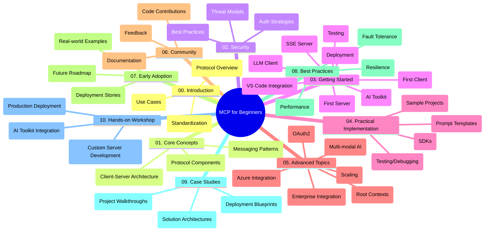

<!--
CO_OP_TRANSLATOR_METADATA:
{
  "original_hash": "a607d4febc94caee9a12b77795f7fc9a",
  "translation_date": "2025-07-13T15:12:48+00:00",
  "source_file": "study_guide.md",
  "language_code": "ne"
}
-->
# Model Context Protocol (MCP) for Beginners - अध्ययन मार्गदर्शन

यो अध्ययन मार्गदर्शनले "Model Context Protocol (MCP) for Beginners" पाठ्यक्रमको रिपोजिटरी संरचना र सामग्रीको अवलोकन प्रदान गर्दछ। उपलब्ध स्रोतहरूलाई प्रभावकारी रूपमा प्रयोग गर्न र रिपोजिटरीमा सजिलै नेभिगेट गर्न यो मार्गदर्शन प्रयोग गर्नुहोस्।

## रिपोजिटरी अवलोकन

Model Context Protocol (MCP) AI मोडेलहरू र क्लाइन्ट एप्लिकेसनहरू बीचको अन्तरक्रियाका लागि एक मानकीकृत फ्रेमवर्क हो। यो रिपोजिटरीले C#, Java, JavaScript, Python, र TypeScript मा व्यावहारिक कोड उदाहरणहरूसहित व्यापक पाठ्यक्रम प्रदान गर्दछ, जुन AI विकासकर्ता, सिस्टम आर्किटेक्ट, र सफ्टवेयर इन्जिनियरहरूका लागि डिजाइन गरिएको हो।

## भिजुअल पाठ्यक्रम नक्सा

## रिपोजिटरी संरचना

रिपोजिटरीलाई MCP का विभिन्न पक्षहरूमा केन्द्रित दस मुख्य भागहरूमा विभाजन गरिएको छ:

1. **परिचय (00-Introduction/)**
   - Model Context Protocol को अवलोकन
   - AI पाइपलाइनहरूमा मानकीकरण किन आवश्यक छ
   - व्यावहारिक प्रयोग र फाइदाहरू

2. **मूल अवधारणाहरू (01-CoreConcepts/)**
   - क्लाइन्ट-सर्भर आर्किटेक्चर
   - प्रमुख प्रोटोकल कम्पोनेन्टहरू
   - MCP मा मेसेजिङ ढाँचाहरू

3. **सुरक्षा (02-Security/)**
   - MCP आधारित प्रणालीहरूमा सुरक्षा खतराहरू
   - कार्यान्वयन सुरक्षित बनाउनका लागि उत्तम अभ्यासहरू
   - प्रमाणीकरण र प्राधिकरण रणनीतिहरू

4. **सुरु गर्ने तरिका (03-GettingStarted/)**
   - वातावरण सेटअप र कन्फिगरेसन
   - आधारभूत MCP सर्भर र क्लाइन्ट सिर्जना गर्ने तरिका
   - विद्यमान एप्लिकेसनहरूसँग एकीकरण
   - पहिलो सर्भर, पहिलो क्लाइन्ट, LLM क्लाइन्ट, VS Code एकीकरण, SSE सर्भर, AI Toolkit, परीक्षण, र डिप्लोयमेन्टका उपविभागहरू

5. **व्यावहारिक कार्यान्वयन (04-PracticalImplementation/)**
   - विभिन्न प्रोग्रामिङ भाषाहरूमा SDK प्रयोग गर्ने तरिका
   - डिबगिङ, परीक्षण, र मान्यकरण प्रविधिहरू
   - पुन: प्रयोग गर्न मिल्ने प्रॉम्प्ट टेम्प्लेट र वर्कफ्लोहरू तयार पार्ने
   - कार्यान्वयन उदाहरणहरूसहित नमूना परियोजनाहरू

6. **उन्नत विषयहरू (05-AdvancedTopics/)**
   - बहु-मोडल AI वर्कफ्लो र विस्तारयोग्यता
   - सुरक्षित स्केलिङ रणनीतिहरू
   - उद्यम इकोसिस्टममा MCP
   - Azure एकीकरण, बहु-मोडालिटी, OAuth2, रुट कन्टेक्स्टहरू, राउटिङ, स्याम्पलिङ, स्केलिङ, सुरक्षा, वेब सर्च एकीकरण, र स्ट्रिमिङ जस्ता विशेष विषयहरू

7. **समुदाय योगदानहरू (06-CommunityContributions/)**
   - कोड र दस्तावेजीकरणमा कसरी योगदान गर्ने
   - GitHub मार्फत सहकार्य गर्ने तरिका
   - समुदायद्वारा सञ्चालित सुधार र प्रतिक्रिया

8. **प्रारम्भिक अपनत्वबाट सिकाइ (07-LessonsfromEarlyAdoption/)**
   - वास्तविक कार्यान्वयन र सफलताको कथाहरू
   - MCP आधारित समाधानहरू निर्माण र डिप्लोय गर्ने तरिका
   - प्रवृत्ति र भविष्यको रोडम्याप

9. **उत्तम अभ्यासहरू (08-BestPractices/)**
   - प्रदर्शन सुधार र अनुकूलन
   - दोष सहने MCP प्रणाली डिजाइन गर्ने तरिका
   - परीक्षण र लचिलोपन रणनीतिहरू

10. **केस अध्ययनहरू (09-CaseStudy/)**
    - MCP समाधान आर्किटेक्चरमा गहिरो विश्लेषण
    - डिप्लोयमेन्ट ब्लूप्रिन्ट र एकीकरण सुझावहरू
    - व्याख्यात्मक चित्रहरू र परियोजना मार्गदर्शन

11. **व्यावहारिक कार्यशाला (10-StreamliningAIWorkflowsBuildingAnMCPServerWithAIToolkit/)**
    - Microsoft को AI Toolkit सँग MCP संयोजन गरी व्यापक व्यावहारिक कार्यशाला
    - AI मोडेलहरूलाई वास्तविक उपकरणहरूसँग जोड्ने बुद्धिमान एप्लिकेसनहरू निर्माण गर्ने
    - आधारभूत, कस्टम सर्भर विकास, र उत्पादन डिप्लोयमेन्ट रणनीतिहरू समेटिएका व्यावहारिक मोड्युलहरू

## नमूना परियोजनाहरू

रिपोजिटरीमा विभिन्न प्रोग्रामिङ भाषाहरूमा MCP कार्यान्वयन देखाउने धेरै नमूना परियोजनाहरू समावेश छन्:

### आधारभूत MCP क्याल्कुलेटर नमूनाहरू
- C# MCP सर्भर उदाहरण
- Java MCP क्याल्कुलेटर
- JavaScript MCP डेमो
- Python MCP सर्भर
- TypeScript MCP उदाहरण

### उन्नत MCP क्याल्कुलेटर परियोजनाहरू
- उन्नत C# नमूना
- Java कन्टेनर एप्लिकेसन उदाहरण
- JavaScript उन्नत नमूना
- Python जटिल कार्यान्वयन
- TypeScript कन्टेनर नमूना

## अतिरिक्त स्रोतहरू

रिपोजिटरीमा सहयोगी स्रोतहरू समावेश छन्:

- **Images फोल्डर**: पाठ्यक्रमभर प्रयोग भएका चित्र र आरेखहरू
- **अनुवादहरू**: दस्तावेजीकरणका लागि बहुभाषिक समर्थन र स्वचालित अनुवादहरू
- **आधिकारिक MCP स्रोतहरू**:
  - [MCP Documentation](https://modelcontextprotocol.io/)
  - [MCP Specification](https://spec.modelcontextprotocol.io/)
  - [MCP GitHub Repository](https://github.com/modelcontextprotocol)

## यो रिपोजिटरी कसरी प्रयोग गर्ने

1. **क्रमिक सिकाइ**: संरचित सिकाइ अनुभवका लागि अध्यायहरूलाई क्रमशः (00 देखि 10 सम्म) पालना गर्नुहोस्।
2. **भाषा-विशेष ध्यान**: यदि तपाईंलाई कुनै विशेष प्रोग्रामिङ भाषामा रुचि छ भने, आफ्नो रोजाइको भाषामा कार्यान्वयनका लागि नमूना डाइरेक्टरीहरू अन्वेषण गर्नुहोस्।
3. **व्यावहारिक कार्यान्वयन**: वातावरण सेटअप गर्न र पहिलो MCP सर्भर र क्लाइन्ट सिर्जना गर्न "Getting Started" भागबाट सुरु गर्नुहोस्।
4. **उन्नत अन्वेषण**: आधारभूत कुरामा सहज भएपछि, आफ्नो ज्ञान विस्तार गर्न उन्नत विषयहरूमा प्रवेश गर्नुहोस्।
5. **समुदाय सहभागिता**: विशेषज्ञ र अन्य विकासकर्ताहरूसँग जडान हुन [Azure AI Foundry Discord](https://discord.com/invite/ByRwuEEgH4) मा सहभागी हुनुहोस्।

## योगदान

यो रिपोजिटरीले समुदायबाट योगदानहरू स्वागत गर्दछ। योगदान कसरी गर्ने बारे मार्गदर्शनका लागि समुदाय योगदानहरू भाग हेर्नुहोस्।

---

*यो अध्ययन मार्गदर्शन ११ जुन २०२५ मा तयार पारिएको हो र सो मितिसम्मको रिपोजिटरीको अवलोकन प्रदान गर्दछ। त्यसपछि रिपोजिटरी सामग्री अपडेट भएको हुन सक्छ।*

**अस्वीकरण**:  
यो दस्तावेज AI अनुवाद सेवा [Co-op Translator](https://github.com/Azure/co-op-translator) प्रयोग गरी अनुवाद गरिएको हो। हामी शुद्धताका लागि प्रयासरत छौं, तर कृपया ध्यान दिनुहोस् कि स्वचालित अनुवादमा त्रुटि वा अशुद्धता हुन सक्छ। मूल दस्तावेज यसको मूल भाषामा नै अधिकारिक स्रोत मानिनुपर्छ। महत्वपूर्ण जानकारीका लागि व्यावसायिक मानव अनुवाद सिफारिस गरिन्छ। यस अनुवादको प्रयोगबाट उत्पन्न कुनै पनि गलतफहमी वा गलत व्याख्याका लागि हामी जिम्मेवार छैनौं।