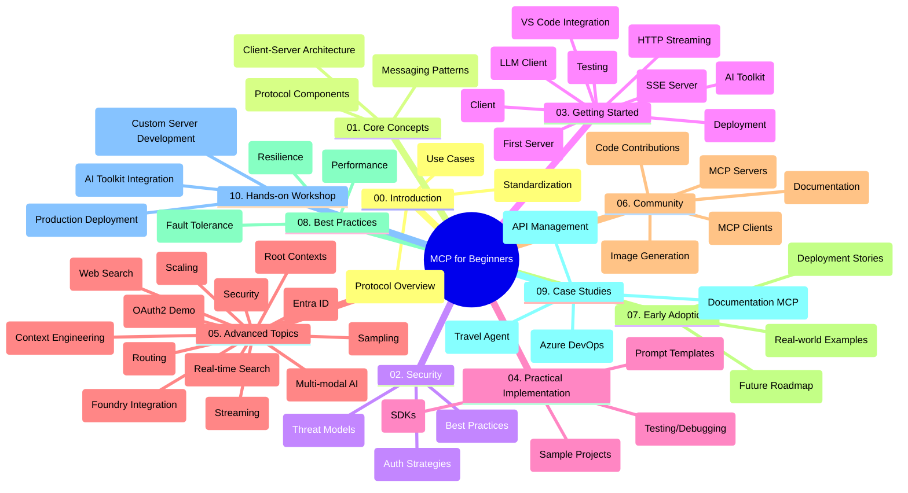

<!--
CO_OP_TRANSLATOR_METADATA:
{
  "original_hash": "77bfab7090f987a5b9fe078f50dbda13",
  "translation_date": "2025-07-17T00:29:43+00:00",
  "source_file": "study_guide.md",
  "language_code": "ne"
}
-->
# Model Context Protocol (MCP) for Beginners - अध्ययन मार्गदर्शन

यो अध्ययन मार्गदर्शनले "Model Context Protocol (MCP) for Beginners" पाठ्यक्रमको रिपोजिटरी संरचना र सामग्रीको अवलोकन प्रदान गर्दछ। यस मार्गदर्शनलाई प्रयोग गरी रिपोजिटरीमा सजिलै नेभिगेट गर्न र उपलब्ध स्रोतहरूलाई प्रभावकारी रूपमा उपयोग गर्न सकिन्छ।

## रिपोजिटरी अवलोकन

Model Context Protocol (MCP) AI मोडेलहरू र क्लाइन्ट एप्लिकेसनहरू बीचको अन्तरक्रियाका लागि एक मानकीकृत फ्रेमवर्क हो। सुरुमा Anthropic द्वारा सिर्जना गरिएको MCP अहिले आधिकारिक GitHub संगठन मार्फत व्यापक MCP समुदायले व्यवस्थापन गर्दछ। यो रिपोजिटरी AI विकासकर्ता, सिस्टम आर्किटेक्ट, र सफ्टवेयर इन्जिनियरहरूका लागि C#, Java, JavaScript, Python, र TypeScript मा व्यावहारिक कोड उदाहरणहरूसहित व्यापक पाठ्यक्रम प्रदान गर्दछ।

## भिजुअल पाठ्यक्रम नक्सा

## रिपोजिटरी संरचना

रिपोजिटरीलाई MCP का विभिन्न पक्षहरूमा केन्द्रित दस मुख्य भागहरूमा विभाजन गरिएको छ:

1. **परिचय (00-Introduction/)**
   - Model Context Protocol को अवलोकन
   - AI पाइपलाइनहरूमा मानकीकरण किन आवश्यक छ
   - व्यावहारिक प्रयोगका केसहरू र फाइदाहरू

2. **मूल अवधारणाहरू (01-CoreConcepts/)**
   - क्लाइन्ट-सर्भर आर्किटेक्चर
   - प्रमुख प्रोटोकल कम्पोनेन्टहरू
   - MCP मा मेसेजिङ ढाँचाहरू

3. **सुरक्षा (02-Security/)**
   - MCP आधारित प्रणालीहरूमा सुरक्षा खतराहरू
   - कार्यान्वयन सुरक्षित बनाउनका लागि उत्तम अभ्यासहरू
   - प्रमाणीकरण र प्राधिकरण रणनीतिहरू

4. **सुरु गर्ने तरिका (03-GettingStarted/)**
   - वातावरण सेटअप र कन्फिगरेसन
   - आधारभूत MCP सर्भर र क्लाइन्ट सिर्जना
   - विद्यमान एप्लिकेसनहरूसँग एकीकरण
   - समावेश भागहरू:
     - पहिलो सर्भर कार्यान्वयन
     - क्लाइन्ट विकास
     - LLM क्लाइन्ट एकीकरण
     - VS Code एकीकरण
     - Server-Sent Events (SSE) सर्भर
     - HTTP स्ट्रिमिङ
     - AI Toolkit एकीकरण
     - परीक्षण रणनीतिहरू
     - डिप्लोयमेन्ट मार्गनिर्देशन

5. **व्यावहारिक कार्यान्वयन (04-PracticalImplementation/)**
   - विभिन्न प्रोग्रामिङ भाषाहरूमा SDK प्रयोग
   - डिबगिङ, परीक्षण, र प्रमाणीकरण प्रविधिहरू
   - पुन: प्रयोग गर्न मिल्ने प्रॉम्प्ट टेम्प्लेट र वर्कफ्लोहरू तयार पार्ने
   - कार्यान्वयन उदाहरणहरूसहित नमूना परियोजनाहरू

6. **उन्नत विषयहरू (05-AdvancedTopics/)**
   - सन्दर्भ इन्जिनियरिङ प्रविधिहरू
   - Foundry एजेन्ट एकीकरण
   - बहु-मोडल AI वर्कफ्लोहरू
   - OAuth2 प्रमाणीकरण डेमोहरू
   - रियल-टाइम खोज क्षमताहरू
   - रियल-टाइम स्ट्रिमिङ
   - रुट सन्दर्भहरू कार्यान्वयन
   - राउटिङ रणनीतिहरू
   - स्याम्पलिङ प्रविधिहरू
   - स्केलिङ उपायहरू
   - सुरक्षा विचारहरू
   - Entra ID सुरक्षा एकीकरण
   - वेब खोज एकीकरण

7. **समुदाय योगदानहरू (06-CommunityContributions/)**
   - कोड र दस्तावेजीकरणमा कसरी योगदान गर्ने
   - GitHub मार्फत सहकार्य
   - समुदाय-चालित सुधार र प्रतिक्रिया
   - विभिन्न MCP क्लाइन्टहरू प्रयोग गर्ने (Claude Desktop, Cline, VSCode)
   - लोकप्रिय MCP सर्भरहरूसँग काम गर्ने, जसमा इमेज जेनेरेसन पनि समावेश छ

8. **प्रारम्भिक अपनत्वबाट सिकाइ (07-LessonsfromEarlyAdoption/)**
   - वास्तविक कार्यान्वयन र सफलताको कथाहरू
   - MCP आधारित समाधानहरू निर्माण र डिप्लोयमेन्ट
   - प्रवृत्ति र भविष्यको रोडम्याप

9. **उत्तम अभ्यासहरू (08-BestPractices/)**
   - प्रदर्शन ट्यूनिङ र अनुकूलन
   - दोष सहिष्णु MCP प्रणाली डिजाइन
   - परीक्षण र लचिलोपन रणनीतिहरू

10. **केस अध्ययनहरू (09-CaseStudy/)**
    - केस अध्ययन: Azure API Management एकीकरण
    - केस अध्ययन: ट्राभल एजेन्ट कार्यान्वयन
    - केस अध्ययन: Azure DevOps र YouTube एकीकरण
    - विस्तृत दस्तावेजीकरणसहित कार्यान्वयन उदाहरणहरू

11. **व्यावहारिक कार्यशाला (10-StreamliningAIWorkflowsBuildingAnMCPServerWithAIToolkit/)**
    - MCP र AI Toolkit संयोजन गरी व्यापक व्यावहारिक कार्यशाला
    - AI मोडेलहरूलाई वास्तविक उपकरणहरूसँग जोड्ने बुद्धिमान एप्लिकेसनहरू निर्माण
    - आधारभूत, कस्टम सर्भर विकास, र उत्पादन डिप्लोयमेन्ट रणनीतिहरू समेटिएका व्यावहारिक मोड्युलहरू
    - चरण-द्वारा-चरण निर्देशनसहित ल्याब-आधारित सिकाइ विधि

## थप स्रोतहरू

रिपोजिटरीमा समर्थन स्रोतहरू समावेश छन्:

- **Images फोल्डर**: पाठ्यक्रमभर प्रयोग भएका चित्र र आरेखहरू
- **अनुवादहरू**: दस्तावेजीकरणको स्वचालित बहुभाषी समर्थन
- **आधिकारिक MCP स्रोतहरू**:
  - [MCP Documentation](https://modelcontextprotocol.io/)
  - [MCP Specification](https://spec.modelcontextprotocol.io/)
  - [MCP GitHub Repository](https://github.com/modelcontextprotocol)

## यो रिपोजिटरी कसरी प्रयोग गर्ने

1. **क्रमिक सिकाइ**: अध्यायहरूलाई क्रमशः (00 देखि 10 सम्म) पालना गरी संरचित सिकाइ अनुभव प्राप्त गर्नुहोस्।
2. **भाषा-विशेष ध्यान**: यदि तपाईंलाई कुनै विशेष प्रोग्रामिङ भाषामा रुचि छ भने, आफ्नो रोजाइको भाषामा कार्यान्वयनका लागि नमूना डाइरेक्टरीहरू अन्वेषण गर्नुहोस्।
3. **व्यावहारिक कार्यान्वयन**: "Getting Started" भागबाट सुरु गरी वातावरण सेटअप र पहिलो MCP सर्भर तथा क्लाइन्ट सिर्जना गर्नुहोस्।
4. **उन्नत अन्वेषण**: आधारभूत कुरामा सहज भएपछि उन्नत विषयहरूमा प्रवेश गरी आफ्नो ज्ञान विस्तार गर्नुहोस्।
5. **समुदाय सहभागिता**: GitHub छलफल र Discord च्यानलहरू मार्फत MCP समुदायमा सहभागी भई विशेषज्ञ र अन्य विकासकर्तासँग जडान हुनुहोस्।

## MCP क्लाइन्टहरू र उपकरणहरू

पाठ्यक्रमले विभिन्न MCP क्लाइन्टहरू र उपकरणहरू समेट्छ:

1. **आधिकारिक क्लाइन्टहरू**:
   - Claude Desktop
   - VSCode मा Claude
   - Claude API

2. **समुदाय क्लाइन्टहरू**:
   - Cline (टर्मिनल-आधारित)
   - Cursor (कोड सम्पादक)
   - ChatMCP
   - Windsurf

3. **MCP व्यवस्थापन उपकरणहरू**:
   - MCP CLI
   - MCP Manager
   - MCP Linker
   - MCP Router

## लोकप्रिय MCP सर्भरहरू

रिपोजिटरीले विभिन्न MCP सर्भरहरू परिचय गराउँछ, जसमध्ये:

1. **आधिकारिक सन्दर्भ सर्भरहरू**:
   - Filesystem
   - Fetch
   - Memory
   - Sequential Thinking

2. **इमेज जेनेरेसन**:
   - Azure OpenAI DALL-E 3
   - Stable Diffusion WebUI
   - Replicate

3. **विकास उपकरणहरू**:
   - Git MCP
   - Terminal Control
   - Code Assistant

4. **विशेष सर्भरहरू**:
   - Salesforce
   - Microsoft Teams
   - Jira & Confluence

## योगदान

यो रिपोजिटरीले समुदायबाट योगदानहरू स्वागत गर्दछ। MCP इकोसिस्टममा प्रभावकारी योगदान कसरी गर्ने भन्ने बारे मार्गदर्शनका लागि समुदाय योगदानहरू भाग हेर्नुहोस्।

## परिवर्तन विवरण

| मिति | परिवर्तनहरू |
|------|-------------|
| जुलाई १६, २०२५ | - वर्तमान सामग्री प्रतिबिम्बित गर्न रिपोजिटरी संरचना अपडेट - MCP क्लाइन्टहरू र उपकरणहरू खण्ड थपियो - लोकप्रिय MCP सर्भरहरू खण्ड थपियो - सबै वर्तमान विषयहरू सहित भिजुअल पाठ्यक्रम नक्सा सुधारियो - सबै विशेष क्षेत्रहरू सहित उन्नत विषयहरू खण्ड विस्तार गरियो - वास्तविक उदाहरणहरू प्रतिबिम्बित गर्न केस अध्ययनहरू अपडेट गरियो - MCP को उत्पत्ति Anthropic द्वारा भएको स्पष्ट पारियो |
| जुन ११, २०२५ | - अध्ययन मार्गदर्शनको प्रारम्भिक सिर्जना - भिजुअल पाठ्यक्रम नक्सा थपियो - रिपोजिटरी संरचना रूपरेखा तयार पारियो - नमूना परियोजनाहरू र थप स्रोतहरू समावेश गरियो |

---

*यो अध्ययन मार्गदर्शन जुलाई १६, २०२५ मा अपडेट गरिएको हो र सो मितिसम्मको रिपोजिटरीको अवलोकन प्रदान गर्दछ। सो मितिपछि रिपोजिटरी सामग्री अपडेट हुन सक्छ।*

**अस्वीकरण**:  
यो दस्तावेज AI अनुवाद सेवा [Co-op Translator](https://github.com/Azure/co-op-translator) प्रयोग गरी अनुवाद गरिएको हो। हामी शुद्धताका लागि प्रयासरत छौं, तर कृपया ध्यान दिनुहोस् कि स्वचालित अनुवादमा त्रुटि वा अशुद्धता हुन सक्छ। मूल दस्तावेज यसको मूल भाषामा नै अधिकारिक स्रोत मानिनुपर्छ। महत्वपूर्ण जानकारीका लागि व्यावसायिक मानव अनुवाद सिफारिस गरिन्छ। यस अनुवादको प्रयोगबाट उत्पन्न कुनै पनि गलतफहमी वा गलत व्याख्याका लागि हामी जिम्मेवार छैनौं।