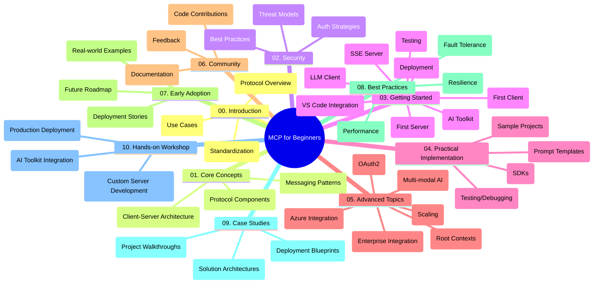

<!--
CO_OP_TRANSLATOR_METADATA:
{
  "original_hash": "a607d4febc94caee9a12b77795f7fc9a",
  "translation_date": "2025-06-11T16:41:19+00:00",
  "source_file": "study_guide.md",
  "language_code": "ne"
}
-->
# Model Context Protocol (MCP) for Beginners - Study Guide

यो अध्ययन मार्गदर्शकले "Model Context Protocol (MCP) for Beginners" पाठ्यक्रमको रिपोजिटरी संरचना र सामग्रीको अवलोकन प्रदान गर्दछ। यस मार्गदर्शकलाई प्रयोग गरेर रिपोजिटरीमा सजिलै नेभिगेट गर्न र उपलब्ध स्रोतहरूबाट अधिकतम लाभ लिन सकिन्छ।

## Repository Overview

Model Context Protocol (MCP) एआई मोडेलहरू र क्लाइन्ट एप्लिकेसनहरूबीचको अन्तरक्रियाको लागि एक मानकीकृत फ्रेमवर्क हो। यो रिपोजिटरीले C#, Java, JavaScript, Python, र TypeScript मा व्यावहारिक कोड उदाहरणहरूसहित पूर्ण पाठ्यक्रम प्रदान गर्दछ, जुन एआई विकासकर्ता, प्रणाली आर्किटेक्ट, र सफ्टवेयर इन्जिनियरहरूका लागि डिजाइन गरिएको हो।

## Visual Curriculum Map

## Repository Structure

यो रिपोजिटरी दस मुख्य भागहरूमा विभाजित गरिएको छ, प्रत्येकले MCP का विभिन्न पक्षहरूमा केन्द्रित छ:

1. **Introduction (00-Introduction/)**
   - Model Context Protocol को अवलोकन
   - एआई पाइपलाइनहरूमा मानकीकरण किन महत्वपूर्ण छ
   - व्यावहारिक प्रयोगका केसहरू र लाभहरू

2. **Core Concepts (01-CoreConcepts/)**
   - क्लाइन्ट-सर्भर वास्तुकला
   - प्रमुख प्रोटोकल कम्पोनेन्टहरू
   - MCP मा मेसेजिङ ढाँचाहरू

3. **Security (02-Security/)**
   - MCP आधारित प्रणालीहरूमा सुरक्षा खतराहरू
   - सुरक्षित कार्यान्वयनका लागि उत्तम अभ्यासहरू
   - प्रमाणीकरण र अधिकार रणनीतिहरू

4. **Getting Started (03-GettingStarted/)**
   - वातावरण सेटअप र कन्फिगरेसन
   - आधारभूत MCP सर्भर र क्लाइन्ट सिर्जना गर्ने तरिका
   - विद्यमान एप्लिकेसनहरूसँग एकीकरण
   - पहिलो सर्भर, पहिलो क्लाइन्ट, LLM क्लाइन्ट, VS Code एकीकरण, SSE सर्भर, AI Toolkit, परीक्षण र परिनियोजनका उप-विभागहरू

5. **Practical Implementation (04-PracticalImplementation/)**
   - विभिन्न प्रोग्रामिङ भाषाहरूमा SDK हरूको प्रयोग
   - डिबगिङ, परीक्षण, र प्रमाणीकरण प्रविधिहरू
   - पुन: प्रयोग गर्न मिल्ने प्रॉम्प्ट टेम्प्लेट र वर्कफ्लोहरू तयार गर्ने
   - कार्यान्वयन उदाहरणसहित नमूना परियोजनाहरू

6. **Advanced Topics (05-AdvancedTopics/)**
   - बहु-मोडल एआई वर्कफ्लो र विस्तारयोग्यता
   - सुरक्षित स्केलिङ रणनीतिहरू
   - उद्यम इकोसिस्टमहरूमा MCP
   - विशेष विषयहरू जसमा Azure एकीकरण, बहु-मोडालिटी, OAuth2, रुट कन्टेक्स्ट, राउटिङ, स्याम्पलिङ, स्केलिङ, सुरक्षा, वेब सर्च एकीकरण, र स्ट्रिमिङ समावेश छन्।

7. **Community Contributions (06-CommunityContributions/)**
   - कोड र दस्तावेजमा योगदान कसरी गर्ने
   - GitHub मार्फत सहकार्य
   - समुदायले प्रेरित सुधार र प्रतिक्रिया

8. **Lessons from Early Adoption (07-LessonsfromEarlyAdoption/)**
   - वास्तविक कार्यान्वयन र सफलताको कथाहरू
   - MCP आधारित समाधानहरूको निर्माण र परिनियोजन
   - प्रवृत्ति र भविष्यको रोडम्याप

9. **Best Practices (08-BestPractices/)**
   - प्रदर्शन सुधार र अनुकूलन
   - त्रुटि सहिष्णु MCP प्रणाली डिजाइन गर्ने तरिका
   - परीक्षण र स्थिरता रणनीतिहरू

10. **Case Studies (09-CaseStudy/)**
    - MCP समाधान वास्तुकलामा गहिरो अध्ययनहरू
    - परिनियोजन ब्लूप्रिन्ट र एकीकरण सुझावहरू
    - व्याख्यात्मक चित्रहरू र परियोजना हिँडाइ

11. **Hands-on Workshop (10-StreamliningAIWorkflowsBuildingAnMCPServerWithAIToolkit/)**
    - Microsoft को AI Toolkit सँग MCP लाई जोडेर व्यापक व्यावहारिक कार्यशाला
    - बुद्धिमान एप्लिकेसनहरू निर्माण गर्ने जसले एआई मोडेलहरूलाई वास्तविक उपकरणहरूसँग जोड्छ
    - आधारभूत, कस्टम सर्भर विकास, र उत्पादन परिनियोजन रणनीतिहरू समेट्ने व्यावहारिक मोड्युलहरू

## Sample Projects

यो रिपोजिटरीमा विभिन्न प्रोग्रामिङ भाषाहरूमा MCP कार्यान्वयन देखाउने धेरै नमूना परियोजनाहरू समावेश छन्:

### Basic MCP Calculator Samples
- C# MCP Server Example
- Java MCP Calculator
- JavaScript MCP Demo
- Python MCP Server
- TypeScript MCP Example

### Advanced MCP Calculator Projects
- Advanced C# Sample
- Java Container App Example
- JavaScript Advanced Sample
- Python Complex Implementation
- TypeScript Container Sample

## Additional Resources

रिपोजिटरीमा सहयोगी स्रोतहरू समावेश छन्:

- **Images folder**: पाठ्यक्रमभर प्रयोग भएका चित्रहरू र चित्रणहरू समावेश
- **Translations**: दस्तावेजहरूको स्वचालित बहुभाषी अनुवाद समर्थन
- **Official MCP Resources**:
  - [MCP Documentation](https://modelcontextprotocol.io/)
  - [MCP Specification](https://spec.modelcontextprotocol.io/)
  - [MCP GitHub Repository](https://github.com/modelcontextprotocol)

## How to Use This Repository

1. **क्रमिक सिकाइ**: अध्यायहरूलाई क्रमशः (00 देखि 10 सम्म) पालना गर्नुहोस्, संरचित सिकाइ अनुभवका लागि।
2. **भाषा-विशिष्ट फोकस**: यदि तपाईं कुनै विशेष प्रोग्रामिङ भाषामा रुचि राख्नुहुन्छ भने, आफ्नो मनपर्ने भाषामा कार्यान्वयनका लागि नमूना निर्देशिकाहरू अन्वेषण गर्नुहोस्।
3. **व्यावहारिक कार्यान्वयन**: वातावरण सेटअप गर्न र पहिलो MCP सर्भर तथा क्लाइन्ट बनाउन "Getting Started" भागबाट सुरु गर्नुहोस्।
4. **उन्नत अन्वेषण**: आधारभूत कुरामा सहज भएपछि, आफ्नो ज्ञान विस्तार गर्न उन्नत विषयहरूमा डुब्नुहोस्।
5. **समुदाय सहभागिता**: विशेषज्ञ र सह-विकासकर्तासँग जडान हुन [Azure AI Foundry Discord](https://discord.com/invite/ByRwuEEgH4) मा सामेल हुनुहोस्।

## Contributing

यो रिपोजिटरीले समुदायबाट योगदानलाई स्वागत गर्दछ। योगदान कसरी गर्ने भनेर Community Contributions भागमा हेर्नुहोस्।

---

*यो अध्ययन मार्गदर्शक ११ जुन २०२५ मा तयार पारिएको हो र सो मितिसम्मको रिपोजिटरीको अवलोकन प्रदान गर्दछ। त्यसपछि रिपोजिटरीको सामग्री अद्यावधिक भएको हुन सक्छ।*

**अस्वीकरण**:  
यो दस्तावेज AI अनुवाद सेवा [Co-op Translator](https://github.com/Azure/co-op-translator) प्रयोग गरी अनुवाद गरिएको हो। हामी शुद्धताका लागि प्रयास गर्छौं, तर कृपया जानकार हुनुहोस् कि स्वचालित अनुवादमा त्रुटि वा असंगतिहरू हुन सक्छन्। मूल दस्तावेज यसको मूल भाषामा नै अधिकारिक स्रोत मानिनु पर्छ। महत्वपूर्ण जानकारीका लागि पेशेवर मानवीय अनुवाद सिफारिस गरिन्छ। यस अनुवादको प्रयोगबाट उत्पन्न कुनै पनि गलत बुझाइ वा गलत व्याख्याका लागि हामी जिम्मेवार छैनौं।