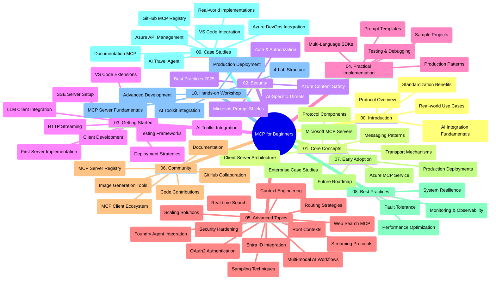

<!--
CO_OP_TRANSLATOR_METADATA:
{
  "original_hash": "719117a0a5f34ade7b5dfb61ee06fb13",
  "translation_date": "2025-09-26T18:08:55+00:00",
  "source_file": "study_guide.md",
  "language_code": "ne"
}
-->
# मोडेल कन्टेक्स्ट प्रोटोकल (MCP) का लागि शुरुआतीहरू - अध्ययन मार्गदर्शक

यो अध्ययन मार्गदर्शकले "मोडेल कन्टेक्स्ट प्रोटोकल (MCP) का लागि शुरुआतीहरू" पाठ्यक्रमको भण्डार संरचना र सामग्रीको अवलोकन प्रदान गर्दछ। भण्डारलाई प्रभावकारी रूपमा नेभिगेट गर्न र उपलब्ध स्रोतहरूको अधिकतम उपयोग गर्न यो मार्गदर्शक प्रयोग गर्नुहोस्।

## भण्डारको अवलोकन

मोडेल कन्टेक्स्ट प्रोटोकल (MCP) AI मोडेल र क्लाइन्ट एप्लिकेसनहरू बीचको अन्तरक्रियाको लागि एक मानकीकृत फ्रेमवर्क हो। प्रारम्भमा Anthropic द्वारा सिर्जना गरिएको MCP अब व्यापक MCP समुदायद्वारा आधिकारिक GitHub संगठन मार्फत व्यवस्थापन गरिन्छ। यो भण्डारले C#, Java, JavaScript, Python, र TypeScript मा व्यावहारिक कोड उदाहरणहरू सहितको व्यापक पाठ्यक्रम प्रदान गर्दछ, जुन AI विकासकर्ता, प्रणाली वास्तुकार, र सफ्टवेयर इन्जिनियरहरूको लागि डिजाइन गरिएको छ।

## दृश्य पाठ्यक्रम नक्सा

## भण्डार संरचना

भण्डार दस मुख्य खण्डहरूमा विभाजित छ, प्रत्येक MCP का विभिन्न पक्षहरूमा केन्द्रित:

1. **परिचय (00-Introduction/)**
   - मोडेल कन्टेक्स्ट प्रोटोकलको अवलोकन
   - AI पाइपलाइनहरूमा मानकीकरण किन महत्त्वपूर्ण छ
   - व्यावहारिक प्रयोगका केसहरू र फाइदाहरू

2. **मुख्य अवधारणाहरू (01-CoreConcepts/)**
   - क्लाइन्ट-सर्भर आर्किटेक्चर
   - प्रमुख प्रोटोकल कम्पोनेन्टहरू
   - MCP मा सन्देश आदानप्रदानका ढाँचाहरू

3. **सुरक्षा (02-Security/)**
   - MCP-आधारित प्रणालीहरूमा सुरक्षा खतराहरू
   - कार्यान्वयनहरू सुरक्षित गर्नका लागि उत्तम अभ्यासहरू
   - प्रमाणीकरण र अनुमति रणनीतिहरू
   - **व्यापक सुरक्षा दस्तावेजहरू**:
     - MCP सुरक्षा उत्तम अभ्यासहरू 2025
     - Azure सामग्री सुरक्षा कार्यान्वयन मार्गदर्शक
     - MCP सुरक्षा नियन्त्रण र प्रविधिहरू
     - MCP उत्तम अभ्यासहरू छोटो सन्दर्भ
   - **महत्त्वपूर्ण सुरक्षा विषयहरू**:
     - प्रम्प्ट इन्जेक्सन र टूल विषाक्तता आक्रमणहरू
     - सत्र अपहरण र भ्रमित डेप्युटी समस्या
     - टोकन पासथ्रु कमजोरीहरू
     - अत्यधिक अनुमति र पहुँच नियन्त्रण
     - AI कम्पोनेन्टहरूको आपूर्ति श्रृंखला सुरक्षा
     - Microsoft Prompt Shields एकीकरण

4. **सुरु गर्दै (03-GettingStarted/)**
   - वातावरण सेटअप र कन्फिगरेसन
   - आधारभूत MCP सर्भर र क्लाइन्टहरू सिर्जना गर्दै
   - विद्यमान एप्लिकेसनहरूसँग एकीकरण
   - समावेश खण्डहरू:
     - पहिलो सर्भर कार्यान्वयन
     - क्लाइन्ट विकास
     - LLM क्लाइन्ट एकीकरण
     - VS Code एकीकरण
     - सर्भर-सेन्ट इभेन्ट्स (SSE) सर्भर
     - HTTP स्ट्रिमिङ
     - AI टूलकिट एकीकरण
     - परीक्षण रणनीतिहरू
     - परिनियोजन दिशानिर्देशहरू

5. **व्यावहारिक कार्यान्वयन (04-PracticalImplementation/)**
   - विभिन्न प्रोग्रामिङ भाषाहरूमा SDK प्रयोग गर्दै
   - डिबगिङ, परीक्षण, र प्रमाणीकरण प्रविधिहरू
   - पुन: प्रयोग गर्न मिल्ने प्रम्प्ट टेम्प्लेटहरू र वर्कफ्लोहरू तयार गर्दै
   - कार्यान्वयन उदाहरणहरू सहित नमूना परियोजनाहरू

6. **उन्नत विषयहरू (05-AdvancedTopics/)**
   - कन्टेक्स्ट इन्जिनियरिङ प्रविधिहरू
   - Foundry एजेन्ट एकीकरण
   - मल्टी-मोडल AI वर्कफ्लोहरू
   - OAuth2 प्रमाणीकरण डेमोहरू
   - वास्तविक-समय खोज क्षमता
   - वास्तविक-समय स्ट्रिमिङ
   - रूट कन्टेक्स्ट कार्यान्वयन
   - राउटिङ रणनीतिहरू
   - स्याम्पलिङ प्रविधिहरू
   - स्केलिङ दृष्टिकोणहरू
   - सुरक्षा विचारहरू
   - Entra ID सुरक्षा एकीकरण
   - वेब खोज एकीकरण

7. **समुदाय योगदानहरू (06-CommunityContributions/)**
   - कोड र दस्तावेजहरू योगदान गर्ने तरिका
   - GitHub मार्फत सहकार्य गर्दै
   - समुदाय-चालित सुधारहरू र प्रतिक्रिया
   - विभिन्न MCP क्लाइन्टहरू प्रयोग गर्दै (Claude Desktop, Cline, VSCode)
   - छवि उत्पादन सहित लोकप्रिय MCP सर्भरहरूसँग काम गर्दै

8. **प्रारम्भिक अपनाउनेबाट सिकाइ (07-LessonsfromEarlyAdoption/)**
   - वास्तविक-विश्व कार्यान्वयनहरू र सफलताको कथाहरू
   - MCP-आधारित समाधानहरू निर्माण र परिनियोजन गर्दै
   - प्रवृत्तिहरू र भविष्यको रोडम्याप
   - **Microsoft MCP सर्भर मार्गदर्शक**: 10 उत्पादन-तयार Microsoft MCP सर्भरहरूको व्यापक मार्गदर्शक, समावेश:
     - Microsoft Learn Docs MCP सर्भर
     - Azure MCP सर्भर (15+ विशेष कनेक्टरहरू)
     - GitHub MCP सर्भर
     - Azure DevOps MCP सर्भर
     - MarkItDown MCP सर्भर
     - SQL सर्भर MCP सर्भर
     - Playwright MCP सर्भर
     - Dev Box MCP सर्भर
     - Azure AI Foundry MCP सर्भर
     - Microsoft 365 एजेन्ट टूलकिट MCP सर्भर

9. **उत्तम अभ्यासहरू (08-BestPractices/)**
   - प्रदर्शन ट्युनिङ र अनुकूलन
   - दोष-सहनशील MCP प्रणालीहरू डिजाइन गर्दै
   - परीक्षण र लचिलोपन रणनीतिहरू

10. **केस अध्ययनहरू (09-CaseStudy/)**
    - **सात व्यापक केस अध्ययनहरू** विभिन्न परिदृश्यहरूमा MCP को बहुमुखी प्रतिभा प्रदर्शन गर्दै:
    - **Azure AI यात्रा एजेन्टहरू**: Azure OpenAI र AI खोजको साथ मल्टी-एजेन्ट समन्वय
    - **Azure DevOps एकीकरण**: YouTube डेटा अपडेटहरूसँग कार्यप्रवाह प्रक्रियाहरू स्वचालित गर्दै
    - **वास्तविक-समय दस्तावेज पुनःप्राप्ति**: स्ट्रिमिङ HTTP सहित Python कन्सोल क्लाइन्ट
    - **इंटरएक्टिभ अध्ययन योजना जनरेटर**: Chainlit वेब एप्लिकेसनसँग संवादात्मक AI
    - **इन-एडिटर दस्तावेजीकरण**: GitHub Copilot वर्कफ्लोहरूसँग VS Code एकीकरण
    - **Azure API व्यवस्थापन**: MCP सर्भर सिर्जनासँग उद्यम API एकीकरण
    - **GitHub MCP रजिस्ट्री**: पारिस्थितिकी तंत्र विकास र एजेन्टिक एकीकरण प्लेटफर्म
    - कार्यान्वयन उदाहरणहरू उद्यम एकीकरण, विकासकर्ता उत्पादकता, र पारिस्थितिकी तंत्र विकासमा फैलिएको

11. **व्यावहारिक कार्यशाला (10-StreamliningAIWorkflowsBuildingAnMCPServerWithAIToolkit/)**
    - MCP र AI टूलकिटलाई संयोजन गर्दै व्यापक व्यावहारिक कार्यशाला
    - वास्तविक-विश्व उपकरणहरूसँग AI मोडेलहरू पुल गर्दै बुद्धिमान एप्लिकेसनहरू निर्माण गर्दै
    - आधारभूत, अनुकूलित सर्भर विकास, र उत्पादन परिनियोजन रणनीतिहरू समेट्ने व्यावहारिक मोड्युलहरू
    - **प्रयोगशाला संरचना**:
      - प्रयोगशाला 1: MCP सर्भर आधारभूत
      - प्रयोगशाला 2: उन्नत MCP सर्भर विकास
      - प्रयोगशाला 3: AI टूलकिट एकीकरण
      - प्रयोगशाला 4: उत्पादन परिनियोजन र स्केलिङ
    - चरण-दर-चरण निर्देशनहरूसँग प्रयोगशाला-आधारित शिक्षण दृष्टिकोण

## थप स्रोतहरू

भण्डारले सहयोगी स्रोतहरू समावेश गर्दछ:

- **छविहरू फोल्डर**: पाठ्यक्रमभर प्रयोग गरिएका आरेखहरू र चित्रहरू समावेश गर्दछ
- **अनुवादहरू**: दस्तावेजहरूको स्वचालित अनुवादको साथ बहु-भाषा समर्थन
- **आधिकारिक MCP स्रोतहरू**:
  - [MCP दस्तावेजीकरण](https://modelcontextprotocol.io/)
  - [MCP विशिष्टता](https://spec.modelcontextprotocol.io/)
  - [MCP GitHub भण्डार](https://github.com/modelcontextprotocol)

## यो भण्डार कसरी प्रयोग गर्ने

1. **क्रमिक शिक्षण**: संरचित शिक्षण अनुभवको लागि अध्यायहरू क्रमशः (00 देखि 10) पालना गर्नुहोस्।
2. **भाषा-विशिष्ट ध्यान**: यदि तपाईं कुनै विशेष प्रोग्रामिङ भाषामा रुचि राख्नुहुन्छ भने, आफ्नो रुचि अनुसार कार्यान्वयनहरूको लागि नमूना निर्देशिकाहरू अन्वेषण गर्नुहोस्।
3. **व्यावहारिक कार्यान्वयन**: आफ्नो वातावरण सेटअप गर्न र आफ्नो पहिलो MCP सर्भर र क्लाइन्ट सिर्जना गर्न "सुरु गर्दै" खण्डबाट सुरु गर्नुहोस्।
4. **उन्नत अन्वेषण**: आधारभूत कुराहरूमा सहज भएपछि, उन्नत विषयहरूमा डुबुल्की मारेर आफ्नो ज्ञान विस्तार गर्नुहोस्।
5. **समुदाय संलग्नता**: GitHub छलफलहरू र Discord च्यानलहरू मार्फत MCP समुदायमा सामेल भएर विशेषज्ञहरू र अन्य विकासकर्ताहरूसँग जडान गर्नुहोस्।

## MCP क्लाइन्टहरू र उपकरणहरू

पाठ्यक्रमले विभिन्न MCP क्लाइन्टहरू र उपकरणहरू समेट्छ:

1. **आधिकारिक क्लाइन्टहरू**:
   - Visual Studio Code 
   - MCP Visual Studio Code मा
   - Claude Desktop
   - Claude VSCode मा 
   - Claude API

2. **समुदाय क्लाइन्टहरू**:
   - Cline (टर्मिनल-आधारित)
   - Cursor (कोड सम्पादक)
   - ChatMCP
   - Windsurf

3. **MCP व्यवस्थापन उपकरणहरू**:
   - MCP CLI
   - MCP Manager
   - MCP Linker
   - MCP Router

## लोकप्रिय MCP सर्भरहरू

भण्डारले विभिन्न MCP सर्भरहरू प्रस्तुत गर्दछ, समावेश:

1. **आधिकारिक Microsoft MCP सर्भरहरू**:
   - Microsoft Learn Docs MCP सर्भर
   - Azure MCP सर्भर (15+ विशेष कनेक्टरहरू)
   - GitHub MCP सर्भर
   - Azure DevOps MCP सर्भर
   - MarkItDown MCP सर्भर
   - SQL सर्भर MCP सर्भर
   - Playwright MCP सर्भर
   - Dev Box MCP सर्भर
   - Azure AI Foundry MCP सर्भर
   - Microsoft 365 एजेन्ट टूलकिट MCP सर्भर

2. **आधिकारिक सन्दर्भ सर्भरहरू**:
   - Filesystem
   - Fetch
   - Memory
   - Sequential Thinking

3. **छवि उत्पादन**:
   - Azure OpenAI DALL-E 3
   - Stable Diffusion WebUI
   - Replicate

4. **विकास उपकरणहरू**:
   - Git MCP
   - Terminal Control
   - Code Assistant

5. **विशेष सर्भरहरू**:
   - Salesforce
   - Microsoft Teams
   - Jira & Confluence

## योगदान

यो भण्डार समुदायबाट योगदानहरूलाई स्वागत गर्दछ। MCP पारिस्थितिकी तंत्रमा प्रभावकारी रूपमा योगदान गर्ने तरिकाको लागि समुदाय योगदान खण्ड हेर्नुहोस्।

## परिवर्तन सूची

| मिति | परिवर्तनहरू |
|------|---------|
| सेप्टेम्बर 26, 2025 | - GitHub MCP रजिस्ट्री केस अध्ययन 09-CaseStudy खण्डमा थपियो - सात व्यापक केस अध्ययनहरू प्रतिबिम्बित गर्न केस अध्ययनहरू अद्यावधिक गरियो - कार्यान्वयन विवरणहरूसँग केस अध्ययन वर्णनहरू सुधार गरियो - GitHub MCP रजिस्ट्री समावेश गर्न दृश्य पाठ्यक्रम नक्सा अद्यावधिक गरियो - पारिस्थितिकी तंत्र विकास फोकस प्रतिबिम्बित गर्न अध्ययन मार्गदर्शक संरचना संशोधित गरियो |
| जुलाई 18, 2025 | - Microsoft MCP सर्भर मार्गदर्शक समावेश गर्न भण्डार संरचना अद्यावधिक गरियो - 10 उत्पादन-तयार Microsoft MCP सर्भरहरूको व्यापक सूची थपियो - आधिकारिक Microsoft MCP सर्भरहरूसँग लोकप्रिय MCP सर्भर खण्ड सुधार गरियो - वास्तविक फाइल उदाहरणहरूसँग केस अध्ययन खण्ड अद्यावधिक गरियो - व्यावहारिक कार्यशालाको लागि प्रयोगशाला संरचना विवरणहरू थपियो |
| जुलाई 16, 2025 | - वर्तमान सामग्री प्रतिबिम्बित गर्न भण्डार संरचना अद्यावधिक गरियो - MCP क्लाइन्टहरू र उपकरणहरू खण्ड थपियो - लोकप्रिय MCP सर्भर खण्ड थपियो - सबै वर्तमान विषयहरू सहित दृश्य पाठ्यक्रम नक्सा अद्यावधिक गरियो - सबै विशेष क्षेत्रहरू सहित उन्नत विषयहरू खण्ड सुधार गरियो - वास्तविक उदाहरणहरूसँग केस अध्ययनहरू अद्यावधिक गरियो - Anthropic द्वारा सिर्जना गरिएको MCP को उत्पत्ति स्पष्ट गरियो |
| जुन 11, 2025 | - अध्ययन मार्गदर्शकको प्रारम्भिक सिर्जना - दृश्य पाठ्यक्रम नक्सा थपियो - भण्डार संरचना रूपरेखा तयार गरियो - नमूना परियोजनाहरू र थप स्रोतहरू समावेश गरियो |

---

*यो अध्ययन मार्गदर्शक सेप्टेम्बर 26, 2025 मा अद्यावधिक गरिएको थियो र सो मितिको रूपमा भण्डारको अवलोकन प्रदान गर्दछ। सो मितिपछि भण्डार सामग्री अद्यावधिक हुन सक्छ।*

---

