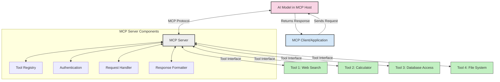
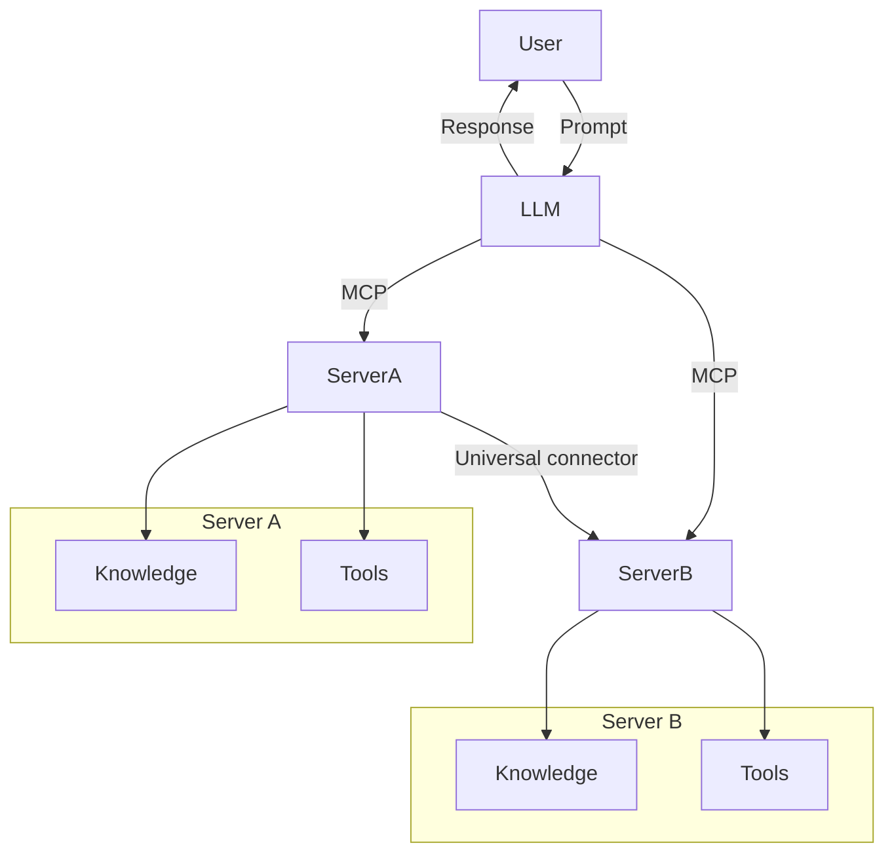

<!--
CO_OP_TRANSLATOR_METADATA:
{
  "original_hash": "1d88dee994dcbb3fa52c271d0c0817b5",
  "translation_date": "2025-05-20T21:54:25+00:00",
  "source_file": "00-Introduction/README.md",
  "language_code": "nl"
}
-->
# Introductie tot het Model Context Protocol (MCP): Waarom het belangrijk is voor schaalbare AI-toepassingen

Generatieve AI-toepassingen zijn een grote stap vooruit, omdat ze gebruikers vaak laten communiceren met de app via natuurlijke taal prompts. Maar naarmate er meer tijd en middelen in zulke apps worden gestoken, wil je ervoor zorgen dat je functionaliteiten en bronnen eenvoudig kunt integreren, zodat het makkelijk uitbreidbaar is, je app meerdere modellen kan ondersteunen en verschillende modeleigenaardigheden aankan. Kortom, het bouwen van Gen AI-apps is in het begin makkelijk, maar naarmate ze groeien en complexer worden, moet je een architectuur gaan definiëren en waarschijnlijk een standaard gebruiken om te zorgen dat je apps op een consistente manier worden gebouwd. Hier komt MCP om de hoek kijken om alles te organiseren en een standaard te bieden.

---

## **🔍 Wat is het Model Context Protocol (MCP)?**

Het **Model Context Protocol (MCP)** is een **open, gestandaardiseerde interface** die het mogelijk maakt voor Large Language Models (LLM’s) om naadloos te communiceren met externe tools, API’s en databronnen. Het biedt een consistente architectuur om de functionaliteit van AI-modellen uit te breiden voorbij hun trainingsdata, waardoor slimmere, schaalbare en responsievere AI-systemen mogelijk worden.

---

## **🎯 Waarom standaardisatie in AI belangrijk is**

Naarmate generatieve AI-toepassingen complexer worden, is het essentieel om standaarden te gebruiken die zorgen voor **schaalbaarheid, uitbreidbaarheid** en **onderhoudbaarheid**. MCP speelt hierop in door:

- Integraties tussen modellen en tools te verenigen
- Het verminderen van fragiele, eenmalige maatwerkoplossingen
- Het mogelijk maken dat meerdere modellen binnen één ecosysteem kunnen samenwerken

---

## **📚 Leerdoelen**

Aan het einde van dit artikel kun je:

- Het **Model Context Protocol (MCP)** definiëren en de toepassingsgebieden begrijpen
- Begrijpen hoe MCP communicatie tussen model en tool standaardiseert
- De kerncomponenten van de MCP-architectuur benoemen
- Praktische toepassingen van MCP in bedrijfs- en ontwikkelomgevingen verkennen

---

## **💡 Waarom het Model Context Protocol (MCP) een doorbraak is**

### **🔗 MCP lost versnippering in AI-interacties op**

Voor MCP vereiste het integreren van modellen met tools:

- Maatwerkcode per tool-model combinatie
- Niet-gestandaardiseerde API’s per leverancier
- Regelmatige breuken door updates
- Slechte schaalbaarheid bij meer tools

### **✅ Voordelen van MCP-standaardisatie**

| **Voordeel**             | **Beschrijving**                                                              |
|--------------------------|-------------------------------------------------------------------------------|
| Interoperabiliteit       | LLM’s werken soepel samen met tools van verschillende leveranciers           |
| Consistentie             | Uniform gedrag over platforms en tools heen                                   |
| Herbruikbaarheid         | Tools die eenmaal zijn gebouwd, kunnen in meerdere projecten en systemen gebruikt worden |
| Versnelde ontwikkeling   | Minder ontwikkeltijd door gebruik van gestandaardiseerde, plug-and-play interfaces |

---

## **🧱 Overzicht van de MCP-architectuur op hoog niveau**

MCP volgt een **client-server model**, waarbij:

- **MCP Hosts** de AI-modellen draaien
- **MCP Clients** verzoeken initiëren
- **MCP Servers** context, tools en mogelijkheden leveren

### **Belangrijkste componenten:**

- **Resources** – Statische of dynamische data voor modellen  
- **Prompts** – Vooraf gedefinieerde workflows voor begeleide generatie  
- **Tools** – Uitvoerbare functies zoals zoeken, berekeningen  
- **Sampling** – Agentgedrag via recursieve interacties

---

## Hoe MCP-servers werken

MCP-servers werken op de volgende manier:

- **Verzoekstroom**:  
    1. De MCP Client stuurt een verzoek naar het AI-model dat draait in een MCP Host.  
    2. Het AI-model herkent wanneer het externe tools of data nodig heeft.  
    3. Het model communiceert met de MCP Server via het gestandaardiseerde protocol.

- **Functionaliteit van de MCP Server**:  
    - Tool Register: Houdt een catalogus bij van beschikbare tools en hun mogelijkheden.  
    - Authenticatie: Controleert permissies voor toegang tot tools.  
    - Verzoekverwerker: Verwerkt binnenkomende toolverzoeken van het model.  
    - Antwoordformatter: Zet tooloutputs om in een formaat dat het model kan begrijpen.

- **Tooluitvoering**:  
    - De server leidt verzoeken door naar de juiste externe tools  
    - Tools voeren hun gespecialiseerde functies uit (zoeken, berekenen, databasevragen, etc.)  
    - Resultaten worden in een consistent formaat aan het model teruggegeven.

- **Afhandeling van het antwoord**:  
    - Het AI-model verwerkt de toolresultaten in zijn antwoord.  
    - Het definitieve antwoord wordt teruggestuurd naar de clientapplicatie.

## 👨‍💻 Hoe bouw je een MCP-server (met voorbeelden)

MCP-servers maken het mogelijk om LLM-capaciteiten uit te breiden door data en functionaliteit te bieden.

Klaar om het te proberen? Hier zijn voorbeelden van het maken van een eenvoudige MCP-server in verschillende talen:

- **Python voorbeeld**: https://github.com/modelcontextprotocol/python-sdk

- **TypeScript voorbeeld**: https://github.com/modelcontextprotocol/typescript-sdk

- **Java voorbeeld**: https://github.com/modelcontextprotocol/java-sdk

- **C#/.NET voorbeeld**: https://github.com/modelcontextprotocol/csharp-sdk

## 🌍 Praktische toepassingen van MCP

MCP maakt een breed scala aan toepassingen mogelijk door AI-capaciteiten uit te breiden:

| **Toepassing**              | **Beschrijving**                                                               |
|----------------------------|--------------------------------------------------------------------------------|
| Integratie van bedrijfsdata | Verbind LLM’s met databases, CRM-systemen of interne tools                    |
| Agentachtige AI-systemen    | Maak autonome agenten mogelijk met toegang tot tools en beslisprocessen       |
| Multi-modale toepassingen   | Combineer tekst-, beeld- en audiotools binnen één uniforme AI-app             |
| Integratie van realtime data| Breng live data in AI-interacties voor nauwkeurigere, actuele output          |

### 🧠 MCP = Universele standaard voor AI-interacties

Het Model Context Protocol (MCP) fungeert als een universele standaard voor AI-interacties, vergelijkbaar met hoe USB-C fysieke aansluitingen voor apparaten heeft gestandaardiseerd. In de AI-wereld biedt MCP een consistente interface, waarmee modellen (clients) naadloos kunnen integreren met externe tools en dataleveranciers (servers). Dit elimineert de noodzaak voor diverse, aangepaste protocollen voor elke API of databron.

Onder MCP volgt een MCP-compatibele tool (ook wel MCP-server genoemd) een uniforme standaard. Deze servers kunnen de tools of acties die ze aanbieden opsommen en deze uitvoeren wanneer een AI-agent daarom vraagt. AI-agentplatforms die MCP ondersteunen kunnen beschikbare tools van de servers ontdekken en via dit standaardprotocol aanroepen.

### 💡 Maakt toegang tot kennis makkelijker

Naast het aanbieden van tools faciliteert MCP ook de toegang tot kennis. Het stelt applicaties in staat context te bieden aan grote taalmodellen (LLM’s) door ze te koppelen aan verschillende databronnen. Bijvoorbeeld, een MCP-server kan de documentendatabase van een bedrijf vertegenwoordigen, zodat agenten relevante informatie op aanvraag kunnen ophalen. Een andere server kan specifieke acties afhandelen, zoals e-mails versturen of records bijwerken. Vanuit het oogpunt van de agent zijn dit simpelweg tools die gebruikt kunnen worden—sommige tools leveren data (kenniscontext), terwijl andere acties uitvoeren. MCP beheert beide efficiënt.

Een agent die verbinding maakt met een MCP-server leert automatisch welke mogelijkheden en toegankelijke data de server heeft via een standaardformaat. Deze standaardisatie maakt dynamische beschikbaarheid van tools mogelijk. Bijvoorbeeld, door een nieuwe MCP-server toe te voegen aan het systeem van een agent, worden de functies direct bruikbaar zonder dat de agentinstructies verder aangepast hoeven te worden.

Deze gestroomlijnde integratie sluit aan bij de stroom in het mermaid-diagram, waarbij servers zowel tools als kennis leveren en zo naadloze samenwerking tussen systemen waarborgen.

### 👉 Voorbeeld: schaalbare agentoplossing

## 🔐 Praktische voordelen van MCP

Dit zijn de praktische voordelen van het gebruik van MCP:

- **Actualiteit**: Modellen kunnen toegang krijgen tot up-to-date informatie buiten hun trainingsdata  
- **Uitbreiding van mogelijkheden**: Modellen kunnen gespecialiseerde tools gebruiken voor taken waarvoor ze niet getraind zijn  
- **Minder hallucinerende antwoorden**: Externe databronnen bieden feitelijke onderbouwing  
- **Privacy**: Gevoelige data blijft binnen veilige omgevingen in plaats van in prompts verwerkt te worden

## 📌 Belangrijkste conclusies

De belangrijkste conclusies bij het gebruik van MCP zijn:

- **MCP** standaardiseert hoe AI-modellen communiceren met tools en data  
- Bevordert **uitbreidbaarheid, consistentie en interoperabiliteit**  
- MCP helpt **ontwikkeltijd te verkorten, betrouwbaarheid te verbeteren en modelmogelijkheden uit te breiden**  
- De client-server architectuur maakt **flexibele, uitbreidbare AI-toepassingen mogelijk**

## 🧠 Oefening

Denk na over een AI-toepassing die jij graag wilt bouwen.

- Welke **externe tools of data** zouden de mogelijkheden kunnen verbeteren?  
- Hoe zou MCP de integratie **eenvoudiger en betrouwbaarder** kunnen maken?

## Aanvullende bronnen

- [MCP GitHub Repository](https://github.com/modelcontextprotocol)

## Wat nu?

Volgende: [Hoofdstuk 1: Kernconcepten](/01-CoreConcepts/README.md)

**Disclaimer**:  
Dit document is vertaald met behulp van de AI-vertalingsdienst [Co-op Translator](https://github.com/Azure/co-op-translator). Hoewel we streven naar nauwkeurigheid, dient u er rekening mee te houden dat automatische vertalingen fouten of onnauwkeurigheden kunnen bevatten. Het originele document in de oorspronkelijke taal moet als de gezaghebbende bron worden beschouwd. Voor cruciale informatie wordt professionele menselijke vertaling aanbevolen. Wij zijn niet aansprakelijk voor eventuele misverstanden of verkeerde interpretaties die voortvloeien uit het gebruik van deze vertaling.