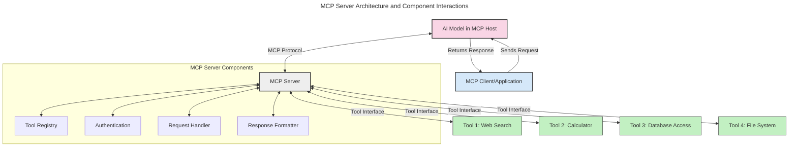
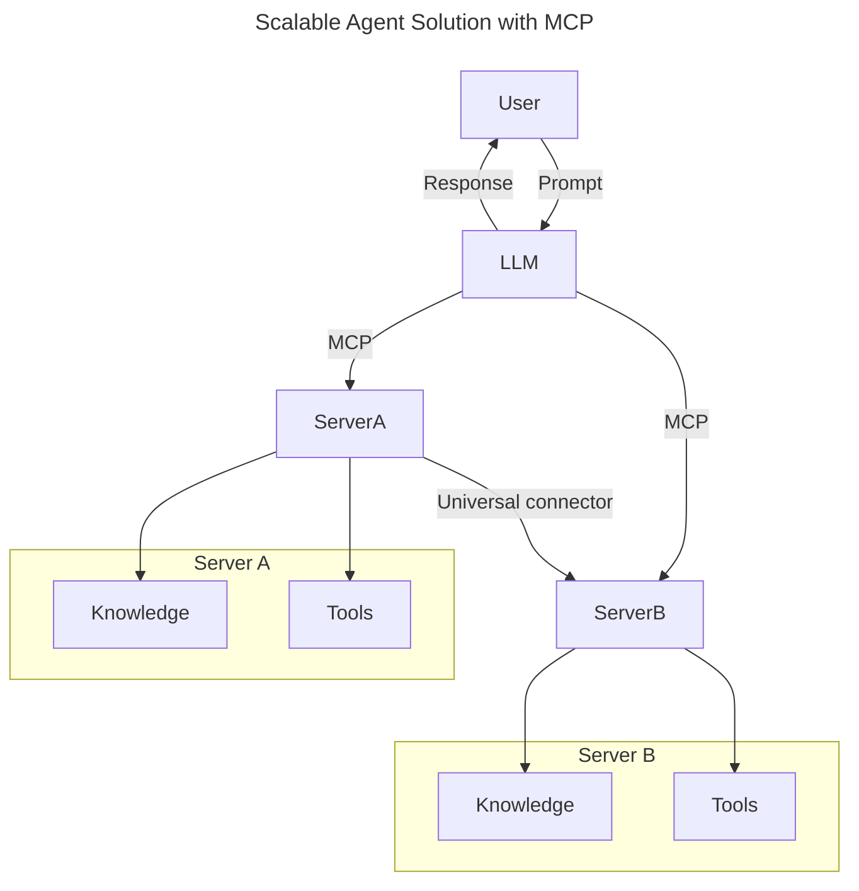
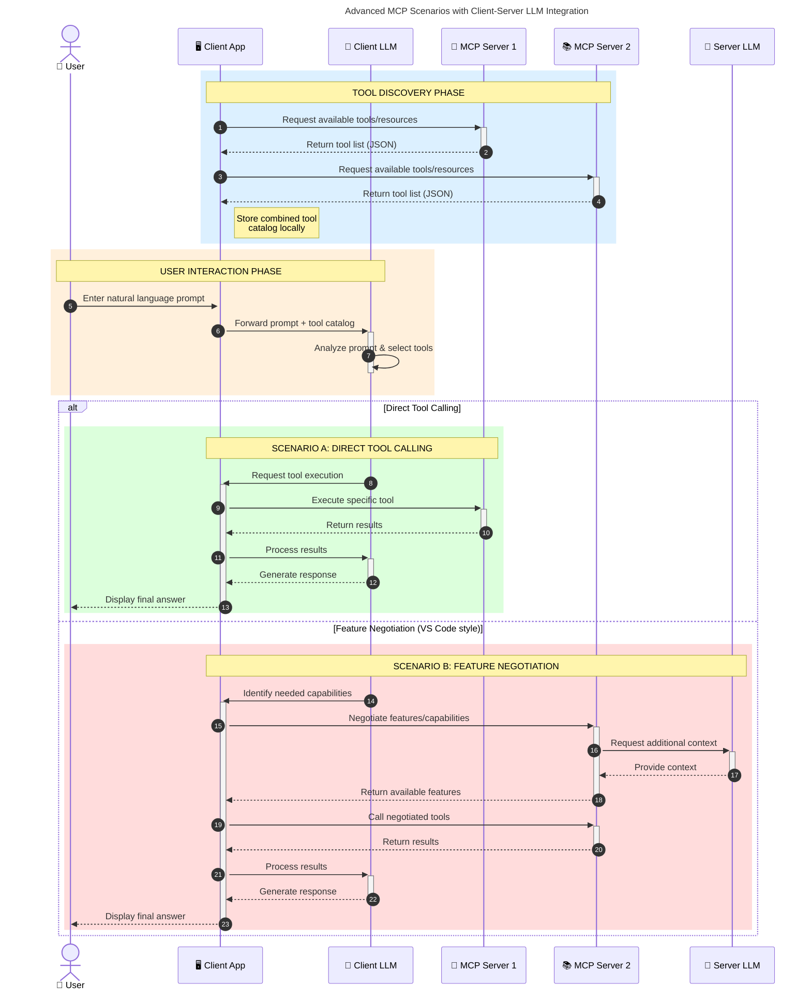

<!--
CO_OP_TRANSLATOR_METADATA:
{
  "original_hash": "1446979020432f512c883848d7eca144",
  "translation_date": "2025-05-29T21:50:38+00:00",
  "source_file": "00-Introduction/README.md",
  "language_code": "nl"
}
-->
# Introductie tot het Model Context Protocol (MCP): Waarom het belangrijk is voor schaalbare AI-toepassingen

Generatieve AI-toepassingen zijn een grote stap vooruit omdat ze gebruikers vaak laten communiceren met de app via natuurlijke taalopdrachten. Naarmate er echter meer tijd en middelen in zulke apps worden geïnvesteerd, wil je er zeker van zijn dat je functionaliteiten en bronnen eenvoudig kunt integreren op een manier die makkelijk uitbreidbaar is, waarbij je app meerdere modellen kan ondersteunen en verschillende modelcomplexiteiten aankan. Kortom, het bouwen van Gen AI-apps is in het begin eenvoudig, maar naarmate ze groeien en complexer worden, moet je een architectuur gaan definiëren en waarschijnlijk vertrouwen op een standaard om ervoor te zorgen dat je apps op een consistente manier worden gebouwd. Hier komt MCP om de hoek kijken om zaken te organiseren en een standaard te bieden.

---

## **🔍 Wat is het Model Context Protocol (MCP)?**

Het **Model Context Protocol (MCP)** is een **open, gestandaardiseerde interface** die het mogelijk maakt dat Large Language Models (LLM's) naadloos kunnen samenwerken met externe tools, API’s en databronnen. Het biedt een consistente architectuur om de functionaliteit van AI-modellen uit te breiden buiten hun trainingsdata, waardoor slimmere, schaalbare en meer responsieve AI-systemen ontstaan.

---

## **🎯 Waarom standaardisatie in AI belangrijk is**

Naarmate generatieve AI-toepassingen complexer worden, is het essentieel om standaarden te hanteren die zorgen voor **schaalbaarheid, uitbreidbaarheid** en **onderhoudbaarheid**. MCP speelt hierop in door:

- Integraties tussen modellen en tools te uniformeren  
- Het verminderen van fragiele, eenmalige maatwerkoplossingen  
- Het toestaan dat meerdere modellen binnen één ecosysteem naast elkaar kunnen bestaan  

---

## **📚 Leerdoelen**

Aan het einde van dit artikel kun je:

- Het **Model Context Protocol (MCP)** definiëren en de toepassingsmogelijkheden uitleggen  
- Begrijpen hoe MCP communicatie tussen model en tool standaardiseert  
- De kerncomponenten van de MCP-architectuur benoemen  
- Praktische toepassingen van MCP in bedrijfs- en ontwikkelcontexten verkennen  

---

## **💡 Waarom het Model Context Protocol (MCP) een game-changer is**

### **🔗 MCP lost fragmentatie in AI-interacties op**

Voor MCP vereiste het integreren van modellen met tools:

- Maatwerkcode per tool-model combinatie  
- Niet-gestandaardiseerde API’s per leverancier  
- Regelmatige storingen door updates  
- Slechte schaalbaarheid bij meer tools  

### **✅ Voordelen van MCP-standaardisatie**

| **Voordeel**             | **Beschrijving**                                                             |
|-------------------------|------------------------------------------------------------------------------|
| Interoperabiliteit       | LLM’s werken naadloos samen met tools van verschillende leveranciers         |
| Consistentie             | Uniform gedrag over platforms en tools heen                                  |
| Herbruikbaarheid         | Tools die eenmaal gebouwd zijn, kunnen in meerdere projecten en systemen gebruikt worden |
| Versneld Ontwikkelen     | Minder ontwikkeltijd door gebruik van gestandaardiseerde, plug-and-play interfaces |

---

## **🧱 Overzicht van de MCP-architectuur op hoog niveau**

MCP volgt een **client-server model**, waarbij:

- **MCP Hosts** de AI-modellen draaien  
- **MCP Clients** verzoeken initiëren  
- **MCP Servers** context, tools en mogelijkheden leveren  

### **Belangrijke componenten:**

- **Resources** – Statische of dynamische data voor modellen  
- **Prompts** – Vooraf gedefinieerde workflows voor begeleide generatie  
- **Tools** – Uitvoerbare functies zoals zoeken, berekeningen  
- **Sampling** – Agent-gedrag via recursieve interacties  

---

## Hoe MCP Servers Werken

MCP-servers werken als volgt:

- **Verzoekstroom**:  
    1. De MCP Client stuurt een verzoek naar het AI-model dat draait in een MCP Host.  
    2. Het AI-model herkent wanneer het externe tools of data nodig heeft.  
    3. Het model communiceert met de MCP Server via het gestandaardiseerde protocol.  

- **Functionaliteit van de MCP Server**:  
    - Toolregister: Houdt een catalogus bij van beschikbare tools en hun mogelijkheden.  
    - Authenticatie: Verifieert de rechten voor toegang tot tools.  
    - Verzoekafhandelaar: Verwerkt binnenkomende toolverzoeken van het model.  
    - Response Formatter: Structureert tool-uitvoer in een formaat dat het model begrijpt.  

- **Tooluitvoering**:  
    - De server leidt verzoeken door naar de juiste externe tools  
    - Tools voeren hun gespecialiseerde functies uit (zoeken, berekenen, databasequeries, enz.)  
    - Resultaten worden in een consistent formaat teruggegeven aan het model.  

- **Afronding van de respons**:  
    - Het AI-model verwerkt de toolresultaten in zijn antwoord.  
    - Het definitieve antwoord wordt teruggestuurd naar de clientapplicatie.  

## 👨‍💻 Hoe bouw je een MCP Server (met voorbeelden)

MCP-servers stellen je in staat om de mogelijkheden van LLM’s uit te breiden door data en functionaliteit te bieden.

Klaar om het uit te proberen? Hier zijn voorbeelden van het maken van een eenvoudige MCP-server in verschillende talen:

- **Python Voorbeeld**: https://github.com/modelcontextprotocol/python-sdk  
- **TypeScript Voorbeeld**: https://github.com/modelcontextprotocol/typescript-sdk  
- **Java Voorbeeld**: https://github.com/modelcontextprotocol/java-sdk  
- **C#/.NET Voorbeeld**: https://github.com/modelcontextprotocol/csharp-sdk  

## 🌍 Praktijkvoorbeelden van MCP

MCP maakt een breed scala aan toepassingen mogelijk door AI-capaciteiten uit te breiden:

| **Toepassing**              | **Beschrijving**                                                                |
|----------------------------|---------------------------------------------------------------------------------|
| Enterprise Data Integratie  | Verbind LLM’s met databases, CRM’s of interne tools                             |
| Agentic AI Systemen        | Maak autonome agents mogelijk met toegang tot tools en besluitvormingsworkflows |
| Multi-modale Toepassingen  | Combineer tekst-, beeld- en audiotools binnen één geïntegreerde AI-app          |
| Real-time Data Integratie  | Breng live data in AI-interacties voor nauwkeurigere en actuele output         |

### 🧠 MCP = Universele standaard voor AI-interacties

Het Model Context Protocol (MCP) fungeert als een universele standaard voor AI-interacties, vergelijkbaar met hoe USB-C fysieke verbindingen voor apparaten heeft gestandaardiseerd. In de AI-wereld biedt MCP een consistente interface, waardoor modellen (clients) naadloos kunnen integreren met externe tools en dataproviders (servers). Dit elimineert de noodzaak voor diverse, aangepaste protocollen voor elke API of databron.

Onder MCP volgt een MCP-compatibele tool (ook wel MCP-server genoemd) een uniforme standaard. Deze servers kunnen de tools of acties die ze aanbieden opsommen en die acties uitvoeren wanneer een AI-agent daarom vraagt. AI-agentplatforms die MCP ondersteunen, kunnen beschikbare tools van de servers ontdekken en deze aanroepen via dit standaardprotocol.

### 💡 Faciliteert toegang tot kennis

Naast het aanbieden van tools, maakt MCP ook toegang tot kennis mogelijk. Het stelt applicaties in staat om context te bieden aan large language models (LLM’s) door ze te koppelen aan diverse databronnen. Bijvoorbeeld, een MCP-server kan een bedrijfsdocumentenrepository vertegenwoordigen, waardoor agents relevante informatie op aanvraag kunnen ophalen. Een andere server kan specifieke acties uitvoeren zoals het versturen van e-mails of het bijwerken van records. Vanuit het perspectief van de agent zijn dit simpelweg tools die hij kan gebruiken – sommige tools leveren data (kenniscontext), terwijl andere acties uitvoeren. MCP beheert beide efficiënt.

Een agent die verbinding maakt met een MCP-server leert automatisch welke mogelijkheden en data de server aanbiedt via een standaardformaat. Deze standaardisatie maakt dynamische beschikbaarheid van tools mogelijk. Bijvoorbeeld, het toevoegen van een nieuwe MCP-server aan het systeem van een agent maakt de functies daarvan direct bruikbaar zonder dat de agent verder aangepast hoeft te worden.

Deze gestroomlijnde integratie sluit aan bij de stroom die in het mermaid-diagram wordt weergegeven, waarbij servers zowel tools als kennis bieden, wat zorgt voor naadloze samenwerking tussen systemen.

### 👉 Voorbeeld: schaalbare agentoplossing

### 🔄 Geavanceerde MCP-scenario’s met client-side LLM-integratie

Naast de basisarchitectuur van MCP zijn er geavanceerde scenario’s waarbij zowel client als server LLM’s bevatten, wat meer verfijnde interacties mogelijk maakt:

## 🔐 Praktische voordelen van MCP

Hier zijn de praktische voordelen van het gebruik van MCP:

- **Actualiteit**: Modellen kunnen toegang krijgen tot actuele informatie buiten hun trainingsdata  
- **Uitbreiding van mogelijkheden**: Modellen kunnen gespecialiseerde tools gebruiken voor taken waarvoor ze niet getraind zijn  
- **Minder hallucinerende output**: Externe databronnen zorgen voor feitelijke onderbouwing  
- **Privacy**: Gevoelige data kan binnen beveiligde omgevingen blijven in plaats van in prompts verwerkt te worden  

## 📌 Belangrijkste punten

De belangrijkste punten bij het gebruik van MCP zijn:

- **MCP** standaardiseert hoe AI-modellen communiceren met tools en data  
- Bevordert **uitbreidbaarheid, consistentie en interoperabiliteit**  
- MCP helpt **ontwikkeltijd te verkorten, betrouwbaarheid te verbeteren en modelmogelijkheden uit te breiden**  
- De client-serverarchitectuur **maakt flexibele, uitbreidbare AI-toepassingen mogelijk**  

## 🧠 Oefening

Denk na over een AI-toepassing die je graag wilt bouwen.

- Welke **externe tools of data** zouden de mogelijkheden kunnen vergroten?  
- Hoe kan MCP integratie **eenvoudiger en betrouwbaarder maken?**  

## Aanvullende bronnen

- [MCP GitHub Repository](https://github.com/modelcontextprotocol)  

## Wat volgt

Volgende: [Hoofdstuk 1: Kernconcepten](/01-CoreConcepts/README.md)

**Disclaimer**:  
Dit document is vertaald met behulp van de AI-vertalingsservice [Co-op Translator](https://github.com/Azure/co-op-translator). Hoewel we streven naar nauwkeurigheid, dient u er rekening mee te houden dat geautomatiseerde vertalingen fouten of onnauwkeurigheden kunnen bevatten. Het originele document in de oorspronkelijke taal dient als de gezaghebbende bron te worden beschouwd. Voor cruciale informatie wordt professionele menselijke vertaling aanbevolen. Wij zijn niet aansprakelijk voor misverstanden of verkeerde interpretaties die voortvloeien uit het gebruik van deze vertaling.