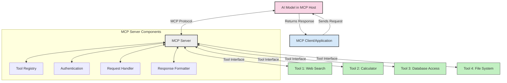
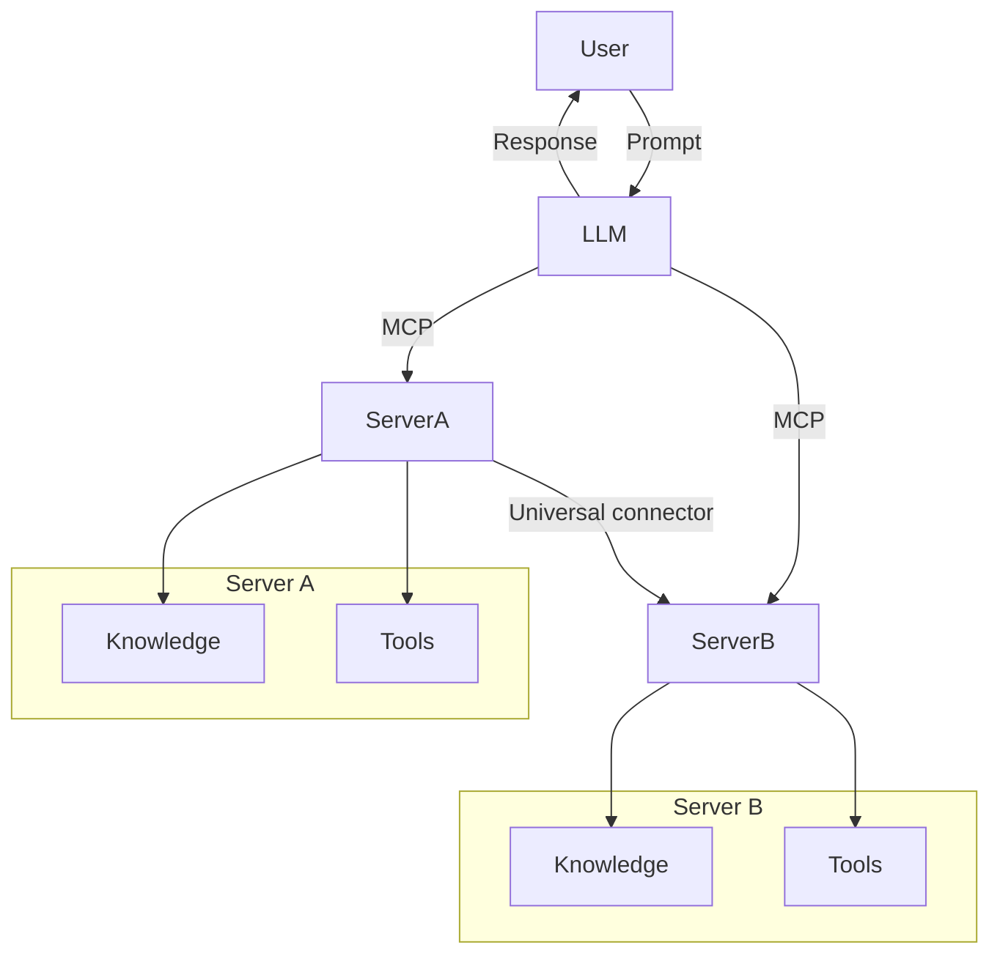

<!--
CO_OP_TRANSLATOR_METADATA:
{
  "original_hash": "02301140adbd807ecf0f17720fa307bc",
  "translation_date": "2025-05-17T06:04:41+00:00",
  "source_file": "00-Introduction/README.md",
  "language_code": "nl"
}
-->
# Introductie tot Model Context Protocol (MCP): Waarom het Belangrijk is voor Schaalbare AI-toepassingen

Generatieve AI-toepassingen zijn een geweldige stap vooruit omdat ze vaak de gebruiker laten interageren met de app door middel van natuurlijke taalprompts. Echter, naarmate er meer tijd en middelen worden geïnvesteerd in dergelijke apps, wil je ervoor zorgen dat je functionaliteiten en middelen gemakkelijk kunt integreren op een manier die eenvoudig uit te breiden is, dat je app meer dan één model kan ondersteunen en de complexiteit daarvan. Kortom, het bouwen van Gen AI-apps is eenvoudig om mee te beginnen, maar naarmate het groeit en complexer wordt, moet je een architectuur gaan definiëren en waarschijnlijk leunen op een standaard om ervoor te zorgen dat je apps op een consistente manier worden gebouwd. Dit is waar MCP in beeld komt om dingen te organiseren, om een standaard te bieden.

---

## **🔍 Wat is het Model Context Protocol (MCP)?**

Het **Model Context Protocol (MCP)** is een **open, gestandaardiseerde interface** die Grote Taalmodellen (LLM's) naadloos laat communiceren met externe tools, API's en gegevensbronnen. Het biedt een consistente architectuur om de functionaliteit van AI-modellen te verbeteren voorbij hun trainingsdata, waardoor slimmere, schaalbare en responsievere AI-systemen mogelijk worden.

---

## **🎯 Waarom Standaardisatie in AI Belangrijk is**

Naarmate generatieve AI-toepassingen complexer worden, is het essentieel om standaarden te adopteren die zorgen voor **schaalbaarheid, uitbreidbaarheid** en **onderhoudbaarheid**. MCP voldoet aan deze behoeften door:

- Het verenigen van model-tool integraties
- Het verminderen van kwetsbare, eenmalige maatoplossingen
- Het toestaan van meerdere modellen om samen te bestaan binnen één ecosysteem

---

## **📚 Leerdoelen**

Aan het einde van dit artikel kun je:

- **Model Context Protocol (MCP)** definiëren en de toepassingsmogelijkheden begrijpen
- Begrijpen hoe MCP model-tool communicatie standaardiseert
- De kerncomponenten van MCP-architectuur identificeren
- Verkennen van praktische toepassingen van MCP in ondernemingen en ontwikkelcontexten

---

## **💡 Waarom het Model Context Protocol (MCP) Een Doorbraak is**

### **🔗 MCP Lost Fragmentatie in AI-Interactie Op**

Voor MCP vereiste het integreren van modellen met tools:

- Aangepaste code per tool-model paar
- Niet-standaard API's voor elke leverancier
- Frequente onderbrekingen door updates
- Slechte schaalbaarheid met meer tools

### **✅ Voordelen van MCP Standaardisatie**

| **Voordeel**              | **Beschrijving**                                                                |
|---------------------------|---------------------------------------------------------------------------------|
| Interoperabiliteit        | LLM's werken naadloos met tools van verschillende leveranciers                  |
| Consistentie              | Uniform gedrag over platforms en tools                                          |
| Herbruikbaarheid          | Tools die eenmaal zijn gebouwd kunnen worden gebruikt in meerdere projecten en systemen |
| Versnelde Ontwikkeling    | Verminder ontwikkeltijd door gestandaardiseerde, plug-and-play interfaces       |

---

## **🧱 Overzicht van MCP Architectuur op Hoog Niveau**

MCP volgt een **client-server model**, waarbij:

- **MCP Hosts** de AI-modellen draaien
- **MCP Clients** verzoeken initiëren
- **MCP Servers** context, tools en capaciteiten bieden

### **Belangrijke Componenten:**

- **Resources** – Statische of dynamische data voor modellen  
- **Prompts** – Vooraf gedefinieerde workflows voor begeleide generatie  
- **Tools** – Uitvoerbare functies zoals zoeken, berekeningen  
- **Sampling** – Agentgedrag via recursieve interacties

---

## Hoe MCP Servers Werken

MCP-servers werken als volgt:

- **Verzoekstroom**: 
    1. De MCP Client stuurt een verzoek naar het AI-model dat draait in een MCP Host.
    2. Het AI-model identificeert wanneer het externe tools of data nodig heeft.
    3. Het model communiceert met de MCP Server via het gestandaardiseerde protocol.

- **MCP Server Functionaliteit**:
    - Tool Register: Onderhoudt een catalogus van beschikbare tools en hun capaciteiten.
    - Authenticatie: Verifieert permissies voor toegang tot tools.
    - Verzoekhandler: Verwerkt inkomende toolverzoeken van het model.
    - Respons Formatter: Structureert tooluitvoer in een formaat dat het model kan begrijpen.

- **Tool Uitvoering**: 
    - De server stuurt verzoeken naar de juiste externe tools
    - Tools voeren hun gespecialiseerde functies uit (zoeken, berekeningen, databasequeries, etc.)
    - Resultaten worden in een consistent formaat teruggestuurd naar het model.

- **Respons Voltooiing**: 
    - Het AI-model verwerkt tooluitvoer in zijn respons.
    - De uiteindelijke respons wordt teruggestuurd naar de clienttoepassing.

## 👨‍💻 Hoe een MCP Server te Bouwen (Met Voorbeelden)

MCP-servers stellen je in staat om LLM-capaciteiten uit te breiden door data en functionaliteit te bieden.

Klaar om het uit te proberen? Hier zijn voorbeelden van het maken van een eenvoudige MCP-server in verschillende talen:

- **Python Voorbeeld**: https://github.com/modelcontextprotocol/python-sdk

- **TypeScript Voorbeeld**: https://github.com/modelcontextprotocol/typescript-sdk

- **Java Voorbeeld**: https://github.com/modelcontextprotocol/java-sdk

- **C#/.NET Voorbeeld**: https://github.com/modelcontextprotocol/csharp-sdk

## 🌍 Praktische Toepassingen van MCP

MCP maakt een breed scala aan toepassingen mogelijk door AI-capaciteiten uit te breiden:

| **Toepassing**              | **Beschrijving**                                                                |
|-----------------------------|---------------------------------------------------------------------------------|
| Integratie van Ondernemingsdata | Verbind LLM's met databases, CRM's of interne tools                           |
| Agentische AI-systemen      | Maak autonome agents mogelijk met toegang tot tools en besluitvormingsworkflows |
| Multi-modale Toepassingen   | Combineer tekst-, beeld- en audiotools binnen een enkele, uniforme AI-app       |
| Realtime Data-integratie    | Breng live data in AI-interacties voor nauwkeurigere, actuele resultaten        |

### 🧠 MCP = Universele Standaard voor AI-Interactie

Het Model Context Protocol (MCP) fungeert als een universele standaard voor AI-interacties, net zoals USB-C fysieke verbindingen voor apparaten heeft gestandaardiseerd. In de wereld van AI biedt MCP een consistente interface, waardoor modellen (clients) naadloos kunnen integreren met externe tools en dataproviders (servers). Dit elimineert de noodzaak voor diverse, aangepaste protocollen voor elke API of gegevensbron.

Onder MCP volgt een MCP-compatibele tool (een MCP-server genoemd) een uniforme standaard. Deze servers kunnen de tools of acties die ze aanbieden opsommen en die acties uitvoeren wanneer daarom wordt gevraagd door een AI-agent. AI-agentplatforms die MCP ondersteunen, kunnen beschikbare tools van de servers ontdekken en ze via dit standaardprotocol aanroepen.

### 💡 Vergemakkelijkt toegang tot kennis

Naast het aanbieden van tools, vergemakkelijkt MCP ook toegang tot kennis. Het stelt toepassingen in staat om context te bieden aan grote taalmodellen (LLM's) door ze te koppelen aan verschillende gegevensbronnen. Bijvoorbeeld, een MCP-server kan de documentrepository van een bedrijf vertegenwoordigen, waardoor agents relevante informatie op verzoek kunnen ophalen. Een andere server kan specifieke acties afhandelen, zoals het versturen van e-mails of het bijwerken van records. Vanuit het perspectief van de agent zijn dit simpelweg tools die het kan gebruiken—sommige tools geven data terug (kenniscontext), terwijl andere acties uitvoeren. MCP beheert beide efficiënt.

Een agent die verbinding maakt met een MCP-server leert automatisch de beschikbare capaciteiten en toegankelijke data van de server kennen via een standaardformaat. Deze standaardisatie maakt dynamische toolbeschikbaarheid mogelijk. Bijvoorbeeld, het toevoegen van een nieuwe MCP-server aan het systeem van een agent maakt de functies ervan onmiddellijk bruikbaar zonder verdere aanpassing van de instructies van de agent.

Deze gestroomlijnde integratie sluit aan bij de stroom die wordt weergegeven in het mermaid-diagram, waar servers zowel tools als kennis bieden, wat zorgt voor naadloze samenwerking tussen systemen.

### 👉 Voorbeeld: Schaalbare Agentoplossing

## 🔐 Praktische Voordelen van MCP

Hier zijn enkele praktische voordelen van het gebruik van MCP:

- **Actualiteit**: Modellen kunnen toegang krijgen tot actuele informatie buiten hun trainingsdata
- **Capaciteitsuitbreiding**: Modellen kunnen gespecialiseerde tools gebruiken voor taken waarvoor ze niet zijn getraind
- **Verminderde Hallucinaties**: Externe gegevensbronnen bieden feitelijke onderbouwing
- **Privacy**: Gevoelige gegevens kunnen binnen veilige omgevingen blijven in plaats van ingebed te worden in prompts

## 📌 Belangrijke Punten

De volgende punten zijn belangrijk bij het gebruik van MCP:

- **MCP** standaardiseert hoe AI-modellen interageren met tools en data
- Bevordert **uitbreidbaarheid, consistentie en interoperabiliteit**
- MCP helpt **ontwikkeltijd te verminderen, betrouwbaarheid te verbeteren en modelcapaciteiten uit te breiden**
- De client-server architectuur **maakt flexibele, uitbreidbare AI-toepassingen mogelijk**

## 🧠 Oefening

Denk na over een AI-toepassing die je wilt bouwen.

- Welke **externe tools of data** zouden de capaciteiten kunnen verbeteren?
- Hoe zou MCP integratie **eenvoudiger en betrouwbaarder** kunnen maken?

## Aanvullende Bronnen

- [MCP GitHub Repository](https://github.com/modelcontextprotocol)

## Wat is de volgende stap

Volgende: [Hoofdstuk 1: Kernconcepten](/01-CoreConcepts/README.md)

**Disclaimer**:  
Dit document is vertaald met behulp van de AI-vertalingsservice [Co-op Translator](https://github.com/Azure/co-op-translator). Hoewel we ons best doen voor nauwkeurigheid, houd er rekening mee dat geautomatiseerde vertalingen fouten of onnauwkeurigheden kunnen bevatten. Het originele document in de oorspronkelijke taal moet als de gezaghebbende bron worden beschouwd. Voor cruciale informatie wordt professionele menselijke vertaling aanbevolen. Wij zijn niet aansprakelijk voor misverstanden of verkeerde interpretaties die voortvloeien uit het gebruik van deze vertaling.