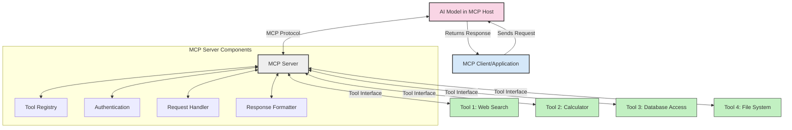
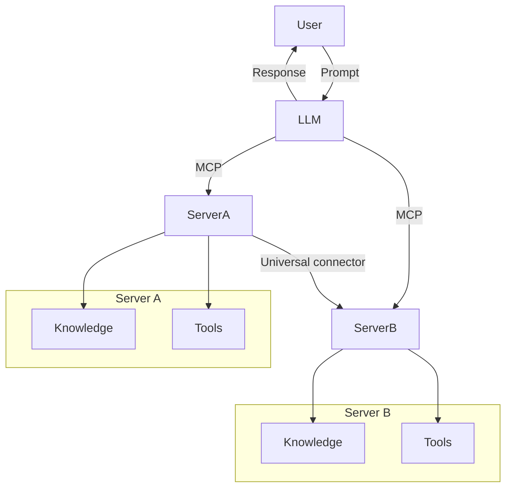

<!--
CO_OP_TRANSLATOR_METADATA:
{
  "original_hash": "cf84f987e1b771d2201408e110dfd2db",
  "translation_date": "2025-05-20T17:31:03+00:00",
  "source_file": "00-Introduction/README.md",
  "language_code": "nl"
}
-->
# Introductie tot het Model Context Protocol (MCP): Waarom het belangrijk is voor schaalbare AI-toepassingen

Generatieve AI-toepassingen zijn een grote stap vooruit omdat ze gebruikers vaak in staat stellen om met de app te communiceren via natuurlijke taalopdrachten. Maar naarmate er meer tijd en middelen in zulke apps worden gestoken, wil je ervoor zorgen dat je functionaliteiten en bronnen eenvoudig kunt integreren, zodat het makkelijk is om uit te breiden, dat je app meerdere modellen tegelijk kan ondersteunen en hun complexiteit kan beheren. Kortom, het bouwen van Gen AI-apps is in het begin eenvoudig, maar naarmate ze groeien en complexer worden, moet je een architectuur gaan definiëren en waarschijnlijk een standaard gebruiken om ervoor te zorgen dat je apps op een consistente manier worden gebouwd. Hier komt MCP om de hoek kijken: het organiseert alles en biedt een standaard.

---

## **🔍 Wat is het Model Context Protocol (MCP)?**

Het **Model Context Protocol (MCP)** is een **open, gestandaardiseerde interface** die Large Language Models (LLM’s) in staat stelt om naadloos samen te werken met externe tools, API’s en databronnen. Het biedt een consistente architectuur om de functionaliteit van AI-modellen te vergroten, buiten hun trainingsdata om, waardoor slimmere, schaalbare en responsievere AI-systemen mogelijk worden.

---

## **🎯 Waarom standaardisatie in AI belangrijk is**

Naarmate generatieve AI-toepassingen complexer worden, is het essentieel om standaarden te hanteren die zorgen voor **schaalbaarheid, uitbreidbaarheid** en **onderhoudbaarheid**. MCP speelt hierop in door:

- Integraties tussen modellen en tools te verenigen
- Het verminderen van fragiele, eenmalige maatwerkoplossingen
- Het mogelijk maken dat meerdere modellen binnen één ecosysteem kunnen samenwerken

---

## **📚 Leerdoelen**

Aan het einde van dit artikel kun je:

- Het **Model Context Protocol (MCP)** definiëren en de toepassingsmogelijkheden begrijpen
- Inzien hoe MCP de communicatie tussen model en tool standaardiseert
- De kerncomponenten van de MCP-architectuur herkennen
- Voorbeelden van MCP in de praktijk binnen bedrijven en ontwikkelomgevingen verkennen

---

## **💡 Waarom het Model Context Protocol (MCP) een game-changer is**

### **🔗 MCP lost fragmentatie in AI-interacties op**

Voor MCP vereiste het integreren van modellen met tools:

- Maatwerkcode per tool-model combinatie
- Niet-standaard API’s voor elke leverancier
- Regelmatige breuken door updates
- Slechte schaalbaarheid bij meer tools

### **✅ Voordelen van MCP-standaardisatie**

| **Voordeel**             | **Beschrijving**                                                              |
|--------------------------|-------------------------------------------------------------------------------|
| Interoperabiliteit       | LLM’s werken soepel samen met tools van verschillende leveranciers            |
| Consistentie             | Uniform gedrag op verschillende platforms en tools                            |
| Herbruikbaarheid         | Tools die één keer zijn gebouwd, kunnen in meerdere projecten en systemen worden gebruikt |
| Versnelde ontwikkeling   | Minder ontwikkeltijd dankzij gestandaardiseerde, plug-and-play interfaces     |

---

## **🧱 Overzicht van de MCP-architectuur op hoog niveau**

MCP volgt een **client-servermodel**, waarbij:

- **MCP Hosts** de AI-modellen draaien
- **MCP Clients** verzoeken initiëren
- **MCP Servers** context, tools en mogelijkheden leveren

### **Belangrijke componenten:**

- **Resources** – Statische of dynamische data voor modellen  
- **Prompts** – Vooraf gedefinieerde workflows voor gerichte generatie  
- **Tools** – Uitvoerbare functies zoals zoeken, berekeningen  
- **Sampling** – Agentgedrag via recursieve interacties

---

## Hoe MCP-servers werken

MCP-servers functioneren als volgt:

- **Verzoekstroom**:  
    1. De MCP Client stuurt een verzoek naar het AI-model dat draait in een MCP Host.  
    2. Het AI-model herkent wanneer het externe tools of data nodig heeft.  
    3. Het model communiceert met de MCP Server via het gestandaardiseerde protocol.

- **Functionaliteit van de MCP Server**:  
    - Tool Registry: Beheert een catalogus van beschikbare tools en hun mogelijkheden.  
    - Authenticatie: Verifieert toegangsrechten voor tools.  
    - Request Handler: Verwerkt binnenkomende toolverzoeken van het model.  
    - Response Formatter: Structureert tooluitvoer in een formaat dat het model begrijpt.

- **Tooluitvoering**:  
    - De server leidt verzoeken door naar de juiste externe tools  
    - Tools voeren hun gespecialiseerde functies uit (zoeken, berekenen, databasequeries, enz.)  
    - Resultaten worden in een consistent formaat aan het model teruggegeven.

- **Afhandeling van het antwoord**:  
    - Het AI-model verwerkt de tooluitvoer in zijn antwoord.  
    - Het definitieve antwoord wordt teruggestuurd naar de clientapplicatie.

## 👨‍💻 Hoe bouw je een MCP-server (met voorbeelden)

MCP-servers stellen je in staat om de mogelijkheden van LLM’s uit te breiden door data en functionaliteit aan te bieden.

Klaar om het uit te proberen? Hier zijn voorbeelden van het maken van een eenvoudige MCP-server in verschillende talen:

- **Python Voorbeeld**: https://github.com/modelcontextprotocol/python-sdk

- **TypeScript Voorbeeld**: https://github.com/modelcontextprotocol/typescript-sdk

- **Java Voorbeeld**: https://github.com/modelcontextprotocol/java-sdk

- **C#/.NET Voorbeeld**: https://github.com/modelcontextprotocol/csharp-sdk

## 🌍 Praktische toepassingen van MCP

MCP maakt een breed scala aan toepassingen mogelijk door AI-mogelijkheden uit te breiden:

| **Toepassing**             | **Beschrijving**                                                              |
|----------------------------|-------------------------------------------------------------------------------|
| Enterprise Data Integratie  | Verbind LLM’s met databases, CRM’s of interne tools                           |
| Agentic AI Systemen        | Maak autonome agenten mogelijk met toegang tot tools en beslissingsworkflows |
| Multi-modale Toepassingen  | Combineer tekst-, beeld- en audiotools binnen één enkele AI-app               |
| Real-time Data Integratie  | Breng live data in AI-interacties voor nauwkeurigere en actuele output       |

### 🧠 MCP = Universele standaard voor AI-interacties

Het Model Context Protocol (MCP) fungeert als een universele standaard voor AI-interacties, vergelijkbaar met hoe USB-C fysieke verbindingen tussen apparaten standaardiseerde. In de AI-wereld biedt MCP een consistente interface, waardoor modellen (clients) naadloos kunnen integreren met externe tools en databronnen (servers). Dit elimineert de noodzaak voor diverse, maatwerkprotocollen per API of databron.

Onder MCP volgt een MCP-compatibele tool (ook wel MCP-server genoemd) een uniforme standaard. Deze servers kunnen de tools of acties die ze aanbieden opsommen en deze uitvoeren wanneer een AI-agent daarom vraagt. AI-agentplatforms die MCP ondersteunen kunnen beschikbare tools van de servers ontdekken en deze via dit standaardprotocol aanroepen.

### 💡 Vergemakkelijkt toegang tot kennis

Naast het aanbieden van tools vergemakkelijkt MCP ook de toegang tot kennis. Het stelt applicaties in staat context te bieden aan grote taalmodellen (LLM’s) door ze te koppelen aan diverse databronnen. Bijvoorbeeld, een MCP-server kan de documentendatabase van een bedrijf vertegenwoordigen, zodat agenten relevante informatie op aanvraag kunnen ophalen. Een andere server kan specifieke acties afhandelen zoals het versturen van e-mails of het bijwerken van records. Vanuit het perspectief van de agent zijn dit gewoon tools die gebruikt kunnen worden—sommige tools leveren data (kenniscontext), terwijl andere acties uitvoeren. MCP beheert dit efficiënt.

Een agent die verbinding maakt met een MCP-server leert automatisch welke mogelijkheden en data de server biedt via een standaard formaat. Deze standaardisatie maakt dynamische beschikbaarheid van tools mogelijk. Bijvoorbeeld, het toevoegen van een nieuwe MCP-server aan het systeem van een agent maakt de functies direct bruikbaar zonder dat de instructies van de agent aangepast hoeven te worden.

Deze gestroomlijnde integratie komt overeen met de flow in het mermaid-diagram, waarbij servers zowel tools als kennis leveren, wat zorgt voor naadloze samenwerking tussen systemen.

### 👉 Voorbeeld: schaalbare agentoplossing

## 🔐 Praktische voordelen van MCP

Dit zijn de praktische voordelen van het gebruik van MCP:

- **Actualiteit**: Modellen kunnen toegang krijgen tot up-to-date informatie buiten hun trainingsdata  
- **Uitbreiding van mogelijkheden**: Modellen kunnen gespecialiseerde tools gebruiken voor taken waarvoor ze niet getraind zijn  
- **Minder hallucinaties**: Externe databronnen bieden feitelijke onderbouwing  
- **Privacy**: Gevoelige data kan binnen beveiligde omgevingen blijven in plaats van in prompts te worden verwerkt

## 📌 Belangrijkste punten

De belangrijkste punten bij het gebruik van MCP zijn:

- **MCP** standaardiseert hoe AI-modellen communiceren met tools en data  
- Bevordert **uitbreidbaarheid, consistentie en interoperabiliteit**  
- MCP helpt **ontwikkeltijd te verminderen, betrouwbaarheid te verbeteren en modelmogelijkheden uit te breiden**  
- De client-serverarchitectuur **maakt flexibele, uitbreidbare AI-toepassingen mogelijk**

## 🧠 Oefening

Denk na over een AI-toepassing die je graag wilt bouwen.

- Welke **externe tools of data** zouden de mogelijkheden kunnen verbeteren?  
- Hoe kan MCP de integratie **eenvoudiger en betrouwbaarder** maken?

## Aanvullende bronnen

- [MCP GitHub Repository](https://github.com/modelcontextprotocol)

## Wat volgt

Volgende: [Hoofdstuk 1: Kernconcepten](/01-CoreConcepts/README.md)

**Disclaimer**:  
Dit document is vertaald met behulp van de AI-vertalingsdienst [Co-op Translator](https://github.com/Azure/co-op-translator). Hoewel we streven naar nauwkeurigheid, dient u er rekening mee te houden dat geautomatiseerde vertalingen fouten of onnauwkeurigheden kunnen bevatten. Het oorspronkelijke document in de oorspronkelijke taal geldt als de gezaghebbende bron. Voor cruciale informatie wordt professionele menselijke vertaling aanbevolen. Wij zijn niet aansprakelijk voor misverstanden of verkeerde interpretaties die voortvloeien uit het gebruik van deze vertaling.