<!--
CO_OP_TRANSLATOR_METADATA:
{
  "original_hash": "25a94c681cf43612ff394d8cf78a74de",
  "translation_date": "2025-05-27T16:07:37+00:00",
  "source_file": "00-Introduction/README.md",
  "language_code": "nl"
}
-->
# Introductie tot het Model Context Protocol (MCP): Waarom het belangrijk is voor schaalbare AI-toepassingen

Generatieve AI-toepassingen zijn een grote stap vooruit omdat ze gebruikers vaak in staat stellen om met de app te communiceren via natuurlijke taalprompts. Naarmate er meer tijd en middelen in zulke apps worden gestoken, wil je er zeker van zijn dat je functionaliteiten en bronnen eenvoudig kunt integreren, zodat het makkelijk uitbreidbaar is, je app meerdere modellen kan ondersteunen en verschillende modelcomplexiteiten aankan. Kortom, het bouwen van Gen AI-apps is in het begin eenvoudig, maar naarmate ze groeien en complexer worden, moet je een architectuur gaan definiëren en waarschijnlijk een standaard gebruiken om ervoor te zorgen dat je apps op een consistente manier worden gebouwd. Hier komt MCP in beeld om alles te organiseren en een standaard te bieden.

---

## **🔍 Wat is het Model Context Protocol (MCP)?**

Het **Model Context Protocol (MCP)** is een **open, gestandaardiseerde interface** die Large Language Models (LLM’s) in staat stelt om naadloos te communiceren met externe tools, API’s en databronnen. Het biedt een consistente architectuur om de functionaliteit van AI-modellen uit te breiden voorbij hun trainingsdata, waardoor slimmere, schaalbare en responsievere AI-systemen mogelijk worden.

---

## **🎯 Waarom standaardisatie in AI belangrijk is**

Naarmate generatieve AI-toepassingen complexer worden, is het essentieel om standaarden te hanteren die zorgen voor **schaalbaarheid, uitbreidbaarheid** en **onderhoudbaarheid**. MCP speelt in op deze behoeften door:

- Model-tool integraties te verenigen  
- Kwetsbare, geïsoleerde maatwerkoplossingen te verminderen  
- Meerdere modellen binnen één ecosysteem te laten samenwerken  

---

## **📚 Leerdoelen**

Aan het einde van dit artikel kun je:

- Het **Model Context Protocol (MCP)** definiëren en de toepassingsgebieden begrijpen  
- Inzien hoe MCP de communicatie tussen model en tool standaardiseert  
- De kerncomponenten van de MCP-architectuur benoemen  
- Praktische toepassingen van MCP in bedrijfs- en ontwikkelomgevingen verkennen  

---

## **💡 Waarom het Model Context Protocol (MCP) een doorbraak is**

### **🔗 MCP lost versnippering in AI-interacties op**

Voor MCP vereiste het integreren van modellen met tools:

- Maatwerkcode per tool-model combinatie  
- Niet-gestandaardiseerde API’s per leverancier  
- Regelmatige storingen door updates  
- Slechte schaalbaarheid bij meer tools  

### **✅ Voordelen van MCP-standaardisatie**

| **Voordeel**              | **Beschrijving**                                                              |
|--------------------------|-------------------------------------------------------------------------------|
| Interoperabiliteit       | LLM’s werken naadloos samen met tools van verschillende leveranciers          |
| Consistentie             | Uniform gedrag over platforms en tools heen                                   |
| Herbruikbaarheid         | Eenmalig gebouwde tools kunnen hergebruikt worden in verschillende projecten  |
| Versnelde ontwikkeling   | Minder ontwikkeltijd door gestandaardiseerde, plug-and-play interfaces       |

---

## **🧱 Overzicht van de MCP-architectuur op hoofdlijnen**

MCP volgt een **client-server model**, waarbij:

- **MCP Hosts** de AI-modellen draaien  
- **MCP Clients** verzoeken initiëren  
- **MCP Servers** context, tools en mogelijkheden aanbieden  

### **Belangrijke componenten:**

- **Resources** – Statische of dynamische data voor modellen  
- **Prompts** – Vooraf gedefinieerde workflows voor begeleide generatie  
- **Tools** – Uitvoerbare functies zoals zoeken, berekeningen  
- **Sampling** – Agent-gedrag via recursieve interacties  

---

## Hoe MCP-servers werken

MCP-servers werken op de volgende manier:

- **Verzoekstroom**:  
    1. De MCP Client stuurt een verzoek naar het AI-model dat draait in een MCP Host.  
    2. Het AI-model herkent wanneer het externe tools of data nodig heeft.  
    3. Het model communiceert met de MCP Server via het gestandaardiseerde protocol.  

- **Functionaliteit van de MCP Server**:  
    - Toolregister: Beheert een catalogus van beschikbare tools en hun mogelijkheden.  
    - Authenticatie: Verifieert toegangsrechten tot tools.  
    - Verzoekafhandeling: Verwerkt binnenkomende toolverzoeken van het model.  
    - Response formatter: Structureert tool-uitvoer in een formaat dat het model begrijpt.  

- **Uitvoering van tools**:  
    - De server leidt verzoeken door naar de juiste externe tools  
    - Tools voeren hun gespecialiseerde functies uit (zoeken, berekenen, databasequery’s, enz.)  
    - Resultaten worden in een consistent formaat teruggestuurd naar het model  

- **Voltooiing van de respons**:  
    - Het AI-model verwerkt de toolresultaten in zijn antwoord.  
    - De uiteindelijke respons wordt teruggestuurd naar de client-applicatie.  

## 👨‍💻 Hoe bouw je een MCP-server (met voorbeelden)

MCP-servers stellen je in staat om de mogelijkheden van LLM’s uit te breiden door data en functionaliteit te leveren.

Klaar om het uit te proberen? Hier vind je voorbeelden van het maken van een eenvoudige MCP-server in verschillende talen:

- **Python Voorbeeld**: https://github.com/modelcontextprotocol/python-sdk

- **TypeScript Voorbeeld**: https://github.com/modelcontextprotocol/typescript-sdk

- **Java Voorbeeld**: https://github.com/modelcontextprotocol/java-sdk

- **C#/.NET Voorbeeld**: https://github.com/modelcontextprotocol/csharp-sdk

## 🌍 Praktische toepassingen van MCP

MCP maakt een breed scala aan toepassingen mogelijk door AI-mogelijkheden uit te breiden:

| **Toepassing**              | **Beschrijving**                                                              |
|----------------------------|-------------------------------------------------------------------------------|
| Enterprise Data Integratie  | Verbind LLM’s met databases, CRM-systemen of interne tools                   |
| Agentische AI-systemen      | Maak autonome agenten mogelijk met toegang tot tools en beslisworkflows      |
| Multimodale toepassingen    | Combineer tekst-, beeld- en audiotools binnen één uniforme AI-app            |
| Real-time data-integratie   | Breng live data in AI-interacties voor nauwkeurigere, actuele output         |

### 🧠 MCP = Universele standaard voor AI-interacties

Het Model Context Protocol (MCP) fungeert als een universele standaard voor AI-interacties, vergelijkbaar met hoe USB-C fysieke verbindingen voor apparaten heeft gestandaardiseerd. In de AI-wereld biedt MCP een consistente interface waarmee modellen (clients) naadloos kunnen integreren met externe tools en databronnen (servers). Dit elimineert de noodzaak voor diverse, op maat gemaakte protocollen voor elke API of databron.

Onder MCP volgt een MCP-compatibele tool (ook wel MCP-server genoemd) een uniforme standaard. Deze servers kunnen de tools of acties die ze aanbieden op een lijst zetten en deze acties uitvoeren wanneer een AI-agent daarom vraagt. AI-agentplatforms die MCP ondersteunen kunnen beschikbare tools van de servers ontdekken en via dit standaardprotocol aanroepen.

### 💡 Vergemakkelijkt toegang tot kennis

Naast het aanbieden van tools vergemakkelijkt MCP ook de toegang tot kennis. Het stelt applicaties in staat om context te bieden aan grote taalmodellen (LLM’s) door ze te koppelen aan verschillende databronnen. Bijvoorbeeld, een MCP-server kan de documentendatabase van een bedrijf vertegenwoordigen, waardoor agenten relevante informatie op aanvraag kunnen ophalen. Een andere server kan specifieke acties afhandelen, zoals het versturen van e-mails of het bijwerken van records. Vanuit het perspectief van de agent zijn dit simpelweg tools die gebruikt kunnen worden—sommige tools leveren data (kenniscontext), terwijl andere acties uitvoeren. MCP beheert dit efficiënt.

Een agent die verbinding maakt met een MCP-server leert automatisch welke mogelijkheden en toegankelijke data de server heeft via een standaardformaat. Deze standaardisatie maakt dynamische beschikbaarheid van tools mogelijk. Bijvoorbeeld, het toevoegen van een nieuwe MCP-server aan het systeem van een agent maakt de functies daarvan direct bruikbaar zonder verdere aanpassing van de agentinstructies.

Deze gestroomlijnde integratie sluit aan bij de stroom in het mermaid-diagram, waar servers zowel tools als kennis leveren, wat zorgt voor naadloze samenwerking tussen systemen.

### 👉 Voorbeeld: schaalbare agentoplossing

### 🔄 Geavanceerde MCP-scenario’s met client-side LLM-integratie

Naast de basis MCP-architectuur zijn er geavanceerde scenario’s waarin zowel client als server LLM’s bevatten, wat meer verfijnde interacties mogelijk maakt:

```mermaid
sequenceDiagram
    autonumber
    actor User as 👤 User
    participant ClientApp as 🖥️ Client App
    participant ClientLLM as 🧠 Client LLM
    participant Server1 as 🔧 MCP Server 1
    participant Server2 as 📚 MCP Server 2
    participant ServerLLM as 🤖 Server LLM
    
    %% Discovery Phase
    rect rgb(220, 240, 255)
        Note over ClientApp, Server2: TOOL DISCOVERY PHASE
        ClientApp->>+Server1: Request available tools/resources
        Server1-->>-ClientApp: Return tool list (JSON)
        ClientApp->>+Server2: Request available tools/resources
        Server2-->>-ClientApp: Return tool list (JSON)
        Note right of ClientApp: Store combined tool<br/>catalog locally
    end
    
    %% User Interaction
    rect rgb(255, 240, 220)
        Note over User, ClientLLM: USER INTERACTION PHASE
        User->>+ClientApp: Enter natural language prompt
        ClientApp->>+ClientLLM: Forward prompt + tool catalog
        ClientLLM->>-ClientLLM: Analyze prompt & select tools
    end
    
    %% Scenario A: Direct Tool Calling
    alt Direct Tool Calling
        rect rgb(220, 255, 220)
            Note over ClientApp, Server1: SCENARIO A: DIRECT TOOL CALLING
            ClientLLM->>+ClientApp: Request tool execution
            ClientApp->>+Server1: Execute specific tool
            Server1-->>-ClientApp: Return results
            ClientApp->>+ClientLLM: Process results
            ClientLLM-->>-ClientApp: Generate response
            ClientApp-->>-User: Display final answer
        end
    
    %% Scenario B: Feature Negotiation (VS Code style)
    else Feature Negotiation (VS Code style)
        rect rgb(255, 220, 220)
            Note over ClientApp, ServerLLM: SCENARIO B: FEATURE NEGOTIATION
            ClientLLM->>+ClientApp: Identify needed capabilities
            ClientApp->>+Server2: Negotiate features/capabilities
            Server2->>+ServerLLM: Request additional context
            ServerLLM-->>-Server2: Provide context
            Server2-->>-ClientApp: Return available features
            ClientApp->>+Server2: Call negotiated tools
            Server2-->>-ClientApp: Return results
            ClientApp->>+ClientLLM: Process results
            ClientLLM-->>-ClientApp: Generate response
            ClientApp-->>-User: Display final answer
        end
    end
```

## 🔐 Praktische voordelen van MCP

Dit zijn de praktische voordelen van het gebruik van MCP:

- **Actualiteit**: Modellen kunnen actuele informatie raadplegen buiten hun trainingsdata  
- **Uitbreiding van mogelijkheden**: Modellen kunnen gespecialiseerde tools gebruiken voor taken waarvoor ze niet getraind zijn  
- **Minder hallucinerende antwoorden**: Externe databronnen bieden feitelijke onderbouwing  
- **Privacy**: Gevoelige data blijft binnen veilige omgevingen in plaats van in prompts verwerkt te worden  

## 📌 Belangrijkste conclusies

De belangrijkste conclusies bij het gebruik van MCP zijn:

- **MCP** standaardiseert de interactie tussen AI-modellen, tools en data  
- Bevordert **uitbreidbaarheid, consistentie en interoperabiliteit**  
- MCP helpt **ontwikkeltijd te verkorten, betrouwbaarheid te verbeteren en modelmogelijkheden uit te breiden**  
- De client-serverarchitectuur maakt **flexibele, uitbreidbare AI-toepassingen mogelijk**  

## 🧠 Oefening

Denk na over een AI-toepassing die je graag wilt bouwen.

- Welke **externe tools of data** zouden de mogelijkheden kunnen verbeteren?  
- Hoe zou MCP de integratie **eenvoudiger en betrouwbaarder** kunnen maken?  

## Aanvullende bronnen

- [MCP GitHub Repository](https://github.com/modelcontextprotocol)

## Wat nu?

Vervolg: [Hoofdstuk 1: Kernconcepten](/01-CoreConcepts/README.md)

**Disclaimer**:  
Dit document is vertaald met behulp van de AI-vertalingsdienst [Co-op Translator](https://github.com/Azure/co-op-translator). Hoewel we streven naar nauwkeurigheid, dient u er rekening mee te houden dat automatische vertalingen fouten of onnauwkeurigheden kunnen bevatten. Het oorspronkelijke document in de originele taal moet worden beschouwd als de gezaghebbende bron. Voor cruciale informatie wordt professionele menselijke vertaling aanbevolen. Wij zijn niet aansprakelijk voor eventuele misverstanden of verkeerde interpretaties die voortvloeien uit het gebruik van deze vertaling.