<!--
CO_OP_TRANSLATOR_METADATA:
{
  "original_hash": "0df1ee78a6dd8300f3a040ca5b411c2e",
  "translation_date": "2025-08-18T16:39:38+00:00",
  "source_file": "00-Introduction/README.md",
  "language_code": "nl"
}
-->
# Introductie tot het Model Context Protocol (MCP): Waarom het Belangrijk is voor Schaalbare AI-toepassingen

_(Klik op de afbeelding hierboven om de video van deze les te bekijken)_

Generatieve AI-toepassingen zijn een grote stap vooruit, omdat ze gebruikers vaak in staat stellen om met de app te communiceren via natuurlijke taalopdrachten. Maar naarmate er meer tijd en middelen in dergelijke apps worden geïnvesteerd, wil je ervoor zorgen dat je functionaliteiten en bronnen eenvoudig kunt integreren op een manier die uitbreidbaar is, dat je app meer dan één model kan ondersteunen, en dat het verschillende modelcomplexiteiten aankan. Kortom, het bouwen van Gen AI-apps is in het begin eenvoudig, maar naarmate ze groeien en complexer worden, moet je een architectuur definiëren en waarschijnlijk vertrouwen op een standaard om ervoor te zorgen dat je apps op een consistente manier worden gebouwd. Hier komt MCP om de hoek kijken om structuur te bieden en een standaard te leveren.

---

## **🔍 Wat is het Model Context Protocol (MCP)?**

Het **Model Context Protocol (MCP)** is een **open, gestandaardiseerde interface** die Grote Taalmodellen (LLMs) naadloos laat samenwerken met externe tools, API's en databronnen. Het biedt een consistente architectuur om de functionaliteit van AI-modellen te verbeteren buiten hun trainingsdata, waardoor slimmere, schaalbare en responsievere AI-systemen mogelijk worden.

---

## **🎯 Waarom Standaardisatie in AI Belangrijk is**

Naarmate generatieve AI-toepassingen complexer worden, is het essentieel om standaarden te omarmen die zorgen voor **schaalbaarheid, uitbreidbaarheid, onderhoudbaarheid** en **het vermijden van leveranciersafhankelijkheid**. MCP speelt in op deze behoeften door:

- Het verenigen van model-toolintegraties
- Het verminderen van kwetsbare, eenmalige maatwerkoplossingen
- Het mogelijk maken dat meerdere modellen van verschillende leveranciers in één ecosysteem kunnen bestaan

**Opmerking:** Hoewel MCP zichzelf presenteert als een open standaard, zijn er geen plannen om MCP te standaardiseren via bestaande standaardisatieorganisaties zoals IEEE, IETF, W3C, ISO of andere.

---

## **📚 Leerdoelen**

Aan het einde van dit artikel kun je:

- **Model Context Protocol (MCP)** definiëren en de toepassingsgebieden begrijpen
- Inzicht krijgen in hoe MCP model-toolcommunicatie standaardiseert
- De kerncomponenten van de MCP-architectuur identificeren
- Verkennen hoe MCP wordt toegepast in bedrijfs- en ontwikkelingscontexten

---

## **💡 Waarom het Model Context Protocol (MCP) een Doorbraak is**

### **🔗 MCP Lost Fragmentatie in AI-interacties op**

Voor MCP vereiste het integreren van modellen met tools:

- Maatwerkcode per tool-modelcombinatie
- Niet-standaard API's voor elke leverancier
- Regelmatige storingen door updates
- Slechte schaalbaarheid bij meer tools

### **✅ Voordelen van MCP-standaardisatie**

| **Voordeel**              | **Beschrijving**                                                                |
|---------------------------|---------------------------------------------------------------------------------|
| Interoperabiliteit        | LLMs werken naadloos samen met tools van verschillende leveranciers             |
| Consistentie              | Uniform gedrag over platforms en tools heen                                    |
| Herbruikbaarheid          | Tools die eenmaal zijn gebouwd, kunnen worden gebruikt in meerdere projecten    |
| Versnelde Ontwikkeling    | Verminder ontwikkeltijd door gestandaardiseerde, plug-and-play interfaces       |

---

## **🧱 Overzicht van de MCP-architectuur op Hoog Niveau**

MCP volgt een **client-servermodel**, waarbij:

- **MCP Hosts** de AI-modellen draaien
- **MCP Clients** verzoeken initiëren
- **MCP Servers** context, tools en mogelijkheden aanbieden

### **Belangrijke Componenten:**

- **Resources** – Statische of dynamische data voor modellen  
- **Prompts** – Vooraf gedefinieerde workflows voor begeleide generatie  
- **Tools** – Uitvoerbare functies zoals zoeken, berekeningen  
- **Sampling** – Agentisch gedrag via herhaalde interacties  

---

## Hoe MCP-servers Werken

MCP-servers werken als volgt:

- **Verzoekstroom**:
    1. Een verzoek wordt geïnitieerd door een eindgebruiker of software die namens hen handelt.
    2. De **MCP Client** stuurt het verzoek naar een **MCP Host**, die het AI-model beheert.
    3. Het **AI-model** ontvangt de gebruikersprompt en kan toegang vragen tot externe tools of data via een of meer tooloproepen.
    4. De **MCP Host**, niet het model zelf, communiceert met de juiste **MCP Server(s)** via het gestandaardiseerde protocol.
- **Functionaliteit van de MCP Host**:
    - **Toolregister**: Beheert een catalogus van beschikbare tools en hun mogelijkheden.
    - **Authenticatie**: Controleert de rechten voor tooltoegang.
    - **Verwerkingshandler**: Verwerkt inkomende toolverzoeken van het model.
    - **Antwoordformatter**: Structureert tooluitvoer in een formaat dat het model begrijpt.
- **Uitvoering door MCP Server**:
    - De **MCP Host** leidt tooloproepen door naar een of meer **MCP Servers**, die gespecialiseerde functies aanbieden (bijv. zoeken, berekeningen, databasevragen).
    - De **MCP Servers** voeren hun respectieve operaties uit en sturen resultaten terug naar de **MCP Host** in een consistent formaat.
    - De **MCP Host** formatteert en geeft deze resultaten door aan het **AI-model**.
- **Voltooiing van het Antwoord**:
    - Het **AI-model** verwerkt de tooluitvoer in een definitief antwoord.
    - De **MCP Host** stuurt dit antwoord terug naar de **MCP Client**, die het levert aan de eindgebruiker of aanroepende software.

## 👨‍💻 Hoe een MCP-server te Bouwen (Met Voorbeelden)

MCP-servers stellen je in staat om de mogelijkheden van LLM's uit te breiden door data en functionaliteit te bieden.

Klaar om het uit te proberen? Hier zijn taal- en/of stack-specifieke SDK's met voorbeelden van het maken van eenvoudige MCP-servers in verschillende talen/stacks:

- **Python SDK**: https://github.com/modelcontextprotocol/python-sdk

- **TypeScript SDK**: https://github.com/modelcontextprotocol/typescript-sdk

- **Java SDK**: https://github.com/modelcontextprotocol/java-sdk

- **C#/.NET SDK**: https://github.com/modelcontextprotocol/csharp-sdk

---

## 🌍 Toepassingen in de Praktijk voor MCP

MCP maakt een breed scala aan toepassingen mogelijk door AI-mogelijkheden uit te breiden:

| **Toepassing**             | **Beschrijving**                                                               |
|----------------------------|--------------------------------------------------------------------------------|
| Integratie van Bedrijfsdata | Verbind LLMs met databases, CRM's of interne tools                             |
| Agentische AI-systemen      | Maak autonome agents mogelijk met tooltoegang en besluitvormingsworkflows      |
| Multimodale Toepassingen    | Combineer tekst-, beeld- en audiotools in één enkele AI-app                    |
| Realtime Data-integratie    | Breng live data in AI-interacties voor nauwkeurigere, actuele resultaten       |

### 🧠 MCP = Universele Standaard voor AI-interacties

Het Model Context Protocol (MCP) fungeert als een universele standaard voor AI-interacties, net zoals USB-C fysieke verbindingen voor apparaten heeft gestandaardiseerd. In de wereld van AI biedt MCP een consistente interface, waardoor modellen (clients) naadloos kunnen integreren met externe tools en dataproviders (servers). Dit elimineert de noodzaak voor diverse, aangepaste protocollen voor elke API of databron.

Onder MCP volgt een MCP-compatibele tool (een MCP-server genoemd) een uniforme standaard. Deze servers kunnen de tools of acties die ze aanbieden opsommen en die acties uitvoeren wanneer daarom wordt gevraagd door een AI-agent. AI-agentplatforms die MCP ondersteunen, kunnen beschikbare tools van de servers ontdekken en deze oproepen via dit standaardprotocol.

### 💡 Toegang tot Kennis Vergemakkelijken

Naast het aanbieden van tools, vergemakkelijkt MCP ook de toegang tot kennis. Het stelt toepassingen in staat om context te bieden aan grote taalmodellen (LLMs) door ze te koppelen aan verschillende databronnen. Bijvoorbeeld, een MCP-server kan een documentrepository van een bedrijf vertegenwoordigen, waardoor agents relevante informatie op aanvraag kunnen ophalen. Een andere server kan specifieke acties uitvoeren, zoals e-mails verzenden of records bijwerken. Vanuit het perspectief van de agent zijn dit simpelweg tools die het kan gebruiken—sommige tools leveren data (kenniscontext), terwijl andere acties uitvoeren. MCP beheert beide efficiënt.

Een agent die verbinding maakt met een MCP-server leert automatisch de beschikbare mogelijkheden en toegankelijke data van de server via een standaardformaat. Deze standaardisatie maakt dynamische toolbeschikbaarheid mogelijk. Bijvoorbeeld, het toevoegen van een nieuwe MCP-server aan het systeem van een agent maakt de functies ervan direct bruikbaar zonder verdere aanpassing van de instructies van de agent.

Deze gestroomlijnde integratie sluit aan bij de stroom die wordt weergegeven in het volgende diagram, waar servers zowel tools als kennis bieden, wat zorgt voor naadloze samenwerking tussen systemen.

### 👉 Voorbeeld: Schaalbare Agentoplossing

### 🔄 Geavanceerde MCP-scenario's met Client-side LLM-integratie

Naast de basisarchitectuur van MCP zijn er geavanceerde scenario's waarin zowel de client als de server LLM's bevatten, wat meer geavanceerde interacties mogelijk maakt. In het volgende diagram kan de **Client App** een IDE zijn met een aantal MCP-tools die beschikbaar zijn voor gebruik door de LLM:

```mermaid
---
title: Advanced MCP Scenarios with Client-Server LLM Integration
description: A sequence diagram showing the detailed interaction flow between user, client application, client LLM, multiple MCP servers, and server LLM, illustrating tool discovery, user interaction, direct tool calling, and feature negotiation phases
---
sequenceDiagram
    autonumber
    actor User as 👤 User
    participant ClientApp as 🖥️ Client App
    participant ClientLLM as 🧠 Client LLM
    participant Server1 as 🔧 MCP Server 1
    participant Server2 as 📚 MCP Server 2
    participant ServerLLM as 🤖 Server LLM
    
    %% Discovery Phase
    rect rgb(220, 240, 255)
        Note over ClientApp, Server2: TOOL DISCOVERY PHASE
        ClientApp->>+Server1: Request available tools/resources
        Server1-->>-ClientApp: Return tool list (JSON)
        ClientApp->>+Server2: Request available tools/resources
        Server2-->>-ClientApp: Return tool list (JSON)
        Note right of ClientApp: Store combined tool<br/>catalog locally
    end
    
    %% User Interaction
    rect rgb(255, 240, 220)
        Note over User, ClientLLM: USER INTERACTION PHASE
        User->>+ClientApp: Enter natural language prompt
        ClientApp->>+ClientLLM: Forward prompt + tool catalog
        ClientLLM->>-ClientLLM: Analyze prompt & select tools
    end
    
    %% Scenario A: Direct Tool Calling
    alt Direct Tool Calling
        rect rgb(220, 255, 220)
            Note over ClientApp, Server1: SCENARIO A: DIRECT TOOL CALLING
            ClientLLM->>+ClientApp: Request tool execution
            ClientApp->>+Server1: Execute specific tool
            Server1-->>-ClientApp: Return results
            ClientApp->>+ClientLLM: Process results
            ClientLLM-->>-ClientApp: Generate response
            ClientApp-->>-User: Display final answer
        end
    
    %% Scenario B: Feature Negotiation (VS Code style)
    else Feature Negotiation (VS Code style)
        rect rgb(255, 220, 220)
            Note over ClientApp, ServerLLM: SCENARIO B: FEATURE NEGOTIATION
            ClientLLM->>+ClientApp: Identify needed capabilities
            ClientApp->>+Server2: Negotiate features/capabilities
            Server2->>+ServerLLM: Request additional context
            ServerLLM-->>-Server2: Provide context
            Server2-->>-ClientApp: Return available features
            ClientApp->>+Server2: Call negotiated tools
            Server2-->>-ClientApp: Return results
            ClientApp->>+ClientLLM: Process results
            ClientLLM-->>-ClientApp: Generate response
            ClientApp-->>-User: Display final answer
        end
    end
```

---

## 🔐 Praktische Voordelen van MCP

Hier zijn de praktische voordelen van het gebruik van MCP:

- **Actualiteit**: Modellen kunnen toegang krijgen tot actuele informatie buiten hun trainingsdata
- **Uitbreiding van Mogelijkheden**: Modellen kunnen gespecialiseerde tools gebruiken voor taken waarvoor ze niet zijn getraind
- **Verminderde Hallucinaties**: Externe databronnen bieden feitelijke onderbouwing
- **Privacy**: Gevoelige data kan binnen veilige omgevingen blijven in plaats van in prompts te worden opgenomen

---

## 📌 Belangrijkste Inzichten

De volgende punten zijn belangrijk bij het gebruik van MCP:

- **MCP** standaardiseert hoe AI-modellen communiceren met tools en data
- Bevordert **uitbreidbaarheid, consistentie en interoperabiliteit**
- MCP helpt **ontwikkeltijd te verkorten, betrouwbaarheid te verbeteren en modelmogelijkheden uit te breiden**
- De client-serverarchitectuur **maakt flexibele, uitbreidbare AI-toepassingen mogelijk**

---

## 🧠 Oefening

Denk na over een AI-toepassing die je wilt bouwen.

- Welke **externe tools of data** zouden de mogelijkheden kunnen verbeteren?
- Hoe zou MCP de integratie **eenvoudiger en betrouwbaarder** kunnen maken?

---

## Aanvullende Bronnen

- [MCP GitHub Repository](https://github.com/modelcontextprotocol)

---

## Wat Nu?

Volgende: [Hoofdstuk 1: Kernconcepten](../01-CoreConcepts/README.md)

**Disclaimer**:  
Dit document is vertaald met behulp van de AI-vertalingsservice [Co-op Translator](https://github.com/Azure/co-op-translator). Hoewel we ons best doen voor nauwkeurigheid, dient u zich ervan bewust te zijn dat geautomatiseerde vertalingen fouten of onnauwkeurigheden kunnen bevatten. Het originele document in de oorspronkelijke taal moet worden beschouwd als de gezaghebbende bron. Voor cruciale informatie wordt professionele menselijke vertaling aanbevolen. Wij zijn niet aansprakelijk voor misverstanden of verkeerde interpretaties die voortvloeien uit het gebruik van deze vertaling.