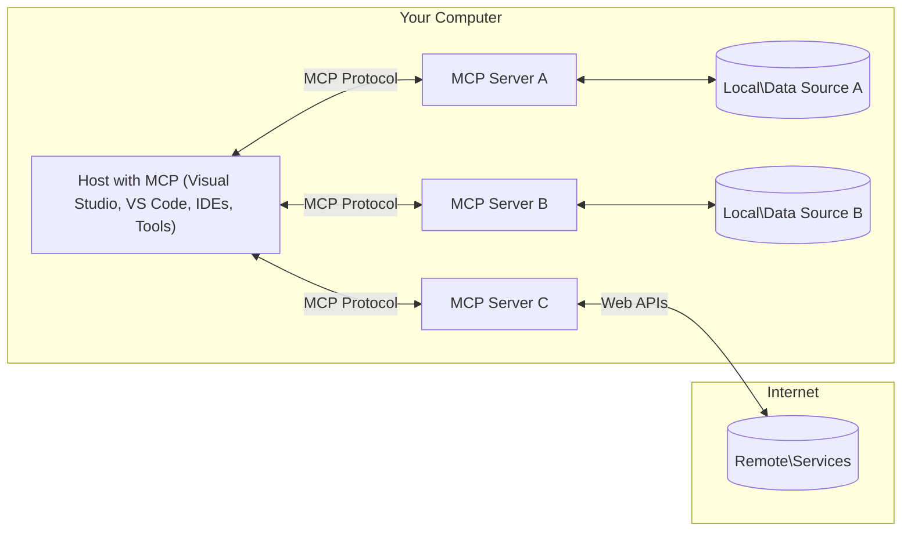

<!--
CO_OP_TRANSLATOR_METADATA:
{
  "original_hash": "904b59de1de9264801242d90a42cdd9d",
  "translation_date": "2025-09-05T11:14:14+00:00",
  "source_file": "01-CoreConcepts/README.md",
  "language_code": "nl"
}
-->
# MCP Kernconcepten: Het Beheersen van het Model Context Protocol voor AI-integratie

[](https://youtu.be/earDzWGtE84)

_(Klik op de afbeelding hierboven om de video van deze les te bekijken)_

Het [Model Context Protocol (MCP)](https://github.com/modelcontextprotocol) is een krachtig, gestandaardiseerd raamwerk dat de communicatie tussen Large Language Models (LLMs) en externe tools, applicaties en databronnen optimaliseert. 
Deze gids leidt je door de kernconcepten van MCP. Je leert over de client-serverarchitectuur, essentiële componenten, communicatiemechanismen en best practices voor implementatie.

- **Expliciete Gebruikersinstemming**: Alle toegang tot gegevens en operaties vereisen expliciete goedkeuring van de gebruiker voordat ze worden uitgevoerd. Gebruikers moeten duidelijk begrijpen welke gegevens worden benaderd en welke acties worden uitgevoerd, met gedetailleerde controle over machtigingen en autorisaties.

- **Bescherming van Gegevensprivacy**: Gebruikersgegevens worden alleen blootgesteld met expliciete toestemming en moeten gedurende de gehele interactiecyclus worden beschermd door robuuste toegangscontroles. Implementaties moeten ongeautoriseerde gegevensoverdracht voorkomen en strikte privacygrenzen handhaven.

- **Veiligheid bij Tooluitvoering**: Elke tooluitvoering vereist expliciete gebruikersinstemming met een duidelijk begrip van de functionaliteit, parameters en mogelijke impact van de tool. Robuuste beveiligingsgrenzen moeten onbedoelde, onveilige of kwaadaardige tooluitvoering voorkomen.

- **Transportlaagbeveiliging**: Alle communicatiekanalen moeten geschikte versleutelings- en authenticatiemechanismen gebruiken. Externe verbindingen moeten veilige transportprotocollen en goed beheer van inloggegevens implementeren.

#### Richtlijnen voor Implementatie:

- **Machtigingenbeheer**: Implementeer fijnmazige machtigingssystemen waarmee gebruikers kunnen bepalen welke servers, tools en bronnen toegankelijk zijn.
- **Authenticatie & Autorisatie**: Gebruik veilige authenticatiemethoden (OAuth, API-sleutels) met goed tokenbeheer en vervaldatums.  
- **Invoervalidatie**: Valideer alle parameters en gegevensinvoer volgens gedefinieerde schema's om injectieaanvallen te voorkomen.
- **Auditlogging**: Houd uitgebreide logs bij van alle operaties voor beveiligingsmonitoring en naleving.

## Overzicht

Deze les verkent de fundamentele architectuur en componenten die het Model Context Protocol (MCP)-ecosysteem vormen. Je leert over de client-serverarchitectuur, sleutelcomponenten en communicatiemechanismen die MCP-interacties aandrijven.

## Belangrijke Leerdoelen

Aan het einde van deze les zul je:

- De MCP client-serverarchitectuur begrijpen.
- Rollen en verantwoordelijkheden van Hosts, Clients en Servers identificeren.
- De kernfuncties analyseren die MCP tot een flexibele integratielaag maken.
- Leren hoe informatie stroomt binnen het MCP-ecosysteem.
- Praktische inzichten opdoen via codevoorbeelden in .NET, Java, Python en JavaScript.

## MCP Architectuur: Een Diepere Kijk

Het MCP-ecosysteem is gebouwd op een client-servermodel. Deze modulaire structuur stelt AI-applicaties in staat om efficiënt te communiceren met tools, databases, API's en contextuele bronnen. Laten we deze architectuur opsplitsen in de kerncomponenten.

In de kern volgt MCP een client-serverarchitectuur waarbij een hostapplicatie verbinding kan maken met meerdere servers:



- **MCP Hosts**: Programma's zoals VSCode, Claude Desktop, IDE's of AI-tools die toegang willen tot gegevens via MCP.
- **MCP Clients**: Protocolclients die 1:1-verbindingen onderhouden met servers.
- **MCP Servers**: Lichtgewicht programma's die specifieke mogelijkheden blootleggen via het gestandaardiseerde Model Context Protocol.
- **Lokale Databronnen**: Bestanden, databases en diensten op je computer die MCP-servers veilig kunnen benaderen.
- **Externe Diensten**: Systemen die via internet beschikbaar zijn en waarmee MCP-servers verbinding kunnen maken via API's.

Het MCP-protocol is een evoluerende standaard met datumgebaseerde versies (YYYY-MM-DD-formaat). De huidige protocolversie is **2025-06-18**. Je kunt de laatste updates van de [protocolspecificatie](https://modelcontextprotocol.io/specification/2025-06-18/) bekijken.

### 1. Hosts

In het Model Context Protocol (MCP) zijn **Hosts** AI-applicaties die dienen als de primaire interface waarmee gebruikers met het protocol interacteren. Hosts coördineren en beheren verbindingen met meerdere MCP-servers door voor elke serververbinding een toegewijde MCP-client te creëren. Voorbeelden van Hosts zijn:

- **AI-applicaties**: Claude Desktop, Visual Studio Code, Claude Code.
- **Ontwikkelomgevingen**: IDE's en code-editors met MCP-integratie.  
- **Aangepaste Applicaties**: Speciaal gebouwde AI-agenten en tools.

**Hosts** zijn applicaties die AI-modelinteracties coördineren. Ze:

- **Orkestreren AI-modellen**: Voeren LLM's uit of interacteren ermee om reacties te genereren en AI-workflows te coördineren.
- **Beheren Clientverbindingen**: Creëren en onderhouden één MCP-client per MCP-serververbinding.
- **Beheren Gebruikersinterface**: Handhaven gespreksstromen, gebruikersinteracties en presentatie van reacties.  
- **Handhaven Beveiliging**: Controleren machtigingen, beveiligingsbeperkingen en authenticatie.
- **Beheren Gebruikersinstemming**: Regelen gebruikersgoedkeuring voor gegevensdeling en tooluitvoering.

### 2. Clients

**Clients** zijn essentiële componenten die toegewijde één-op-één verbindingen onderhouden tussen Hosts en MCP-servers. Elke MCP-client wordt door de Host geïnstalleerd om verbinding te maken met een specifieke MCP-server, wat zorgt voor georganiseerde en veilige communicatiekanalen. Meerdere clients stellen Hosts in staat om tegelijkertijd verbinding te maken met meerdere servers.

**Clients** zijn verbindingscomponenten binnen de hostapplicatie. Ze:

- **Protocolcommunicatie**: Versturen JSON-RPC 2.0-verzoeken naar servers met prompts en instructies.
- **Capabiliteitsonderhandeling**: Onderhandelen over ondersteunde functies en protocolversies met servers tijdens initialisatie.
- **Tooluitvoering**: Beheren tooluitvoeringsverzoeken van modellen en verwerken reacties.
- **Realtime Updates**: Behandelen meldingen en realtime updates van servers.
- **Reactieverwerking**: Verwerken en formatteren serverreacties voor weergave aan gebruikers.

### 3. Servers

**Servers** zijn programma's die context, tools en mogelijkheden bieden aan MCP-clients. Ze kunnen lokaal worden uitgevoerd (op dezelfde machine als de Host) of op afstand (op externe platforms), en zijn verantwoordelijk voor het afhandelen van clientverzoeken en het leveren van gestructureerde reacties. Servers stellen specifieke functionaliteit bloot via het gestandaardiseerde Model Context Protocol.

**Servers** zijn diensten die context en mogelijkheden bieden. Ze:

- **Functieregistratie**: Registreren en blootleggen beschikbare primitieve (bronnen, prompts, tools) aan clients.
- **Verwerkingsverzoeken**: Ontvangen en uitvoeren van tooloproepen, bronverzoeken en promptverzoeken van clients.
- **Contextvoorziening**: Bieden contextuele informatie en gegevens om modelreacties te verbeteren.
- **Statusbeheer**: Beheren sessiestatus en afhandelen van statusgevoelige interacties indien nodig.
- **Realtime Meldingen**: Verzenden meldingen over capaciteitswijzigingen en updates naar verbonden clients.

Servers kunnen door iedereen worden ontwikkeld om modelmogelijkheden uit te breiden met gespecialiseerde functionaliteit, en ze ondersteunen zowel lokale als externe implementatiescenario's.

### 4. Serverprimitieven

Servers in het Model Context Protocol (MCP) bieden drie kern**primitieven** die de fundamentele bouwstenen definiëren voor rijke interacties tussen clients, hosts en taalmodellen. Deze primitieven specificeren de soorten contextuele informatie en acties die via het protocol beschikbaar zijn.

MCP-servers kunnen elke combinatie van de volgende drie kernprimitieven blootleggen:

#### Bronnen

**Bronnen** zijn databronnen die contextuele informatie bieden aan AI-applicaties. Ze vertegenwoordigen statische of dynamische inhoud die het begrip en de besluitvorming van modellen kan verbeteren:

- **Contextuele Gegevens**: Gestructureerde informatie en context voor AI-modelconsumptie.
- **Kennisbanken**: Documenten, artikelen, handleidingen en onderzoeksrapporten.
- **Lokale Databronnen**: Bestanden, databases en lokale systeeminformatie.  
- **Externe Gegevens**: API-reacties, webdiensten en gegevens van externe systemen.
- **Dynamische Inhoud**: Realtime gegevens die worden bijgewerkt op basis van externe omstandigheden.

Bronnen worden geïdentificeerd door URIs en ondersteunen ontdekking via `resources/list` en ophalen via `resources/read`-methoden:

```text
file://documents/project-spec.md
database://production/users/schema
api://weather/current
```

#### Prompts

**Prompts** zijn herbruikbare sjablonen die helpen bij het structureren van interacties met taalmodellen. Ze bieden gestandaardiseerde interactiepatronen en gesjabloneerde workflows:

- **Sjabloongebaseerde Interacties**: Vooraf gestructureerde berichten en gespreksstarters.
- **Workflow-sjablonen**: Gestandaardiseerde sequenties voor veelvoorkomende taken en interacties.
- **Few-shot Voorbeelden**: Voorbeeldgebaseerde sjablonen voor modelinstructie.
- **Systeem Prompts**: Fundamentele prompts die modelgedrag en context definiëren.
- **Dynamische Sjablonen**: Geparameteriseerde prompts die zich aanpassen aan specifieke contexten.

Prompts ondersteunen variabelenvervanging en kunnen worden ontdekt via `prompts/list` en opgehaald met `prompts/get`:

```markdown
Generate a {{task_type}} for {{product}} targeting {{audience}} with the following requirements: {{requirements}}
```

#### Tools

**Tools** zijn uitvoerbare functies die AI-modellen kunnen aanroepen om specifieke acties uit te voeren. Ze vertegenwoordigen de "werkwoorden" van het MCP-ecosysteem, waarmee modellen kunnen interacteren met externe systemen:

- **Uitvoerbare Functies**: Afgebakende operaties die modellen kunnen aanroepen met specifieke parameters.
- **Integratie met Externe Systemen**: API-aanroepen, databasequery's, bestandsbewerkingen, berekeningen.
- **Unieke Identiteit**: Elke tool heeft een unieke naam, beschrijving en parameterschema.
- **Gestructureerde I/O**: Tools accepteren gevalideerde parameters en retourneren gestructureerde, getypeerde reacties.
- **Actiemogelijkheden**: Stellen modellen in staat om acties in de echte wereld uit te voeren en live gegevens op te halen.

Tools worden gedefinieerd met JSON Schema voor parametervalidatie en ontdekt via `tools/list` en uitgevoerd via `tools/call`:

```typescript
server.tool(
  "search_products", 
  {
    query: z.string().describe("Search query for products"),
    category: z.string().optional().describe("Product category filter"),
    max_results: z.number().default(10).describe("Maximum results to return")
  }, 
  async (params) => {
    // Execute search and return structured results
    return await productService.search(params);
  }
);
```

## Clientprimitieven

In het Model Context Protocol (MCP) kunnen **clients** primitieven blootleggen waarmee servers aanvullende mogelijkheden van de hostapplicatie kunnen aanvragen. Deze client-side primitieven maken rijkere, meer interactieve serverimplementaties mogelijk die toegang hebben tot AI-modelmogelijkheden en gebruikersinteracties.

### Sampling

**Sampling** stelt servers in staat om taalmodelaanvullingen aan te vragen van de AI-applicatie van de client. Deze primitief stelt servers in staat om toegang te krijgen tot LLM-mogelijkheden zonder hun eigen modelafhankelijkheden te integreren:

- **Modelonafhankelijke Toegang**: Servers kunnen aanvullingen aanvragen zonder LLM SDK's of modeltoegang te beheren.
- **Servergestuurde AI**: Stelt servers in staat om autonoom inhoud te genereren met behulp van het AI-model van de client.
- **Recursieve LLM-interacties**: Ondersteunt complexe scenario's waarin servers AI-assistentie nodig hebben voor verwerking.
- **Dynamische Inhoudsgeneratie**: Stelt servers in staat om contextuele reacties te creëren met behulp van het model van de host.

Sampling wordt geïnitieerd via de `sampling/complete`-methode, waarbij servers aanvulverzoeken naar clients sturen.

### Elicitation  

**Elicitation** stelt servers in staat om aanvullende informatie of bevestiging van gebruikers aan te vragen via de clientinterface:

- **Gebruikersinvoerverzoeken**: Servers kunnen aanvullende informatie vragen die nodig is voor tooluitvoering.
- **Bevestigingsdialogen**: Gebruikersgoedkeuring aanvragen voor gevoelige of impactvolle operaties.
- **Interactieve Workflows**: Servers in staat stellen om stapsgewijze gebruikersinteracties te creëren.
- **Dynamische Parameterverzameling**: Ontbrekende of optionele parameters verzamelen tijdens tooluitvoering.

Elicitation-verzoeken worden gedaan met behulp van de `elicitation/request`-methode om gebruikersinvoer te verzamelen via de interface van de client.

### Logging

**Logging** stelt servers in staat om gestructureerde logberichten naar clients te sturen voor debugging, monitoring en operationeel inzicht:

- **Ondersteuning bij Debugging**: Servers in staat stellen om gedetailleerde uitvoeringslogs te bieden voor probleemoplossing.
- **Operationele Monitoring**: Statusupdates en prestatiegegevens naar clients sturen.
- **Foutrapportage**: Gedetailleerde foutcontext en diagnostische informatie bieden.
- **Audit Trails**: Uitgebreide logs maken van serveroperaties en beslissingen.

Logberichten worden naar clients gestuurd om transparantie in serveroperaties te bieden en debugging te vergemakkelijken.

## Informatieverloop in MCP

Het Model Context Protocol (MCP) definieert een gestructureerde stroom van informatie tussen hosts, clients, servers en modellen. Het begrijpen van deze stroom helpt om te verduidelijken hoe gebruikersverzoeken worden verwerkt en hoe externe tools en gegevens worden geïntegreerd in modelreacties.

- **Host Initieert Verbinding**  
  De hostapplicatie (zoals een IDE of chatinterface) legt een verbinding met een MCP-server, meestal via STDIO, WebSocket of een ander ondersteund transport.

- **Capabiliteitsonderhandeling**  
  De client (ingebed in de host) en de server wisselen informatie uit over hun ondersteunde functies, tools, bronnen en protocolversies. Dit zorgt ervoor dat beide partijen begrijpen welke mogelijkheden beschikbaar zijn voor de sessie.

- **Gebruikersverzoek**  
  De gebruiker interageert met de host (bijvoorbeeld door een prompt of opdracht in te voeren). De host verzamelt deze invoer en geeft deze door aan de client voor verwerking.

- **Gebruik van Bron of Tool**  
  - De client kan aanvullende context of bronnen van de server aanvragen (zoals bestanden, databasevermeldingen of kennisbankartikelen) om het begrip van het model te verrijken.
  - Als het model bepaalt dat een tool nodig is (bijvoorbeeld om gegevens op te halen, een berekening uit te voeren of een API aan te roepen), stuurt de client een toolaanroepverzoek naar de server, met specificatie van de toolnaam en parameters.

- **Serveruitvoering**  
  De server ontvangt het bron- of toolverzoek, voert de benodigde operaties uit (zoals het uitvoeren van een functie, het opvragen van een database of het ophalen van een bestand) en retourneert de resultaten aan de client in een gestructureerd formaat.

- **Reactiegeneratie**  
  De client integreert de reacties van de server (brondata, tooluitvoer, etc.) in de lopende modelinteractie. Het model gebruikt deze informatie om een uitgebreide en contextueel relevante reactie te genereren.

- **Resultaatpresentatie**  
  De host ontvangt de uiteindelijke uitvoer van de client en presenteert deze aan de gebruiker, vaak inclusief zowel de door het model gegenereerde tekst als eventuele resultaten van tooluitvoeringen of bronopzoekingen.

Deze stroom stelt MCP in staat om geavanceerde, interactieve en contextbewuste AI-applicaties te ondersteunen door modellen naadloos te verbinden met externe tools en databronnen.

## Protocolarchitectuur & Lagen

MCP bestaat uit twee verschillende architectuurlagen die samenwerken om een compleet communicatieframework te bieden:

### Datalaag

De **Datalayer** implementeert het kern-MCP-protocol met **JSON-RPC 2.0** als basis. Deze laag definieert de berichtstructuur, semantiek en interactiepatronen:

#### Kerncomponenten:
- **JSON-RPC 2.0 Protocol**: Alle communicatie maakt gebruik van het gestandaardiseerde JSON-RPC 2.0-berichtformaat voor methodeaanroepen, antwoorden en notificaties.
- **Levenscyclusbeheer**: Beheert de initialisatie van verbindingen, capaciteitsonderhandelingen en sessieafsluiting tussen clients en servers.
- **Serverprimitieven**: Maakt het mogelijk voor servers om kernfunctionaliteit te bieden via tools, bronnen en prompts.
- **Clientprimitieven**: Maakt het mogelijk voor servers om sampling van LLM's aan te vragen, gebruikersinput te verkrijgen en logberichten te verzenden.
- **Realtime notificaties**: Ondersteunt asynchrone notificaties voor dynamische updates zonder polling.

#### Belangrijke kenmerken:

- **Protocolversie-onderhandeling**: Gebruikt datumgebaseerde versiebeheer (JJJJ-MM-DD) om compatibiliteit te garanderen.
- **Capaciteitsontdekking**: Clients en servers wisselen informatie uit over ondersteunde functies tijdens de initialisatie.
- **Stateful sessies**: Behoudt de verbindingsstatus over meerdere interacties voor contextcontinuïteit.

### Transportlaag

De **Transportlaag** beheert communicatiekanalen, berichtframing en authenticatie tussen MCP-deelnemers:

#### Ondersteunde transportmechanismen:

1. **STDIO Transport**:
   - Gebruikt standaard invoer/uitvoer streams voor directe procescommunicatie.
   - Optimaal voor lokale processen op dezelfde machine zonder netwerkoverhead.
   - Wordt vaak gebruikt voor lokale MCP-serverimplementaties.

2. **Streamable HTTP Transport**:
   - Gebruikt HTTP POST voor client-naar-server berichten.
   - Optionele Server-Sent Events (SSE) voor server-naar-client streaming.
   - Maakt communicatie met externe servers via netwerken mogelijk.
   - Ondersteunt standaard HTTP-authenticatie (bearer tokens, API-sleutels, aangepaste headers).
   - MCP beveelt OAuth aan voor veilige token-gebaseerde authenticatie.

#### Transportabstractie:

De transportlaag abstraheert communicatiedetails van de datalaag, waardoor hetzelfde JSON-RPC 2.0-berichtformaat kan worden gebruikt over alle transportmechanismen. Deze abstractie stelt applicaties in staat om naadloos te schakelen tussen lokale en externe servers.

### Veiligheidsoverwegingen

MCP-implementaties moeten voldoen aan verschillende kritieke veiligheidsprincipes om veilige, betrouwbare en beveiligde interacties te garanderen bij alle protocoloperaties:

- **Gebruikersconsent en controle**: Gebruikers moeten expliciet toestemming geven voordat gegevens worden benaderd of operaties worden uitgevoerd. Ze moeten duidelijke controle hebben over welke gegevens worden gedeeld en welke acties zijn geautoriseerd, ondersteund door intuïtieve gebruikersinterfaces om activiteiten te beoordelen en goed te keuren.

- **Gegevensprivacy**: Gebruikersgegevens mogen alleen worden blootgesteld met expliciete toestemming en moeten worden beschermd door passende toegangscontroles. MCP-implementaties moeten ongeautoriseerde gegevensoverdracht voorkomen en ervoor zorgen dat privacy wordt gehandhaafd tijdens alle interacties.

- **Toolveiligheid**: Voordat een tool wordt gebruikt, is expliciete toestemming van de gebruiker vereist. Gebruikers moeten een duidelijk begrip hebben van de functionaliteit van elke tool, en robuuste veiligheidsgrenzen moeten worden gehandhaafd om onbedoelde of onveilige uitvoering van tools te voorkomen.

Door deze veiligheidsprincipes te volgen, zorgt MCP ervoor dat gebruikersvertrouwen, privacy en veiligheid worden gehandhaafd bij alle protocolinteracties, terwijl krachtige AI-integraties mogelijk worden gemaakt.

## Codevoorbeelden: Belangrijke componenten

Hieronder staan codevoorbeelden in verschillende populaire programmeertalen die illustreren hoe belangrijke MCP-servercomponenten en tools kunnen worden geïmplementeerd.

### .NET Voorbeeld: Een eenvoudige MCP-server maken met tools

Hier is een praktisch .NET-codevoorbeeld dat laat zien hoe je een eenvoudige MCP-server met aangepaste tools kunt implementeren. Dit voorbeeld toont hoe je tools definieert en registreert, verzoeken afhandelt en de server verbindt met het Model Context Protocol.

```csharp
using System;
using System.Threading.Tasks;
using ModelContextProtocol.Server;
using ModelContextProtocol.Server.Transport;
using ModelContextProtocol.Server.Tools;

public class WeatherServer
{
    public static async Task Main(string[] args)
    {
        // Create an MCP server
        var server = new McpServer(
            name: "Weather MCP Server",
            version: "1.0.0"
        );
        
        // Register our custom weather tool
        server.AddTool<string, WeatherData>("weatherTool", 
            description: "Gets current weather for a location",
            execute: async (location) => {
                // Call weather API (simplified)
                var weatherData = await GetWeatherDataAsync(location);
                return weatherData;
            });
        
        // Connect the server using stdio transport
        var transport = new StdioServerTransport();
        await server.ConnectAsync(transport);
        
        Console.WriteLine("Weather MCP Server started");
        
        // Keep the server running until process is terminated
        await Task.Delay(-1);
    }
    
    private static async Task<WeatherData> GetWeatherDataAsync(string location)
    {
        // This would normally call a weather API
        // Simplified for demonstration
        await Task.Delay(100); // Simulate API call
        return new WeatherData { 
            Temperature = 72.5,
            Conditions = "Sunny",
            Location = location
        };
    }
}

public class WeatherData
{
    public double Temperature { get; set; }
    public string Conditions { get; set; }
    public string Location { get; set; }
}
```

### Java Voorbeeld: MCP-servercomponenten

Dit voorbeeld demonstreert dezelfde MCP-server en toolregistratie als het .NET-voorbeeld hierboven, maar geïmplementeerd in Java.

```java
import io.modelcontextprotocol.server.McpServer;
import io.modelcontextprotocol.server.McpToolDefinition;
import io.modelcontextprotocol.server.transport.StdioServerTransport;
import io.modelcontextprotocol.server.tool.ToolExecutionContext;
import io.modelcontextprotocol.server.tool.ToolResponse;

public class WeatherMcpServer {
    public static void main(String[] args) throws Exception {
        // Create an MCP server
        McpServer server = McpServer.builder()
            .name("Weather MCP Server")
            .version("1.0.0")
            .build();
            
        // Register a weather tool
        server.registerTool(McpToolDefinition.builder("weatherTool")
            .description("Gets current weather for a location")
            .parameter("location", String.class)
            .execute((ToolExecutionContext ctx) -> {
                String location = ctx.getParameter("location", String.class);
                
                // Get weather data (simplified)
                WeatherData data = getWeatherData(location);
                
                // Return formatted response
                return ToolResponse.content(
                    String.format("Temperature: %.1f°F, Conditions: %s, Location: %s", 
                    data.getTemperature(), 
                    data.getConditions(), 
                    data.getLocation())
                );
            })
            .build());
        
        // Connect the server using stdio transport
        try (StdioServerTransport transport = new StdioServerTransport()) {
            server.connect(transport);
            System.out.println("Weather MCP Server started");
            // Keep server running until process is terminated
            Thread.currentThread().join();
        }
    }
    
    private static WeatherData getWeatherData(String location) {
        // Implementation would call a weather API
        // Simplified for example purposes
        return new WeatherData(72.5, "Sunny", location);
    }
}

class WeatherData {
    private double temperature;
    private String conditions;
    private String location;
    
    public WeatherData(double temperature, String conditions, String location) {
        this.temperature = temperature;
        this.conditions = conditions;
        this.location = location;
    }
    
    public double getTemperature() {
        return temperature;
    }
    
    public String getConditions() {
        return conditions;
    }
    
    public String getLocation() {
        return location;
    }
}
```

### Python Voorbeeld: Een MCP-server bouwen

Dit voorbeeld maakt gebruik van fastmcp, zorg er dus voor dat je dit eerst installeert:

```python
pip install fastmcp
```  
Codevoorbeeld:

```python
#!/usr/bin/env python3
import asyncio
from fastmcp import FastMCP
from fastmcp.transports.stdio import serve_stdio

# Create a FastMCP server
mcp = FastMCP(
    name="Weather MCP Server",
    version="1.0.0"
)

@mcp.tool()
def get_weather(location: str) -> dict:
    """Gets current weather for a location."""
    return {
        "temperature": 72.5,
        "conditions": "Sunny",
        "location": location
    }

# Alternative approach using a class
class WeatherTools:
    @mcp.tool()
    def forecast(self, location: str, days: int = 1) -> dict:
        """Gets weather forecast for a location for the specified number of days."""
        return {
            "location": location,
            "forecast": [
                {"day": i+1, "temperature": 70 + i, "conditions": "Partly Cloudy"}
                for i in range(days)
            ]
        }

# Register class tools
weather_tools = WeatherTools()

# Start the server
if __name__ == "__main__":
    asyncio.run(serve_stdio(mcp))
```

### JavaScript Voorbeeld: Een MCP-server maken

Dit voorbeeld toont MCP-servercreatie in JavaScript en hoe je twee weergerelateerde tools registreert.

```javascript
// Using the official Model Context Protocol SDK
import { McpServer } from "@modelcontextprotocol/sdk/server/mcp.js";
import { StdioServerTransport } from "@modelcontextprotocol/sdk/server/stdio.js";
import { z } from "zod"; // For parameter validation

// Create an MCP server
const server = new McpServer({
  name: "Weather MCP Server",
  version: "1.0.0"
});

// Define a weather tool
server.tool(
  "weatherTool",
  {
    location: z.string().describe("The location to get weather for")
  },
  async ({ location }) => {
    // This would normally call a weather API
    // Simplified for demonstration
    const weatherData = await getWeatherData(location);
    
    return {
      content: [
        { 
          type: "text", 
          text: `Temperature: ${weatherData.temperature}°F, Conditions: ${weatherData.conditions}, Location: ${weatherData.location}` 
        }
      ]
    };
  }
);

// Define a forecast tool
server.tool(
  "forecastTool",
  {
    location: z.string(),
    days: z.number().default(3).describe("Number of days for forecast")
  },
  async ({ location, days }) => {
    // This would normally call a weather API
    // Simplified for demonstration
    const forecast = await getForecastData(location, days);
    
    return {
      content: [
        { 
          type: "text", 
          text: `${days}-day forecast for ${location}: ${JSON.stringify(forecast)}` 
        }
      ]
    };
  }
);

// Helper functions
async function getWeatherData(location) {
  // Simulate API call
  return {
    temperature: 72.5,
    conditions: "Sunny",
    location: location
  };
}

async function getForecastData(location, days) {
  // Simulate API call
  return Array.from({ length: days }, (_, i) => ({
    day: i + 1,
    temperature: 70 + Math.floor(Math.random() * 10),
    conditions: i % 2 === 0 ? "Sunny" : "Partly Cloudy"
  }));
}

// Connect the server using stdio transport
const transport = new StdioServerTransport();
server.connect(transport).catch(console.error);

console.log("Weather MCP Server started");
```

Dit JavaScript-voorbeeld demonstreert hoe je een MCP-client maakt die verbinding maakt met een server, een prompt verzendt en het antwoord verwerkt, inclusief eventuele toolaanroepen die zijn gedaan.

## Veiligheid en autorisatie

MCP bevat verschillende ingebouwde concepten en mechanismen voor het beheren van veiligheid en autorisatie binnen het protocol:

1. **Toolmachtigingscontrole**:  
   Clients kunnen specificeren welke tools een model mag gebruiken tijdens een sessie. Dit zorgt ervoor dat alleen expliciet geautoriseerde tools toegankelijk zijn, waardoor het risico op onbedoelde of onveilige operaties wordt verminderd. Machtigingen kunnen dynamisch worden geconfigureerd op basis van gebruikersvoorkeuren, organisatorische beleidsregels of de context van de interactie.

2. **Authenticatie**:  
   Servers kunnen authenticatie vereisen voordat toegang wordt verleend tot tools, bronnen of gevoelige operaties. Dit kan API-sleutels, OAuth-tokens of andere authenticatieschema's omvatten. Goede authenticatie zorgt ervoor dat alleen vertrouwde clients en gebruikers servercapaciteiten kunnen aanroepen.

3. **Validatie**:  
   Parametervalidatie wordt afgedwongen voor alle toolaanroepen. Elke tool definieert de verwachte typen, formaten en beperkingen voor zijn parameters, en de server valideert inkomende verzoeken dienovereenkomstig. Dit voorkomt dat onjuiste of kwaadaardige invoer toolimplementaties bereikt en helpt de integriteit van operaties te behouden.

4. **Rate Limiting**:  
   Om misbruik te voorkomen en eerlijk gebruik van serverbronnen te garanderen, kunnen MCP-servers rate limiting implementeren voor toolaanroepen en brongebruik. Rate limits kunnen worden toegepast per gebruiker, per sessie of globaal, en helpen beschermen tegen denial-of-service-aanvallen of overmatig gebruik van bronnen.

Door deze mechanismen te combineren, biedt MCP een veilige basis voor het integreren van taalmodellen met externe tools en gegevensbronnen, terwijl gebruikers en ontwikkelaars gedetailleerde controle krijgen over toegang en gebruik.

## Protocolberichten & Communicatiestroom

MCP-communicatie maakt gebruik van gestructureerde **JSON-RPC 2.0**-berichten om duidelijke en betrouwbare interacties tussen hosts, clients en servers te faciliteren. Het protocol definieert specifieke berichtpatronen voor verschillende soorten operaties:

### Kernberichttypen:

#### **Initialisatieberichten**
- **`initialize` Verzoek**: Stelt verbinding in en onderhandelt over protocolversie en capaciteiten.
- **`initialize` Antwoord**: Bevestigt ondersteunde functies en serverinformatie.  
- **`notifications/initialized`**: Geeft aan dat initialisatie is voltooid en de sessie gereed is.

#### **Ontdekkingsberichten**
- **`tools/list` Verzoek**: Ontdekt beschikbare tools van de server.
- **`resources/list` Verzoek**: Lijst beschikbare bronnen (gegevensbronnen).
- **`prompts/list` Verzoek**: Haalt beschikbare prompttemplates op.

#### **Uitvoeringsberichten**  
- **`tools/call` Verzoek**: Voert een specifieke tool uit met opgegeven parameters.
- **`resources/read` Verzoek**: Haalt inhoud op van een specifieke bron.
- **`prompts/get` Verzoek**: Haalt een prompttemplate op met optionele parameters.

#### **Clientzijde berichten**
- **`sampling/complete` Verzoek**: Server vraagt LLM-completion van de client.
- **`elicitation/request`**: Server vraagt gebruikersinput via de clientinterface.
- **Logberichten**: Server verzendt gestructureerde logberichten naar de client.

#### **Notificatieberichten**
- **`notifications/tools/list_changed`**: Server informeert client over wijzigingen in tools.
- **`notifications/resources/list_changed`**: Server informeert client over wijzigingen in bronnen.  
- **`notifications/prompts/list_changed`**: Server informeert client over wijzigingen in prompts.

### Berichtstructuur:

Alle MCP-berichten volgen het JSON-RPC 2.0-formaat met:
- **Verzoekberichten**: Bevatten `id`, `method` en optionele `params`.
- **Antwoordberichten**: Bevatten `id` en ofwel `result` of `error`.  
- **Notificatieberichten**: Bevatten `method` en optionele `params` (geen `id` of antwoord verwacht).

Deze gestructureerde communicatie zorgt voor betrouwbare, traceerbare en uitbreidbare interacties die geavanceerde scenario's ondersteunen zoals realtime updates, tool chaining en robuuste foutafhandeling.

## Belangrijke punten

- **Architectuur**: MCP gebruikt een client-serverarchitectuur waarbij hosts meerdere clientverbindingen met servers beheren.
- **Deelnemers**: Het ecosysteem omvat hosts (AI-applicaties), clients (protocolconnectors) en servers (capaciteitsaanbieders).
- **Transportmechanismen**: Communicatie ondersteunt STDIO (lokaal) en Streamable HTTP met optionele SSE (extern).
- **Kernprimitieven**: Servers bieden tools (uitvoerbare functies), bronnen (gegevensbronnen) en prompts (templates).
- **Clientprimitieven**: Servers kunnen sampling (LLM-completions), elicitation (gebruikersinput) en logging aanvragen van clients.
- **Protocolbasis**: Gebouwd op JSON-RPC 2.0 met datumgebaseerde versiebeheer (huidig: 2025-06-18).
- **Realtime mogelijkheden**: Ondersteunt notificaties voor dynamische updates en realtime synchronisatie.
- **Veiligheid eerst**: Expliciete gebruikersconsent, bescherming van gegevensprivacy en veilige transport zijn kernvereisten.

## Oefening

Ontwerp een eenvoudige MCP-tool die nuttig zou zijn in jouw domein. Definieer:
1. Hoe de tool zou heten.
2. Welke parameters het zou accepteren.
3. Welke output het zou retourneren.
4. Hoe een model deze tool zou kunnen gebruiken om gebruikersproblemen op te lossen.

---

## Wat nu?

Volgende: [Hoofdstuk 2: Veiligheid](../02-Security/README.md)

---

**Disclaimer**:  
Dit document is vertaald met behulp van de AI-vertalingsservice [Co-op Translator](https://github.com/Azure/co-op-translator). Hoewel we streven naar nauwkeurigheid, willen we u erop wijzen dat geautomatiseerde vertalingen fouten of onnauwkeurigheden kunnen bevatten. Het originele document in de oorspronkelijke taal moet worden beschouwd als de gezaghebbende bron. Voor kritieke informatie wordt professionele menselijke vertaling aanbevolen. Wij zijn niet aansprakelijk voor misverstanden of verkeerde interpretaties die voortvloeien uit het gebruik van deze vertaling.