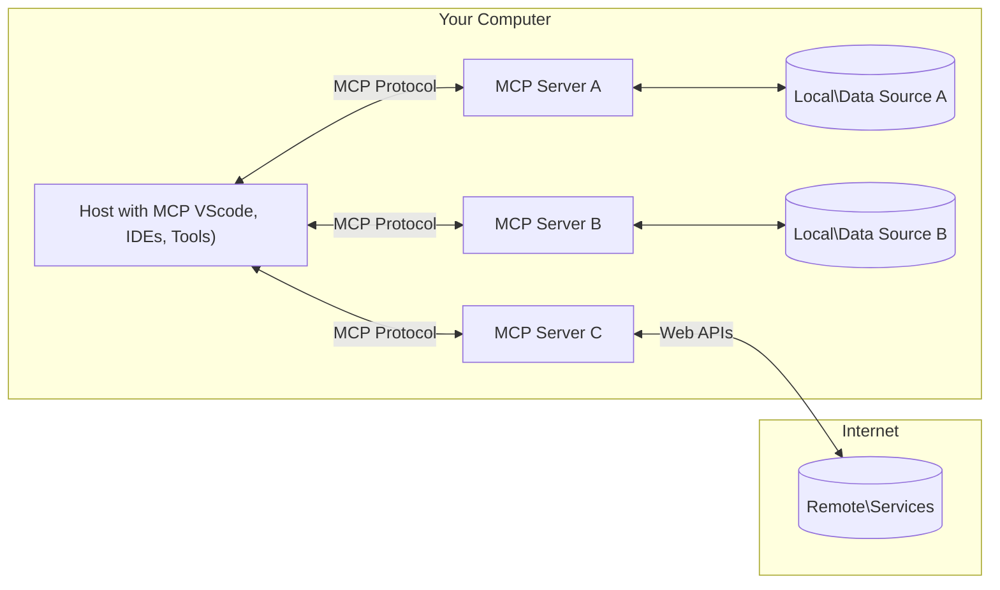

<!--
CO_OP_TRANSLATOR_METADATA:
{
  "original_hash": "b3b4a6ad10c3c0edbf7fa7cfa0ec496b",
  "translation_date": "2025-07-02T07:21:55+00:00",
  "source_file": "01-CoreConcepts/README.md",
  "language_code": "nl"
}
-->
# 📖 MCP Kernconcepten: Beheersing van het Model Context Protocol voor AI-integratie

Het [Model Context Protocol (MCP)](https://github.com/modelcontextprotocol) is een krachtig, gestandaardiseerd raamwerk dat de communicatie tussen Large Language Models (LLM's) en externe tools, applicaties en databronnen optimaliseert. Deze SEO-geoptimaliseerde gids neemt je mee door de kernconcepten van MCP, zodat je het client-servermodel, de essentiële componenten, communicatiemechanismen en implementatiebest practices begrijpt.

## Overzicht

Deze les behandelt de fundamentele architectuur en componenten die het Model Context Protocol (MCP) ecosysteem vormen. Je leert over de client-serverarchitectuur, de belangrijkste onderdelen en de communicatiemechanismen die MCP-interacties mogelijk maken.

## 👩‍🎓 Belangrijkste Leerdoelen

Aan het einde van deze les:

- Begrijp je de MCP client-serverarchitectuur.
- Kun je de rollen en verantwoordelijkheden van Hosts, Clients en Servers benoemen.
- Analyseer je de kernfuncties die MCP tot een flexibele integratielaag maken.
- Leer je hoe informatie binnen het MCP-ecosysteem stroomt.
- Krijg je praktische inzichten via codevoorbeelden in .NET, Java, Python en JavaScript.

## 🔎 MCP Architectuur: Een Diepere Kijk

Het MCP-ecosysteem is opgebouwd volgens een client-servermodel. Deze modulaire structuur stelt AI-toepassingen in staat efficiënt te communiceren met tools, databases, API’s en contextuele bronnen. Laten we deze architectuur opdelen in de kerncomponenten.

In de kern volgt MCP een client-serverarchitectuur waarbij een hostapplicatie verbinding kan maken met meerdere servers:



- **MCP Hosts**: Programma’s zoals VSCode, Claude Desktop, IDE’s of AI-tools die via MCP toegang willen tot data
- **MCP Clients**: Protocolclients die 1-op-1 verbindingen met servers onderhouden
- **MCP Servers**: Lichtgewicht programma’s die elk specifieke functionaliteiten aanbieden via het gestandaardiseerde Model Context Protocol
- **Lokale Databronnen**: Bestanden, databases en services op je computer die MCP-servers veilig kunnen benaderen
- **Externe Services**: Externe systemen die via internet beschikbaar zijn en waarmee MCP-servers via API’s kunnen communiceren.

Het MCP-protocol is een evoluerende standaard; de laatste updates vind je in de [protocolspecificatie](https://modelcontextprotocol.io/specification/2025-06-18/)

### 1. Hosts

In het Model Context Protocol (MCP) spelen Hosts een cruciale rol als de primaire interface waarmee gebruikers het protocol gebruiken. Hosts zijn applicaties of omgevingen die verbindingen initiëren met MCP-servers om toegang te krijgen tot data, tools en prompts. Voorbeelden van Hosts zijn geïntegreerde ontwikkelomgevingen (IDE’s) zoals Visual Studio Code, AI-tools zoals Claude Desktop, of op maat gemaakte agents voor specifieke taken.

**Hosts** zijn LLM-applicaties die verbindingen starten. Ze:

- Voeren AI-modellen uit of communiceren ermee om antwoorden te genereren.
- Initiëren verbindingen met MCP-servers.
- Beheren het gesprek en de gebruikersinterface.
- Controleren permissies en beveiligingsinstellingen.
- Regelen gebruikersconsent voor het delen van data en het uitvoeren van tools.

### 2. Clients

Clients zijn essentiële componenten die de interactie tussen Hosts en MCP-servers faciliteren. Clients fungeren als tussenpersonen, waardoor Hosts gebruik kunnen maken van de functionaliteiten die MCP-servers bieden. Ze zorgen voor soepele communicatie en efficiënte data-uitwisseling binnen de MCP-architectuur.

**Clients** zijn connectors binnen de hostapplicatie. Ze:

- Versturen verzoeken naar servers met prompts/instructies.
- Onderhandelen over mogelijkheden met servers.
- Beheren tool-uitvoeringsverzoeken vanuit modellen.
- Verwerken en tonen reacties aan gebruikers.

### 3. Servers

Servers zijn verantwoordelijk voor het afhandelen van verzoeken van MCP-clients en het leveren van passende antwoorden. Ze beheren diverse operaties zoals het ophalen van data, uitvoeren van tools en genereren van prompts. Servers zorgen ervoor dat de communicatie tussen clients en Hosts efficiënt en betrouwbaar verloopt, waarbij de integriteit van het interactieproces behouden blijft.

**Servers** zijn services die context en mogelijkheden bieden. Ze:

- Registreren beschikbare functies (resources, prompts, tools)
- Ontvangen en voeren tool-aanroepen van de client uit
- Bieden contextuele informatie om modelantwoorden te verbeteren
- Geven output terug aan de client
- Behouden status over meerdere interacties indien nodig

Servers kunnen door iedereen worden ontwikkeld om modelmogelijkheden uit te breiden met gespecialiseerde functionaliteit.

### 4. Serverfuncties

Servers binnen het Model Context Protocol (MCP) bieden fundamentele bouwstenen die rijke interacties tussen clients, hosts en taalmodellen mogelijk maken. Deze functies zijn ontworpen om de mogelijkheden van MCP te vergroten door gestructureerde context, tools en prompts aan te bieden.

MCP-servers kunnen een of meerdere van de volgende functies bieden:

#### 📑 Resources

Resources binnen het Model Context Protocol (MCP) omvatten verschillende soorten context en data die gebruikers of AI-modellen kunnen gebruiken. Dit zijn onder andere:

- **Contextuele Data**: Informatie en context die gebruikers of AI-modellen kunnen inzetten voor besluitvorming en taakuitvoering.
- **Kennisbanken en Documentenrepositories**: Verzamelingen gestructureerde en ongestructureerde data, zoals artikelen, handleidingen en onderzoeksrapporten, die waardevolle inzichten bieden.
- **Lokale Bestanden en Databases**: Data die lokaal op apparaten of in databases is opgeslagen en toegankelijk is voor verwerking en analyse.
- **API’s en Webservices**: Externe interfaces en services die extra data en functionaliteiten leveren, waardoor integratie met diverse online bronnen en tools mogelijk is.

Een voorbeeld van een resource kan een databaseschema of een bestand zijn dat als volgt kan worden benaderd:

```text
file://log.txt
database://schema
```

### 🤖 Prompts

Prompts binnen het Model Context Protocol (MCP) omvatten diverse vooraf gedefinieerde sjablonen en interactiepatronen die gebruikersworkflows stroomlijnen en communicatie verbeteren. Dit zijn onder andere:

- **Vooraf opgestelde Berichten en Workflows**: Gestructureerde berichten en processen die gebruikers door specifieke taken en interacties leiden.
- **Vooraf gedefinieerde Interactiepatronen**: Gestandaardiseerde reeksen acties en reacties die consistente en efficiënte communicatie bevorderen.
- **Gespecialiseerde Gesprekssjablonen**: Aanpasbare sjablonen voor specifieke gesprekstypen, die zorgen voor relevante en contextueel passende interacties.

Een prompt-sjabloon kan er als volgt uitzien:

```markdown
Generate a product slogan based on the following {{product}} with the following {{keywords}}
```

#### ⛏️ Tools

Tools binnen het Model Context Protocol (MCP) zijn functies die het AI-model kan uitvoeren om specifieke taken te voltooien. Deze tools zijn ontworpen om de mogelijkheden van het AI-model te vergroten door gestructureerde en betrouwbare operaties aan te bieden. Belangrijke aspecten zijn:

- **Functies die het AI-model kan uitvoeren**: Tools zijn uitvoerbare functies die het AI-model kan aanroepen om diverse taken uit te voeren.
- **Unieke Naam en Beschrijving**: Elke tool heeft een onderscheidende naam en een gedetailleerde beschrijving die het doel en de functionaliteit uitlegt.
- **Parameters en Outputs**: Tools accepteren specifieke parameters en geven gestructureerde output terug, wat zorgt voor consistente en voorspelbare resultaten.
- **Discrete Functies**: Tools voeren afzonderlijke functies uit zoals webzoekopdrachten, berekeningen en databasequeries.

Een voorbeeldtool kan er als volgt uitzien:

```typescript
server.tool(
  "GetProducts",
  {
    pageSize: z.string().optional(),
    pageCount: z.string().optional()
  }, () => {
    // return results from API
  }
)
```

## Clientfuncties

Binnen het Model Context Protocol (MCP) bieden clients diverse belangrijke functies aan servers, waarmee de functionaliteit en interactie binnen het protocol worden verbeterd. Een opvallende functie is Sampling.

### 👉 Sampling

- **Server-geïnitieerde Agentgedragingen**: Clients maken het mogelijk dat servers specifieke acties of gedragingen autonoom kunnen starten, wat de dynamische mogelijkheden van het systeem vergroot.
- **Recursieve LLM-interacties**: Deze functie maakt recursieve interacties met grote taalmodellen (LLM's) mogelijk, waardoor complexere en iteratieve taakverwerking mogelijk wordt.
- **Aanvragen van Extra Modelcompleties**: Servers kunnen extra antwoorden van het model opvragen, zodat de reacties grondig en contextueel relevant zijn.

## Informatiestroom in MCP

Het Model Context Protocol (MCP) definieert een gestructureerde informatiestroom tussen hosts, clients, servers en modellen. Het begrijpen van deze stroom verduidelijkt hoe gebruikersverzoeken worden verwerkt en hoe externe tools en data in modelantwoorden worden geïntegreerd.

- **Host Initieert Verbinding**  
  De hostapplicatie (zoals een IDE of chatinterface) maakt verbinding met een MCP-server, meestal via STDIO, WebSocket of een ander ondersteund transport.

- **Mogelijkheden Onderhandelen**  
  De client (ingebed in de host) en de server wisselen informatie uit over hun ondersteunde functies, tools, resources en protocolversies. Dit zorgt ervoor dat beide partijen begrijpen welke mogelijkheden beschikbaar zijn voor de sessie.

- **Gebruikersverzoek**  
  De gebruiker communiceert met de host (bijvoorbeeld door een prompt of commando in te voeren). De host verzamelt deze input en geeft deze door aan de client voor verwerking.

- **Gebruik van Resource of Tool**  
  - De client kan aanvullende context of resources opvragen bij de server (zoals bestanden, database-items of kennisbankartikelen) om het begrip van het model te verrijken.
  - Als het model bepaalt dat een tool nodig is (bijvoorbeeld om data op te halen, een berekening uit te voeren of een API aan te roepen), stuurt de client een tool-aanroepverzoek naar de server, inclusief de toolnaam en parameters.

- **Serveruitvoering**  
  De server ontvangt het resource- of toolverzoek, voert de benodigde handelingen uit (zoals het draaien van een functie, queryen van een database of ophalen van een bestand) en stuurt de resultaten gestructureerd terug naar de client.

- **Genereren van Antwoord**  
  De client verwerkt de antwoorden van de server (resourcegegevens, toolresultaten, enz.) in de lopende modelinteractie. Het model gebruikt deze informatie om een volledig en contextueel relevant antwoord te genereren.

- **Resultaat Presentatie**  
  De host ontvangt de uiteindelijke output van de client en toont deze aan de gebruiker, vaak inclusief zowel de door het model gegenereerde tekst als eventuele resultaten van tooluitvoeringen of resource-opvragingen.

Deze stroom stelt MCP in staat geavanceerde, interactieve en contextbewuste AI-toepassingen te ondersteunen door modellen naadloos te verbinden met externe tools en databronnen.

## Protocoldetails

MCP (Model Context Protocol) is gebouwd bovenop [JSON-RPC 2.0](https://www.jsonrpc.org/), en biedt een gestandaardiseerd, taalagnostisch berichtformaat voor communicatie tussen hosts, clients en servers. Deze basis maakt betrouwbare, gestructureerde en uitbreidbare interacties mogelijk over diverse platforms en programmeertalen.

### Belangrijke Protocolfuncties

MCP breidt JSON-RPC 2.0 uit met aanvullende conventies voor tool-aanroepen, resource-toegang en promptbeheer. Het ondersteunt meerdere transportlagen (STDIO, WebSocket, SSE) en maakt veilige, uitbreidbare en taalagnostische communicatie tussen componenten mogelijk.

#### 🧢 Basisprotocol

- **JSON-RPC Berichtformaat**: Alle verzoeken en antwoorden gebruiken de JSON-RPC 2.0-specificatie, wat zorgt voor een consistente structuur voor method-aanroepen, parameters, resultaten en foutafhandeling.
- **Stateful Verbindingen**: MCP-sessies behouden status over meerdere verzoeken, wat gesprekken, contextopbouw en resourcebeheer ondersteunt.
- **Mogelijkheden Onderhandelen**: Tijdens het opzetten van de verbinding wisselen clients en servers informatie uit over ondersteunde functies, protocolversies, beschikbare tools en resources. Dit zorgt dat beide partijen elkaars mogelijkheden begrijpen en zich kunnen aanpassen.

#### ➕ Extra Hulpmiddelen

Hieronder enkele aanvullende hulpmiddelen en protocoluitbreidingen die MCP biedt om de ontwikkelaarservaring te verbeteren en geavanceerde scenario’s mogelijk te maken:

- **Configuratie-opties**: MCP maakt dynamische configuratie van sessieparameters mogelijk, zoals toolpermissies, resource-toegang en modelinstellingen, afgestemd op elke interactie.
- **Voortgangsbewaking**: Langdurige operaties kunnen voortgangsupdates rapporteren, wat responsieve gebruikersinterfaces en betere gebruikerservaring bij complexe taken mogelijk maakt.
- **Annuleren van Verzoeken**: Clients kunnen lopende verzoeken annuleren, zodat gebruikers operaties kunnen onderbreken die niet meer nodig zijn of te lang duren.
- **Foutmelding**: Gestandaardiseerde foutberichten en codes helpen bij het diagnosticeren van problemen, het netjes afhandelen van fouten en het geven van bruikbare feedback aan gebruikers en ontwikkelaars.
- **Logging**: Zowel clients als servers kunnen gestructureerde logs uitsturen voor audit, debugging en monitoring van protocolinteracties.

Door gebruik te maken van deze protocolfuncties zorgt MCP voor robuuste, veilige en flexibele communicatie tussen taalmodellen en externe tools of databronnen.

### 🔐 Beveiligingsoverwegingen

MCP-implementaties dienen een aantal belangrijke beveiligingsprincipes te volgen om veilige en betrouwbare interacties te garanderen:

- **Gebruikersconsent en Controle**: Gebruikers moeten expliciete toestemming geven voordat data wordt benaderd of operaties worden uitgevoerd. Ze moeten duidelijk kunnen bepalen welke data wordt gedeeld en welke acties zijn toegestaan, ondersteund door intuïtieve gebruikersinterfaces voor het beoordelen en goedkeuren van activiteiten.

- **Dataprivacy**: Gebruikersdata mag alleen met expliciete toestemming worden blootgesteld en moet worden beschermd met passende toegangscontroles. MCP-implementaties moeten ongeautoriseerde datatransmissie voorkomen en ervoor zorgen dat privacy tijdens alle interacties wordt gewaarborgd.

- **Toolveiligheid**: Voordat een tool wordt aangeroepen is expliciete toestemming van de gebruiker vereist. Gebruikers moeten duidelijk begrijpen wat elke tool doet, en er moeten robuuste beveiligingsgrenzen zijn om onbedoelde of onveilige uitvoering van tools te voorkomen.

Door deze principes te volgen, zorgt MCP ervoor dat gebruikersvertrouwen, privacy en veiligheid tijdens alle protocolinteracties worden gewaarborgd.

## Codevoorbeelden: Belangrijke Componenten

Hieronder vind je codevoorbeelden in verschillende populaire programmeertalen die laten zien hoe je belangrijke MCP-servercomponenten en tools kunt implementeren.

### .NET Voorbeeld: Een Eenvoudige MCP Server met Tools

Een praktisch .NET-codevoorbeeld waarin wordt getoond hoe je een eenvoudige MCP-server met aangepaste tools implementeert. Dit voorbeeld laat zien hoe je tools definieert en registreert, verzoeken afhandelt en de server verbindt via het Model Context Protocol.

```csharp
using System;
using System.Threading.Tasks;
using ModelContextProtocol.Server;
using ModelContextProtocol.Server.Transport;
using ModelContextProtocol.Server.Tools;

public class WeatherServer
{
    public static async Task Main(string[] args)
    {
        // Create an MCP server
        var server = new McpServer(
            name: "Weather MCP Server",
            version: "1.0.0"
        );
        
        // Register our custom weather tool
        server.AddTool<string, WeatherData>("weatherTool", 
            description: "Gets current weather for a location",
            execute: async (location) => {
                // Call weather API (simplified)
                var weatherData = await GetWeatherDataAsync(location);
                return weatherData;
            });
        
        // Connect the server using stdio transport
        var transport = new StdioServerTransport();
        await server.ConnectAsync(transport);
        
        Console.WriteLine("Weather MCP Server started");
        
        // Keep the server running until process is terminated
        await Task.Delay(-1);
    }
    
    private static async Task<WeatherData> GetWeatherDataAsync(string location)
    {
        // This would normally call a weather API
        // Simplified for demonstration
        await Task.Delay(100); // Simulate API call
        return new WeatherData { 
            Temperature = 72.5,
            Conditions = "Sunny",
            Location = location
        };
    }
}

public class WeatherData
{
    public double Temperature { get; set; }
    public string Conditions { get; set; }
    public string Location { get; set; }
}
```

### Java Voorbeeld: MCP Servercomponenten

Dit voorbeeld toont dezelfde MCP-server en toolregistratie als het .NET-voorbeeld hierboven, maar dan geïmplementeerd in Java.

```java
import io.modelcontextprotocol.server.McpServer;
import io.modelcontextprotocol.server.McpToolDefinition;
import io.modelcontextprotocol.server.transport.StdioServerTransport;
import io.modelcontextprotocol.server.tool.ToolExecutionContext;
import io.modelcontextprotocol.server.tool.ToolResponse;

public class WeatherMcpServer {
    public static void main(String[] args) throws Exception {
        // Create an MCP server
        McpServer server = McpServer.builder()
            .name("Weather MCP Server")
            .version("1.0.0")
            .build();
            
        // Register a weather tool
        server.registerTool(McpToolDefinition.builder("weatherTool")
            .description("Gets current weather for a location")
            .parameter("location", String.class)
            .execute((ToolExecutionContext ctx) -> {
                String location = ctx.getParameter("location", String.class);
                
                // Get weather data (simplified)
                WeatherData data = getWeatherData(location);
                
                // Return formatted response
                return ToolResponse.content(
                    String.format("Temperature: %.1f°F, Conditions: %s, Location: %s", 
                    data.getTemperature(), 
                    data.getConditions(), 
                    data.getLocation())
                );
            })
            .build());
        
        // Connect the server using stdio transport
        try (StdioServerTransport transport = new StdioServerTransport()) {
            server.connect(transport);
            System.out.println("Weather MCP Server started");
            // Keep server running until process is terminated
            Thread.currentThread().join();
        }
    }
    
    private static WeatherData getWeatherData(String location) {
        // Implementation would call a weather API
        // Simplified for example purposes
        return new WeatherData(72.5, "Sunny", location);
    }
}

class WeatherData {
    private double temperature;
    private String conditions;
    private String location;
    
    public WeatherData(double temperature, String conditions, String location) {
        this.temperature = temperature;
        this.conditions = conditions;
        this.location = location;
    }
    
    public double getTemperature() {
        return temperature;
    }
    
    public String getConditions() {
        return conditions;
    }
    
    public String getLocation() {
        return location;
    }
}
```

### Python Voorbeeld: Een MCP Server Bouwen

In dit voorbeeld laten we zien hoe je een MCP-server bouwt in Python. Ook worden twee verschillende manieren getoond om tools te maken.

```python
#!/usr/bin/env python3
import asyncio
from mcp.server.fastmcp import FastMCP
from mcp.server.transports.stdio import serve_stdio

# Create a FastMCP server
mcp = FastMCP(
    name="Weather MCP Server",
    version="1.0.0"
)

@mcp.tool()
def get_weather(location: str) -> dict:
    """Gets current weather for a location."""
    # This would normally call a weather API
    # Simplified for demonstration
    return {
        "temperature": 72.5,
        "conditions": "Sunny",
        "location": location
    }

# Alternative approach using a class
class WeatherTools:
    @mcp.tool()
    def forecast(self, location: str, days: int = 1) -> dict:
        """Gets weather forecast for a location for the specified number of days."""
        # This would normally call a weather API forecast endpoint
        # Simplified for demonstration
        return {
            "location": location,
            "forecast": [
                {"day": i+1, "temperature": 70 + i, "conditions": "Partly Cloudy"}
                for i in range(days)
            ]
        }

# Instantiate the class to register its tools
weather_tools = WeatherTools()

# Start the server using stdio transport
if __name__ == "__main__":
    asyncio.run(serve_stdio(mcp))
```

### JavaScript Voorbeeld: Een MCP Server Maken

Dit voorbeeld laat zien hoe je een MCP-server maakt in JavaScript en hoe je twee weergerelateerde tools registreert.

```javascript
// Using the official Model Context Protocol SDK
import { McpServer } from "@modelcontextprotocol/sdk/server/mcp.js";
import { StdioServerTransport } from "@modelcontextprotocol/sdk/server/stdio.js";
import { z } from "zod"; // For parameter validation

// Create an MCP server
const server = new McpServer({
  name: "Weather MCP Server",
  version: "1.0.0"
});

// Define a weather tool
server.tool(
  "weatherTool",
  {
    location: z.string().describe("The location to get weather for")
  },
  async ({ location }) => {
    // This would normally call a weather API
    // Simplified for demonstration
    const weatherData = await getWeatherData(location);
    
    return {
      content: [
        { 
          type: "text", 
          text: `Temperature: ${weatherData.temperature}°F, Conditions: ${weatherData.conditions}, Location: ${weatherData.location}` 
        }
      ]
    };
  }
);

// Define a forecast tool
server.tool(
  "forecastTool",
  {
    location: z.string(),
    days: z.number().default(3).describe("Number of days for forecast")
  },
  async ({ location, days }) => {
    // This would normally call a weather API
    // Simplified for demonstration
    const forecast = await getForecastData(location, days);
    
    return {
      content: [
        { 
          type: "text", 
          text: `${days}-day forecast for ${location}: ${JSON.stringify(forecast)}` 
        }
      ]
    };
  }
);

// Helper functions
async function getWeatherData(location) {
  // Simulate API call
  return {
    temperature: 72.5,
    conditions: "Sunny",
    location: location
  };
}

async function getForecastData(location, days) {
  // Simulate API call
  return Array.from({ length: days }, (_, i) => ({
    day: i + 1,
    temperature: 70 + Math.floor(Math.random() * 10),
    conditions: i % 2 === 0 ? "Sunny" : "Partly Cloudy"
  }));
}

// Connect the server using stdio transport
const transport = new StdioServerTransport();
server.connect(transport).catch(console.error);

console.log("Weather MCP Server started");
```

Dit JavaScript-voorbeeld toont hoe je een MCP-client maakt die verbinding maakt met een server, een prompt verstuurt en het antwoord verwerkt, inclusief eventuele uitgevoerde tool-aanroepen.

## Beveiliging en Autorisatie

MCP bevat diverse ingebouwde concepten en mechanismen voor het beheren van beveiliging en autorisatie binnen het protocol:

1. **Tooltoestemmingscontrole**  
  Clients kunnen specificeren welke tools een model tijdens een sessie mag gebruiken. Dit zorgt ervoor dat alleen expliciet geautoriseerde tools toegankelijk zijn, wat het risico op onbedoelde of onveilige handelingen vermindert. Permissies kunnen dynamisch worden ingesteld op basis van gebruikersvoorkeuren, organisatiebeleid of de context van de interactie.

2. **Authenticatie**  
  Servers kunnen authenticatie vereisen voordat toegang wordt verleend tot tools, resources of gevoelige operaties. Dit kan via API-sleutels, OAuth-tokens of andere authenticatieschema’s. Goede authenticatie zorgt ervoor dat alleen vertrouwde clients en gebruikers serverfunctionaliteiten kunnen aanroepen.

3. **Validatie**  
  Parametervalidatie wordt afgedwongen bij alle tool-aanroepen. Elke tool definieert de verwachte typen, formaten en beperkingen van zijn parameters, en de server valideert inkomende verzoeken hierop. Dit voorkomt dat verkeerd gevormde of kwaadaardige input de toolimplementaties bereikt en helpt de integriteit van operaties te waarborgen.

4. **Rate Limiting**  
  Om misbruik te voorkomen en eerlijk gebruik van serverbronnen te garanderen, kunnen MCP-servers rate limiting toepassen op tool-aanroepen en resource-toegang. Limieten kunnen per gebruiker, sessie of globaal worden ingesteld en helpen aanvallen zoals denial-of-service of overmatig resourcegebruik te voorkomen.

Door deze mechanismen te combineren biedt MCP een veilige basis voor het integreren van taalmodellen met externe tools en databronnen, terwijl gebruikers en ontwikkelaars fijne controle krijgen over toegang en gebruik.

## Protocolberichten

MCP-communicatie maakt gebruik van gestructureerde JSON-berichten om duidelijke en betrouwbare interacties tussen clients, servers en modellen te faciliteren. De belangrijkste berichttypen zijn:

- **Clientverzoek**  
  Verstuurt de client naar de server en bevat meestal:
  - De prompt of het commando van de gebruiker
  - Gespreksgeschiedenis voor context
  - Toolconfiguratie en permissies
  - Eventuele aanvullende metadata of sessie-informatie

- **Modelantwoord**  
  Wordt door het model (via de client) teruggegeven en bevat:
  - Gegeneerde tekst of voltooiing op basis van prompt en context
  - Optionele tool-aanwijzingen als het model bepaalt dat een tool moet worden aangeroepen
  - Verwijzingen naar resources of extra context indien nodig

- **Toolverzoek**  
  Verstuurt de client naar de server wanneer een tool uitgevoerd moet worden. Dit bericht bevat:
  - De naam van de aan te roepen tool
  - Parameters die de tool nodig heeft (gevalideerd aan de hand van het toolschema)
  - Contextuele informatie of identificatoren voor het volgen van het verzoek

- **Toolantwoord**  
  Wordt door de server teruggegeven na het uitvoeren van een tool. Dit bericht bevat:
  - De resultaten van de tooluitvoering (

**Disclaimer**:  
Dit document is vertaald met behulp van de AI-vertalingsdienst [Co-op Translator](https://github.com/Azure/co-op-translator). Hoewel we streven naar nauwkeurigheid, dient u er rekening mee te houden dat geautomatiseerde vertalingen fouten of onnauwkeurigheden kunnen bevatten. Het oorspronkelijke document in de oorspronkelijke taal moet worden beschouwd als de gezaghebbende bron. Voor cruciale informatie wordt professionele menselijke vertaling aanbevolen. Wij zijn niet aansprakelijk voor eventuele misverstanden of verkeerde interpretaties die voortvloeien uit het gebruik van deze vertaling.