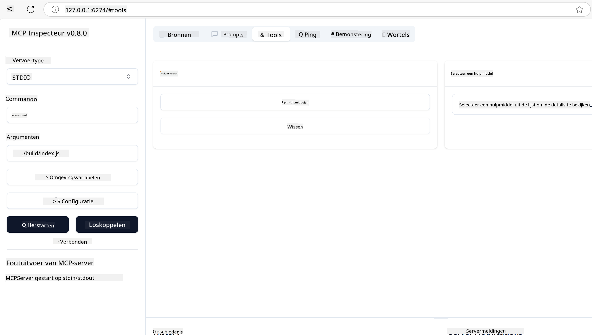
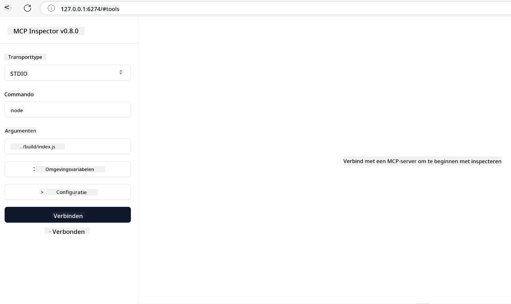
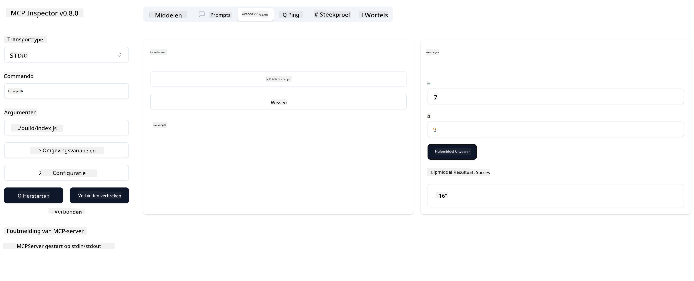

<!--
CO_OP_TRANSLATOR_METADATA:
{
  "original_hash": "5331ffd328a54b90f76706c52b673e27",
  "translation_date": "2025-05-17T08:43:10+00:00",
  "source_file": "03-GettingStarted/01-first-server/README.md",
  "language_code": "nl"
}
-->
# Aan de slag met MCP

Welkom bij je eerste stappen met het Model Context Protocol (MCP)! Of je nu nieuw bent met MCP of je kennis wilt verdiepen, deze gids leidt je door het essentiële installatie- en ontwikkelingsproces. Je ontdekt hoe MCP naadloze integratie tussen AI-modellen en applicaties mogelijk maakt, en leert hoe je snel je omgeving kunt klaarmaken voor het bouwen en testen van MCP-oplossingen.

> TLDR; Als je AI-apps bouwt, weet je dat je tools en andere bronnen kunt toevoegen aan je LLM (groot taalmodel), om het LLM meer kennis te geven. Maar als je die tools en bronnen op een server plaatst, kunnen de app en de servermogelijkheden door elke client met/zonder een LLM worden gebruikt.

## Overzicht

Deze les biedt praktische begeleiding bij het opzetten van MCP-omgevingen en het bouwen van je eerste MCP-applicaties. Je leert hoe je de benodigde tools en frameworks instelt, basis MCP-servers bouwt, hostapplicaties creëert en je implementaties test.

Het Model Context Protocol (MCP) is een open protocol dat standaardiseert hoe applicaties context aan LLMs bieden. Denk aan MCP als een USB-C-poort voor AI-applicaties - het biedt een gestandaardiseerde manier om AI-modellen te verbinden met verschillende gegevensbronnen en tools.

## Leerdoelen

Aan het einde van deze les kun je:

- Ontwikkelomgevingen voor MCP opzetten in C#, Java, Python, TypeScript en JavaScript
- Basis MCP-servers bouwen en implementeren met aangepaste functies (bronnen, prompts en tools)
- Hostapplicaties maken die verbinding maken met MCP-servers
- MCP-implementaties testen en debuggen

## Je MCP-omgeving opzetten

Voordat je begint met MCP, is het belangrijk om je ontwikkelomgeving voor te bereiden en de basisworkflow te begrijpen. Deze sectie begeleidt je door de initiële opzetstappen om een soepele start met MCP te garanderen.

### Vereisten

Voordat je in MCP-ontwikkeling duikt, zorg ervoor dat je:

- **Ontwikkelomgeving**: Voor je gekozen taal (C#, Java, Python, TypeScript of JavaScript)
- **IDE/Editor**: Visual Studio, Visual Studio Code, IntelliJ, Eclipse, PyCharm of een moderne code-editor
- **Pakketbeheerders**: NuGet, Maven/Gradle, pip of npm/yarn
- **API-sleutels**: Voor alle AI-diensten die je van plan bent te gebruiken in je hostapplicaties

## Basisstructuur van een MCP-server

Een MCP-server bevat doorgaans:

- **Serverconfiguratie**: Poortinstelling, authenticatie en andere instellingen
- **Bronnen**: Gegevens en context beschikbaar gesteld aan LLMs
- **Tools**: Functionaliteit die modellen kunnen aanroepen
- **Prompts**: Sjablonen voor het genereren of structureren van tekst

Hier is een vereenvoudigd voorbeeld in TypeScript:

```typescript
import { Server, Tool, Resource } from "@modelcontextprotocol/typescript-server-sdk";

// Create a new MCP server
const server = new Server({
  port: 3000,
  name: "Example MCP Server",
  version: "1.0.0"
});

// Register a tool
server.registerTool({
  name: "calculator",
  description: "Performs basic calculations",
  parameters: {
    expression: {
      type: "string",
      description: "The math expression to evaluate"
    }
  },
  handler: async (params) => {
    const result = eval(params.expression);
    return { result };
  }
});

// Start the server
server.start();
```

In de bovenstaande code:

- Importeer de benodigde klassen uit de MCP TypeScript SDK.
- Maak en configureer een nieuwe MCP-serverinstantie.
- Registreer een aangepaste tool (`calculator`) met een handlerfunctie.
- Start de server om te luisteren naar inkomende MCP-verzoeken.

## Testen en Debuggen

Voordat je je MCP-server gaat testen, is het belangrijk om de beschikbare tools en best practices voor debugging te begrijpen. Effectief testen zorgt ervoor dat je server zich gedraagt zoals verwacht en helpt je snel problemen te identificeren en op te lossen. De volgende sectie schetst aanbevolen benaderingen voor het valideren van je MCP-implementatie.

MCP biedt tools om je te helpen je servers te testen en te debuggen:

- **Inspectortool**, deze grafische interface stelt je in staat om verbinding te maken met je server en je tools, prompts en bronnen te testen.
- **curl**, je kunt ook verbinding maken met je server met behulp van een opdrachtregeltool zoals curl of andere clients die HTTP-commando's kunnen maken en uitvoeren.

### Het gebruik van MCP Inspector

De [MCP Inspector](https://github.com/modelcontextprotocol/inspector) is een visuele testtool die je helpt:

1. **Servermogelijkheden ontdekken**: Automatisch beschikbare bronnen, tools en prompts detecteren
2. **Test Tool Uitvoering**: Probeer verschillende parameters en zie realtime reacties
3. **Servermetadata bekijken**: Onderzoek serverinfo, schema's en configuraties

```bash
# ex TypeScript, installing and running MCP Inspector
npx @modelcontextprotocol/inspector node build/index.js
```

Wanneer je de bovenstaande commando's uitvoert, zal de MCP Inspector een lokale webinterface in je browser openen. Je kunt verwachten een dashboard te zien met je geregistreerde MCP-servers, hun beschikbare tools, bronnen en prompts. De interface stelt je in staat om interactief tooluitvoering te testen, servermetadata te inspecteren en realtime reacties te bekijken, wat het gemakkelijker maakt om je MCP-serverimplementaties te valideren en te debuggen.

Hier is een screenshot van hoe het eruit kan zien:



## Veelvoorkomende installatieproblemen en oplossingen

| Probleem | Mogelijke Oplossing |
|-------|-------------------|
| Verbinding geweigerd | Controleer of de server draait en de poort correct is |
| Fouten bij tooluitvoering | Controleer parameter validatie en foutafhandeling |
| Authenticatiefouten | Verifieer API-sleutels en machtigingen |
| Fouten bij schemavalidatie | Zorg ervoor dat parameters overeenkomen met het gedefinieerde schema |
| Server start niet | Controleer op poortconflicten of ontbrekende afhankelijkheden |
| CORS-fouten | Configureer juiste CORS-headers voor cross-origin aanvragen |
| Authenticatieproblemen | Verifieer token geldigheid en machtigingen |

## Lokale Ontwikkeling

Voor lokale ontwikkeling en testen kun je MCP-servers direct op je machine draaien:

1. **Start het serverproces**: Voer je MCP-serverapplicatie uit
2. **Netwerkconfiguratie**: Zorg ervoor dat de server toegankelijk is op de verwachte poort
3. **Verbind clients**: Gebruik lokale verbindings-URL's zoals `http://localhost:3000`

```bash
# Example: Running a TypeScript MCP server locally
npm run start
# Server running at http://localhost:3000
```

## Je eerste MCP-server bouwen

We hebben [Kernconcepten](/01-CoreConcepts/README.md) behandeld in een vorige les, nu is het tijd om die kennis in de praktijk te brengen.

### Wat een server kan doen

Voordat we code gaan schrijven, laten we onszelf herinneren wat een server kan doen:

Een MCP-server kan bijvoorbeeld:

- Toegang hebben tot lokale bestanden en databases
- Verbinden met externe API's
- Berekeningen uitvoeren
- Integreren met andere tools en diensten
- Een gebruikersinterface bieden voor interactie

Geweldig, nu we weten wat we ervoor kunnen doen, laten we beginnen met coderen.

## Oefening: Een server maken

Om een server te maken, moet je de volgende stappen volgen:

- Installeer de MCP SDK.
- Maak een project en stel de projectstructuur in.
- Schrijf de servercode.
- Test de server.

### -1- Installeer de SDK

Dit verschilt een beetje afhankelijk van je gekozen runtime, dus kies een van de onderstaande runtimes:

Generatieve AI kan tekst, afbeeldingen en zelfs code genereren.

### -2- Maak een project

Nu je SDK is geïnstalleerd, laten we een project maken:

### -3- Maak projectbestanden

### -4- Maak servercode

### -5- Een tool en een bron toevoegen

Voeg een tool en een bron toe door de volgende code toe te voegen:

### -6- Finale code

Laten we de laatste code toevoegen die we nodig hebben zodat de server kan starten:

### -7- Test de server

Start de server met het volgende commando:

### -8- Run met de inspector

De inspector is een geweldige tool die je server kan opstarten en je ermee laat communiceren zodat je kunt testen of het werkt. Laten we het opstarten:

> [!NOTE]
> het kan er anders uitzien in het "command" veld omdat het de opdracht bevat voor het uitvoeren van een server met je specifieke runtime

Je zou de volgende gebruikersinterface moeten zien:



1. Verbind met de server door op de Connect-knop te klikken. 
   Zodra je verbinding maakt met de server, zou je nu het volgende moeten zien:

   

1. Selecteer "Tools" en "listTools", je zou "Add" moeten zien verschijnen, selecteer "Add" en vul de parameterwaarden in.

   Je zou de volgende reactie moeten zien, d.w.z. een resultaat van de "add" tool:

   

Gefeliciteerd, je hebt je eerste server gemaakt en uitgevoerd!

### Officiële SDK's

MCP biedt officiële SDK's voor meerdere talen:
- [C# SDK](https://github.com/modelcontextprotocol/csharp-sdk) - Onderhouden in samenwerking met Microsoft
- [Java SDK](https://github.com/modelcontextprotocol/java-sdk) - Onderhouden in samenwerking met Spring AI
- [TypeScript SDK](https://github.com/modelcontextprotocol/typescript-sdk) - De officiële TypeScript-implementatie
- [Python SDK](https://github.com/modelcontextprotocol/python-sdk) - De officiële Python-implementatie
- [Kotlin SDK](https://github.com/modelcontextprotocol/kotlin-sdk) - De officiële Kotlin-implementatie
- [Swift SDK](https://github.com/modelcontextprotocol/swift-sdk) - Onderhouden in samenwerking met Loopwork AI
- [Rust SDK](https://github.com/modelcontextprotocol/rust-sdk) - De officiële Rust-implementatie

## Belangrijke punten

- Het opzetten van een MCP-ontwikkelomgeving is eenvoudig met taal specifieke SDK's
- Het bouwen van MCP-servers omvat het creëren en registreren van tools met duidelijke schema's
- Testen en debuggen zijn essentieel voor betrouwbare MCP-implementaties

## Voorbeelden

- [Java Calculator](../samples/java/calculator/README.md)
- [.Net Calculator](../../../../03-GettingStarted/samples/csharp)
- [JavaScript Calculator](../samples/javascript/README.md)
- [TypeScript Calculator](../samples/typescript/README.md)
- [Python Calculator](../../../../03-GettingStarted/samples/python)

## Opdracht

Maak een eenvoudige MCP-server met een tool naar keuze:
1. Implementeer de tool in je favoriete taal (.NET, Java, Python of JavaScript).
2. Definieer invoerparameters en retourwaarden.
3. Voer de inspectortool uit om ervoor te zorgen dat de server werkt zoals bedoeld.
4. Test de implementatie met verschillende invoer.

## Oplossing

[Oplossing](./solution/README.md)

## Aanvullende bronnen

- [MCP GitHub Repository](https://github.com/microsoft/mcp-for-beginners)

## Wat is de volgende stap

Volgende: [Aan de slag met MCP-clients](/03-GettingStarted/02-client/README.md)

**Disclaimer**:  
Dit document is vertaald met behulp van de AI-vertalingsdienst [Co-op Translator](https://github.com/Azure/co-op-translator). Hoewel we streven naar nauwkeurigheid, willen we u erop wijzen dat geautomatiseerde vertalingen fouten of onnauwkeurigheden kunnen bevatten. Het originele document in de oorspronkelijke taal moet als de gezaghebbende bron worden beschouwd. Voor kritieke informatie wordt professionele menselijke vertaling aanbevolen. Wij zijn niet aansprakelijk voor misverstanden of misinterpretaties die voortvloeien uit het gebruik van deze vertaling.