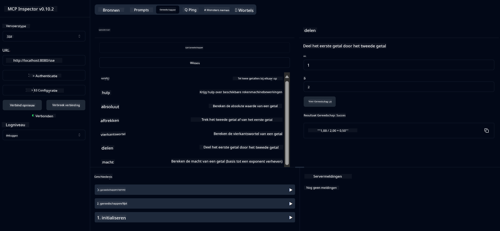

<!--
CO_OP_TRANSLATOR_METADATA:
{
  "original_hash": "ec11ee93f31fdadd94facd3e3d22f9e6",
  "translation_date": "2025-09-09T22:00:14+00:00",
  "source_file": "03-GettingStarted/01-first-server/README.md",
  "language_code": "nl"
}
-->
# Aan de slag met MCP

Welkom bij je eerste stappen met het Model Context Protocol (MCP)! Of je nu nieuw bent met MCP of je kennis wilt verdiepen, deze gids begeleidt je door het essentiële installatie- en ontwikkelproces. Je ontdekt hoe MCP naadloze integratie tussen AI-modellen en applicaties mogelijk maakt en leert hoe je snel je omgeving kunt voorbereiden om MCP-oplossingen te bouwen en testen.

> TLDR; Als je AI-apps bouwt, weet je dat je tools en andere bronnen kunt toevoegen aan je LLM (large language model) om de LLM slimmer te maken. Maar als je die tools en bronnen op een server plaatst, kunnen de app en de serverfunctionaliteiten door elke client worden gebruikt, met of zonder een LLM.

## Overzicht

Deze les biedt praktische richtlijnen voor het opzetten van MCP-omgevingen en het bouwen van je eerste MCP-applicaties. Je leert hoe je de benodigde tools en frameworks installeert, basis MCP-servers bouwt, hostapplicaties maakt en je implementaties test.

Het Model Context Protocol (MCP) is een open protocol dat standaardiseert hoe applicaties context bieden aan LLMs. Denk aan MCP als een USB-C-poort voor AI-applicaties - het biedt een gestandaardiseerde manier om AI-modellen te verbinden met verschillende databronnen en tools.

## Leerdoelen

Aan het einde van deze les kun je:

- Ontwikkelomgevingen instellen voor MCP in C#, Java, Python, TypeScript en Rust
- Basis MCP-servers bouwen en implementeren met aangepaste functies (bronnen, prompts en tools)
- Hostapplicaties maken die verbinding maken met MCP-servers
- MCP-implementaties testen en debuggen

## Je MCP-omgeving instellen

Voordat je begint met MCP, is het belangrijk om je ontwikkelomgeving voor te bereiden en de basisworkflow te begrijpen. Dit gedeelte begeleidt je door de eerste stappen van de installatie om een soepele start met MCP te garanderen.

### Vereisten

Voordat je begint met MCP-ontwikkeling, zorg ervoor dat je beschikt over:

- **Ontwikkelomgeving**: Voor je gekozen programmeertaal (C#, Java, Python, TypeScript of Rust)
- **IDE/Editor**: Visual Studio, Visual Studio Code, IntelliJ, Eclipse, PyCharm of een moderne code-editor
- **Pakketbeheerders**: NuGet, Maven/Gradle, pip, npm/yarn of Cargo
- **API-sleutels**: Voor AI-diensten die je in je hostapplicaties wilt gebruiken

## Basisstructuur van een MCP-server

Een MCP-server bevat doorgaans:

- **Serverconfiguratie**: Instellen van poort, authenticatie en andere instellingen
- **Bronnen**: Data en context beschikbaar gesteld aan LLMs
- **Tools**: Functionaliteit die modellen kunnen aanroepen
- **Prompts**: Sjablonen voor het genereren of structureren van tekst

Hier is een vereenvoudigd voorbeeld in TypeScript:

```typescript
import { McpServer, ResourceTemplate } from "@modelcontextprotocol/sdk/server/mcp.js";
import { StdioServerTransport } from "@modelcontextprotocol/sdk/server/stdio.js";
import { z } from "zod";

// Create an MCP server
const server = new McpServer({
  name: "Demo",
  version: "1.0.0"
});

// Add an addition tool
server.tool("add",
  { a: z.number(), b: z.number() },
  async ({ a, b }) => ({
    content: [{ type: "text", text: String(a + b) }]
  })
);

// Add a dynamic greeting resource
server.resource(
  "file",
  // The 'list' parameter controls how the resource lists available files. Setting it to undefined disables listing for this resource.
  new ResourceTemplate("file://{path}", { list: undefined }),
  async (uri, { path }) => ({
    contents: [{
      uri: uri.href,
      text: `File, ${path}!`
    }]
  })
);

// Add a file resource that reads the file contents
server.resource(
  "file",
  new ResourceTemplate("file://{path}", { list: undefined }),
  async (uri, { path }) => {
    let text;
    try {
      text = await fs.readFile(path, "utf8");
    } catch (err) {
      text = `Error reading file: ${err.message}`;
    }
    return {
      contents: [{
        uri: uri.href,
        text
      }]
    };
  }
);

server.prompt(
  "review-code",
  { code: z.string() },
  ({ code }) => ({
    messages: [{
      role: "user",
      content: {
        type: "text",
        text: `Please review this code:\n\n${code}`
      }
    }]
  })
);

// Start receiving messages on stdin and sending messages on stdout
const transport = new StdioServerTransport();
await server.connect(transport);
```

In de bovenstaande code hebben we:

- De benodigde klassen geïmporteerd uit de MCP TypeScript SDK.
- Een nieuwe MCP-serverinstantie gemaakt en geconfigureerd.
- Een aangepaste tool (`calculator`) geregistreerd met een handlerfunctie.
- De server gestart om inkomende MCP-verzoeken te verwerken.

## Testen en debuggen

Voordat je begint met het testen van je MCP-server, is het belangrijk om de beschikbare tools en best practices voor debuggen te begrijpen. Effectief testen zorgt ervoor dat je server zich gedraagt zoals verwacht en helpt je snel problemen te identificeren en op te lossen. Het volgende gedeelte beschrijft aanbevolen benaderingen voor het valideren van je MCP-implementatie.

MCP biedt tools om je servers te testen en debuggen:

- **Inspector-tool**, een grafische interface waarmee je verbinding kunt maken met je server en je tools, prompts en bronnen kunt testen.
- **curl**, je kunt ook verbinding maken met je server via een commandoregeltool zoals curl of andere clients die HTTP-commando's kunnen uitvoeren.

### MCP Inspector gebruiken

De [MCP Inspector](https://github.com/modelcontextprotocol/inspector) is een visuele testtool die je helpt:

1. **Servermogelijkheden ontdekken**: Automatisch beschikbare bronnen, tools en prompts detecteren
2. **Tooluitvoering testen**: Verschillende parameters proberen en realtime reacties bekijken
3. **Servermetadata bekijken**: Serverinformatie, schema's en configuraties onderzoeken

```bash
# ex TypeScript, installing and running MCP Inspector
npx @modelcontextprotocol/inspector node build/index.js
```

Wanneer je bovenstaande commando's uitvoert, start de MCP Inspector een lokale webinterface in je browser. Je ziet een dashboard met je geregistreerde MCP-servers, hun beschikbare tools, bronnen en prompts. De interface stelt je in staat om interactief tooluitvoering te testen, servermetadata te inspecteren en realtime reacties te bekijken, wat het gemakkelijker maakt om je MCP-serverimplementaties te valideren en debuggen.

Hier is een screenshot van hoe het eruit kan zien:


## Veelvoorkomende installatieproblemen en oplossingen

| Probleem | Mogelijke oplossing |
|----------|----------------------|
| Verbinding geweigerd | Controleer of de server actief is en de poort correct is ingesteld |
| Fouten bij tooluitvoering | Controleer parametervalidatie en foutafhandeling |
| Authenticatiefouten | Verifieer API-sleutels en machtigingen |
| Fouten bij schema-validatie | Zorg ervoor dat parameters overeenkomen met het gedefinieerde schema |
| Server start niet | Controleer op poortconflicten of ontbrekende afhankelijkheden |
| CORS-fouten | Stel de juiste CORS-headers in voor cross-origin verzoeken |
| Authenticatieproblemen | Controleer de geldigheid van tokens en machtigingen |

## Lokale ontwikkeling

Voor lokale ontwikkeling en testen kun je MCP-servers direct op je machine uitvoeren:

1. **Start het serverproces**: Voer je MCP-serverapplicatie uit
2. **Netwerkconfiguratie**: Zorg ervoor dat de server toegankelijk is op de verwachte poort
3. **Verbind clients**: Gebruik lokale verbindings-URL's zoals `http://localhost:3000`

```bash
# Example: Running a TypeScript MCP server locally
npm run start
# Server running at http://localhost:3000
```

## Je eerste MCP-server bouwen

We hebben [Kernconcepten](/01-CoreConcepts/README.md) behandeld in een vorige les, nu is het tijd om die kennis in praktijk te brengen.

### Wat een server kan doen

Voordat we code gaan schrijven, laten we onszelf eraan herinneren wat een server kan doen:

Een MCP-server kan bijvoorbeeld:

- Lokale bestanden en databases openen
- Verbinding maken met externe API's
- Berekeningen uitvoeren
- Integreren met andere tools en diensten
- Een gebruikersinterface bieden voor interactie

Geweldig, nu we weten wat we ermee kunnen doen, laten we beginnen met coderen.

## Oefening: Een server maken

Om een server te maken, volg je deze stappen:

- Installeer de MCP SDK.
- Maak een project en stel de projectstructuur in.
- Schrijf de servercode.
- Test de server.

### -1- Project maken

#### TypeScript

```sh
# Create project directory and initialize npm project
mkdir calculator-server
cd calculator-server
npm init -y
```

#### Python

```sh
# Create project dir
mkdir calculator-server
cd calculator-server
# Open the folder in Visual Studio Code - Skip this if you are using a different IDE
code .
```

#### .NET

```sh
dotnet new console -n McpCalculatorServer
cd McpCalculatorServer
```

#### Java

Voor Java, maak een Spring Boot-project:

```bash
curl https://start.spring.io/starter.zip \
  -d dependencies=web \
  -d javaVersion=21 \
  -d type=maven-project \
  -d groupId=com.example \
  -d artifactId=calculator-server \
  -d name=McpServer \
  -d packageName=com.microsoft.mcp.sample.server \
  -o calculator-server.zip
```

Pak het zip-bestand uit:

```bash
unzip calculator-server.zip -d calculator-server
cd calculator-server
# optional remove the unused test
rm -rf src/test/java
```

Voeg de volgende volledige configuratie toe aan je *pom.xml*-bestand:

```xml
<?xml version="1.0" encoding="UTF-8"?>
<project xmlns="http://maven.apache.org/POM/4.0.0"
    xmlns:xsi="http://www.w3.org/2001/XMLSchema-instance"
    xsi:schemaLocation="http://maven.apache.org/POM/4.0.0 http://maven.apache.org/xsd/maven-4.0.0.xsd">
    <modelVersion>4.0.0</modelVersion>
    
    <!-- Spring Boot parent for dependency management -->
    <parent>
        <groupId>org.springframework.boot</groupId>
        <artifactId>spring-boot-starter-parent</artifactId>
        <version>3.5.0</version>
        <relativePath />
    </parent>

    <!-- Project coordinates -->
    <groupId>com.example</groupId>
    <artifactId>calculator-server</artifactId>
    <version>0.0.1-SNAPSHOT</version>
    <name>Calculator Server</name>
    <description>Basic calculator MCP service for beginners</description>

    <!-- Properties -->
    <properties>
        <java.version>21</java.version>
        <maven.compiler.source>21</maven.compiler.source>
        <maven.compiler.target>21</maven.compiler.target>
    </properties>

    <!-- Spring AI BOM for version management -->
    <dependencyManagement>
        <dependencies>
            <dependency>
                <groupId>org.springframework.ai</groupId>
                <artifactId>spring-ai-bom</artifactId>
                <version>1.0.0-SNAPSHOT</version>
                <type>pom</type>
                <scope>import</scope>
            </dependency>
        </dependencies>
    </dependencyManagement>

    <!-- Dependencies -->
    <dependencies>
        <dependency>
            <groupId>org.springframework.ai</groupId>
            <artifactId>spring-ai-starter-mcp-server-webflux</artifactId>
        </dependency>
        <dependency>
            <groupId>org.springframework.boot</groupId>
            <artifactId>spring-boot-starter-actuator</artifactId>
        </dependency>
        <dependency>
         <groupId>org.springframework.boot</groupId>
         <artifactId>spring-boot-starter-test</artifactId>
         <scope>test</scope>
      </dependency>
    </dependencies>

    <!-- Build configuration -->
    <build>
        <plugins>
            <plugin>
                <groupId>org.springframework.boot</groupId>
                <artifactId>spring-boot-maven-plugin</artifactId>
            </plugin>
            <plugin>
                <groupId>org.apache.maven.plugins</groupId>
                <artifactId>maven-compiler-plugin</artifactId>
                <configuration>
                    <release>21</release>
                </configuration>
            </plugin>
        </plugins>
    </build>

    <!-- Repositories for Spring AI snapshots -->
    <repositories>
        <repository>
            <id>spring-milestones</id>
            <name>Spring Milestones</name>
            <url>https://repo.spring.io/milestone</url>
            <snapshots>
                <enabled>false</enabled>
            </snapshots>
        </repository>
        <repository>
            <id>spring-snapshots</id>
            <name>Spring Snapshots</name>
            <url>https://repo.spring.io/snapshot</url>
            <releases>
                <enabled>false</enabled>
            </releases>
        </repository>
    </repositories>
</project>
```

#### Rust

```sh
mkdir calculator-server
cd calculator-server
cargo init
```

### -2- Afhankelijkheden toevoegen

Nu je je project hebt gemaakt, laten we de afhankelijkheden toevoegen:

#### TypeScript

```sh
# If not already installed, install TypeScript globally
npm install typescript -g

# Install the MCP SDK and Zod for schema validation
npm install @modelcontextprotocol/sdk zod
npm install -D @types/node typescript
```

#### Python

```sh
# Create a virtual env and install dependencies
python -m venv venv
venv\Scripts\activate
pip install "mcp[cli]"
```

#### Java

```bash
cd calculator-server
./mvnw clean install -DskipTests
```

#### Rust

```sh
cargo add rmcp --features server,transport-io
cargo add serde
cargo add tokio --features rt-multi-thread
```

### -3- Projectbestanden maken

#### TypeScript

Open het *package.json*-bestand en vervang de inhoud met het volgende om ervoor te zorgen dat je de server kunt bouwen en uitvoeren:

```json
{
  "name": "calculator-server",
  "version": "1.0.0",
  "main": "index.js",
  "type": "module",
  "scripts": {
    "start": "tsc && node ./build/index.js",
    "build": "tsc && node ./build/index.js"
  },
  "keywords": [],
  "author": "",
  "license": "ISC",
  "description": "A simple calculator server using Model Context Protocol",
  "dependencies": {
    "@modelcontextprotocol/sdk": "^1.16.0",
    "zod": "^3.25.76"
  },
  "devDependencies": {
    "@types/node": "^24.0.14",
    "typescript": "^5.8.3"
  }
}
```

Maak een *tsconfig.json* met de volgende inhoud:

```json
{
  "compilerOptions": {
    "target": "ES2022",
    "module": "Node16",
    "moduleResolution": "Node16",
    "outDir": "./build",
    "rootDir": "./src",
    "strict": true,
    "esModuleInterop": true,
    "skipLibCheck": true,
    "forceConsistentCasingInFileNames": true
  },
  "include": ["src/**/*"],
  "exclude": ["node_modules"]
}
```

Maak een directory voor je broncode:

```sh
mkdir src
touch src/index.ts
```

#### Python

Maak een bestand *server.py*

```sh
touch server.py
```

#### .NET

Installeer de benodigde NuGet-pakketten:

```sh
dotnet add package ModelContextProtocol --prerelease
dotnet add package Microsoft.Extensions.Hosting
```

#### Java

Voor Java Spring Boot-projecten wordt de projectstructuur automatisch aangemaakt.

#### Rust

Voor Rust wordt een *src/main.rs*-bestand standaard aangemaakt wanneer je `cargo init` uitvoert. Open het bestand en verwijder de standaardcode.

### -4- Servercode schrijven

#### TypeScript

Maak een bestand *index.ts* en voeg de volgende code toe:

```typescript
import { McpServer, ResourceTemplate } from "@modelcontextprotocol/sdk/server/mcp.js";
import { StdioServerTransport } from "@modelcontextprotocol/sdk/server/stdio.js";
import { z } from "zod";
 
// Create an MCP server
const server = new McpServer({
  name: "Calculator MCP Server",
  version: "1.0.0"
});
```

Nu heb je een server, maar deze doet nog niet veel. Laten we dat oplossen.

#### Python

```python
# server.py
from mcp.server.fastmcp import FastMCP

# Create an MCP server
mcp = FastMCP("Demo")
```

#### .NET

```csharp
using Microsoft.Extensions.DependencyInjection;
using Microsoft.Extensions.Hosting;
using Microsoft.Extensions.Logging;
using ModelContextProtocol.Server;
using System.ComponentModel;

var builder = Host.CreateApplicationBuilder(args);
builder.Logging.AddConsole(consoleLogOptions =>
{
    // Configure all logs to go to stderr
    consoleLogOptions.LogToStandardErrorThreshold = LogLevel.Trace;
});

builder.Services
    .AddMcpServer()
    .WithStdioServerTransport()
    .WithToolsFromAssembly();
await builder.Build().RunAsync();

// add features
```

#### Java

Voor Java, maak de kernservercomponenten. Wijzig eerst de hoofdapplicatieklasse:

*src/main/java/com/microsoft/mcp/sample/server/McpServerApplication.java*:

```java
package com.microsoft.mcp.sample.server;

import org.springframework.ai.tool.ToolCallbackProvider;
import org.springframework.ai.tool.method.MethodToolCallbackProvider;
import org.springframework.boot.SpringApplication;
import org.springframework.boot.autoconfigure.SpringBootApplication;
import org.springframework.context.annotation.Bean;
import com.microsoft.mcp.sample.server.service.CalculatorService;

@SpringBootApplication
public class McpServerApplication {

    public static void main(String[] args) {
        SpringApplication.run(McpServerApplication.class, args);
    }
    
    @Bean
    public ToolCallbackProvider calculatorTools(CalculatorService calculator) {
        return MethodToolCallbackProvider.builder().toolObjects(calculator).build();
    }
}
```

Maak de calculatorservice *src/main/java/com/microsoft/mcp/sample/server/service/CalculatorService.java*:

```java
package com.microsoft.mcp.sample.server.service;

import org.springframework.ai.tool.annotation.Tool;
import org.springframework.stereotype.Service;

/**
 * Service for basic calculator operations.
 * This service provides simple calculator functionality through MCP.
 */
@Service
public class CalculatorService {

    /**
     * Add two numbers
     * @param a The first number
     * @param b The second number
     * @return The sum of the two numbers
     */
    @Tool(description = "Add two numbers together")
    public String add(double a, double b) {
        double result = a + b;
        return formatResult(a, "+", b, result);
    }

    /**
     * Subtract one number from another
     * @param a The number to subtract from
     * @param b The number to subtract
     * @return The result of the subtraction
     */
    @Tool(description = "Subtract the second number from the first number")
    public String subtract(double a, double b) {
        double result = a - b;
        return formatResult(a, "-", b, result);
    }

    /**
     * Multiply two numbers
     * @param a The first number
     * @param b The second number
     * @return The product of the two numbers
     */
    @Tool(description = "Multiply two numbers together")
    public String multiply(double a, double b) {
        double result = a * b;
        return formatResult(a, "*", b, result);
    }

    /**
     * Divide one number by another
     * @param a The numerator
     * @param b The denominator
     * @return The result of the division
     */
    @Tool(description = "Divide the first number by the second number")
    public String divide(double a, double b) {
        if (b == 0) {
            return "Error: Cannot divide by zero";
        }
        double result = a / b;
        return formatResult(a, "/", b, result);
    }

    /**
     * Calculate the power of a number
     * @param base The base number
     * @param exponent The exponent
     * @return The result of raising the base to the exponent
     */
    @Tool(description = "Calculate the power of a number (base raised to an exponent)")
    public String power(double base, double exponent) {
        double result = Math.pow(base, exponent);
        return formatResult(base, "^", exponent, result);
    }

    /**
     * Calculate the square root of a number
     * @param number The number to find the square root of
     * @return The square root of the number
     */
    @Tool(description = "Calculate the square root of a number")
    public String squareRoot(double number) {
        if (number < 0) {
            return "Error: Cannot calculate square root of a negative number";
        }
        double result = Math.sqrt(number);
        return String.format("√%.2f = %.2f", number, result);
    }

    /**
     * Calculate the modulus (remainder) of division
     * @param a The dividend
     * @param b The divisor
     * @return The remainder of the division
     */
    @Tool(description = "Calculate the remainder when one number is divided by another")
    public String modulus(double a, double b) {
        if (b == 0) {
            return "Error: Cannot divide by zero";
        }
        double result = a % b;
        return formatResult(a, "%", b, result);
    }

    /**
     * Calculate the absolute value of a number
     * @param number The number to find the absolute value of
     * @return The absolute value of the number
     */
    @Tool(description = "Calculate the absolute value of a number")
    public String absolute(double number) {
        double result = Math.abs(number);
        return String.format("|%.2f| = %.2f", number, result);
    }

    /**
     * Get help about available calculator operations
     * @return Information about available operations
     */
    @Tool(description = "Get help about available calculator operations")
    public String help() {
        return "Basic Calculator MCP Service\n\n" +
               "Available operations:\n" +
               "1. add(a, b) - Adds two numbers\n" +
               "2. subtract(a, b) - Subtracts the second number from the first\n" +
               "3. multiply(a, b) - Multiplies two numbers\n" +
               "4. divide(a, b) - Divides the first number by the second\n" +
               "5. power(base, exponent) - Raises a number to a power\n" +
               "6. squareRoot(number) - Calculates the square root\n" + 
               "7. modulus(a, b) - Calculates the remainder of division\n" +
               "8. absolute(number) - Calculates the absolute value\n\n" +
               "Example usage: add(5, 3) will return 5 + 3 = 8";
    }

    /**
     * Format the result of a calculation
     */
    private String formatResult(double a, String operator, double b, double result) {
        return String.format("%.2f %s %.2f = %.2f", a, operator, b, result);
    }
}
```

**Optionele componenten voor een productieklare service:**

Maak een opstartconfiguratie *src/main/java/com/microsoft/mcp/sample/server/config/StartupConfig.java*:

```java
package com.microsoft.mcp.sample.server.config;

import org.springframework.boot.CommandLineRunner;
import org.springframework.context.annotation.Bean;
import org.springframework.context.annotation.Configuration;

@Configuration
public class StartupConfig {
    
    @Bean
    public CommandLineRunner startupInfo() {
        return args -> {
            System.out.println("\n" + "=".repeat(60));
            System.out.println("Calculator MCP Server is starting...");
            System.out.println("SSE endpoint: http://localhost:8080/sse");
            System.out.println("Health check: http://localhost:8080/actuator/health");
            System.out.println("=".repeat(60) + "\n");
        };
    }
}
```

Maak een gezondheidscontroller *src/main/java/com/microsoft/mcp/sample/server/controller/HealthController.java*:

```java
package com.microsoft.mcp.sample.server.controller;

import org.springframework.http.ResponseEntity;
import org.springframework.web.bind.annotation.GetMapping;
import org.springframework.web.bind.annotation.RestController;
import java.time.LocalDateTime;
import java.util.HashMap;
import java.util.Map;

@RestController
public class HealthController {
    
    @GetMapping("/health")
    public ResponseEntity<Map<String, Object>> healthCheck() {
        Map<String, Object> response = new HashMap<>();
        response.put("status", "UP");
        response.put("timestamp", LocalDateTime.now().toString());
        response.put("service", "Calculator MCP Server");
        return ResponseEntity.ok(response);
    }
}
```

Maak een foutafhandelaar *src/main/java/com/microsoft/mcp/sample/server/exception/GlobalExceptionHandler.java*:

```java
package com.microsoft.mcp.sample.server.exception;

import org.springframework.http.HttpStatus;
import org.springframework.http.ResponseEntity;
import org.springframework.web.bind.annotation.ExceptionHandler;
import org.springframework.web.bind.annotation.RestControllerAdvice;

@RestControllerAdvice
public class GlobalExceptionHandler {

    @ExceptionHandler(IllegalArgumentException.class)
    public ResponseEntity<ErrorResponse> handleIllegalArgumentException(IllegalArgumentException ex) {
        ErrorResponse error = new ErrorResponse(
            "Invalid_Input", 
            "Invalid input parameter: " + ex.getMessage());
        return new ResponseEntity<>(error, HttpStatus.BAD_REQUEST);
    }

    public static class ErrorResponse {
        private String code;
        private String message;

        public ErrorResponse(String code, String message) {
            this.code = code;
            this.message = message;
        }

        // Getters
        public String getCode() { return code; }
        public String getMessage() { return message; }
    }
}
```

Maak een aangepaste banner *src/main/resources/banner.txt*:

```text
_____      _            _       _             
 / ____|    | |          | |     | |            
| |     __ _| | ___ _   _| | __ _| |_ ___  _ __ 
| |    / _` | |/ __| | | | |/ _` | __/ _ \| '__|
| |___| (_| | | (__| |_| | | (_| | || (_) | |   
 \_____\__,_|_|\___|\__,_|_|\__,_|\__\___/|_|   
                                                
Calculator MCP Server v1.0
Spring Boot MCP Application
```

#### Rust

Voeg de volgende code toe aan de bovenkant van het *src/main.rs*-bestand. Dit importeert de benodigde bibliotheken en modules voor je MCP-server.

```rust
use rmcp::{
    handler::server::{router::tool::ToolRouter, tool::Parameters},
    model::{ServerCapabilities, ServerInfo},
    schemars, tool, tool_handler, tool_router,
    transport::stdio,
    ServerHandler, ServiceExt,
};
use std::error::Error;
```

De calculatorserver wordt een eenvoudige server die twee getallen bij elkaar kan optellen. Laten we een struct maken om het calculatorverzoek te vertegenwoordigen.

```rust
#[derive(Debug, serde::Deserialize, schemars::JsonSchema)]
pub struct CalculatorRequest {
    pub a: f64,
    pub b: f64,
}
```

Maak vervolgens een struct om de calculatorserver te vertegenwoordigen. Deze struct bevat de toolrouter, die wordt gebruikt om tools te registreren.

```rust
#[derive(Debug, Clone)]
pub struct Calculator {
    tool_router: ToolRouter<Self>,
}
```

Nu kunnen we de `Calculator`-struct implementeren om een nieuwe instantie van de server te maken en de serverhandler te implementeren om serverinformatie te bieden.

```rust
#[tool_router]
impl Calculator {
    pub fn new() -> Self {
        Self {
            tool_router: Self::tool_router(),
        }
    }
}

#[tool_handler]
impl ServerHandler for Calculator {
    fn get_info(&self) -> ServerInfo {
        ServerInfo {
            instructions: Some("A simple calculator tool".into()),
            capabilities: ServerCapabilities::builder().enable_tools().build(),
            ..Default::default()
        }
    }
}
```

Ten slotte moeten we de hoofdfunctie implementeren om de server te starten. Deze functie maakt een instantie van de `Calculator`-struct en biedt deze via standaard invoer/uitvoer.

```rust
#[tokio::main]
async fn main() -> Result<(), Box<dyn Error>> {
    let service = Calculator::new().serve(stdio()).await?;
    service.waiting().await?;
    Ok(())
}
```

De server is nu ingesteld om basisinformatie over zichzelf te bieden. Vervolgens voegen we een tool toe om optellingen uit te voeren.

### -5- Een tool en een bron toevoegen

Voeg een tool en een bron toe door de volgende code toe te voegen:

#### TypeScript

```typescript
server.tool(
  "add",
  { a: z.number(), b: z.number() },
  async ({ a, b }) => ({
    content: [{ type: "text", text: String(a + b) }]
  })
);

server.resource(
  "greeting",
  new ResourceTemplate("greeting://{name}", { list: undefined }),
  async (uri, { name }) => ({
    contents: [{
      uri: uri.href,
      text: `Hello, ${name}!`
    }]
  })
);
```

Je tool neemt parameters `a` en `b` en voert een functie uit die een reactie produceert in de vorm:

```typescript
{
  contents: [{
    type: "text", content: "some content"
  }]
}
```

Je bron wordt benaderd via een string "greeting" en neemt een parameter `name` en produceert een vergelijkbare reactie als de tool:

```typescript
{
  uri: "<href>",
  text: "a text"
}
```

#### Python

```python
# Add an addition tool
@mcp.tool()
def add(a: int, b: int) -> int:
    """Add two numbers"""
    return a + b


# Add a dynamic greeting resource
@mcp.resource("greeting://{name}")
def get_greeting(name: str) -> str:
    """Get a personalized greeting"""
    return f"Hello, {name}!"
```

In de bovenstaande code hebben we:

- Een tool `add` gedefinieerd die parameters `a` en `p` neemt, beide gehele getallen.
- Een bron gemaakt genaamd `greeting` die parameter `name` neemt.

#### .NET

Voeg dit toe aan je Program.cs-bestand:

```csharp
[McpServerToolType]
public static class CalculatorTool
{
    [McpServerTool, Description("Adds two numbers")]
    public static string Add(int a, int b) => $"Sum {a + b}";
}
```

#### Java

De tools zijn al gemaakt in de vorige stap.

#### Rust

Voeg een nieuwe tool toe binnen het `impl Calculator`-blok:

```rust
#[tool(description = "Adds a and b")]
async fn add(
    &self,
    Parameters(CalculatorRequest { a, b }): Parameters<CalculatorRequest>,
) -> String {
    (a + b).to_string()
}
```

### -6- Definitieve code

Laten we de laatste code toevoegen die we nodig hebben zodat de server kan starten:

#### TypeScript

```typescript
// Start receiving messages on stdin and sending messages on stdout
const transport = new StdioServerTransport();
await server.connect(transport);
```

Hier is de volledige code:

```typescript
// index.ts
import { McpServer, ResourceTemplate } from "@modelcontextprotocol/sdk/server/mcp.js";
import { StdioServerTransport } from "@modelcontextprotocol/sdk/server/stdio.js";
import { z } from "zod";

// Create an MCP server
const server = new McpServer({
  name: "Calculator MCP Server",
  version: "1.0.0"
});

// Add an addition tool
server.tool(
  "add",
  { a: z.number(), b: z.number() },
  async ({ a, b }) => ({
    content: [{ type: "text", text: String(a + b) }]
  })
);

// Add a dynamic greeting resource
server.resource(
  "greeting",
  new ResourceTemplate("greeting://{name}", { list: undefined }),
  async (uri, { name }) => ({
    contents: [{
      uri: uri.href,
      text: `Hello, ${name}!`
    }]
  })
);

// Start receiving messages on stdin and sending messages on stdout
const transport = new StdioServerTransport();
server.connect(transport);
```

#### Python

```python
# server.py
from mcp.server.fastmcp import FastMCP

# Create an MCP server
mcp = FastMCP("Demo")


# Add an addition tool
@mcp.tool()
def add(a: int, b: int) -> int:
    """Add two numbers"""
    return a + b


# Add a dynamic greeting resource
@mcp.resource("greeting://{name}")
def get_greeting(name: str) -> str:
    """Get a personalized greeting"""
    return f"Hello, {name}!"

# Main execution block - this is required to run the server
if __name__ == "__main__":
    mcp.run()
```

#### .NET

Maak een Program.cs-bestand met de volgende inhoud:

```csharp
using Microsoft.Extensions.DependencyInjection;
using Microsoft.Extensions.Hosting;
using Microsoft.Extensions.Logging;
using ModelContextProtocol.Server;
using System.ComponentModel;

var builder = Host.CreateApplicationBuilder(args);
builder.Logging.AddConsole(consoleLogOptions =>
{
    // Configure all logs to go to stderr
    consoleLogOptions.LogToStandardErrorThreshold = LogLevel.Trace;
});

builder.Services
    .AddMcpServer()
    .WithStdioServerTransport()
    .WithToolsFromAssembly();
await builder.Build().RunAsync();

[McpServerToolType]
public static class CalculatorTool
{
    [McpServerTool, Description("Adds two numbers")]
    public static string Add(int a, int b) => $"Sum {a + b}";
}
```

#### Java

Je complete hoofdapplicatieklasse zou er zo uit moeten zien:

```java
// McpServerApplication.java
package com.microsoft.mcp.sample.server;

import org.springframework.ai.tool.ToolCallbackProvider;
import org.springframework.ai.tool.method.MethodToolCallbackProvider;
import org.springframework.boot.SpringApplication;
import org.springframework.boot.autoconfigure.SpringBootApplication;
import org.springframework.context.annotation.Bean;
import com.microsoft.mcp.sample.server.service.CalculatorService;

@SpringBootApplication
public class McpServerApplication {

    public static void main(String[] args) {
        SpringApplication.run(McpServerApplication.class, args);
    }
    
    @Bean
    public ToolCallbackProvider calculatorTools(CalculatorService calculator) {
        return MethodToolCallbackProvider.builder().toolObjects(calculator).build();
    }
}
```

#### Rust

De definitieve code voor de Rust-server zou er zo uit moeten zien:

```rust
use rmcp::{
    ServerHandler, ServiceExt,
    handler::server::{router::tool::ToolRouter, tool::Parameters},
    model::{ServerCapabilities, ServerInfo},
    schemars, tool, tool_handler, tool_router,
    transport::stdio,
};
use std::error::Error;

#[derive(Debug, serde::Deserialize, schemars::JsonSchema)]
pub struct CalculatorRequest {
    pub a: f64,
    pub b: f64,
}

#[derive(Debug, Clone)]
pub struct Calculator {
    tool_router: ToolRouter<Self>,
}

#[tool_router]
impl Calculator {
    pub fn new() -> Self {
        Self {
            tool_router: Self::tool_router(),
        }
    }
    
    #[tool(description = "Adds a and b")]
    async fn add(
        &self,
        Parameters(CalculatorRequest { a, b }): Parameters<CalculatorRequest>,
    ) -> String {
        (a + b).to_string()
    }
}

#[tool_handler]
impl ServerHandler for Calculator {
    fn get_info(&self) -> ServerInfo {
        ServerInfo {
            instructions: Some("A simple calculator tool".into()),
            capabilities: ServerCapabilities::builder().enable_tools().build(),
            ..Default::default()
        }
    }
}

#[tokio::main]
async fn main() -> Result<(), Box<dyn Error>> {
    let service = Calculator::new().serve(stdio()).await?;
    service.waiting().await?;
    Ok(())
}
```

### -7- De server testen

Start de server met het volgende commando:

#### TypeScript

```sh
npm run build
```

#### Python

```sh
mcp run server.py
```

> Om MCP Inspector te gebruiken, gebruik `mcp dev server.py` wat automatisch de Inspector start en de vereiste proxy-sessietoken biedt. Als je `mcp run server.py` gebruikt, moet je de Inspector handmatig starten en de verbinding configureren.

#### .NET

Zorg ervoor dat je in je projectdirectory bent:

```sh
cd McpCalculatorServer
dotnet run
```

#### Java

```bash
./mvnw clean install -DskipTests
java -jar target/calculator-server-0.0.1-SNAPSHOT.jar
```

#### Rust

Voer de volgende commando's uit om de server te formatteren en uit te voeren:

```sh
cargo fmt
cargo run
```

### -8- Uitvoeren met de inspector

De inspector is een geweldige tool die je server kan starten en je ermee laat interactie hebben zodat je kunt testen of het werkt. Laten we hem starten:

> [!NOTE]
> Het kan er anders uitzien in het "command"-veld, omdat het de opdracht bevat voor het uitvoeren van een server met je specifieke runtime.

#### TypeScript

```sh
npx @modelcontextprotocol/inspector node build/index.js
```

of voeg het toe aan je *package.json* zoals: `"inspector": "npx @modelcontextprotocol/inspector node build/index.js"` en voer vervolgens `npm run inspector` uit.

Python gebruikt een Node.js-tool genaamd inspector. Het is mogelijk om die tool aan te roepen zoals:

```sh
mcp dev server.py
```

Echter, het implementeert niet alle beschikbare methoden op de tool, dus het wordt aanbevolen om de Node.js-tool direct uit te voeren zoals hieronder:

```sh
npx @modelcontextprotocol/inspector mcp run server.py
```

Als je een tool of IDE gebruikt waarmee je opdrachten en argumenten kunt configureren voor het uitvoeren van scripts, 
zorg ervoor dat je `python` instelt in het `Command`-veld en `server.py` als `Arguments`. Dit zorgt ervoor dat het script correct wordt uitgevoerd.

#### .NET

Zorg ervoor dat je in je projectdirectory bent:

```sh
cd McpCalculatorServer
npx @modelcontextprotocol/inspector dotnet run
```

#### Java

Zorg ervoor dat je calculatorserver actief is.
Voer vervolgens de inspector uit:

```cmd
npx @modelcontextprotocol/inspector
```

In de inspector-webinterface:

1. Selecteer "SSE" als transporttype
2. Stel de URL in op: `http://localhost:8080/sse`
3. Klik op "Connect"


**Je bent nu verbonden met de server**  
**De testsectie van de Java-server is nu voltooid**

De volgende sectie gaat over interactie met de server.

Je zou de volgende gebruikersinterface moeten zien:


1. Verbind met de server door op de knop "Verbinden" te klikken.  
   Zodra je verbonden bent met de server, zou je het volgende moeten zien:

   

2. Selecteer "Tools" en "listTools". Je zou "Add" moeten zien verschijnen. Selecteer "Add" en vul de parameterwaarden in.

   Je zou de volgende respons moeten zien, oftewel een resultaat van de "add"-tool:

   

Gefeliciteerd, je hebt je eerste server gemaakt en uitgevoerd!

#### Rust

Om de Rust-server te draaien met de MCP Inspector CLI, gebruik je het volgende commando:

```sh
npx @modelcontextprotocol/inspector cargo run --cli --method tools/call --tool-name add --tool-arg a=1 b=2
```

### Officiële SDK's

MCP biedt officiële SDK's voor meerdere talen:

- [C# SDK](https://github.com/modelcontextprotocol/csharp-sdk) - Onderhouden in samenwerking met Microsoft  
- [Java SDK](https://github.com/modelcontextprotocol/java-sdk) - Onderhouden in samenwerking met Spring AI  
- [TypeScript SDK](https://github.com/modelcontextprotocol/typescript-sdk) - De officiële TypeScript-implementatie  
- [Python SDK](https://github.com/modelcontextprotocol/python-sdk) - De officiële Python-implementatie  
- [Kotlin SDK](https://github.com/modelcontextprotocol/kotlin-sdk) - De officiële Kotlin-implementatie  
- [Swift SDK](https://github.com/modelcontextprotocol/swift-sdk) - Onderhouden in samenwerking met Loopwork AI  
- [Rust SDK](https://github.com/modelcontextprotocol/rust-sdk) - De officiële Rust-implementatie  

## Belangrijke punten

- Het opzetten van een MCP-ontwikkelomgeving is eenvoudig met taal-specifieke SDK's.  
- Het bouwen van MCP-servers omvat het creëren en registreren van tools met duidelijke schema's.  
- Testen en debuggen zijn essentieel voor betrouwbare MCP-implementaties.  

## Voorbeelden

- [Java Calculator](../samples/java/calculator/README.md)  
- [.Net Calculator](../../../../03-GettingStarted/samples/csharp)  
- [JavaScript Calculator](../samples/javascript/README.md)  
- [TypeScript Calculator](../samples/typescript/README.md)  
- [Python Calculator](../../../../03-GettingStarted/samples/python)  
- [Rust Calculator](../../../../03-GettingStarted/samples/rust)  

## Opdracht

Maak een eenvoudige MCP-server met een tool naar keuze:

1. Implementeer de tool in je favoriete programmeertaal (.NET, Java, Python, TypeScript of Rust).  
2. Definieer invoerparameters en retourwaarden.  
3. Voer de inspectortool uit om te controleren of de server correct werkt.  
4. Test de implementatie met verschillende invoerwaarden.  

## Oplossing

[Oplossing](./solution/README.md)

## Aanvullende bronnen

- [Agents bouwen met Model Context Protocol op Azure](https://learn.microsoft.com/azure/developer/ai/intro-agents-mcp)  
- [Remote MCP met Azure Container Apps (Node.js/TypeScript/JavaScript)](https://learn.microsoft.com/samples/azure-samples/mcp-container-ts/mcp-container-ts/)  
- [.NET OpenAI MCP Agent](https://learn.microsoft.com/samples/azure-samples/openai-mcp-agent-dotnet/openai-mcp-agent-dotnet/)  

## Wat komt hierna?

Volgende: [Aan de slag met MCP-clients](../02-client/README.md)  

---

**Disclaimer**:  
Dit document is vertaald met behulp van de AI-vertalingsservice [Co-op Translator](https://github.com/Azure/co-op-translator). Hoewel we streven naar nauwkeurigheid, dient u zich ervan bewust te zijn dat geautomatiseerde vertalingen fouten of onnauwkeurigheden kunnen bevatten. Het originele document in zijn oorspronkelijke taal moet worden beschouwd als de gezaghebbende bron. Voor cruciale informatie wordt professionele menselijke vertaling aanbevolen. Wij zijn niet aansprakelijk voor eventuele misverstanden of verkeerde interpretaties die voortvloeien uit het gebruik van deze vertaling.