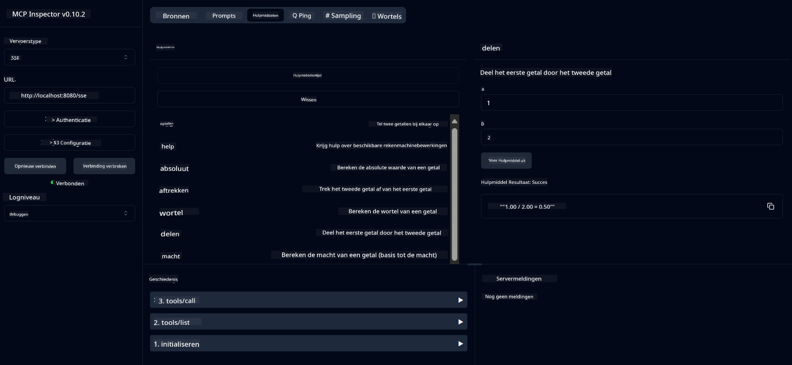

<!--
CO_OP_TRANSLATOR_METADATA:
{
  "original_hash": "ed9cab32cc67c12d8969b407aa47100a",
  "translation_date": "2025-07-13T17:55:16+00:00",
  "source_file": "03-GettingStarted/01-first-server/solution/java/README.md",
  "language_code": "nl"
}
-->
# Basic Calculator MCP Service

Deze service biedt basisrekenkundige bewerkingen via het Model Context Protocol (MCP) met Spring Boot en WebFlux transport. Het is ontworpen als een eenvoudig voorbeeld voor beginners die MCP-implementaties willen leren.

Voor meer informatie, zie de [MCP Server Boot Starter](https://docs.spring.io/spring-ai/reference/api/mcp/mcp-server-boot-starter-docs.html) referentiedocumentatie.


## Gebruik van de Service

De service biedt de volgende API-eindpunten via het MCP-protocol:

- `add(a, b)`: Tel twee getallen bij elkaar op
- `subtract(a, b)`: Trek het tweede getal af van het eerste
- `multiply(a, b)`: Vermenigvuldig twee getallen
- `divide(a, b)`: Deel het eerste getal door het tweede (met controle op nul)
- `power(base, exponent)`: Bereken de macht van een getal
- `squareRoot(number)`: Bereken de wortel (met controle op negatieve getallen)
- `modulus(a, b)`: Bereken de rest bij deling
- `absolute(number)`: Bereken de absolute waarde

## Afhankelijkheden

Het project vereist de volgende belangrijke afhankelijkheden:

```xml
<dependency>
    <groupId>org.springframework.ai</groupId>
    <artifactId>spring-ai-starter-mcp-server-webflux</artifactId>
</dependency>
```

## Project Bouwen

Bouw het project met Maven:
```bash
./mvnw clean install -DskipTests
```

## Server Starten

### Met Java

```bash
java -jar target/calculator-server-0.0.1-SNAPSHOT.jar
```

### Met MCP Inspector

De MCP Inspector is een handig hulpmiddel om met MCP-services te communiceren. Om het te gebruiken met deze calculatorservice:

1. **Installeer en start MCP Inspector** in een nieuw terminalvenster:
   ```bash
   npx @modelcontextprotocol/inspector
   ```

2. **Open de webinterface** door te klikken op de URL die de app toont (meestal http://localhost:6274)

3. **Configureer de verbinding**:
   - Stel het transporttype in op "SSE"
   - Stel de URL in op de SSE-eindpunt van je draaiende server: `http://localhost:8080/sse`
   - Klik op "Connect"

4. **Gebruik de tools**:
   - Klik op "List Tools" om beschikbare rekenkundige bewerkingen te zien
   - Selecteer een tool en klik op "Run Tool" om een bewerking uit te voeren



**Disclaimer**:  
Dit document is vertaald met behulp van de AI-vertalingsdienst [Co-op Translator](https://github.com/Azure/co-op-translator). Hoewel we streven naar nauwkeurigheid, dient u er rekening mee te houden dat geautomatiseerde vertalingen fouten of onnauwkeurigheden kunnen bevatten. Het originele document in de oorspronkelijke taal moet als de gezaghebbende bron worden beschouwd. Voor cruciale informatie wordt professionele menselijke vertaling aanbevolen. Wij zijn niet aansprakelijk voor eventuele misverstanden of verkeerde interpretaties die voortvloeien uit het gebruik van deze vertaling.