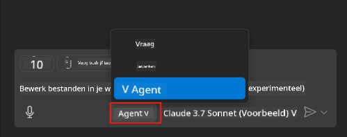
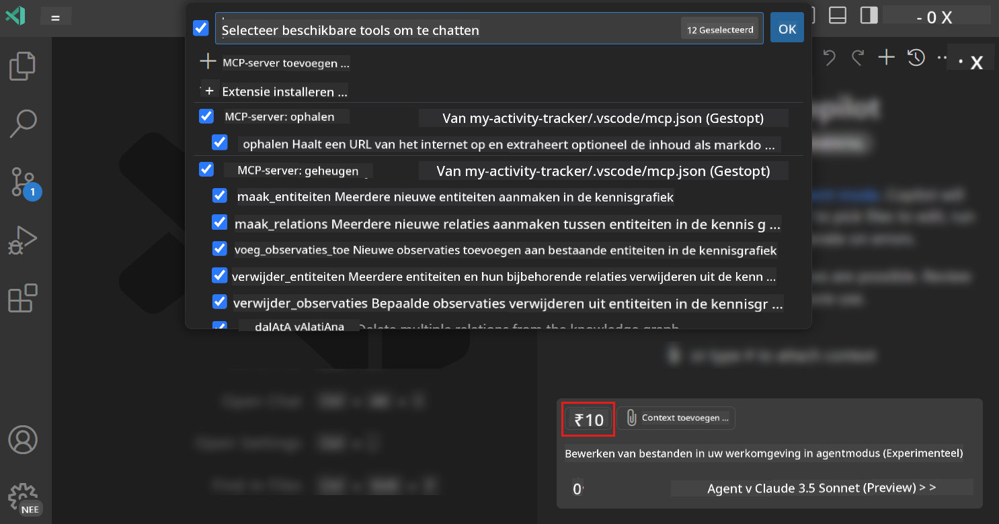
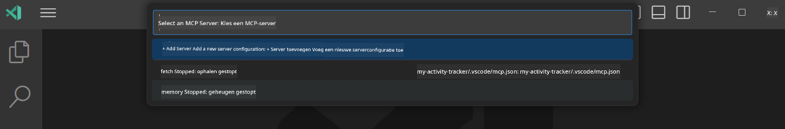

<!--
CO_OP_TRANSLATOR_METADATA:
{
  "original_hash": "d940b5e0af75e3a3a4d1c3179120d1d9",
  "translation_date": "2025-08-26T17:57:51+00:00",
  "source_file": "03-GettingStarted/04-vscode/README.md",
  "language_code": "nl"
}
-->
# Een server gebruiken vanuit GitHub Copilot Agent-modus

Visual Studio Code en GitHub Copilot kunnen fungeren als een client en een MCP Server gebruiken. Waarom zou je dat willen doen, vraag je je misschien af? Nou, dat betekent dat welke functies de MCP Server ook heeft, deze nu vanuit je IDE kunnen worden gebruikt. Stel je bijvoorbeeld voor dat je GitHub's MCP Server toevoegt, dit zou je in staat stellen om GitHub te beheren via prompts in plaats van specifieke commando's in de terminal te typen. Of stel je iets algemeens voor dat je ontwikkelaarservaring kan verbeteren, allemaal aangestuurd door natuurlijke taal. Nu begin je de voordelen te zien, toch?

## Overzicht

Deze les behandelt hoe je Visual Studio Code en GitHub Copilot's Agent-modus kunt gebruiken als een client voor je MCP Server.

## Leerdoelen

Aan het einde van deze les kun je:

- Een MCP Server gebruiken via Visual Studio Code.
- Functionaliteiten zoals tools uitvoeren via GitHub Copilot.
- Visual Studio Code configureren om je MCP Server te vinden en te beheren.

## Gebruik

Je kunt je MCP Server op twee verschillende manieren beheren:

- Gebruikersinterface, je zult later in dit hoofdstuk zien hoe dit werkt.
- Terminal, het is mogelijk om dingen vanuit de terminal te beheren met het `code` uitvoerbare bestand:

  Om een MCP Server toe te voegen aan je gebruikersprofiel, gebruik je de --add-mcp opdrachtregeloptie en geef je de JSON-serverconfiguratie op in de vorm {\"name\":\"server-name\",\"command\":...}.

  ```
  code --add-mcp "{\"name\":\"my-server\",\"command\": \"uvx\",\"args\": [\"mcp-server-fetch\"]}"
  ```

### Screenshots





Laten we in de volgende secties meer praten over hoe we de visuele interface gebruiken.

## Aanpak

Hier is hoe we dit op hoog niveau moeten aanpakken:

- Een bestand configureren om onze MCP Server te vinden.
- De server starten/verbinden om zijn mogelijkheden te laten zien.
- Deze mogelijkheden gebruiken via de GitHub Copilot Chat-interface.

Goed, nu we de workflow begrijpen, laten we proberen een MCP Server te gebruiken via Visual Studio Code met een oefening.

## Oefening: Een server gebruiken

In deze oefening gaan we Visual Studio Code configureren om je MCP Server te vinden, zodat deze kan worden gebruikt via de GitHub Copilot Chat-interface.

### -0- Voorbereiding, MCP Server-ontdekking inschakelen

Je moet mogelijk de ontdekking van MCP Servers inschakelen.

1. Ga naar `Bestand -> Voorkeuren -> Instellingen` in Visual Studio Code.

1. Zoek naar "MCP" en schakel `chat.mcp.discovery.enabled` in het settings.json-bestand in.

### -1- Configuratiebestand maken

Begin met het maken van een configuratiebestand in de hoofdmap van je project. Je hebt een bestand genaamd MCP.json nodig en moet dit plaatsen in een map genaamd .vscode. Het zou er zo uit moeten zien:

```text
.vscode
|-- mcp.json
```

Laten we nu kijken hoe we een serververmelding kunnen toevoegen.

### -2- Een server configureren

Voeg de volgende inhoud toe aan *mcp.json*:

```json
{
    "inputs": [],
    "servers": {
       "hello-mcp": {
           "command": "node",
           "args": [
               "build/index.js"
           ]
       }
    }
}
```

Hierboven zie je een eenvoudig voorbeeld van hoe je een server kunt starten die is geschreven in Node.js. Voor andere runtimes geef je het juiste commando op om de server te starten met `command` en `args`.

### -3- De server starten

Nu je een vermelding hebt toegevoegd, laten we de server starten:

1. Zoek je vermelding in *mcp.json* en zorg ervoor dat je het "play"-icoon vindt:

    

1. Klik op het "play"-icoon. Je zou moeten zien dat het tools-icoon in de GitHub Copilot Chat het aantal beschikbare tools verhoogt. Als je op dat tools-icoon klikt, zie je een lijst met geregistreerde tools. Je kunt elke tool aan- of uitvinken, afhankelijk van of je wilt dat GitHub Copilot ze als context gebruikt:

  

1. Om een tool uit te voeren, typ je een prompt waarvan je weet dat deze overeenkomt met de beschrijving van een van je tools, bijvoorbeeld een prompt zoals "voeg 22 toe aan 1":

  

  Je zou een reactie moeten zien die 23 zegt.

## Opdracht

Probeer een serververmelding toe te voegen aan je *mcp.json*-bestand en zorg ervoor dat je de server kunt starten/stoppen. Zorg er ook voor dat je kunt communiceren met de tools op je server via de GitHub Copilot Chat-interface.

## Oplossing

[Oplossing](./solution/README.md)

## Belangrijke punten

De belangrijkste punten uit dit hoofdstuk zijn:

- Visual Studio Code is een geweldige client waarmee je verschillende MCP Servers en hun tools kunt gebruiken.
- De GitHub Copilot Chat-interface is hoe je met de servers communiceert.
- Je kunt de gebruiker om invoer vragen, zoals API-sleutels, die kunnen worden doorgegeven aan de MCP Server bij het configureren van de serververmelding in het *mcp.json*-bestand.

## Voorbeelden

- [Java Calculator](../samples/java/calculator/README.md)
- [.Net Calculator](../../../../03-GettingStarted/samples/csharp)
- [JavaScript Calculator](../samples/javascript/README.md)
- [TypeScript Calculator](../samples/typescript/README.md)
- [Python Calculator](../../../../03-GettingStarted/samples/python)

## Aanvullende bronnen

- [Visual Studio docs](https://code.visualstudio.com/docs/copilot/chat/mcp-servers)

## Wat komt hierna

- Volgende: [Een stdio Server maken](../05-stdio-server/README.md)

---

**Disclaimer**:  
Dit document is vertaald met behulp van de AI-vertalingsservice [Co-op Translator](https://github.com/Azure/co-op-translator). Hoewel we streven naar nauwkeurigheid, dient u zich ervan bewust te zijn dat geautomatiseerde vertalingen fouten of onnauwkeurigheden kunnen bevatten. Het originele document in zijn oorspronkelijke taal moet worden beschouwd als de gezaghebbende bron. Voor cruciale informatie wordt professionele menselijke vertaling aanbevolen. Wij zijn niet aansprakelijk voor eventuele misverstanden of verkeerde interpretaties die voortvloeien uit het gebruik van deze vertaling.