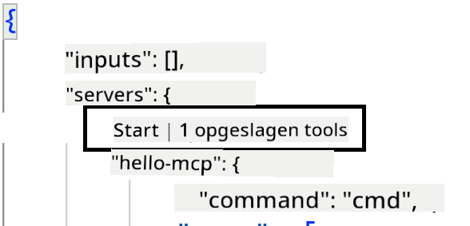
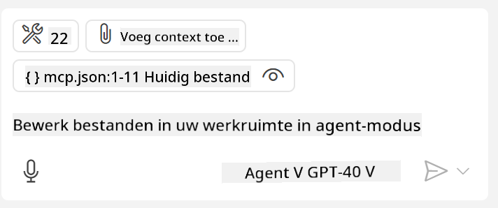
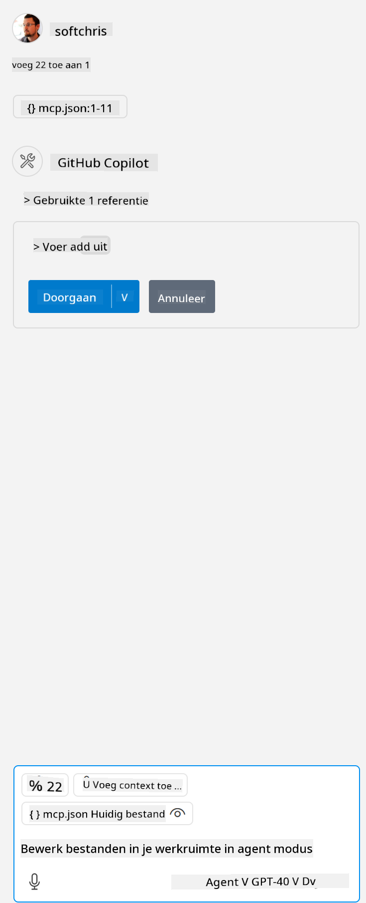

<!--
CO_OP_TRANSLATOR_METADATA:
{
  "original_hash": "c37fabfbc0dcbc9a4afb6d17e7d3be9f",
  "translation_date": "2025-05-17T11:11:07+00:00",
  "source_file": "03-GettingStarted/04-vscode/README.md",
  "language_code": "nl"
}
-->
Laten we het in de volgende secties hebben over hoe we de visuele interface gebruiken.

## Aanpak

Hier is hoe we dit op hoog niveau moeten benaderen:

- Configureer een bestand om onze MCP Server te vinden.
- Start/Verbind met genoemde server om zijn mogelijkheden te laten weergeven.
- Gebruik de genoemde mogelijkheden via de chatinterface van GitHub Copilot.

Geweldig, nu we de flow begrijpen, laten we proberen een MCP Server te gebruiken via Visual Studio Code door middel van een oefening.

## Oefening: Een server gebruiken

In deze oefening zullen we Visual Studio Code configureren om je MCP server te vinden zodat deze kan worden gebruikt vanuit de chatinterface van GitHub Copilot.

### -0- Voorstap, ontdekking van MCP Server inschakelen

Je moet mogelijk de ontdekking van MCP Servers inschakelen.

1. Ga naar `File -> Preferences -> Settings` in Visual Studio Code.

1. Search for "MCP" and enable `chat.mcp.discovery.enabled` in het settings.json bestand.

### -1- Maak configuratiebestand

Begin met het maken van een configuratiebestand in de hoofdmap van je project, je hebt een bestand genaamd MCP.json nodig en plaats het in een map genaamd .vscode. Het zou er als volgt uit moeten zien:

```text
.vscode
|-- mcp.json
```

Laten we nu kijken hoe we een serververmelding kunnen toevoegen.

### -2- Configureer een server

Voeg de volgende inhoud toe aan *mcp.json*:

```json
{
    "inputs": [],
    "servers": {
       "hello-mcp": {
           "command": "cmd",
           "args": [
               "/c", "node", "<absolute path>\\build\\index.js"
           ]
       }
    }
}
```

Hierboven is een eenvoudig voorbeeld van hoe je een server start geschreven in Node.js, voor andere runtimes wijs je de juiste opdracht aan voor het starten van de server met behulp van `command` and `args`.

### -3- Start de server

Nu je een vermelding hebt toegevoegd, laten we de server starten:

1. Zoek je vermelding in *mcp.json* en zorg ervoor dat je het "play" icoon vindt:

    

1. Klik op het "play" icoon, je zou moeten zien dat het gereedschapsicoon in de GitHub Copilot chat het aantal beschikbare gereedschappen verhoogt. Als je op het genoemde gereedschapsicoon klikt, zie je een lijst van geregistreerde gereedschappen. Je kunt elk gereedschap aanvinken/uitvinken afhankelijk of je wilt dat GitHub Copilot ze als context gebruikt:

  

1. Om een gereedschap te gebruiken, typ je een prompt waarvan je weet dat deze overeenkomt met de beschrijving van een van je gereedschappen, bijvoorbeeld een prompt zoals "voeg 22 toe aan 1":

  

  Je zou een antwoord moeten zien dat 23 zegt.

## Opdracht

Probeer een serververmelding toe te voegen aan je *mcp.json* bestand en zorg ervoor dat je de server kunt starten/stoppen. Zorg ervoor dat je ook kunt communiceren met de gereedschappen op je server via de chatinterface van GitHub Copilot.

## Oplossing

[Oplossing](./solution/README.md)

## Belangrijkste Leerpunten

De belangrijkste leerpunten van dit hoofdstuk zijn de volgende:

- Visual Studio Code is een geweldige client die je in staat stelt om verschillende MCP Servers en hun gereedschappen te gebruiken.
- De chatinterface van GitHub Copilot is hoe je met de servers communiceert.
- Je kunt de gebruiker vragen om invoer zoals API-sleutels die kunnen worden doorgegeven aan de MCP Server bij het configureren van de serververmelding in het *mcp.json* bestand.

## Voorbeelden

- [Java Rekenmachine](../samples/java/calculator/README.md)
- [.Net Rekenmachine](../../../../03-GettingStarted/samples/csharp)
- [JavaScript Rekenmachine](../samples/javascript/README.md)
- [TypeScript Rekenmachine](../samples/typescript/README.md)
- [Python Rekenmachine](../../../../03-GettingStarted/samples/python)

## Aanvullende Bronnen

- [Visual Studio docs](https://code.visualstudio.com/docs/copilot/chat/mcp-servers)

## Wat Nu

- Volgende: [Een SSE Server maken](/03-GettingStarted/05-sse-server/README.md)

**Disclaimer**:
Dit document is vertaald met behulp van de AI-vertalingsdienst [Co-op Translator](https://github.com/Azure/co-op-translator). Hoewel we ons best doen voor nauwkeurigheid, dient u zich ervan bewust te zijn dat geautomatiseerde vertalingen fouten of onnauwkeurigheden kunnen bevatten. Het originele document in zijn oorspronkelijke taal moet worden beschouwd als de gezaghebbende bron. Voor kritieke informatie wordt professionele menselijke vertaling aanbevolen. Wij zijn niet aansprakelijk voor eventuele misverstanden of verkeerde interpretaties die voortvloeien uit het gebruik van deze vertaling.