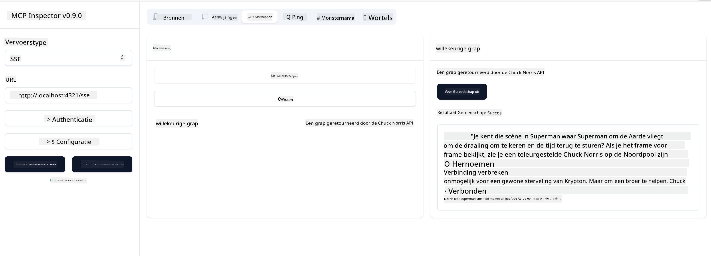

<!--
CO_OP_TRANSLATOR_METADATA:
{
  "original_hash": "64645691bf0985f1760b948123edf269",
  "translation_date": "2025-06-13T10:53:12+00:00",
  "source_file": "03-GettingStarted/05-sse-server/README.md",
  "language_code": "nl"
}
-->
Nu we wat meer weten over SSE, laten we als volgende een SSE-server bouwen.

## Oefening: Een SSE-server maken

Om onze server te maken, moeten we met twee dingen rekening houden:

- We moeten een webserver gebruiken om endpoints bloot te stellen voor verbinding en berichten.
- Bouw onze server zoals we normaal doen met tools, resources en prompts, net zoals we deden met stdio.

### -1- Maak een serverinstantie aan

Om onze server te maken, gebruiken we dezelfde types als bij stdio. Voor de transportlaag moeten we echter SSE kiezen.

Laten we nu de benodigde routes toevoegen.

### -2- Routes toevoegen

Laten we routes toevoegen die de verbinding en binnenkomende berichten afhandelen:

Laten we nu serverfunctionaliteiten toevoegen.

### -3- Serverfunctionaliteiten toevoegen

Nu we alles specifiek voor SSE hebben gedefinieerd, voegen we serverfunctionaliteiten toe zoals tools, prompts en resources.

Je volledige code zou er als volgt uit moeten zien:

Geweldig, we hebben een server die SSE gebruikt, laten we deze nu eens uitproberen.

## Oefening: Een SSE-server debuggen met Inspector

Inspector is een geweldige tool die we in een vorige les [Je eerste server maken](/03-GettingStarted/01-first-server/README.md) hebben gezien. Laten we kijken of we Inspector ook hier kunnen gebruiken:

### -1- Inspector starten

Om de inspector te gebruiken, moet je eerst een SSE-server draaien, laten we dat nu doen:

1. Start de server

1. Start de inspector

    > ![NOTE]
    > Voer dit uit in een apart terminalvenster dan waar de server draait. Let ook op dat je het onderstaande commando moet aanpassen aan de URL waar jouw server draait.

    ```sh
    npx @modelcontextprotocol/inspector --cli http://localhost:8000/sse --method tools/list
    ```

    Het starten van de inspector werkt hetzelfde in alle runtimes. Let erop dat we in plaats van een pad naar onze server en een commando om de server te starten, nu de URL doorgeven waar de server draait en ook de `/sse` route specificeren.

### -2- De tool uitproberen

Verbind met de server door SSE te selecteren in de dropdown en vul het URL-veld in waar jouw server draait, bijvoorbeeld http://localhost:4321/sse. Klik vervolgens op de knop "Connect". Kies zoals eerder om tools te tonen, selecteer een tool en geef invoerwaarden op. Je zou een resultaat moeten zien zoals hieronder:



Geweldig, je kunt met de inspector werken, laten we nu kijken hoe we met Visual Studio Code kunnen werken.

## Opdracht

Probeer je server uit te breiden met meer functionaliteiten. Zie [deze pagina](https://api.chucknorris.io/) om bijvoorbeeld een tool toe te voegen die een API aanroept. Jij bepaalt hoe de server eruit moet zien. Veel plezier :)

## Oplossing

[Oplossing](./solution/README.md) Hier is een mogelijke oplossing met werkende code.

## Belangrijkste punten

De belangrijkste punten uit dit hoofdstuk zijn:

- SSE is het tweede ondersteunde transport naast stdio.
- Om SSE te ondersteunen, moet je binnenkomende verbindingen en berichten beheren met een webframework.
- Je kunt zowel Inspector als Visual Studio Code gebruiken om een SSE-server te gebruiken, net als bij stdio-servers. Let erop dat er een klein verschil is tussen stdio en SSE. Bij SSE moet je de server apart opstarten en daarna de inspector-tool draaien. Voor de inspector-tool moet je ook de URL opgeven.

## Voorbeelden

- [Java Calculator](../samples/java/calculator/README.md)
- [.Net Calculator](../../../../03-GettingStarted/samples/csharp)
- [JavaScript Calculator](../samples/javascript/README.md)
- [TypeScript Calculator](../samples/typescript/README.md)
- [Python Calculator](../../../../03-GettingStarted/samples/python)

## Extra bronnen

- [SSE](https://developer.mozilla.org/en-US/docs/Web/API/Server-sent_events)

## Wat is de volgende stap

- Volgende: [HTTP Streaming met MCP (Streamable HTTP)](/03-GettingStarted/06-http-streaming/README.md)

**Disclaimer**:  
Dit document is vertaald met behulp van de AI-vertalingsdienst [Co-op Translator](https://github.com/Azure/co-op-translator). Hoewel we streven naar nauwkeurigheid, dient u er rekening mee te houden dat geautomatiseerde vertalingen fouten of onnauwkeurigheden kunnen bevatten. Het oorspronkelijke document in de oorspronkelijke taal moet als de gezaghebbende bron worden beschouwd. Voor belangrijke informatie wordt professionele menselijke vertaling aanbevolen. Wij zijn niet aansprakelijk voor eventuele misverstanden of verkeerde interpretaties die voortvloeien uit het gebruik van deze vertaling.