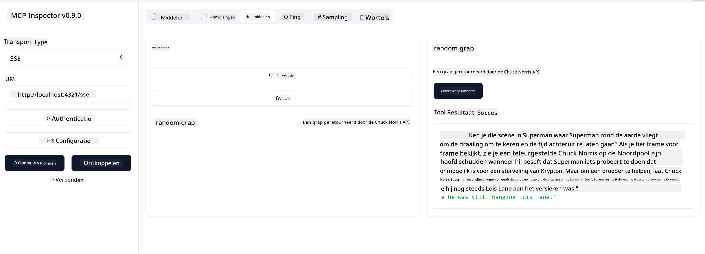

<!--
CO_OP_TRANSLATOR_METADATA:
{
  "original_hash": "0a8086dc4bf89448f83e7936db972c42",
  "translation_date": "2025-05-17T11:38:31+00:00",
  "source_file": "03-GettingStarted/05-sse-server/README.md",
  "language_code": "nl"
}
-->
Nu we iets meer weten over SSE, laten we de volgende stap zetten en een SSE-server bouwen.

## Oefening: Een SSE-server maken

Om onze server te maken, moeten we twee dingen in gedachten houden:

- We moeten een webserver gebruiken om eindpunten voor verbinding en berichten bloot te stellen.
- Bouw onze server zoals we normaal doen met tools, bronnen en prompts toen we stdio gebruikten.

### -1- Maak een serverinstantie

Om onze server te maken, gebruiken we dezelfde types als bij stdio. Echter, voor het transport moeten we SSE kiezen.

Laten we de benodigde routes toevoegen.

### -2- Routes toevoegen

Laten we routes toevoegen die de verbinding en inkomende berichten afhandelen:

Laten we de capaciteiten van de server toevoegen.

### -3- Servercapaciteiten toevoegen

Nu we alles specifiek voor SSE hebben gedefinieerd, laten we servercapaciteiten toevoegen zoals tools, prompts en bronnen.

Je volledige code zou er als volgt uit moeten zien:

Geweldig, we hebben een server die SSE gebruikt, laten we hem de volgende keer uitproberen.

## Oefening: Een SSE-server debuggen met Inspector

Inspector is een geweldig hulpmiddel dat we in een vorige les hebben gezien [Je eerste server maken](/03-GettingStarted/01-first-server/README.md). Laten we kijken of we de Inspector ook hier kunnen gebruiken:

### -1- De inspector uitvoeren

Om de inspector uit te voeren, moet je eerst een SSE-server hebben draaien, dus laten we dat doen:

1. Start de server

1. Start de inspector

    > ![NOTE]
    > Voer dit uit in een apart terminalvenster dan waar de server draait. Let ook op dat je het onderstaande commando moet aanpassen aan de URL waar je server draait.

    ```sh
    npx @modelcontextprotocol/inspector --cli http://localhost:8000/sse --method tools/list
    ```

    Het uitvoeren van de inspector ziet er hetzelfde uit in alle runtimes. Merk op hoe we in plaats van een pad naar onze server en een commando om de server te starten, de URL doorgeven waar de server draait en we ook de `/sse` route specificeren.

### -2- Het hulpmiddel uitproberen

Verbind de server door SSE te selecteren in de keuzelijst en vul het URL-veld in waar je server draait, bijvoorbeeld http:localhost:4321/sse. Klik nu op de knop "Connect". Zoals eerder, kies om tools te vermelden, selecteer een tool en geef invoerwaarden op. Je zou een resultaat moeten zien zoals hieronder:



Geweldig, je bent in staat om met de inspector te werken, laten we eens kijken hoe we met Visual Studio Code kunnen werken.

## Opdracht

Probeer je server uit te breiden met meer mogelijkheden. Zie [deze pagina](https://api.chucknorris.io/) om bijvoorbeeld een tool toe te voegen die een API aanroept, je bepaalt hoe de server eruit moet zien. Veel plezier :)

## Oplossing

[Oplossing](./solution/README.md) Hier is een mogelijke oplossing met werkende code.

## Belangrijke punten

De belangrijkste punten uit dit hoofdstuk zijn de volgende:

- SSE is het tweede ondersteunde transport naast stdio.
- Om SSE te ondersteunen, moet je inkomende verbindingen en berichten beheren met behulp van een webframework.
- Je kunt zowel Inspector als Visual Studio Code gebruiken om een SSE-server te consumeren, net zoals stdio-servers. Merk op hoe het een beetje verschilt tussen stdio en SSE. Voor SSE moet je de server apart opstarten en vervolgens je inspectortool uitvoeren. Voor de inspectortool zijn er ook enkele verschillen, namelijk dat je de URL moet specificeren.

## Voorbeelden

- [Java Calculator](../samples/java/calculator/README.md)
- [.Net Calculator](../../../../03-GettingStarted/samples/csharp)
- [JavaScript Calculator](../samples/javascript/README.md)
- [TypeScript Calculator](../samples/typescript/README.md)
- [Python Calculator](../../../../03-GettingStarted/samples/python)

## Aanvullende bronnen

- [SSE](https://developer.mozilla.org/en-US/docs/Web/API/Server-sent_events)

## Wat komt hierna

- Volgende: [Aan de slag met AI Toolkit voor VSCode](/03-GettingStarted/06-aitk/README.md)

**Disclaimer**:  
Dit document is vertaald met behulp van de AI-vertalingsdienst [Co-op Translator](https://github.com/Azure/co-op-translator). Hoewel we ons best doen voor nauwkeurigheid, dient u zich ervan bewust te zijn dat geautomatiseerde vertalingen fouten of onnauwkeurigheden kunnen bevatten. Het originele document in zijn oorspronkelijke taal moet worden beschouwd als de gezaghebbende bron. Voor cruciale informatie wordt professionele menselijke vertaling aanbevolen. Wij zijn niet aansprakelijk voor eventuele misverstanden of verkeerde interpretaties die voortvloeien uit het gebruik van deze vertaling.