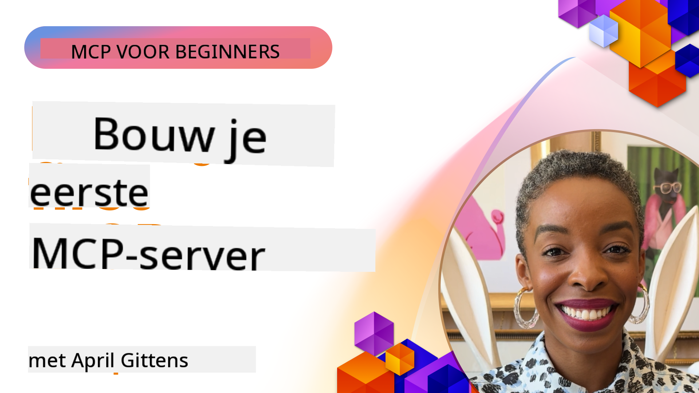

<!--
CO_OP_TRANSLATOR_METADATA:
{
  "original_hash": "1197b6dbde36773e04a5ae826557fdb9",
  "translation_date": "2025-08-26T17:57:30+00:00",
  "source_file": "03-GettingStarted/README.md",
  "language_code": "nl"
}
-->
## Aan de slag  

_(Klik op de afbeelding hierboven om de video van deze les te bekijken)_

Deze sectie bestaat uit verschillende lessen:

- **1 Je eerste server**, in deze eerste les leer je hoe je je eerste server maakt en inspecteert met de inspectietool, een waardevolle manier om je server te testen en debuggen, [naar de les](01-first-server/README.md)

- **2 Client**, in deze les leer je hoe je een client schrijft die verbinding kan maken met je server, [naar de les](02-client/README.md)

- **3 Client met LLM**, een nog betere manier om een client te schrijven is door een LLM toe te voegen, zodat deze kan "onderhandelen" met je server over wat te doen, [naar de les](03-llm-client/README.md)

- **4 Een server gebruiken in GitHub Copilot Agent-modus in Visual Studio Code**. Hier bekijken we hoe je je MCP-server vanuit Visual Studio Code kunt uitvoeren, [naar de les](04-vscode/README.md)

- **5 stdio Transport Server** stdio transport is de aanbevolen standaard voor MCP-server-naar-clientcommunicatie in de huidige specificatie, en biedt veilige communicatie op basis van subprocessen, [naar de les](05-stdio-server/README.md)

- **6 HTTP Streaming met MCP (Streamable HTTP)**. Leer over moderne HTTP-streaming, voortgangsnotificaties en hoe je schaalbare, real-time MCP-servers en clients implementeert met Streamable HTTP, [naar de les](06-http-streaming/README.md)

- **7 Gebruik maken van AI Toolkit voor VSCode** om je MCP-clients en -servers te gebruiken en testen, [naar de les](07-aitk/README.md)

- **8 Testen**. Hier richten we ons vooral op hoe we onze server en client op verschillende manieren kunnen testen, [naar de les](08-testing/README.md)

- **9 Implementatie**. Dit hoofdstuk bekijkt verschillende manieren om je MCP-oplossingen te implementeren, [naar de les](09-deployment/README.md)

Het Model Context Protocol (MCP) is een open protocol dat standaardiseert hoe applicaties context bieden aan LLMs. Denk aan MCP als een USB-C-poort voor AI-applicaties - het biedt een gestandaardiseerde manier om AI-modellen te verbinden met verschillende gegevensbronnen en tools.

## Leerdoelen

Aan het einde van deze les kun je:

- Ontwikkelomgevingen instellen voor MCP in C#, Java, Python, TypeScript en JavaScript
- Basis MCP-servers bouwen en implementeren met aangepaste functies (resources, prompts en tools)
- Hostapplicaties maken die verbinding maken met MCP-servers
- MCP-implementaties testen en debuggen
- Veelvoorkomende installatieproblemen begrijpen en oplossen
- Je MCP-implementaties verbinden met populaire LLM-diensten

## Je MCP-omgeving instellen

Voordat je begint met MCP, is het belangrijk om je ontwikkelomgeving voor te bereiden en de basisworkflow te begrijpen. Deze sectie begeleidt je door de eerste stappen van de installatie om een soepele start met MCP te garanderen.

### Vereisten

Voordat je begint met MCP-ontwikkeling, zorg ervoor dat je beschikt over:

- **Ontwikkelomgeving**: Voor de door jou gekozen taal (C#, Java, Python, TypeScript of JavaScript)
- **IDE/Editor**: Visual Studio, Visual Studio Code, IntelliJ, Eclipse, PyCharm of een moderne code-editor
- **Pakketbeheerders**: NuGet, Maven/Gradle, pip of npm/yarn
- **API-sleutels**: Voor alle AI-diensten die je van plan bent te gebruiken in je hostapplicaties

### Officiële SDK's

In de komende hoofdstukken zie je oplossingen die zijn gebouwd met Python, TypeScript, Java en .NET. Hier zijn alle officieel ondersteunde SDK's.

MCP biedt officiële SDK's voor meerdere talen:
- [C# SDK](https://github.com/modelcontextprotocol/csharp-sdk) - Onderhouden in samenwerking met Microsoft
- [Java SDK](https://github.com/modelcontextprotocol/java-sdk) - Onderhouden in samenwerking met Spring AI
- [TypeScript SDK](https://github.com/modelcontextprotocol/typescript-sdk) - De officiële TypeScript-implementatie
- [Python SDK](https://github.com/modelcontextprotocol/python-sdk) - De officiële Python-implementatie
- [Kotlin SDK](https://github.com/modelcontextprotocol/kotlin-sdk) - De officiële Kotlin-implementatie
- [Swift SDK](https://github.com/modelcontextprotocol/swift-sdk) - Onderhouden in samenwerking met Loopwork AI
- [Rust SDK](https://github.com/modelcontextprotocol/rust-sdk) - De officiële Rust-implementatie

## Belangrijke punten

- Het instellen van een MCP-ontwikkelomgeving is eenvoudig met taal-specifieke SDK's
- MCP-servers bouwen houdt in dat je tools maakt en registreert met duidelijke schema's
- MCP-clients maken verbinding met servers en modellen om uitgebreide mogelijkheden te benutten
- Testen en debuggen zijn essentieel voor betrouwbare MCP-implementaties
- Implementatieopties variëren van lokale ontwikkeling tot cloudgebaseerde oplossingen

## Oefenen

We hebben een set voorbeelden die de oefeningen aanvullen die je in alle hoofdstukken in deze sectie zult zien. Daarnaast heeft elk hoofdstuk ook zijn eigen oefeningen en opdrachten.

- [Java Calculator](./samples/java/calculator/README.md)
- [.Net Calculator](../../../03-GettingStarted/samples/csharp)
- [JavaScript Calculator](./samples/javascript/README.md)
- [TypeScript Calculator](./samples/typescript/README.md)
- [Python Calculator](../../../03-GettingStarted/samples/python)

## Aanvullende bronnen

- [Agents bouwen met Model Context Protocol op Azure](https://learn.microsoft.com/azure/developer/ai/intro-agents-mcp)
- [Remote MCP met Azure Container Apps (Node.js/TypeScript/JavaScript)](https://learn.microsoft.com/samples/azure-samples/mcp-container-ts/mcp-container-ts/)
- [.NET OpenAI MCP Agent](https://learn.microsoft.com/samples/azure-samples/openai-mcp-agent-dotnet/openai-mcp-agent-dotnet/)

## Wat komt hierna

Volgende: [Je eerste MCP-server maken](01-first-server/README.md)

---

**Disclaimer**:  
Dit document is vertaald met behulp van de AI-vertalingsservice [Co-op Translator](https://github.com/Azure/co-op-translator). Hoewel we streven naar nauwkeurigheid, dient u zich ervan bewust te zijn dat geautomatiseerde vertalingen fouten of onnauwkeurigheden kunnen bevatten. Het originele document in zijn oorspronkelijke taal moet worden beschouwd als de gezaghebbende bron. Voor cruciale informatie wordt professionele menselijke vertaling aanbevolen. Wij zijn niet aansprakelijk voor misverstanden of verkeerde interpretaties die voortvloeien uit het gebruik van deze vertaling.