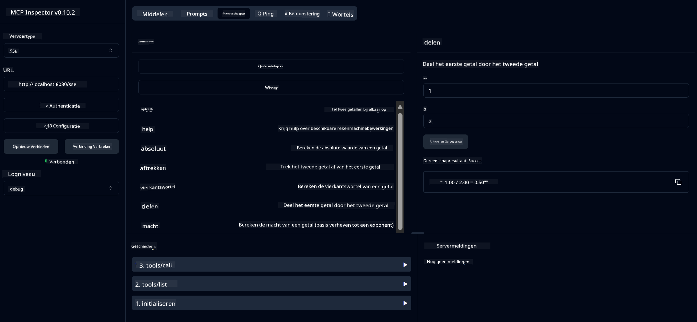

<!--
CO_OP_TRANSLATOR_METADATA:
{
  "original_hash": "13231e9951b68efd9df8c56bd5cdb27e",
  "translation_date": "2025-05-17T13:13:50+00:00",
  "source_file": "03-GettingStarted/samples/java/calculator/README.md",
  "language_code": "nl"
}
-->
# Basis Calculator MCP Service

Deze service biedt basiscalculatorbewerkingen via het Model Context Protocol (MCP) met behulp van Spring Boot met WebFlux-transport. Het is ontworpen als een eenvoudig voorbeeld voor beginners die leren over MCP-implementaties.

Voor meer informatie, zie de [MCP Server Boot Starter](https://docs.spring.io/spring-ai/reference/api/mcp/mcp-server-boot-starter-docs.html) referentiedocumentatie.

## Overzicht

De service toont:
- Ondersteuning voor SSE (Server-Sent Events)
- Automatische toolregistratie met behulp van Spring AI's `@Tool` annotatie
- Basiscalculatorfuncties:
  - Optellen, aftrekken, vermenigvuldigen, delen
  - Machtsverheffing en worteltrekken
  - Modulus (rest) en absolute waarde
  - Helpfunctie voor bewerkingsbeschrijvingen

## Kenmerken

Deze calculatorservice biedt de volgende mogelijkheden:

1. **Basis rekenkundige bewerkingen**:
   - Optellen van twee getallen
   - Aftrekken van het ene getal van het andere
   - Vermenigvuldigen van twee getallen
   - Delen van het ene getal door het andere (met nulcontrole)

2. **Geavanceerde bewerkingen**:
   - Machtsverheffing (een basis verhogen tot een exponent)
   - Worteltrekken (met controle op negatieve getallen)
   - Modulus (rest) berekening
   - Absolute waarde berekening

3. **Helpsysteem**:
   - Ingebouwde helpfunctie die alle beschikbare bewerkingen uitlegt

## Gebruik van de service

De service biedt de volgende API-eindpunten via het MCP-protocol:

- `add(a, b)`: Tel twee getallen bij elkaar op
- `subtract(a, b)`: Trek het tweede getal van het eerste af
- `multiply(a, b)`: Vermenigvuldig twee getallen
- `divide(a, b)`: Deel het eerste getal door het tweede (met nulcontrole)
- `power(base, exponent)`: Bereken de macht van een getal
- `squareRoot(number)`: Bereken de wortel (met controle op negatieve getallen)
- `modulus(a, b)`: Bereken de rest bij deling
- `absolute(number)`: Bereken de absolute waarde
- `help()`: Verkrijg informatie over beschikbare bewerkingen

## Testclient

Een eenvoudige testclient is inbegrepen in het `com.microsoft.mcp.sample.client` pakket. De `SampleCalculatorClient` klasse demonstreert de beschikbare bewerkingen van de calculatorservice.

## Gebruik van de LangChain4j Client

Het project bevat een LangChain4j voorbeeldclient in `com.microsoft.mcp.sample.client.LangChain4jClient` die demonstreert hoe de calculatorservice kan worden geïntegreerd met LangChain4j en GitHub-modellen:

### Vereisten

1. **GitHub Token Setup**:
   
   Om GitHub's AI-modellen (zoals phi-4) te gebruiken, heb je een persoonlijke toegangstoken van GitHub nodig:

   a. Ga naar je GitHub-accountinstellingen: https://github.com/settings/tokens
   
   b. Klik op "Generate new token" → "Generate new token (classic)"
   
   c. Geef je token een beschrijvende naam
   
   d. Selecteer de volgende scopes:
      - `repo` (Volledige controle over privérepositories)
      - `read:org` (Lees org- en teamlidmaatschap, lees org-projecten)
      - `gist` (Maak gists)
      - `user:email` (Toegang tot e-mailadressen van gebruikers (alleen-lezen))
   
   e. Klik op "Generate token" en kopieer je nieuwe token
   
   f. Stel het in als een omgevingsvariabele:
      
      Op Windows:
      ```
      set GITHUB_TOKEN=your-github-token
      ```
      
      Op macOS/Linux:
      ```bash
      export GITHUB_TOKEN=your-github-token
      ```

   g. Voor een permanente instelling, voeg het toe aan je omgevingsvariabelen via de systeeminstellingen

2. Voeg de LangChain4j GitHub-afhankelijkheid toe aan je project (al opgenomen in pom.xml):
   ```xml
   <dependency>
       <groupId>dev.langchain4j</groupId>
       <artifactId>langchain4j-github</artifactId>
       <version>${langchain4j.version}</version>
   </dependency>
   ```

3. Zorg ervoor dat de calculatorserver draait op `localhost:8080`

### De LangChain4j Client uitvoeren

Dit voorbeeld demonstreert:
- Verbinding maken met de calculator MCP-server via SSE-transport
- Gebruik van LangChain4j om een chatbot te creëren die gebruikmaakt van calculatorbewerkingen
- Integratie met GitHub AI-modellen (nu gebruikmakend van phi-4 model)

De client stuurt de volgende voorbeeldvragen om functionaliteit te demonstreren:
1. Het berekenen van de som van twee getallen
2. Het vinden van de wortel van een getal
3. Verkrijgen van helpinformatie over beschikbare calculatorbewerkingen

Voer het voorbeeld uit en controleer de console-uitvoer om te zien hoe het AI-model de calculatortools gebruikt om vragen te beantwoorden.

### GitHub Model Configuratie

De LangChain4j client is geconfigureerd om GitHub's phi-4 model te gebruiken met de volgende instellingen:

```java
ChatLanguageModel model = GitHubChatModel.builder()
    .apiKey(System.getenv("GITHUB_TOKEN"))
    .timeout(Duration.ofSeconds(60))
    .modelName("phi-4")
    .logRequests(true)
    .logResponses(true)
    .build();
```

Om verschillende GitHub-modellen te gebruiken, wijzig eenvoudig de `modelName` parameter naar een ander ondersteund model (bijv. "claude-3-haiku-20240307", "llama-3-70b-8192", etc.).

## Afhankelijkheden

Het project vereist de volgende belangrijke afhankelijkheden:

```xml
<!-- For MCP Server -->
<dependency>
    <groupId>org.springframework.ai</groupId>
    <artifactId>spring-ai-starter-mcp-server-webflux</artifactId>
</dependency>

<!-- For LangChain4j integration -->
<dependency>
    <groupId>dev.langchain4j</groupId>
    <artifactId>langchain4j-mcp</artifactId>
    <version>${langchain4j.version}</version>
</dependency>

<!-- For GitHub models support -->
<dependency>
    <groupId>dev.langchain4j</groupId>
    <artifactId>langchain4j-github</artifactId>
    <version>${langchain4j.version}</version>
</dependency>
```

## Het project bouwen

Bouw het project met Maven:
```bash
./mvnw clean install -DskipTests
```

## De server uitvoeren

### Gebruik van Java

```bash
java -jar target/calculator-server-0.0.1-SNAPSHOT.jar
```

### Gebruik van MCP Inspector

De MCP Inspector is een handig hulpmiddel voor interactie met MCP-services. Om het te gebruiken met deze calculatorservice:

1. **Installeer en voer MCP Inspector uit** in een nieuw terminalvenster:
   ```bash
   npx @modelcontextprotocol/inspector
   ```

2. **Toegang tot de web-UI** door op de door de app weergegeven URL te klikken (meestal http://localhost:6274)

3. **Configureer de verbinding**:
   - Stel het transporttype in op "SSE"
   - Stel de URL in op het SSE-eindpunt van je draaiende server: `http://localhost:8080/sse`
   - Klik op "Connect"

4. **Gebruik de tools**:
   - Klik op "List Tools" om beschikbare calculatorbewerkingen te zien
   - Selecteer een tool en klik op "Run Tool" om een bewerking uit te voeren



### Gebruik van Docker

Het project bevat een Dockerfile voor containerized deployment:

1. **Bouw de Docker-image**:
   ```bash
   docker build -t calculator-mcp-service .
   ```

2. **Voer de Docker-container uit**:
   ```bash
   docker run -p 8080:8080 calculator-mcp-service
   ```

Dit zal:
- Een multi-stage Docker-image bouwen met Maven 3.9.9 en Eclipse Temurin 24 JDK
- Een geoptimaliseerde containerimage creëren
- De service beschikbaar maken op poort 8080
- De MCP calculatorservice binnen de container starten

Je kunt de service benaderen op `http://localhost:8080` zodra de container draait.

## Probleemoplossing

### Veelvoorkomende problemen met GitHub Token

1. **Token Permission Issues**: Als je een 403 Forbidden fout krijgt, controleer dan of je token de juiste permissies heeft zoals beschreven in de vereisten.

2. **Token Not Found**: Als je een "No API key found" fout krijgt, zorg ervoor dat de GITHUB_TOKEN omgevingsvariabele correct is ingesteld.

3. **Rate Limiting**: GitHub API heeft rate limits. Als je een rate limit fout krijgt (statuscode 429), wacht dan een paar minuten voordat je het opnieuw probeert.

4. **Token Expiration**: GitHub tokens kunnen verlopen. Als je na enige tijd authenticatiefouten ontvangt, genereer dan een nieuwe token en werk je omgevingsvariabele bij.

Als je verdere hulp nodig hebt, bekijk dan de [LangChain4j documentatie](https://github.com/langchain4j/langchain4j) of [GitHub API documentatie](https://docs.github.com/en/rest).

**Disclaimer**:  
Dit document is vertaald met behulp van de AI vertaaldienst [Co-op Translator](https://github.com/Azure/co-op-translator). Hoewel we ons best doen voor nauwkeurigheid, dient u zich ervan bewust te zijn dat geautomatiseerde vertalingen fouten of onnauwkeurigheden kunnen bevatten. Het originele document in zijn oorspronkelijke taal moet worden beschouwd als de gezaghebbende bron. Voor kritische informatie wordt professionele menselijke vertaling aanbevolen. Wij zijn niet aansprakelijk voor eventuele misverstanden of verkeerde interpretaties die voortvloeien uit het gebruik van deze vertaling.