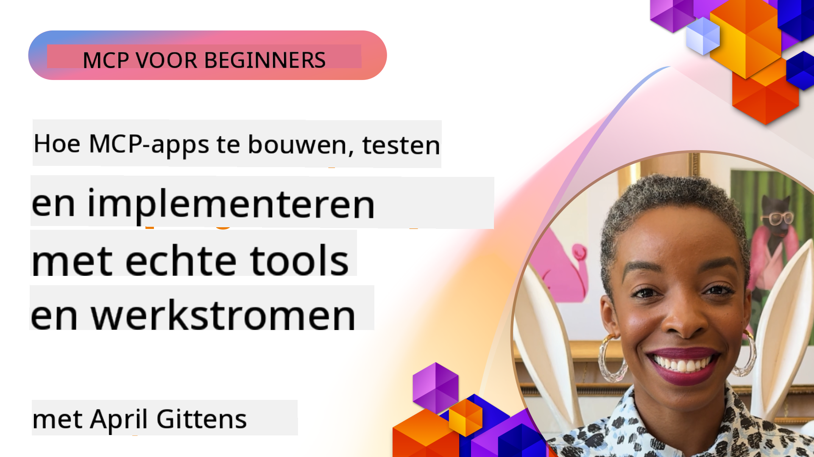

<!--
CO_OP_TRANSLATOR_METADATA:
{
  "original_hash": "83efa75a69bc831277263a6f1ae53669",
  "translation_date": "2025-08-18T16:27:07+00:00",
  "source_file": "04-PracticalImplementation/README.md",
  "language_code": "nl"
}
-->
# Praktische Implementatie

[](https://youtu.be/vCN9-mKBDfQ)

_(Klik op de afbeelding hierboven om de video van deze les te bekijken)_

Praktische implementatie is waar de kracht van het Model Context Protocol (MCP) echt tot leven komt. Hoewel het begrijpen van de theorie en architectuur achter MCP belangrijk is, ligt de echte waarde in het toepassen van deze concepten om oplossingen te bouwen, testen en implementeren die echte problemen oplossen. Dit hoofdstuk slaat de brug tussen conceptuele kennis en praktische ontwikkeling en begeleidt je bij het tot leven brengen van MCP-gebaseerde applicaties.

Of je nu intelligente assistenten ontwikkelt, AI integreert in bedrijfsprocessen of aangepaste tools bouwt voor gegevensverwerking, MCP biedt een flexibele basis. Dankzij het taalonafhankelijke ontwerp en de officiële SDK's voor populaire programmeertalen is het toegankelijk voor een breed scala aan ontwikkelaars. Door gebruik te maken van deze SDK's kun je snel prototypes maken, itereren en je oplossingen opschalen naar verschillende platforms en omgevingen.

In de volgende secties vind je praktische voorbeelden, voorbeeldcode en implementatiestrategieën die laten zien hoe je MCP kunt toepassen in C#, Java met Spring, TypeScript, JavaScript en Python. Je leert ook hoe je MCP-servers debugt en test, API's beheert en oplossingen implementeert in de cloud met Azure. Deze hands-on bronnen zijn ontworpen om je leerproces te versnellen en je te helpen met vertrouwen robuuste, productieklare MCP-applicaties te bouwen.

## Overzicht

Deze les richt zich op de praktische aspecten van MCP-implementatie in meerdere programmeertalen. We verkennen hoe je MCP-SDK's gebruikt in C#, Java met Spring, TypeScript, JavaScript en Python om robuuste applicaties te bouwen, MCP-servers te debuggen en testen, en herbruikbare bronnen, prompts en tools te creëren.

## Leerdoelen

Aan het einde van deze les kun je:

- MCP-oplossingen implementeren met behulp van officiële SDK's in verschillende programmeertalen
- MCP-servers systematisch debuggen en testen
- Serverfuncties (Resources, Prompts en Tools) maken en gebruiken
- Effectieve MCP-workflows ontwerpen voor complexe taken
- MCP-implementaties optimaliseren voor prestaties en betrouwbaarheid

## Officiële SDK-bronnen

Het Model Context Protocol biedt officiële SDK's voor meerdere talen:

- [C# SDK](https://github.com/modelcontextprotocol/csharp-sdk)
- [Java met Spring SDK](https://github.com/modelcontextprotocol/java-sdk) **Opmerking:** vereist afhankelijkheid van [Project Reactor](https://projectreactor.io). (Zie [discussie issue 246](https://github.com/orgs/modelcontextprotocol/discussions/246).)
- [TypeScript SDK](https://github.com/modelcontextprotocol/typescript-sdk)
- [Python SDK](https://github.com/modelcontextprotocol/python-sdk)
- [Kotlin SDK](https://github.com/modelcontextprotocol/kotlin-sdk)

## Werken met MCP-SDK's

Deze sectie biedt praktische voorbeelden van MCP-implementatie in meerdere programmeertalen. Je kunt voorbeeldcode vinden in de `samples`-map, georganiseerd per taal.

### Beschikbare Voorbeelden

De repository bevat [voorbeeldimplementaties](../../../04-PracticalImplementation/samples) in de volgende talen:

- [C#](./samples/csharp/README.md)
- [Java met Spring](./samples/java/containerapp/README.md)
- [TypeScript](./samples/typescript/README.md)
- [JavaScript](./samples/javascript/README.md)
- [Python](./samples/python/README.md)

Elk voorbeeld demonstreert belangrijke MCP-concepten en implementatiepatronen voor die specifieke taal en ecosysteem.

## Kernserverfuncties

MCP-servers kunnen een combinatie van de volgende functies implementeren:

### Resources

Resources bieden context en gegevens voor de gebruiker of het AI-model:

- Documentenbibliotheken
- Kennisbanken
- Gestructureerde gegevensbronnen
- Bestandsystemen

### Prompts

Prompts zijn gesjabloneerde berichten en workflows voor gebruikers:

- Vooraf gedefinieerde gesprekssjablonen
- Begeleide interactiepatronen
- Gespecialiseerde dialoogstructuren

### Tools

Tools zijn functies die het AI-model kan uitvoeren:

- Hulpprogramma's voor gegevensverwerking
- Integraties met externe API's
- Computationele mogelijkheden
- Zoekfunctionaliteit

## Voorbeeldimplementaties: C#-implementatie

De officiële C# SDK-repository bevat verschillende voorbeeldimplementaties die verschillende aspecten van MCP demonstreren:

- **Eenvoudige MCP-client**: Een eenvoudig voorbeeld dat laat zien hoe je een MCP-client maakt en tools aanroept
- **Eenvoudige MCP-server**: Minimale serverimplementatie met basisregistratie van tools
- **Geavanceerde MCP-server**: Volledig uitgeruste server met toolregistratie, authenticatie en foutafhandeling
- **ASP.NET-integratie**: Voorbeelden die integratie met ASP.NET Core demonstreren
- **Toolimplementatiepatronen**: Verschillende patronen voor het implementeren van tools met verschillende complexiteitsniveaus

De MCP C# SDK is in preview en de API's kunnen veranderen. We zullen deze blog continu bijwerken naarmate de SDK evolueert.

### Belangrijke Functies

- [C# MCP Nuget ModelContextProtocol](https://www.nuget.org/packages/ModelContextProtocol)
- Bouw je [eerste MCP-server](https://devblogs.microsoft.com/dotnet/build-a-model-context-protocol-mcp-server-in-csharp/).

Voor volledige C#-implementatievoorbeelden, bezoek de [officiële C# SDK-voorbeeldenrepository](https://github.com/modelcontextprotocol/csharp-sdk).

## Voorbeeldimplementatie: Java met Spring-implementatie

De Java met Spring SDK biedt robuuste MCP-implementatieopties met functies van ondernemingsniveau.

### Belangrijke Functies

- Integratie met Spring Framework
- Sterke typeveiligheid
- Ondersteuning voor reactieve programmering
- Uitgebreide foutafhandeling

Voor een volledige Java met Spring-implementatie, zie [Java met Spring-voorbeeld](samples/java/containerapp/README.md) in de samples-map.

## Voorbeeldimplementatie: JavaScript-implementatie

De JavaScript SDK biedt een lichte en flexibele aanpak voor MCP-implementatie.

### Belangrijke Functies

- Ondersteuning voor Node.js en browsers
- Promise-gebaseerde API
- Eenvoudige integratie met Express en andere frameworks
- Ondersteuning voor WebSocket-streaming

Voor een volledige JavaScript-implementatie, zie [JavaScript-voorbeeld](samples/javascript/README.md) in de samples-map.

## Voorbeeldimplementatie: Python-implementatie

De Python SDK biedt een Pythonic aanpak voor MCP-implementatie met uitstekende integraties met ML-frameworks.

### Belangrijke Functies

- Ondersteuning voor async/await met asyncio
- Integratie met FastAPI
- Eenvoudige toolregistratie
- Native integratie met populaire ML-bibliotheken

Voor een volledige Python-implementatie, zie [Python-voorbeeld](samples/python/README.md) in de samples-map.

## API-beheer

Azure API Management is een uitstekende oplossing om MCP-servers te beveiligen. Het idee is om een Azure API Management-instantie voor je MCP-server te plaatsen en deze functies te laten afhandelen die je waarschijnlijk nodig hebt, zoals:

- Verkeerslimitering
- Tokenbeheer
- Monitoring
- Load balancing
- Beveiliging

### Azure Voorbeeld

Hier is een Azure-voorbeeld dat precies dat doet, namelijk [een MCP-server maken en beveiligen met Azure API Management](https://github.com/Azure-Samples/remote-mcp-apim-functions-python).

Zie hoe de autorisatiestroom plaatsvindt in de onderstaande afbeelding:


In de bovenstaande afbeelding gebeurt het volgende:

- Authenticatie/Autorisatie vindt plaats via Microsoft Entra.
- Azure API Management fungeert als een gateway en gebruikt beleidsregels om verkeer te beheren.
- Azure Monitor logt alle verzoeken voor verdere analyse.

#### Autorisatiestroom

Laten we de autorisatiestroom in meer detail bekijken:


#### MCP-autorisatiespecificatie

Lees meer over de [MCP-autorisatiespecificatie](https://modelcontextprotocol.io/specification/2025-03-26/basic/authorization#2-10-third-party-authorization-flow).

## Remote MCP-server implementeren op Azure

Laten we kijken of we het eerder genoemde voorbeeld kunnen implementeren:

1. Clone de repository

    ```bash
    git clone https://github.com/Azure-Samples/remote-mcp-apim-functions-python.git
    cd remote-mcp-apim-functions-python
    ```

1. Registreer de `Microsoft.App`-resourceprovider.

   - Als je Azure CLI gebruikt, voer `az provider register --namespace Microsoft.App --wait` uit.
   - Als je Azure PowerShell gebruikt, voer `Register-AzResourceProvider -ProviderNamespace Microsoft.App` uit. Voer vervolgens `(Get-AzResourceProvider -ProviderNamespace Microsoft.App).RegistrationState` na enige tijd uit om te controleren of de registratie is voltooid.

1. Voer dit [azd](https://aka.ms/azd)-commando uit om de API-beheerservice, functie-app (met code) en alle andere vereiste Azure-resources te voorzien

    ```shell
    azd up
    ```

    Dit commando zou alle cloudresources op Azure moeten implementeren.

### Je server testen met MCP Inspector

1. Open een **nieuw terminalvenster**, installeer en voer MCP Inspector uit

    ```shell
    npx @modelcontextprotocol/inspector
    ```

    Je zou een interface moeten zien die lijkt op:

    

1. CTRL-klik om de MCP Inspector-webapp te laden vanaf de URL die door de app wordt weergegeven (bijv. [http://127.0.0.1:6274/#resources](http://127.0.0.1:6274/#resources)).
1. Stel het transporttype in op `SSE`.
1. Stel de URL in op je draaiende API Management SSE-eindpunt dat wordt weergegeven na `azd up` en **Verbind**:

    ```shell
    https://<apim-servicename-from-azd-output>.azure-api.net/mcp/sse
    ```

1. **Lijst Tools**. Klik op een tool en **Voer Tool uit**.

Als alle stappen hebben gewerkt, zou je nu verbonden moeten zijn met de MCP-server en een tool hebben kunnen aanroepen.

## MCP-servers voor Azure

[Remote-mcp-functions](https://github.com/Azure-Samples/remote-mcp-functions-dotnet): Deze set repositories zijn quickstart-sjablonen voor het bouwen en implementeren van aangepaste remote MCP (Model Context Protocol) servers met behulp van Azure Functions met Python, C# .NET of Node/TypeScript.

De voorbeelden bieden een complete oplossing waarmee ontwikkelaars:

- Lokaal kunnen bouwen en uitvoeren: Ontwikkel en debug een MCP-server op een lokale machine
- Naar Azure kunnen implementeren: Eenvoudig implementeren naar de cloud met een eenvoudig `azd up`-commando
- Kunnen verbinden vanaf clients: Verbinden met de MCP-server vanaf verschillende clients, waaronder de Copilot-agentmodus van VS Code en de MCP Inspector-tool

### Belangrijke Functies

- Beveiliging vanaf het ontwerp: De MCP-server is beveiligd met sleutels en HTTPS
- Authenticatieopties: Ondersteunt OAuth met ingebouwde authenticatie en/of API Management
- Netwerkisolatie: Ondersteunt netwerkisolatie met behulp van Azure Virtual Networks (VNET)
- Serverloze architectuur: Maakt gebruik van Azure Functions voor schaalbare, gebeurtenisgestuurde uitvoering
- Lokale ontwikkeling: Uitgebreide ondersteuning voor lokale ontwikkeling en debugging
- Eenvoudige implementatie: Gestroomlijnd implementatieproces naar Azure

De repository bevat alle benodigde configuratiebestanden, broncode en infrastructuurdefinities om snel aan de slag te gaan met een productieklare MCP-serverimplementatie.

- [Azure Remote MCP Functions Python](https://github.com/Azure-Samples/remote-mcp-functions-python) - Voorbeeldimplementatie van MCP met Azure Functions en Python

- [Azure Remote MCP Functions .NET](https://github.com/Azure-Samples/remote-mcp-functions-dotnet) - Voorbeeldimplementatie van MCP met Azure Functions en C# .NET

- [Azure Remote MCP Functions Node/Typescript](https://github.com/Azure-Samples/remote-mcp-functions-typescript) - Voorbeeldimplementatie van MCP met Azure Functions en Node/TypeScript.

## Belangrijkste Inzichten

- MCP-SDK's bieden taal-specifieke tools voor het implementeren van robuuste MCP-oplossingen
- Het debuggen en testen is cruciaal voor betrouwbare MCP-applicaties
- Herbruikbare promptsjablonen zorgen voor consistente AI-interacties
- Goed ontworpen workflows kunnen complexe taken coördineren met meerdere tools
- Het implementeren van MCP-oplossingen vereist aandacht voor beveiliging, prestaties en foutafhandeling

## Oefening

Ontwerp een praktische MCP-workflow die een echt probleem in jouw domein aanpakt:

1. Identificeer 3-4 tools die nuttig zouden zijn om dit probleem op te lossen
2. Maak een workflowdiagram dat laat zien hoe deze tools samenwerken
3. Implementeer een basisversie van een van de tools in je voorkeursprogrammeertaal
4. Maak een promptsjabloon die het model helpt jouw tool effectief te gebruiken

## Aanvullende Bronnen

---

Volgende: [Geavanceerde Onderwerpen](../05-AdvancedTopics/README.md)

**Disclaimer**:  
Dit document is vertaald met behulp van de AI-vertalingsservice [Co-op Translator](https://github.com/Azure/co-op-translator). Hoewel we streven naar nauwkeurigheid, dient u zich ervan bewust te zijn dat geautomatiseerde vertalingen fouten of onnauwkeurigheden kunnen bevatten. Het originele document in de oorspronkelijke taal moet worden beschouwd als de gezaghebbende bron. Voor cruciale informatie wordt professionele menselijke vertaling aanbevolen. Wij zijn niet aansprakelijk voor eventuele misverstanden of verkeerde interpretaties die voortvloeien uit het gebruik van deze vertaling.