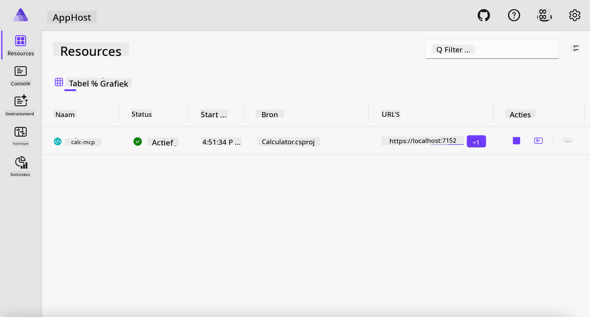
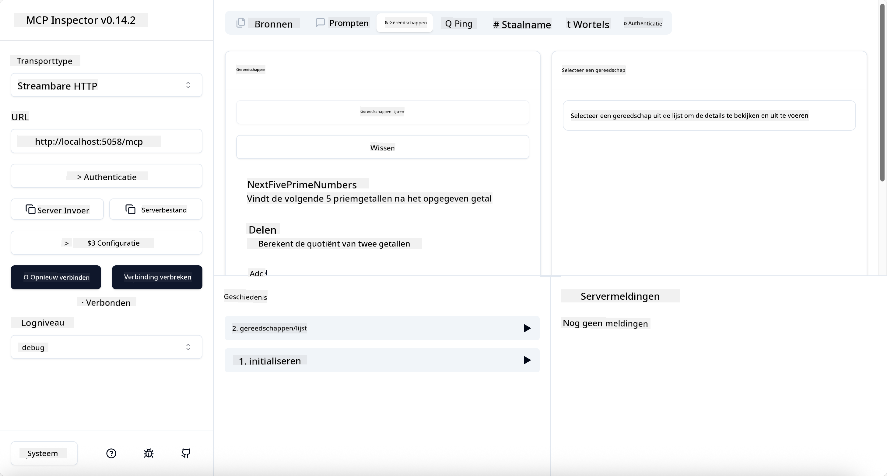
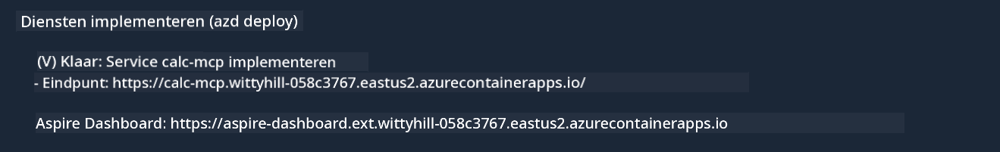

<!--
CO_OP_TRANSLATOR_METADATA:
{
  "original_hash": "0bc7bd48f55f1565f1d95ccb2c16f728",
  "translation_date": "2025-07-13T23:08:01+00:00",
  "source_file": "04-PracticalImplementation/samples/csharp/README.md",
  "language_code": "nl"
}
-->
# Voorbeeld

Het vorige voorbeeld laat zien hoe je een lokaal .NET-project gebruikt met het `stdio` type. En hoe je de server lokaal in een container draait. Dit is in veel situaties een goede oplossing. Toch kan het handig zijn om de server op afstand te laten draaien, bijvoorbeeld in een cloudomgeving. Hiervoor is het `http` type bedoeld.

Als je kijkt naar de oplossing in de map `04-PracticalImplementation`, lijkt het misschien veel complexer dan het vorige voorbeeld. Maar in werkelijkheid is dat niet zo. Als je goed kijkt naar het project `src/Calculator`, zie je dat het grotendeels dezelfde code is als in het vorige voorbeeld. Het enige verschil is dat we een andere bibliotheek gebruiken, `ModelContextProtocol.AspNetCore`, om de HTTP-verzoeken af te handelen. En we maken de methode `IsPrime` privé, alleen om te laten zien dat je ook privé-methoden in je code kunt hebben. De rest van de code is hetzelfde als voorheen.

De andere projecten komen van [.NET Aspire](https://learn.microsoft.com/dotnet/aspire/get-started/aspire-overview). Het toevoegen van .NET Aspire aan de oplossing verbetert de ervaring van de ontwikkelaar tijdens het ontwikkelen en testen en helpt bij observability. Het is niet verplicht om de server te draaien, maar het is een goede gewoonte om het in je oplossing op te nemen.

## Start de server lokaal

1. Navigeer in VS Code (met de C# DevKit extensie) naar de map `04-PracticalImplementation/samples/csharp`.
1. Voer het volgende commando uit om de server te starten:

   ```bash
    dotnet watch run --project ./src/AppHost
   ```

1. Wanneer een webbrowser het .NET Aspire dashboard opent, noteer dan de `http` URL. Dit zou iets moeten zijn als `http://localhost:5058/`.

   

## Test Streamable HTTP met de MCP Inspector

Als je Node.js 22.7.5 of hoger hebt, kun je de MCP Inspector gebruiken om je server te testen.

Start de server en voer het volgende commando uit in een terminal:

```bash
npx @modelcontextprotocol/inspector http://localhost:5058
```



- Selecteer `Streamable HTTP` als het Transport type.
- Vul in het Url-veld de eerder genoteerde URL van de server in, en voeg `/mcp` toe. Het moet `http` zijn (niet `https`), bijvoorbeeld `http://localhost:5058/mcp`.
- Klik op de Connect knop.

Een fijn aspect van de Inspector is dat het een goed overzicht geeft van wat er gebeurt.

- Probeer de beschikbare tools op te sommen
- Probeer er een paar uit, het zou net zo moeten werken als voorheen.

## Test MCP Server met GitHub Copilot Chat in VS Code

Om de Streamable HTTP transport te gebruiken met GitHub Copilot Chat, pas je de configuratie van de eerder aangemaakte `calc-mcp` server aan zodat deze er zo uitziet:

```jsonc
// .vscode/mcp.json
{
  "servers": {
    "calc-mcp": {
      "type": "http",
      "url": "http://localhost:5058/mcp"
    }
  }
}
```

Doe wat tests:

- Vraag om "3 prime numbers after 6780". Let erop dat Copilot de nieuwe tools `NextFivePrimeNumbers` gebruikt en alleen de eerste 3 priemgetallen teruggeeft.
- Vraag om "7 prime numbers after 111", om te zien wat er gebeurt.
- Vraag om "John has 24 lollies and wants to distribute them all to his 3 kids. How many lollies does each kid have?", om te zien wat er gebeurt.

## Zet de server uit naar Azure

Laten we de server naar Azure uitrollen zodat meer mensen er gebruik van kunnen maken.

Navigeer in een terminal naar de map `04-PracticalImplementation/samples/csharp` en voer het volgende commando uit:

```bash
azd up
```

Als de uitrol klaar is, zou je een bericht moeten zien zoals dit:



Pak de URL en gebruik deze in de MCP Inspector en in GitHub Copilot Chat.

```jsonc
// .vscode/mcp.json
{
  "servers": {
    "calc-mcp": {
      "type": "http",
      "url": "https://calc-mcp.gentleriver-3977fbcf.australiaeast.azurecontainerapps.io/mcp"
    }
  }
}
```

## Wat nu?

We hebben verschillende transporttypes en testtools geprobeerd. We hebben ook je MCP server naar Azure uitgerold. Maar wat als onze server toegang nodig heeft tot privébronnen? Bijvoorbeeld een database of een privé-API? In het volgende hoofdstuk bekijken we hoe we de beveiliging van onze server kunnen verbeteren.

**Disclaimer**:  
Dit document is vertaald met behulp van de AI-vertalingsdienst [Co-op Translator](https://github.com/Azure/co-op-translator). Hoewel we streven naar nauwkeurigheid, dient u er rekening mee te houden dat geautomatiseerde vertalingen fouten of onnauwkeurigheden kunnen bevatten. Het originele document in de oorspronkelijke taal moet als de gezaghebbende bron worden beschouwd. Voor cruciale informatie wordt professionele menselijke vertaling aanbevolen. Wij zijn niet aansprakelijk voor eventuele misverstanden of verkeerde interpretaties die voortvloeien uit het gebruik van deze vertaling.